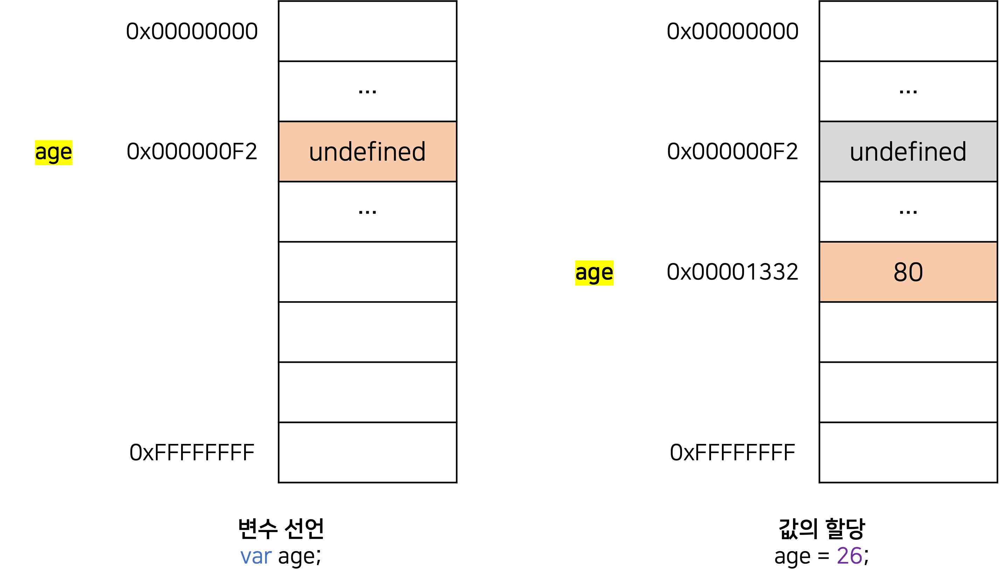

# Deep Dive Study - 1주차

<br/><br/>

<h1 align="center">4.변수</h1>

<br/><br/>

# 변수란 무엇인가? 왜 필요한가?

**변수**는 하나의 값을 저장하기 위해 확보한 메모리 공간 자체 또는 그 메모리 공간을 식별하기 위해 붙인 이름을 말한다(값의 위치를 가리키는 **상징적인 이름**이다).

**변수**는 프로그래밍 언어의 컴파일러 또는 인터프리터에 의해 <ins>값이 저장된 메모리 공간의 주소로 치환되어 실행</ins>된다.

**_자바스크립트는 개발자의 직접적인 메모리 제어를 허용하지 않는다._** 메모리 주소를 통해 값에 직접 접근하는 것은 치명적이 오류를 발생시킬 수 있기 때문이다. 따라서 변수를 통해 메모리에 안전하게 접근해야 한다.

| 변수 값          | 변수에 저장된 값                  |
| ---------------- | --------------------------------- |
| 할당(assignment) | 변수에 값을 저장하는 것           |
| 참조(reference)  | 변수에 저장된 값을 읽어 들이는 것 |

<br/><br/>

# 식별자

변수 이름을 **식별자(identifier)** 라고도 한다. 식별자는 어떤 값을 구별해서 식별할 수 있는 고유한 이름을 말한다.

<br/>

**식별자는 값이 아니라 메모리 주소를 기억하고 있다.**

값은 메모리 공간에 저장되어 있고, 식별자는 메모리 공간에 저장되어 있는 어떤 값을 식별해낼 수 있어야 한다. 이를 위해 <ins>식별자는 어떤 값이 저장되어 있는 메모리 주소를 기억(저장)해야 한다.</ins>

식별자는 **메모리 주소에 붙인 이름**이라고 할 수 있다.

식별자라는 용어는 변수 이름에만 국한해서 사용하지 않는다. 변수, 함수, 클래스 등의 이름은 모두 식별자다. 즉, 메모리 상에 존재하는 어떤 값을 식별할 수 있는 이름은 모두 식별자라고 부른다.

<br/><br/>

# 변수 선언

**변수 선언(variable declaration)** 이란 변수를 생성하는 것을 말한다.

값을 저장하기 위한 메모리 공간을 **확보**하고 변수 이름과 확보된 메모리 공간의 주소를 **연결**해서 값을 저장할 수 있게 준비하는 것이다.

변수를 사용하려면 반드시 선언이 필요하다. 변수를 선언할 때는 `var`, `let`, `const` 키워드를 사용한다.

<br/>

```js
var name;
```

> **자바스크립트 엔진은 변수 선언을 2단계에 거쳐 수행한다.**

- **선언 단계:** 이름을 등록해서 자바스크립트 엔진에 변수의 존재를 알린다.
- **초기화 단계:** 값을 저장하기 위한 메모리 공간을 확보하고 암묵적으로 `undefined`를 할당해 초기화한다.

<br/>

> **var 키워드를 사용한 변수 선언은 선언 단계와 초기화 단계가 동시에 진행된다.**

만약 초기화 단계를 거치지 않으면 확보된 메모리 공간에는 이전에 다른 애플리케이션이 사용했던 값이 남아 있을 수 있다. 이러한 값을 **쓰레기 값(garbage value)** 이라 한다.

`var` 키워드는 암묵적으로 초기화를 수행하므로 이러한 위험으로부터 안전하다.

<br/><br/>

# 변수 선언의 실행 시점과 변수 호이스팅

```js
console.log(age); // undefined

var age; // 변수 선언문
```

변수 선언은 런타임(소스코드가 한 줄씩 순차적으로 실행되는 시점)이 아니라 그 이전 단계에서 먼저 실행된다.

자바스크립트 엔진은 런타임 이전에 소스코드의 **평가 과정**을 거치면서 소스코드를 실행하기 위한 준비를 한다.

평가 과정에서 자바스크립트 엔진은 <ins>모든 선언문을 소스코드에서 찾아내 먼저 실행</ins>한다.
그리고 소스코드의 평가 과정이 끝나면 모든 선언문을 제외하고 소스코드를 한 줄씩 순차적으로 실행한다.

**_자바스크립트 엔진은 변수 선언이 소스코드의 어디에 있든 상관없이 다른 코드보다 먼저 실행한다._**

<br/>

> ✍🏻 **변수 호이스팅**
>
> 변수 선언문이 코드의 선두로 끌어 올려진 것처럼 동작하는 자바스크립트 고유의 특징을 변수 호이스팅(variable hoisting)이라 한다.

<br/><br/>

# 값의 할당

```js
var age;
age = 27;

// 단축 표현
var age = 27;
```

자바스크립트 엔진은 변수 선언과 값의 할당을 하나의 문으로 단축 표현해도 **변수 선언**과 **값의 할당**을 2개의 문으로 나누어 실행한다.

<br/>

> **변수 선언과 값의 할당의 실행 시점은 다르다.**

**변수 선언**은 런타임 이전에 먼저 실행되지만, **값의 할당**은 런타임에 실행된다.

```jsx
console.log(age); // undefined

var score = 80;

console.log(age); // 80
```

<br/>

<div style="max-width: 500px; margin: 0 auto;" >



</div>

<br/><br/><br/>

<h1 align="center">5. 표현식과 문</h1>

<br/>

# 값

**값(value)** 은 식(표현식)이 평가(evaluate)되어 생성된 결과를 말한다.

<br/><br/>

# 리터럴

**리터럴(literal)** 은 사람이 이해할 수 있는 문자 또는 약속된 기호를 사용해 값을 생성하는 표기법을 말한다.

<br/><br/>

# 표현식

**표현식(expression)** 은 <ins>값으로 평가될 수 있는 문(statement)</ins>이다. 표현식이 평가되면 새로운 값을 생성하거나 기존 값을 참조한다.

표현식은 리터럴, 식별자(변수, 함수의 이름), 연산자, 함수 호출 등의 조합으로 이뤄질 수 있다.

**_값으로 평가될 수 있는 문은 모두 표현식이다._**

```js
// 리터럴 표현식
10;
("Hello");

// 식별자 표현식
sum;
person.name;
arr[1];

// 연산자 표현식
10 + 20;
sum = 10;
sum !== 10;

// 함수,메서드 호출 표현식
square();
person.getName();
```

<br/><br/>

# 문

**문(statement)** 은 <ins>프로그램을 구성하는 기본 단위이자 최소 실행 단위</ins>다. 문의 집합으로 이뤄진 것이 프로그램이고, 문은 여러 토큰으로 구성된다.

**토큰(token)** 이란 문법적인 의미를 가지며, <ins>문법적으로 더 이상 나눌 수 없는 코드의 기본 요소</ins>를 의미한다.

```js
// 변수 선언문
var x;

// 할당문
x = 5;

// 함수 선언문
function foo() {}

// 조건문
if (x > 1) {
  console.log(x);
}

// 반복문
for (var i = 0; i < 2; i++) {
  console.log(i);
}
```

<br/><br/>

# 표현식인 문과 표현식이 아닌 문

문에는 표현식인 문과 표현식이 아닌 문이 있다. **표현식인 문**은 값으로 평가될 수 있는 문이며, **표현식이 아닌 문**은 값으로 평가될 수 없는 문을 말한다.

```jsx
// 변수 선언문은 표현식이 아닌 문이다.
var x;

// 할당문은 그 자체가 표현식이지만 완전한 문이기도 하다.
// 할당문은 표현식인 문이다.
x = 100;
```

<br/>

표현식인 문과 표현식이 아닌 문을 구별하는 가장 간단하고 명료한 방법은 <ins>변수에 할당해 보는 것</ins>이다.

```jsx
// 표현식이 아닌 문은 값처럼 사용할 수 없다.
var foo = var x;

// 표현식인 문은 값처럼 사용할 수 있다.
var foo = x = 100;
console.log(foo); // 100
```

<br/><br/><br/>

<h1 align="center">6. 데이터 타입</h1>

자바스크립트의 7개 데이터 타입은 **원시 타입(primitive type)** 과 **객체 타입(object type)** 으로 분류할 수 있다.

<br/><br/>

# 숫자 타입

자바스크립트는 하나의 숫자 타입만 존재한다.

ECMAScript 사양에 따르면 숫자타입은 **배정밀도 64비트 부동소수점 형식**을 따른다. 즉, 모든 수를 실수로 처리하며, 정수만 표현하기 위한 데이터 타입이 별도로 존재하지 않는다.

자바스크립트는 2진수, 8진수, 16진수를 표현하기 위한 데이터 타입을 제공하지 않기 때문에 모두 10진수로 해석한다.

```jsx
var binary = 0b01000001; // 2진수
var octal = 0o101; // 8진수
var hex = 0x41; // 16진수

console.log(binary); // 65
console.log(octal); // 65
console.log(hex); // 65
console.log(binary === octal); // true
console.log(octal === hex); // true
```

숫자 타입은 추가적으로 세 가지 특별한 값도 표현할 수 있다.

- **Infinity:** 양의 무한대
- **-Infinity:** 음의 무한대
- **NaN:** 산술 연산 불가

<br/><br/>

# 문자열 타입

자바스크립트의 문자열은 원시 타입임며, **변경 불가능한 값(immutable value)** 이다. 이것은 문자열이 생성되면 그 문자열을 변경할 수 없다는 것을 의미한다.

<br/><br/>

# 템플릿 리터럴

ES6부터 **템플릿 리터럴(template literal)** 이라는 새로운 문자열 표기법이 도입되었다.

템플릿 리터럴은 **백틱(``)** 을 사용해 표현한다.

<br/><br/>

# 불리언 타입

**불리언 타입**의 값은 논리적 참, 거짓을 나타내는 `true`와 `false`뿐이다. 불리언 타입은 조건문에서 자주 사용한다.

<br/><br/>

# undefined 타입

**undefined 타입**의 값은 `undefined`가 유일하다.

`var` 키워드로 선언한 변수는 암묵적으로 `undefined`로 초기화된다. `undefined`는 개발자가 의도적으로 할당하기 위한 값이 아니라 <ins>자바스크립트 엔진이 변수를 초기화할 때 사용하는 값</ins>이다.

📌 변수를 참조했을 때 undefined가 반환된다면 참조한 변수가 선언 이후 값이 할당된 적이 없는(초기화되지 않은) 것이다.

📌 개발자가 의도적으로 undefined를 변수에 할당하는 것은 undefined의 본래 취지와 어긋나고 혼란을 줄 수 있음므로 권장하지 않는다. 값이 없다는 것을 명시하기 위해서는 null을 사용한다.

<br/><br/>

# null 타입

**null 타입**의 값은 `null`이 유일하다.

프로그래밍 언어에서 `null`은 변수에 값이 없다는 것을 의도적으로 명시할 때 사용한다.

변수에 `null`을 할당하는 것은 **변수가 이전에 참조하던 값을 더 이상 참조하지 않겠다는 의미**이다. 이는 <ins>이전에 할당되어 있던 값에 대한 참조를 명시적으로 제거하는 것을 의미</ins>하며, 자바스크립트 엔진은 누구도 참조하지 않는 메모리 공간에 대해 가비지 콜렉션을 수행할 것이다.

<br/><br/>

# 심벌 타입

**심벌(Symbol)** 은 ES6에서 추가된 7번째 타입으로, 변경 불가능한 원시 타입의 값이다. 심벌 값은 다른 값과 중복되지 않는 유일무이한 값이다.

- 심벌은 주로 이름이 충돌할 위험이 없는 객체의 유일한 **프로퍼티 키**를 만들기 위해 사용한다.
- 심벌 이외의 원시 값은 리터럴을 통해 생성하지만 심벌은 **Symbol 함수**를 호출해 생성한다.

```js
var key = Symbol("key");
console.log(typeof key); // symbol

var obj = {};

obj[key] = "value";
console.log(obj[key]); // value
```

<br/><br/>

# 객체 타입

자바스크립트는 객체 기반의 언어이면, **자바스크립트를 이루고 있는 거의 모든 것이 객체**이다.

<br/><br/>

# 동적 타이핑

## 동적 타입 언어와 정적 타입 언어

정적 타입 언어는 변수를 선언할 때 변수에 할당할 수 있는 값의 종류, 즉 <ins>데이터 타입을 미리 선언해야 한다.</ins> 이를 **명시적 타입 선언**이라 한다.

자바스크립트는 정적 타입 언어와 다르게 변수를 선언할 때 타입을 선언하지 않는다. 어떠한 데이터 타입의 값이라도 자유롭게 할당할 수 있다.

**_자바스크립트의 변수는 선언이 아닌 할당에 의해 타입이 결정된다. 그리고 재할당에 의해 변수의 타입은 언제든지 동적으로 변할 수 있다._**

이러한 특징을 **동적 타이핑(dynamic typing)** 이라고 하고, 정적 타입 언어와 구별하기 위해 **동적 타입 언어**라 한다.

<br/><br/>

## 동적 타입 언어와 변수

자바스크립트는 개발자의 의도와는 상관없이 자바스크립트 엔진에 의해 암묵적으로 타입이 자동으로 변환되기도 한다. 동적 타입 언어의 변수는 언제든지 변경될 수 있기 때문에 <ins>값을 확인하기 전에는 타입을 확신할 수 없다.</ins>

결국 <ins>동적 타입 언어는 유연성(flexibility)은 높지만 신뢰성(reliability)은 떨어진다.</ins> 따라서 변수를 사용할 때 주의할 사항은 다음과 같다.

- 변수는 꼭 필요한 경우에 한해 제한적으로 사용한다.
- 변수의 유효 범위(스코프)를 최대한 좁게 만들어 변수의 부작용을 억제해야 한다.
- 전역 변수는 최대한 사용하지 않도록 한다.
- 변수보다는 상수를 사용해 값의 변경을 억제한다.
- 변수 이름은 변수의 목적이나 의미를 파악할 수 있도록 네이밍한다.

<br/><br/><br/>

<h1 align="center">7. 연산자</h1>

<br/><br/>

# 산술 연산자

## 이항 산술 연산자

| 이항 산술 연산자 | 의미   | 부수효과 |
| ---------------- | ------ | -------- |
| +                | 덧셈   | X        |
| -                | 뺄셈   | X        |
| \*               | 곱셈   | X        |
| /                | 나눗셈 | X        |
| %                | 나머지 | X        |

<br/>

## 단항 산술 연산자

| **단항 산술 연산자** | **의미**                                           | **부수효과** |
| -------------------- | -------------------------------------------------- | ------------ |
| ++                   | 증가                                               | O            |
| --                   | 감소                                               | O            |
| +                    | 어떠한 효과도 없다.                                | X            |
| -                    | 양수를 음수로, 음수를 양수로 반전한 값을 반환한다. | X            |

숫자 타입이 아닌 피연산자에 `+` 단항 연산자를 사용하면 피연산자를 숫자 타입으로 변환하여 반환한다. 단, 부수효과는 없다.

<br/>

## 문자열 연결 연산자

`+` 연산자는 <ins>피연산자 중 하나 이상이 문자열인 경우 문자열 연결 연산자로 동작</ins>한다. 그 외의 경우는 산술 연산자로 동작한다.

<br/><br/>

# 할당 연산자

| **할당 연산자** | **예**  | **동일 표현** | **부수 효과** |
| --------------- | ------- | ------------- | ------------- |
| =               | x = 5   | x = 5         | O             |
| +=              | x += 5  | x = x + 5     | O             |
| -=              | x -= 5  | x = x - 5     | O             |
| \*=             | x \*= 5 | x = x \* 5    | O             |
| /=              | x /= 5  | x = x / 5     | O             |
| %=              | x %= 5  | x = x % 5     | O             |

```jsx
var x;

// 할당문은 표현식인 문이다.
console.log((x = 10)); // 10
```

_할당문은 값으로 평가되는 표현식인 문으로서 할당된 값으로 평가된다._

위 예제의 할당문 x = 10은 x에 할당된 숫자 값 10으로 평가된다. 이러한 특징을 활용해 여러 변수에 동일한 값을 연쇄 할당할 수 있다.

```jsx
var a, b, c;
a = b = c = 0;
console.log(a, b, c); // 0 0 0
```

<br/><br/>

# 비교 연산자

**비교 연산자(comparison operator)** 는 좌항과 우항의 피연산자를 비교한 다음 그 결과를 불리언 값으로 반환한다.

## 동등/일치 비교 연산자

동등 비교 연산자는 느슨한 비교를 하지만 일치 비교 연산자는 엄격한 비교를 한다.

| **비교 연산자** | **의미**    | **사례** | **설명**                 | **부수효과** |
| --------------- | ----------- | -------- | ------------------------ | ------------ |
| ==              | 동등 비교   | x==y     | x와 y의 값이 같음        | X            |
| ===             | 일치 비교   | x!=y     | x와 y의 값과 타입이 같음 | X            |
| !=              | 부동등 비교 | x===y    | x와 y의 값이 다름        | X            |
| !==             | 불일치 비교 | x!==y    | x와 y의 값과 타입이 다름 | X            |

`NaN`은 자신과 일치하지 않는 유일한 값이다. 따라서 숫자가 `NaN`인지 판별하려면 `isNaN`을 사용한다.

```jsx
isNaN(NaN); // true
isNaN(10); // false
isNaN(1 + undefined); // true
```

양의 0과 음의 0을 비교하면 `true`를 반환한다.

```jsx
0 === -0; // true
0 == -0; // true
```

<br/>

> ✍🏻 **Object.is 메서드**
>
> ES6에서 도입된 `Object.is` 메서드는 예측 가능한 정확한 비교 결과를 반환한다.

```js
-0 === 0; // true
Object.is(-0, 0); // false

NaN === NaN; // false
Object.is(NaN, NaN); // true
```

<br/><br/>

# 삼항 조건 연산자

#### 삼항 연산자 사용

```jsx
var x = 2;
var result = x % 2 ? "홀수" : "짝수";
console.log(result);
```

#### if...else문 사용

```jsx
var x = 2,
  result;

if (x % 2) result = "홀수";
else result = "짝수";
console.log(result);
```

삼항 조건 연산자 표현식은 <ins>값으로 평가할 수 있는 표현식인 문</ins>이다. `if...else` 문은 <ins>표현식이 아닌 문</ins>이다. 따라서 `if...else` 문은 값처럼 사용할 수 없다.

조건에 따라 어떤 값을 결정해야 한다면 `if...else` 문보다 삼항 연산자 표현식을 사용하는 것이 유리하다 하지만, 조건에 따라 수행해야 할 문이 하나가 아니라 여러 개라면 `if...else` 문의 가독성이 더 좋다.

<br/><br/>

# 논리 연산자

| 논리 연산자 | 의미        | 부수 효과 |
| ----------- | ----------- | --------- |
| \|\|        | 논리합(OR)  | X         |
| &&          | 논리곱(AND) | X         |
| !           | 부정(NOT)   | X         |

**논리 부정(!) 연산자**는 언제나 불리언 값을 반환한다. 피연산자가 불리언 값이 아니라면 불리언 타입으로 암묵적 타입 변환된다.

**논리합(||)** 또는 **논리곱(&&) 연산자** 표현식의 평가 결과는 불리언 값이 아닐 수도 있다.

<br/><br/>

# 쉼표 연산자

쉼표(,) 연산자는 왼쪽부터 차례대로 피연산자를 평가하고 평가가 끝나면 마지막 피연산자의 평가 결과를 반환한다.

```jsx
var x, y, z;
(x = 1), (y = 2), (z = 3); // 3
```

<br/><br/>

# 그룹 연산자

소괄호(`( )`)로 피연산자를 감싸는 **그룹 연산자**는 자신의 피연산자인 표현식을 가장 먼저 평가한다.

```js
10 * 2 + 3; // -> 23

//그룹 연신자를 사용하여 우선순위를 조절
10 * (2 + 3); // -> 50
```

<br/><br/>

# typeof 연산자

**typeof 연산자**는 피연산자의 데이터 타입을 문자열로 반환한다. null을 반환하는 경우는 없으며, 함수의 경우 `"function"`을 반환한다. `typeof` 연산자가 반환하는 문자열은 7개의 데이터 타입과 정확히 일치하지는 않는다.

> ✍🏻 **typeof 연산자로 null값을 연산하면 object를 반환한다.**
>
> 자바스크립트의 첫 번째 버전의 버그이다. 기존 코드에 영향을 줄 수 있기 때문에 아직까지 수정되지 못하고 있다.

- ["typeof null"의 역사](https://github.com/FEDevelopers/tech.description/wiki/%E2%80%9Ctypeof-null%E2%80%9D%EC%9D%98-%EC%97%AD%EC%82%AC)

- [The history of “typeof null”](https://2ality.com/2013/10/typeof-null.html)

<br/>

> ✍🏻 **선언하지 않은 식별자를 typeof 연산자로 연산해보면 ReferenceError가 발생하지 않고 undefined를 반환한다.**

</aside>

<br/><br/>

# 지수 연산자

ES7에서 도입된 지수 연산자는 좌하의 피연산자를 **밑(base)** 으로, 우항의 피연산자를 **지수(exponent)** 로 거듭 제곱을 하여 숫자 값을 반환한다.

```js
2 ** 2; // 4
2 ** 2.5; // 5.65685424949238
2 ** 0; // 1
2 ** -2; // 0.25
```

<br/>

지수 연산자가 도입되기 전에는 `Math.pow` 메서드를 사용했다.

```js
Math.pow(2, 2); // 4
Math.pow(2, 2.5); // 5.65685424949238
Math.pow(2, 0); // 1
Math.pow(2, -2); // 0.25
```

<br/>

지수 연산자는 할당 연산자와 함께 사용할 수 있다.

```js
var num = 5;
num **= 2; // 25
```

<br/>

지수 연산자는 이항 연산자 중에서 우선순위가 가장 높다.

```jsx
2 * 5 ** 2; // 50
```

<br/><br/><br/>

<h1 align="center">8. 제어문</h1>

**제어문(control flow statement)** 은 조건에 따라 코드 블록을 실행(조건문)하거나 반복 실행(반복문)할 때 사용한다.

`forEach`, `map`, `filter`, `reduce` 같은 고차 함수를 사용한 함수형 프로그래밍 기법에서는 제어문 사용을 억제하여 복잡성을 해결하려고 노력한다.

<br/><br/>

# 블록문

**블록문(block statement/compound statement)** 은 0개 이상의 문을 **중괄호(`{ }`)** 로 묶은 것으로, 코드 블록 또는 블록이라고 부른다. **_자바스크립트는 블록문을 하나의 실행 단위로 취급한다._**

```jsx
// 블록문
{
  var foo = 10;
}

// 제어문
var x = 1;
if (x < 10) {
  x++;
}

// 함수 선언문
function sum(a, b) {
  return a + b;
}
```

<br/><br/>

# 조건문

**조건문(conditional statement)** 은 주어진 조건식의 평가 결과에 따라 코드 블록(블록문)의 실행을 결정한다.

자바스크립트는 조건문으로 **if ... else 문**과 **switch 문**을 제공한다.

<br/>

## if...else 문

1. if 문의 조건식은 불리언 값으로 평가되어야 한다.
   - 불리언 값이 아닌 다른 값으로 평가되면 자바스크립트 엔진에 의해 암묵적으로 불리언 값으로 강제 변환된다.
2. else if 문과 else 문은 옵션이다.
3. 대부분의 if...else 문은 삼항 조건 연산자로 바꿔 쓸 수 있다.
4. 조건에 따라 단순히 값을 결정하여 변수에 할당하는 경우 if...else 문보다 삼항 조건 연산자를 사용하는 편히 가독성이 좋다.

<br/>

## switch 문

1. break 문을 사용하지 않으면 switch 문을 탈출하지 않고 switch 문이 끝날 때까지 이후의 case 문과 default 문을 실행한다.
2. default 문의 실행이 종료되면 switch 문을 빠져나간다. 따라서 별도로 break 문이 필요 없다.

```jsx
var year = 2000;
var month = 2;
var days = 0;

switch (month) {
  case 1:
  case 3:
  case 5:
  case 7:
  case 8:
  case 10:
  case 12:
    days = 31;
    break;
  case 4:
  case 6:
  case 9:
  case 11:
    days = 30;
    break;
  case 2:
    days = (year % 4 === 0 && year % 100 !== 0) || year % 400 === 0 ? 29 : 28;
    break;
  default:
    console.log("Invalid Month");
}

console.log(days); // 29
```

<br/><br/>

# 반복문

> ✍🏻 **반복문을 대체할 수 있는 다양한 기능**
>
> 배열을 순회할 때 사용하는 `forEach` 메서드, 객체의 프로퍼티를 열거할 때 사용하는 `for...in` 문, ES6에서 도입된 이터러블을 순회할 수 있는 `for...of` 문과 같이 반복문을 대체할 수 있는 다양한 기능을 제공한다.

## for 문

for 문의 변수 선언문, 조건식, 증감식은 모두 옵션이다. 단, 어떤 식도 선언하지 않으면 무한루프가 된다.

<br/>

## while 문

**while 문**은 반복 횟수가 불명확할 때 주로 사용한다.

<br/>

## do...while 문

**do...while 문**은 코드 블록을 먼저 실행하고 조건식을 평가한다. 따라서 코드 블록은 무조건 한 번 이상 실행된다.

<br/><br/>

# break 문

**break 문**은 레이블 문, 반복문, switch 문의 코드 블록을 탈출한다. break 문을 레이블 문, 반복문, switch 문 외에 다른 곳에서 사용하면 SyntaxError가 발생한다.

> ✍🏻 **레이블 문**
>
> 레이블 문은 프로그램의 실행 순서를 제어하는 데 사용한다. switch 문의 case 문과 default 문도 레이블 문이다.

```jsx
outer: for (var i = 0; i < 3; i++) {
  for (var j = 0; j < 3; j++) {
    if (i + j === 3) break outer;
    console.log(`inner [${i}, ${j}]`);
  }
}
console.log("Done!");
```

<br/><br/>

# continue 문

**continue 문**은 반복문의 코드 블록 실행을 현 지점에서 중단하고 반복문의 증감식으로 실행 흐름을 이동시킨다.

```jsx
// continue 문을 사용하지 않으면 if 문 내에 코드를 작성해야 한다.
for (var i = 0; i < string.length; i++) {
  if (string[i] === search) {
    count++;
    // code
    // code
  }
}

// continue 문을 사용하면 if 문 밖에 코드를 작성할 수 있다.
for (var i = 0; i < string.length; i++) {
  if (string[i] !== search) continue;

  count++;
  // code
  // code
}
```

`if` 문 내에서 실행할 코드가 한 줄이라면 `continue` 문을 사용했을 때보다 간편하고 가독성이 좋다. 하지만, `if` 문 내에서 실행해야 할 코드가 길다면 들여쓰기가 한 단계 더 깊어지므로 `continue` 문을 사용하는 편이 가독성이 더 좋다.
