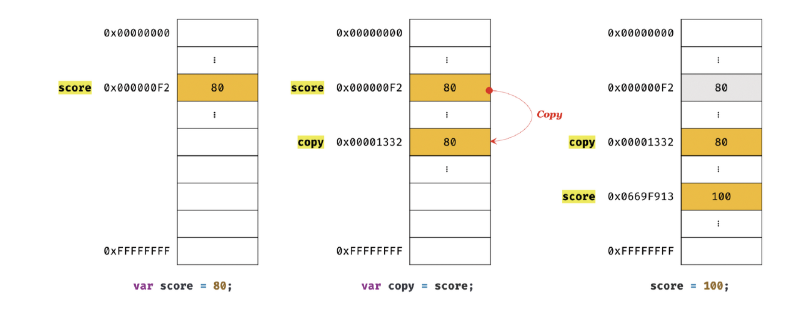
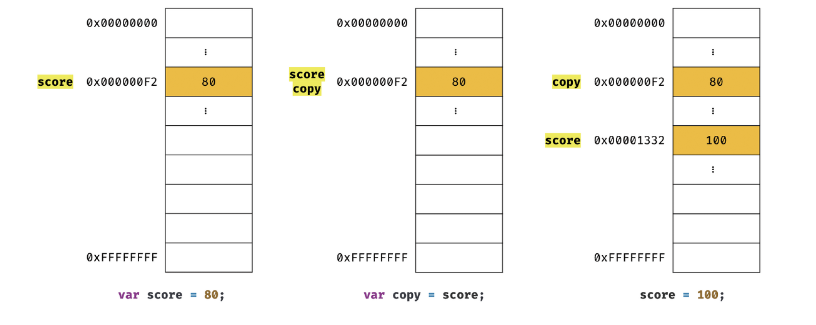
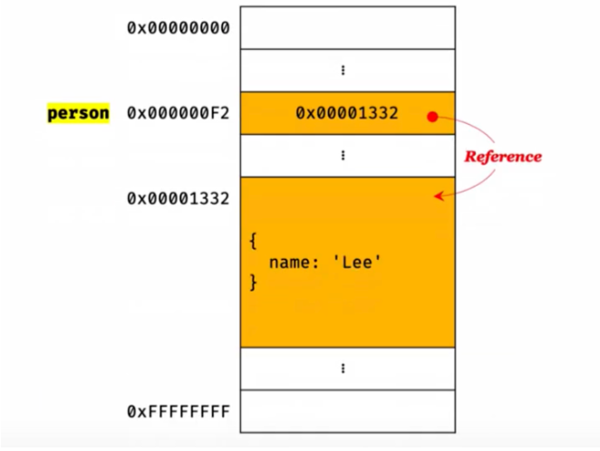
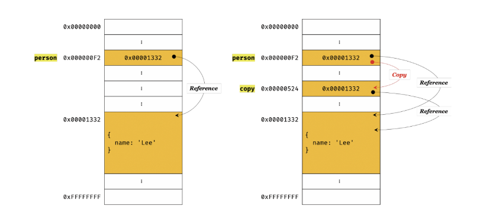
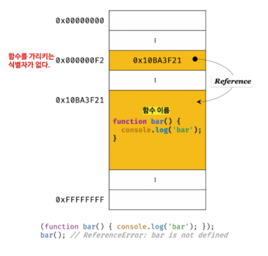
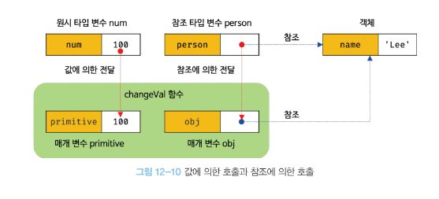

# 9장 타입 변환과 단축 평가

### 9.1.1 타입 변환이란?

자바스크립트의 모든 값은 타입이 있다. 개발자가 의도적으로 타입을 변환하는 것을 **'명시적 타입 변환'** 또는 '타입 캐스팅'이라 한다.

이 코드는 숫자 11을 문자열 11로 명시적 타입 변환한 것이다.

```jsx
var x = 11;

var str = x.toString();
```

표현식을 평가하는 도중에 자바스크립트 엔진에 의해 암묵적으로 타입이 자동변환 되기도 하는데 이를 `'암묵적 타입 변환'` 또는 `'타입 강제 변환'`이라 한다.
이 코드는 숫자와 문자열을 연산하여 문자열로 강제 형 변환한 것이다.

- 명시적 타입 변환은 **개발자가 의도적으로** 값의 타입을 변환하는 것
- 암묵적 타입 변환은 표현식 평가시 **개발자가 의도와는 관계 없이** 값의 타입을 변환하는 것

형 변환이 기존 원시 값을 직접 변경하는 것이 아니라 기존 원시 값을 사용해 다른 타입의 새로운 원시 값을 생성하는 것이다.

즉, 암묵적 타입변환은 타입을 변환하여 새로운 타입의 값을 만들고 단 한 번 사용하고 버린다!

따라서 타입 변환 결과를 예측하지 못하거나 예측이 결과와 일치하지 않을 오류 가능성 UP

### 9.2 암묵적 타입 변환

암묵적 타입 변환이 발생하면 문자열, 숫자, 불리언과 같은 원시 타입 중 하나로 타입을 자동 변환하는데, Symbol 타입은 아래와 같이 타입 에러가 발생한다.

```jsx
Symbol() + ""; // TypeError: cannot convert a symbol value to a string
```

### 9.2.1 문자열 타입으로 변환

연산자는 피연산자 중 **하나 이상이 문자열일 때 문자열 연결 연산자로 동작**하고, 모든 피연산자는 문맥상 문자열타입으로 암묵적 타입 변환되어 문자열 값을 반환한다.

```jsx
1 +
  "2" // '12'
  `1 + 1 = ${1 + 1}`; // "1 + 1 = 2"
```

템플릿 리터럴 표현식 삽입의 경우, 표현식 결과를 문자열 타입으로 암묵적 타입 변환한다.

### 9.2.2 숫자 타입으로 변환

+를 제외한 산수 연산자는 숫자 값을 만드는 것이 목표!

따라서 코드 문맥상 모두 숫자 타입으로 강제 형 변환하여 평가 후 결과를 반환한다.

```jsx
1 - "1"; // 0
1 * "one"; // NaN
```

비교 연산자의 역할은 불리언 값을 만드는 것으로 숫자 타입이 아닌 피연산자를 숫자 타입으로 암묵적 타입 변환한다.

- 빈 문자열( '' ), 빈 배열( []), null, false는 0으로, true는 1로 변환
- 객체와 빈 배열이 아닌 그 외 배열, undefined는 반환되지 않아 NaN

```jsx
+"" + // 0
  null + // 0
  [] + // 0
  false; // 0
```

### 9.2.3 불리언 타입으로 변환

자바스크립트 엔진은 불리언 타입이 아닌 값을 Truthy 값(참으로 평가되는 값) 또는 Falsy 값(거짓으로 평가되는 값)으로 구분한다.

따라서 불리언 값으로 평가되어야 할 문맥에서 Truthy 값은 true로, Falsy 값은 false로 암묵적 타입 변환!

※ Falsy 값이란?
: Boolean 문맥에서 false 로 평가되는 값이다. false, undefined, null, 0, -0, NaN, ''(빈 문자열)

### 9.3 명시적 타입 변환

**[명시적 타입 변환의 방법]**

1. 표준 빌트인 생성자 함수(String, Number, Boolean)를 new 연산자 없이 호출하는 방법
2. 빌트인 메서드를 사용하는 방법
3. 암묵적 타입 변환 방법

> 표준 빌트인 생성자 함수와 빌트인 메서드란?
>
> _: 자바스크립트에서 기본 제공하는 함수로, 표진 빌트인 생성자 함수는 객체를 생성하기 위한 함수이며 new 연산자와 함께 호출한다. 표준 빌트인 메서드는 String, Number와 같은 new 연산자 없이 사용하는 메서드로 빌트인은 '미리 만들어진'을 의미한다._

### 9.3.1-2 타입 변환

[문자열 타입으로 변환하는 방법]

```jsx
// 1. String 생성자 함수를 new 연산자 없이 호출하는 방법
String(126);

// 2. toString 메서드를 사용하는 방법
(126).toString();

// 3. 문자열 연결 연산자를 이용하는 방법
126 + "";
```

[숫자타입으로 변환하는 방법]

```jsx
// 1. Number 생성자 함수를 new 연산자 없이 호출하는 방법
Number("10.51"); // 10.53

// 2. parseInt.parseFloat 함수를 사용하는 방법(문자열만 가능)
parseInt("-1"); // -1

// 3. + 단항 산술 연산자를 이용하는 방법
+"0"; // 0

// 4. * 산술 연산자를 이용하는 방법
true * 1; // 1
```

### 9.4.1 논리 연산자를 사용한 단축 평가

: 논리합( || ) 또는 논리곱( && ) 연산자 표현식은 언제나 **2개의 피연산자 중 한쪽으로 평가된다.**

```jsx
"Cat" && "Dog"; // "Dog"
```

- 두 개의 피연산자가 모두 true로 평가될 때 true를 반환

  - [좌항 ➡️ 우항으로 평가 진행] 'Cat'은 Truthy 값이므로 true로 평가되는데 앞서 이야기한 대로 &&은 두 개의 피연산자가 모두 평가되어야 표현식의 평가 결과가 결정되기 때문에 'Dog'도 평가되고, 'Dog'도 마찬가지로 true로 평가된다.
  - 이때 **둘 다 true라면 최종 평가된 'Dog'가 반환**된다.

```jsx
"Cat" || "Dog"; // "Cat"
```

- 논리합 경우 두 개의 피연산자 중 true가 나오면 그 이후 피연산자는 평가하지 않아도 표현식을 평가할 수 있다.
  - 그래서 'Cat'이 그대로 반환되고 'Dog'는 평가 X

이처럼 논리 연산의 결과를 결정하는 피연산자를 타입 변환하지 않고 그대로 반환하는것을 **단축 평가**라 한다.

단축평가는 표현식을 평가하는 도중에 평가 결과가 확정된 경우 나머지 평가 과정을 생략하는 것으로 아래 두 if문을 보면 첫 번째 if문은 우항이 평가되지 않아 (num+=15)가 평가되지 않는다.

```jsx
let num = 1;

if (4 > 0 || (num += 15)) {
  console.log(num);
}

if ((num += 1) || 4 > 0) {
  console.log(num);
}
```

### 9.4.1 함수 매개변수에 기본 값 설정

함수를 호출할 때 인수를 전달하지 않을 경우 매개변수는 undefined가 할당!

> 단축평가를 사용해 기본값을 설정하면 undefined로 인해 발생할 수 있는 에러를 방지
>
> 두 코드는 동일한 결과를 반환하는데, 두 번째 코드는 ES6의 문법으로 매개변수에 초기값을 아예 할당할 수 있다는 장점 👍

```jsx
function getStringLength(str) {
  str = str || "";
  return str.length;
}

function getSTringLength(str = "") {
  return str.length;
}

getSTringLength(); // 0
getSTringLength("hi"); // 2
```

### 9.4.2 옵셔널 체이닝 연산자

ES11에서 도입된 옵셔널 체이닝 연산자 ? 는 좌항의 피연산자가 null 또는 undefined인 경우 undefined를 반환하고, 그렇지 않으면( 피연산자라 Falsy 값이라도 ) 우항의 프로퍼티 참조를 이어간다.

```jsx
const user = {
  name: "John",
  address: {
    city: "Seoul",
  },
};

// 일반적인 프로퍼티 접근
console.log(user.address.city); // 'Seoul'

// 존재하지 않는 프로퍼티에 접근할 경우 오류 발생
console.log(user.address.street); // undefined (문제 없음)
console.log(user.contact.phone); // 오류 발생! Cannot read property 'phone' of undefined

// 옵셔널 체이닝 사용
console.log(user.address?.city); // 'Seoul'
console.log(user.address?.street); // undefined (안전하게 처리됨)
console.log(user.contact?.phone); // undefined (오류 없이 안전하게 처리됨)
```

1. 기존 방식: user.contact.phone와 같이 깊이 있는 프로퍼티에 접근할 때, contact 객체가 정의되지 않으면 오류가 발생

2. **옵셔널 체이닝 사용**: user.contact?.phone 처럼 옵셔널 체이닝을 사용하면, contact가 null 또는 undefined일 때, 오류 대신 undefined가 반환되어 코드가 중단되지 않고 안전하게 실행

# 10장 객체 리터럴

### 10.1 객체란?

: 자바스크립트는 객체(object) 기반의 프로그래밍 언어로 원시 값을 제외한 자바스크립트를 구성하는 거의 모든 것 (함수, 배열, 정규 표현식 등)이 객체다.

- 객체 타입은 다양한 타입의 값을 하나의 단위로 구성한 복합적인 자료구조(data structure)다.
- 원시 값은 변경 불가능한 값(immutable value)이지만 객체 타입의 값은 변경 가능(mutable value)하다.
- 객체는 0개 이상의 프로퍼티로 구성된 집합이며, 프로퍼티는 키와 값으로 구성된다.
  이는 콜론( : )으로 구분한다.

자바스크립트의 함수는 일급 객체이므로 값으로 취급할 수 있고, 프로퍼티 값이 함수일 경우, 일반 함수와 구분하기 위해 메서드라 부른다.
jsx

```jsx
var human = {
  name: 'Lee',
  age: 30
  sayHello : function () {
    console.log`Hello! My name is ${this.name}.`);
};
}
```

위의 코드에서 `human.sayHello()`가 메서드다. 객체는 프로퍼티와 메서드로 구성된 집합체로 위의 코드에서 `name`과 `age`는 프로퍼티에 해당한다. 이처럼 상태와 동작을 하나의 단위로 구조화할 수 있어 유용하고, 객체의 집합으로 프로그램을 표현하려는 프로그래밍 패러다임을 `객체지향 프로그래밍(OOP, Object Oriented Programming)`이라 한다.

> **일급 객체**란?
>
> 객체가 함수의 변수로 활용이 가능 OR 인자로 넘길 수 있음 OR 변수에 할당할 수 있는 등, 연산을 지원할 때 일급객체라 한다.
>
> **일반적으로 객체 내에 자바스크립트의 함수는 표현식으로 할당되는데 표현식이 결과가 값으로 반환되는 것과 마찬가지라 볼 수 있다.**

> **객체와 함수의 연관관계란?**
>
> 자바스크립트의 객체는 함수와 밀접한 관계를 가진다. 함수로 객체를 생성할 수도 있고, 함수 자체가 객체이기도 하기 때문에 함수와 객체는 분리해서 생각할 수 없다.

### 10.3 프로퍼티

객체는 프로퍼티의 집합이며, 프로퍼티는 키와 값으로 구성

- 프로퍼티 키 : 빈 문자열을 포함한 모든 문자열 또는 심벌 값
- 프로퍼티 값 : 자바스크립트에서 사용할 수 있는 모든 값
  - 프로퍼티 키는 문자열이므로 **따옴표( '...' 또는 "..." )**로 묶어야 한다.
  - 식별자 네이밍 규칙을 따르지 않는 이름에는 반드시 따옴표를 사용해야 한다.

```jsx
var person = {
  firstName: "Dong-won",
  "last-name": "Kang",
  "": "",
  0: 0,
  "last-name": "Kim",
};
```

- 네이밍 규칙을 준수하는 경우 따옴표를 생략할 수 있지만, last-name의 경우 식별자 네이밍 규칙을 준수하지 않기 때문에 따옴표를 생략할 수 없다.( -를 연산자가 있는 표현식으로 해석한다.)
- 빈 문자열도 프로퍼티 키로 사용할 수 있으나 의미를 갖지 못하므로 권장하지 않는다.
- 프로퍼티 키에 문자열이나 심벌 값 외의 값을 사용하면 `암묵적 타입 변환`을 통해 문자열이 된다.
- 프로퍼티 키를 중복 선언하면 먼저 선언한 프로퍼티를 덮어쓰고 나중에 선언한 프로퍼티가 적용된다. **이때 에러가 발생하지 않는다는 것에 주의**

### 10.5 프로퍼티 접근

[프로퍼티에 접근하는 방법]

1. 마침표 프로퍼티 접근 연산자(.)를 사용하는 `마침표 표기법`(dot notation)
2. 대괄호 프로퍼티 접근 연산자([...])를 사용하는 `대괄표 효기법`(bracket notation)

**[주의]**

- 대괄호 프로퍼티 접근 연산자 내부에서 지정하는 프로퍼티 키는 반드시 `따옴표`로 감싼 문자열이어야 한다.
- 네이밍 규칙을 준수하지 않는 이름은 반드시 대괄호 표기법을 사용해야 하며, 객체에 존재하지 않는 프로퍼티에 접근하면 `undefined`를 반환한다.

  **(이때 ReferenceError가 발생하지 않는데 주의해야 한다.)**

### 10.6 프로퍼티 값 갱신

이미 존재하는 프로퍼티에 값을 재할당하면 프로퍼티 값이 갱신된다.

`BUT` 이는 단점이 더 큰데 기존에 동일한 프로퍼티가 있다는 어떠한 메세지도 나타나지 않고 이에 타입스크립트가 나온 여러 이유 중 하나이기도 하다.

### 10.7 프로퍼티 동적 생성

존재하지 않는 프로퍼티에 대해 값을 할당하면 프로퍼티가 동적으로 생성 및 추가되고 값이 할당된다.

```jsx
var human = {
  name: "Lee",
};

human.age = 30;

console.log(human); // {name: 'Lee', age: 30}
```

### 10.8 프로퍼티 삭제

`delete` 연산자는 객체의 프로퍼티를 삭제한다. `delete` 연산자의 피연산자는 프로퍼티 값에 접근할 수 있는 표현식이어야 한다. 주의할 것은 존재하지 않는 프로퍼티를 삭제하더라도 에러가 발생하지 않는다.

```jsx
var person = {
  name: "Lee",
  age: 20,
};

delete person["a" + "ge"]; // true
console.log(person); // {name: 'Lee'}
```

# 11장 원시 값과 객체의 비교

### 11.1 원시 값

### 11.1.2 불변성

원시 값은 변경 불가능 한 값이다.
[특징]

- 재할당은 가능하지만, **변하지 않는다.**
- 변경이 불가능하기에 재할당 시에도 메모리 공간에서 값이 바뀌는 게 아니라 **새로운 메모리 공간을 확보하고 재할당한 값을 저장한 후, 변수가 참조하던 메모리 공간을 변경한다.**

이런 원시 값의 특성은 데이터의 신뢰성을 보장하며 이런 특성을 `불변성`(immutabillity)이라 한다.

만약 값이 변한다면, 상태 변경을 추적하기 어렵다...

### 11.1.2 문자열

숫자나 불리언과 달리 문자열의 크기는 정해지지 않았다. 이에 다른 언어들은 문자열을 문자의 배열이나 String 객체로 처리하는 등에 방법을 쓰지만, 자바스크립트는 문자열이라는 원시타입 객체를 제공한다.

그렇기 때문에 문자열이 생성되면 불변한다.

> 하지만, 문자열을 `유사 배열 객체`이면서 `이터러블`이므로 `배열`과
> 유사하게 각 문자에 접근할 수 있다.

```jsx
// 유사 배열 객체 : 마치 배열 처럼 인덱스로 프로퍼티 접근 가능하며  // length 프로퍼티를 갖는 객체

var str = "string";
str[0] = "A";
console.log(str); //string
```

### 11.1.3 값에 의한 전달

```jsx
var score = 80;
var copy = score;

console.log(score, copy); // 80, 80

score = 100;

console.log(score, copy); // 100,80
```

copy = score인데, 왜 둘은 다를까?

이는 `값에 의한 전달`이기 때문이다. 이 두가지 방식을 책에 나와있는 그림으로 설명하면

1.  **주소에서 값을 복사하여 새로운 메모리에 할당하고 변수에 연결**
    
    이 방법은 `score` 값이 변경되는 것과 `copy`가 아무 관계가 없다.

2.  **같은 주소에 할당(Like Python)**
    
    재할당을 할 경우(2->3)에는 다른 메모리에 새로운 값이 할당되기 때문에 관계가 없다.
    **따라서 값에 의한 전달은 기존의 변수가 변해도 복사된 변수와 관계가 없다.**

### 11.2 객체

- 프로퍼티 개수 정해져있지 않다.
- 동적으로 삭제 OR 추가 가능
- NO 제약
  ➡️ 메모리 크기 사전 할당 불가 + 자료구조 복잡, 크기가 클 수도 있어서 메모리 낭비를 막기 위해 관리 방법 다름

#### 11.2.1 변경 가능한 값


객체는 변수를 참조하면 참조 값을 통해 실제 객체에 접근하기에 변경 가능하다.

위 경우 변경 가능한 값이기에 객체를 직접 수정해버리면 된다. 원시 값처럼 매 번 새로 생성하면 신뢰성과 불변성을 확보할 수는 있지만, 크기가 매우 클 수도 있어서(프로퍼티가 객체이거나 매우 많은 프로퍼티를 가진 객체일 경우) **복사해서 생성하는 비용이 많이 든다.**

이는 메모리의 효율적 소비를 어렵고 성능이 나빠지게 만든다. 그래서 그런 점을 감안해서 만들어진 설계이다.

BUT 이런 설계에도 단점이 있는데 **여러 개의 식별자가 하나의 객체를 공유**할 수 있다는 점이다.

### 11.2.2 참조에 의한 전달

객체가 가리키는 변수를 다른 변수에 입력하면 원본의 참조값이 복사되어 전달되는 데 이를 **참조에 의한 전달**이라 표현한다.

(메모리 주소값을 전달하는 것이기에 값에 의한 전달은 맞지만 둘의 차이점을 보여주기 위해 구분 지은 그림이다.)

`person`과 `copy`는 모두 0x00001332를 가리키고 0x00001332가 변하면 양쪽 다 영향을 끼친다.

# 12장 함수

### 12.1 함수란?

함수는 일련의 과정을 문으로 구현하고 코드 블록으로 감써서 하나의 실행 단위로 정의한 것이다.

매개변수, 인수, 반환값 등이 있으며 식별자인 함수 이름을 사용할 수도 있다.

인수를 통해서 함수에 매개변수를 전달하고, 함수의 실행을 지시하는 것을 **함수의 호출**이라 한다.

```jsx
function 함수이름 (매개변수1, 매개변수2, ...) {
	return 반환값
} // 함수정의

함수이름(인수1, 인수2) // 함수호출

// 예시
function add (x,y) {
	return x+ y
}

add(x,y) // 함수호출
```

### 12.2 함수를 사용하는 이유

1. 유지보수의 편의성이 높아진다.
2. 코드의 신뢰성을 높여준다.
3. 코드의 가독성을 높여준다. _(함수명이 잘지어졌을 경우)_

### 12.3 함수 리터럴

함수도 리터럴로 사용할 수 있다.

리터럴은 약속된 기호 등을 통해 값을 생성하기 위한 표기법이고, 함수 리터럴도 평가되어 값을 생성하며, 이 값은 객체다. **(즉, 함수는 객체다)**

함수 객체는 일반 객체와 달리 호출할 수 있으며, 일반 객체에는 없는 함수 객체만의 고유한 프로퍼티를 갖는다.

### 12.4 함수 정의

**[함수 선언]**

1. 함수 선언문

```jsx
function add(x, y) {
  return x + y;
}
```

- 함수 선언문은 **함수 이름을 생략할 수 없으며**, **표현식이 아닌 문**이다.

  (평가는 되지만, undefined가 나옴)

2. 함수 리터럴

```jsx
var myAdd = function add(x, y) {
  return x + y;
};
```

- 함수를 리터럴로 사용하는 함수 표현식도 존재한다.

  (함수 표현식인만큼 표현식인 문이다.)

  하지만,변수에 표현식이 아닌 문을 할당할 수 없다. ( ex. var foo = var x)

**Q. 왜 함수 선언문(표현식이 아닌 문)은 변수에 할당할 수 있는 걸까?**

**A. 함수 선언문이 아니라 함수 리터럴을 할당 했기 때문이다.**

함수 선언문과 리터럴이 동일하게 생겨서 생기는 오류로, {}가 코드 블록이 될 수도 있고, 객체 리터럴이 될 수도 있는 것처럼, 함수 선언문은 `함수 리터럴`이 될 수 있기도 하고, `함수 선언문`이기도 하다.

이 경우 변수에 할당되었으므로 자바스크립트가 `함수 리터럴`로 판단한다.


CASE ) 함수 리터럴 표현식을 사용하고 변수에 할당하지 않으면 식별자가 없어 함수를 호출할 수 없다. 이 경우에 함수 선언문으로 선언한 함수가 왜 불러와질까?

➡️ 이유는 자바스크립트 엔진이 암묵적으로 함수 이름과 같은 식별자를 생성하고 함수 객체를 할당 해주기 때문이다.
**값의 성질을 가지는 객체**를 `일급 객체`라고 하며, **자바스크립트 함수는 일급 객체**이다.

### 12.4.3 함수 생성 시점과 호이스팅

함수 선언문은 호출할 수 있지만, 함수 표현식은 호출할 수 없다.

왜냐하면 **둘의 생성 시점이 다르기 때문**이다 !

```jsx
console.dir(add); //[Function : add]
console.dir(myAdd); // undefined

console.log(add(2, 5)); // 7
console.log(myAdd(2, 5)); // TypeError : myAdd is not a function

function add(x, y) {
  return x + y;
}

var myAdd = function add(x, y) {
  return x + y;
};
```

함수 선언문이 코드의 선두로 올려진 것처럼 동작하는 자바스크립트 고유의 특징을 `함수 호이스팅`이라 한다.

선언과 할당의 타이밍이 다른 것처럼, **함수 선언문은 함수 호이스팅으로 호출이 가능**하지만, 함수 표현식은 할당이 되지 않아 변수 호이스팅에 의해서 `undefined`가 나오게 된다.

즉, 변수 할당문은 런타임에 평가되면서 함수 객체가 된다.

> 함수 호이스팅은 함수를 호출하기 전에 반드시 함수를 선언해야한다는 규칙을 무시하기에 더글라스 크락포드는 함수 선언문 대신 함수 표현식을 사용할 것을 권장한다...?

### 12.5 함수 호출

함수를 호출하면 인수를 통해서 매개변수에 값을 전달한다.

이 때, 인수는 함수를 호출할 때 지정하며 개수나 값에 제한을 두지 않는다.

그리고 인수가 부족할 시, 해당 매개변수는 `undefined`로 초기화가 된다.

```jsx
function add(x, y) {
  return x + y;
}

add(2, 5); //7, 정상사용
add(2, 5, 10); // 7, 인수 초과사용 이 경우 뒤에 인수 무시
add(2); // NaN, 인수 부족, 2 + undefined = NaN
add("1", "2"); //'12', 인수 타입 이상 예상 결과는 다르지만 함수는 동작함
```

이런 문제를 방지하려면

1. 인수의 타입과 개수 확인 로직
2. 기본값 설정 (Typescript를 사용하여서 정적 타입 검사를 하는 것도 가능)

### 12.6 참조에 의한 전달과 외부 상태의 변경

함수가 매개변수에 값을 전달하는 방식은 **매개변수의 값**에 따라서 다르다.

#### 만약 값이 원시 값일 경우?

값에 의한 전달(호출)로 그 값을 다른 곳에 **재할당**한다.

#### 객체일 경우 ?

참조에 의한 전달(호출)로 그 주소값을 전달하여 매개변수를 수정하면 그 값이 수정되는 경우가 생긴다.



이는 예기치 못한 문제를 만들거나 상태 변화를 추적하기 어렵게 만들고 코드의 복잡성을 증가시키거나 가독성을 해치는 원인이된다.

이와 같은 문제를 해결하려면 `옵저버 패턴`을 추가하는 등의 추가 대응을 하거나 `deep copy`를 통해서 불변 객체를 생성하는 방법이 있다.

### 12.7 다양한 함수의 형태

#### 1. 즉시실행함수(IEF : Immediately Invoked Function Expression)

즉시 실행 함수는 보통 무기명함수(기명도 가능하다)로 작성하며, 단 한 번만 호출되며 다시 호출할 수 없다.

즉시 실행 함수를 사용하면 불필요한한 변수나 함수가 적어지고 이들의 이름의 충돌을 방지할 수 있는 장점이 있다.

```jsx
(function () {
  var a = 3;
  var b = 5;
  console.log(a + b);
})();
```

그러나 반드시 그룹 연산자()로 감싸야하며 그렇지 않을 경우 에러가 발생한다!!!

왜냐하면, 그룹 연산자()로 감싸면서 함수리터럴로 평가가 되어서 함수객체가 생성할 수 있기 때문이다.

#### 2. 재귀함수

함수가 스스로를 호출하는 것은 `재귀 호출`(recursive call)이라 부른다. (재귀 함수: 자기 자신을 호출하는 행위, 즉 **재귀 호출을 수행하는 함수**)

```jsx
// 일반적인 반복 함수
function coundown(n) {
  for (var i = n; i > 0; i--) console.log(i);
}

// 재귀 함수
function countdownRecursive(n) {
  if (n == 0) return;
  console.log(n);
  countdownRecursive(n - 1);
}
```

- 함수 이름은 함수 몸체 내부에서만 유효하기에 함수 이름을 함수 내부에서 사용가능하다.

  (외부에서는 반드시 함수를 가리키는 식별자를 사용해야함)

- 재귀함수는 무한 호출이 될 수 있으므로 반드시 `종료 조건`을 넣어줘야한다. `return`!

#### 3.중첩함수(내부 함수)

함수 내부에 정의된 함수를 뜻하며, 중첩함수를 포함하는 함수를 외부함수라고 부른다.

중첩 함수는 외부 함수 내부에서만 호출 가능하다.

#### 4.콜백함수

```jsx
function repeat(n) {
  for (var i = 0; i < n; i++) console.log(i);
}

function repeat2(n) {
  for (var i = 0; i < n; i++) {
    if (i % 2) console.log(i);
  }
}

repeat(3); // 0, 1, 2
repeat2(3); //
```

전체적인 흐름은 똑같지만 함수의 일부분이 다르다면, 새로운 함수를 다시 정의해야한다.

이런 문제를 해결하는 방법은 함수를 합성하는 것이다. 변하지 않는 공통 로직을 정의하고, 변하는 부분은 함수 외부에서 내부로 전달하는 것이다.

```jsx
function repeat(n, f) {
  for (var i = 0; i < n; i++) f(i);
}

var logAll = function (i) {
  console.log(i);
};

var logOdds = function (i) {
  if (i % 2) console.log(i);
  return 3;
};

repeat(3, logAll); // 0,1,2
repeat(3, logOdds); // 1
```

위 코드와 결과는 동일하지만 추상화된 함수를 전달받아서 수행하면서 하나의 함수로 더욱 유연하게 표현할 수 있게 되었다.

이처럼 함수의 매개변수를 통해 다른 함수의 내부로 전달되는 함수를 `콜백함수(callback function)`라 한다. 그리고 매개 변수를 통해 함수의 외부에서 콜백 함수를 전달받은 함수를 `고차 함수(Higher-Order Function HOF)`라고 한다.

즉, **고차함수는 콜백함수를 자신의 일부분으로 합성**한다. 그리고 이 고차함수가 콜백함수를 알맞은 시점에 호출한다.

단, 콜백 함수의 매개변수로서 전달된 함수 리터럴은 고차 함수가 호출될 때마다 평가되어 함수 객체를 형성한다. 따라서 콜백함수가 만약 자주 사용한다면, **함수 외부에서 콜백 함수를 정의하는 것이 더 효율적**이다.
