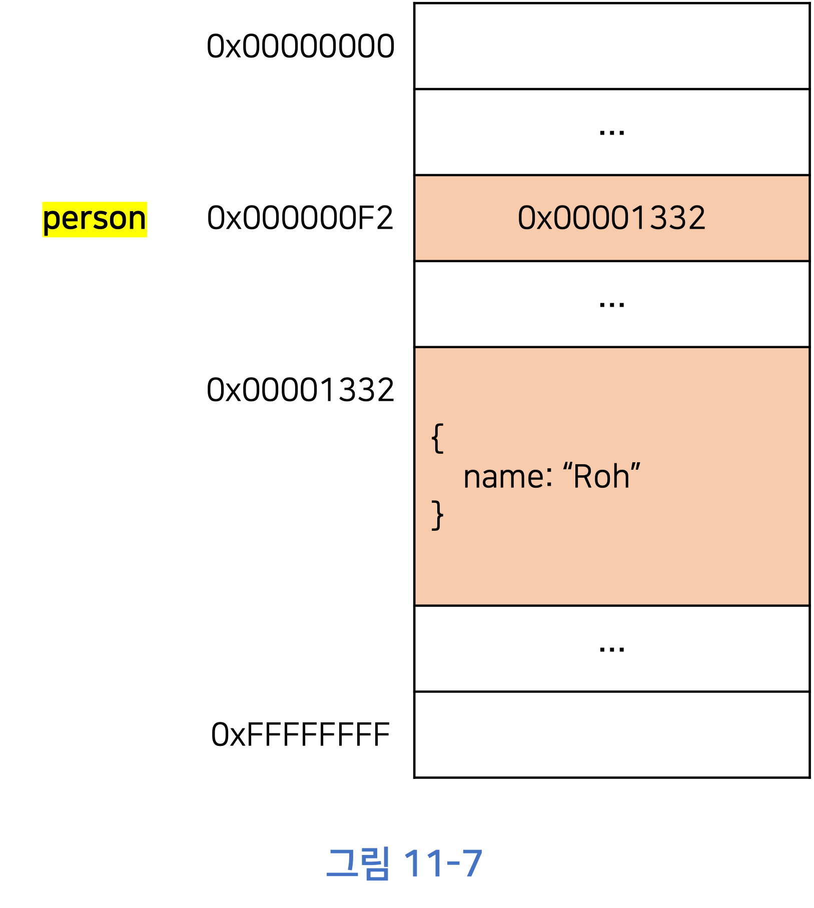
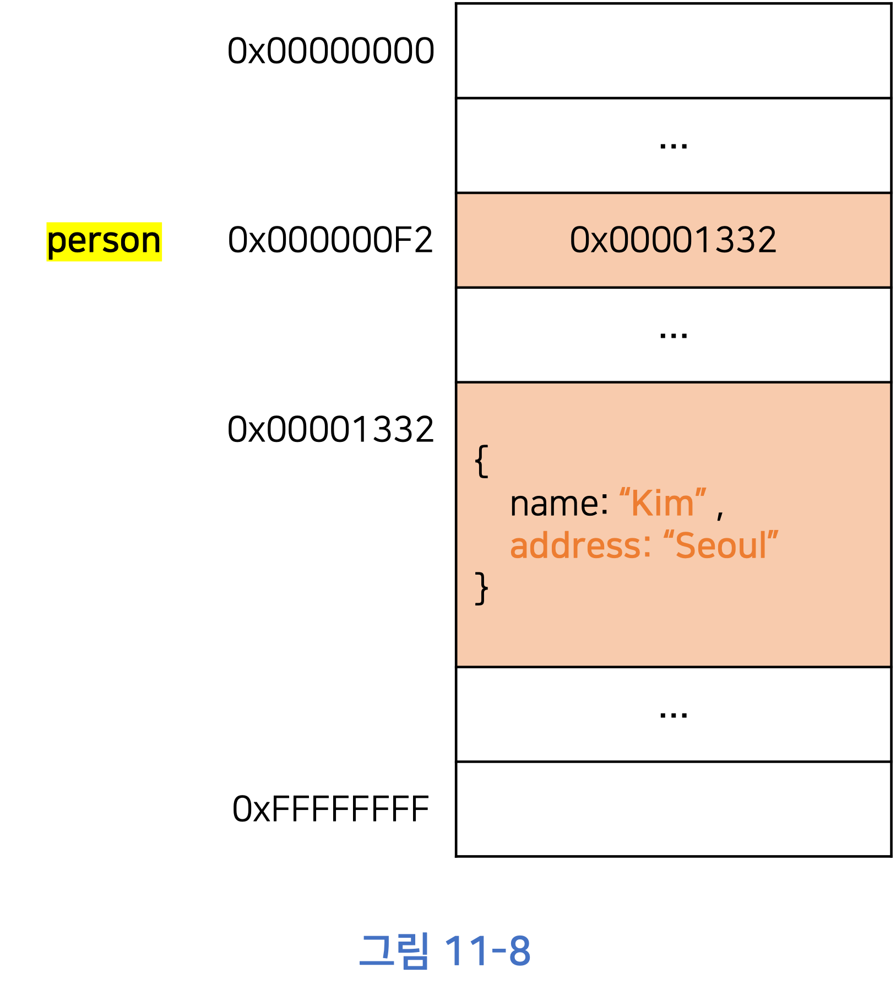
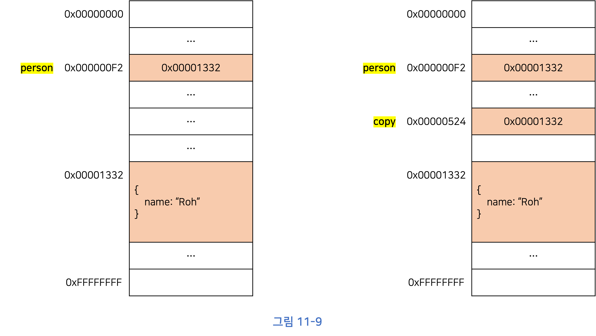
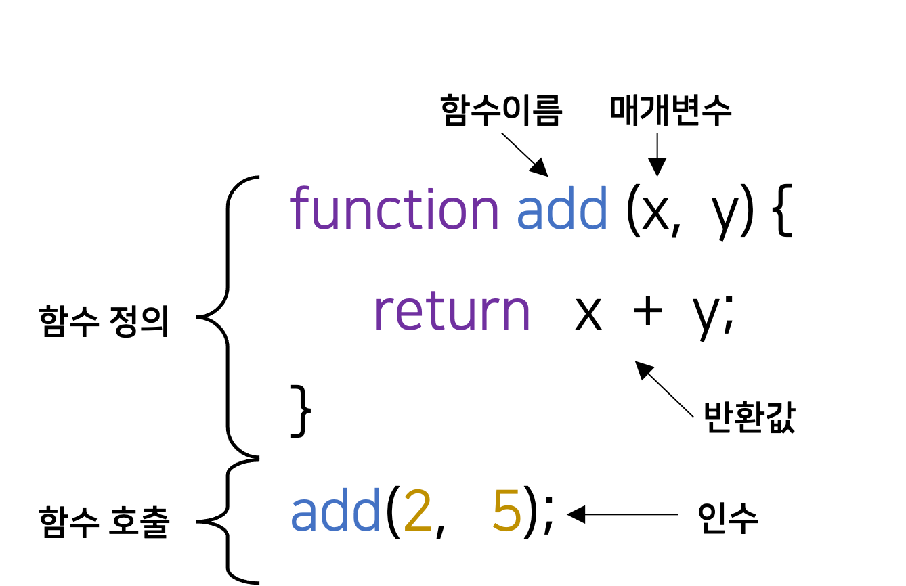
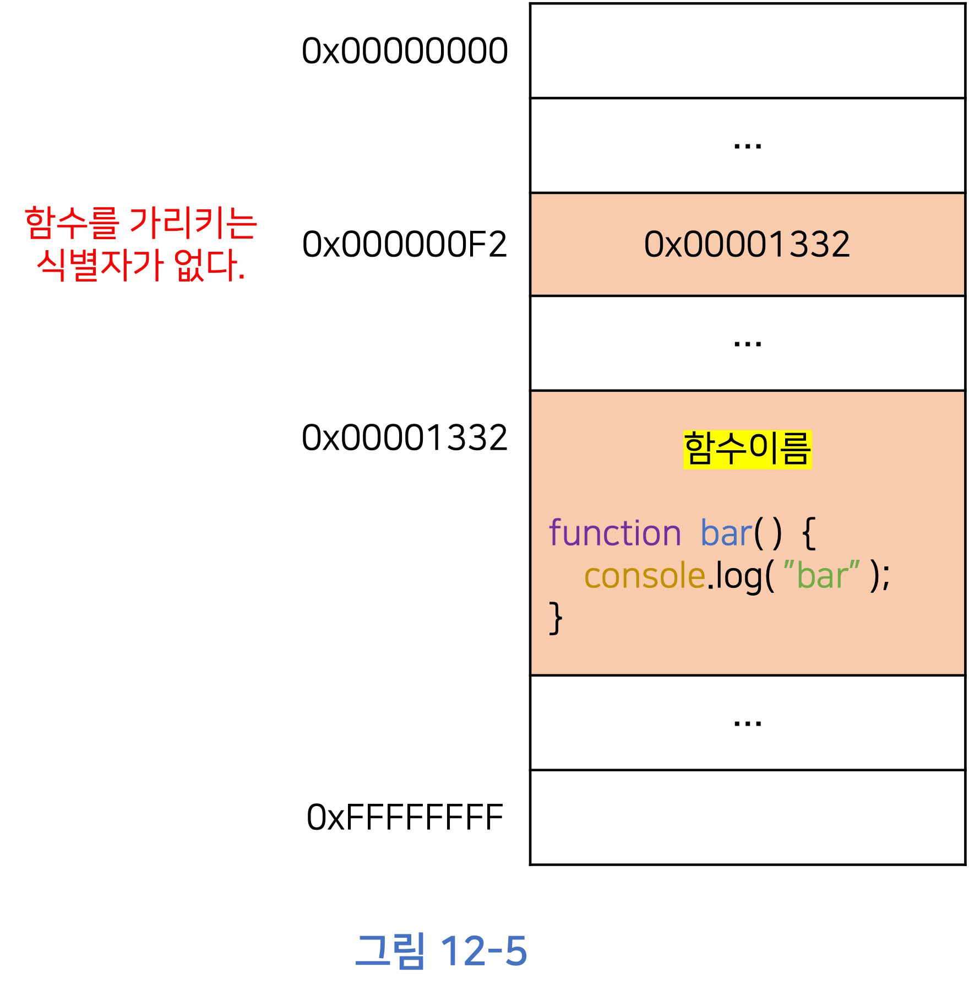
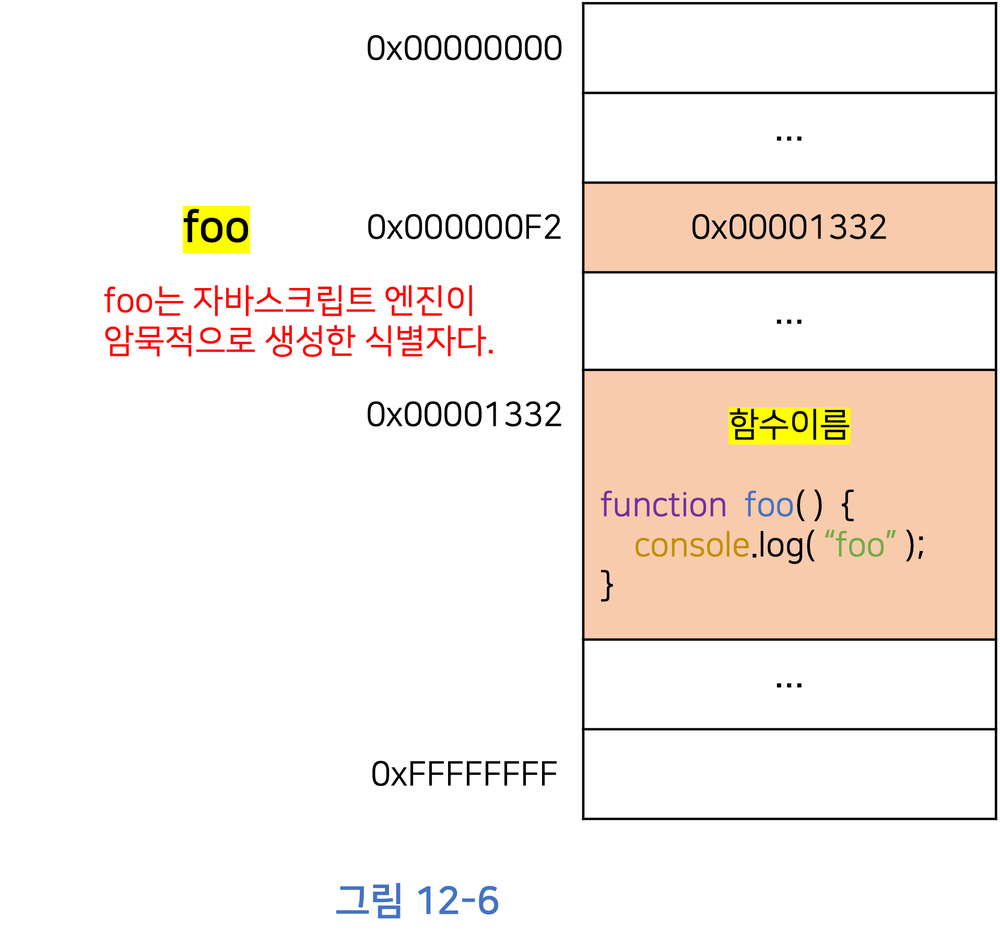
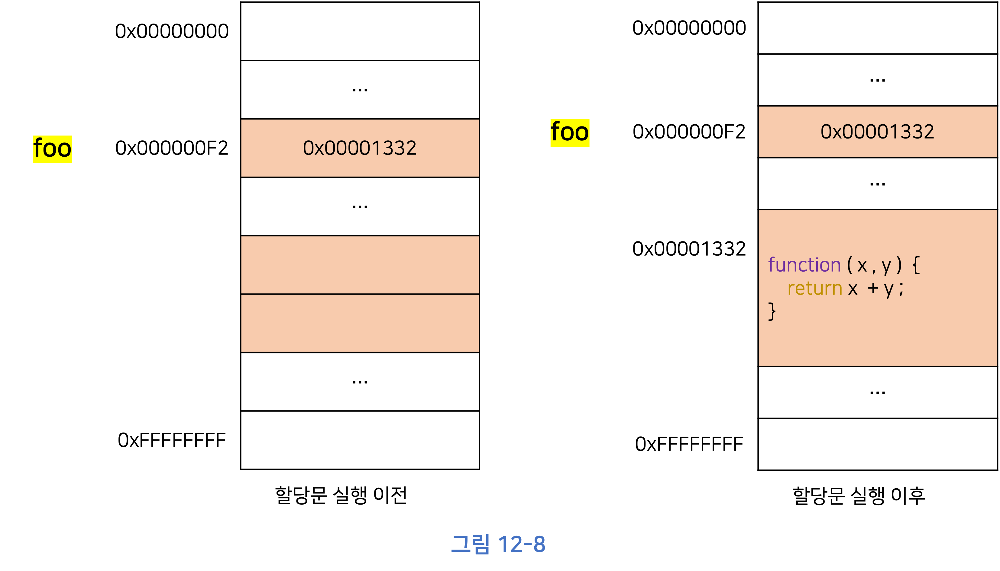
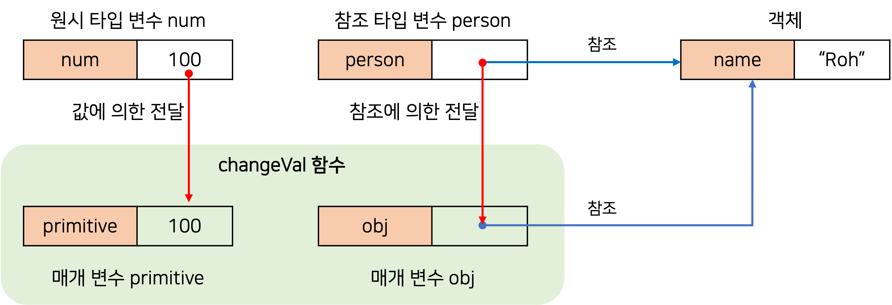

# Deep Dive Study - 2주차

<br/><br/><br/>

<h1 align="center">9.타입 변환과 단축 평가</h1>

<br/>

# 타입 변환이란?

개발자가 의도적으로 값의 타입을 변환하는 것을 **명시적 타입 변환(Explicit Coercion)** 또는 **타입 캐스팅(Type Casting)** 이라 한다.

개발자의 의도와는 상관없이 자바스크립트 엔진에 의해 암묵저으로 타입이 변환되는 것을 **암묵적 타입 변환(Implicit Coercion)** 또는 **타입 강제 변환(Type Coercion)** 이라 한다.

**타입 변환**이란 기존 원시 값을 사용해서 다른 타입의 새로운 원시 값을 생성하는 것이다.

- 원시 값은 변경 불가능한 값이므로, 원시 값을 직접 변경하는 것이 아니라 새로운 타입의 값을 만들어 단 한 번 사용하고 버린다.
- 기존 변수 값을 재할당하여 변경하는 것이 아니다.

<br/><br/>

# 암묵적 타입 변환

### 문자열 타입으로 변환

```js
1 + "2"; // "12"
```

<ins>`+` 연산자는 피연산자 중 하나 이상이 문자열이면 문자열 연결 연산자로 동작</ins>한다.

자바스크립트 엔진은 문자열 연결 연산자의 피연산자 중에서 문자열 타입이 아닌 피연산자가 있을 때 피연산자를 문자열 타입으로 암묵적 타입 변환한다.

```js
`1 + 1 = ${1 + 1}`; // "1 + 1 = 2"
```

ES6에서 도입된 템플릿 리터럴의 표현식 삽입은 표현식의 평가 결과를 문자열 타입으로 암묵적으로 타입 변환한다.

```js
NaN + ""; // "NaN"
null + ""; // "null"
undefined + ""; // "undefined"
Symbol() + ""; // TypeError: Cannot convert a Symbol to a string
({}) + ""; // "[object Object]"
Math + ""; // "[object Math]"
[] + ""; // ""
[10, 20] + ""; // "10,20"
(function () {}) + ""; // "function(){}"
Array + ""; // "function Array() { [native code] }"
```

<br/>

### 숫자 타입으로 변환

자바스크립트 엔진은 산술 연산자의 피연산자 중에서 숫자 타입이 아닌 피연산자가 있을 때 피연산자를 숫자 타입으로 암묵적으로 타입 변환한다.

피연산자를 숫자 타입으로 변환할 수 없는 경우는 표현식의 평가 결과가 **NaN**이 된다.

```js
+"string"; // NaN
+NaN; // NaN
+null; // 0
+undefined; // NaN
+Symbol(); // TypeError: Cannot convert a Symbol to a number
+{}; // NaN
+[]; // 0
+[10, 20]; // NaN
+function () {}; // NaN
```

<br/>

### 불리언 타입으로 변환

**자바스크립트 엔진은 불리언 타입이 아닌 값을 Truthy(참으로 평가되는 값) 또는 Falsy(거짓으로 평가되는 값)으로 구분한다.**

<br/>

> ✍🏻 **Falsy 값**
>
> - false
> - undefined
> - null
> - 0, -0
> - NaN
> - ''(빈 문자열)

Falsy 값 외의 모든 값은 `true`로 평가되는 Truthy 값이다.

<br/><br/>

# 명시적 타입 변환

### 문자열 타입으로 변환

1. String 생성자 함수를 `new` 연산자 없이 호출하는 방법
2. `Object.prototype.toString` 메서드를 사용하는 방법
3. 문자열 연결 연산자를 이용하는 방법

<br/>

### 숫자 타입으로 변환

1. Number 생성자 함수를 `new` 연산자 없이 호출하는 방법
2. `parseInt`, `parseFloat` 함수를 사용하는 방법(문자열만 숫자 타입으로 변환 가능)
3. `+` 단항 산술 연산자를 이용하는 방법
4. `*` 산술 연산자를 이용하는 방법

<br/>

### 불리언 타입으로 변환

1. Boolean 생성자 함수를 `new` 연산자 없이 호출하는 방법
2. `!` 부정 논리 연산자를 두 번 사용하는 방법

```js
!!"x"; // true
!!""; // false
!!"false"; // true

!!0; // false
!!1; // true
!!NaN; // false
!!Infinity; // true
!!null; // false
!!undefined; // false

!!{}; // true
!![]; // true
```

<br/><br/>

# 단축 평가

### ⭐논리 연산자를 사용한 단축 평가

논리 연산자는 논리 연산의 결과를 결정하는 피연산자를 타입 변환하지 않고 그대로 반환한다. 이를 **단축 평가(Short-circuit Evaluation)**라고 한다.

<br/>

> ✍🏻 **단축평가**
>
> 표현식을 평가하는 도중에 평가 결과가 확정된 경우 나머지 평가 과정을 생략하는 것을 말한다.

<br/>

```js
"Cat" && "Dog"; // "Dog"
```

**논리곱(&&) 연산자**는 두 개의 피연산자가 모두 true로 평가될 때 true를 반환한다. <ins>두 번째 피연산자가 논리곱 연산자 표현식의 평가 결과를 결정</ins>한다.

<br/>

```js
"Cat" || "Dog"; // "Cat"
```

**논리합(||) 연산자**는 두 개의 피연산자 중 하나만 true로 평가되어도 true를 반환한다. <ins>두 번째 피연산자까지 평가해 보지 않아도 표현식을 평가할 수 있다.</ins>

<br/>

| **단축 평가 표현식** | **평가 결과** |
| -------------------- | ------------- |
| true && anything     | anything      |
| false && anything    | false         |
| true \|\| anything   | true          |
| false \|\| anything  | anything      |

<br/>

### ⭐옵셔널 체이닝 연산자

- ES11에서 도입되었다.

**옵셔널 체이닝(Optional Chaning) 연산자 `?.`** 는 좌항의 피연산자가 `null` 또는 `undefined`인 경우 `undefined`를 반환하고, 그렇지 않다면 우항의 프로퍼티 참조를 이어간다.

```js
// 논리 연산자
var user = null;
var username = user && user.name;
console.log(username); // null

// 옵셔널 체이닝
var customer = { address: { street: "Main St" } };
var zipCode = customer.address?.zipCode;
console.log(zipCode); // undefined

// 옵셔널 체이닝과 논리 연산자 비교
var book = { author: { name: "John Doe" } };
var authorName = book.author && book.author.name; // 논리 연산자
var publisherName = book.publisher?.name; // 옵셔널 체이닝

console.log(authorName); // "John Doe"
console.log(publisherName); // undefined
```

<br/>

**논리 연산자 `&&`** 는 좌항 피연산자가 `Falsy`값이면 좌항 피연산자를 그대로 반환한다. <br/>
하지만, **옵셔널 체이닝 연산자 `?.`** 는 좌항 피연산자가 `null` 또는 `undefined`가 아니면 우항의 프로퍼티 참조를 이어간다.

<br/>

### ⭐null 병합 연산자

- ES11에서 도입되었다.

**null 병합 연산자 `??`** 는 좌항의 피연산자가 `null` 또는 `undefined`인 경우 우항의 피연산자를 반환하고, 그렇지 않으면 좌항의 피연산자를 반환한다. null 병합 연산자 `??`는 변수에 기본값을 설정할 때 유용한다.

```js
// 널 병합 연산자 (Nullish coalescing operator)
var username = null ?? "Anonymous";
console.log(username); // "Anonymous"

var count = 0 ?? 42;
console.log(count); // 0

var greeting = "" ?? "Hello!";
console.log(greeting); // ""

// 비교: 널 병합 연산자 vs 논리 OR 연산자
var loggedInUser = null;
var displayName = loggedInUser ?? "Guest"; // 널 병합 연산자
var fallbackName = loggedInUser || "Visitor"; // 논리 OR 연산자

console.log(displayName); // "Guest"
console.log(fallbackName); // "Visitor"
```

<br/><br/><br/>

<h1 align="center">10. 객체 리터럴</h1>

<br/>

# 객체란?

자바스크립트는 객체(Object) 기반의 프로그래밍 언어이며, 자바스크립트를 구성하는 **"거의 모든 것이 객체"** 다.

- 원시 값을 제외한 나머지 값은 모두 객체다(함수, 배열, 표현식 등).

<br/>

<ins>객체는 프로퍼티와 메서드로 구성된 집합체</ins>다.

**프로퍼티**는 객체의 상태를 나타내는 값이고, **메서드**는 프로퍼티 값이 함수일 경우에 일반 함수와 구분하기 위해 붙이는 명칭이다.

<br/><br/>

# 객체 리터럴에 의한 객체 생성

<ins>자바스크립트는 프로토타입 기반 객체지향 언어로서</ins> 다양한 객체 생성 방법을 지원한다.

- 객체 리터럴
- Object 생성자 함수
- 생성자 함수
- Object.create 메소드
- 클래스(ES6)

```js
var person = {
  name: "Roh",
  sayHello: function () {
    console.log(`Hi! My name is ${this.name}.`);
  },
};

console.log(typeof person); // object
console.log(person); // {name: "Roh", sayHello: ƒ}
```

객체 리터럴 외의 객체 생성 방식은 모두 함수를 사용해 객체를 생성한다.

<br/><br/>

# 프로퍼티

```js
var person = {
  // 프로퍼티 키는 name, 프로퍼티 값은 'Roh'
  name: "Roh",
  // 프로퍼티 키는 age, 프로퍼티 값은 25
  age: 25,
};
```

객체는 프로퍼티의 집합이며, 프로퍼티는 키와 값으로 구성된다.

프로퍼티 키는 일반적으로 문자열을 사용한다. 하지만 **반드식 식별자 네이밍 규칙을 지켜야 하는 것은 아니다.** 단, 식별자 네이밍 규칙을 따르지 않는 이름에는 반드시 **따옴표를 사용해야 한다.**

```js
var person = {
    firstName: "Ki-Hoon",
    last-name: "Roh", // SyntaxError: Unexpected token -
};
```

프로퍼티 키에 문자열이나 심벌 값 외의 값을 사용하면 **암묵적 타입 변환을 통해 문자열이 된다.**

```js
var foo = {
  0: 1,
  1: 2,
  2: 3,
};

console.log(foo); // {0: 1, 1: 2, 2: 3}
```

이미 존재하는 프로퍼티 키를 중복 선언하면 나중에 선언한 프로퍼티가 **먼저 선언한 프로퍼티를 덮어쓴다.**

```js
var foo = {
  name: "Roh",
  name: "Kim",
};

console.log(foo); // {name: "Kim"}
```

<br/><br/>

# 메서드

프로퍼티 값이 함수일 경우 일반 함수와 구분하기 위해 **메서드(method)** 라 부른다. 메서드는 객체에 묶여 있는 함수를 의미한다.

```js
var circle = {
  radius: 5,

  getDiameter: function () {
    return 2 * this.radius;
  },
};

console.log(circle.getDiameter()); // 10
```

<br/><br/><br/>

<h1 align="center">11. 원시 값과 객체의 비교</h1>

<br/>

# 원시 값

## 변경 불가능한 값

<ins>원시 값은 변경 불가능한 값(Immutable Value)이다.</ins> 즉, **읽기 전용(read-only) 값**이다.

**변수**는 하나의 값을 저장하기 위해 확보한 **메모리 공간 자체** 또는 그 메모리 공간을 식별하기 위해 붙인 이름이고, **값**은 변수에 저장된 **데이터**로서 표현식이 평가되어 생성된 결과를 말한다. <ins>변경 불가능하다는 것은 변수가 아니라 값에 대한 진술</ins>이다.

**"원시 값은 변경 불가능하다."** 는 말은 원시 값 자체를 변경할 수 없다는 것이지 <ins>변수 값을 변경할 수 없다는 것이 아니다.</ins> 변수는 언제든지 재할당을 통해 변수 값을 변경(엄밀히 말하면 교체)할 수 있다.

<br/>


⭐⭐ 변수 값을 변경하기 위해 원시 값을 재할당하면 새로운 메모리 공간을 확보하고 재할당한 값을 저장한 후, 변수가 참조하던 메모리 공간의 주소를 변경한다.

- 변수가 참조하던 메모리 공간의 주소가 변경된 이유는 원시 값이 변경 불가능한 값이기 때문이다.
- 불변성을 갖는 원시 값을 할당한 변수는 재할당 이외에 변수 값을 변경할 수 있는 방법이 없다.

<br/>

## 문자열과 불변성

**ECMAScript 사양에 문자열 타입(2byte)과 숫자 타입(8byte) 이외의 원시 타입은 크기를 명확히 규정하고 있지는 않아서** 브라우저에 따라서 타입의 크기는 다를 수 있다.

문자열은 **유사 배열 객체**이면서 **이터러블**이므로 배열과 유사하게 각 문자에 접근할 수 있다.

<br/>

> ✍🏻 **유사 배열 객체(Array-like Object)**
>
> 유사 배열 객체란 마치 배열처럼 인덱스로 프로퍼티 값에 접근할 수 있고 length 프로퍼티를 갖는 객체를 말한다.

<br/>

```js
var str = "hello";
str = "world";

str[0] = "W";

console.log(str); // world
```

**문자열은 변경 불가능한 값이기 때문에** 할당 된 변수를 변경(재할당)할 수는 있지만, 문자열을 변경하는 것은 불가능하다.

<br/>

## ⭐⭐ 값에 의한 전달

```js
var score = 80;
var copy = score;

console.log(score); // 80
console.log(copy); // 80

score = 100;

console.log(score); // 100
console.log(copy); // 80
```

변수에 원시 값을 갖는 변수를 할당하면 할당받는 변수(copy)에는 할당되는 변수(score)의 원시 값이 복사되어 전달된다.

score 변수와 copy 변수의 값 80은 **_다른 메모리 공간에 저장된 별개의 값이다._** 따라서 score 변수의 값을 변경해도 copy 변수의 값에는 **_어떠한 영향도 주지 않는다._**

<br/>

> **"값에 의한 전달"이라는 용어는 자바스크립트를 위한 용어가 아니므로 오해가 있을 수 있다.**
>
> - 엄격하게 표현하면 변수에 값이 전달되는 것이 아니라 메모리 주소가 전달되는 것이다.
> - 이는 변수와 같은 식별자는 값이 아니라 메모리 주소를 기억하고 있기 때문이다.

<br/>

”값의 의한 전달"도 사실은 값을 전달하는 것이 아니라 메모리 주소를 전달한다. 단, 전달된 메모리 주소를 통해 메모리 공간에 접근하면 값을 참조할 수 있다.

<br/><br/>

# 객체

객체는 원시 값과 같이 확보해야 할 메모리 공간의 크기를 사전에 정해 둘 수 없다.

객체는 복합적인 자료구조이므로 객체를 관리하는 방식이 원시 값과 비교해서 복잡하고 구현 방식도 브라우저 제조사마다 다를 수 있다.

<br/>

## 변경 가능한 값

**_객체는 변경 가능한 값(Mutable Value)이다._**

```js
var person = {
  name: "Roh",
};
```

<div style="max-width: 350px; margin: 0 auto;" >



</div>

원시 값을 할당한 변수를 참조하면 메모리에 저장되어 있는 원시 값에 접근한다. 하지만, 객체를 할당한 변수를 참조하면 **_메모리에 저장되어 있는 참조 값을 통해 실제 객체에 접근한다._**

<br/>

> ✍🏻 **참조값**
>
> 참조 값은 생성된 객체가 실제로 저장된 메모리 공간의 주소이다.

<br/>

```js
person.name = "Kim";
person.address = "Seoul";
```

<div style="max-width: 350px; margin: 0 auto;" >



</div>

객체는 변경 가능한 값이므로 메모리에 저장된 객체를 직접 수정할 수 있다. 이때 **객체를 할당한 변수의 참조 값은 변경되지 않는다.**

<br/>

> ✍🏻 **얕은 복사(Shallow Copy)와 깊은 복사(Deep Copy)**
>
> 객체를 프로퍼티 값으로 갖는 객체에서 **얕은 복사**는 한 단계까지만 복사하는 것을 말하고 **깊은 복사**는 객체에 중첩되어 있는 객체까지 모두 복사하는 것을 말한다.

<br/>

## 참조에 의한 전달

```js
var person = {
  name: "Roh",
};

// 참조 값을 복사
var copy = person;
```

객체를 가리키는 변수를 다른 변수에 할당하면 **_원본의 참조 값이 복사되어 전달된다._** 이를 **참조에 의한 전달**이라 한다.

원본 person과 사본 copy는 저장된 메모리 주소는 다르지만 **동일한 참조 값을 갖는다.** 이것은 **두 개의 식별자가 하나의 객체를 공유**한다는 것을 의미한다. 따라서 원본 또는 사본 중 어느 한쪽에서 객체를 변경하면 **서로 영향을 주고받는다.**



<br/><br/>

# 정리

**값에 의한 전달**과 **참조에 의한 전달**은 식별자가 기억하는 메모리 공간에 저장되어 있는 값을 복사해서 전달한다는면에서 동일하다. 다만 변수에 저장되어 있는 값이 **원시 값이냐 참조 값이냐의 차이**만 있을 뿐이다.

따라서, **_자바스크립트에는 참조에 의한 전달은 존재하지 않고 값에 의한 전달만이 존재한다고 말할 수 있다._**

<br/><br/><br/>

<h1 align="center">12.함수</h1>

<br/>

# 함수란?

함수는 자바스크립트의 핵심 개념인 스코프, 실행 컨텍스트, 클로저, 생성자 함수에 의한 객체 생성, 메서드, this,프로토타입, 모듈와 등과 깊은 관련이 있다.

<div style="max-width: 350px; margin: 0 auto;" >



</div>

<br/>

함수는 **일련의 과정을 문(Statement)으로 구현하고 코드 블록으로 감싸서 하나의 실행 단위로 정의한 것이다.**

- 함수 내부로 입력을 전달받는 변수 **매개변수(parameter)**, 입력을 **인수(argument)** 출력을 **반환값(return value)** 이라 한다.

<br/><br/>

# 함수를 사용하는 이유

함수는 여러 번 호출할 수 있으므로 **코드의 재사용**이라는 측면에서 매우 유용하다.

함수는 코드의 중복을 억제하고 재사용성을 높여서 **유지보수의 편의성**을 높이고 실수를 줄여 **코드의 신뢰성**을 높이는 효과가 있다.

또한, 적절한 함수의 이름은 함수의 내부 코드를 이해하지 않고도 함수의 역할을 파악할 수 있게 돕는다. 이는 **코드의 가독성**을 향상시킨다.

<br/><br/>

# 함수 리터럴

**자바스크립트의 함수는 객체 타입의 값이다.** 따라서, **함수 리터럴**로 함수를 생성할 수 있다. 함수 리터럴은 function 키워드, 함수 이름, 매개변수 목록, 함수 몸체로 구성된다.

```js
// 변수에 함수 리터럴을 할당
var f = function add(x, y) {
  return x + y;
};
```

<br/>

> 리터럴은 값을 생성하기 위한 표기법이다. 따라서 함수 리터럴도 평가되어 값을 생성하며, 이 값은 객체다. 즉, **함수는 객체다.**

> 함수는 일반 객체와는 다르다. **일반 객체는 호출할 수 없지만 함수는 호출할 수 있다.**

<br/><br/>

# 함수 정의

**함수 정의**란, 함수를 호출하기 이전에 인수를 전달받을 매개변수와 실행할 문들, 그리고 반환할 값을 지정하는 것을 말한다.

함수를 정의하는 방법에는 4가지가 있다.

- 함수 선언문
- 함수 표현식
- Function 생성자 함수
- 화살표 함수(ES6)

<br/>

> ✍🏻 **변수 선언과 함수 정의**
>
> 함수 선언문이 평가되면 식별자가 암묵적으로 생성되고 함수 객체가 할당된다. 따라서 변수에는 선언(variable declaration), 함수에는 정의(function definition)라고 표현한다.

<br/>

## 함수 선언문

```js
function add(x, y) {
  return x + y;
}
```

함수 선언문은 함수 이름을 생략할 수 없다.

함수 선언문은 **표현식이 아닌 문**이다. 표현식이 아닌 문은 변수에 할당할 수 없다. 따라서 **함수 선언문은 변수에 할당할 수 없다.**

<br/>

### ☑️ 코드의 문맥에 따라 해석이 달라지는 함수 선언

```js
// 함수 선언문은 표현식이 아닌 문이므로 변수에 할당할 수 없다.
// 하지만, 함수 선언문이 변수에 할당되는 것처럼 보인다.
var add = function add(x, y) {
  return x + y;
};

console.log(add(2, 5)); // 7
```

자바스크립트 엔진은 **코드의 문맥에 따라** 함수 리터럴을 다르게 해석한다.

1. 표현식이 아닌 문인 **함수 선언문**으로 해석하는 경우
2. 표현식인 문인 **함수 리터럴 표현식**으로 해석하는 경우

<ins>함수 선언문은 (함수 이름을 생략할 수 없다는 점을 제외하면) 함수 리터럴과 형태가 같다.</ins> 이는 함수 이름이 있는 기명 함수 리터럴은 함수 선언문 또는 함수 리터럴 표현식으로 해석될 가능성이 있다는 것이다.

<br/>

자바스크립트 엔진은

1. <ins>함수 이름이 있는 함수 리터럴을 단독으로 사용하면 함수 선언문으로 해석</ins>하고,
2. <ins>함수 리터럴이 값으로 평가되어야 하는 문맥에서는 함수 리터럴 표현식으로 해석</ins>한다.

이때 함수 선언문이든 함수 리터럴 표현식이든 함수가 생성되는 것은 동일하다. 하지만 함수를 생성하는 내부 동작에 차이가 있다.

### ☑️ 함수의 호출 가능 여부

**함수 선언문**은 호출할 수 있지만, **함수 리터럴 표현식**은 호출할 수 없다.

```js
// 기명 함수 리터럴을 단독으로 사용하면 함수 선언문으로 해석된다.
function foo() { console.log('foo'); }
foo(); // foo

// 함수 리터럴을 피연산자로 사용하면 함수 리터럴 표현식으로 해석된다.
(function bar() { console.log('bar'); );
bar(); // ReferenceError: bar is not defined
```

<br/>

> ✍🏻 **그룹 연산자 ()**
>
> 그룹 연산자의 피연산자는 값으로 평가될 수 있는 표현식이어야 한다. 따라서, 표현식이 아닌 문인 함수 선언문은 피연산자로 사용할 수 없다.

<br/>

#### 함수 이름은 함수 몸체 내에서만 참조할 수 있는 식별자다.

함수 몸체 외부에서는 함수 이름으로 호출할 수 없다. 즉, 함수를 가리키는 식별자가 없다는 의미이다. 따라서 위 코드에서 `bar` 함수는 호출할 수 없다.

<br/>

<div style="display:flex; margin: 0 auto;" >
<div style="max-width: 350px;" >



</div>

<div style="max-width: 350px;" >



</div>
</div>

<br/>

위 코드에서 `foo` 또한 호출할 수 없어야 한다. 하지만, 호출할 수 있는 이유는 **자바스크립트 엔진이 암묵적으로 식별자를 생성했기 때문이다.**

⭐⭐ 자바스크립트 엔진은 생성된 함수를 호출하기 위해 함수 이름과 동일한 이름의 식별자를 암묵적으로 생성하고, 식별자에 함수 객체를 할당한다.

<br/>

#### 함수는 함수 이름으로 호출하는 것이 아니라 함수 객체를 가리키는 식별자로 호출한다.

함수 선언문으로 생성한 함수를 호출한 것은 함수 이름이 아니라 자바스크립트 엔진이 암묵적으로 생성한 식별자인 것이다. 함수 이름과 식별자 이름이 일치하므로 함수 이름으로 호출되는 듯하지만 사실은 식별자로 호출된 것이다.

<br/>

## 함수 표현식

함수는 **일급 객체**이므로 함수 리터럴로 생성한 함수 객체를 변수에 할당할 수 있다. 이러한 함수 정의 방식을 **함수 표현식**이라한다.

**함수 선언문**은 “표현식이 아닌문"이고, **함수 표현식**은 “표현식인 문”이다.

```js
var add = function (x, y) {
  return x + y;
};

console.log(add(2, 5)); // 7
```

<br/>

## 함수 생성 시점과 함수 호이스팅

함수 선언문으로 정의한 함수와 함수 표현식으로 정의한 함수는 생성 시점이 다르다.

```js
// 함수 참조
console.dir(add); // f add(x, y)
console.dir(sub); // undefined

// 함수 호출
console.log(add(2, 5)); // 7
console.log(sub(2, 5)); // TypeError: sub is not a function

// 함수 선언문
function add(x, y) {
  return x + y;
}

// 함수 표현식
var sub = function (x, y) {
  return x - y;
};
```

#### 함수 선언문으로 정의한 함수는 함수 선언문 이전에 호출할 수 있다.

함수 선언문으로 함수를 정의하면 런타임 이전에 평가되어 함수 객체가 먼저 생성된다. 그리고 자바스크립트 엔진은 함수 이름과 동일한 이름의 식별자를 암묵적으로 생성하고 생성된 함수 객체를 할당한다. 코드가 한 줄씩 순차적으로 실행되기 시작하는 런타임에는 이미 함수 객체가 생성되어 있고 함수 이름과 동일한 식별자에 할당까지 완료된 상태이다. 따라서, 함수 선언문 이전에 함수를 참조할 수 있으며 호출할 수도 있다.

<br/>

> ✍🏻 **함수 호이스팅(Function Hoisting)**
>
> 함수 선언문이 코드의 선두로 끌어 올려진 것처럼 동작하는 자바스크립트 고유의 특징을 함수 호이스팅이라 한다.

<br/>

> ✍🏻 **변수 호이스팅과 차이점**
>
> `var` 키워드를 사용한 변수 선언문과 함수 선언문은 <ins>런타임 이전에 자바스크립트 엔진에 의해 먼저 실행되어 식별자를 생성하다는 점은 동일</ins>하다.
>
> 하지만, var 키워드로 선언된 변수는 `undefined`로 초기화 되지만, 함수 선언문을 통해 암묵적으로 생성된 식별자는 **함수 객체**로 초기화된다.

<br/>

#### 함수 표현식으로 정의한 함수는 함수 표현식 이전에 호출할 수 없다.

함수 표현식으로 함수를 정의하면 런타임에 평가되므로 함수 표현식의 함수 리터럴도 할당문이 실행되는 시점에(런타임) 평가되어 함수 객체가 된다.

함수 표현식으로 함수를 정의하면 함수 호이스팅이 발생하는 것이 아니라 변수 호이스팅이 발생한다.



<br/>

## 화살표 함수

ES6에서 도입된 **화살표 함수(arrow function)** 는 function 키워드 대신 `=>`를 사용해 좀 더 간략한 방법으로 함수를 선언할 수 있다. 화살표 함수는 항상 익명 함수로 정의한다.

```js
const add = (x, y) => x + y;
console.log(add(2, 5)); // 7
```

화살표 함수는 기존의 함수보다 표현만 간략한 것이 아니라 **내부 동작** 또한 간략화되었는데, `this` 바인딩 방식, `prototype` 프로퍼티가 없고, `arguments` 객체를 생성하지 않는다는 차이점이 있다.

<br/><br/>

# 참조에 의한 전달과 외부 상태의 변경

매개변수도 함수 몸체 내부에서 변수와 동일하게 취급되므로, **타입에 따라** 값에 의한전달, 참조에 의한 전달 방식을 그대로 따른다.

```js
function changeVal(primitive, obj) {
  primitive += 100;
  obj.name = "Kim";
}

var num = 100;
var person = { name: "Roh" };

console.log(num); // 100
console.log(person.name); // Roh

// 원시 값은 값 자체가 복사되어 전달되고 객체는 참조 값이 복사되어 전달된다.
changeVal(num, person);

// 원시 값은 원본이 변경되지 않는다.
console.log(num); // 100

// 객체는 원본이 변경된다.
console.log(person.name); // Kim
```



<br/>

### primitive

원시 값은 변경 불가능한 값(immutable value)이므로 직접 변경할 수 없기 때문에, **재할당을 통해 할당된 원시 값으로 교체**한다.

함수 외부에서 함수 몸체 내부로 전달한 원시 값의 원본을 변경하는 **어떠한 부수 효과도 발생하지 않는다.**

<br/>

### obj

객체는 변경 가능한 값(mutable value)이므로 직접 변경할 수 있기 때문에 **재할당 없이 직접 할당된 객체를 변경**한다.

함수 외부에서 함수 몸체 내부로 전달한 참조 값에 의해 **원본 객체가 변경되는 부수 효과가 발생한다.**

<br/>

---

<br/>

함수가 외부 상태를 변경하면 상태 변화를 추적하기 어려워진다. 이는 코드의 복잡성을 증가시키고 가독성을 해치는 원인이 된다.

이러한 현상은 객체가 **변경할 수 있는 값**이고, **참조에 의한 전달 방식**으로 동작하기 때문이다.
객체의 변경을 추적하려면 **옵저버 패턴(Observer Pattern)** 을 통해 참조를 공유하는 모든 이들에게 변경 사실을 통지하고 이에 대처하는 추가 대응이 필요하다.

이러한 문제의 해결 방법 중 하나는 **객체를 불변 객체(immutable object)** 로 만들어 사용하는 것이다.

- 객체의 복사본을 새롭게 생성하는 비용은 들지만 객체를 원시 값처럼 변경 불가능한 값으로 동작하게 만드는 것이다.
- 객체의 상태 변경이 필요한 경우에는 객체의 **방어적 복사(defensive copy)** 를 통해 원본 객체를 완전히 복제(깊은 복사, deep copy)해 새로운 객체를 생성하고 재할당을 통해 교체한다.

외부 상태를 변경하지 않고 외부 상태에 의존하지도 않는 함수를 **순수 함**수라 한다.

순수 함수를 통해 부수 효과를 최대한 억제하여 오류를 피하고 프로그램의 안정성을 높이려는 프로그래밍 패러다임을 **함수형 프로그래밍**이라 한다.

<br/><br/>

# 다양한 함수의 형태

### 즉시 실행 함수

함수 정의와 동시에 즉시 호출되는 함수를 **즉시 실행 함수(IIFE, Immediately Invoked Function Expression)** 라고 한다. **즉시 실행 함수는 한 번만 호출되며 다시 호출할 수 없다.**

<br/>

그룹 연산자의 피연산자는 값으로 평가되므로 기명 또는 무명 함수를 그룹 연산자로 감싸면 함수 리터럴로 평가되어 함수객체가 된다. 즉, **그룹 연산자로 함수를 묶은 이유**는 먼저 함수 리터럴을 평가해서 함수 객체를 생성하기 위해서다.

```js
(function () {
  // ...
})();
```

- 즉시 실행 함수도 일반 함수처럼 **값을 반환**할 수 있고 **인수를 전달**할 수 있다.
- 즉시 실행 함수 내에 코드를 모아 두면 혹시 있을 수도 있는 변수나 함수 이름의 **충돌을 방지**할 수 있다.

<br/>

### 재귀 함수

**재귀 함수(recursive function)** 는 재귀 호출(자기 자신을 호출하는 행위)을 수행하는 함수를 말한다.

- 재귀 함수를 사용하면 반복되는 처리를 반복문 없이 구현할 수 있다.
- 재귀 함수는 자신을 무한 재귀 호출한다.
- 재귀 함수 내에는 재귀 호출을 멈출 수 있는 **탈출 조건을 반드시 만들어야 한다.**
- 탈출 조건이 없으면 함수가 무한 호출되어 **스택 오버플로 에러**가 발생한다.

재귀 함수는 반복문을 사용하는 것보다 재귀 함수를 사용하는 편이 더 직관적으로 이해하기 쉬울 때만 사용하는 것이 바람직하다.

<br/>

### 중첩 함수

함수 내부에 정의된 함수를 **중첩 함수(nested function)** 또는 **내부 함수(inner function)** 라 한다.

- 중첩 함수는 외부 함수 내부에서만 호출할 수 있다.
- 중첩 함수는 **스코프**와 **클로저**에 깊은 관련이 있다.

```js
function outer() {
  var x = 1;

  // 중첩 함수
  function inner() {
    var y = 2;

    // 외부 함수의 변수를 참조할 수 있다.
    console.log(x + y); // 3
  }
  inner();
}
outer();
```

호이스팅으로 인해 혼란이 발생할 수 있으므로 `if`문이나 `for`문 등의 코드 블록에서 함수 선언문을 통해 함수를 정의하는 것은 바람직하지 않다.

<br/>

### 콜백 함수

```js
// 고차 함수
function repeat(n, f) {
  for (var i = 0; i < n; i++) {
    f(i);
  }
}

// 콜백 함수
var logAll = function (i) {
  console.log(i);
};

repeat(5, logAll); // 0 1 2 3 4
```

매개변수를 통해 다른 함수의 내부로 전달되는 함수를 **콜백 함수(callback function)**,
매개변수를 통해 함수의 외부에서 콜백 함수를 전달받은 함수를 **고차 함수(HOF, Higher-Order function)** 라고 한다.

콜백 함수는 고차 함수에 의해 호출되며 이때 고차 함수는 필요에 따라 콜백 함수에 인수를 전달할 수 있다. 따라서 고차 함수에 콜백 함수를 전달할 때 콜백 함수를 호출하지 않고 **함수 자체를 전달**해야 한다.

콜백 함수는 비동기 처리뿐 아니라 배열 고차 함수에서도 사용된다.

콜백 함수를 다른 곳에서도 호출할 필요가 있거나, 콜백 함수를 전달받는 함수가 자주 호출된다면 함수 외부에서 콜백 함수를 정의한 후 함수참조를 고차 함수에 전달하는 것이 효율적이다.

<br/>

### 순수 함수와 비순수 함수

#### 순수 함수

- 순수 함수는 외부 상태에 의존하지 않고 외부 상태를 변경하지 않는 함수이다.
- 순수 함수는 동일한 인수가 전달되면 언제나 동일한 값을 반환한다.

<br/>

#### 비순수 함수

- 비순수 함수는외부 상태에 의존하거나 외부 상태를 변경하는 함수다.
- 비순수 함수는 외부 상태에 따라 반환값이 달라지다.

함수가 외부 상태를 변경하면 상태 변화를 추적하기 어려워진다. 따라서 외부 상태의 변경을 지양하는 순수 함수를 사용하는 것이 좋다.
