[09. 타입 변환과 단축 평가](#09-타입-변환과-단축-평가)

[10. 객체리터럴](#10-객체-리터럴)

[11. 원시 값과 객체의 비교](#11-원시-값과-객체의-비교)

[12. 함수](#12-함수)

# 09. 타입 변환과 단축 평가

## 9.1 타입 변환이란 ?

자바스크립트의 모든 값은 타입이 있으며, 개발자에 의도에 따라 다른 타입으로 변환할 수 있다.

- **명시적 타입 변환**

  - 개발자가 의도적으로 값의 타입을 변환하는 것이다.
  - **타입 캐스팅**이라고도 한다.

- **암묵적 타입 변환**
  - 개발자의 의도와 상관없이 표현식을 평가하는 도중에 자바스크립트 엔진에 의해 암묵적으로 자동 타입 변환된다.
  - **타입 강제 변환**이라고도 한다.

```jsx
var x = 10;

// 명시적 타입 변환
// 숫자를 문자열로 타입 캐스팅한다.
var str = x.toString();
console.log(typeof str, str); // string 10
// x 변수의 값이 변경된 것은 아니다.
console.log(typeof x, x); // number 10

// 암묵적 타입 변환
// 문자열 연결 연산자는 숫자 타입 x의 값을 바탕으로 새로운 문자열을 생성한다.
var str1 = x + "";
console.log(typeof str1, str1); // string 10
// x 변수의 값이 변경된 것은 아니다.
console.log(typeof x, x); // number 10
```

때로는 명시적 타입 변환보다 암묵적 타입 변환이 가독성 측면에서 더 좋을 수도 있다.

중요한 것은 코드를 예측할 수 있어야 한다.

## 9.2 암묵적 타입 변환

### 문자열 타입으로 변환

```jsx
1 + "2"; // "12"
```

- `+` 연산자 중 하나 이상이 문자열이면, 문자열 연결 연산자로 동작한다.
- 문자열 연결 연산자의 역할은 문자열 값을 만드는 것이므로 모든 피연산자는 코드 문맥상 모두 문자열 타입이어야 한다.
- 자바스크립트 엔진은 문자열 연산자 표현식을 평가하기 위해 문자열 연결 연산자의 피연산자 중에서 문자열 타입이 아닌 피연산자를 문자열 타입으로 암묵적 타입 변환한다.
- 또한, 템플릿 리터럴의 표현식 삽입은 표현식의 평가 결과를 문자열 타입으로 암묵적 타입 변환한다.

<details>

**<summary>문자열 타입으로 암묵적 타입 변환</summary>**

```jsx
// 숫자 타입
0 + '' // "0"
-0 + '' // "0"
1 + '' // "1"
-1 + '' // "-1"
NaN + '' // "NaN"
Infinity + '' // "Infinity"
-Infinity + '' // "-Infinity"

// 불리언 타입
true + '' // "true"
false + '' // "false"

// null 타입
null + '' // "null"

// undefined 타입
undefined + '' // "undefined"

// 심벌 타입
(Symbol()) + '' // TypeError

// 객체 타입
({}) + '' // "[object Object]"
Math + '' // "[object Math]"
[] + '' // ""
[10, 20] + '' // "10,20"
(function(){}) + '' // "function(){}"
Array + '' // "function Array() { [native code] }"
```

</details>

### 숫자 타입으로 변환

```jsx
1 - "1"; // 0
1 * "10"; // 10
1 / "one"; // NaN
```

- 자바스크립트 엔진은 산술 연산자 표현식을 평가하기 위해 산술 연산자의 피연산자 중에서 숫자 타입이 아닌 피연산자를 숫자 타입으로 암묵적 타입 변환한다.
- 피연산자를 숫자 타입으로 변환할 수 없는 경우 산술 연산을 수행할 수 없으므로 평가 결과는 `NaN` 이 된다.
- 또한, 비교 연산자 표현식을 평가하기 위해 피연산자 중에서 숫자 타입이 아닌 피연산자를 숫자 타입으로 암묵적 타입 변환한다.

<details>

**<summary>숫자 타입으로 암묵적 타입 변환</summary>**

빈 문자열, 빈 비열, null, false는 `0`으로, true는 `1`로 변환된다.

객체와 빈 배열이 아닌 배열, undefined는 변환되지 않아 `NaN`이 된다는 것에 주의.

```
// 문자열 타입
  +"" // 0
  +"0" // 0
  +"1" // 1
  +"string" // NaN

// 불리언 타입
  +true // 1
  +false // 0

// null 타입
  +null // 0

// undefined 타입
  +undefined // NaN

// 심벌 타입
  +Symbol() // TypeError

// 객체 타입
  +{} // NaN
  +[] // 0
  +[10, 20] // NaN
  +(function () {}); // NaN
```

</details>

### 불리언 타입으로 변환

- if 문이나 for 문 같은 제어문 또는 삼항 조건 연산자의 조건식은 불리언 값이다.
- 논리적 참/거짓으로 평가 되어야 하는 표현식이다.
- 자바스크립트 엔진은 조건식의 평가 결과를 불리언 타입으로 암묵적 타입 변환 한다.
- **자바스크립트 엔진은 불리언 타입이 아닌 값을 `Truthy` 값(참으로 평가되는 값) 또는 `Falsy` 값(거짓으로 평가되는 값)으로 구분한다.**

<details>

<summary>false로 평가되는 falsy 값</summary>

- false
- undefined
- null
- 0, -0
- NaN
- ‘’ (빈 문자열)

</details>

## 9.3 명시적 타입 변환

### 문자열 타입으로 변환

문자열 타입이 아닌 값을 문자열 타입으로 변환하는 방법

- String() 생성자 함수를 new 연산자 없이 호출하는 방법
- Object.prototype.toString 메소드를 사용하는 방법
- 문자연 연결 연산자를 이용하는 방법

<details>

<summary>예제</summary>

```jsx
// 1. String 생성자 함수를 new 연산자 없이 호출하는 방법
// 숫자 타입 -> 문자열 타입
String(1); // "1"
String(NaN); // "NaN"
String(Infinity); // "Infinity"
// 불리언 타입 -> 문자열 타입
String(true); // "Ture"
String(false); // "false"

// 2. Object.prototype.toString 메서드를 사용하는 방법
// 숫자 타입 -> 문자열 타입
(1).toString(); // "1"
NaN.toString(); // "NaN"
Infinity.toString(); // "Infinity"
// 불리언 타입 -> 문자열 타입
true.toString(); // "true"
false.toString(); // "false"

// 3. 문자열 연결 연산자를 이용하는 방법
// 숫자 타입 -> 문자열 타입
1 + ""; // "1"
NaN + ""; // "NaN
Infinity + ""; // "Infinity"
// 불리언 타입 -> 문자열 타입
true + ""; // "true"
false + ""; // "false"
```

</details>

### 숫자 타입으로 변환

숫자 타입이 아닌 값을 숫자 타입으로 변환하는 방법

- Number 생성자 함수를 new 연산자 없이 호출하는 방법
- parseInt, parseFlota 함수를 사용하는 방법 (문자열만 숫자 타입으로 변환 가능)
- `+` 단항 산술 연산자를 이용하는 방법
- `*` 산술 연산자를 이용하는 방법

<details>

<summary>예제</summary>

```jsx
// 1. Number 생성자 함수를 new 연산자 없이 호출하는 방법
// 문자열 타입 -> 숫자 타입
Number("0"); // 0
Number("-1"); // -1
Number("10.53"); // 10.53
// 불리언 타입 -> 숫자 타입
Number(true); // 1
Number(false); // 0

// 2. parseInt, parseFloat 함수를 사용하는 방법(문자열만 변환 가능)
// 문자열 타입 -> 숫자 타입
parseInt("0"); // 0
parseInt("-1"); // -1
parseFloat("10.53"); // 10.53

// 3. + 단항 산술 연산자를 이용하는 방법
// 문자열 타입 -> 숫자 타입
+"0"; //0
+"-1"; // -1
+"10.53"; // 10.53
// 불리언 타입 -> 수자 타입
+true; // 1
+false; // 0

//4. * 산술 연산자를 이용하는 방법
// 문자열 타입 -> 숫자 타입
"0" * 1; // 0
"-1" * 1; // -1
"10.53" * 1; // 10.53
// 불리언 타입 -> 숫자 타입
true * 1; // 1
false * 1; // 0
```

</details>

### 불리언 타입으로 변환

불리언 타입이 아닌 값을 불리언 타입으로 변환하는 방법

- Boolean 생성자 함수를 new 연산자 없이 호출하는 방법
- `!` 부정 논리 연산자를 두 번 사용하는 방법

<details>

<summary>예제</summary>

```jsx
// 1. Boolean 생성자 함수를 new 연산자 없이 호출하는 방법
// 문자열 타입 -> 불리언 타입
Boolean("X"); // true
Boolean(""); // false
Boolean("false"); // true
// 숫자 타입 -> 불리언 타입
Boolean(0); // false
Boolean(1); // true
Boolean(NaN); // false
Boolean(Infinity); // true
// null 타입 -> 불리언 타입
Boolean(null); // false
// undefined -> 불리언 타입
Boolean(undefined); // false
// 객체 타입 -> 불리언 타입
Boolean({}); // true
Boolean([]); // true

// 2. ! 부정 논리 연산자를 두 번 사용하는 방법
!!"X"; // true
!!""; // false
!!"false"; // false
// 숫자 타입 -> 불리언 타입
!!0; // false
!!1; // true
!!NaN; // false
!!Infinity; // true
// null 타입 -> 불리언 타입
!!null; // false
// undefined 타입
!!undefined; // false
// 객체 타입, 불리언 타입
!!{}; // true
!![]; // true
```

</details>

## 9.4 단축 평가

### 논리 연산자를 사용한 단축 평가

- 논리합(||) 또는 논리곱(&&) 연산자 표현식의 평가 결과는 불리언 값이 아닐 수도 있다.
- 논리합, 논리곱 연산자 표현식은 언제나 2개의 피의연산자중 어느 한쪽으로 평가된다.

- 논리곱(&&)

  - 두 개의 피연산자가 모두 `true`로 평가될 때 `true`를 반환한다.
  - 좌항에서 우항으로 평가가 진행된다.
  - 첫 번째 피연산자가 `true` 이더라도 두 번째 피연산자까지 평가해 보아야 한다.

  ```jsx
  "Cat" && "Dog"; // "Dog"
  ```

- 논리합(||)

  - 두 개의 피연산자 중 하나만 `true`로 평가되어도 `true`를 반환한다.
  - 좌항에서 우항으로 평가가 진행된다.
  - 첫 번째 피연산자가 `true`이면 두 번째 피연산자까지 평가해 보지 않아도 된다.

  ```jsx
  "Cat" || "Dog"; //  "Cat"
  ```

- 단축 평가
  - 논리곱, 논리합 연산자는 논리 연산의 결과를 결정하는 피연산자를 타입 변환하지 않고 그대로 반환한다.
  - 표현식을 평가하는 도중에 평가 결과가 확정된 경우 나머지 평가 과정을 생략하는 것이다.

**단축 평가 규칙**

| 단축 평가 표현식    | 평가 결과 |
| ------------------- | --------- |
| true \|\| anything  | true      |
| false \|\| anything | anything  |
| true \&\& anything  | anything  |
| false \&\& anything | false     |

- 어떤 조건이 `Truthy` 값 (참으로 평가되는 값)일 때 무언가를 해야한다면 `논리곱(&&)` 연산자 표현식으로 `if문`을 대체할 수 있다.
- 조건이 `Falsy` 값 (거짓으로 평가되는 값)일 때 무언가를 해야한다면 `논리합(||)` 연산자 표현식으로 `if문`을 대체할 수 있다.

<details>

<summary>단축평가 사용 예</summary>

- 객체를 가리키기를 기대하는 변수가 `null` 또는 `undefined`가 아닌지 확인하고 프로퍼티를 참조할 때
  - `null` 또는 `undefined`인 경우 객체의 프로퍼티를 참조하면 타입 에러(TypeError)가 발생한다.
  - 에러가 발생하면 프로그램이 강제 종료된다.

```jsx
var elem = null;
var value = elem.value; // TypeError
var value1 = elem && elem.value; // null
```

- 함수 매개 변수에 기본 값을 설정할 때
  - 함수를 호출할 때 인수를 전달하지 않으면 매개 변수에는 `undefined` 가 할당된다.
  - 단축 평가를 사용해 매개 변수의 기본값을 설정하면 `undefined` 로 인해 발생할 수 있는 에러를 방지할 수 있다.

```jsx
// 단축 평가를 사용한 매개변수의 기본값 설정
function getStringLength(str) {
	str = str || '';
	return str.length;
}

getStringLength(); // 0
getStringLength('hi'); // 2

// ES6의 매개변수의 기본값 설정
function getStringLength1(str == '') {
	return str.length;
}

getStringLength1(); // 0
getStringLength1('hi'); // 2
```

</details>

### 옵셔널 체이닝 연산자

- 옵셔널 체이닝(optional chaining) 연산자는 ES11(ECMAScript2020)에서 도입됐다.
- `?.` 로 사용하며, 좌항의 피연산자가 `null` 또는 `undefined` 인 경우 `undefined를 반환`하고 그렇지 않으면 우항의 프로퍼티 참조를 이어간다.
- 객체를 가리키기를 기대하는 변수가 `null` 또는 `undefined`가 아닌지 확인하고 프로퍼티를 참조할 때 유용하다.
  - 옵셔널 체이닝 연산자 이전에는 논리 연산자(`&&`)를 사용해서 확인했다.

```jsx
var elem = null;

// elem이 null 또는 undefined이면 undefined를 반환하고
// 그렇지 않으면 우항의 프로퍼티 참조를 이어간다.
var value = elem?.value;
console.log(value); // undefined
```

**논리 연산과 옵셔널 체이닝 연산의 차이**

```jsx
var str = "";

// 문자열의 길이(length)를 참조한다.
var length = str && str.length;

// 문자열의 길이(length)를 참조하지 못한다.
console.log(length); // ''

// 문자열의 길이(length)를 참조한다. 이때 좌항 피연산자가 false로 평가되는 Falsy 값이라도
// null 또는 undefined가 아니면 우항의 프로퍼티 참조를 이어간다.
var length1 = str?.length;
console.log(length1); // 0
```

- 논리 연산자 `&&` 는 좌항 피연산자가 `Falsy`값(false, undefined, null, 0, -0, NaN, ‘’)이면 좌항 피연산자를 그대로 반환한다.
- 하지만 옵셔널 체이닝 연산자 `?.`는 좌항 피연산자가 `Falsy`값(false, undefined, null, 0, -0, NaN, ‘’) 이라도 `null` 또는 `undefined`가 아니면 우항의 프로퍼티 참조를 이어간다.

### null 병합 연산자

- null 병합(nullish coalescing) 연산자는 ES11(ECMAScript2020)에서 도입됐다.
- `??` 로 사용하며, 좌항의 피연산자가 `null` 또는 `undefined`인 경우 `우항의 피연산자를 반환`하고, 그렇지 않으면 좌항의 피연산자를 반환한다.
- 변수에 기본값을 설정할 때 유용하다.
  - null 연산자 이전에는 논리 연산자(`||`)를 사용해서 확인했다.

```jsx
// 좌항의 피연산자가 null 또는 undefined이면 우항의 피연산자를 반환한다.
// 그렇지 않으면 좌항의 피연산자를 반환한다.
var foo = null ?? "default string";
console.log(foo); // "default string"
```

**논리 연산과 null 병합 연산의 차이**

```jsx
// Falsy 값인 0이나 ''도 기본값으로서 유효하다면 예기치 않은 동작이 발생할 수 있다.
var foo = "" || "default string";
console.log(foo); // "default string"

// 좌항의 피연산자가 Falsy 값이라도 null 또는 undefined가 아니면 좌항의 피연산자를 반환한다.
var foo1 = "" ?? "default string";
console.log(foo1); // ""
```

- 논리 연산자 `||` 는 좌항 피연산자가 `Falsy`값(false, undefined, null, 0, -0, NaN, ‘’)이면 우항 피연산자를 그대로 반환한다.
- 하지만 null 병합 연산자 `??`는 좌항 피연산자가 `Falsy`값(false, undefined, null, 0, -0, NaN, ‘’) 이라도 `null` 또는 `undefined`가 아니면 좌항의 피연산자를 그대로 반환한다.

# 10. 객체 리터럴

## 10.1 객체란 ?

- 자바스크립트는 객체(object) 기반의 프로그래밍 언어이며, 원시 값을 제외한 나머지 값은 모두 객체다.
- 원시 타입은 단 하나의 값만 나타내지만 객체 타입은 다양한 타입의 값을 하나의 단위로 구성한 복합적인 자료구조다.
- 원시 값은 변경 불가능한 값이지만, 객체는 변경 가능한 값이다.
- 객체는 0개 이상의 프로퍼티로 구성된 집합이며, 프로퍼티는 키(key)와 값(value)으로 구성된다.
- 프로퍼티 값이 함수일 경우, 일반 함수와 구분하기 위해 메서드(method)라 부른다.
- 객체는 프로퍼티와 메서드로 구성된 집합이다.

**객체는 프로퍼티의 집합이다.**

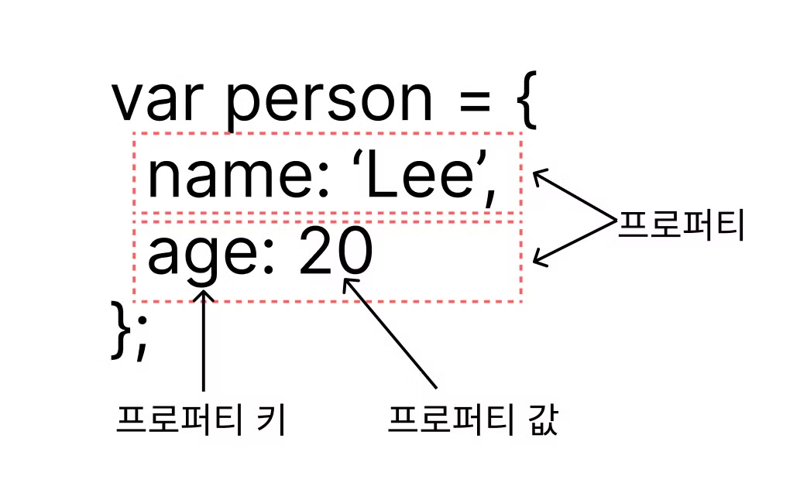

**객체의 프로퍼티와 메서드**

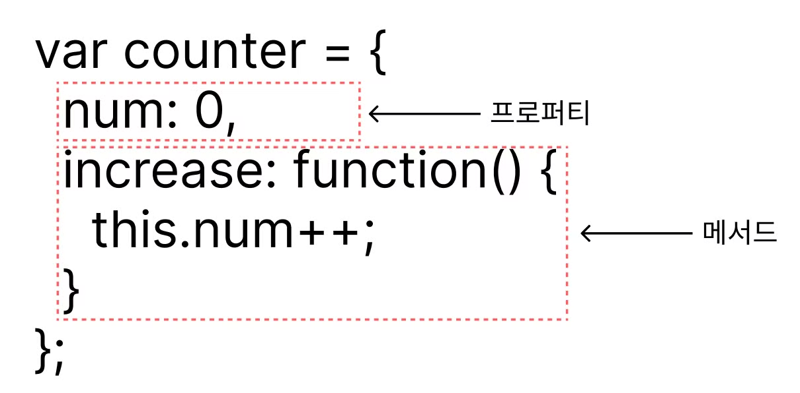

- **프로퍼티**: 객체의 상태를 나타내는 값
- **메서드**: 프로퍼티(상태 데이터)를 참조하고 조작할 수 있는 동작(behavior)

## 10.2 객체 리터럴에 의한 객체 생성

자바스크립트는 프로토타입 기반 객체지향 언어로서 클래스 기반 객체지향 언어와는 달리 다양한 객체 생성 방법이 있다.

- 객체 리터럴
- Object 생성자 함수
- 생성자 함수
- Object.create 메서드
- 클래스(ES6)

일반적이고 간단한 방법은 객체 리터럴을 사용하는 방법이다.

리터럴은 사람이 이해할 수 있는 문자 또는 약속된 기호를 사용하여 값을 생성하는 표기법을 말한다.

객체 리터럴은 중괄호( `{…}` ) 내에 0개 이상의 프로퍼티를 정의한다. 변수에 할당되는 시점에 자바스크립트 엔진은 객체 리터럴을 해석해 객체를 생성한다.

```jsx
var person = {
  name: "Lee",
  sayHello: function () {
    console.log(`Hello! My name is ${this.name}.`);
  },
};

console.log(typeof person); // object
console.log(person); // { name: 'Lee', sayHello: f }

// 만약 중괄호 내에 프로퍼티를 정의하지 않으면 빈 객체가 생성된다.
var empty = {}; // 빈 객체
console.log(typeof empty); // object
```

- 객체 리터럴의 중괄호는 코드 블록을 의미하지 않으므로 중괄호 뒤에 세미콜론을 붙여야 한다.

## 10.3 프로퍼티

**객체는 프로퍼티의 집합이며, 프로퍼티는 키와 값으로 구성된다.**

```jsx
var person = {
  // 프로퍼티 키는 name, 프로퍼티 값은 'Lee'
  name: "Lee",
  // 프로퍼티 키는 age, 프로퍼티 값은 20
  age: 20,
};
```

- 프로퍼티를 나열할 때는 쉼표( , )로 구분한다.
  - 일반적으로 마지막 프로퍼티 뒤에는 쉼표를 사용하지 않지만, 사용해도 좋다.
- **프로퍼티 키**: 빈 문자열을 포함하는 모든 문자열 또는 심벌 값
  - **식별자 네이밍 규칙을 따르지 않는 이름에는 반드시 따옴표를 사용해야 한다.**
- **프로퍼티 값**: 자바스크립트에서 사용할 수 있는 모든 값
- 빈 문자열도 프로퍼티의 키와 값으로 사용할 수 있다.
- `var`, `function` 과 같은 예약어를 프로퍼티 키로 사용해도 에러가 발생하지 않는다.
  - 예상치 못한 에러가 발생할 여지가 있으므로 권장하지 않는다.
- 이미 존재하는 프로퍼티 키를 중복 선언하면 나중에 선언한 프로퍼티가 먼저 선언한 프로퍼티를 덮어쓴다.

```jsx
var person = {
  firstName: "Ung-mo", // 식별자 네이밍 규칙을 준수하는 프로퍼티 키
  "last-name": "Lee", // 식별자 네이밍 규칙을 준수하지 않는 프로퍼티 키
};

console.log(person); // { firstName: "Ung-mo", last-name: "Lee" }
```

- 식별자 네이밍 규칙을 준수하지 않는 경우 따옴표를 생략할 수 없다.
  - 따옴표를 생략하면 `last-name`을 `-` 연산자가 있는 표현식으로 해석한다.

```jsx
var obj = {};
var key = "hello";

// ES5: 프로퍼티 키 동적 생성
obj[key] = "world";
// ES6: 개선된 프로퍼티 이름
// var obj = { [key]: 'world' }

console.log(obj); // { hello: "world" }
```

- 문자열 또는 문자열로 평가할 수 있는 표현식을 사용해 프로퍼티 키를 동적으로 생성할 수도 있다.
  - 이 경우에는 프로퍼티 키로 사용할 표현식을 대괄호로 묶어야 한다.

```jsx
var foo = {
  name: "Lee",
  name: "Kim",
};

console.log(foo); // { name: "kim" }
```

- 값을 덮어쓰지만 에러가 발생하지 않는다.

## 10.4 메서드

- 자바스크립트에서 사용할 수 있는 모든 값은 프로퍼티 값으로 사용할 수 있다.
- 자바스크립트의 함수는 객체(일급 객체)다.
  따라서 함수는 값으로 취급할 수 있기 때문에 프로퍼티 값으로 사용할 수 있다.
- 프로퍼티 값이 함수일 경우 일반 함수와 구분하기 위해 메서드(method)라 부른다.

따라서 메서드는 객체에 묶여있는 함수를 의미한다.

## 10.5 프로퍼티 접근

- 마침표 프로퍼티 접근 연산자(`.`)를 사용하는 **마침표 표기법**
- 대괄호 프로퍼티 접근 연산자(`[…]`)를 사용하는 **대괄호 표기법**

```jsx
var person = {
  name: "Lee",
  "last-name": "Kim", // 점 표기법 접근 X, 대괄표 표기법 접근 O
};

// 마침표 표기법에 의한 프로퍼티 접근
console.log(person.name); // Lee

// 대괄호 표기법에 의한 프로퍼티 접근
console.log(person["name"]); // Lee
console.log(person[name]); // ReferenceError: name is not defined

console.log(person.age); // undefined
```

- **대괄호 프로퍼티 접근 연산자 내부에 지정하는 프로퍼티 키는 반드시 따옴표로 감싼 문자열** 이어야 한다.
  - 따옴표로 감싸지 않은 이름을 프로퍼티 키로 사용하면 식별자로 해석한다.
- **객체에 존재하지 않는 프로퍼티에 접근하면 에러가 아닌 `undefined`를 반환**한다.
- 프로퍼티 키가 식별자 네이밍 규칙을 준수하는 이름, 즉 자바스크립트에서 사용 가능한 유효한 이름이면 마침표 표기법과 대괄호 표기법 모두 사용할 수 있다.
- 프로퍼티 키가 식별자 네이밍 규칙을 준수하지 않는 이름, 즉 자바스크립트에서 사용 가능한 유효한 이름이 아니면 반드시 대괄호 표기법을 사용해야 한다.
  - 프로퍼티 키가 숫자로 이뤄진 문자열인 경우 따옴표를 생략할 수 있다.

## 10.6 프로퍼티 값 갱신

- 이미 존재하는 프로퍼티에 값을 할당하면 프로퍼티 값이 갱신된다.

```jsx
var person = {
  name: "Lee",
};

// person 객체에 name 프로퍼티가 존재하므로 name 프로퍼티의 값이 갱신된다.
person.name = "Kim";

console.log(person); // { name: "Kim" }
```

## 10.7 프로퍼티 동적 생성

- 존재하지 않는 프로퍼티에 값을 할당하면 프로퍼티가 동적으로 생성되어 추가되고 프로퍼티 값이 할당 된다.

```jsx
var person = {
  name: "Lee",
};

// person 객체에는 age 프로퍼티가 존재하지 않는다.
// 따라서 person 객체에 age 프로퍼티가 동적으로 생성되고 값이 할당된다.
person.age = 20;

console.log(person); // { name: "Lee", age: 20 }
```

## 10.8 프로퍼티 삭제

- `delete` 연산자는 객체의 프로퍼티를 삭제한다.
  - 프로퍼티 값에 접근할 수 있는 표현식이어야 한다.
  - 만약 존재하지 않는 프로퍼티를 삭제하면 아무런 에러 없이 무시된다.

```jsx
var person = {
  name: "Lee",
};

// 프로퍼티 동적 생성
person.age = 20;

// person 객체에 age 프로퍼티가 존재한다.
// 따라서 delete 연산자로 age 프로퍼티를 삭제할 수 있다.
delete person.age;

// person 객체에 address 프로퍼티가 존재하지 않는다.
// 따라서 delete 연산자로 address 프로퍼티를 삭제할 수 없다. 이때 에러가 발생하지 않는다.
delete person.address;

console.log(person); // { name: "Lee" }
```

## 10.9 ES6에서 추가된 객체 리터럴의 확장 기능

### 프로퍼티 축약 표현

- 객체 리터럴의 프로퍼티는 프로퍼티 키와 값으로 구성된다.
- 프로퍼티 값은 변수에 할당된 값, 즉 식별자 표현식일 수도 있다.
- 프로퍼티 값으로 변수를 사용하는 경우 변수 이름과 프로퍼티 키가 동일한 이름일 때 프로퍼티 키를 생략할 수 있다.

이때 프로퍼티 키는 변수 이름으로 자동 생성된다.

```js
// ES5
var x = 1,
  y = 2;

var obj = {
  x: x,
  y: y,
};

console.log(obj); // { x: 1, y: 2}
```

```jsx
// ES6
let x = 1,
  y = 2;

// 프로퍼티 축약 표현
const obj = { x, y };

console.log(obj); // { x:1, y: 2 }
```

### 계산된 프로퍼티 이름

- 문자열 또는 문자열로 타입 변환할 수 있는 값으로 평가되는 표현식을 사용해 프로퍼티 키를 동적으로 생성할 수도 있다.
- 프로퍼티 키로 사용할 표현식을 대괄호로 묶어야 한다.
- 객체 리터럴 내부에서도 계산된 프로퍼티 이름으로 프로퍼티 키를 동적 생성할 수 있다.

이를 계산된 프로퍼티 이름이라 한다.

```jsx
// ES5
var perfix = "prop";
var i = 0;

var obj = {};

// 계산된 프로퍼티 이름으로 프로퍼티 키 동적 생성
obj[prefix + "-" + ++i] = i;
obj[prefix + "-" + ++i] = i;
obj[prefix + "-" + ++i] = i;

console.log(obj); // { prop-1: 1, prop-2: 2, prop-3: 3 }
```

```jsx
// ES6
const prefix = "prop";
let i = 0;

// 객체 리터럴 내부에서 계산된 프로퍼티 이름으로 프로퍼티 키를 동적 생성
const obj = {
  [`${prefix}-${++i}`]: 1,
  [`${prefix}-${++i}`]: 1,
  [`${prefix}-${++i}`]: 1,
};

console.log(obj); // { prop-1: 1, prop-2: 2, prop-3: 3 }
```

### 메서드 축약 표현

- 메서드를 정의할 때 `function` 키워드를 생략한 축약 표현을 사용할 수 있다.
  - ES6의 메서드 축약 표현으로 정의한 메서드는 프로퍼티에 할당한 함수와 다르게 동작한다. (26.2절 “메서드” 참고)

```jsx
// ES5
var obj = {
  name: "Lee",
  sayHi: function () {
    console.log("Hi! " + this.name);
  },
};

obj.sayHi(); // Hi! Lee
```

```jsx
// ES6
const obj = {
  name: "Lee",
  // 메서드 축약 표현
  sayHi() {
    console.log("Hi! " + this.name);
  },
};

obj.sayHi(); // Hi! Lee
```

# 11. 원시 값과 객체의 비교

자바스크립트가 제공하는 7가지 데이터 타입은 크게 **원시 타입**과 **객체 타입**으로 구분할 수 있다.

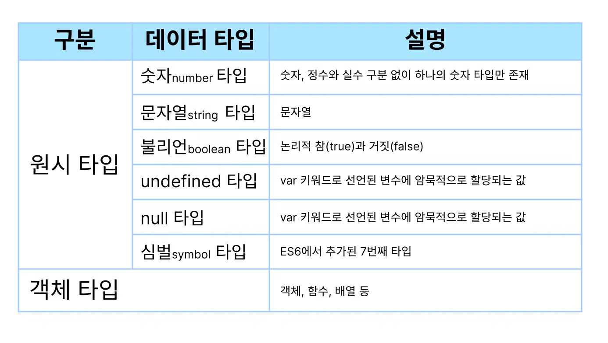

- 원시 타입의 값은 **변경 불가능한 값**이다.
  - 객체(참조) 타입의 값은 **변경 가능한 값**이다.
- 원시 값을 변수에 할당하면 변수(확보된 메모리 공간)에는 **실제 값**이 저장된다.
  - 객체를 변수에 할당하면 변수(확보된 메모리 공간)에는 **참조 값**이 저장된다.
- **값(메모리 주소)에 의한 전달**: 원시 값을 갖는 변수를 다른 변수에 할당하면 원본의 **원시 값이 복사되어 전달**된다.
- **참조에 의한 전달**: 객체를 가리키는 변수를 다른 변수에 할당하면 원본의 **참조 값이 복사되어 전달**된다.

## 11.1 원시 값

### 변경 불가능한 값

- 원시 타입의 값은 변경 불가능한 값이다.
  - 한번 생성된 원시 값은 읽기 전용(read only) 값으로서 변경할 수 없다.
  - 변경 불가능하다는 것은 변수가 아닌 값에 대한 진술이다.
  - 불변성을 갖는 원시 값을 할당한 변수는 재할당 이외에 변수 값을 변경할 수 있는 방법이 없다.

<details>

<summary>불변성</summary>

원시 값은 변경 불가능한 값이기 때문에 값을 직접 변경할 수 없다.

변수 값을 변경하기 위해 원시 값을 재할당하면 새로운 메모리 공간을 할당한 후, 변수가 참조하던 메모리 공간의 주소를 변경한다.

</details>
만약 재할당 이외에 원시 값인 변수 값을 변경할 수 있다면 예기치 않게 변수 값이 변경될 수 있다는 것을 의미한다.

이는 값의 변경, 즉 상태 변경을 추적하기 어렵게 만든다.

### 문자열과 불변성

- 원시 값을 저장하려면 먼저 확보해야 하는 메모리 공간의 크기를 결정해야 한다.
  - 원시 타입별로 메모리 공간의 크기가 미리 정해져있다.
  - ECMAScript 사양에 문자열 타입(2바이트)와 숫자 타입(8바이트) 이외의 원시 타입은 크기를 명확하게 규정하고 있지 않아서 환경에 따라 원시 타입의 크기는 다를 수 있다.
- 문자열은 0개 이상의 문자로 이뤄진 집합을 말하며, 1개의 문자는 2바이트 메모리 공간에 저장된다.
  - 문자열은 몇 개의 문자로 이뤄졌느냐에 따라 필요한 메모리 공간의 크기가 결정된다.
  - 숫자 값은 1과 1000000도 동일한 8바이트가 필요하다.
- **문자열은 원시타입이며, 변경 불가능하다.**
  - 문자열이 생성된 이후에는 변경할 수 없다.

```jsx
var str = "Hello";
str = "world";
```

- 두 번째 문이 실행되면 이전에 생선된 문자열 `'Hello'` 를 수정하는 것이 아니다.
- 식별자 `str` 이 문자열 `'Hello'` 를 가리키고 있다가 문자열 `'world'` 를 가리키도록 변경되었을 뿐이다.

```jsx
var str = "string";

console.log(str[0]); // s

// 문자열은 유사 배열이므로 배열과 유사하게 인덱스를 사용해 각 문자에 접근할 수 있다.
// 하지만 무자열은 원시 값이므로 변경할 수 없다. 이때 에러가 발생하지 않는다.
str[0] = "S";

console.log(str); // string
```

- 이미 생성된 문자열의 일부 문자를 변경해도 반영되지 않는다.
- 한번 생성된 문자열은 읽기 전용 값으로서 변경할 수 없다.

원시 값은 어떤 일이 있어도 불변하므로 예기치 못한 변경으로부터 자유롭다. 이는 데이터의 신뢰성을 보장한다.

하지만 변수에 새로운 문자열을 재할당하는 것은 가능하다. 기존 문자열을 변경하는 것이 아니라 새로운 문자열을 새롭게 할당하는 것이기 때문이다.

### 값에 의한 전달

- 변수에 변수를 할당했을 때 무엇이 어떻게 전달되는지 알아보자

```jsx
var score = 80;
var copy = score;

console.log(score); // 80
console.log(copy); // 80
console.log(score === copy); // true

score = 100;

console.log(score); // 100
console.log(copy); // ??
```

- **값에 의한 전달**: 변수에 원시 값을 갖는 변수를 할당하면 할당 받는 변수에는 원시 값이 복사되어 저장된다.
- `score` 와 `cpoy` 변수는 숫자 값 80을 갖는다는 점에서는 동일하지만, `score` 와 `copy` 변수의 값 80은 다른 메모리 공간에 저장된 별개의 값이다.

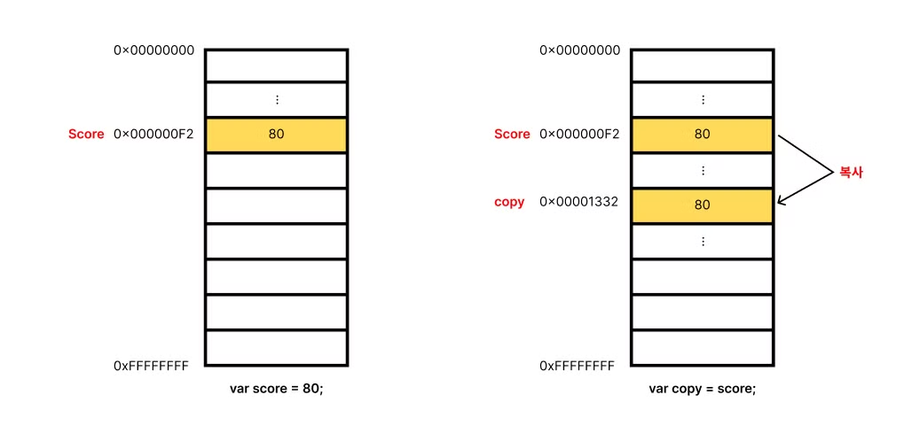

- ECMAScript 사양에 변수를 통해 메모리를 어떻게 관리하는지 명확하게 정의되어 있지 않기 때문에 실제 자바스크립트 엔진의 내부 동작과 정확히 일치하지 않을 수 있다.

```jsx
var score = 80;
// copy 변수에는 score 변수의 값 80이 복사되어 할당된다.
var copy = score;

console.log(score, copy); // 80 80
console.log(score === copy); // true

// score 변수와 copy 변수의 값은 다른 메모리 공간에 저장된 별개의 값이다.
// 따라서 score 변수와 값을 변경해도 copy 변수의 값에는 어떠한 영향도 주지 않는다.
score = 100;

console.log(score, copy); // 100 80
console.log(score === copy); // false
```

- 원시 값을`score` 변수는 원시 값을 갖고 있으며, `score` 값을 `copy` 변수에 할당하면 `score`의 값이 `copy`에 복사된다.
  - 이때 두 변수는 서로 다른 메모리 공간에 저장된 별개의 값을 갖는다.
- 따라서 `score` 변수를 재할당하면 새로운 메모리 공간에 값이 저장되어, `copy` 변수의 값은 영향을 받지 않는다.

**`값에 의한 전달`** 은 엄격하게 표현하면 변수에는 값이 전달되는 것이 아니라 메모리 주소가 전달된다. 이는 변수와 같은 식별자는 값이 아니라 메모리 주소를 기억하고 있기 때문이다.

전달된 메모리 주소를 통해 메모리 공간에 접근하면 값을 참조할 수 있다.

변수에 원시 값을 갖는 변수를 할당하면 변수 할당 시점이든, 두 변수 중 어느 하나의 변수에 값을 재할당하는 시점이든

결국은 두 변수의 원시 값은 서로 다른 메모리 공간에 저장된 별개의 값이 되어 어느 한쪽에서 재할당을 통해 값을 변경하더라도 서로 간섭할 수 없다.

## 11.2 객체

- 객체는 프로퍼티의 개수가 정해져 있지 않으며, 동적으로 추가되고 삭제할 수 있다.
- 프로퍼티의 값에도 제약이 없다.
- 따라서 객체는 원시 값과 같이 확보해야 할 메모리 공간의 크기를 사전에 정해 둘 수 없다.
  - 원시 값은 상대적으로 적은 메모리를 소비하지만, 객체는 경우에 따라 크기가 매우 클 수도 있다.
  - 객체를 생성하고 접근하는 것도 원시 값과 비교할 때 비용이 많이 드는 일이다.

### 변경 가능한 값

- 객체(참조) 타입의 값은 변경 가능한 값이다.
- 객체를 할당한 변수가 메모리 주소를 통해 메모리 공간에 접근하면 **참조 값**에 접근할 수 있다.
  - 참조 값은 생성된 객체가 저장된 메모리 공간의 주소이다.

```jsx
// 할당이 이뤄지는 시점에 객체 리터럴이 해석되고, 그 결과 객체가 생성된다.
var person = {
  name: "Lee",
};

// person 변수에 저장되어 있는 참조 값으로 실제 객체에 접근한다.
console.log(person); // { name: "Lee" }
```

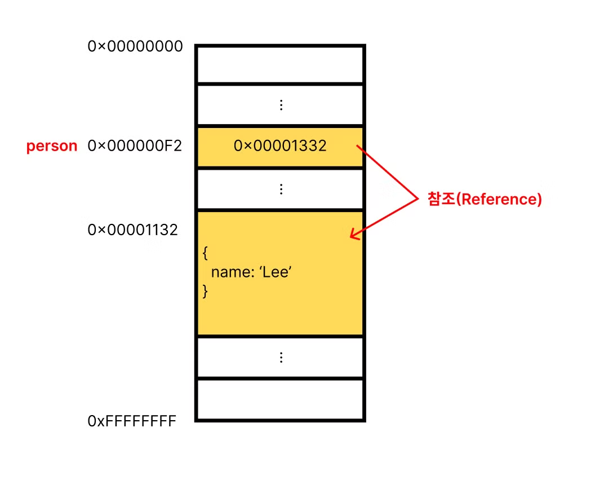

- 객체를 할당한 변수를 참조하면 메모리에 저장되어 있는 참조 값을 통해 실제 객체에 접근한다.
  - `person` 변수는 객체 `{ name: "Lee" }` 를 가리키고(참조하고) 있다.

원시 값은 변경 불가능한 값이므로 원시 값을 갖는 변수의 값을 변경하려면 재할당 외에는 방법이 없다. 하지만 객체는 변경 가능한 값이다. <br/>

**따라서 객체를 할당한 변수는 재할당 없이 객체를 직접 변경할 수 있다.**

```jsx
var person = {
  name: "Lee",
};

// 프로퍼티 값 갱신
person.name = "Kim";

// 프로퍼티 동적 생성
person.address = "Seoul";

console.log(person); // { name: "Kim", address: "Seoul" }
```

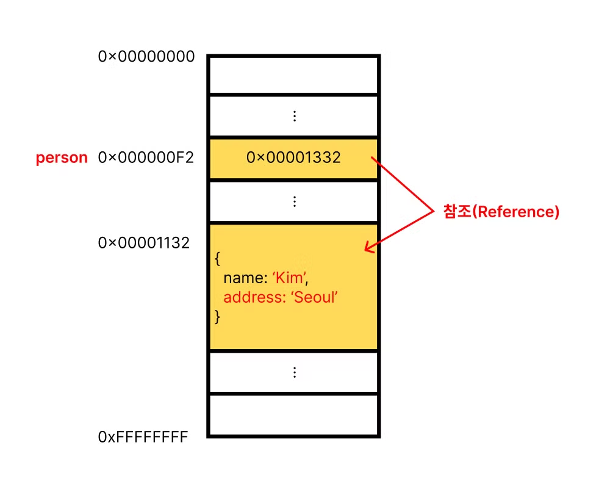

- 객체는 변경 가능한 값이므로 메모리에 저장된 객체를 직접 수정할 수 있다.
- 객체를 할당한 변수에 재할당을 하지 않았으므로 객체를 할당한 변수의 참조 값은 변경되지 않는다.

객체는 원시 값과 다르게 **여러 개의 식별자가 하나의 객체를 공유할 수 있다**는 부작용이 있다.

<details>

<summary>얕은 복사와 깊은 복사</summary>

- 얕은 복사: 객체를 프로퍼티 값으로 갖는 객체의 경우 한 단계까지만 복사하는 것을 말한다.
- 깊은 복사: 객체에 중첩되어 있는 객체까지 모두 복사하는 것을 말한다.

**정리하면 <br/>**

`얕은 복사`는 객체의 주소값만 복사하여 두 변수가 **같은 객체를 참조**하도록 한다. 따라서 하나의 변수를 수정하면 **다른 변수에도 그 수정 사항이 반영**된다.

`깊은 복사`는 객체의 **실제 값을 통째로 복사**하여 두 변수가 각각 **독립된 메모리 공간**을 갖는다. 따라서 한 변수를 수정해도 다른 변수에는 **영향을 주지 않는다**.

</details>

### 참조에 의한 전달

- 객체를 가리키는 변수를 다른 변수에 할당하면 원본의 참조 값이 복사되어 전달된다. 이를 참조에 의한 전달이라 한다.

```jsx
var person = {
  name: "Lee",
};

// 참조 값을 복사(얕은 복사)
var copy = person;
```

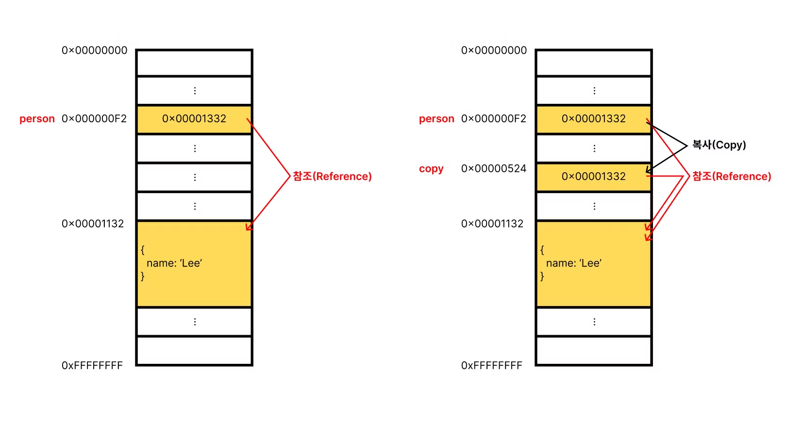

- 두 개의 식별자가 하나의 객체를 공유한다.
- 원본 또는 사본 중 어느 한쪽에서 객체를 변경하면 서로 영향을 주고 받는다.

```jsx
var person = {
  name: "Lee",
};

// 침조 값을 복사(얕은 복사), copy와 person은 동일한 참조 값을 갖는다.
var copy = person;

// copy와 person은 동일한 객체를 참조한다.
console.log(copy === person); // true

// copy를 통해 객체를 변경한다.
copy.name = "Kim";

// person을 통해 객체를 변경한다.
person.address = "Seoul";

// copy와 person은 동일한 객체를 가리킨다.
// 따라서 어느 한쪽에서 객체를 변경하면 서로 영향을 주고 받는다.
console.log(person); // { name: 'Kim', address: 'Seoul' }
console.log(copy); // { name: 'Kim', address: 'Seoul' }
```

- `값에 의한 전달` 과 `참조에 의한 전달` 은 식별자가 기억하는 메모리 공간에 저장되어 있는 값을 복사해서 전달한다는 면에서 동일하다.
- 하지만 변수에 저장되어 있는 값이 원시 값이냐 참조 값이냐의 차이만 있다.
- 따라서 자바스크립트에는 `참조에 의한 전달`은 존재하지 않고 `값에 의한 전달`만이 존재한다고 할 수 있다.

```jsx
var person1 = {
  name: "Lee",
};

var person2 = {
  name: "Lee",
};

console.log(person1 === person2); // 1. ??
console.log(person1.name === person2.name); // 2. ??
```

- `===` 일치 비교 연산자는 변수에 저장되어 있는 값을 타입 변환하지 않고 비교한다.
  - 객체를 할당한 변수를 비교하면 참조 값을 비교하고, 원시 값을 할당한 변수를 비교하면 원시 값을 비교한다.
- `person1` 변수와 `person2` 변수가 가리키는 객체는 내용은 같지만 다른 메모리에 저장된 별개의 객체이다.
  - 따라서 `1번` 의 값은 `false` 가 된다.
- 프로퍼티 값을 참조하는 `person1.name` 과 `person2.name` 은 값으로 평가될 수 있는 표현식이다.
  - 두 표현식 모두 원시 값 `Lee` 로 평가되므로 `2번` 값은 `true` 이다.

# 12. 함수

## 12.1 함수란?

- 일련의 과정을 문으로 구현하고 코드 블록으로 감싸서 하나의 실행 단위로 정의한 것이다.
- **함수 정의**: 함수는 함수 정의를 통해 생성한다.
- **함수 호출:** 함수를 실행하기 위해선 함수의 실행을 명시적으로 지시해야 한다.

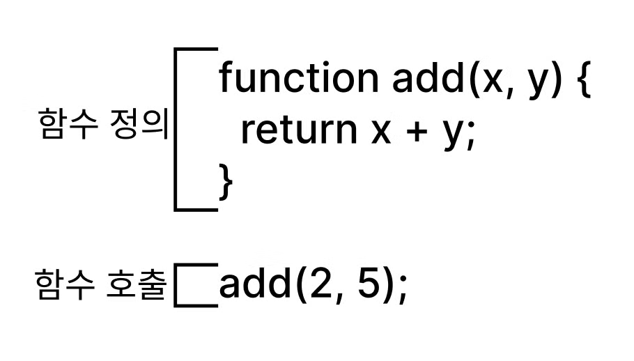

- `add`: 함수 이름
- `(x, y)`: 매개 변수
- `return x + y`: 반환 값
- `(2, 5)`: 인수

## 12.2 함수를 사용하는 이유

- 코드의 중복을 억제하고 재사용성을 높이는 함수는 유지보수의 편의성을 높인다.
- 실수를 줄여 코드의 신뢰성을 높인다.
- 코드의 가독성을 향상시킨다.

## 12.3 함수 리터럴

- 함수는 객체 타입의 값이다.
- 함수 리터럴은 `function 키워드`, `함수 이름`, `매개변수 목록`, `함수 몸체`로 구성된다.

**함수 리터럴의 구성 요소**

| 구성 요소     | 설명                                                                                                                                 |
| ------------- | ------------------------------------------------------------------------------------------------------------------------------------ |
| 함수 이름     | 함수 몸체 내에서만 참조할 수 있는 식별자이며, 생략할 수 있다. 이름이 있는 함수를 기명함수, 이름이 없는 경우를 무명/익명 함수라 한다. |
| 매개변수 목록 | 호출할 때 지정한 인수가 순서대로 할당된다. 함수 몸체 내에서 변수와 동일하게 취급된다.                                                |
| 함수 몸체     | 함수가 호출되었을 때 일괄적으로 실행될 문들을 실행 단위로 정의한 코드 블록이다.                                                      |

- 함수는 객체지만 일반 객체와는 다르다.
  - 일반 객체는 호출할 수 없지만 함수는 호출할 수 있다.
  - 함수 객체만의 고유한 프로퍼티를 갖는다.

## 12.4 함수 정의

- 함수를 호출하기 이전에 인수를 전달받을 매개변수와 실행할 문들. 그리고 반환할 값을 지정하는 것을 말한다.
- 정의된 함수는 자바스크립트 엔진에 의해 평가되어 함수 객체가 된다.
- 함수 선언문, 함수 표현식, Function 생성자 함수, 화살표 함수(ES6)로 4가지 방법이 있다.

### 함수 선언문

```jsx
// 함수 선언문
function add(x, y) {
  return x + y;
}

// 함수 참조
// console.dir은 console.log와는 달리 함수 객체의 프로퍼티까지 출력한다.
// 단 Node.js 환경에서는 console.log와 같은 결과가 출력된다.
console.dir(add); // f add(x,y)

// 함수 호출
console.log(add(2, 5)); // 7
```

- 함수 선언문은 함수 리터럴과 형태가 동일하다.
- 함수 리터럴은 함수 이름을 생략할 수 있지만, **함수 선언문은 함수 이름을 생략할 수 없다.**
- 함수 선언문은 표현식이 아닌 문이므로, 변수에 할당할 수 없다.
- 자바크립트 엔진은 생성된 함수를 호출하기 위해 함수 이름과 동일한 이름의 식별자를 암묵적으로 생성하고, 거기에 함수 객체를 할당한다.

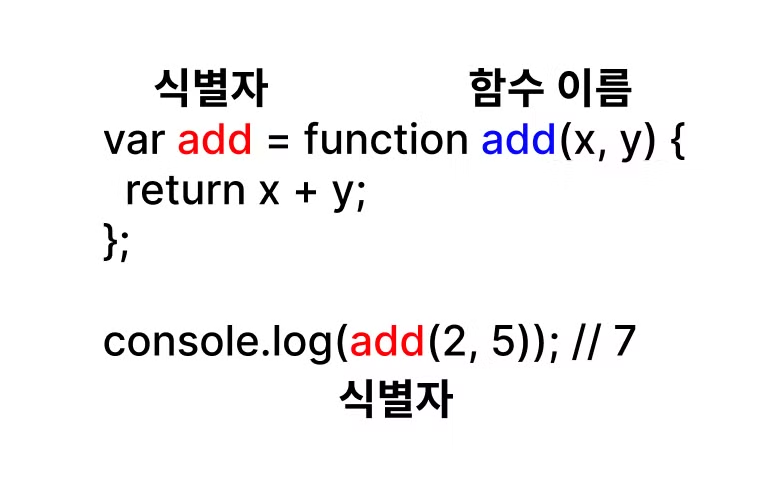

함수는 함수 이름으로 호출하는 것이 아니라 함수 객체를 가리키는 식별자로 호출한다.

### 함수 표현식

```jsx
// 함수 표현식
var add = function (x, y) {
  return x + y;
};

console.log(add(2, 5)); // 7
```

- 자바스크립트의 함수는 일급 객체이다.
  - 함수를 값처럼 자유롭게 사용할 수 있다.
- 함수는 일급 객체이므로 함수 리터럴로 생성한 함수 객체를 변수에 할당할 수 있다.
  - 이러한 함수 정의 방식을 함수 표현식이라 한다.
- 함수 표현식의 함수 리터럴은 함수 이름을 생략하는 것이 일반적이다.
  - 이러한 함수를 익명함수라 한다.
- 함수를 호출할 때는 함수 이름이 아니라 함수 객체를 가리키는 식별자를 사용해야 한다.

```jsx
// 기명 함수 표현식
var add = function foo(x, y) {
  return x + y;
};

// 함수 객체를 가리키는 식별자로 호출
console.log(add(2, 5)); // 7

// 함수 이름으로 호출하면 ReferenceError가 발생한다.
// 함수 이름은 함수 몸체 내부에서만 유효한 식별자다.
console.log(foo(2, 5)); // ReferenceError: foo is not defined
```

- 함수 선언문과 함수 표현식이 정확히 동일하게 동작하지는 않는다.
- 함수 선언문은 `표현식이 아닌 문` 이고 함수 표현식은 `표현식인 문` 이다.

### 함수 생성 시점과 함수 호이스팅

```jsx
// 함수 참조
console.log(add); // f add(x, y)
console.log(sub); // undefined

// 함수 호출
console.log(add(2, 5)); // 7
console.log(sub(2, 5)); // TypeError: sub is not a function

// 함수 선언문
function add(x, y) {
  return x + y;
}

// 함수 표현식
var sub = function (x, y) {
  return x - y;
};
```

- `함수 선언문으로 정의한 함수`와 `함수 표현식으로 정의한 함수`의 생성 시점이 다르다.
  - 함수 선언문
    - 런타임 이전에 함수 객체가 먼저 생성되다. 자바스크립트 엔진은 함수 이름과 동일한 이름의 식별자를 암묵적으로 생성하고 생성된 함수 객체를 할당한다.
    - 따라서 함수 선언문 이전에 함수를 참조할 수 있으며 호출할 수도 있다.
    - **함수 선언문이 코드의 선두로 끌어 올려진 것처럼 동작하는 자바스크립트 고유의 특징을 함수 호이스팅(Function Hosting)이라 한다.**
  - 함수 표현식
    - 변수에 할당되는 값이 함수 리터럴인 문이다.
    - 변수 선언은 런타임 이전에 실행되어 `undefined` 로 초기화되지만, 변수 할당문의 값은 할당문이 실행되는 시점. 즉 **런타임에 평가되므로 함수 표현식의 함수 리터럴도 할당문이 실행되는 시점에 평가되어 함수 객체가 된다.**
    - **함수 표현식으로 함수를 정의하면 함수 호이스팅이 발생하는 것이 아니라 변수 호이스팅이 발생한다.**

**함수 표현식에 의한 함수 생성**

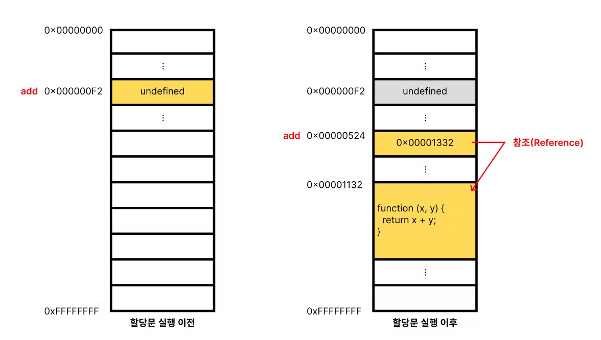

- 함수 표현식 이전에 함수를 참조하면 `undefined` 로 평가된다.
- 따라서 함수 표현식으로 정의한 함수는 반드시 함수 표현식 이후에 참조 또는 호출해야 한다.

### Function 생성자 함수

- `Function` 생성자 함수에 매개변수 목록과 함수 몸체를 문자열로 전달하면서 `new` 연산자와 함께 호출하면 함수 객체를 생성해서 반환한다.
  - `new` 연산자 없이 호출해도 결과는 동일하다.

```jsx
var add = new Function("x", "y", "return x + y");

console.log(add(2, 5)); // 7
```

- `Function` 생성자 함수로 생성한 함수는 클로저를 생성하지 않는다.
- 함수 선언문이나 함수 표현식으로 생성한 함수와 다르게 동작한다.

```jsx
var add1 = (function () {
  var a = 10;
  return function (x, y) {
    return x + y + a;
  };
})();

console.log(add1(1, 2)); // 13

var add2 = (function () {
  var a = 10;
  return new Function("x", "y", "return x + y + a;");
})();

console.log(add2(1, 2)); // ReferenceError: a is not defined
```

클로저는 추후에 나오는 내용이다. 함수 선언문이나 함수 표현식으로 생성한 함수와 `Function` 생성자 함수로 생성한 함수가 동일하게 동작하지 않는다.

### 화살표 함수

- ES6에서 도입된 화살표 함수(arrow function)는 `function` 키워드 대신 화살표 `=>` 를 사용해 좀 더 간략한 방법으로 함수를 선언할 수 있다.
- 화살표 함수는 항상 익명 함수로 정의한다.

```jsx
// 화살표 함수
const add = (x, y) => x + y;
console.log(add(2, 5)); // 7
```

- 화살표 함수는 생성자 함수로 사용할 수 없으며, 기존 함수와 `this` 바인딩이 다르고 `prototype` 프로퍼티가 없으며 `arguments` 객체를 생성하지 않는다.

## 12.5 함수 호출

- 함수는 함수를 가리키는 식별자와 한 쌍의 소괄호인 함수 호출 연산자로 호출한다.

### 매개변수와 인수

- 함수를 실행하기 위해 필요한 값을 함수 외부에서 함수 내부로 전달할 필요가 있는 경우 매개변수(인자)를 통해 인수를 전달한다.
- 인수는 값으로 평가될 수 있는 표현식이어야 한다.
- 인수는 함수를 호출할 때 지정하며 개수와 타입에 제한이 없다.

```jsx
// 함수 선언문
function add(x, y) {
  return x + y;
}

// 함수 호출
// 인수 1과 2가 매개변수 x와 y에 순서대로 할당되고 함수 몸체의 문들이 실행된다.
var result = add(1, 2);
```

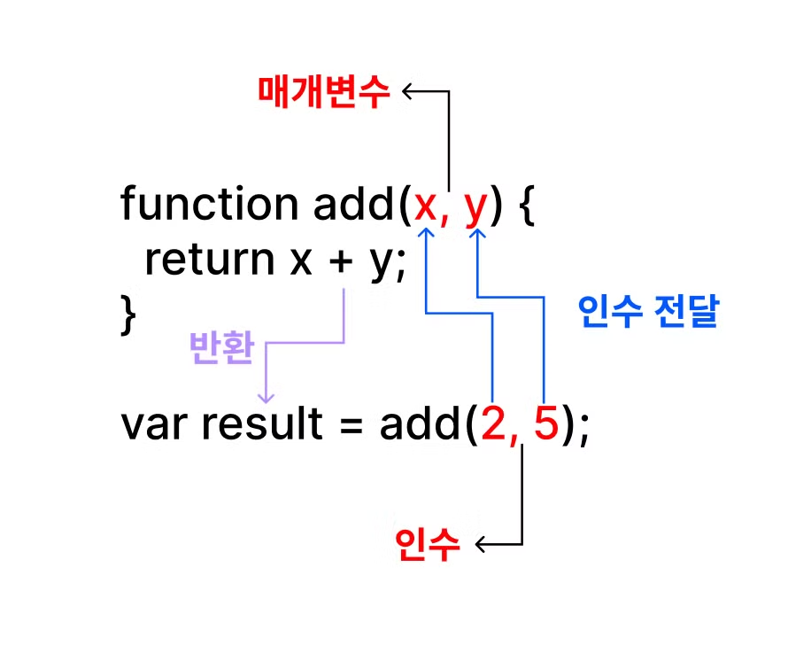

- 인수의 개수가 부족해서 인수가 할당되지 않는 매개변수의 값은 `undefined` 다.
- 매개변수보다 인수가 더 많은 경우 초과된 인수는 무시된다.
- 모든 인수는 암묵적으로 `arguments` 객체의 프로퍼티로 보관된다.

### 인수 확인

```jsx
function add(x, y) {
  return x + y;
}

console.log(add(2)); // NaN
console.log(add("a", "b")); // 'ab'
```

- 숫자 타입 인수를 전달받아 합계를 반환하려고 할 때 어떤 타입의 인수를 전달해야 하는지, 어떤 타입의 값을 반환하는지 명확하지 않다.
- 자바스크립트 문법상 어떠한 문제도 없으므로 자바스크립트 엔진은 아무런 이의 제기없이 코드를 실행한다.

따라서 적절한 인수가 전달되었는지 확인할 필요가 있다.

```jsx
function add(x, y) {
  if (typeof x !== "number" || typeof y !== "number") {
    // 매개변수를 통해 전달된 인수의 타입이 부적절한 경우 에러 발생
    throw new TypeError("인수는 모두 숫자 값이어야 합니다.");
  }

  return x + y;
}

function add1(a, b, c) {
  a = a || 0;
  b = b || 0;
  c = c || 0;
  return a + b + c;
}

function add3(a = 0, b = 0, c = 0) {
  return a + b + c;
}
```

### 반환문

- 함수는 `return` 키워드와 표현식(반환값)으로 이뤄진 반환문을 사용해 실행 결과를 함수 외부로 반환할 수 있다.
- 반환문은 함수의 실행을 중단하고 함수 몸체를 빠져나간다.
- `return` 키워드 뒤에 오는 표현식을 평가해 반환한다.
  - 반환값으로 사용할 표현식을 명시적으로 지정하지 않으면 `undefined` 가 반환된다.
- `return` 키워드와 반환값으로 사용할 표현식 사이에 줄바꿈이 있으면, `return` 뒤에 세미콜론이 자동 삽입된다.

```jsx
function multiply(x, y) {
  return x * y; // 반환문
  // 반환문 이후에 다른 문이 존재하면 그 문은 실행되지 않고 무시된다.
  console.log("실행되지 않는다");
}

// 함수 호출은 반환값으로 평가된다.
var result = multiply(3, 5);
console.log(result); // 15
```

## 12.6 참조에 의한 전달과 외부 상태의 변경

- 매개변수도 함수 몸체 내부에서 변수와 동일하게 취급되므로 매개변수 또한 타입에 따라 값에 의한 전달, 참조에 의한 전달 방식을 그대로 따른다.

```jsx
// 매개변수 primitive는 원시 값을 전달 받고, 매개변수 obj는 객체를 전달받는다.
function changeVal(primitive, obj) {
  primitive += 100;
  obj.name = "Kim";
}

// 외부 상태
var num = 100;
var person = { name: "Lee" };

console.log(num, person); // 100 { name: "Lee" }

// 원시 값은 값 자체가 복사되어 전달되고 객체는 참조 값이 복사되어 전달된다.
changeVal(num, person);

// 원시 값은 원본이 훼손되지 않는다.
console.log(num); // 100

// 객체는 원본이 훼손된다.
console.log(person); // { name: "Kim" }
```

- 원시 값은 변경 불가능한 값이므로 직접 변경할 수 없기 때문에 재할당을 통해 할당된 원시 값을 새로운 원시 값으로 교체했다.
  - 함수 외부에서 함수 몸체 내부로 전달한 원시 값의 원본을 변경하는 어떠한 부수 효과도 발생하지 않는다.
- 객체는 변경 가능한 값이므로 직접 변경할 수 있기 때문에 재할당 없이 직접 할당된 객체를 변경했다.
  - 함수 외부에서 함수 몸체 내부로 전달한 참조 값에 의해 원본 객체가 변경되는 부수 효과가 발생한다.

## 12.7 다양한 함수의 형태

### 즉시 실행 함수

- 함수 정의와 동시에 즉시 호출되는 함수를 **즉시 실행 함수(IIFE, Immediately Invoked Function Expression)** 라고 한다.
- 단 한 번만 호출되며 다시 호출할 수 없다.
- 익명 함수를 사용하는 것이 일반적이지만, 기명 즉시 실행 함수도 사용할 수 있다.
- 그룹 연산자 `()` 로 감싸야 한다.

```jsx
// 익명 즉시 실행 함수
(funtion () {
	var a = 3;
	var b = 5;
	return a * b;
}());

// 기명 즉시 실행 함수
(function foo() {
	var a = 3;
	var b = 5;
	return a * b;
}());

foo(); // ReferenceError: foo is not defined
```

### 재귀 함수

- 자기 자신을 호출하는 것을 **재귀 호출(recursive call)** 이라 한다.
- 재귀 함수는 자신을 무한 재귀 호출하므로 탈출 조건을 반드시 만들어야 한다. 그렇지 않으면 스택 오버플로 에러가 발생한다.

```jsx
// 함수 표현식
var factorial = function foo(n) {
  // 탈출 조건: n이 1이하일 때 재귀 호출을 멈춘다.
  if (n <= 1) return 1;
  // 함수를 가리키는 식별자로 자기 자신을 재귀 호출
  return n * factorial(n - 1);

  // 함수 이름으로 자기 자신을 재귀 호출할 수도 있다.
  // console.log(factorial === foo); // true
  // return n * foo(n - 1);
};

console.log(factorial(5)); // 5! = 5 * 4 * 3 * 2 * 1 = 120
```

### 중첩 함수

- 함수 내부에 정의된 함수를 **중첩 함수(nested function)** 또는 **내부 함수(inner function)** 라 한다.
- 중첩 함수를 포함하는 함수는 외부 함수(outer function)라 부른다.
- 중첩 함수는 외부 함수 내부에서만 호출할 수 있다.

```jsx
function outer() {
  var x = 1;

  // 중첩 함수
  function inner() {
    var y = 2;
    // 외부 함수의 변수를 참조할 수 있다.
    console.log(x + y); // 3
  }

  inner();
}

outer();
```

### 콜백 함수

- 함수의 매개변수를 통해 다른 함수의 내부로 전달되는 함수를 **콜백 함수(callback function)** 라고 하며, 매개변수를 통해 함수의 외부에서 콜백 함수를 전달받은 함수를 **고차 함수(HOF, Higher-Order Function)** 라고 한다.
- 고차 함수는 콜백 함수를 자신의 일부분으로 합성하며, 매개변수를 통해 전달받은 콜백 함수의 호출 시점을 결정해서 호출한다.
- 콜백 함수는 고차 함수에 의해 호출되며, 고차 함수는 필요에 따라 콜백 함수에 인수를 전달할 수 있다.

```jsx
// 외부에서 전달받은 f를 n만큼 반복 호출한다.
function repeat(n, f) {
  for (var i = 0; i < n; i++) {
    f(i); // i를 전달하면서 f를 호출
  }
}

var logAll = function (i) {
  console.log(i);
};

// 반복 호출할 함수를 인수로 전달한다.
repeat(5, logAll); // 0 1 2 3 4

var logOdds = function (i) {
  if (i % 2) console.log(i);
};

// 반복 호출할 함수를 인수로 전달한다,
repeat(5, logOdds); // 1 3
```

### 순수 함수와 비순수 함수

- 순수 함수(pure function): 외부에 상태에 의존하지도 않고 변경하지도 않는, 즉 부수 효과가 없는 함수이다.
- 비순수 함수(impute function): 외부 상태에 의존하거나 외부 상태를 변경하는, 즉 부수 효과가 있는 함수익다.
