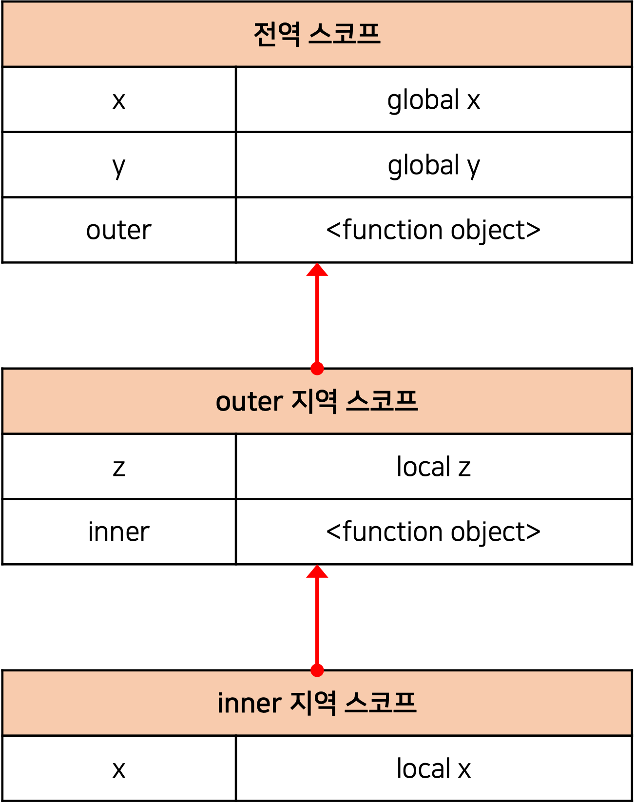
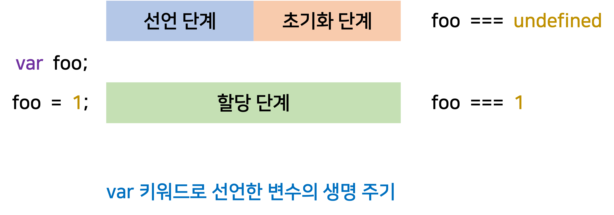
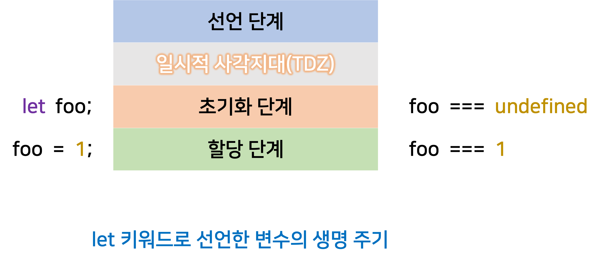

# Deep Dive Study - 3주차

<br/><br/><br/>

<h1 align="center">13.스코프</h1>

<br/>

# 스코프란?

**스코프**는 **`식별자가 유효한 범위`** 를 말한다.

모든 식별자(변수 이름, 함수 이름, 클래스 이름 등)는 자신이 선언된 위치에 의해 다른 코드가 식별자 자신을 참조할 수 있는 유효 범위가 결정된다.

**스코프**를 통해 식별자인 변수 이름의 충돌을 방지하여 같은 이름의 변수를 사용할 수 있게 한다. 즉, 스코프는 `네임스페이스`다.

```js
var x = "global";

function foo() {
  var x = "local";
  consol.log(x); // local
}
foo();

consol.log(x); // global
```

위 코드에서 두 개의 x 변수는 이름은 동일하지만 **스코프(자신이 유효한 범위)** 가 다른 별개의 변수다.

<br/>

> ✍🏻 **식별자 결정**
>
> 자바스크립트 엔진이 스코프를 통해 어떤 변수를 참조해야할 것인지 결정하는 것을 식별자 결정이라고 한다. 따라서 **스코프**를 자바스크립트 엔진이 `식별자를 검색할 때 사용하는 규칙`이라고도 할 수 있다.

<br/>

> ✍🏻 **코드의 문맥과 환경**
>
> 코드가 어디서 실행되며 주변에 어떤 코드가 있는지를 **렉시컬 환경(lexical environment)** 이라고 부른다. 즉, 코드의 문맥은 `렉시컬 환경`으로 이뤄진다.
> 이를 구현한 것이 **실행 컨테스트(Execution context)** 이며, 모든 코드는 실행 컨텍스트에서 평가되고 실행된다.

<br/>

> ✍🏻 **var 키워드로 선언한 변수의 중복 선언**
>
> `var` 키워드로 선언된 변수는 같은 스코프 내에서 중복 선언이 허용된다. 이는 의도치 않게 변수값이 재할당되는 부작용이 있다. 하지만 `let`이나 `const` 키워드로 선언된 변수는 같은 스코프 내에서 중복 선언을 허용하지 않는다.

<br/><br/>

# 스코프의 종류

코드는 **전역**과 **지역**으로 구분할 수 있다.

| 구분         | 설명             | 스코프      | 변수      |
| ------------ | ---------------- | ----------- | --------- |
| 전역(Global) | 코드의 가장 바깥 | 전역 스코프 | 전역 변수 |
| 지역(Local)  | 함수 몸체 내부   | 지역 스코프 | 지역 변수 |

<br/>

변수는 자신이 <ins>선언된 위치에 의해 자신이 유효한 범위인 스코프가 결정</ins>된다.

전역에서 선언된 변수는 전역 스코프를 갖는 전역 변수이고, 지역에서 선언된 변수는 지역 스코프를 갖는 지역 변수다.

<br/>

## 전역과 전역 스코프

전역이란 코드의 **가장 바깥 영역**을 말한다. 전역에 변수를 선언하면 전역 스코프를 갖는 전역 변수가 된다. <ins>전역 변수는 어디서든지 참조할 수 있다.</ins>

<br/>

## 지역과 지역 스코프

지역이란 **함수 몸체 내부**를 말한다. 지역에 변수를 선언하면 지역 스코프를 갖는 지역 변수가 된다. <ins>지역 변수는 자신의 지역 스코프와 하위 지역 스코프에서 유효하다.</ins>

<br/><br/>

# 스코프 체인

```js
var x = "global x";
var y = "global y";

function outer() {
  var z = "local z";

  function inner() {
    var x = "local x";
  }
  inner();
}
outer();
```

<div style="max-width: 350px; margin: 0 auto;" >



</div>

스코프 체인은 실행 컨텍스트의 렉시컬 환경을 단방향으로 연결한 것이다.
모든 스코프는 하나의 계층적 구조로 연결되고 모든 지역 스코프의 최상위 스코프는 전역 스코프다.
이렇게 스코프가 계층적으로 연결된 것을 **스코프 체인(Scope chain)** 이라 한다.

변수를 참조할 때 자바스크립트 엔진은 스코프 체인을 따라 변수를 참조하는 코드의 스코프에서 시작해서 상위 스코프 방향으로 이동하며 선언된 변수를 검색한다. **_이를 통해 하위 스코프에서 상위 스코프의 변수를 참조할 수 있다._**

<br/>

> ✍🏻 **렉시컬 환경(Lexical Environment)**
>
> 스코프 체인은 **실행 컨텍스트**의 **렉시컬 환경**을 **단방향**으로 연결한 것이다.
> **전역 렉시컬 환경**은 코드가 로드되면 곧바로 생성되고 **함수의 렉시컬 환경**은 함수가 호출되면 생성된다.

<br/>

## 스코프 체인에 의한 변수 검색

자바스크립트 엔진은 스코프 체인을 따라 변수를 참조하는 코드의 스코프에서 시작해서 상위 스코프 방향으로 이동하며 선언된 변수를 검색한다.

**_상위 스코프에서 유효한 변수는 하위 스코프에서 자유롭게 참조할 수 있지만, 하위 스코프에서 유효한 변수를 상위 스코프에서 참조할 수 없다._**

<br/>

## 스코프 체인에 의한 함수 검색

```js
// 전역 함수
function foo() {
  console.log("global function foo");
}

function bar() {
  // 중첩 함수
  function foo() {
    console.log("local function foo");
  }
  foo(); // local function foo
}
bar();
```

함수 선언문으로 함수를 정의하면 런타임 이전에 함수 객체가 먼저 생성된다.

함수는 식별자에 함수 객체가 할당된 것 외에는 **일반 변수와 다를 바 없다.**

<br/><br/>

# 함수 레벨 스코프

지역은 함수 몸체 내부를 말한다. 이는 **함수에 의해서만 지역 스코프가 생성된다**는 것이다.

<br/>

### 블록 레벨 스코프(Block Level Scope)

대부분의 프로그래밍 언어는 함수 몸체만이 아니라 모든 코드 블록 (if, for, while, try/catch 등)이 지역 스코프를 만든다. 이러한 특성을 **블록 레벨 스코프**라 한다.

<br/>

### 함수 레벨 스코프(Function Level Scope)

`var` 키워드로 선언된 변수는 오로지 함수의 코드 블록(함수 몸체)만을 지역 스코프로 인정한다. 이러한 특성을 **함수 레벨 스코프**라 한다.

`var` 키워드로 선언된 변수는 **함수 레벨 스코프**만을 인정하기 때문에 함수 몸체 밖에서 var 키워드로 선언한 변수는 코드 블록 내부에 있더라도 전역 변수로 취급된다.

```js
var x = 1;

if (true) {
  var x = 10;
}

console.log(x); // 10
```

```js
var i = 10;

for (var i = 0; i < 5; i++) {
  console.log(i); // 0 1 2 3 4
}

console.log(i); // 5
```

`var` 키워드로 선언된 변수는 함수의 코드 블록만을 지역 스코프로 인정하지만, `let`, `const` 키워드는 **블록레벨 스코프**를 지원한다.

<br/><br/>

# 렉시컬 스코프

```js
var x = 1;

function foo() {
  var x = 10;
  bar();
}

function bar() {
  console.log(x);
}
foo(); // 1
bar(); // 1
```

<br/>

### 동적 스코프(Dynamic scope)

**_함수를 어디서 호출했는지에 따라 함수의 상위 스코프를 결정한다._** 즉, 함수를 정의하는 시점에 함수가 어디서 호출되는지 알 수 없다. 따라서 <ins>함수가 호출되는 시점에 동적으로 상위 스코프를 결정</ins>한다.

<br/>

### 정적 스코프(Static scope) 또는 렉시컬 스코프(Lexical scope)

**_함수를 어디서 정의했는지에 따라 함수의 상위 스코프를 결정한다._ 함수 정의가 평가되는 시점에 상위 스코프가 `정적으로` 결정된다.**

대부분의 프로그래밍 언어는 렉시컬 스코프를 따른다.

자바스크립트는 렉시컬 스코프를 따르므로 함수를 어디서 호출했는지가 아니라 함수를 어디에 정의했는지에 따라 상위 스코프를 결정한다. 함수가 호출된 위치는 상위 스코프 결정에 어떠한 영향도 주지 못한다.

렉시컬 스코프는 클로저와 깊은 관계가 있다.

<br/><br/><br/>

<h1 align="center">14.전역 변수의 문제점</h1>

<br/>

# 변수의 생명 주기

변수는 생성되고 소멸되는 **생명 주기(Life cycle)** 가 있다. 변수의 생명 주기는 메모리 공간이 확보된 시점부터 메모리공간이 해제되어 가용 메모리 풀에 반환되는 시점까지이다.

<br/>

## 지역 변수의 생명 주기

**전역 변수**는 런타임 이전에 자바스크립트 엔진에 의해 먼저 실행된다. 하지만, **지역 변수**는 함수가 호출된 직후 함수 코드가 순차적으로 실행되기 전에 자바스크립트 엔진에 의해 먼저 실행된다.
즉, **_지역 변수의 생명 주기는 함수의 생명 주기와 일치한다._**

변수는 자신이 등록된 스코프가 소멸(메모리 해제)될 때 까지 유효하다. 메모리와 마찬가지로 누군가 스코프를 참조하고 있으면 스코프는 소멸하지 않고 생존하게 된다.

일반적으로 함수가 종료하면 함수가 생성한 스코프도 소멸하지만, 누군가 스코프를 참조하고 있다면 스코프는 소멸하지 않는다.

```js
var x = "global";

function foo() {
  console.log(x); // undefined
  var x = "local";
}

foo();
console.log(x); // global
```

**_호이스팅은 스코프를 단위로 동작한다._** 즉, **호이스팅**은 변수 선언이 스코프의 선두로 끌어 올려진 것처럼 동작하는 것이다.

<br/>

## 전역 변수의 생명 주기

전역 코드는 함수 호출과 같이 전역 코드를 실행하는 특별한 진입점이 없고 코드가 로드되자마자 곧바로 해석되고 실행되고 더 이상 실행할 문이 없을 때 종료된다.

`var` 키워드로 선언한 전역 변수는 전역 객체의 프로퍼티가 된다. 즉, **_var 키워드로 선언한 전역 변수의 생명 주기는 전역 객체의 생명 주기와 일치한다._**

<br/>

> ✍🏻 **전역 객체(Global Object)**
>
> 전역 객체는 코드가 실행되기 이전 단계에 자바스크립트 엔진에 의해 어떤 객체보다도 먼저 생성되는 특수한 객체다. <br/>
> Client-Side 환경에서는 `window`, Server-Side 환경에서는 `global`객체를 의미한다.

</aside>

<br/><br/>

# 전역 변수의 문제점

### 암묵적 결합

전역 변수의 선언은 모든 코드가 전역 변수를 참조하고 변경할 수 있는 **암묵적 결합(implicit coupling)** 을 허용하는 것이다. 변수의 유효 범위가 크면 클수록 코드의 가독성은 나빠지고 의도치 않게 상태가 변경될 수 있다.

<br/>

### 긴 생명 주기

긴 생명 주기 때문에 메모리 리소스도 오래 소비하고, 전역 변수의 상태를 변경할 수 있는 시간도 길고 기회도 많다.

<br/>

### 스코프 체인 상에서 종점에 존재

**전역 변수의 검색 속도가 가장 느리다.** 전역 변수는 스코프 체인 상에서 종점에 존재한다. 이는 변수를 검색할 때 전역 변수가 가장 마지막에 검색된다는 것이다.

<br/>

### 네임스페이스 오염

자바스크립트의 가장 큰 문제점 중 하나는 파일이 분리되어 있다 해도 하나의 **전역 스코프를 공유한다는 것**이다.
다른 파일 내에서 동일한 이름의 전역 변수나 전역 함수가 존재한다면 예상치 못한 결과를 가져올 수 있다.

<br/><br/><br/>

<h1 align="center">15.let, const 키워드와 블록 레벨 스코프</h1>

<br/>

# var 키워드로 선언한 변수의 문제점

ES5까지 변수를 선언할 수 있는 유일한 방법은 `var` 키워드를 사용하는 것이었다.

<br/>

### 변수 중복 선언 허용

`var` 키워드로 선언한 변수는 중복 선언이 가능하다.

```js
var x = 1;
var y = 1;

var x = 100;
var y;

console.log(x); // 100
console.log(y); // 1
```

<br/>

### 함수 레벨 스코프

`var` 키워드로 선언한 변수는 **함수 레벨 스코프(Function-Level Scope)** 를 따른다. 함수 외부에서 `var` 키워드로 선언한 변수는 코드 블록 내에서 선언해도 모두 전역 변수가 된다.

```js
var i = 10;

for (var i = 0; i < 5; i++) {
  console.log(i); // 0 1 2 3 4
}

console.log(i); // 5
```

<br/>

### 변수 호이스팅

`var` 키워드로 선언한 변수는 변수 호이스팅에 의해 변수 선언문 이전에 참조할 수 있다.

단, 할당문 이전에 변수를 참조하면 `undefined`를 반환한다.

```js
console.log(foo); // undefined

foo = 123;

console.log(foo); // 123

var foo;
```

<br/><br/>

# let 키워드

`var` 키워드의 단점을 보완하기 위해 ES6에서는 `let`과 `const`를 도입했다.

<br/>

## 변수 중복 선언 금지

`let` 키워드로 이름이 같은 변수를 중복 선언하면 `SyntaxError`가 발생한다.

```js
let foo = 123;
let foo = 456; // SyntaxError: Identifier 'foo' has already been declared
```

<br/>

## 블록 레벨 스코프

`let` 키워드로 선언한 변수는 모든 코드 블록을 지역 스코프로 인정하는 **블록 레벨 스코프(Block-Level Scope)** 를 따른다.

```js
let foo = 1; // 전역 변수

{
  let foo = 2; // 지역 변수
  let bar = 3; // 지역 변수
}

console.log(foo); // 1
console.log(bar); // ReferenceError: bar is not defined
```

<br/>

## 변수 호이스팅

`var` 키워드로 선언한 변수는 런타임 이전에 자바스크립트 엔진에 의해 암묵적으로 **선언 단계**와 **초기화 단계**가 한번에 진행된다.

<br/>

<div style="max-width: 500px; margin: 0 auto;" >



</div>

<br/>

`let` 키워드로 선언한 변수는 **선언 단계**와 **초기화 단계**가 분리되어 진행된다.

**선언 단계**는 런타임 이전에 자바스크립트 엔진에 의해 암묵적으로 먼저 실행되지만, **초기화 단계**는 변수 선언문에 도달했을 때 실행된다.

스코프의 시작 지점부터 초기화 지점까지 변수를 참조할 수 없는 구간을 **일시적 사각지대(Temporal Dead Zone, TDZ)** 라고 부른다.

```js
console.log(foo); // ReferenceError: foo is not defined

let foo;
console.log(foo); // undefined

foo = 1;
console.log(foo); // 1
```

<br/>

<div style="max-width: 500px; margin: 0 auto;" >



</div>

<br/>

## 전역 객체와 let

var 키워드로 선언한 **전역 변수**와 **전역 함수**, 그리고 **선언하지 않은 변수에 값을 할당한** **암묵적 전역**은 전역 객체 `window`의 프로퍼티가 된다.

**_let 키워드로 선언한 변수는 전역 객체의 프로퍼티가 아니다._** (window.foo와 같이 접근할 수 없다.)

<br/><br/>

# const 키워드

`const` 키워드는 **상수(constant)** 를 선언하기 위해 사용한다.

<br/>

## 선언과 초기화

`const` 키워드로 선언한 변수는 반드시 선언과 동시에 초기화해야 한다.

`const` 키워드는 `let` 키워드와 같이 **블록 레벨 스코프**를 가지며, 변수호이스팅이 발생하지 않는 것처럼 동작한다.

```js
{
  // 변수 호이스팅이 발생하지 않는 것처러 동작한다.
  console.log(foo);
  // ReferenceError: Cannot access 'foo' before initialization

  const foo = 1;
  console.log(foo); // 1
}

// 블록 레벨 스코프를 갖는다.
console.log(foo); // ReferenceError: foo is not defined
```

<br/>

## 재할당 금지

`const` 키워드로 선언한 변수는 재할당이 금지된다.

```js
const foo = 1;
foo = 2; // TypeError: Assignment to constant variable.
```

<br/>

## 상수

`const` 키워드로 선언된 변수에 원시 값을 할당한 경우 원시 값은 **변경할 수 없는 값(immutable value)** 이고, `const` 키워드에 의해 재할당이 금지되므로 할당된 값을 변경할 수 있는 방법은 없다.

<br/>

### const 키워드와 객체

`const` 키워드로 선언된 변수에객체를 할당한 경우 값을 변경할 수 있다. **변경 가능한 값(mutable value)** 인 객체는 재할당 없이도 직접 변경이 가능하기 때문이다.

`const` 키워드는 재할당을 금지할 뿐 **불변**을 의미하지 않는다.

```js
const person = {
  name: "Roh",
};

person.name = "Kim";

console.log(person.name); // "Kim"
```

<br/><br/>

# var vs. let vs. const

- ES6를 사용한다면 `var` 키워드는 사용하지 않는다.
- 재할당이 필요한 경우에 한정해 `let` 키워드를 사용한다. 이때 변수의 스코프는 최대한 좁게 만든다.
- 변경이 발생하지 않고 읽기 전용으로 사용하는 원시 값과 객체에는 `const` 키워드를 사용한다.

<br/><br/><br/>

<h1 align="center">17.생성자 함수에 의한 객체 생성</h1>

<br/>

# object 생성자 함수

```js
const person = new Object();

person.name = "Kim";
person.sayHello = function () {
  console.log("Hi! My name is  " + this.name);
};

console.log(person); // {name:"Kim", sayHello:f}
person.sayHello(); // Hi! My name is Kim
```

**생성자 함수(constructor)** 란 `new` 연산자와 함께 호출하여 객체(인스턴스)를 생성하는 함수를 말한다.

생성자 함수에 의해 생성된 객체를 **인스턴스**라 한다.

<br/><br/>

# 생성자 함수

## 객체 리터럴에 의한 객체 생성 방식의 문제점

**객체 리터럴에 의한 객체 생성 방식**은 단 하나의 객체만 생성한다. 따라서 동일한 프로퍼티를 갖는 객체를 여러 개 생성해야 하는 경우 매번 같은 프로퍼티를 기술해야 해서 비효율적이다.

프로퍼티는 객체마다 프로퍼티 값이 다를 수 있지만 메서드는 내용이 동일한 경우가 일반적이다.

<br/>

## 생성자 함수의 의한 객체 생성 방식의 장점

```js
// 생성자 함수
function Circle(radius) {
  this.radius = radius;
  this.getDiameter = function () {
    return 2 * this.radius;
  };
}

// 인스턴스 생성
const circle1 = new Circle(5);
const circle2 = new Circle(10);

console.log(circle1.getDiameter()); // 10
console.log(circle2.getDiameter()); // 20
```

생성자 함수는 이름 그대로 객체를 생성하는 함수다.

자바와 같은 클래스 기반 객체지향 언어의 생성자와 다르게 형식이 정해져 있지 않고, 일반 함수와 동일하게 생성자 함수를 정의하고 <ins>`new` 연산자와 함께 호출하면 해당 함수는 생성자 함수로 동작</ins>한다. 만약 `new` 연산자와 함께 호출하지 않으면 일반 함수처럼 동작한다.

<br/>

> ✍🏻 **this**
>
> this는 객체 자신의 프로퍼티나 메서드를 참조하기 위한 자기 참조 변수다.
> this가 가리키는 값(this 바인딩)은 함수 호출 방식에 따라 동적으로 결정된다.
> | **함수 호출 방식** | **this가 가리키는 값(this 바인딩)** |
> | -------------------- | ----------------------------------- |
> | 일반 함수로서 호출 | 전역 객체 |
> | 메서드로서 호출 | 메서드를 호출한 객체 |
> | 생성자 함수로서 호출 | 생성자 함수가 생성항 인스턴스 |

<br/>

## 생성자 함수의 인스턴스 생성 과정

생성자 함수의 역할은 **인스턴스를 생성**하는 것과 **생성된 인스턴스를 초기화**(인스턴스 프로퍼티 추가 및 초기값 할당) 하는 것이다.

생성자 함수가 인스턴스를 생성하는 것은 필수고, 생성된 인스턴스를 초기화하는 것은 옵션이다.

자바스크립트 엔진은 다음과 같은 과정을 거쳐 암묵적으로 **인스턴스를 생성**하고 **인스턴스를 초기화**한 후 암묵적으로 **인스턴스를 반환**한다.

<br/>

#### 인스턴스 생성과 this 바인딩

암묵적으로 **빈 객체(인스턴스)** 가 생성된다. 그리고 인스턴스는 `this`에 바인딩된다. 이것이 생성자 함수 내부에서의 this가 생성될 인스턴스를 가리키는 이유다.

이 처리는 함수 몸체의 코드가 한 줄씩 실행되는 **런타임 이전**에 실행된다.

<br/>

> ✍🏻 **바인딩(Name Binding)**
>
> 바인딩이란 식별자와 값을 연결하는 과정을 의미한다.
> 변수 선언은 식별자와 확보된 메모리 공간의 주소를 바인딩하는 것이다.
> this 바인딩은 this와 this가 가리킬 객체를 바인딩하는 것이다.

<br/>

```js
function Circle(radius) {
  // 1. 암묵적으로 인스턴스가 생성되고 this에 바인딩된다.
  console.log(this); // Circle {}

  this.radius = radius;
  this.getDiameter = function () {
    return 2 * this.radius;
  };
}
```

<br/>

#### 인스턴스 초기화

인스턴스에 프로퍼티나 메서드를 추가하고 생성자 함수가 인수로 전달받은 초기값을 인스턴스 프로퍼티에 할당하여 초기화하거나 고정값을 할당한다.

```js
function Circle(radius) {
  // 1. 암묵적으로 인스턴스가 생성되고 this에 바인딩된다.
  console.log(this); // Circle {}

  // 2. this에 바인딩되어 있는 인스턴스를 초기화한다.
  this.radius = radius;
  this.getDiameter = function () {
    return 2 * this.radius;
  };
}
```

<br/>

#### 인스턴스 반환

생성자 함수의 내부 모든 처리가 끝나면 완성된 인스턴스와 바인딩된 `this`가 암묵적으로 반환된다.

```js
function Circle(radius) {
  // 1. 암묵적으로 인스턴스가 생성되고 this에 바인딩된다.

  // 2. this에 바인딩되어 있는 인스턴스를 초기화한다.
  this.radius = radius;
  this.getDiameter = function () {
    return 2 * this.radius;
  };

  // 3. 완성된 인스턴스가 바인딩된 this가 암묵적으로 반환된다.
}

const circle = new Circle(1);
console.log(circle); // Circle {radius: 1, getDiameter: f}
```

<br/>

명시적으로 다른 객체를 반환하면 `this`가 반환되지 못하고 return 문에 명시한 객체가 반환된다.

명시적으로 원시 값을 반환하면 원시 값 반환은 무시되고 암묵적으로 `this`가 반환된다.

생성자 함수 내부에서 명시적으로 `this`가 아닌 다른 값을 반환하는 것은 생성자 함수의 기본 동작을 훼손한다. 따라서 생성자 함수 내부에서 return 문을 반드시 생략해야 한다.

<br/>

## 내부 메서드 [[Call]]과 [[Construct]]

함수는 객체이므로 일반 객체(ordinary object)와 동일하게 동작할 수 있다. 함수 객체는 일반 객체가 가지고 있는 내부 슬롯과 내부 메서드를 모두 가지고 있기 때문이다.

함수 객체는 `[[Environment]]`, `[[FormalParameters]]` 등의 내부 슬롯과 `[[Call]]`, `[[Construct]]` 같은 내부 메서드를 추가로 가지고 있다.

**_함수가 일반 함수로서 호출되면 [[Call]]이 호출되고 new 연산자와 함께 생성자 함수로서 호출되면 [[Construct]]가 호출된다._**

<br/>

내부 메서드 `[[Call]]`을 갖는 함수 객체를 **callable**이라 하며, 내부 메서드 `[[Construct]]`를 갖는 함수 객체를 **constructor**, 내부 메서드 `[[Construct]]`를 갖지 않는 함수 객체를 **non-constructor**라고 부른다.

- callable은 호출할 수 있는 객체(함수)를 말하며, constructor는 생성자 함수로서 호출할 수 있는 함수, non-constructor는 생성자 함수로서 호출할 수 없는 함수를 의미한다.
- 모든 함수 객체는 내부 메서드 `[[Call]]`을 갖고 있으므로 호출할 수 있다. 하지만, 모든 함수 객체가 `[[Constructor]]`를 갖는 것은 아니다.

<br/>

## constructor와 non-constructor의 구분

함수 정의 방식에 따라 **constructor**와 **non-constructor**를 구분한다.

- constructor: 함수 선언문, 함수 표현식, 클래스
- non-constructor: 메서드(ES6 메서드 축약 표현), 화살표 함수

```js
// constructor
// 함수 선언문
function foo() {}

// 함수 표현식
const bar = function () {};

// 프로퍼티에 할당 된 함수는 메서드로 인정하지 않는다.
const baz = {
  x: function () {},
};

new foo(); // foo {}
new bar(); // bar {}
new baz.x(); // x {}

// non-constructor
// 화살표 함수
const arrow = () => {};

new arrow(); // TypeError: arrow is not a constructor

// ES6의 메서드 축약 표현만 메서드로 인정한다.
const obj = {
  x() {},
};

new obj.x(); // TypeError: obj.x is not a constructor
```

<br/>

## new 연산자

`new` 연산자와 함께 함수를 호출하면 해당 함수는 생성자 함수로 동작한다.

일반 함수와 생성자 함수에 특별한 형식적 차이는 없다. 따라서 일반적으로 생성자 함수의 이름을 **파스칼 케이스(첫 문자를 대문자로 기술하는)** 로 명명한다.

<br/>

### new.target

함수 내부에서 `new.target`을 사용하면 `new` 연산자와 함께 생성자 함수로서 호출되었는지 확인할 수 있다.

- `new` 연산자와 함께 생성자 함수로서 호출되면 함수 내부의 `new.target`은 **함수 자신**을 가리킨다.
- `new` 연산자 없이 함수로서 호출된 함수 내부의 `new.target`은 `undefined`다.

```js
function Circle(radius) {
  if (!new.target) {
    return new Circle(radius);
  }

  this.radius = radius;
  this.getDiameter = function () {
    return 2 * this.radius;
  };
}

// new 연산자 없이 생성자 함수를 호출하여도 new.target을 통해 생성자 함수로서 호출된다.
const circle = Circle(5);
console.log(circle.getDiameter()); // 10
```

new 연산자와 함께 생성자 함수에 의해 생성된 객체(인스턴스)는 **`프로토타입`**에 의해 생성자 함수와 연결된다.

<br/><br/><br/>

<h1 align="center">18.함수와 일급 객체</h1>

<br/>

# 일급 객체

자바스크립트의 함수는 **일급객체**다.

> ✍🏻 **일급 객체의 조건**
>
> 1. 무명의 리터럴로 생성할 수 있다(런타임에 생성이 가능하다).
> 2. 변수나 자료구조에 저장할 수 있다.
> 3. 함수의 매개변수에 전달할 수 있다.
> 4. 함수의 반환값으로 사용할 수 있다.

<br/>

함수가 일급 객체라는 것은 함수를 객체와 동일하게 사용할 수 있다는 것이다.

함수는 값을 사용할 수 있는 곳이라면 어디서든 리터럴로 정의할 수 있고 런타임에 **함수 객체**로 평가된다.

<br/><br/>

# 함수 객체의 프로퍼티

```js
function square(number) {
  return number * number;
}

console.log(Object.getOwnPropertyDescriptors(square));
/*
length: {value: 1, writable: false, enumerable: false, configurable: true}
name: {value: 'square', writable: false, enumerable: false, configurable: true}
arguments: {value: null, writable: false, enumerable: false, configurable: false}
caller: {value: null, writable: false, enumerable: false, configurable: false}
prototype: {value: {…}, writable: true, enumerable: false, configurable: false}
*/

// __proto__는 square 함수의 프로퍼티가 아니다.
console.log(Object.getOwnPropertyDescriptor(square, "__proto__")); // undefined

// __proto__는 Object.prototype 객체의 접근자 프로퍼티다.
console.log(Object.getOwnPropertyDescriptor(Object.prototype, "__proto__"));
// {enumerable: false, configurable: true, get: ƒ, set: ƒ}
```

`length`, `name`, `arguments`, `caller`, `prototype` 프로퍼티는 모두 함수 객체의 **데이터 프로퍼티**다(일반 객체에는 없는 함수 객체 고유의 프로퍼티다).

`__proto__` 프로퍼티는 함수 객체 고유의 프로퍼티가 아닌 `Object.prototype` 객체의 프로퍼티를 상속받은 것이다.

- `Object.prototype` 객체의 프로퍼티는 모든 객체가 상속받아 사용할 수 있다. 즉, `Object.prototype` 객체의 `__proto__` 접근자 프로퍼티는 모든 객체가 사용할 수 있다.

<br/>

## arguments 프로퍼티

함수 객체의 **arguments 프로퍼티 값**은 **arguments 객체**다.

<br/>

> ✍🏻 **arguments 객체**
>
> arguments 객체는 함수 호출 시 전달된 **인수(argument)들의 정보**를 담고 있는 순회 가능한(iterable) **유사 배열 객체**이며, 함수 내부에서 지역변수처럼 사용된다(함수 외부에서 참조할 수 없다).

<br/>

함수를 정의할 때 선언된 매개변수의 개수보다 인수를 적게 전달했을 경우, 인수가 전달되지 않은 매개변수는 `undefined`로 초기화된 상태를 유지한다. 매개변수의 개수보다 인수를 더 많이 전달한경우 초과된 인수는 무시된다.

모든 인수는 암묵적으로 arguments 객체의 프로퍼티로 보관된다. arguments 객체는 인수를 프로퍼티 값으로 소유하며 **프로퍼티 키**는 **인수의 순서**를 나타낸다.

arguments 객체는 매개변수 개수를 확정할 수 없는 **가변 인자 함수**를 구현할 때 유용하다.

```js
function sum() {
  let res = 0;

  for (let i = 0; i < arguments.length; i++) {
    res += arguments[i];
  }
  return res;
}

console.log(sum()); // 0
console.log(sum(1, 2)); // 3
console.log(sum(1, 2, 3)); // 6
```

<br/>

## caller 프로퍼티

> 비표준 프로퍼티

`caller` 프로퍼티는 함수 자신을 호출한 함수를 가리킨다.

<br/>

## length 프로퍼티

`length` 프로퍼티는 함수를 정의할 때 선언한 **매개변수의 개수**를 가리킨다.

arguments 객체의 `length` 프로퍼티는 **인자(argument)의 개수**를 가리키고, 함수 객체의 `length` 프로퍼티는 **매개변수(parameter)의 개수**를 가리킨다.

<br/>

## name 프로퍼티

`name` 프로퍼티는 **함수의 이름**을 나타낸다.

`name` 프로퍼티는 ES5와 ES6에서 다르게 동작한다.

익명 함수 표현식의 경우 ES5에서 `name` 프로퍼티 값은 **빈 문자열**이지만, ES6에서는 **함수 객체를 가리키는 식별자**를 값으로 갖는다.

```js
// 함수 표현식
var namedFunc = function foo() {};
console.log(namedFunc.name); // foo

// 함수 선언문
function bar() {}
console.log(bar.name); // bar

// 익명 함수 표현식
var anonymousFunc = function () {};
console.log(anonymousFunc.name); // anonymousFunc
```

<br/>

## \_\_proto\_\_ 접근자 프로퍼티

`__proto__` 프로퍼티는 `[[Prototype]]` 내부 슬롯이 가리키는 프로토타입 객테에 접근하기 위해 사용하는 접근자 프로퍼티다.

`[[Prototype]]` 내부 슬롯에는 직접 접근할 수 없으며, `__proto__` 접근자 프로퍼티를 통해 간접적으로 프로토타입 객체에 접근할 수 있다.

```js
const obj = { a: 1 };

// 객체 리터럴 방식으로 생성한 객체의 프로토타입 객체는 Object.prototype이다.
console.log(obj.__proto__ === Object.prototype); // true

console.log(obj.hasOwnProperty("a")); // true
console.log(obj.hasOwnProperty("__proto__")); // false
```

<br/>

## prototype 프로퍼티

`prototype` 프로퍼티는 constructor(생성자 함수로 호출할 수 있는 함수)만이 소유하는 프로퍼티다. non-constructor는 `prototype` 프로퍼티가 없다.

(생성자 함수로 호출될 때)`prototype` 프로퍼티는 <ins>생성자 함수가 생성할 인스턴스의 프로토타입 객체를 가리킨다.</ins>
