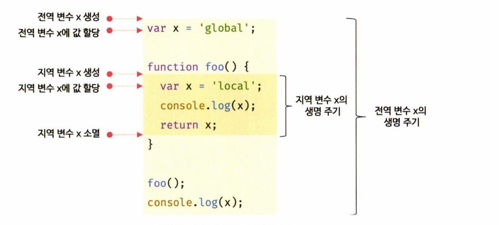

# 스코프

## 함수스코프와 블록스코프

- 함수 내부에서 선언된 변수는 함수 외부에서 참조할 수 없고, 함수 안에서만 유효합니다.
- var 키워드는 함수 스코프를 따르며, 함수 내부에서만 유효합니다. 반면, let과 const는 블록 스코프를 따르며, 코드 블록 내에서만 유효합니다.

## 변수의 중복 선언

- var 키워드는 같은 스코프 내에서 중복 선언이 가능하지만, let과 const는 중복 선언을 허용하지 않습니다.

## 식별자 결정

- 자바스크립트는 스코프 체인을 통해 변수를 찾으며, 동일한 이름의 변수가 여러 개 있을 경우, 가장 가까운 스코프의 변수를 참조합니다.
- 변수는 자신이 선언된 위치에 따라 전역 스코프(global scope)와 지역 스코프(local scope)로 나뉩니다.

## 변수 충돌 방지

- 각 스코프는 독립적인 네임스페이스 역할을 하여 변수 이름의 충돌을 방지합니다. 같은 이름의 변수를 다른 스코프에서 선언해도 각각 독립적으로 작동합니다.

## 전역 스코프와 지역 스코프

전역 스코프:

- 전역 스코프는 코드의 가장 바깥 영역에서 변수가 선언될 때 적용됩니다.
- 전역 스코프에 선언된 변수는 어디서든 접근할 수 있습니다.

지역 스코프:

- 지역 스코프는 함수 내부에서 변수를 선언할 때 발생합니다.
- 지역 변수는 해당 함수와 그 내부에서만 유효하며, 외부에서 접근할 수 없습니다.

## 스코프 체인

### 스코프 체인이란?

- 함수는 전역에서 정의되거나 다른 함수 내부에서 정의될 수 있습니다. 이러한 경우 함수는 중첩될 수 있으며, 이를 함수의 중첩이라고 합니다.
- 함수 내부에서 변수가 선언될 때, 해당 함수 내부의 스코프뿐만 아니라 외부 함수의 스코프도 참조할 수 있습니다. 이러한 구조를 스코프 체인이라고 합니다.

### 계층적 구조

- 스코프 체인은 함수가 중첩될수록 계층적 구조를 형성합니다. 하위 함수는 상위 함수의 변수를 참조할 수 있지만, 반대로 상위 함수는 하위 함수의 변수를 참조할 수 없습니다.
- 예를 들어, outer 함수 내부에 inner 함수가 있는 경우, inner 함수는 outer 함수의 변수에 접근할 수 있습니다. 그러나 반대로 outer 함수는 inner 함수의 변수에 접근할 수 없습니다.

### 변수 검색 과정

- 자바스크립트 엔진은 변수를 찾을 때, 스코프 체인을 따라 변수를 검색합니다. 즉, 현재 함수의 스코프에서 변수를 찾고, 없으면 상위 스코프로 이동하며 변수를 찾습니다.
- 이 과정은 마치 상속처럼 작동하며, 하위 스코프에서 상위 스코프의 변수를 사용할 수 있지만, 상위 스코프는 하위 스코프의 변수를 사용할 수 없습니다.

### 스코프 체인과 함수 검색

함수 역시 변수처럼 스코프 체인을 통해 검색됩니다. 예를 들어, 함수 bar 내부에서 함수 foo를 호출할 때, 먼저 지역 스코프에서 foo를 찾고, 없으면 전역 스코프에서 foo를 찾습니다.

## 함수레벨 스코프

- 자바스크립트의 var 키워드는 함수 레벨 스코프를 따릅니다. 즉, 함수 내에서 선언된 변수는 해당 함수 내에서만 유효하며, 함수 외부에서는 접근할 수 없습니다.
- 그러나 if, for와 같은 코드 블록 내에서 var로 변수를 선언해도 이 변수는 코드 블록이 아닌 함수 전체에서 유효합니다.

## 블록 레벨 스코프

반면, let과 const 키워드는 블록 레벨 스코프를 지원합니다. 이는 코드 블록(if, for 등) 내부에서 선언된 변수가 그 블록 내에서만 유효하다는 뜻입니다.
이 특성은 코드의 안전성을 높이며, 중복 변수 선언으로 인한 오류를 방지합니다.

## 렉시컬 스코프

### 렉시컬 스코프란?

- 자바스크립트에서 함수가 호출된 위치가 아닌 함수가 정의된 위치에 따라 상위 스코프가 결정됩니다. 즉, 함수가 실행되는 시점에 상위 스코프를 결정하지 않고, 함수가 작성된 시점에 이미 스코프가 결정됩니다.
- 이는 자바스크립트가 동적 스코프가 아닌 정적 스코프(정적 범위)를 따른다는 것을 의미합니다.

### 렉시컬 스코프의 중요성

- 함수는 정의된 시점의 스코프 체인을 기억하고 있기 때문에, 호출 위치와 관계없이 언제나 정의된 위치에서의 스코프를 사용합니다.
- 이는 자바스크립트 엔진이 변수를 검색할 때 함수가 작성된 위치에 따라 상위 스코프를 고정하는 방식으로 작동하기 때문입니다.

# 전역 변수의 문제점

## 변수의 생명주기

### 지역 변수의 생명주기

- 변수는 선언된 위치에서 생성되고, 해당 코드 블록이 종료되면 소멸합니다.
- 함수 내에 선언된 지역 변수는 함수가 호출될 때 생성되고, 함수가 종료되면 소멸합니다.

### 변수 선언의 실행 시점과 변수 호이스팅

- 자바스크립트 엔진은 변수를 실행할 때 선언 위치에 상관없이 가장 먼저 실행합니다. 이 현상을 "변수 호이스팅"이라고 합니다.
- 변수 호이스팅으로 인해 함수 내의 변수가 선언되기 전에 접근하려고 하면 undefined로 초기화된 값을 반환하게 됩니다.

### 변수의 메모리 할당과 해제

- 변수가 선언되면 메모리 공간이 할당되고, 해당 메모리 공간은 참조가 사라지면 해제됩니다.
- 함수 내부에서 선언된 지역 변수는 함수가 실행되는 동안에만 유효하며, 함수가 종료되면 해당 메모리 공간도 해제됩니다.

### 스코프와 생명 주기

- 전역 변수는 애플리케이션이 실행되는 동안 계속 유지되며, 함수 내부에서 선언된 지역 변수는 함수가 호출될 때 생성되고 종료되면 사라집니다.
- 변수의 호이스팅은 스코프 단위로 동작하므로, 지역 변수의 호이스팅은 함수 스코프 전체에서 유효합니다.

## 전역변수의 생명주기

### 전역 코드의 실행 방식

- 함수와 달리 전역 코드는 명시적인 호출 없이 실행됩니다.
  전역 코드는 로드되자마자 순차적으로 해석 및 실행되며, 마지막 문 또는 반환문이 실행되면 종료됩니다.
- 전역 코드에 반환문을 사용할 수 없으므로, 마지막 문이 실행되면 더 이상 실행할 문이 없을 때 종료됩니다.

### 전역 변수의 생명 주기



- var 키워드로 선언한 전역 변수는 전역 객체의 프로퍼티가 됩니다.
- 브라우저 환경에서는 전역 객체가 window이며, var로 선언된 전역 변수는 window 객체의 프로퍼티가 됩니다.
- 전역 객체는 코드가 실행되기 전에 가장 먼저 생성되며, 전역 변수의 생명 주기는 전역 객체의 생명 주기와 일치합니다.
- 즉, 전역 객체의 생명 주기가 끝나지 않는 한, 전역 변수는 삭제되지 않고 유지됩니다.

### 빌트인 객체와 전역 객체

- 전역 객체는 자바스크립트 표준 빌트인 객체(Object, String, Number, Function 등)와 호스트 객체(클라이언트 Web API 또는 Node.js의 호스트 API)로 구성됩니다.
- 이 전역 객체는 환경에 따라 다를 수 있으며, 각각의 환경에서 window, self, this 등이 전역 객체로 동작합니다.

### 브라우저 환경에서의 전역 변수와 생명 주기

- 브라우저 환경에서 var 키워드로 선언된 전역 변수는 window객체의 프로퍼티가 되며, 웹 페이지가 닫힐 때까지 유효합니다.
- 따라서, 브라우저 환경에서 전역 변수는 웹 페이지의 생명 주기와 일치합니다.

## 전역변수의 문제점

### 암묵적 결합 (Implicit Coupling)

- 전역 변수는 코드 어디서든 접근하고 변경할 수 있기 때문에 모든 코드가 전역 변수를 참조할 수 있습니다.
- 이는 변수의 유효 범위가 넓어져 코드의 가독성과 의도하지 않은 상태 변화로 인해 버그 발생 가능성을 높입니다.

### 긴 생명 주기

- 전역 변수는 생명 주기가 길어 메모리 리소스를 오랜 기간 소비하며, 상태 변경이 잦을수록 코드 관리가 어려워집니다.
- var 키워드는 중복 선언을 허용하여, 동일한 이름의 전역 변수가 재할당되기 쉽습니다. 이로 인해 의도치 않은 재할당 문제와 예측하기 어려운 동작이 발생할 수 있습니다.

### 스코프 체인 상에서의 문제

- 전역 변수는 스코프 체인 상에서 가장 마지막에 위치하여 검색됩니다. 따라서 전역 변수의 검색 속도는 가장 느리며, 다른 스코프에 비해 성능이 떨어질 수 있습니다.

### 네임스페이스 오염

- 자바스크립트는 모든 전역 변수를 같은 전역 스코프에서 공유하므로, 서로 다른 파일에서 동일한 이름의 전역 변수가 정의되면 충돌이 발생할 수 있습니다.
- 이는 네임스페이스 오염 문제를 야기하여, 예기치 못한 결과를 초래할 수 있습니다.

## 전역 변수의 사용을 억제하는 방법 요약

### 즉시 실행 함수 (IIFE, Immediately Invoked Function Expression)

- 모든 코드를 즉시 실행 함수(IIFE)로 감싸면 모듈화된 변수를 지역 변수로 사용할 수 있습니다.
- 즉시 실행 함수는 정의와 동시에 실행되므로 함수 내의 변수는 외부에서 접근할 수 없습니다.

```
(function () {
  var foo = 10;
  console.log(foo); // 10
})();
console.log(foo); // ReferenceError: foo is not defined
```

- 이 방식은 전역 변수를 생성하지 않으므로 라이브러리 개발 시 많이 사용됩니다.

### 네임스페이스 객체

- 전역 변수 대신 네임스페이스 역할을 담당할 객체를 생성하고, 필요한 변수를 객체의 프로퍼티로 추가하는 방식입니다.
- 이렇게 하면 전역 변수의 사용을 최소화하면서도 변수에 접근할 수 있습니다.

```
var MYAPP = {};
MYAPP.name = 'Lee';
console.log(MYAPP.name); // Lee
```

- 네임스페이스 객체를 계층적으로 구성하여 모듈화를 구현할 수 있습니다.

### 모듈 패턴

- 모듈 패턴은 즉시 실행 함수와 클로저를 결합하여 객체의 내부 상태를 보호하고, 외부와의 상호작용을 제한합니다.
- 캡슐화(encapsulation)를 통해 객체의 특정 프로퍼티나 메서드를 은닉하고, 외부에서는 접근할 수 없는 private 멤버를 구현할 수 있습니다.

```
var Counter = (function () {
  var num = 0; // private 변수
  return {
    increase: function () { return ++num; },
    decrease: function () { return --num; }
  };
})();

console.log(Counter.increase()); // 1
console.log(Counter.num); // undefined (외부에서 접근 불가)
```

### ES6 모듈

- ES6부터 도입된 모듈 시스템을 사용하여 전역 변수 사용을 억제할 수 있습니다.
- ES6 모듈은 파일 자체의 독자적인 스코프를 제공하므로, 모듈 내에서 선언된 변수는 전역 객체의 프로퍼티가 되지 않습니다.

```
<script type="module" src="lib.mjs"></script>
<script type="module" src="app.mjs"></script>
```

# let, const 키워드와 블록 레벨 스코프

## var 키워드로 선언한 변수의 문제점

### 변수 중복 선언 허용

- var 키워드로 선언된 변수는 같은 스코프 내에서 중복 선언이 가능합니다.
- 이는 의도치 않게 기존 변수를 덮어쓰거나 예기치 않은 값으로 변경될 수 있어 코드의 예측 가능성을 떨어뜨립니다.

```
var x = 1;
var x = 100;
console.log(x); // 100
```

- 이처럼 변수 중복 선언이 허용되면 기존 변수의 상태를 예측하기 어렵게 만듭니다.

### 함수 레벨 스코프

- var 키워드로 선언한 변수는 오로지 함수의 코드 블록만을 지역 스코프로 인정합니다.
- 따라서, 블록 레벨 스코프(if, for, while 등)를 무시하고 블록 외부에서도 접근할 수 있습니다.

```
var x = 1;
if (true) {
  var x = 10;
}
console.log(x); // 10
```

- 위와 같이 블록 안에서 선언된 var 변수는 함수가 아닌 이상 전역 변수로 동작하므로, 의도치 않게 값을 변경하는 부작용이 발생할 수 있습니다.

### 변수 호이스팅 (Variable Hoisting)

- var 키워드로 선언한 변수는 변수 선언문이 스코프의 최상단으로 끌어올려진 것처럼 동작합니다.
- 변수 선언 전에 변수를 참조할 경우, undefined 값이 반환되며, 이는 예기치 못한 결과를 초래할 수 있습니다.

```
console.log(foo); // undefined
var foo = 123;
console.log(foo); // 123
```

- 위와 같이 foo 변수가 선언되기 전에 console.log(foo)가 실행되어도 undefined 값을 반환합니다. 이는 변수가 선언되기 전에도 이미 메모리에 할당되어 있기 때문입니다.

## let 키워드

### 변수 중복 선언 금지

- let 키워드로 선언한 변수는 같은 스코프 내에서 중복 선언이 불가능합니다.
- 동일한 이름으로 변수를 선언하려고 하면 SyntaxError가 발생합니다.
- 이는 var 키워드와의 주요 차이점 중 하나입니다.

### 블록 레벨 스코프

- let 키워드는 블록 레벨 스코프(block-level scope)를 따르므로, if, for, while 등의 코드 블록 내에서만 유효합니다.
- 블록을 벗어나면 더 이상 접근할 수 없으므로 코드의 가독성과 유지보수성을 높여줍니다.

```
let x = 1;
{
  let x = 2; // 블록 레벨 스코프
  console.log(x); // 2
}
console.log(x); // 1
```

- 위 예제에서 x는 블록 내부와 외부에서 각각 다른 값을 가집니다.

### 변수 호이스팅

- let 키워드로 선언한 변수도 변수 호이스팅이 발생하지만, var와 달리 선언 전에 접근하면 ReferenceError가 발생합니다.
- let 변수는 "선언 단계"와 "초기화 단계"가 분리되어 진행되며, 초기화되기 전까지는 일시적 사각지대(TDZ, Temporal Dead Zone)에 위치하게 됩니다.
  

```
console.log(foo); // ReferenceError: Cannot access 'foo' before initialization
let foo = 1;
```

- 위 예제에서 foo는 선언 전에 접근할 수 없으며, 초기화되기 전까지는 undefined조차 반환되지 않습니다.

### 전역 객체와의 관계

- let 키워드로 선언한 전역 변수는 전역 객체의 프로퍼티가 되지 않습니다.
- 예를 들어, 브라우저 환경에서 let으로 선언한 전역 변수 x는 window.x로 접근할 수 없습니다.

```
let x = 1;
console.log(window.x); // undefined
console.log(x); // 1
```

- 이는 var 키워드로 선언한 전역 변수가 window 객체의 프로퍼티가 되는 것과 다릅니다.

## const 키워드 요약

### 선언과 초기화

- const 키워드로 선언된 변수는 반드시 선언과 동시에 초기화해야 합니다.
- 초기값 없이 선언만 할 경우 SyntaxError가 발생합니다.

```
const foo = 1; // 올바른 사용
const bar; // SyntaxError: Missing initializer in const declaration
```

### 재할당 금지

- const 키워드로 선언된 변수는 재할당이 금지됩니다.
- let과 var는 재할당이 가능하지만, const는 값 변경을 허용하지 않으므로 상수(constant)를 정의할 때 주로 사용됩니다.

```
const foo = 1;
foo = 2; // TypeError: Assignment to constant variable
```

### 상수와 불변성

- const는 값의 불변성을 보장하지 않습니다. 변수에 저장된 원시 값(primitive value)은 변경할 수 없지만, 객체나 배열 같은 참조형 데이터는 내부 값이 변경될 수 있습니다.

```
const person = { name: 'Lee' };
person.name = 'Kim'; // 객체 내부 값 변경 가능
console.log(person); // {name: 'Kim'}
```

- 따라서, 객체의 불변성을 유지하려면 Object.freeze()와 같은 메서드를 사용해야 합니다.

### 블록 레벨 스코프

- const 키워드는 let과 동일하게 블록 레벨 스코프를 따릅니다.
- 블록을 벗어나면 더 이상 변수를 참조할 수 없으며, 블록 내부에서만 유효합니다.

```
const x = 1;
{
  const x = 2;
  console.log(x); // 2 (블록 내부의 x)
}
console.log(x); // 1 (블록 외부의 x)
```

### 상수의 명명 규칙

- 상수로 사용되는 변수는 대문자와 밑줄(\_)을 사용하여 명명하는 것이 일반적입니다.

```
const TAX_RATE = 0.1; // 대문자 스네이크 케이스로 명명
const MAX_VALUE = 100;
```

### var, let, const의 사용 가이드라인

- ES6 이후에는 var 키워드 대신 let과 const를 사용하는 것이 권장됩니다.
- 기본적으로 변수를 선언할 때는 const를 사용하고, 재할당이 필요할 경우에만 let을 사용합니다.
- const는 변수의 재할당을 방지하므로 예기치 않은 값 변경을 막아 코드의 안정성을 높여줍니다.

### var vs let vs const 사용 권장 사항

- var 키워드: ES6 이후로는 사용하지 않는 것이 좋음.
- let 키워드: 재할당이 필요한 경우에 한정하여 사용.
- const 키워드: 변경이 발생하지 않고 읽기 전용으로 사용될 경우, 원시 값과 객체에 모두 사용.
