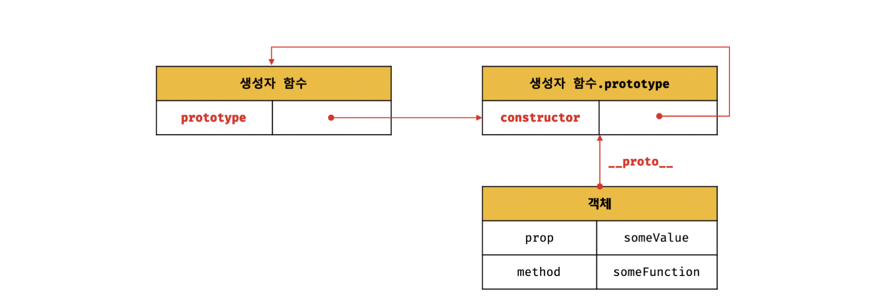
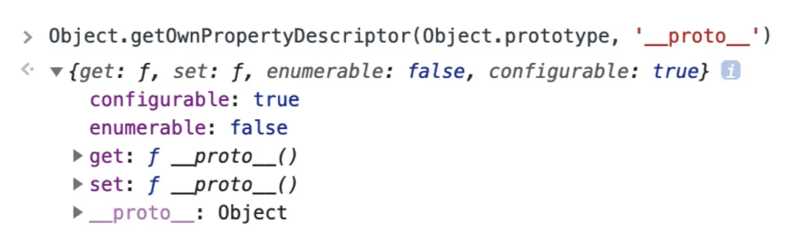
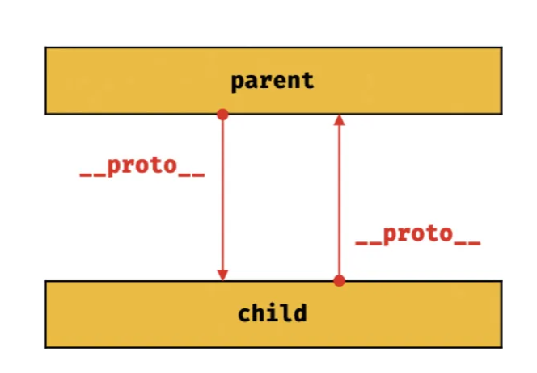
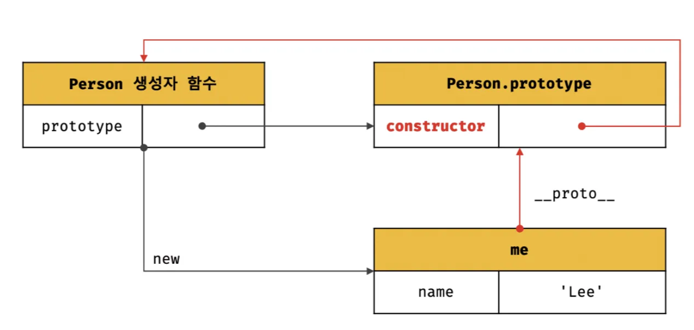

# 19 프로토타입-22 this

# 19장 프로토타입

<aside>
💬

Javascript는 클래스 기반 객체지향 프로그래밍 언어보다 효율적이며 더 강력한 객체지향 프로그래밍 능력을 지니고 있는 **프로토타입 기반**의 **객체지향 프로그래밍 언어**이다 !

</aside>

## 19.1 객체지향 프로그래밍

객체지향 프로그래밍의 실체는 특징이나 성질을 나타내는 **속성(Attribute / Property)**을 가지고 있고, 이를 통해 실체를 인식하거나 구별할 수 있다.

다양한 속성 중에서 프로그램에 필요한 속성만 간추려 내어 표현하는 것을 **추상화(Abstraction)**라 한다.

```jsx
// 이름과 주소 속성을 갖는 객체
const person = {
  name: "Lee",
  address: "Seoul",
};

console.log(person); //{ name: 'Lee', address: 'Seoul' }
```

**→ 객체는 상태 데이터와 동작을 하나의 논리적인 단위로 묶은 복합적인 자료구조이다.**

객체의 상태 데이터를 `프로퍼티` 동작을 `메서드`라고 부른다.

## 19.2 상속과 프로토타입

**상속**은 어떤 객체의 프로퍼티 또는 메서드를 다른 객체가 상속받아 그대로 사용할 수 있는 것이다.

자바스크립트는 프로토타입을 기반으로 상속을 구현하여 중복을 제거한다.

### 🤔 중복을 제거하는 방법 ?

→ 기존 코드 재사용 ! 이를 통해 개발 비용도 줄일 수 있다.

```jsx
// 생성자 함수
function circle(radius) {
  this.radius = radius;
  this.getArea = function () {
    //  Math.PI는 원주율을 나타내는 상수
    return Math.PI * this.radius;
  };
}

// 반지름이 1인 인스턴스 생성
const circle1 = new Circle(1);
// 반지름이 2인 인스턴스 생성
const circle2 = new Circle(2);

// Circle 생성자 함수는 인스턴스를 생성할 때마다 동일한 동작을 하는
// getArea 메서드를 중복 생성하고 모든 인스턴스가 중복 소유
// getArea 메서드는 하나만 생성하여 모든 인스턴스가 공유해서 아용하는 것이 바람직
console.log(circle1.getArea === circle2.getArea); //false

console.log(circle1.getArea()); // 3.14....
console.log(circle2.getArea()); // 12.5663...
```

### [코드 설명]

- **Circle** 생성자 함수는 인스턴스 생성 시에 `getArea`를 중복 생성하고 모든 인스턴스가 중복 소유한다.
- 동일한 생성자 함수에 의해 생성된 모든 인스턴스들이 동일한 메서드를 중복 소유하는건 메모리 낭비
- 인스턴스 생성 → 매번 메서드 생성 → 성능 BAD

<aside>
💬

**Javascript**는 **프로토타입**을 기반으로 상속을 구현하여 불필요한 중복을 제거한다!

</aside>

```jsx
// 생성자 함수
function Circle(radius) {
  this.radius = radius;
}

// Circle 생성자 함수가 생성한 모든 인스턴스가 getArea 메서드를
// 공유해서 사용할 수 있도록 프로토타입에 추가
// 프로토타입은 Circle 생성자 함수의 prototype 프로퍼티에 바인딩된다.
Circle.prototype.getArea = function() {
    return Math.PI *this.radius ***2;
}

// 인스턴스 생성
const circle1 = new Circle(1);
const circle2 = new Circle(2);

// Circle 생성자 함수가 생성한 모든 인스턴스는 부모 객체의 역할을 하는
// 프로토타입 Circle.prototype으로부터 getArea 메서드를 상속받는다.Circle
// 즉, Circle 생성자 함수가 생성하는 모든 인스턴스는 하나의 getArea 메서드를 공유
console.log(circle1.getArea === circle2.getArea); // true

console.log(circle1.getArea()); // 3.14....
console.log(circle2.getArea()); // 12.5663...
```

### [코드 설명]

- 부모 객체는 `Circle.prototype`의 모든 프로퍼티와 메소드 상속
  → Circle 생성자 함수가 생성하는 모든 인스턴스는 `getArea` 메서드 상속받아 사용 가능!

## 19.3 프로토타입 객체

### 프로토타입 객체 == 프로토타입이란?

객체지향 프로그래밍의 근간을 이루는 객체 간 상속을 구현하기 위해 사용한다.

<aside>
💬

- 프로토타입은 어떤 객체의 부모 객체의 역할을 하는 객체로서 **다른 객체의 공유 프로퍼티(메서드 포함)을 제공**

- 프로토타입을 상속받은 **자식 객체는 상위 객체의 프로퍼티를 자신의 프로퍼티처럼 자유롭게 사용 가능**하다!

</aside>

모든 객체는 `[[Prtotype]]` 이라는 내부 슬롯을 가지며, 내부 슬롯의 값은 프로토타입의 참조(null인 경우도 있다)객체가 생성될때 객체 생성 방식에 의해 결정된다.
→ 객체가 생성될 때 객체 생성 방식에 따라 프로토타입이 결정되고 `[[Prtotype]]` 에 저장된다.

(객체, 프토토타입 생성자 함수는 다음 그림과 같이 서로 연결되어있다.)



`[[Prototype]]` 내부 슬롯에는 직접 접근할 수 없지만, `__proto__` 접근자 프로퍼티를 통해 자신의 `[[Prototype]]` 내부 슬롯이 가리키는 프로토타입에 간접적으로 접근할 수 있다.

그리고 프로토타입은 자신의 `constructor` 프로퍼티를 통해 생성자 함수에 접근할 수 있고, 생성자 함수는 자신의 `prototype` 프로퍼티를 통해 프로토타입에 접근할 수 있다.

### 19.3.1 **proto** 접근자 프로퍼티


`person` 객체의 프로토타입(빨강 영역)은 `__proto__` 접근자 프로퍼티를 통해 `person`객체의 `[[Prototype]]` 내부 슬롯이 가르키는 객체인 `Object.prototype`에 접근한 결과이다.

<aside>
💬

접근자 프로퍼티 `__proto__` 는 자체적으로 값을 갖지않고 접근자 함수인 [[Get]], [[Set]] 프로퍼티 어트리뷰트로 구성된 프로퍼티!

</aside>



접근자 함수를 통해 `[[Prototype]]` 내부 슬롯의 값, 즉 프로토타입을 취득하거나 할당한다.

**proto 접근자 프로퍼티**를 통해 프로토타입에 접근하면 내부적으로 **getter 함수**인 `[[Get]]`이 호출되고 새로운 프로토타입을 할당하면 **setter 함수**인 `[[Set]]`이 호출된다.

```jsx
const obj = {};
const parent = { x: 1 };

// get __proto__가 호출되어 obj 객체의 프로토타입을 취득
obj.__proto__;
// set __proto__가 호출되어 obj 객체의 프로토타입을 교체
obj.__proto__ = parent;

console.log(obj.x); // 1
```

### **`__proto__` 접근자 프로퍼티는 상속을 통해 사용된다.**

접근자 프로퍼티는 객체가 직접 소유하는 프로퍼티가 아니라 `Object.prototype`의 프로퍼티다. 모든 객체는 상속을 통해 `Object.prototype.__proto__` 접근자 프로퍼티를 사용할 수 있다.

```jsx
const person = { name: "LEE" };
// 객체는 __proto__ 프로퍼티를 소유하지 않는다.
console.log(person.hasOwnProperty("__proto__")); // false

// __proto__ 프로퍼티는 Object.prototype의 접근자 프로퍼티다.
conosle.log(Object.getOwnPropertyDescriptor(Object.prototype, "__proto__"));
// {get: f, set: f, enumerable: false, configurable: true}

// 모든 객체는 Object.prototype의 __proto__를 상속받아 사용할 수 있다.
console.log({}.__proto__ === Object.prototype); // true
```

> `Object.prototype`

모든 객체는 프로토타입의 계층 구조인 프로토타입 체인에 묶여 있다.
자바스크립트 엔진은 객체의 프로퍼티에 접근할 때 해당 프로퍼티가 없다면
`__proto__` 접근자 프로퍼티가 가리키는 참조를 따라
부모 역할을 하는 프로토타입의 프로퍼티를 순차적으로 검색한다.
프로토타입 체인의 최상위 객체는 `Object.prototype`이다.

>

### **`__proto__` 접근자 프로퍼티를 통해 프로토타입에 접근하는 이유**

접근자 프로퍼티를 통해 프로토타입에 접근하는 이유는 상호 참조에 의해 프로토타입 체인이 생성되는 것을 방지하기 위해서이다.

```jsx
const parert = {};
const child = {};

// child의 프로토타입을 parent로 설정
child.__proto__ = parent;
// parent 프로토타입을 child로 설정
parent.__proto__ = child; // TypeError: Cyclic __proto__ value
```

에러 없이 정상적으로 처리되면 **서로가 자신의 프로토타입이 되는 비정상적인 프로토타입 체인**이 만들어진다.



**프로토타입 체인은 단방향 링크드 리스트로 구현되어야 한다.**

- 위 그림 같이 순환 참조하는 프로토타입 체인이 만들어지면 프로토타입 체인 종점이 존재하지 않기 때문에 무한 루프에 빠진다.
  → 따라서 무조건적으로 프로토타입을 교체할 수 없도록 **proto** 접근자 프로퍼티를 통해 프로토타입에 접근하도록 구현되어 있다.

### **`__proto__` 접근자 프로퍼티를 코드 내에서 직접 사용하는 것은 권장하지 않는다.**

`__proto__` 접근자 프로퍼티는 ES5까지 비표준이었지만 브라우저 호환성을 고려하여 ES6에서 표준으로 채택했다.

하지만 모든 객체가 접근자 프로퍼티를 사용할 수 있는 것은 아니기 때문에 **코드 내에서 직접 사용하는 것은 권장하지 않는다.**

```jsx
// obj는 직접 상속을 받았으므로 프로토타입 체인의 종점이다.
const obj = Object.create(null);
// 그러므로 Object.__proto__를 상속받을 수 없다.
console.log(obj.__proto__); // undefined
// 그래서 __proto__ 보다 Object.getPrototypeOf 메서드를 사용하는 편이 좋다.
console.log(Object.getPrototypeOf(obj)); // null
```

따라서 **프로토타입의 참조를 취득하고 싶을 경우** `Object.getPrototypeOf` 메서드를 사용하고, **프로토타입을 교체**하고 싶을 경우 `Object.setPrototypeOf` 메서드를 사용할 것을 권장한다.

```jsx
const obj = {};
const parent = { x: 1 };
// ES5에서 도입된 메서드, get Object.prototype.__proto__와 처리내용 동일
Object.getPrototypeOf(obj); // obj.__proto__;
// ES6에서 도입된 메서드, set Object.prototype.__proto__와 처리내용 동일
Object.setPrototypeOf(obj, parent); // obj.__proto__ = parent;
```

### 19.3.2 함수 객체의 prototype 프로퍼티

<aside>
💬

함수 객체만이 소유하는 `prototype` 프로퍼티는 생성자 함수가 생성할 인스턴스의 프로토타입을 가리킨다.

</aside>

- **`non-constructor`인 화살표 함수와 ES6 메서드 축약 표현으로 정의한 메서드**는 prototype 프로퍼티를 소유하지 않으며 프로토타입도 생성하지 않는다.
- **생성자 함수로 호출하기 위해 정의하지 않은 일반 함수**(함수 선언문, 함수 표현식)도 prototype 프로퍼티를 소유하지만 아무런 의미가 없다.

→ 모든 객체가 가지고 있는(엄밀히 말하면 Object.prototype으로부터 상속받은) **proto 접근자 프로퍼티와 함수 객체만이 가지고 있는 prototype 프로퍼티는 결국 동일한 프로토타입을 가리킨다.**

| 구분                      | 소유        | 값                | 사용 주체   | 사용 목적                                                                    |
| ------------------------- | ----------- | ----------------- | ----------- | ---------------------------------------------------------------------------- |
| **proto** 접근자 프로퍼티 | 모든 객체   | 프로토타입의 참조 | 모든 객체   | 객체가 자신의 프로토타입에 접근 또는 교체하기 위해 사용                      |
| prototype 프로퍼티        | constructor | 프로토타입의 참조 | 생성자 함수 | 생성자 함수가 자신이 생성할 객체(인스턴스)의 프로토타입을 할당하기 위해 사용 |

- `Person.prototype`과 `me.__proto__`는 결국 동일한 프로토타입을 가리킨다!

```jsx
fucntion Person(name){
	this.name = name;
}
const me = new Person('Lee');

console.log(Person.prototype === me.__proto__);
```


### 19.3.3 프로토타입의 constructor 프로퍼티와 생성자 함수

**모든 프로토타입은 `constructor` 프로퍼티를 갖는다.**
이 **`constructor` 프로퍼티는 `prototype`프로퍼티로 자신을 참조하고 있는 생성자 함수를 가르키며**, 이 연결은 함수 객체가 생성될 때 이뤄진다.

```jsx
fucntion Person(name){
	this.name = name;
}
const me = new Person('Lee');

console.log(me.constructor === Person); // true
```



- 생성된 `me` 객체는 프로토타입의 `constructor` 프로퍼티를 통해 생성자 함수와 연결된다.
- `me` 객체의 프로토타입인 `Person.prototype`에는 me 객체에 없는 `constructor` 프로퍼티가 있다.

→ 따라서 **`me` 객체는 `constructor` 프로퍼티를 상속받아 사용할 수 있다.**

## 19.4 리터럴 표기법에 의해 생성된 객체의 생성자 함수와 프로토타입

<aside>
💬

생성자 함수에 의해 생성된 인스턴스는 **프로토타입의 `constructor` 프로퍼티에 의해 생성자 함수가 연결**된다.

→ `constructor` 프로퍼티가 가리키는 생성자 함수는 인스턴스를 생성한 생성자 함수다.

</aside>

```jsx
// obj 객체를 생성한 생성자 함수는 Object다.
const obj = new Object();
console.log(obj.constructor === Object); // true

// add 함수 객체를 생성한 생성자 함수는 Function이다.
const add = new Function("a", "b", "return a + b");
console.log(add.constructor === Function); // true

// 생성자 함수
function Person(name) {
  this.name = name;
}

// me 객체를 생성한 생성자 함수는 Person이다.
const me = new Person("Son");
console.log(me.constructor === Person); // true
```

하지만 리터럴 표기법에 의한 객체 생성 방식과 같이 **명시적으로 `new` 연산자와 함께 생성자 함수를 호출하여 인스턴스를 생성하지 않는 객체 생성 방식도 있다.**

```jsx
// 객체 리터럴
const obj = {};

// 함수 리터럴
const add = function (a, b) {
  return a + b;
};

// 배럴 리터럴
const arr = [1, 2, 3];

// 정규 표현식 리터럴
const regexp = /is/gi;
```

**리터럴 표기법으로 생성된 객체도 물론 프로토타입이 존재한다.**
하지만 프로토타입의 `constructor` 프로퍼티가 가리키는 생성자 함수가 반드시 객체를 생성한 생성자 함수라고 단정할 수는 없다.

```jsx
// obj 객체는 Object 생성자 함수로 생성한 객체가 아니라 객체 리터럴로 생성.
const obj = {};

// 하지만 obj 객체의 생성자 함수는 Object 생성자 함수다.
console.log(obj.constructor === Object); // true
```

<aside>
🤔

위에서 생성된 객체의 생성자 함수는 왜 **Object** 생성자 함수일까?

</aside>


- 2번 항목에서 **`Object` 생성자 함수에 인수를 전달하지 않거나**, **`undefined` 또는 `null`을 인수로 전달하면서 호출하면 내부적으로는 추상 연산을 호출하여 `Object.prototype`을 프로토타입으로 갖는 빈 객체를 생성**한다 !

```jsx
// Object 생성자 함수에 의한 객체 생성
// 인수가 전달되지 않았을 때 추상 연산 OrdinaryObjectCreate를 호출하여 빈 객체를 생성한다.
let obj = new Object();
console.log(obj); // {}

// new.target이 undefined나 Object가 아닌 경우
// 인스턴스 -> Foo.prototype -> Object.prototype 순으로 프로토타입 체인이 생성된다.
class Foo extends Object {}
new Foo(); // Foo {}

// 인수가 전달된 경우에는 인수를 객체로 변환한다.
// Number 객체 생성
obj = new Object(123);
console.log(obj); // Number {123}

// String 객체 생성
obj = new Object("123");
console.log(obj); // String {"123"}
```

이처럼 `Object` 생성자 함수 호출과 객체 리터럴의 평가는 추상 연산 `OrdinaryObjectCreate`를 호출하여 빈 객체를 생성하는 점에서 동일하나 세부 내용은 다르다.

**따라서 객체 리터럴에 의해 생성된 객체는 Object 생성자 함수가 생성한 객체가 아니다.**

| 리터럴 표기법      | 생성자 함수 | 프로토 타입        |
| ------------------ | ----------- | ------------------ |
| 객체 리터럴        | Object      | Object.prototype   |
| 함수 리터럴        | Function    | Function.prototype |
| 배열 리터럴        | Array       | Array.prototype    |
| 정규 표현식 리터럴 | RegExp      | RegExp.prototype   |

리터럴 표기법으로 생성한 객체도 생성자 함수로 생성한 객체와 큰 차이는 없다..

**→ 프로토타입의 `constructor` 프로퍼티를 통해 연결되어 있는 생성자 함수를 리터럴 표기법으로 생성한 객체를 생성자 함수로 생각해도 될 것 같다..!**

## 19.5 프로토타입의 생성 시점

- 프로토타입은 생성자 함수가 생성되는 시점에 더불어 생성된다.
- 생성자 함수는 사용자가 직접 정의한 사용자 정의 생성자 함수와 자바스크립트가 기본 제공하는 빌트인 생성자 함수로 구분할 수 있다.

### 19.5.1 사용자 정의 생성자 함수와 프로토타입 생성 시점

<aside>
💬

생성자 함수로서 호출할 수 있는 함수, 즉 `constructor`는 함수 정의가 평가되어 함수 객체를 생성하는 시점에 프로토타입도 더불어 생성된다.

→ `non-constructor`는 프로토타입이 생성되지 않는다.

</aside>

```jsx
// 함수 정의가 평가되어 함수 객체를 생성하는 시점에 프로토타입도 더불어 생성된다.
console.log(Person.prototype); // {constructor: f}

// 생성자 함수
function Person(name) {
  this.name = name;
}
```

```jsx
// 화살표 함수는 non-constructor다.
const Person = (name) => {
  this.name = name;
};

// non-constructor 는 프로토타입이 생성되지 않는다.
console.log(Person.prototype);
```

### 19.5.2 빌트인 생성자 함수와 프로토타입 생성 시점

- 모든 빌트인 생성자 함수는 전역 객체가 생성되는 시점에 생성된다.
- 생성된 프로토타입은 빌트인 생성자 함수의 prototype 프로퍼티에 바인딩된다.

### **전역 객체**

전역 객체는 표준 빌트인 객체들과 환경에 따른 호스트 객체, 그리고 `var` 키워드로 선언한 전역 변수와 전역 함수를 프로퍼티로 갖는다.
**→ (Math, Reflect, JSON)을 제외한 표준 빌트인 객체는 모두 생성자 함수다.**

```jsx
window.Object === Object; // true
```

`Object` 도 전역 객체의 프로퍼티이며, 전역 객체가 생성되는 시점에 생성된다.

객체가 생성되기 이전에 생성자 함수와 프로토타입은 이미 객체화되어 존재한다. **이후 생성자 함수 또는 리터럴 표기법으로 객체를 생성하면 프로토타입은 생성된 객체의 Prototype 내부 슬롯에 할당된다.**

## **19.6 객체 생성 방식과 프로토타입의 결정**

### **19.6.1 객체 리터럴에 의해 생성된 객체의 프로토타입**

```jsx
const obj = { x: 1};

// 객체 리터럴에 의해 생성된 obj 객체는 Object.prototype을 상속받는다.
console.log(obj.constructor === Object); // true
console.log(obj.hasOwnProperty("x"); // true
```

- 위 객체 리터럴이 평가되면 Object 함수와 `Object.prototype` 과 생성된 객체 사이에 연결이 만들어 진다.

### **19.6.2 Object 생성자 함수에 의해 생성된 객체의 프로토타입**

```jsx
const obj = new Object();
obj.x = 1;

// Object 생성자 함수에 의해 obj 객체는 Object.prototype을 상속받는다.
console.log(obj.constructor === Object); // true
console.log(obj.hasOwnProperty("x"); // true
```

- `Object` 생성자 함수에 의해 생성된 obj 객체는 `Object.prototype`을 프로토타입으로 갖게 되며, 이로써 `Object.prototype`을 상속받는다.
- 객체 리터럴 방식은 객체 리터럴 내부에 프로퍼티를 추가하지만 Object 생성자 함수 방식은 일단 빈 객체를 생성한 이후 프로퍼티를 추가해야 한다.

### **19.6.3 생성자 함수에 의해 생성된 객체에 프로토타입**

```jsx
function Person(name) {
  this.name = name;
}

// 프로토타입 메서드
Person.prototype.sayHello = function () {
  console.log(`Hi! My name is ${this.name}`);
};

const me = new Person("Son");
const you = new Person("Kim");

me.sayHello();
you.sayHello();

// Hi! My name is Son
// Hi! My name is Kim
```


1. 생성자 함수에 의해 생성되는 객체의 프로토타입은 생성자 함수의 `prototype` 프로퍼티에 바인딩되어 있는 객체다.
2. 프로토타입 `Person.prototype` 에 프로퍼티를 추가하여 하위 객체가 상속받을 수 있도록 구현하면 Person 생성자 함수를 통해 생성된 모든 객체는 프로토타입에 추가된 `sayHello` 메서드를 상속받아 자신의 메서드처럼 사용할 수 있다.

## 19.7 프로토타입 체인

자바스크립트는 **객체의 프로퍼티(메서드 포함)에 접근하려고 할 때 해당 객체에 접근하려는 프로퍼티가 없다면 Prototype 내부 슬롯의 참조를 따라 자신의 부모 역할을 하는 프로토타입의 프로퍼티를 순차적으로 검색**한다.


→ 이를 **프로토타입 체인**이라 한다.

- 자바스크립트 엔진은 프로토타입 체인을 따라 프로퍼티 / 메서드를 검색한다.
- **프로토타입 체인은 상속과 프로퍼티 검색을 위한 메커니즘이다.**
  **→ 스코프 체인은 식별자 검색을 위한 메커니즘이다.**

스코프 체인과 프로토타입 체인은 서로 연관없이 별도로 동작하는 것이 아니라 서로 협력하여 식별자와 프로퍼티를 검색하는데 사용된다.

## 19.9 프로토타입의 교체

프로토타입은 생성자 함수 또는 인스턴스에 의해 교체할 수 있다.

### 19.9.1 생성자 함수에 의한 프로토타입의 교체

```jsx
const Person = (function () {
  function Person(name) {
    this.name = name;
  }

  // 1. 생성자 함수의 prototype 프로퍼티를 통해 프로토타입을 교체
  Person.prototype = {
    sayHello() {
      console.log(`Hi! My name is ${this.name}`);
    },
  };

  return Person;
})();

const me = new Person("Son");
```

- Person 생성자 함수가 생성할 객체의 프로토타입을 객체 리터럴로 교체한 것이다.


- 프로토타입으로 교체한 객체 리터럴에는 constructor 프로퍼티가 없다.
  **→ `me` 객체의 생성자 함수를 검색하면 Person이 아닌 `Object`가 나온다.**

```jsx
// 프로토타입을 교체하면 constructor 프로퍼티와 생성자 함수 간의 연결이 파괴된다.
console.log(me.constructor === Person); // false
// 프로토타입 체인을 따라 Object.prototype의 constructor 프로퍼티가 검색된다.
console.log(me.constructor === Object); // true
```

- 프로토타입으로 교체한 객체 리터럴에 constructor 프로퍼티를 추가하여 프로토타입의 constructor 프로퍼티를 되살린다.

```jsx
const Person = (function () {
  function Person(name) {
    this.name = name;
  }

  // 생성자 함수의 prototype 프로퍼티를 통해 프로토타입을 교체
  Person.prototype = {
    // constructor 프로퍼티와 생성자 함수 간의 연결을 설정
    constructor: Person,
    sayHello() {
      console.log(`Hi! My name is ${this.name}`);
    },
  };

  return Person;
})();

const me = new Person("Son");

// constructor 프로퍼티와 생성자 함수를 가리킨다.
console.log(me.constructor === Person); // true
console.log(me.constructor === Object); // false
```

### 19.9.2 인스턴스에 의한 프로토타입의 교체

프로토타입은 생성자 함수의 prototype 프로퍼티뿐만 아니라 인스턴스의 `__proto__` 접근자 프로퍼티를 통해 접근 할 수 있다.


- 프로토타입으로 교체한 객체에는 constructor 프로퍼티가 없으므로 constructor 프로퍼티와 생성자 함수 간의 연결이 파괴된다.
  → 프로토타입 constructor 프로퍼티가 me 객체의 생성자 함수를 검색하면 Person이 아닌 Object가 나온다.
- 프로토타입 교체를 통해 객체 간의 상속 관계를 동적으로 변경하는 것은 꽤나 번거롭다.
  **→ 프로토타입은 직접 교체하지 않는 것이 좋다.**

상속 관계를 인위적으로 설정하려면 직접 상속을 사용하거나 ES6에서 도입된 클래스를 간편하고 직관적으로 상속 관계를 구현하면 된다.

## 19.10 instanceof 연산자

```jsx
객체 instanceof 생성자 함수
```

우변의 생성자 함수의 prototype에 따라 **바인딩된 객체가 좌변의 객체의 프로토타입 체인 상에 존재**하면 `true`로 평가되고, 그렇지 않은 경우에는 `false`로 평가된다.

```jsx
// 생성자 함수
function Person(name) {
  this.name = name;
}

const me = new Person("Son");

// Person.prototype이 me 객체의 프로토타입 체인 상에 존재하므로 true로 평가된다.
console.log(me instanceof Person); // true

// Object.prototype이 me 객체의 프로토타입 체인 상에 존재하므로 true로 평가된다.
console.log(me instanceof Object); // true
```

프로토타입을 교체 시에는 !

```jsx
// 생성자 함수
function Person(name) {
  this.name = name;
}

const me = new Person("Son");

// 프로토타입으로 교체할 객체
const parent = {};

// 프로토타입으로 교체
Object.setPrototypeOf(me, parent);

// Person 생성자 함수와 parent 객체는 연결되어 있지 않다.
console.log(Person.prototype === parent); // false
console.log(parent.constructor === Person); // false

// Person.prototype이 me 객체의 프로토타입 체인 상에 존재하지 않아 false로 평가된다.
console.log(me instanceof Person); // false

// Object.prototype이 me 객체의 프로토타입 체인 상에 존재하므로 true로 평가된다.
console.log(me instanceof Object); // true
```

프로토타입으로 교체한 `parent` 객체를 `Person` 생성자 함수의 prototype 프로퍼티에 바인딩 하면 `true`로 평가가 된다 !

```jsx
// 생성자 함수
function Person(name) {
  this.name = name;
}

const me = new Person("Son");

// 프로토타입으로 교체할 객체
const parent = {};

// 프로토타입으로 교체
Object.setPrototypeOf(me, parent);

// Person 생성자 함수와 parent 객체는 연결되어 있지 않다.
console.log(Person.prototype === parent); // false
console.log(parent.constructor === Person); // false

// parent 객체를 Person 생성자 함수의 prototype 프로퍼티에 바인딩한다.
Person.prototype = parent;

// Person.prototype이 me 객체의 프로토타입 체인 상에 존재하므로 true로 평가된다.
console.log(me instanceof Person); // true

// Object.prototype이 me 객체의 프로토타입 체인 상에 존재하므로 true로 평가된다.
console.log(me instanceof Object); // true
```

## 19.11 직접 상속

### 19.11.1 Object.create에 의한 직접 상속

`Object.create` 메서드는 명시적으로 프로토타입을 지정하여 새로운 객체를 생성한다. 그와 동시에 추상 연산을 호출한다.

```jsx
// 프로토타입이 null인 객체를 생성한다. 생성된 객체는 프로토타입 체인의 종점에 위치한다.
// obj -> null
let obj = Object.create(null);
console.log(Object.getPrototypeOf(obj) === null); // true
// Object.prototype을 상속받지 못한다.
console.log(obj.toString()); // TypeError

// obj -> Object.prototype -> null
// obj = {}; 와 동일하다.
obj = Object.create(Object.prototype);
console.log(Object.getPrototypeOf(obj) === Object.prototype); // true

// obj -> Object.prototype -> null
// obj = { x: 1 }; 와 동일하다.
obj = Object.create(Object.prototype, {
  x: { value: 1, writable: true, enumerable: true, configurable: true },
});

console.log(obj.x); // 1
console.log(Object.getPrototypeOf(obj) === Object.prototype); // true

const myProto = { x: 10 };
// 임의의 객체를 직접 상속받는다.
// obj -> myProto -> Object.prototype -> null
obj = Object.create(myProto);
console.log(obj.x); // 10
console.log(Object.getPrototypeOf(obj) === myProto); // true

// 생성자 함수
function Person(name) {
  this.name = name;
}

// obj -> Person.prototype -> Object.prototype -> null
// obj = new Person("Son") 와 동일
obj = Object.create(Person.prototype);
obj.name = "Son";
console.log(obj.name); // Son
console.log(Object.getPrototypeOf(obj) === Person.prototype); // true
```

Object.create 메서드는 첫 번째 매개변수에 전달한 객체의 프로토타입 체인에 속하는 객체를 생성한다.

→ **객체를 생성하면서 직접적으로 상속을 구현**하는 것이다.

- **new 연산자가 없이도 객체를 생성**
- **프로토타입을 지정하면서 객체를 생성할 수 있다.**
- **객체 리터럴에 의해 생성된 객체도 상속받을 수 있다.**

```jsx
const obj = { a: 1 };

obj.hasOwnProperty("a"); // true
obj.propertyIsEnumerable("a"); // true
```

BUT `Object.prototype`의 빌트인 메서드를 객체가 직접 호출하는 것을 권장하지 않는다.

`Object.create` 메서드를 통해 프로토타입 체인의 종점에 위치하는 객체를 생성할 수 있기 때문이다.

**→ 프로토타입 체인의 종점에 위치하는 객체는 `Object.prototype`의 빌트인 메서드를 사용할 수 없다.**

```jsx
// 프로토타입이 null인 객체, 즉 프로토타입 체인의 좀점에 위치하는 객체를 생성한다.
const obj = Object.create(null);
obj.a = 1;

console.log(Object.getPrototypeOf(obj) === null); // true

// obj는 Object.prototype의 빌트인 메서드를 사용할 수 없다.
console.log(obj.hasOwnProperty("a")); // TypeError
```

Object.prototype의 빌트인 메서드는 다음과 같이 간접적으로 호출하는 것이 좋다.

```jsx
// 프로토타입이 null인 객체, 즉 프로토타입 체인의 좀점에 위치하는 객체를 생성한다.
const obj = Object.create(null);
obj.a = 1;

console.log(Object.getPrototypeOf(obj) === null); // true

// Object.prototype의 빌트인 메서드는 객체로 직접 호출하지 않는다.
console.log(Object.prototype.hasOwnProperty.call(obj, "a")); // true
```

### 19.11.2 객체 리터럴 내부에서 `__proto__` 에 의한 직접 상속

ES6에서는 객체 리터럴 내부에서 `__proto__` 접근자 프로퍼티를 사용하여 직접 상속을 구현할 수 있다.

```jsx
const myProto = { x: 10 };

// 객체 리터럴에 의해 객체를 생성하면서 프로토타입을 지정하여 직접 상속받을 수 있다.
const obj = {
  y: 20,
  // 객체를 직접 상속받는다.
  // obj -> myProto -> Object.prototype -> null
  __proto__: myProto,
};

console.log(obj.x, obj.y); // 10 20
console.log(Object.getPrototypeOf(obj) === myProto); // true
```

## 19.12 정적 프로퍼티/메서드

<aside>
💬

**정적 프로퍼티/메서드는 생성자 함수로 인스턴스를 생성하지 않아도 참조/호출할 수 있는 프로퍼티/메서드를 말한다.**

</aside>

```jsx
// 생성자 함수
function Person(name) {
  this.name = name;
}

// 프로토타입 메서드
Person.prototype.sayHello = function () {
  console.log(`Hi! My name is ${this.name}`);
};

// 정적 프로퍼티
Person.staticProp = "static prop";

// 정적 메서드
Person.staticMethod = function () {
  console.log("staticMethod");
};

const me = new Person("Son");

// 생성자 함수에 추가한 정적 프로퍼티/메서드는 생성자 함수로 참조/호출한다.
Person.staticMethod(); // staticMethod

// 정적 프로퍼티 메서드는 생성자 함수가 생성한 인스턴스로 참조/호출할 수 없다.
me.staticMethod(); // TypeError
```

`Object.prototype`의 메서드이므로 모든 객체가 호출할 수 있다.

```jsx
// Object.create는 정적 메서드다.
const obj = Object.create({ name: "Son" });

// Object.prototype.hasOwnProperty는 프로토타입 메서드다.
obj.hasOwnProperty("name"); // false
```

**프로토타입 메서드를 호출하려면 인스턴스를 생성해야 하지만 정적 메서드는 인스턴스를 생성하지 않아도 호출할 수 있다.**

```jsx
function foo() {}

// 프로토타입 메서드
// this를 참조하지 않는 프로토타입 메서드는 정적 메서드로 변경하여도 동일한 효과를 얻을 수 있다.
foo.prototype.x = function () {
  console.log("x");
};

const foo = new foo();
// 프로토타입 메서드를 호출하려면 인스턴스를 생성해야 한다.
foo.x(); // x

// 정적 메서드
Foo.x = function () {
  console.log("x");
};

// 정적 메서드는 인스턴스를 생성하지 않아도 호출할 수 있다.
Foo.x(); // x
```

## 19.13 프로퍼티 존재 확인

### 19.13.1 `in` 연산자

: `in` 연산자는 객체 내에 특정 프로퍼티가 존재하는지 여부를 확인한다.

```jsx
const person = {
  name: "Son",
  address: "Seoul",
};

// person 객체에 name 프로퍼티가 존재한다.
console.log("name" in person); // true
// person 객체에 address 프로퍼티가 존재한다.
console.log("address" in person); // true
// person 객체에 age 프로퍼티가 존재하지 않는다.
console.log("age" in person); // false
```

<aside>
💬

`in` 연산자는 확인 대상 객체의 프로퍼티뿐만 아니라 확인 대상 객체가 상속받은 모든 프로퍼티를 확인하므로 주의가 필요하다 !

</aside>

```jsx
console.log("toString" in person); // true
```

- in 연산자가 프로토타입 체인 상에 존재하는 모든 프로토타입에서 `toString` 프로퍼티를 검색하기 때문에 `true` 가 된다.
- ES6에서는 `Reflect.has` 메서드를 사용할 수 있다.

```jsx
const person = { name: "Son" };

console.log(Reflect.has(person, "name")); // true
console.log(Reflect.has(person, "toString")); // true
```

## 13.2 Object.prototype.hasOwnProperty 메서드

객체에 특정 프로퍼티가 존재하는지 확인할 수 있다.

```jsx
const person = {
  name: "Son",
  address: "Seoul",
};

console.log(person.hasOwnProperty("name")); // true
console.log(person.hasOwnProperty("age")); // false
console.log(person.hasOwnProperty("toString")); // false
```

→ 인수로 전달받은 프로퍼티 키가 **객체 고유의 프로퍼티 키인 경우에만 true를 반환**하고 **상속받은 프로퍼티 키인 경우 false를 반환**한다.

## 19.14 프로퍼티 열거

### 19.14.1 for…in 문

객체의 모든 프로퍼티를 순회하며 열거하려면 `for...in` 문을 사용한다.

```jsx
const person = {
  name: "Son",
  address: "Seoul",
};

// for...in 문의 변수 prop에 person 객체의 프로퍼티 키가 할당된다.
for (const key in person) {
  console.log(key + ": " + person[key]);
}

// name: Son
// address: Seoul
```

- `for...in` 문은 in 연산자처럼 상속받은 프로토타입의 프로퍼티까지 열거한다.
  → toString 과 같은 Object.prototype의 프로퍼티가 열거되지 않는다.
  → Enumerable 의 값이 true 인 프로퍼티를 순회하며 열거 한다.

```jsx
const person = {
  name: "Son",
  address: "Seoul",
  __proto__: { age: 20 },
};

// for...in 문의 변수 prop에 person 객체의 프로퍼티 키가 할당된다.
for (const key in person) {
  console.log(key + ": " + person[key]);
}

// name: Son
// address: Seoul
// age: 20
```

- `for...in` 문은 프로퍼티 키가 심벌인 프로퍼티는 열거하지 않는다.

```jsx
const sym = Symbol();
const obj = {
  a: 1,
  [sym]: 10,
};

for (const key in obj) {
  console.log(key + ": " + obj[key]);
}

// a: 1
```

- 배열에는 `for...in` 문을 사용하지 말고 일반적인 for 문이나 `for...of` 문, `Array.prototype.forEach`메서드를 사용하는 것이 좋다.

```jsx
const arr = [1, 2, 3];
arr.x = 10; // 배열도 객체이므로 프로퍼티를 가질 수 있다.

for (const i in arr) {
  // 프로퍼티 x도 출력된다.
  console.log(arr[i]); // 1 2 3 10
}

// arr.length는 3이다.
for (let i = 0; i < arr.length; i++) {
  console.log(arr[i]); // 1 2 3
}

// forEach 메서드는 요소가 아닌 프로퍼티는 제외한다.
arr.forEach((i) => console.log(i)); // 1 2 3

// for...of 는 변수 선언문에서 선언한 변수에 키가 아닌 값을 할당한다.
for (const value of arr) {
  console.log(value); // 1 2 3
}
```

## **14.2 Object.keys/values/entries 메서드**

객체 자신의 고유 프로퍼티만 열거하기 위해서는 `for...in` 문을 사용하는 것보다 Object.keys/values/entries 메서드를 사용하는 것을 권장 !!!

- Object.keys 메서드는 객체 자신의 열거 가능한 프로퍼티 키를 배열로 반환

```jsx
const person = {
  name: "Son",
  address: "Seoul",
  __proto__: { age: 20 },
};

console.log(Object.keys(person)); // [ 'name', 'address' ]
```

- ES8에서 도입된 Object.values 메서드는 객체 자신의 열거 가능한 프로퍼티 값을 배열로 반환

```jsx
console.log(Object.values(person)); // [ 'Son', 'Seoul' ]
```

- ES8에서 도입된 Object.entries 메서드는 객체 자신의 열거 가능한 키와 값의 쌍의 배열을 반환

```jsx
const person = {
  name: "Son",
  address: "Seoul",
  __proto__: { age: 20 },
};

console.log(Object.entries(person));
// [ [ 'name', 'Son' ], [ 'address', 'Seoul' ] ]

Object.entries(person).forEach(([key, value]) => console.log(key, value));
// name Son
// address Seoul
```

# 20장 strict mode

## 20.1 strict mode란?

`strict mode`는 자바스크립트 언어의 문법을 좀 더 엄격히 적용하여 오류를 발생시킬 가능성이 높거나 자바스크립트 엔진의 최적화 작업에 문제를 일으킬 수 있는 코드에 대해 명시적인 에러를 발생시킨다.

`ESLint` 같은 도구를 사용해도 유사한 효과를 얻을 수 있다.
정적 분석 기능을 통해 소스코드를 실행하기 전에 문법적 오류 뿐만 아니라 잠재적 오류까지 찾아내 원인을 리포팅 해준다.

<aside>
💬

`strict mod`가 제한하는 오류는 물론 코딩 컨벤션을 설정 파일 형태로 정의하고 강제할 수 있기에 좋다 !

**( ES6에서 도입된 클래스와 모듈은 기본적으로 strict mode가 적용된다. )**

</aside>

## 20.2 strict mode 적용

strict mode를 적용하려면 전역의 선두 또는 함수 몸체의 선두에 `use strict;` 를 추가한다.

```jsx
// 전역
"use strict";

function foo() {
  x = 10;
}
foo(); // ReferenceError

// 함수 몸체의 선두
function foo() {
  "use strict";
  x = 10;
}
foo();
```

코드의 선두에 `use strict;` 를 위치시키지 않으면 strict mode가 제대로 동작하지 않는다.

```jsx
function foo() {
  x = 10("use strict");
}
foo();

console.log(x); // 10
```

## 20.3 전역에 strict mode를 적용하는 것은 피하자

```html
<!DOCTYPE html>
<html lang="en">
  <body>
    <script>
      "use strict";
    </script>
    <script>
      x = 1; // 에러가 발생하지 않음
      console.log(x);
    </script>
    <script>
      "use strict";
      y = 1; // ReferenceError
      console.log(y);
    </script>
  </body>
</html>
```

**스크립트 단위**로 적용된 `strict mode`는 다른 스크립트에 영향을 주지 않고 **해당 스크립트에 한정되어 적용된다.**

**하지만 `strict mode` 스크립트와 `non-strict mode` 스크립트를 혼용하는 것은 오류를 발생시킬 수 있다.**

```jsx
// 즉시 실행 함수의 선두에 strict mode 적용
(function () {
  "use strict";
  // Do something
})();
```

**외부 서드파티 라이브러리를 사용하는 경우 라이브러리가 `non-strict mode`인 경우도 있기 때문에 전역에 `strict mode`를 적용하는 것은 바람직하지 않다**

**→ 즉시 실행 함수로 스크립트 전체를 감싸서 스코프를 구분하고 즉시 실행 함수의 선두에 strict mode를 적용한다.**

## 20.4 함수 단위로 strict mode를 적용하는 것도 피하자

1. 모든 함수에 일일이 `strict mode`를 적용하는 것은 번거로움
2. `strict mode`가 적용된 함수가 참조할 함수 외부의 컨텍스트에 `strict mode`를 적용하지 않는다면 문제가 발생할 수 있음

```jsx
(function () {
  // non-strict mode
  var let = 10; // 에러 발생 x
  function foo() {
    "use strict";
    let = 20; // SyntaxError
  }
  foo();
})();
```

**→ `strict mode`는 즉시 실행 함수로 감싼 스크립트 단위로 적용하는 것이 바람직 !**

## 20.5 strict mode가 발생시키는 에러

1. **암묵적 전역**: 선언하지 않은 변수 참조 → ReferenceError 발생
2. **변수, 함수 매개변수 삭제**
   (ex) delete 연산자로 변수, 함수, 매개변수를 삭제 시 → SyntaxError 발생
3. **매개 변수 이름의 중복**
4. **`with` 문의 사용**

- `with` 문은 전달된 객체를 스코프 체인에 추가한다.
- `with` 문은 동일한 객체의 프로퍼티를 반복해서 사용할 때 객체 이름을 생략할 수 있어서 코드가 간단해지는 효과가 있지만 성능과 가독성이 나빠지는 문제가 있다.
  **→ with 문은 사용하지 않는 것이 좋다.**

## 20.6 strict mode 적용에 의한 변화

### 20.6.1 일반 함수의 this

- strict mode 에서 함수를 일반 함수로서 호출하면 `this`에 `undefined`가 바인딩된다.
  (생성자 함수가 아닌 일반 함수 내부에서는 this를 사용할 필요가 없기 때문)
  **→ 이때 에러는 발생 X**

```jsx
(function () {
  "use strict";

  function foo() {
    console.log(this); // undefined
  }
  foo();

  function Foo() {
    console.log(this); // Foo
  }
  new Foo();
})();
```

### 20.6.2 arguments 객체

- `strict mode`에서는 매개변수에 전달된 인수를 재할당하여 변경해도 arguments 객체에 반영되지 않는다.

```jsx
(function (a) {
  "use strict";
  // 매개변수에 전달된 인수를 재할당하여 변경
  a = 2;

  // 변경된 인수가 arguments 객체에 반영되지 않는다.
  console.log(arguments);
})(1);

// [Arguments] { '0': 1 }
```

# 21장 빌트인 객체

## 21.1 자바스크립트 객체의 분류

1. 표준 빌트인 객체
2. 호스트 객체
3. 사용자 정의 객체

## 21.2 표준 빌트인 객체

**Math, Reflect, JSON**을 제외한 표준 빌트인 객체는 모두 인스턴스를 생성할 수 있는 생성자 함수다.

생성자 함수 객체인 **표준 빌트인 객체는 프로토타입 메서드와 정적 메서드를 제공하고 아닌 경우는 정적 메서드만 제공한다.**

```jsx
// String 생성자 함수에 의한 String 객체 생성
const strObj = new String("Lee"); // String{"Lee"}
console.log(typeof strObj); // object

// Number 생성자 함수에 의한 Number 객체 생성
const numObj = new Number(123); // Number {123}
console.log(typeof numObj); //object

// Boolean 생성자 함수에 의한 Boolean 객체 생성
const boolObj = new Boolean(true); // Boolean(true)
console.log(typeof boolObj); // object

// Function 생성자 함수에 의한 Function 객체(함수)생성
const func = new Function("x", "return x * x"); // f anonymous(x)
console.log(typeof func); // function

// Array 생성자 함수에 의한 Array 객체(배열) 생성
const arr = new Array(1, 2, 3); // (3) [1, 2, 3]
console.log(typeof arr); // object

// RegExp 생성자 함수에 의한 RegExp 객체(정규 표현식) 생성
const regExp = RegExp(/ab+c/i); // /ab+c/i
console.log(typeof regExp); //object

// Date 생성자 함수에 의한 Date 객체 생성
const date = new Date(); // Fri May 08 2020 10:43:25 GMT+0900 (대한민국 표준시)
console.log(typeof date); // object
```

- 생성자 함수인 **표준 빌트인 객체가 생성한 인스턴스의 프로토타입**
  == **표준 빌트인 객체의 prototype 프로퍼티에 바인딩된 객체**

```jsx
const strObj = new String("Son"); // String {"Son"}

// String 생성자 함수를 통해 생성한 strObj 객체의 프로토타입은 String.prototype이다.
console.log(Object.getProtoypeOf(strObj) === String.prototype); // true
```

- 표준 빌트인 객체의 `prototype` 프로퍼티에 바인딩된 객체는 다양한 기능의 빌트인 프로토타입 메서드를 제공한다.
  → 표준 빌트인 객체는 인스턴스 없이도 호출 가능한 빌트인 정적 메서드를 제공 !

```jsx
const numObj = new Number(1.5);

// toFixed는 Number.prototype 의 프로토타입 메서드다.
// Number.prototype.toFixed는 소수점 사리를 반올림하여 문자열로 반환한다.
console.log(numObj.toFixed()); // 2

// isInteger는 Number의 정적 메서드다.
// Number.isInteger는 인수가 정수(integer)인지 검사하여 그 결과를 Boolean으로 반환한다.
console.log(Number.isInteger(0.5)); // false
```

## 21.3 원시값과 래퍼 객체

**원시값은 객체가 아니므로 프로퍼티나 메서드를 가질 수 없는데도 원시값인 문자열이 마치 객체처럼 동작**

```jsx
const str = "hello";

// 원시 타입인 문자열이 프로퍼티와 메서드를 갖고 있는 객체처럼 동작한다.
console.log(str.length); // 5
console.log(str.toUpperCase()); // HELLO
```

자바스크립트 엔진이 일시적으로 원시값을 연관된 객체로 변환해준다.

**문자열, 숫자, 불리언 값에 대해 객체처럼 접근하면 생성되는 임시 객체를 래퍼 객체라 한다.**

```jsx
const str = "hello";

// 원시 타입인 문자열이 래퍼 객체인 String 인스턴스로 변환된다.
console.log(str.length); // 5
console.log(str.toUpperCase()); // HELLO

// 래퍼 객체로 프로퍼티에 접근하거나 메서드를 호출한 후, 다시 원시값으로 되돌린다.
console.log(typeof str); // string
```

1.  **문자열 래퍼 객체인 String 생성자 함수의 인스턴스는 `String.prototype` 의 메서드를 상속받아 사용할 수 있다.**

    → 객체 처리가 완료되면 해당 식별자는 원시값을 갖도록 되돌리고 래퍼 객체는 가비지 컬렉션의 대상

2.  **심벌도 래퍼 객체를 생성한다.**

    → 심벌은 일반적인 원시값과는 달리 리터럴 표기법으로 생성할 수 없고 Symbol 함수를 통해 생성해야 하므로 다른 원시값과는 차이 O

3.  **문자열, 숫자, 불리언, 심벌**은 암묵적으로 생성되는 래퍼 객체에 의해 마치 객체처럼 사용할 수 있으며, 표준 빌트인 객체인 **String, Number, Boolean, Symbol**의 프로토타입 메서드 또는 프로퍼티를 참조할 수 있다.

    → String, Number, Boolean 생성자 함수를 new 연산자와 함께 호출하여 문자열, 숫자, 불리언 인스턴스를 생성할 필요가 없으며 권장하지는 않는다.

4.  `null`과 `undefined`는 래퍼 객체를 생성하지 않는다.
    → 객체처럼 사용하면 에러가 발생한다.

## 21.4 전역 개체

### 🫢 여기서 전역 객체란?

코드가 실행되기 이전 단계에 자바스크립트 엔진에 의해 어떤 객체보다도 먼저 생성되는 특수한 객체이며, 어떤 객체에서도 속하지 않은 최상위 객체

**[자바스크립트 환경에 따라 지칭하는 이름]**

- 브라우저: window or self, this, frames
- Node.js: global
-

<aside>
💬

**전역 객체는 계층적 구조상 어떤 객체에도 속하지 않은 모든 빌트인 객체의 최상위 객체다 !**

</aside>

- 전역 객체는 개발자가 의도적으로 생성할 수 없다. → 생성자 함수가 제공되지 않음
- 전역 객체의 프로퍼티를 참조할 때 window(global)를 생략할 수 있다.

```jsx
// 'F'를 16진수로 해석하여 10진수로 변환
window.parseInt("F", 16); // 15
parseInt("F", 16); // 15

windows.parseInt === parseInt; //true
```

```jsx
// var 키워드로 선언한 전역 변수
var foo = 1;
console.log(window.foo); // 1

// 선언하지 않은 변수에 값을 암묵적 전역 처리
bar = 2; // window.bar = 2
console.log(window.bar); // 2

// 전역 함수
function baz() {
  return 3;
}
console.log(window.baz()); // 3
```

- let 이나 const 키워드로 선언한 전역 변수는 전역 객체의 프로퍼티가 아니다.
  →  `window.foo` 처럼 접근할 수 없다.

```jsx
let foo = 123;
console.log(window.foo); // undefined
```

### 21.4.1 빌트인 전역 프로퍼티

빌트인 전역 프로퍼티는 전역 객체의 프로퍼티를 의미한다. 주로 애플리케이션 전역에서 사용하는 값을 제공한다.

### **1. Infinity**

Infinity 프로퍼티는 무한대를 나타내는 숫자값 `Infinity` 를 갖는다.

### **2. NaN**

NaN 프로퍼티는 숫자가 아님(Not-a-Number)을 나타내는 숫자값 NaN을 갖는다.

### **3. undefined**

undefined 프로퍼티는 원시 타입 undefind를 값으로 갖는다.

### 21.4.2 빌트인 전역 함수

빌트인 전역 함수는 애플리케이션 전역에서 호출할 수 있는 빌트인 함수로서 전역 객체의 메서드다.

### **1. eval**

eval 함수는 자바스크립트 코드를 나타내는 문자열을 인수로 받는다.

```jsx
// 표현식인 문
eval("1 + 2;"); // 3
// 표현식이 아닌 문
eval("var x = 5;"); // undefined

// eval 함수에 의해 런타임에 변수 선언문이 실행되어 x 변수가 선언되었다.
console.log(x); // 5

// 객체 리터럴은 반드시 괄호로 둘러싼다.
const o = eval("({a:})");
console.log(o); // {a:1}

// 함수 리터럴은 반드시 괄호로 둘러싼다.
const f = eval("(function() { return 1;})");
console.log(f()); // 1
```

- 인수로 전달받은 **문자열 코드가 여러 개의 문으로 이루어져 있다면** 모든 문을 실행한 다음,
  마지막 결과값을 반환 !
- **자신이 호출된 위치에 해당하는 기존의 스코프를 런타임에 동적으로 수정**
- **eval 함수는 기존의 스코프를 동적으로 수정**
  → `strict mode` 에서 eval 함수는 기존의 스코프를 수정하지 않고 **eval 함수 자신의 자체적인 스코프를 생성한다.**
- 인수로 전달받은 문자열 코드가 `let`, `const` 키워드를 사용한 변수 선언문이라면 **암묵적으로 `strict mode`가 적용**
- eval 함수를 통해 사용자로부터 입력받은 콘텐츠를 실행하는 것은 **보안에 매우 취약**
- eval 함수를 통해 실행되는 코드는 자바스크립트 엔진에 의해 최적화가 수행되지 않으므로 일반적인 코드 **실행에 비해 처리 속도가 느리다.** 
  **→ eval 함수의 사용은 금지해야 한다.**

### **2. isFinite**

전달받은 인수가 정상적인 유한수인지 검사하여 유한수이면 true를 반환하고, 무한수이면 false를 반환한다.

### **3. isNaN**

전달받은 인수가 NaN인지 검사하여 그 결과를 불리언 타입으로 반환한다.

### **4. parseFloat**

전달받은 문자열 인수를 부동 소수점 숫자, 실수로 해석하여 반환한다.

### **5. parseInt**

전달받은 문자열 인수를 정수로 해석

### **6. encodeURI / decodeURI**

encodeURI 함수는 완전한 URI를 문자열로 전달받아 이스케이프 처리를 위해 인코딩한다.

decodeURI 함수는 인코딩한 URI를 인수로 전달받아 이스케이프 처리 이전으로 디코딩한다.

### 21.4.3 암묵적 전역

```jsx
var x = 10; // 전역 변수

function foo() {
  // 선언하지 않은 식별자에 값을 할당
  y = 20; // window.y = 20;
}

foo();

// 선언하지 않은 식별자 y를 전역에서 참조할 수 있다.
console.log(x + y); // 30
```

```jsx
// 전역 변수는 x는 호이스팅이 발생한다.
console.log(x); // undefined
// 전역 변수가 아니라 단지 전역 객체의 프로퍼티인 y는 호이스팅이 발생하지 않음
console.log(y); // ReferenceError

var x = 10; // 전역 변수

function foo() {
  // 선언하지 않은 식별자에 값을 할당
  y = 20; // window.y = 20;
}
foo();

// 선언하지 않은 식별자 y를 전역에서 참조할 수 있다.
console.log(x + y); // 30
```

- 프로퍼티인 y는 delete 연산자로 삭제할 수 있다.

**BUT 전역 변수는 프로퍼티이지만 `delete` 연산자로 삭제할 수 없다 !**

# 22장 this

## 22.1 this 키워드

<aside>
💬

**메서드가 자신이 속한 객체의 프로퍼티를 참조하려면 먼저 자신이 속한 객체를 가리키는 식별자를 참조할 수 있어야한다 !**

</aside>

```jsx
const circle = {
  // 프로퍼티: 객체 고유의 상태 데이터
  radius: 5,
  // 메서드: 상태 데이터를 참조하고 조작하는 동작
  getDiameter() {
    // 이 메서드가 자신이 속한 객체의 프로퍼티나 다른 메서드를 참조하려면
    // 자신이 속한 객체인 circle을 참조 할 수 있어야 한다.
    return 2 * circle.radius;
  },
};

console.log(circle.getDiameter()); // 10
```

**위 예제의 경우 객체 리터럴은 circle 변수에 할당되기 직전에 평가**

→ `getDiameter()` 호출되는 시점에는 이미 객체 리터럴의 평가가 완료되어 객체가 생성되었고 `circle` 식별자에 생성된 객체가 할당된 이후이다.

→ 메서드 내부에서 circle 식별자를 참조할 수 있다.

**하지만 ~~자기 자신이 속한 객체를 재귀적으로 참조하는 방식~~은 일반적이지 않으며 바람직하지도 않…**

```jsx
function Circle(radius) {
	// 이 시점에는 생성자 함수 자신이 생성할 인스턴스를 가리키는 식별자를 알 수 없다.
	????.radius = radius;
}

Circle.prototype.getDiameter = function () {
	// 이시점에는 생성자 함수 자신이 생성할 인스턴스를 가리키는 식별자를 알 수 없다.
	return 2 * ????.radius;
}

// 생성자 함수로 인스턴스를 생성하려면 먼저 생성자 함수를 정의해야 한다.
const circle = new Circle(5);
```

<aside>
💬

**생성자 함수 내부에서는 프로퍼티 또는 메서드를 추가하기 위해 자신이 생성할 인스턴스를 참조할 수 있어야 한다.
BUT 생성자 함수에 의한 객체 생성 방식은 먼저 생성자 함수를 정의한 이후 new 연산자와 함께 생성자 함수를 호출하는 단계가 추가로 필요하다.**

</aside>

→ 생성자 함수로 인스턴스를 생성하려면 먼저 생성자 함수가 존재해야 한다.

- **`this`는 자신이 속한 객체 또는 자신이 생성할 인스턴스를 가리키는 자기 참조 변수다.
  → `this`를 통해 자신이 속한 객체 또는 자신이 생성할 인스턴스의 프로퍼티나 메서드를 참조 가능**
- `this`는 자바스크립트 엔진에 의해 암묵적으로 생성되며, 코드 어디서든 참조할 수 있다.
  **→ `this`가 가리키는 값, 즉 this 바인딩은 함수 호출 방식에 의해 동적으로 결정된다.**

```jsx
// 객체 리터럴
const circle = {
  radius: 5,
  getDiameter() {
    // this는 메서드를 호출한 객체를 가리킨다.
    return 2 * this.radius;
  },
};

console.log(circle.getDiameter()); // 10
```

```jsx
// 생성자 함수
function Circle(radius) {
  // this는 생성자 함수가 생성할 인스턴스를 가리킨다.
  this.radius = radius;
}

Circle.prototype.getDiameter = function () {
  // this는 생성자 함수가 생성할 인스턴스를 가리킨다.
  return 2 * this.radius;
};

// 인스턴스 생성
const circle = new Circle(5);
console.log(circle.getDiameter()); // 10
```

**자바스크립트의 this는 함수가 호출되는 방식에 따라 this에 바인딩될 값, 즉 this 바인딩이 동적으로 결정된다.**

→ `this`는 코드 어디서든지 참조 가능 !!!!!!

```jsx
// this는 어디서든지 참조 가능하다.
// 전역에서 this는 전역 객체 window를 가리킨다.
console.log(this); // window

function square(number) {
  // 일반 함수 내부에서 this는 전역 객체 window를 가리킨다.
  console.log(this); // window
  return number * number;
}
square(2);

const person = {
  name: "Son",
  getName() {
    // 메서드 내부에서 this는 메서드를 호출한 객체를 가리킨다.
    console.log(this); // {name: "Son", getName: function}
    return this.name;
  },
};
console.log(person.getName()); // Son

function Person(name) {
  this.name = name;
  // 생성자 함수 내부에서 this는 생성자 함수가 생성할 인스턴스를 가리킨다.
  console.log(this); // Person {name: "Son"}
}

const me = new Person("Son");
```

## 22.2 함수 호출 방식과 this 바인딩

**this 바인딩(this에 바인딩 값)은 함수 호출 방식, 즉 함수가 어떻게 호출되었는지에 따라 동적으로 결정**

### [함수를 호출하는 방식]

1. 일반 함수 호출
2. 메서드 호출
3. 생성자 함수 호출
4. `Function.prototype.apply/call/bind` 메서드에 의한 간접 호출

### 22.2.1 일반 함수 호출

<aside>
💬

일반적으로 `this`에는 전역객체가 바인딩

</aside>

- 전역 함수는 물론이고 중첩 함수를 **일반 함수로 호출하면 함수 내부의 this에는 전역 객체가 바인딩 된다.**
- 콜백 함수처럼 **어떠한 함수라도 일반 함수로 호출된다면 콜백 함수 내부의 this의 내부에도 전역 객체가 바인딩된다.**

```jsx
// var 키워드로 선언한 전역 변수 value는 전역 객체의 프로퍼티다.
var value = 1;
// const 키워드로 선언한 전역 변수 value는 전역 객체의 프로퍼티가 아니다.
// const value = 1;

const obj = {
  value: 100,
  foo() {
    console.log("foo's this: ", this); // {value: 100, foo: function}
    console.log("foo's this.value: ", this.value); // 100

    // 메서드 내에서 정의한 중첩 함수
    function bar() {
      console.log("bar's this: ", this); // window
      console.log("bar's this.value: ", this.value); // 1
    }

    // 메서드 내에서 정의한 중첩 함수도 일반 함수로 호출되면 중첩 함수 내부의 this에는
    // 전역 객체가 바인딩된다.
    bar();
  },
};

obj.foo();
```

중첩 함수와 콜백 함수 같은 **헬퍼 함수의 this**는 `this`가 전역 객체를 바인딩 하는데 이것은 외부 함수와 헬퍼 함수의 `this`를 다르게 하여 헬퍼 함수로서 동작하기 어렵게 만든다.

아래는 이런 문제를 해결하는 방법이다.

```jsx
var value = 1;

const obj = {
  value: 100,
  foo() {
    // 콜백 함수에 명시적으로 this를 바인딩한다.
    setTimeout(
      function bar() {
        console.log(this.value); // 100
      }.bind(this),
      100
    );
  },
};

obj.foo();
```

**또는 화살표 함수를 사용해서 this 바인딩을 일치시킬 수도 있다.**

```jsx
var value = 1;

const obj = {
  value: 100,
  foo() {
    // 화살표 함수 내부의 this는 상위 스코프의 this를 가리킨다.
    setTimeout(() => console.log(this.value), 100); // 100
  },
};

obj.foo();
```

### 22.2.2 메서드 호출

메서드 내부의 this에는 메서드를 호출한 객체가 바인딩된다.

**(⚠️ 메서드를 소유한 객체가 아닌 메서드를 호출한 객체에 바인딩된다는 것!)**

```jsx
const person = {
  name: "Son",
  getName() {
    // 메서드 내부의 this는 메서드를 호출한 객체에 바인딩된다.
    return this.name;
  },
};

// 메서드 getName을 호출한 객체는 person이다.
console.log(person.getName()); // Son
```


- 메서드는 프로퍼티에 바인딩된 함수다.
  → `person` 객체의 `getName` 프로퍼티가 가리키는 함수 객체는 독립적으로 존재하는 별도의 객체
      → `getName` 메서드는 **다른 객체의 메서드가 될 수도 있고 일반 변수에 할당하여 일반 함수로 호출될 수도 있다.**

```jsx
const anotherPerson = {
  name: "Son",
};
// getName 메서드를 anotherPerson 객체의 메서드로 할당
anotherPerson.getName = persongetName;

// getName 메서드를 호출한 객체는 anotherPerson이다.
console.log(anotherPerson.getName()); // Son

// getName 메서드를 변수에 할당
const getName = person.getName;

// getName 메서드를 일반 함수로 호출
console.log(getName()); // ""
// 일반 함수로 호출된 getName 함수 내부의 this.name은 브라우저 환경에서 window.name과 같다.
```


따라서 **메서드 내부의 `this`**는 프로퍼티로 메서드를 가리키는 객체와는 관계가 없고 **메서드를 호출한 객체에 바인딩된다.**

**+ 프로토타입 메서드 내부에서 사용된 `this`도 마찬가지**

```jsx
function Person(name) {
  this.name = name;
}

Person.prototype.getName = function () {
  return this.name;
};

const me = new Person("Son");

// getName 메서드를 호출한 객체는 me다.
console.log(me.getName()); // Son

Person.prototype.name = "Sonny";

// getName 메서드를 호출한 객체는 Person.prototype이다.
console.log(Person.prototype.getName()); // Sonny
```


### 22.2.3 생성자 함수 호출

생성자 함수 내부의 this에는 생성자 함수가 미래에 생성할 인스턴스가 바인딩된다.

```jsx
// 생성자 함수
function Circle(radius) {
  // 생성자 함수 내부의 this는 생성자 함수가 생성할 인스턴스를 가리킨다.
  this.radius = radius;
  this.getDiameter = function () {
    return 2 * this.radius;
  };
}

const circle1 = new Circle(5);
const circle2 = new Circle(10);

console.log(circle1.getDiameter()); // 10
console.log(circle2.getDiameter()); // 20

// new 연산자와 함께 호출하지 않으면 생성자 함수로 동작하지 않는다.
const circle3 = Circle(15);

// 일반 함수로 호출된 Circle에는 반환문이 없으므로 암묵적으로 undefined를 반환한다.
console.log(circle3); // undefined

// 일반 함수로 호출된 Circle 내부의 this는 전역 객체를 가리킨다.
console.log(radius); // 15
```

### 22.2.4 Function.prototype.apply/call/bind 메서드에 의한 간접 호출

**apply, call, bind 메서드는 `Function.prototype`의 메서드다.**
**→ 즉, 이 메서드는 모든 함수가 상속받아 사용할 수 있다.**


```jsx
function getThisBinding() {
  return this;
}

// this로 사용할 객체
const thisArg = { a: 1 };

console.log(getThisBinding()); // window

// getThisBinding 함수를 호출하면서 인수로 전달한 객체를 getThisBinding 함수의 this에 바인딩힌다.
console.log(getThisBinding.apply(thisArg)); // {a: 1}
console.log(getThisBinding.call(thisArg)); // {a: 1}
```

**apply와 call 메서드의 본질적인 기능은 함수를 호출하는 것이다.**

→ apply와 call 메서드는 호출할 함수에 **인수를 전달하는 방식만 다를 뿐 동일하게 동작**한다.

```jsx
function getThisBinding() {
  console.log(arguments);
  return this;
}

// this로 사용할 객체
const thisArg = { a: 1 };

// apply 메서드는 호출할 함수의 인수를 배열로 묶어 전달한다.
console.log(getThisBinding.apply(thisArg, [1, 2, 3]));

// call 메서드는 호출할 함수의 인수를 배열로 묶어 전달한다.
console.log(getThisBinding.call(thisArg, 1, 2, 3));

// [Arguments] { '0': 1, '1': 2, '2': 3 }
// { a: 1 }
// [Arguments] { '0': 1, '1': 2, '2': 3 }
// { a: 1 }
```

### **[apply와 call 메서드의 대표적인 용도]**

arguments 객체와 같은 유사 배열 객체에 배열 메서드를 사용하는 경우

→ arguments 객체는 배열이 아니기 때문에 `Array.prototype.slice` 같은 배열의 메서드를 사용할 수 없으나 **apply와 call 메서드를 이용하면 가능**하다.

```jsx
function convertArgsToArray() {
  console.log(arguments);

  // Array.prototype.slice를 인수 없이 호출하면 배열의 복사본을 생성한다.
  const arr = Array.prototype.slice.call(arguments);
  // const arr = Array.prototype.slice.apply(arguments);
  console.log(arr);

  return arr;
}

convertArgsToArray(1, 2, 3); // [1, 2, 3]
```

- `Function.prototype.bind` 메서드는 apply와 call 메서드와 달리 함수를 호출하지 않고 **`this`로 사용할 객체만 전달한다.**

```jsx
function getThisBinding() {
  return this;
}

// this로 사용할 객체
const thisArg = { a: 1 };

// bind 메서드는 함수에 this로 사용할 객체를 전달한다.
// bind 메서드는 함수를 호출하지는 않는다.
console.log(getThisBinding.bind(thisArg));
// bind 메서드는 함수를 호출하지는 않으므로 명시적으로 호출해야 한다.
console.log(getThisBinding.bind(thisArg)());

// [Function: bound getThisBinding]
// { a: 1 }
```

```jsx
const person = {
  name: "Son",
  foo(callback) {
    setTimeout(callback, 100);
  },
};

person.foo(function () {
  console.log(`Hi! my name is ${this.name}.`); // Hi! my name is .
});
```

- binding 하지 않으면 person.foo의 콜백 함수 내부에서 `this.name` 은 `window.name` 과 같다.

```jsx
const person = {
  name: "Son",
  foo(callback) {
    // bind 메서드로 callback 함수 내부의 this 바인딩을 전달
    setTimeout(callback.bind(this), 100);
  },
};

person.foo(function () {
  console.log(`Hi! my name is ${this.name}.`); // Hi! my name is Son.
});
```
