# Deep Dive Study - 4주차

<br/><br/><br/>

<h1 align="center">19.프로토타입</h1>

<br/>

자바스크립트는 명령형, 함수형, 프로토타입 기반, 객체지향 프로그래밍을 지원하는 **멀티 패러다임 프로그래밍 언어**이다.

자바스크립트는 **프로토타입 기반**의 객체지향 프로그래밍 언어다.

<br/><br/>

# 객체지향 프로그래밍

객체 지향 프로그래밍은 **객체(object)의 집합**으로 프로그램을 표현하려는 프로그래밍 패러다임을 말한다.

객체지향 프로그래밍은 객체의 **상태(state)**를 나타내는 데이터와 상태 데이터를 조작할 수 있는 **동작(behavior)**을 하나의 논리적인 단위로 묶어 생각한다. 따라서 객체는 상태 데이터와 동작을 하나의 논리적인 단위로 묶은 복합적인 자료구조라고 할 수 있다. 이때 객체의 상태 데이터를 `프로퍼티(property)`, 동작을 `메서드(method)`라 부른다.

<br/><br/>

# 상속과 프로토타입

### 상속

**상속(Inheritance)** 은 객체지향 프로그래밍의 핵심 개념으로, 어떤 객체의 프로퍼티 또는 메서드를 다른 객체가 상속받아 그대로 사용할 수 있는 것을 말한다.

자바스크립트는 <ins>프로토타입을 기반으로 상속을 구현</ins>하여 불필요한 중복을 제거한다.

```js
function Car(model, speed) {
  this.model = model;
  this.speed = speed;
  this.accelerate = function () {
    return `${this.model}의 속도가 ${this.speed + 10}km/h로 증가했습니다.`;
  };
}

// '소나타' 모델의 인스턴스 생성
const car1 = new Car("소나타", 60);
// '아반떼' 모델의 인스턴스 생성
const car2 = new Car("아반떼", 50);

// 인스턴스를 생성할 때마다 메서드를 중복 소유하게 된다.
console.log(car1.accelerate === car2.accelerate); // false

console.log(car1.accelerate()); // 소나타의 속도가 70km/h로 증가했습니다.
console.log(car2.accelerate()); // 아반떼의 속도가 60km/h로 증가했습니다.
```

`Car` 생성자 함수는 인스턴스를 생성할 때마다 `accelerate` 메서드를 **중복 생성**하고 모든 인스턴스가 **중복 소유**한다.

인스턴스가 동일한 메서드를 중복 소유하는 것은 메모리를 낭비하게 되고 퍼포먼스에도 악영향을 준다. 따라서, 메서드를 단 하나만 선언하여 모든 인스턴스가 공유해서 사용하는것이 바람직하다.

<br/>

**_자바스크립트는 프로토타입을 기반으로 상속을 구현한다._**

상속을 통해 불필요한 중복을 제거한 코드는 다음과 같다.

```js
function Car(model, speed) {
  this.model = model;
  this.speed = speed;
}

Car.prototype.accelerate = function () {
  return `${this.model}의 속도가 ${this.speed + 10}km/h로 증가했습니다.`;
};

// '소나타' 모델의 인스턴스 생성
const car1 = new Car("소나타", 60);
// '아반떼' 모델의 인스턴스 생성
const car2 = new Car("아반떼", 50);

// 모든 인스턴스가 하나의 메서드를 공유한다.
console.log(car1.accelerate === car2.accelerate); // true

console.log(car1.accelerate()); // 소나타의 속도가 70km/h로 증가했습니다.
console.log(car2.accelerate()); // 아반떼의 속도가 60km/h로 증가했습니다.
```

`Car` 생성자 함수가 생성한 모든 인스턴스는 자신의 상위(부모) 객체 역할을 하는 `Car.prototype`의 모든 프로퍼티와 메서드를 상속받는다.

프로퍼티만 개별적으로 소유하고 내용이 동일한 메서드는 상속을 통해 공유하여 사용하는 것이다.

<br/><br/>

# 프로토타입 객체

**프로토타입 객체(또는 줄여서 프로토타입)** 는 객체 간 **상속(inheritance)** 을 구현하기 위해 사용된다.

**프로토타입 객체**는 어떤 객체의 상위(부모) 객체의 역할을 하는 객체로서 다른 객체에 **공유 프로퍼티(메서드 포함)** 를 제공한다. 프로토타입을 상속받은 하위(자식) 객체는 상위(부모) 객체의 프로퍼티 또느 메서드를 상속받아 자신의 프로퍼티 처럼 사용할 수 있다.

모든 객체는 `[[Prototype]]`이라는 내부 슬롯을 가지며, 이 내부 슬롯의 값은 **프로토타입의 참조**다.

_**`[[Prototype]]`에 저장되는 프로토타입은 객체 생성 방식에 의해 결정되다.**_ 즉, 객체가 생성될 때 객체 생성 방식에 따라 프로토타입이 결정되고 `[[Prototype]]`에 저장된다.

- **객체 리터럴**에 의해 생성된 객체의 프로토타입은 `Object.prototype`이다.
- **생성자 함수**에 의해 생성된 객체의 프로토타입은 **생성자 함수의 prototype 프로퍼티에 바인딩되어 있는 객체**다.

<div style="max-width: 400px; margin: 0 auto;" >

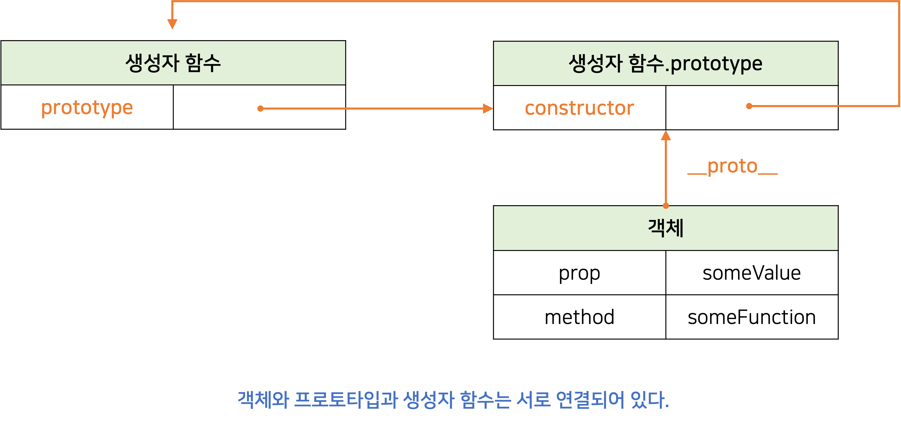

</div>

<br/>

모든 객체는 하나의 프로토타입을 갖는다. 그리고 모든 프로토타입은 생성자 함수와 연결되어 있다. 객체와 프로토타입과 생성자 함수는 다음 그림과 같이 연결되어 있다.

- `__proto__` 접근자 프로퍼티를 통해 자신의 `[[Prototype]]` 내부 슬롯이 가리키는 프로토타입에 간접적으로 접근할 수 있다.
- 프로토타입은 자신의 `constructor` 프로퍼티를 통해 생성자 함수에 접근할 수 있다.
- 생성자 함수는 자신의 `protytype` 프러퍼티를 통해 프로토타입에 접근할 수 있다.

<br/>

## \_\_proto\_\_ 접근자 프로퍼티

모든 객체는 `__proto__`접근자 프로퍼티를 통해 프로토타입을 가리키는 `[[Prototype]]` 내부 슬롯에 간접적으로 접근할 수 있다.

<br/>

#### \_\_proto\_\_ 는 접근자 프로퍼티다.

접근자 프로퍼티는 자체적으로 값을 갖지 않고 다른 데이터 프로퍼티의 값을 읽거나 저장할 때 사용하는 **접근자 함수**(`[[Get]]`, `[[Set]]` 프로퍼티 어트리뷰트)로 구성된 프로퍼티다.

- `__proto__` 접근자 프로퍼티를 통해 프로토타입에 접근하면 내부적으로 **getter** 함수인 `[[Get]]`이 호출된다.
- `__proto__` 접근자 프로퍼티를 통해 새로운 프로토타입을 할당하면 내부적으로 **setter** 함수인 `[[Set]]`이 호출된다.

```js
const obj = {};
const parent = { x: 1 };

// getter 함수가 호출되어 프로토타입을 취득
obj.__proto__;

// setter 함수가 호출되어 obj의 프로토타입을 교체
obj.__proto__ = parent;

console.log(obj.x); // 1
```

<br/>

#### \_\_proto\_\_ 접근자 프로퍼티는 상속을 통해 사용된다.

`__proto__` 접근자 프로퍼티는 객체가 직접 소유하는 프로퍼티가 아니라 `Object.prototype`의 프로퍼티다.

_**모든 객체는 상속을 통해 Object.prototype.**proto** 접근자 프로퍼티를 사용할 수 있다.**_

> ✍🏻 **Object.prototype**
>
> 모든 객체는 프로토타입의 계층 구조인 프로토타입 체인에 묶여 있다.
> 프로토타입 테인의 **최상위 객체**는 `Object.prototype`이며, 이 객체의 프로퍼티와 메서드는 모든 객체에 상속된다.

<br/>

#### \_\_proto\_\_ 접근자 프로퍼티를 통해 프로토타입에 접근하는 이유

프로토타입에 접근하기 위해 접근자 프로퍼티를 사용하는 이유는 <ins>상호 참조에 의해 프로토타입 체인이 생성되는 것(순환 참조하는 프로토타입 체인이 만들어지는 것)을 방지하기 위해</ins>서다.

프로토타입 체인은 단방향 링크드 리스트로 구현되어야 한다. 따라서 아무런 체크 없이 무조건적으로 프로토타입을 교체할 수 없도록 `__proto__` 접근자 프로퍼티를 통해 프로토타입에 접근하고 교체하도록 구현되어 있다.

<br/>

## 함수 객체의 prototype 프로퍼티

함수 객체만이 소유하는 prototype 프로퍼티는 생성자 함수가 생성할 인스턴스의 프로토타입을 가리킨다.

```js
// 함수 객체는 prototype 프로퍼티를 소유한다.
(function () {}).hasOwnProperty("prototype"); // true
// 일반 객체는 prototype 프로퍼티를 소유하지 않는다.
({}).hasOwnProperty("prototype"); // false
```

_**non-constructor(화살표 함수, ES6의 메서드 축약 표현)는 prototype 프로퍼티를 소유하지 않으며 프로토타입도 생성하지 않는다.**_

- 생성자 함수로 호출하기 위해 정의하지 않은 일반 함수(함수 선언문, 함수 표현식)도 prototype 프로퍼티를 소유하지만 객체를 생성하지 않는 일반 함수의 prototype 프로퍼티는 아무런 의미가 없다.

<br/>

모든 객체가 가지고 있는 `__proto__` 접근자 프로퍼티와 함수 객체만이 가지고 있는 `prototype` 프로퍼티는 동일한 프로토타입을 가리킨다. 하지만 사용하는 주체가 다르다.

| **구분**                      | **소유**    | **값**            | **사용 주체**   | **사용 목적**                                                                |
| ----------------------------- | ----------- | ----------------- | --------------- | ---------------------------------------------------------------------------- |
| \_\_proto\_\_ 접근자 프로퍼티 | 모든 객체   | 프로토타입의 참조 | **모든 객체**   | 객체가 자신의 프로토타입에 접근 또는 교체하기 위해 사용                      |
| prototype 프로퍼티            | constructor | 프로토타입의 참조 | **생성자 함수** | 생성자 함수가 자신이 생성할 객체(인스턴스)의 프로토타입을 할당하기 위해 사용 |

```js
function Person(name) {
  this.name = name;
}

const me = new Person("Roh");

// Person.prototype과 me.__proto__는 동일한 프로토타입을 가리킨다.
console.log(Person.prototype === me.__proto__); // true
```

<div style="max-width: 500px; margin: 0 auto;" >

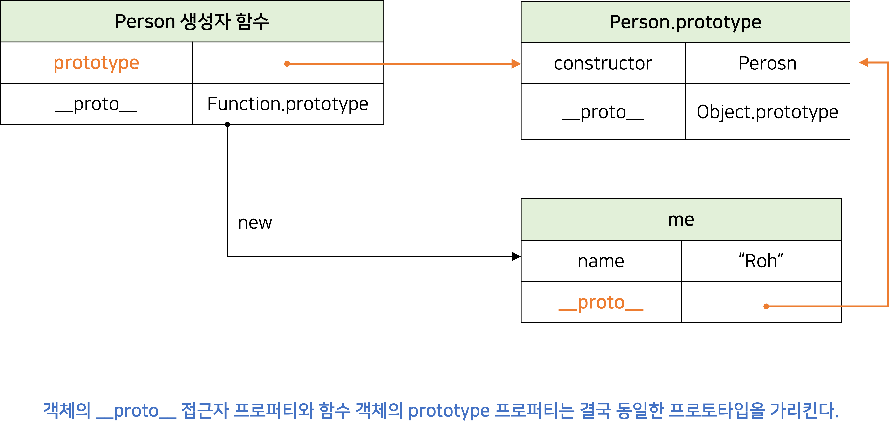

</div>

<br/>

## 프로토타입의 constructor 프로퍼티와 생성자 함수

_**모든 프로토타입은 constructor 프로퍼티를 갖는다.**_

이 constructor 프로퍼티는 prototype 프로퍼티로 자신을 참조하고 있는 생성자 함수를 가리킨다. 이 연결은 생성자 함수가 생성될 때(함수 객체가 생성될 때) 이뤄진다.

```js
function Person(name) {
  this.name = name;
}

const me = new Person("Roh");

// me 객체의 생성자 함수는 Person이다.
console.log(Person.constructor === Person); // true
```

<div style="max-width: 400px; margin: 0 auto;" >

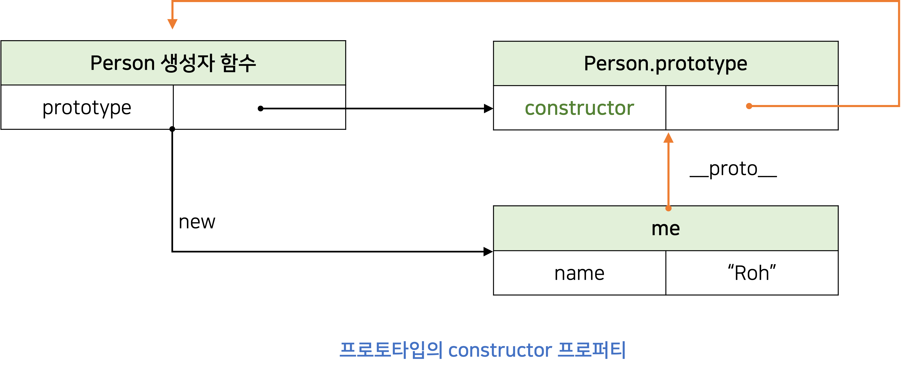

</div>

<br/>

위 예제에서 `Person` 생성자 함수는 `me`객체를 생성했다. `me`객체는 프로토타입의 `constructor` 프로퍼티를 통해 생성자 함수와 연결된다.

`me`객체에는 `constructor` 프로퍼티가 없지만, `me`객체의 프로토타입인 `Person.prototype`에 있는 `constructor` 프로퍼티를 상속받아 사용할 수 있다.

<br/><br/>

---

<br/>

# 리터럴 표기법에 의해 생성된 객체의 생성자 함수와 프로토타입

생성자 함수에 의해 생성된 인스턴스는 프로토타입의 `constructor` 프로퍼티에 의해 생성자 함수와 연결된다. 이때 `constructor` 프로퍼티가 가리키는 생성자 함수는 인스턴스를 생성한 생성자 함수다.

```js
// obj 객체를 생성한 생성자 함수는 Object다.
const obj = new Object();
console.log(obj.constructor === Object); // true

// 생성자 함수
function Person(name) {
  this.name = name;
}
const me = new Person("Roh");
console.log(me.constructor === Person); // true
```

리터럴 표기법에 의해 생성된 객체도 물론 프로토타입이 존재한다. 하지만, 프로토타입의 constructor 프로퍼티가 가리키는 생성자 함수가 반드시 객체를 생성한 생성자 함수라고 단정할 수는 없다.

```js
// obj 객체는 Object 생성자 함수로 생성한 객체가 아니라 객체 리터럴로 생성했다.
const obj = {};

// 하지만 obj 객체의 생성자 함수는 Object 생성자 함수다.
console.log(obj.constructor === Object); // true
```

<br/>

> Object 생성자 하뭇에 인수를 전달하지 않거나 undefined 또는 null을 인수로 전달하면서 호출하면 내부적으로는 추상 연산 `OrdinaryObjectCreate`를 호출하여 Object.prototype을 프로토타입으로 갖는 빈 객체를 생성한다.

<br/>

> ✍🏻 **추상 연산(abstract operation)**
>
> 추상 연산은 ECMAScript 사양에서 내부 동작의 구현 알고리즘을 표현한 것이다. ECMAScript 사양에서 설명을 위해 사용되는 함수와 유사한 의사 코드라고 이해하자.

<br/>

Object 생성자 함수 호출과 객체 리터럴의 평가는 추상 연산 `OrdinaryObjectCreate`를 호출하여 빈 객체를 생성하는 점에서 동일하나 `new.target`의 확인이나 프로퍼티를 추가하는 처리 등 세부 내용은 다르다. 따라서 <ins>객체 리터럴에 의해 생성된 객체는 Object 생성자 함수가 생성한 객체가 아니다.</ins>

리터럴 표기법에 의해 생성된 객체도 상속을 위해 프로토타입이 필요하다. 따라서 리터럴 표기법에 의해 생성된 객체도 **가상적인 생성자 함수**를 갖는다. 프로토타입은 생성자 함수와 더불어 prototype, constructor 프로퍼티에 의해 연결되어 있기 때문이다. 즉, **_프로토타입과 생성자 함수는 단독으로 존재할 수 없고 언제나 쌍(pair)으로 존재한다._**

<br/><br/>

# 프로토타입의 생성 시점

**_프로토타입은 생성자 함수가 생성되는 시점에 같이 생성된다._** 프로토타입과 생성자 함수는 단독으로 존재할 수 없고 언제나 쌍으로 존재하기 때문이다.

생성자 함수는 **사용자 정의 생성자 함수**와 **빌트인 생성자 함수**로 구분할 수 있다.

<br/>

## 사용자 정의 생성자 함수와 프로토타입 생성 시점

**_constructor(생성자 함수로서 호출할 수 있는 함수)는 함수 정의가 평가되어 함수 객체를 생성하는 시점 에 프로토타입도 같이 생성된다._**

- 런타임 이전에 함수가 평가되고 프로토타입도 이때 생성된다.

```js
// 함수 정의가 평가되어 함수 객체를 생성하는 시점에 프로토타입도 같이 생성된다.
console.log(Person.prototype); // {constructor: ƒ}

function Person(name) {
  this.name = name;
}
```

non-constructor(생성자 함수로서 호출할 수 없는 함수)는 프로토타입이 생성되지 않는다.

```js
const Person = (name) => {
  this.name = name;
};

// non-constructor는 프로토타입이 생성되지 않는다.
console.log(Person.prototype); // undefined
```

<div style="max-width: 400px; margin: 0 auto;" >

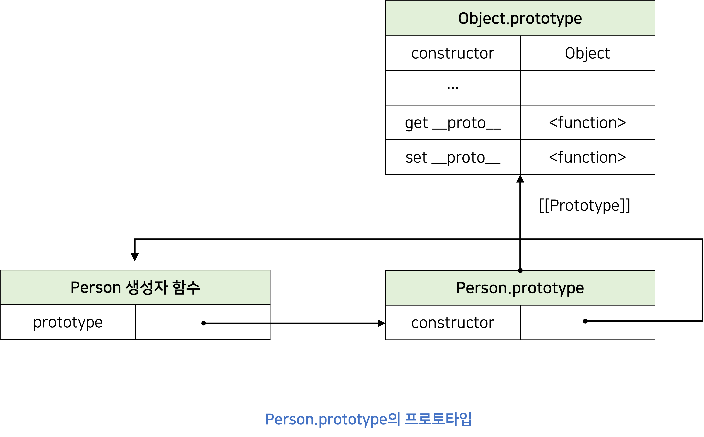

</div>

<br/>

함수 선언문은 런타임 이전에 자바스크립트 엔진에 의해 먼저 실행된다. 따라서 함수 선언문으로 정의된 `Person` 생성자 함수는 어떤 코드보다 먼저 평가되어 함수 객체가 된다. 이때 프로토타입도 더불어 생성된다.

생성된 프로토타입은 `Person` 생성자 함수의 `prototype` 프로퍼티에 바인딩된다.

생성된 프로토타입은 오직 `constructor` 프로퍼티만을 갖는 객체다. 프로토타입도 객체이고 모든 객체는 프로토타입을 가지므로 프로토타입도 자신의 프로토타입을 갖는다. 생성된 프로토타입의 프로토타입은 `Object.prototype`이다.

<br/>

## 빌트인 생성자 함수와 프로토타입 생성 시점

`Object`, `String`, `Number`, `Function`, `Array`, `RegExp`, `Date`, `Promise` 등과 같은 빌트인 생성자 함수도 일반 함수와 마찬가지로 빌트인 생성자 함수가 생성되는 시점에 프로토타입이 생성된다. **_모든 빌트인 생성자 함수는 전역 객체가 생성되는 시점에 생성된다._**

생성자 함수와 프로토타입은 이미 객체가 생성되기 이전에 객체화되어 존재한다. 이후 생성자 함수 또는 리터럴 표기법으로 객체를 생성하면 프로토타입은 생성된 객체의 `[[Prototype]]` 내부 슬롯에 할당된다.

<br/><br/>

# 객체 생성 방식과 프로토타입의 결정

객체는 다음과 같이 다양한 생성 방법이 있다.

- 객체 리터럴
- Object 생성자 함수
- 생성자 함수
- Object.create
- 클래스(ES6)

다양한 방법으로 생성된 객체는 약간의 차이점은 있지만, `OrdinaryObjectCreate`에 의해 생성된다는 공통점이 있다.

<br/>

추상 연산 `OrdinaryObjectCreate`는 필수적으로 자신이 생성할 객체의 프로토타입을 인수로 전달받는다.<br/>
그리고 자신이 생성할 객체에 추가할 프로퍼티 목록을 옵션으로 전달할 수 있다. <br/>
`OrdinaryObjectCreate`는 빈 객체를 생성한 후, 객체에 추가할 프로퍼티 목록이 인수로 전달된 경우 프로퍼티를 객체에 추가한다.<br/>
그리고 인수로 전달받은 프로토타입을 `[[Prototype]]` 내부 슬롯에 할당한 다음, 생성한 객체를 반환한다.

_프로토타입은 추상 연산 `OrdinaryObjectCreate`에 전달되는 인수에 의해 결정된다. 이 인수는 객체가 생성되는 시접에 객체 생성 방식에 의해 결정된다._

<br/>

## 객체 리터럴에 의해 생성된 객체의 프로토타입

위에서 프로토타입은 추상 연산 `OrdinaryObjectCreate`에 전달되는 인수에 의해 결정된다고 했다. 객체 리터럴을 평가하여 객체를 생성할때 `OrdinaryObjectCreate`에 전달되는 프로토타입은 `Object.prototype`이다. 따라서, <ins>객체 리터럴에 의해 생성되는 객체의 프로토타입은 `Object.prototype`이다.</ins>

```js
const obj = { x: 1 };
```

<div style="max-width: 400px; margin: 0 auto;" >

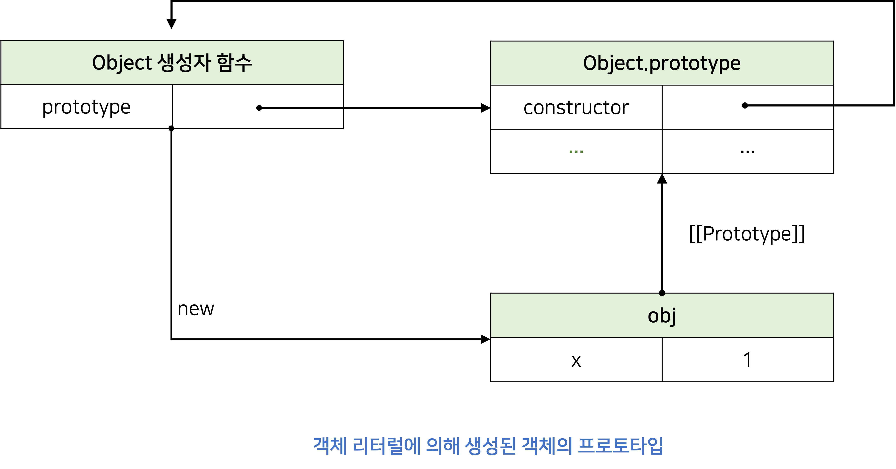

</div>

객체 리터럴에 의해 생성된 `obj` 객체는 `Object.prototype`을 프로토타입으로 갖게 되며, `Object.prototype`을 상속받는다.

<br/>

## Object 생성자 함수에 의해 생성된 객체의 프로토타입

Object 생성자 함수를 인수 없이 호출하면 빈 객체가 생성된다. 객체 리터럴과 마찬가지로 추상 연산 `OrdinaryObjectCreate`가 호출되고, 추상 연산 `OrdinaryObjectCreate`로 전달되는 프로토타입은 `Object.prototype`이다. 따라서, <ins>`Object` 생성자 함수에 의해 생성된 객체의 프로토타입은 `Object.prototype`이다.</ins>

```js
const obj = new Object();
obj.x = 1;
```

위 코드가 실행되면 추상 연산 OrdinaryObjectCreate에 의해 다음과 같이 Object 생성자 함수와 Object.prototype과 생성된 객체 사이에 연결이 만들어진다.

<div style="max-width: 400px; margin: 0 auto;" >

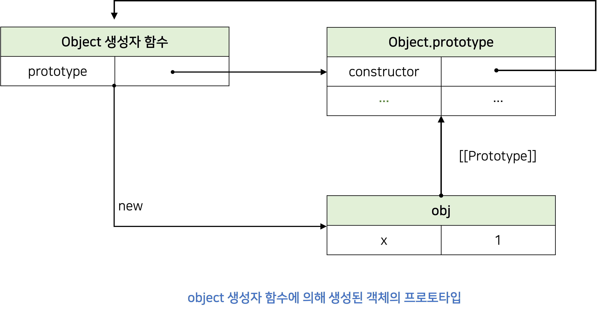

</div>

<br/>

**_객체 리터럴에 의해 생성된 객체와 동일한 구조를 갖는것을 알 수 있다._**

Object 생성자 함수에 의해 생성된 obj 객체는 `Object.prototype`을 프로토타입으로 갖게 되며, `Object.prototype`을 상속받는다.

<br/>

## 생성자 함수에 의해 생성된 객체의 프로토타입

생성자 함수에 의해 생성된 객체의 프로토타입은 생성자 함수의 `prototype` 프로퍼티에 바인딩되어 있는 객체다.

```js
function Person(name) {
  this.name = name;
}

const me = new Person("Roh");
```

위 코드가 실행되면 추상 연산 `OrdinaryObjectCreate`에 의해 다음과 같이 생성자 함수와 생성자 함수의 `prototype` 프로퍼티에 바인딩되어 있는 객체와 생성된 객체 사이에 연결이 만들어진다.

<div style="max-width: 400px; margin: 0 auto;" >

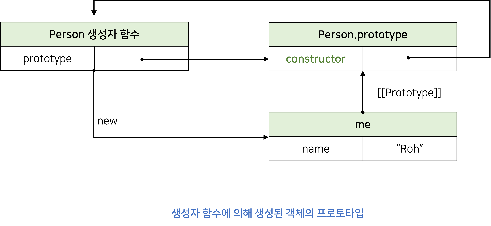

</div>

<br/>

사용자 정의 생성자 함수 Person과 더불어 생성된 프로토타입 Person.prototype의 프로퍼티는 `constructor` 뿐이다.

<br/><br/>

---

<br/>

# 프로토타입 체인

자바스크립트는 객체의 프로퍼티(메서드 포함)에 접근하려고 할 때 해당 객체에 접근하려는 프로퍼티가 없다면 `[[Prototype]]` 내부 슬롯의 참조를 따라 자신의 부모 역할을 하는 프로토타입의 프로퍼티를 순착작으로 검색하는데 이를 **프로토타입 체인**이라 한다.

**프로토타입 체인**은 <ins>자바스크립트가 객체지향 프로그래밍의 상속을 구현하는 메커니즘</ins>이다.

## 프로토타입 체인 예제

```js
function Person(name) {
  this.name = name;
}

Person.prototype.sayHello = function () {
  console.log(`Hi My name is ${this.name}`);
};

const me = new Person("Roh");
```

<div style="max-width: 400px; margin: 0 auto;" >

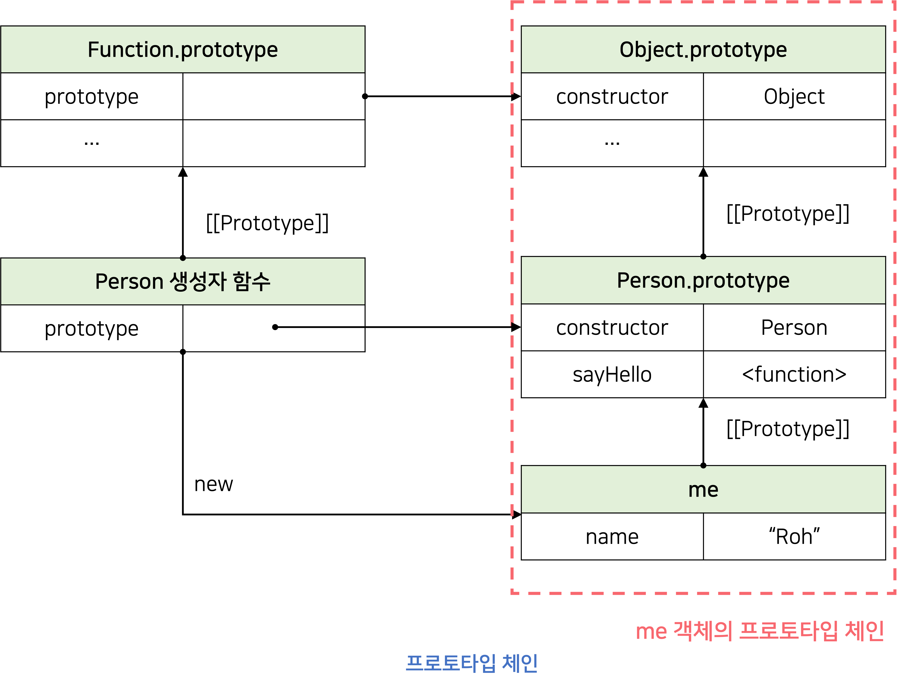

</div>

<br/>

`me` 객체는 `Person.prototype`뿐만 아니라 `Object.prototype`도 상속 받는다.

<br/>

#### 프로토타입 체인의 최상위에 위치하는 객체는 언제나 Object.prototype이다.

따라서 모든 객체는 Object.prototype을 상속 받는다.

`Object.prototype`을 프로토타입 **체인의 종점(end of prototype chain)** 이라 하고, `Object.prototype`의 프로토타입(`[[Prototype]]` 내부 슬롯 값)은 `null`이다.

<br/>

#### 프로토타입 체인은 상속과 프로퍼티 검색을 위한 메커니즘이다.

- 자바스크립트 엔진은 **객체 간의 상속 관계로 이루어진 프로토타입**의 계층적인 구조에서 객체의 프로퍼티(메서드 포함)를 검색한다.

<br/>

#### 스코프 체인은 식별자 검색을 위한 메커니즘이다.

- 자바스크립트 엔진은 **함수의 중첩 관계로 이루어진 스코프의 구조**에서 식별자를 검색한다.

<br/>

## 스코프, 프로토타입 체인 예제

```js
me.hasOwnProperty("name");
```

- 스코프 체인에서 `me` 식별자를 찾는다.
- `me` 객체의 **프로토타입 체인**에서 `hasOwnProperty` 메서드를 검색한다.

**_스코프 체인과 프로토타입 체인은 서로 연관없이 별도로 동작하는 것이 아니라 서로 협력하여 식별자와 프로퍼티를 검색하는 데 사용된다._**

<br/><br/>

# 오버라이딩과 프로퍼티 섀도잉

```js
const Person = (function () {
  function Person(name) {
    this.name = name;
  }

  // 프로토타입 메서드
  Person.prototype.sayHello = function () {
    console.log(`Hi! My name is ${this.name}`);
  };

  return Person;
})();

const me = new Person("Roh");

// 인스턴스 메서드
me.sayHello = function () {
  console.log(`Hey! My name is ${this.name}`);
};

me.sayHello(); // Hey! My name is Roh
```

<div style="max-width: 500px; margin: 0 auto;" >

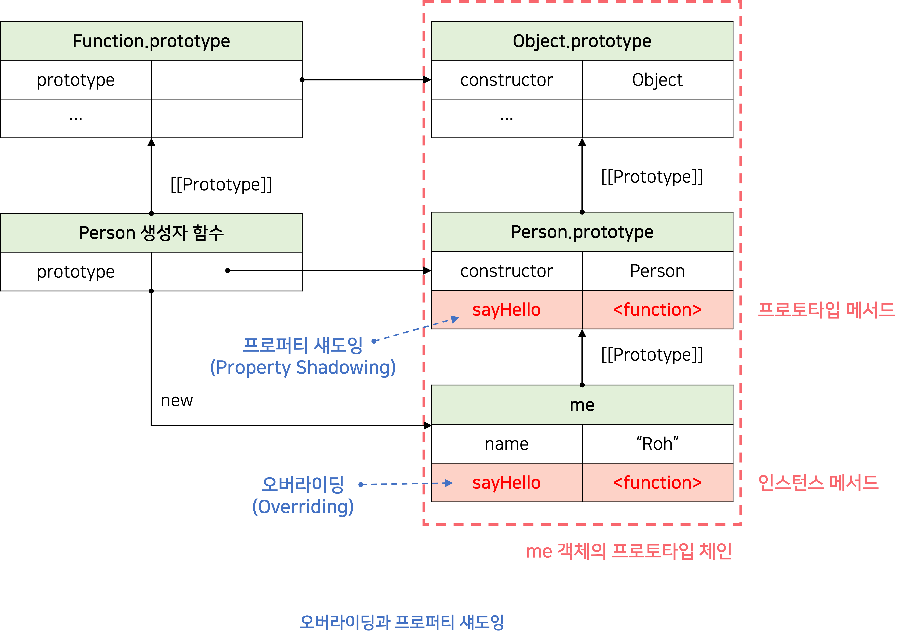

</div>

<br/>

프로토타입이 소유한 프로퍼티(메서드 포함)를 **프로토타입 프로퍼티**, 인스턴스가 소유한 프로퍼티를 **인스턴스 프로퍼티**라고 부른다.

**인스턴스 메서드** `sayHello`는 **프로토타입 메서드** `sayHello`를 **오버라이딩**했고 <ins>프로토타입 메서드 `sayHello`는 가려진다.</ins>

이처럼 **상속 관계에 의해 프로퍼티가 가려지는 현상**을 **프로퍼티 섀도잉(property shadowing)**이라 한다.

<br/>

> ✍🏻 **오버라이딩(Overriding)**
>
> 상위 클래스가 가지고 있는 메서드를 하위 클래스가 재정의하여 사용하는 것을 말한다.

<br/>

> ✍🏻 **오버로딩(Overloading)**
>
> 함수의 이름은 동일하지만 매개변수의 타입 또는 개수가 다른 메서드를 구현하고 매개변수에 의해 메서드를 구별하여 호출하는 것을 말한다.
> **자바스크립트는 오버로딩을 지원하지 않지만 arguments 객체를 사용하여 구현할 수 있다.**

<br/>

### 프로퍼티 삭제 예제

```js
// 인스턴스 메서드를 삭제한다.
delete me.sayHello;

// 인스턴스에는 sayHello 메서드가 없으므로 프로토타입 메서드가 호출된다.
me.sayHello(); // Hi! My name is Roh

// 프로토타입 체인을 통해 프로토타입 메서드가 삭제되지 않는다.
delete me.sayHello;

// 프로토타입 메서드가 호출된다.
me.sayHello(); // Hi! My name is Roh
```

**_하위 객체를 통해 프로토타입의 프로퍼티를 변경 또는 삭제하는 것은 불가능하다._**

- 하위 객체를 통해 프로토타입에 `get` 액세스는 허용되나 `set` 액세스는 허용되지 않는다.

**_프로토타입 프로퍼티를 변경 또는 삭제하려면 프로토타입에 직접 접근해야한다._**

```js
// 프로토타입 메서드 변경
Person.prototype.sayHello = function () {
  console.log(`Hey! My name is ${this.name}`);
};
me.sayHello(); // Hey! My name is Roh

// 프로토타입 메서드 삭제
delete Person.prototype.sayHello;
me.sayHello(); // TypeError: me.sayHello is not a function
```

<br/><br/>

# 프로토타입의 교체

프로토타입은 임의의 다른 객체로 변경할 수 있다. 이는 <ins>부모 객체인 프로토타입을 동적으로 변경할 수 있다는 것을 의미</ins>한다. _프로토타입은 생성자 함수 또는 인스턴스에 의해 교체할 수 있다._

<br/>

## 생성자 함수에 의한 프로토타입의 교체

```js
const Person = (function () {
  function Person(name) {
    this.name = name;
  }

  // 생성자 함수의 prototype 프로퍼티를 통해 프로토타입을 교체
  Person.prototype = {
    sayHello() {
      console.log(`Hi! My name is ${this.name}`);
    },
  };

  return Person;
})();

const me = new Person("Roh");
```

<div style="max-width: 500px; margin: 0 auto;" >

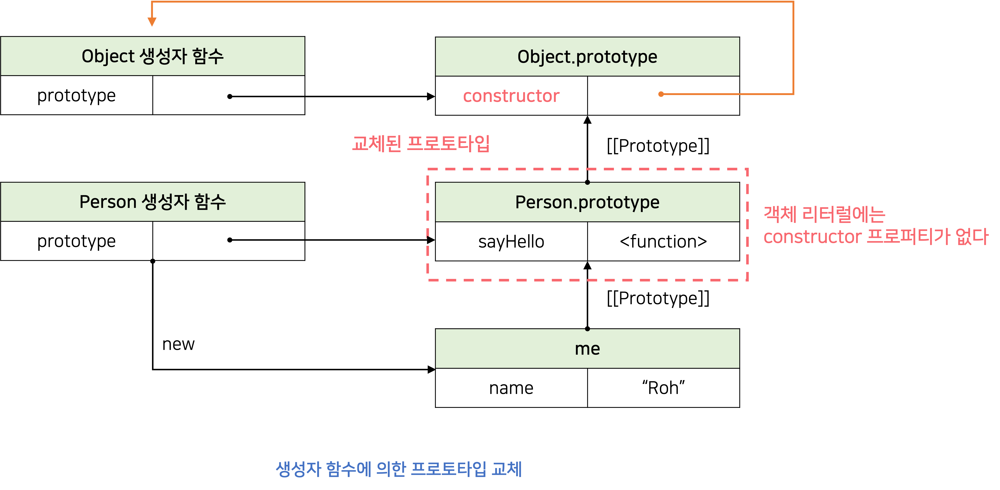

</div>

<br/>

프로토타입으로 교체한 객체 리터럴에는 `constructor` 프로퍼티가 없다. `constructor` 프로퍼티는 자바스크립트 엔진이 프로토타입을 생성할 때 암묵적으로 추가한 프로퍼티다. 따라서 `me`객체의 생성자 함수를 검색하면 `Person`이 아닌 `Object`가 나온다.

<br/>

```js
console.log(me.constructor === Person); // false
console.log(me.constructor === Object); // true
```

**_프로토타입을 교체하면 constructor 프로퍼티와 생성자 함수 간의 연결이 파괴된다._**

프로토타입으로 교체한 객체 리터럴에 `constructor` 프로퍼티를 추가하여 프로토타입의 `constructor` 프로퍼티를 되살릴 수 있다.

```js
const Person = (function () {
  function Person(name) {
    this.name = name;
  }

  // 생성자 함수의 prototype 프로퍼티를 통해 프로토타입을 교체
  Person.prototype = {
    // constructor 프로퍼티와 생성자 함수 간의 연결을 설정
    constructor: Person,
    sayHello() {
      console.log(`Hi! My name is ${this.name}`);
    },
  };

  return Person;
})();

const me = new Person("Roh");

console.log(me.constructor === Person); // true
console.log(me.constructor === Object); // false
```

<br/>

## 인스턴스에 의한 프로토타입의 교체

인스턴스의 `__proto__`접근자 프로퍼티 또는 `Object.setPrototypeOf`메서드를 통해 프로토타입을 교체할 수 있다.

```js
function Person(name) {
  this.name = name;
}

const me = new Person("Roh");

// 프로토타입으로 교체할 객체
const parent = {
  sayHello() {
    console.log(`Hi! My name is ${this.name}`);
  },
};

// me 객체의 프로토타입을 parent 객체로 교체한다.
Object.setPrototypeOf(me, parent);
// 위 코드는 아래 코드와 동일하게 동작한다.
// me.__proto__ = parent;

me.sayHello(); // Hi! My name is Roh
```

<div style="max-width: 400px; margin: 0 auto;" >

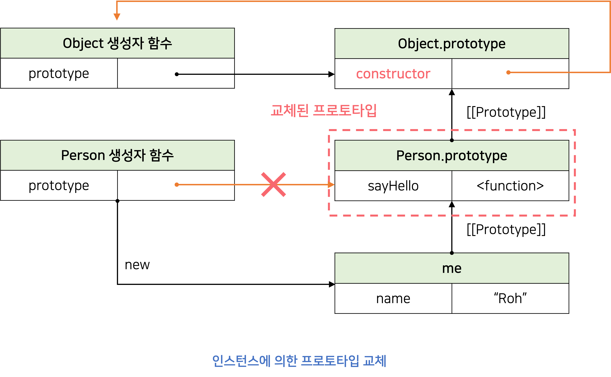

</div>

<br/>

"생성자 함수에 의한 프로토타입의 교체"와 마찬가지로 프로토타입으로 교체한 객체 리터럴에는 `constructor` 프로퍼티가 없으므로 `me` 객체의 생성자 함수를 검색하면 `Person`이 아닌 `Object`가 나온다.

```js
console.log(me.constructor === Person); // false
console.log(me.constructor === Object); // true
```

생성자 함수에 의한 프로토타입의 교체와 약간 다른 부분이 있는데, 인스턴스로 프로토타입을 교체하면 객체리터럴에 `constructor` 프로퍼티를 추가하고, 생성자 함수의`prototype` 프로퍼티도 재설정해줘야 한다.

```js
function Person(name) {
  this.name = name;
}

const me = new Person("Roh");

// 프로토타입으로 교체할 객체
const parent = {
  // constructor 프로퍼티와 생성자 함수 간의 연결을 설정
  constructor: Person,
  sayHello() {
    console.log(`Hi! My name is ${this.name}`);
  },
};

// 생성자 함수의 prototype 프로퍼티와 프로토타입 간의 연결을 설정
Person.prototype = parent;

// me 객체의 프로토타입을 parent 객체로 교체한다.
Object.setPrototypeOf(me, parent);
// 위 코드는 아래 코드와 동일하게 동작한다.
// me.__proto__ = parent;

console.log(me.constructor === Person); // true
console.log(me.constructor === Object); // false

// 생성자 함수의 prototype 프로퍼티가 교체된 프로토타입을 가리킨다.
console.log(Person.prototype === Object.getPrototypeOf(me)); // true
```

프로토타입 교체를 통해 객체 간의 상속 관계를 동적으로 변경하는 것의 꽤나 번거롭다. 따라서 프로토타입은 직접 교체하지 않는 것이 좋다.

<br/><br/>

# instanceof 연산자

**`instanceof`연산자**는 이항 연산자로 좌변에 객체를 가리키는 식별자, 우변에 생성자 함수를 가리키는 식별자를 피연산자로 받는다. 만약 우변의 피연산자 함수가 아닌 경우 TypeError가 발생한다.

```js
객체 instanceof 생성자 함수
```

우변의 생성자 함수의 prototype에 바인딩된 객체가 좌변의 객체의 프로토타입 체인 상에 존재하면 `true`로 평가되고, 그렇지 않은 경우에는 `false`로 평가된다.

```js
function Person(name) {
  this.name = name;
}

const me = new Person("Roh");

// Person.prototype이 me 객체의 프로토타입 체인 상에 존재하므로 true를 반환한다.
console.log(me instanceof Person); // true

// Object.prototype이 me 객체의 프로토타입 체인 상에 존재하므로 true를 반환한다.
console.log(me instanceof Object); // true
```

<br/>

### instanceof 연산자의 동작 과정

```js
function Person(name) {
  this.name = name;
}

const me = new Person("Roh");

// 프로토타입으로 교체할 객체
const parent = {};

Object.setPrototypeOf(me, parent);

// Person 생성자 함수와 parent 객체는 연결되어 있지 않다.
console.log(Person.prototype === parent); // false
console.log(parent.constructor === Person); // false

// Person.prototype이 me 객체의 프로토타입 체인 상에 존재하지 않기 때문에 false로 평가된다.
console.log(me instanceof Person); // false

// Object.prototype이 me 객체의 프로토타입 체인 상에 존재하므로 true로 평가된다.
console.log(me instanceof Object); // true
```

me 객체는 비록 프로토타입이 교체되어 프로토타입과 생성자 함수 간의 연결이 파괴되었지만 Person 생성자 함수에 의해 생성된 인스턴스이다. 하지만 `me instanceof Person`가 `false`로 평가되는 이유는 `Person.prototype`이 `me` 객체의 프로토타입 체인 상에 존재하지 않기 때문이다.

`instanceof`연산자는 프로토타입의 `constructor` 프로퍼티가 가리키는 생성자 함수를 찾는 것이 아니라, <ins>생성자 함수의 `prototype`에 바인딩된 객체가 프로토타입 체인 상에 존재하는지 확인</ins>한다.

생성자 함수에 의해 프로토타입이 교체되어 constructor 프로퍼티와 생성자 함수 간의 연결이 파괴되어도 생성자 함수의 prototype프로퍼티와 프로토타입 간의 연결은 파괴되지 않으므로 **instanceof는 아무런 영향을 받지 않는다.**

<br/><br/>

---

<br/>

# 정적 프로퍼티/메서드

**정적(static) 프로퍼티/메서드**는 생성자 함수로 인스턴스를 생성하지 않아도 참조/호출할 수 있는 프로퍼티/메서드를 말한다.

```js
// 생성자 함수
function Person(neam) {
  this.name = name;
}

// 프로토타입 메서드
Person.prototype.greet = function () {
  console.log(`Hello, My name is ${this.name}!`);
};

// 정적 프로퍼티
Person.staticProp = "statuc prorp";

// 정적 메서드
Person.staticMethod = function () {
  console.log("staticMethod");
};

const man = new Person("Roh");

// 생성자 함수에 추가한 정적 프로퍼티/메서드는 생성자 함수로 참조/호출한다.
Person.staticMethod(); // staticMethod

// 정적 프로퍼티/메서드는 생성자 함수로 생성한 인스턴스에서 호출할 수 없다.
// 인스턴스에서 호출하기 위해서는 인스턴스와 같은 프로토타입 체인상에 있어야 한다.
man.staticMethod(); // TypeError: man.staticMethod is not a function
```

<div style="max-width: 400px; margin: 0 auto;" >

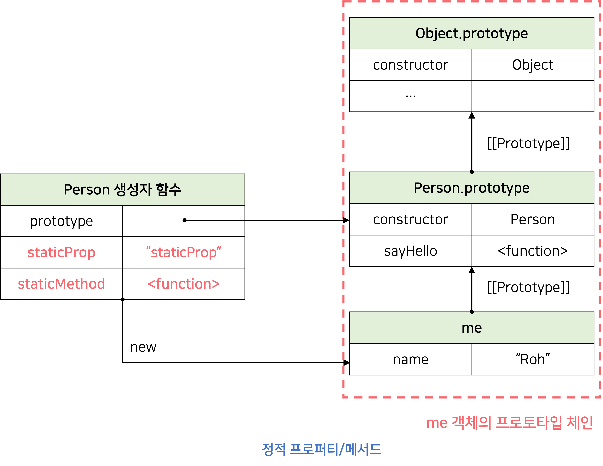

</div>

<br/>

생성자 함수 객체가 소유한 프로퍼티/메서드를 정적 프로퍼티/메서드라고 한다. **_정적 프로퍼티/메서드는 생성자 함수가 생성한 인스턴스로 참조/호출할 수 없다._**

정적 프로퍼티/메서드는 인스턴스의 프로토타입 체인에 속한 객체의 프로퍼티/메서드가 아니므로 접근할 수 없는 것이다.

```js
function Foo() {}

// 프로토타입 메서드
// this를 참조하지 않는 프로토타입 메서드는 정적 메서드로 변경하여도 동일한 효과를 얻을 수 있다.
Foo.prototype.x = function () {
  console.log("x");
};

const foo = new Foo();
// 프로토타입 메서드를 호출하기 위해서는 인스턴스를 생성해야 한다.
foo.x(); // x

// 정적 메서드
Foo.x = function () {
  console.log("x");
};

// 정적 메서드는 인스턴스를 생성하지 않아도 호출할 수 있다.
Foo.x(); // x
```

프로토타입 메서드를 호출하려면 인스턴스를 생성해야 하지만 정적 메서드는 인스턴스를 생성하지 않아도 호출할 수 있다.

<br/><br/>

---

<br/>

# 프로퍼티 존재 확인

## in 연산자

`in` 연산자는 객체 내에 특정 프로퍼티가 존재하는지 여부를 확인한다.

```js
const person = {
  name: "Roh",
  address: "Incheon",
};

// person 객체에 name 프로퍼티가 존재한다.
console.log("name" in person); // true

// person 객체에 address 프로퍼티가 존재한다.
console.log("address" in person); // ture

// person 객체에 age 프로퍼티가 존재하지 않는다.
console.log("age" in person); // false
```

`in` 연산자는 확인 대상 객체의 프로퍼티뿐만 아니라 <ins>확인 대상 객체의 프로토타입 체인 상의 존재하는 모든 프로토타입에서 프로토타입을 확인</ins>한다.

```js
console.log("toString" in person); // true
```

`in` 연산자 대신 ES6에 도입된 **`Reflect.has`** 메서드를 사용할 수 있다. `Reflect.has` 메서드는 `in` 연산자와 동일하게 동작한다.

```js
const person = { name: "Roh" };

console.log(Reflect.has(person, "name")); // true
console.log(Reflect.has(person, "toString")); // true
```

<br/>

## Object.prototype.hasOwnProperty 메서드

**`Object.prototype.hasOwnProperty`** 메서드는 객체 고유의 프로퍼티 키인 경우에만 `true`를 반환하고, 상속받은 프로토타입의 프로퍼티 키인 경우 `false`를 반환한다.

```js
console.log(person.hasOwnProperty('name'); // true
console.log(person.hasOwnProperty('age'); // true

console.log(person.hasOwnProperty('toString'); // false
```

<br/><br/>

# 프로퍼티 열거

## for ... in 문

`for...in` 문은 객체의 프로토타입 체인 상에 존재하는 모든 프로토타입의 프로퍼티 중에서 프로퍼티 어트리뷰트`[[Enumerable]]`의 값이 `true`인 프로퍼티를 순회하며 열거(enumeration)한다.

- `toString`과 같이 `[[Enumerable]]`의 값이 `false`인 프로퍼티는 열거되지 않는다.

```js
const person = {
  name: "Roh",
  address: "Seoul",
  __proto__: { age: 20 },
};

// for...in 문의 prop에 person 객체의 프로퍼티 키가 할당된다.
for (const key in person) {
  console.log(key + ": " + person[key]);
}
// name: Roh
// address: Seoul
// age: 20
```

`for...in` 문은 프로퍼티 키가 **심벌(Symbol)** 인 프로퍼티는 열거하지 않는다.

```js
const sym = Symbol();
const obj = {
  a: 1,
  [sym]: 10,
};

for (const key in person) {
  console.log(key + ": " + obj[key]);
}
// a: 1
```

`for...in` 문은 프로퍼티를 열거할 때 <ins>순서를 보장하지 않는다.</ins> 하지만 대부분의 브라우저는 순서를 보장하고 <ins>숫자인 프로퍼티 키에 대해서는 정렬한다.</ins>

```js
const obj = {
  2: 2,
  3: 3,
  1: 1,
  b: "b",
  a: "a",
};

for (const key in obj) {
  if (!obj.hasOwnProperty(key)) continue;
  console.log(key + ": " + obj[key]);
}

/*
1: 1
2: 2
3: 3
b: b
a: a
*/
```

<br/>

## Object.keys/values/entries 메서드

`Object.keys/values/entries` 메서드는 객체 자신의 고유 프로퍼티만을 열거한다.

### ☑️ Object.keys

`Object.keys` 메서드는 객체 자신의 열거 가능한 <ins>프로퍼티 키를 배열로 반환</ins>한다.

```js
const person = {
  name: "Roh",
  address: "Seoul",
  __proto__: { age: 26 },
};

console.log(Object.keys(person)); // ["name", "address"]
```

<br/>

### ☑️ Object.values

`Object.values` 메서드는 객체 자신의 열거 가능한 <ins>프로퍼티 값을 배열로 반환</ins>한다.

```js
const person = {
  name: "Roh",
  address: "Seoul",
  __proto__: { age: 26 },
};

console.log(Object.values(person)); // ["Roh", "Seoul"]
```

<br/>

### ☑️ Object.entries

`Object.entries` 메서드는 객체 자신의 열거 가능한 <ins>프로퍼티 키와 값의 쌍을 2차원 배열로 반환</ins>한다.

```js
console.log(Object.entries(person)); // [["name", "Roh"], ["address", "Seoul"]]

Object.entries(person).forEach(([key, value]) => console.log(key, value));
/*
name Roh
address Incheon
*/
```

<br/><br/><br/>

<h1 align="center">20.strict mode</h1>

<br/>

# strict mode란?

strict mode는 자바스크립트 언어의 문법을 좀 더 엄격히 적용하여 오류를 발생시킬 가능성이 높거나 자바스크립트 엔진의 최적화 작업에 문제를 일으킬 수 있는 코드에 대해 명시적인 에러를 발생시킨다.

ES6에서 도입된 클래스와 모듈은 기본적으로 strict mode가 적용된다.

<br/>

### ✏️ 암묵적 전역(implicit global)

```js
function foo() {
  x = 10;
}
foo();

console.log(x);
```

위 코드는 에러가 발생되지 않는다.

자바스크립트 엔진은 암묵적으로 전역 객테에 `x` 프로퍼티를 동적 생성한다. 이때 전역 객체의 `x`프로퍼티는 마치 전역 변수처럼 사용할 수 있다. 이런 현상을 암묵적 전역이라 한다.

<br/><br/>

# strict mode의 적용

전역의 선두 또는 함수 몸체의 선두에 'use strict';를 추가한다.

```js
"use strict";

function foo() {
  x = 10; // ReferenceError: x is not defined
}
foo();
```

함수 몸체의 선두에 추가하면 해당 함수와 중첩 함수에 strict mode가 적용된다.

```js
function foo() {
  "use strict";

  x = 10; // ReferenceError: x is not defined
}
foo();
```

코드의 선두에 위치시키지 않으면 strict mode가 제대로 동작하지 않는다.

```js
function foo() {
  x = 10; // 에러를 발생시키지 않는다.
  ("use strict");
}
foo();
```

<br/><br/>

# 전역에 strict mode를 적용하는 것은 피하자

strict mode는 스크립트 단위로 적용된다.

strict mode는 스크립트 단위로 적용된다.

- html에서 `<script>`태그를 사용할 때 strict mode는 스크립트 단위로 적용되기 때문에 다른 스크립트에는 영향을 주지 않고 해당 스크립트에만 한정되어 적용된다.

strict mode 스크립트와 non-strict mode 스크립트를 혼용하는 것은 오류를 발생시킬 수 있다.

- 서드 파티 라이브러리를 사용하는 경우 라이브러리가 non-strict mode인 경우도 있기 때문에 즉시실행함수로 스크립트 전체를 감싸서 사용하는 것이 바람직하다.

```js
(function () {
  "use strict";

  // code...
})();
```

<br/><br/>

# 함수 단위로 strict mode를 적용하는 것도 피하자

strict mode가 적용된 함수가 참조할 함수 외부의 컨텍스트에 strict mode를 적용하지 않으면 문제가 발생할 수 있다. 그리고 함수에 일일이 strict mode를 적용하는 것은 번거로운 일이기도 하다.

📌 strict mode는 즉시 실행 함수(IIFE)로 감싼 스크립트 단위로 적용하는 것이 바람직하다.

```js
(function () {
  // non-strict mode
  var let = 10;

  function foo() {
    "use strict";

    let = 20; // SyntaxError: Unexpected strict mode reserved word
  }
  foo();
})();
```

<br/><br/>

# strict mode가 발생시키는 에러

## 암묵적 전역

선언하지 않은 변수를 참조하면 `ReferenceError`가 발생한다.

```js
(function () {
  "use strict";

  x = 10;
  console.log(x); // ReferenceError: x is not defied
})();
```

<br/>

## 변수, 함수, 매개변수의 삭제

`delete` 연산자로 변수, 함수, 매개변수를 삭제하면 `SyntaxError`가 발생하다.

```js
(function () {
  "use strict";

  var x = 10;
  delete x;
  // SyntaxError: Delete of an unqualified identifier in strict mode.

  function foo(a) {
    delete a;
    // SyntaxError: Delete of an unqualified identifier in strict mode.
  }
  delete foo;
  // SyntaxError: Delete of an unqualified identifier in strict mode.
})();
```

<br/>

## 매개변수 이름의 중복

중복된 매개변수 이름을 사용하면 SyntaxError가 발생한다.

```js
(function () {
  "use strict";

  // SyntaxError: Duplicate parameter name not allowed in this context
  function foo(x, x) {
    console.log(x);
  }
})();
```

<br/><br/>

# strict mode 적용에 의한 변화

## 일반 함수의 this

strict mode에서 함수를 일반 함수로서 호출하면 `this`에 `undefined`가 바인딩된다. 생성자 함수가 아닌 일반 함수 내부에서는 `this`를 사용할 필요가 없기 때문이다.

```js
(function () {
  "use strict";

  function foo() {
    console.log(this); // undefined
  }
  foo();

  function Foo() {
    console.log(this); // Foo
  }
  new Foo();
})();
```

<br/>

## arguments 객체

strict mode에서는 매개변수에 전달된 인수를 재할당하여 변경해도 `arguments` 객체에 반영되지 않는다.

```js
(function (a) {
  "use strict";
  // 매개변수에 전달된 인수를 재할당하여 변경
  a = 2;

  // 변경된 인수가 arguments 객체에 반영되지 않는다.
  console.log(arguments); // {0: 1, length: 1}
})(1);
```

<br/><br/><br/>

<h1 align="center">21.빌트인 객체</h1>

<br/>

# 자바스크립트 객체의 분류

자바스크립트 객체는 다음과 같이 크게 3개의 객체로 분류할 수 있다.

- 표준 빌트인 객체
- 호스트 객체
- 사용자 정의 객체

<br/><br/>

# 표준 빌트인 객체

자바스크립트는 `Object`, `String`, `Number`, `Boolean`, `Symbol`, `Date`, `Math`, `RegExp`, `Array`, `Map/Set`, `WeakMap/WeakSet`, `Function`, `Promise`, `Reflect`, `Proxy`, `JSON`, `Error` 등 40여 개의 표준 빌트인 객체 4를 제공한다.

`Math`, `Reflect`, `JSON`을 제외한 표준 빌트인 객체는 모두 인스턴스를 생성할 수 있는 생성자 함수 객체다.

**생성자 함수 객체인 표준 빌트인 객체**는 프로토타입 메서드와 정적 메서드를 제공하고, **생성자 함수 객체가 아닌 표준 빌트인 객체**는 정적 메서드만 제공한다.

예를 들어, 표준 빌트인 객체인 `String`, `Number`, `Boolean`, `Function`, `Array`, `Date`는 생성자 함수로 호출하여 인스턴스를 생성할 수 있다.

생성자 함수인 표준 빌트인 객체가 생성한 인스턴스의 프로토타입은 표준 빌트인 객체의 `prototype` 프로퍼티에 바인딩된 객체다. 예를들어, 표준 빌트인 객체인 `String`을 생성자함수로서 호출하여 생성한 `String` 인스턴스의 프로토타입은 `String.prototype`이다.

```jsx
// String 생성자 함수에 의한 String 객체 생성
const strObj = new String("Roh"); // String {"Roh"}

// String 생성자 함수를 통해 생성한 strObj 객체의 프로토타입은 String.prototype이다.
console.log(Object.getPrototypeOf(strObj) === String.prototype); // true
```

표준 빌트인 객체의 `prototype` 프로퍼티에 바인딩된 객체(예를 들어, `String.prototype`)는 다양한 기능의 빌트인 **프로토타입 메서드**를 제공한다. 그리고 표준 빌트인 객체는 인스턴스 없이도 호출 가능한 **빌트인 정적 메서드**를 제공한다.

<br/><br/>

# 원시값과 래퍼 객체

원시값은 객체가 아니므로 프로퍼티나 메서드를 가질 수 없는데도 원시값인 문자열이 마치 객체처럼 동작한다.

```jsx
const str = "hello";

// 원시 타입인 문자열이 프로퍼티와 메서드를 갖고 있는 객체처럼 동작한다.
console.log(str.length); // 5
console.log(str.toUpperCase()); // HELLO
```

원시값을 객체처럼 사용하면 자바스크립트 엔진은 암묵적으로 연관된 객체를 생성하여 생성된 객체로 프로퍼티에 접근하거나 메서드를 호출하고 다시 원시값으로 되돌린다.

<br/>

이처럼 문자열 숫자, 불리언 값에 대해 객체처럼 접근하면 생성되는 임시 객체를 **래퍼 객체(wrapper object)**라 한다.

문자열에 대해 마침표 표기법으로 접근하면 그 순간 래퍼 객체인 `String` 생성자 함수의 인스턴스가 생성되고 문자열은 래퍼 객체의 `[[StringData]]` 내부 슬롯에 할당된다.

```jsx
// 원시 타입인 문자열이 래퍼 객체인 String 인스턴스로 변환된다.
console.log(str.length); // 2
console.log(str.toUpperCase()); // HI

// 래퍼 객체로 프로퍼티에 접근하거나 메서드를 호출한 후, 다시 원시값으로 되돌린다.
console.log(typeof str); // string
```

그 후 래퍼 객체의 처리가 종료되면 래퍼 객체의 `[[StringData]]` 내부 슬롯에 할당된 원시값으로 원래의 상
태, 즉 식별자가 원시값을 갖도록 되돌리고 래퍼 객체는 가비지 컬렉션의 대상이 된다.

<br/>

이처럼 문자열, 숫자, 불리언, 심벌은 암묵적으로 생성되는 래퍼 객체에 의해 마치 객체처럼 사용할 수 있으
며, 표준 빌트인 객체인 `String`, `Number`, `Boolean`, `Symbol`의 프로토타입 메서드 또는 프로퍼티를 참조할 수 있다. 따라서 `String`, `Number`, `Boolean` 생성자 힘수를 `new` 연산자와 함께 호출하여 문자열 숫자, 불리언 인스턴스를 생성할 필요가 없으며 권장하지도 않는다.

문자열, 숫자, 불리언, 심벌 이외의 원시값, 즉 `null`과 `undefined`는 래퍼 객체를 생성하지 않는다. 따라서 `null`과 `undefined`값을 객체처럼 사용하면 에러가 발생한다.

<br/><br/><br/>

<h1 align="center">22.this</h1>

<br/>

# this 키워드

`this`는 자신이 속한 객체 또는 자신이 생성할 인스턴스를 가리키는 자기 참조 변수다. `this`를 통해 자신이 속한 객체 또는 자신이 생성할 인스턴스의 프로퍼티나 메서드를 참조할 수 있다.

`this`는 자바스크립트 엔진에 의해 암묵적으로 생성되며, 코드 어디서든 참조할 수 있다. <ins>함수를 호출하면 `arguments` 객체와 `this`가 암묵적으로 함수 내부에 전달</ins>된다.

`arguments` 객체와 같이 `this`도 지역변수처럼 사용할 수 있다. **_this 바인딩은 함수가 호출되는 방식에 따라 동적으로 결정된다._**

<br/>

> ✍🏻 **this 바인딩**
>
> 바인딩이란 식별자와 값을 연결하는 과정을 의미한다. this 바인딩은 this와 this가 가리킬 객체를 바인딩하는 것이다.

<br/>

#### 객체 리터럴과 this 예제

```js
// 객체 리터럴
const circle = {
  radius: 5,
  getDiameter() {
    // this는 메서드를 호출한 객체를 가리킨다.
    return 2 * this.radius;
  },
};
console.log(circle.getDiameter()); // 10
```

#### 생성자 함수와 this 예제

```js
// 생성자 함수
function Circle(radius) {
  this.radius = radius;
}

Circle.prototype.getDiameter = function () {
  // this는 생성자 함수가 생성할 인스턴스를 가리킨다.
  return 2 * this.radius;
};

const circle = new Circle(5);
console.log(circle.getDiameter()); // 10
```

**_자바스크립트의 this는 함수가 호출되는 방식에 따라 this 바인딩이 동적으로 결정된다._**

```js
// 전역
console.log(this); // window

// 일반 함수
function square(number) {
  console.log(this); // window
  return number * number;
}
square(2);

// 메서드
const person = {
  name: "Roh",
  getName() {
    console.log(this); // {name: 'Roh', getName: f}
    return this.name;
  },
};
console.log(person.getName()); // Roh

// 생성자 함수
function Person(name) {
  this.name = name;
  console.log(this); // Person {name: 'Roh'}
}

const me = new Person("Roh");
```

`this`는 일반적으로 객체의 메서드 내부 또는 생성자 함수 내부에서만 의미가 있다. 따라서 **strict mode**가 적용된 일반 함수 내부의 `this`에는 `undefined`가 바인딩된다. 일반 함수 내부에서 `this`를 사용할 필요가 없기 때문이다.

<br/><br/>

# 함수 호출 방식과 this 바인딩

**_this 바인딩은 함수 호출방식(함수가 어떻게 호출되었는지)에 따라 동적으로 결정된다._**

<br/>

> ✍🏻 **렉시컬 스코프와 this 바인딩은 결정 시기가 다르다.**
>
> 렉시컬 스코프(Lexical scope)는 함수 정의가 평가되어 **함수 객체가 생성되는 시점**에 상위 스코프를 결정하고, this 바인딩은 **함수 호출 시점**에 결정된다.
>
> - **렉시컬 스코프**는 함수를 어디에 정의했는지에 의해 결정된다.
> - **this 바인딩**은 함수를 어떻게 호출하는지에 의해 결정된다.

<br/>

## 일반 함수 호출

일반 함수로 호출하면, 기본적으로 `this`에는 **전역 객체**가 바인딩된다.

```js
var value = 1;

const obj = {
  value: 100,
  foo() {
    console.log("foo의 this: ", this); // window

    setTimeout(function () {
      console.log("callback 함수의 this: ", this); // window
      console.log("callback 함수의 this.value: ", this.value); // 1
    }, 100);
  },
};
```

**_일반 함수로 호출된 모든 함수(중첩 함수, 콜백 함수 포함) 내부의 `this`에는 전역 객체가 바인딩된다._** 하지만, `this`는 프로퍼티나 메서드를 참조하기 위한 자기 참조 변수이므로 객체를 생성하지 않는 일반 함수에서 `this`는 의미가 없다.

<br/>

## 명시적 this 바인딩

### ☑️ that을 사용한 명시적 바인딩

```js
var value = 1;

const obj = {
  value: 100,
  foo() {
    // this 바인딩을 변수 that에 할당한다.
    const that = this;

    // 콜백 함수 내부에서 this 대신 that을 참조한다.
    setTimeout(function () {
      console.log(that.value); // 100
    }, 100);
  },
};

obj.foo();
```

### ☑️ apply/call/bind 메서드를 사용한 명시적 바인딩

```js
var value = 1;

const obj = {
  value: 100,
  foo() {
    // 콜백 함수에 명시적으로 this를 바인딩한다.
    setTimeout(
      function () {
        console.log(this.value); // 100
      }.bind(this),
      100
    );
  },
};
obj.foo();
```

### ☑️ 화살표 함수를 사용한 명시적 바인딩

```js
var value = 1;

const obj = {
  value: 100,
  // 화살표 함수 내부의 this는 상위 스코프의 this를 가리킨다.
  foo() {
    setTimeout(() => console.log(this.value), 100); // 100
  },
};

obj.foo();
```

<br/>

## 메서드 호출

메서드 내부의 `this`에는 메서드를 호출한 객체(메서드를 호출할 때 메서드 이름 앞의 마침표(.) 연산자 앞에 기술한 객체)가 바인딩된다. 즉, **_메서드 내부의 this는 메서드를 소유한 객체가 아닌 메서드를 호출한 객체에 바인딩 된다._**

```js
const person = {
  name: "Roh",
  getName() {
    return this.name;
  },
};

console.log(person.getName()); // Roh
```

<br/>

`person`객체의 `getName`프로퍼티가 가리키는 함수 객체는 `person`객체에 포함된 것이 아니라 독립적으로 존재하는 별도의 객체다. `getName`프로퍼티가 함수 객체(getName 메서드)를 가리키고 있을 뿐이다. 따라서 다른 객체의 프로퍼티에 할당하는 것으로 다른 객체의 메서드가 될 수 있고 일반 변수에 할당하여 일반 함수로 호출될 수도 있다.

```js
const anotherPerson = {
  name: "Kim",
};

//getName 메서드를 anotherPerson 객체의 메서드로 할당
anotherPerson.getName = person.getName;
console.log(anotherPerson.getName()); // Kim

// getName 메서드를 변수에 할당
const getName = person.getName;
console.log(getName()); // ''
```

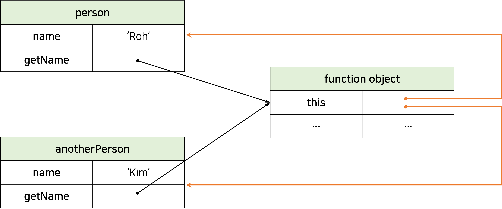

<br/>

프로토타입 메서드 내부에서 사용된 `this`도 일반 메서드와 마찬가지로 <ins>해당 메서드를 호출한 객체에 바인딩</ins>된다.

```js
function Person(name) {
  this.name = name;
}

Person.prototype.getName = function () {
  return this.name;
};

const me = new Person("Roh");

// getName 메서드를 호출한 객체는 me다.
console.log(me.getName()); // Roh

Person.prototype.name = "Kim";

// getName 메서드를 호출한 객체는 Person.prototype이다.
console.log(Person.prototype.getName()); // Kim
```

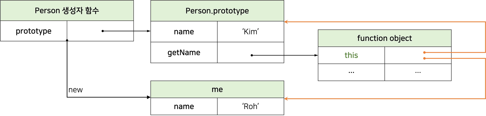

<br/>

## 생성자 함수 호출

생성자 함수 내부의 `this`에는 생성자 함수가 생성할 인스턴스가 바인딩된다.

```js
function Circle(radius) {
  // 생성자 함수 내부의 this는 생성자 함수가 생성할 인스턴스를 가리킨다.
  this.radius = radius;
  this.getDiameter = function () {
    return 2 * this.radius;
  };
}

const circle1 = new Circle(5);
const circle2 = new Circle(10);

console.log(circle1.getDiameter()); // 10
console.log(circle2.getDiameter()); // 20
```

<br/>

## Function.prototype.apply / call 메서드

`apply`, `call`, `bind` 메서드는 `Function.prototype`의 메서드다. 따라서, 이 메서드들은 모든 함수가 상속받아 사용할 수 있다.

`Function.prototype.apply`, `Function.prototype.call`메서드는 **this로 사용할 객체**와 **인수리스트**를 인수로 전달받아 함수를 호출한다.

두 메서드의 기능은 같지만 apply 메서드는 인수를 배열로 묶어서 전달하고 call 메서드는 인수를 쉼표로 구분한 리스트 형식으로 전달한다.

```js
/*
* this 바인딩과 인수 리스트 배열을 사용하여 함수를 호출한다.
* @param thisArg -> this로 사용할 객체
* @param argsArray -> 함수에게 전달할 인수 리스트 배열(또는 유사배열객체)
*/
func.apply(thisArg[, argsArray])
```

```js
/*
* this 바인딩과 ,로 구분된 인수 리스트를 사용하여 함수를 호출한다.
* @parma thisArg -> this로 사용할 객체
* @param arg1, arg2, ... -> 함수에게 전달할 인수 리스트
*/
func.call(thisArg[, arg1[, arg2[, ...]]])
```

**_appy와 call 메서드의 본질적인 기능은 함수를 호출하는 것이다._** `apply`와 `call` 메서드는 함수를 호출하면서 첫 번째 인수로 전달한 특정 객체를 호출한 함수의 `this`로 바인딩한다.

apply와 call 메서드는 호출할 함수에 인수를 전달하는 방식만 다를뿐 동일하게 동작한다.

- **apply 메서드**는 호출할 함수의 인수를 **배열로 전달**한다.
- **call 메서드**는 호출할 함수의 인수를 **쉼표로 구분한 리스트 형식으로 전달**한다.

<br/>

```js
function getThisBinding() {
  console.log(arguments);
  console.log(this);
}

// this로 사용할 객체
const thisArg = { a: 1 };

getThisBinding.apply(thisArg, [1, 2, 3]);
// Arguments(3) [1, 2, 3, callee: ƒ, Symbol(Symbol.iterator): ƒ]
// {a: 1}

getThisBinding.call(thisArg, 1, 2, 3);
// Arguments(3) [1, 2, 3, callee: ƒ, Symbol(Symbol.iterator): ƒ]
// {a: 1}
```

`apply`와 `call` 메서드는 `arguments` 객체와 같은 유사 배열 객체에 배열 메서드를 사용하는 경우에 사용된다. `arguments` 객체는 배열이 아니기 때문에 배열 메서드를 사용할 수 없지만 `apply`, `call` 메서드를 이용하면 사용 가능하다.

```js
function convertArgsToArray() {
  console.log(arguments);

  // Array.prototype.slice를 인수 없이 호출하면 배열의 복사본을 생성한다.
  const arr = Array.prototype.slice.call(arguments);
  // const arr = Array.prototype.slice.apply(arguments);
  console.log(arr);

  return arr;
}

convertArgsToArray(1, 2, 3);
// [Arguments] { '0': 1, '1': 2, '2': 3 }
// [1, 2, 3]
```

<br/>

## Function.prototype.bind 메서드

`bind` 메서드는 apply와 call 메서드와 달리 <ins>함수를 호출하지 않고 this로 사용할 객체만 전달</ins>한다.

```js
function getThisBinding() {
  return this;
}

// this로 사용할 객체
const thisArg = { a: 1 };

console.log(getThisBinding.bind(thisArg)); // getThisBinding
// bind 메서드는 함수를 호출하지 않으므로 명시적으로 호출해야 한다.
console.log(getThisBinding.bind(thisArg)()); // { a: 1 }
```

`bind` 메서드는 메서드의 `this`와 메서드 내부의 중첩 함수 또는 콜백 함수의 `this`가 불일치하는 문제를 해결하기 위해 유용하게 사용된다.

```js
const person = {
  name: "Roh",
  foo(callback) {
    // bind 메서드로 callback 함수 내부의 this 바인딩을 전달
    setTimeout(callback.bind(this), 100);
  },
};

person.foo(function () {
  console.log(`Hi! My name is ${this.name}`); // Hi! My name is Roh
});
```

<br/><br/>

# 정리

| **함수 호출 방식**                                         | **this 바인딩**                                                        |
| ---------------------------------------------------------- | ---------------------------------------------------------------------- |
| 일반 함수 호출                                             | 전역 객체                                                              |
| 메서드 호출                                                | 메서드를 호출한 객체                                                   |
| 생성자 함수 호출                                           | 생성자 함수가 생성할 인스턴스                                          |
| Function.prototype.apply/call/bind 메서드에 의한 간접 호출 | Function.prototype.apply/call/bind 메서드에 첫 번째 인수로 전달한 객체 |
