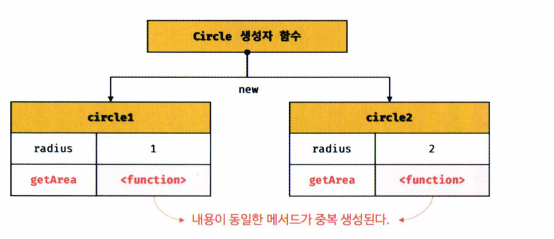
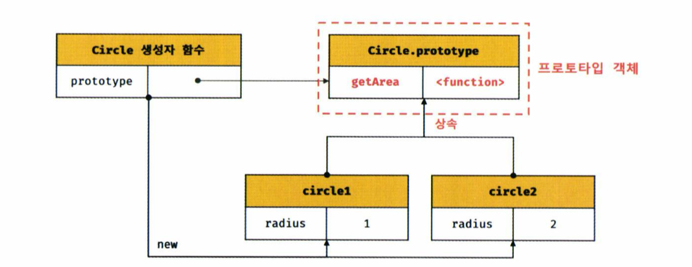
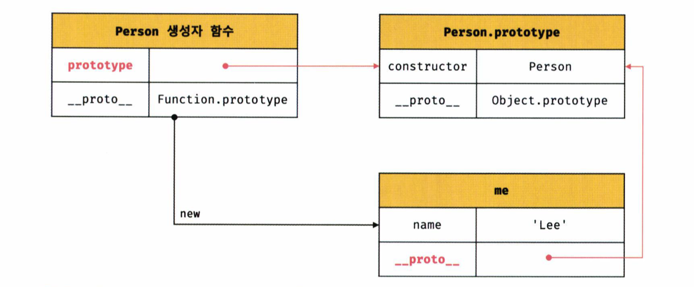
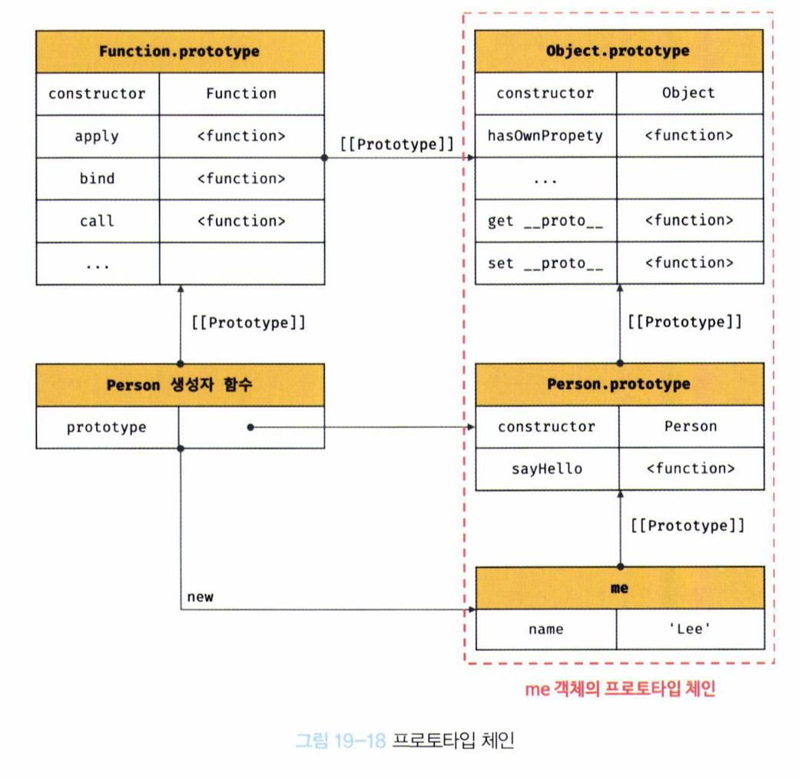

# 프로토타입

자바스크립트에 대한 설명을 우선 해보겠습니다.

- 멀티 패러다임 언어
  자바스크립트는 명령형, 함수형, 프로토타입 기반 객체지향 프로그래밍을 지원하는 멀티 패러다임 언어입니다.
- 프로토타입 기반 객체지향
  자바스크립트는 클래스 기반 언어(C++, 자바 등)와 달리, 프로토타입을 통해 상속과 캡슐화를 구현합니다. public, private 같은 접근 제어자가 없어 객체지향 언어가 아니라고 오해할 수 있지만, 실제로는 강력한 객체지향 기능을 제공합니다.
- ES6 클래스
  ES6에서 도입된 클래스는 단순히 **문법적 설탕(Syntactic Sugar)** 일 뿐, 실제로는 프로토타입을 기반으로 동작합니다. 즉, 클래스는 기존 객체 생성 방식의 편리한 표현입니다.
- 자바스크립트의 객체
  자바스크립트는 원시 타입(숫자, 문자열 등)을 제외한 거의 모든 값이 객체입니다. 객체 리터럴, 생성자 함수, Object.create() 등을 통해 다양한 방식으로 객체를 생성할 수 있습니다.
- 객체지향 요소
  자바스크립트는 캡슐화, 상속, 다형성 같은 객체지향 프로그래밍의 주요 요소를 프로토타입 체계를 통해 지원합니다.

## 객체지향 프로그래밍

- 객체지향 프로그래밍은 프로그램을 독립적인 단위(객체)의 집합으로 구성하는 패러다임입니다.
- 각 객체는 속성(attribute/property)과 이를 다루는 함수(메서드)를 가지며, 이를 통해 객체의 상태와 동작을 표현합니다.

### 추상화와 속성

- 현실의 사물을 객체로 표현할 때 모든 속성을 포함하지 않고, 특정 속성만을 추출하여 표현합니다. 이를 추상화라고 합니다.
- 예시: 이름과 주소 속성만을 가진 객체 person을 만들고, 이를 통해 사람의 특정 속성만을 나타낼 수 있습니다.

### 객체의 상태와 동작

- 객체는 상태(state)를 나타내는 데이터와 동작(behavior)을 조작할 수 있는 메서드(method)를 가집니다.
- 객체지향 프로그래밍에서는 객체의 상태와 동작을 하나의 논리적 단위로 묶어 복합적인 자료구조로 사용합니다.

### 객체 간의 관계와 메시지 전달

- 객체는 자신의 상태를 다른 객체와 상호작용하거나 메서드를 호출함으로써 조작할 수 있습니다.
- 다른 객체와의 관계나 메시지 전달을 통해 객체의 동작을 유기적으로 연결할 수 있습니다.

## 상속과 프로토타입

### 상속(Inheritance)이란?

- 객체지향 프로그래밍의 핵심 개념으로, 한 객체가 다른 객체의 속성이나 메서드를 물려받아 사용할 수 있게 해주는 기능입니다.
- 상속을 통해 코드의 중복을 줄이고, 기존 코드의 재사용성을 높일 수 있습니다.

### 문제점: 생성자 함수의 중복



- 예제에서 Circle 생성자 함수는 모든 인스턴스가 동일한 getArea 메서드를 개별적으로 생성합니다.
- 이렇게 되면 모든 인스턴스가 메서드를 따로 가지게 되어 메모리 낭비와 성능 저하를 초래할 수 있습니다.

### 해결 방법: 프로토타입을 통한 상속



- 자바스크립트는 프로토타입 체계를 사용해 상속을 구현합니다.
- Circle.prototype에 getArea 메서드를 정의하면, 생성된 모든 인스턴스가 이 메서드를 공유하여 중복 생성 문제를 해결할 수 있습니다.

### 상속의 장점

- 코드 재사용: 공통된 메서드를 프로토타입에 정의하여 모든 인스턴스에서 공유.
- 메모리 절약: 중복된 메서드가 인스턴스마다 개별적으로 생성되지 않음.
- 유지보수 용이: 메서드를 프로토타입에 한 번만 정의해도 되므로, 코드 변경 시 모든 인스턴스에 적용 가능.

## 프로토타입(Prototype)이란?

- 프로토타입은 객체지향 프로그래밍에서 객체 간 상속을 구현하기 위해 사용됩니다.
- 객체는 자신의 프로토타입을 통해 상위(부모) 객체의 속성과 메서드를 사용할 수 있습니다.
- 모든 객체는 [[Prototype]]이라는 내부 슬롯을 가지고 있으며, 객체 생성 방식에 따라 이 프로토타입이 결정됩니다.

### 프로토타입과 생성자 함수의 관계

- 객체 리터럴로 생성된 객체는 Object.prototype을 프로토타입으로 갖습니다.
- 생성자 함수로 생성된 객체는 해당 생성자 함수의 prototype 속성을 프로토타입으로 가집니다.
- 모든 프로토타입 객체는 constructor 프로퍼티를 가지고 있으며, 이 프로퍼티는 해당 프로토타입을 생성한 생성자 함수를 참조합니다.

### **proto** 접근자 프로퍼티

- **proto** 는 객체의 프로토타입에 간접적으로 접근할 수 있게 해주는 접근자 프로퍼티입니다.
- 객체의 **proto** 를 통해 자신의 프로토타입에 접근하거나, 다른 객체의 프로토타입을 참조할 수 있습니다.
- ES6부터는 Object.getPrototypeOf()와 Object.setPrototypeOf() 메서드를 사용하여 **proto**를 대신하도록 권장합니다.

### 프로토타입 체인

- 객체는 프로토타입 체인을 따라가며 상위 객체의 속성과 메서드에 접근합니다.
- 만약 객체 자체에 원하는 속성이나 메서드가 없으면, 프로토타입 체인을 따라 상위 객체로 탐색이 이어집니다.

### 프로토타입과 상속

- 프로토타입을 통해 객체는 다른 객체의 속성과 메서드를 상속받아 사용할 수 있습니다.
- prototype 속성을 사용해 생성자 함수에서 상속을 구현하면, 여러 인스턴스가 동일한 메서드를 공유하게 되어 메모리 효율성이 증가합니다.

### 생성자 함수와 prototype



- 생성자 함수는 객체를 생성할 때 해당 객체의 프로토타입을 자동으로 설정해 줍니다.
- 생성된 객체는 **proto** 를 통해 생성자 함수의 prototype 객체에 연결됩니다.

## 리터럴 표기법에 의한 객체 생성 간단 정리

### 리터럴 표기법이란?

- 자바스크립트에서 객체, 함수, 배열, 정규 표현식 등을 생성할 때 사용하는 간단한 문법입니다.
- 리터럴 표기법을 사용하여 생성된 객체도 프로토타입을 가지며, constructor 프로퍼티를 통해 생성자 함수와 연결됩니다.

### 리터럴 표기법과 생성자 함수의 관계

- 리터럴 표기법으로 생성된 객체는 Object 생성자 함수의 Object.prototype을 프로토타입으로 갖습니다.
- 예를 들어, {}로 생성된 객체는 Object 생성자 함수의 프로토타입을 상속받고, []로 생성된 배열은 Array.prototype을 상속받습니다.

### 생성자 함수와 연결

- 리터럴 표기법으로 생성된 객체는 내부적으로 생성자 함수를 호출한 것과 동일한 특성을 갖습니다.
- 객체 리터럴({})은 Object, 함수 리터럴(function() {})은 Function, 배열 리터럴([])은 Array 생성자 함수와 연결됩니다.

### 리터럴 표기법의 특징

- 리터럴 표기법으로 생성된 객체는 별도의 생성자 함수를 호출하지 않아도 생성됩니다.
- 리터럴 표기법으로 생성된 객체도 constructor 프로퍼티를 통해 생성자 함수와 연결되므로, 생성자 함수로 생성된 객체와 본질적으로 동일합니다.

### 리터럴 표기법의 종류

- 객체 리터럴: {}로 생성되며, Object.prototype을 프로토타입으로 가집니다.
- 함수 리터럴: function으로 생성되며, Function.prototype을 프로토타입으로 가집니다.
- 배열 리터럴: []로 생성되며, Array.prototype을 프로토타입으로 가집니다.
- 정규 표현식 리터럴: /pattern/flags로 생성되며, RegExp.prototype을 프로토타입으로 가집니다.

### 리터럴 표기법과 생성자 함수 비교

- 리터럴 표기법으로 생성된 객체와 생성자 함수로 생성된 객체는 생성 과정에서는 차이가 있지만, 결과적으로 동일한 특성을 가집니다.
- 리터럴 표기법으로 생성된 객체도 프로토타입 체인을 따라 생성자 함수의 프로토타입을 상속받게 됩니다.

## 프로토타입의 생성 시점 정리

### 프로토타입과 생성자 함수의 관계

- 객체는 리터럴 표기법 또는 생성자 함수에 의해 생성됩니다.
- 모든 객체는 생성될 때 특정 생성자 함수의 prototype 객체를 상속받아 프로토타입 체인이 연결됩니다.

### Object.create와 클래스에 의한 객체 생성

- Object.create 메서드를 사용하면 프로토타입을 명시적으로 지정하여 객체를 생성할 수 있습니다.
- 클래스 문법으로 생성된 객체는 클래스의 prototype을 상속받습니다.

### 프로토타입의 생성 시점

- 프로토타입은 생성자 함수가 생성되는 시점에 함께 생성됩니다.
- 즉, 생성자 함수와 프로토타입 객체는 단독으로 존재할 수 없으며 언제나 쌍으로 존재합니다.

### 사용자 정의 생성자 함수의 프로토타입 생성 시점

- 사용자가 직접 정의한 생성자 함수는 함수가 평가될 때 프로토타입 객체도 함께 생성됩니다.
- constructor 속성을 가진 함수가 정의되면, 해당 함수는 인스턴스를 생성할 수 있는 생성자 함수가 됩니다.

### 빌트인 생성자 함수와 프로토타입 생성 시점

- 자바스크립트의 기본 객체(Object, Array, Function 등)의 생성자 함수는 자바스크립트 엔진이 실행될 때 미리 생성됩니다.
- 빌트인 객체들은 Object.prototype, Array.prototype과 같은 자체 프로토타입 객체를 가지며, 이들 역시 엔진 실행 시점에 생성됩니다.

### 전역 객체의 프로토타입

- 전역 객체(window 객체 등)는 자바스크립트 코드가 실행되기 이전 단계에서 미리 생성된 객체로, 클라이언트와 서버 환경에 따라 다르게 정의될 수 있습니다.
- 전역 객체의 prototype도 엔진에 의해 생성되며, 이후 생성되는 모든 객체는 이 프로토타입을 상속받습니다.

## 객체 생성 방식과 프로토타입의 결정 간단 정리

### 객체 생성 방식 자바스크립트에서는 다음과 같은 다양한 방식으로 객체를 생성할 수 있습니다

- 객체 리터럴 ({})
- Object 생성자 함수 (new Object())
- 사용자 정의 생성자 함수 (function Person())
- Object.create() 메서드
- ES6 클래스 (class)

### 프로토타입의 결정

- 객체가 생성될 때, 각 방식마다 객체의 프로토타입이 결정됩니다.
- 자바스크립트 엔진은 객체를 생성할 때 OrdinaryObjectCreate라는 추상 연산을 통해 객체를 생성하고, 이때 객체의 프로토타입이 결정됩니다.
- 예를 들어, 객체 리터럴로 생성된 객체의 프로토타입은 Object.prototype입니다.

### 객체 리터럴에 의해 생성된 객체의 프로토타입

- 객체 리터럴 {}로 생성된 객체는 Object.prototype을 프로토타입으로 가집니다.
- Object.prototype은 객체가 가지는 기본적인 속성과 메서드(constructor, hasOwnProperty 등)를 포함하고 있습니다.

### Object 생성자 함수에 의해 생성된 객체의 프로토타입

- new Object()로 생성된 객체도 Object.prototype을 프로토타입으로 가지며, 객체 리터럴로 생성된 객체와 동일한 구조를 가집니다.

### 생성자 함수에 의해 생성된 객체의 프로토타입

- 생성자 함수와 함께 new 키워드를 사용하여 객체를 생성하면, 해당 생성자 함수의 prototype 속성이 생성된 객체의 프로토타입이 됩니다.
- 예를 들어, Person 생성자 함수로 생성된 객체의 프로토타입은 Person.prototype입니다.

### 프로토타입의 확장과 상속

- 생성자 함수의 prototype 객체에 새로운 메서드를 추가하면, 생성된 모든 객체가 이 메서드를 상속받아 사용할 수 있습니다.
- 예를 들어, Person.prototype에 sayHello 메서드를 추가하면, Person으로 생성된 모든 객체가 이 메서드를 사용할 수 있습니다.

### 클래스와 프로토타입

- ES6의 클래스 문법으로 생성된 객체도 내부적으로는 생성자 함수의 prototype을 상속받습니다.
- 클래스의 prototype을 확장하면, 해당 클래스로 생성된 모든 객체가 이를 상속받습니다.

## 프로토타입 체인 간단 정리

### 프로토타입 체인(Prototype Chain)이란?



- 자바스크립트에서 객체는 다른 객체를 자신의 프로토타입으로 참조할 수 있습니다.
- 이러한 참조 관계가 체인처럼 연결되어 있는 구조를 프로토타입 체인이라고 합니다.
- 객체의 프로퍼티나 메서드에 접근할 때, 해당 객체에 없으면 프로토타입 체인을 따라 상위 객체를 탐색합니다.

### 프로토타입 체인의 예시

- 예제에서 Person 생성자 함수의 인스턴스 me는 Person.prototype을 프로토타입으로 가집니다.
- Person.prototype은 다시 Object.prototype을 프로토타입으로 가지므로, me 객체는 Object.prototype의 메서드(hasOwnProperty 등)를 사용할 수 있습니다.

### 프로토타입 체인의 탐색

- 객체의 프로퍼티를 검색할 때, 자바스크립트 엔진은 객체의 프로토타입 체인을 따라 탐색합니다.
- 예를 들어, me.hasOwnProperty('name')을 호출하면 me 객체에서 hasOwnProperty 메서드를 찾고, 없으면 Person.prototype에서 찾습니다. 만약 Person.prototype에도 없으면 Object.prototype까지 탐색합니다.

### 프로토타입 체인의 최종점

- 모든 객체의 프로토타입 체인의 최종점은 Object.prototype입니다.
- Object.prototype의 프로토타입은 null이며, 더 이상 상위 객체가 없음을 의미합니다.

### 프로토타입 체인의 예제 분석

```
function Person(name) {
  this.name = name;
}

Person.prototype.sayHello = function () {
  console.log(`Hi! My name is ${this.name}`);
};

const me = new Person('Lee');
console.log(me.hasOwnProperty('name')); // true
console.log(Object.getPrototypeOf(me) === Person.prototype); // true
console.log(Object.getPrototypeOf(Person.prototype) === Object.prototype); // true
```

- me 객체는 Person.prototype을 상속받아 sayHello 메서드를 사용할 수 있습니다.
- 또한, Person.prototype은 Object.prototype을 상속받아 hasOwnProperty 메서드를 사용할 수 있습니다.

### 프로토타입 체인의 역할

- 프로토타입 체인은 객체 간 상속 관계를 정의하고, 객체의 속성이나 메서드를 찾기 위한 탐색 경로를 제공합니다.
- 프로토타입 체인은 자바스크립트의 객체지향 프로그래밍을 지원하는 핵심 메커니즘입니다.

### 스코프 체인과의 차이점

- 프로토타입 체인은 객체 간의 상속을 구현하기 위한 메커니즘입니다.
- 스코프 체인은 변수나 함수의 유효 범위를 결정하고, 식별자를 검색하기 위한 메커니즘입니다.
- 두 체인은 서로 독립적이지만, 협력하여 식별자와 프로퍼티를 검색할 때 사용됩니다.

## 오버라이딩과 프로퍼티 섀도잉

### 오버라이딩(Overriding)

- 자바스크립트에서 오버라이딩은 상위 클래스나 프로토타입에 정의된 메서드나 프로퍼티를 하위 클래스나 객체에서 재정의하는 것을 의미합니다.
- 예를 들어, Person.prototype.sayHello 메서드를 me 객체에서 다시 정의하여 기존 메서드를 덮어씁니다.

```
Person.prototype.sayHello = function () {
  console.log(`Hi! My name is ${this.name}`);
};

const me = new Person('Lee');
me.sayHello = function () {
  console.log(`Hey! My name is ${this.name}`);
};

me.sayHello(); // Hey! My name is Lee
```

- 위 코드에서 me 객체는 Person.prototype.sayHello를 덮어쓴(오버라이딩) sayHello 메서드를 사용합니다.

### 프로퍼티 섀도잉(Property Shadowing)

- 프로퍼티 섀도잉은 객체의 프로퍼티가 프로토타입 체인의 상위 프로퍼티를 덮어써서 가리는 현상을 의미합니다.
- 하위 객체에 같은 이름의 프로퍼티가 존재할 때, 상위 객체의 프로퍼티는 접근할 수 없습니다

```
const me = new Person('Lee');
me.sayHello = function () {
  console.log(`Hey! My name is ${this.name}`);
};

delete me.sayHello; // 하위 객체의 메서드 삭제
me.sayHello(); // Hi! My name is Lee (프로토타입의 메서드가 호출됨)
```

- 하위 객체의 sayHello 메서드를 삭제하면, 다시 상위 객체(프로토타입)의 sayHello 메서드가 호출됩니다.

### 오버라이딩과 프로퍼티 섀도잉의 차이점

- 오버라이딩은 상위 프로토타입 메서드나 프로퍼티를 하위 객체에서 재정의하는 것을 의미합니다.
- 프로퍼티 섀도잉은 하위 객체가 같은 이름의 프로퍼티를 가짐으로써 상위 프로퍼티를 덮어쓰는(섀도잉) 현상입니다.

### 프로토타입의 메서드 삭제

- 하위 객체에서 프로토타입의 메서드를 삭제하려고 하면 삭제되지 않습니다.
- 프로토타입 체인에서 하위 객체가 아닌 프로토타입에 직접 접근하여 삭제해야 합니다.

```
delete Person.prototype.sayHello; // 프로토타입 메서드 삭제
me.sayHello(); // TypeError: me.sayHello is not a function
```

- 오버라이딩: 상위 프로토타입의 메서드를 하위 객체에서 재정의.
- 프로퍼티 섀도잉: 하위 객체의 프로퍼티가 상위 프로퍼티를 가림.
- 프로퍼티 삭제 시, 프로토타입 체인을 통해 상위 프로퍼티에 접근하여 삭제해야 함.

## 프로토타입 교체란?

프로토타입 교체는 생성자 함수의 prototype 프로퍼티를 다른 객체로 변경하여 인스턴스가 새로운 프로토타입을 참조하도록 하는 것입니다. 프로토타입은 객체 간의 상속 관계를 결정하는 중요한 요소이며, 이를 교체함으로써 인스턴스의 프로토타입 체인을 변경할 수 있습니다.

### 생성자 함수에 의한 프로토타입의 교체

- 생성자 함수의 prototype 프로퍼티는 기본적으로 생성자 함수가 생성할 객체의 프로토타입이 됩니다.
- 생성자 함수의 prototype을 다른 객체 리터럴로 교체하면, 새로운 객체의 **proto** 는 교체된 객체를 참조하게 됩니다.
- 교체된 객체 리터럴에는 constructor 프로퍼티가 존재하지 않기 때문에, 프로토타입 체인이 깨질 수 있습니다.
- 예제 19-40과 19-41에서는 Person.prototype을 객체 리터럴로 교체하여 기존의 constructor 프로퍼티와의 연결이 끊어지는 상황을 보여주고 있습니다. 이로 인해 me.constructor를 조회하면 Person이 아닌 Object를 반환하게 됩니다.

### 9.9.2 인스턴스에 의한 프로토타입의 교체

- 이미 생성된 객체의 프로토타입을 변경할 때 Object.setPrototypeOf 메서드를 사용합니다.
- 이렇게 변경된 프로토타입은 기존의 생성자 함수와의 연결을 유지하지 않기 때문에, 생성자 함수의 prototype 프로퍼티와는 다른 프로토타입 체인을 가지게 됩니다.
- 예제 19-43에서는 Object.setPrototypeOf를 사용하여 me 객체의 프로토타입을 새로운 객체 parent로 교체하고, me의 sayHello 메서드를 통해 변경된 프로토타입이 올바르게 동작함을 보여줍니다.

### 프로토타입 교체 시 주의점

- 생성자 함수의 prototype을 객체 리터럴로 교체할 경우, constructor 프로퍼티와의 연결이 깨져서 의도한 생성자 함수가 아닌 Object를 가리키게 될 수 있습니다. 이 경우 constructor 프로퍼티를 명시적으로 추가해주어야 합니다.
- 이미 생성된 객체의 프로토타입을 교체할 때 Object.setPrototypeOf 메서드를 사용하면, 상속 관계가 동적으로 변하게 되므로 코드의 복잡도가 증가할 수 있습니다.

## instanceof 연산자

instanceof 연산자는 좌변에 있는 객체가 우변에 있는 생성자 함수의 prototype에 바인딩된 객체를 프로토타입 체인 상에서 찾을 수 있는지를 판별합니다. 만약 찾을 수 있다면 true를 반환하고, 찾을 수 없다면 false를 반환합니다.

```
object instanceof ConstructorFunction
```

- object: 검사할 인스턴스 객체
- ConstructorFunction: 생성자 함수 또는 그 함수의 프로토타입이 될 객체

### 예제 코드 분석

```
function Person(name) {
  this.name = name;
}

const me = new Person('Lee');
console.log(me instanceof Person); // true
console.log(me instanceof Object); // true
```

- me 객체는 Person 생성자 함수로 생성되었으므로 me instanceof Person은 true가 됩니다.
- 모든 객체는 Object의 인스턴스이므로 me instanceof Object 또한 true가 됩니다.

### 프로토타입 교체 후의 instanceof

```
const parent = {};
Object.setPrototypeOf(me, parent);

console.log(me instanceof Person); // false
console.log(me instanceof Object); // true
```

me 객체의 프로토타입을 parent로 변경했기 때문에, me instanceof Person은 false를 반환합니다.
하지만 me는 여전히 Object의 인스턴스이므로 me instanceof Object는 true로 평가됩니다.

### instanceof의 동작 원리

instanceof 연산자는 다음과 같은 방식으로 동작합니다

- instanceof는 객체의 프로토타입 체인을 따라가면서, 우변에 있는 생성자 함수의 prototype과 동일한 객체가 존재하는지 확인합니다.
- 만약 존재한다면 true, 존재하지 않으면 false를 반환합니다.

instanceof 연산자와 constructor 프로퍼티의 차이점

- instanceof는 객체의 프로토타입 체인을 통해 평가하기 때문에, constructor 프로퍼티가 변경되더라도 instanceof의 결과에는 영향을 주지 않습니다.
- constructor는 객체를 생성할 때 자동으로 설정되지만, 프로토타입을 교체하거나 명시적으로 constructor를 설정하지 않으면 올바르지 않은 값을 가질 수 있습니다.

## 직접 상속

직접 상속은 기존 객체를 복제하거나 특정 객체의 프로토타입 체인을 따라 상속 구조를 명확하게 설정할 때 유용하게 사용됩니다. JavaScript에서 객체를 직접 상속받는 방법에는 여러 가지가 있지만, Object.create 메서드를 사용하는 것이 가장 일반적입니다.

### Object.create에 의한 직접 상속

Object.create 메서드는 명시적으로 프로토타입을 지정하여 새로운 객체를 생성합니다. 이는 new 키워드를 사용하여 객체를 생성하는 방식과는 다르며, ES6 이후 class를 사용한 방식보다 더 명확하게 프로토타입 체인을 설정할 수 있습니다.

```
let obj = Object.create(prototype, propertiesObject);
```

- prototype: 생성할 객체의 프로토타입으로 지정할 객체
- propertiesObject: 생성할 객체의 프로퍼티 키와 디스크립터 객체로 이루어진 객체 (선택 사항)

이 메서드는 OrdinaryObjectCreate라는 내부 함수를 호출하여 객체를 생성합니다. 이를 통해 생성된 객체는 명시적으로 지정된 프로토타입을 가집니다.

### Object.create의 예제 코드 분석

Object.create를 이용한 객체 생성

```
let obj = Object.create(null);
console.log(Object.getPrototypeOf(obj) === null); // true
```

Object.create(null)을 사용하면 프로토타입이 null인 객체를 생성합니다. 이 객체는 Object의 기본 프로퍼티나 메서드(toString, hasOwnProperty 등)를 상속받지 않습니다.

기본 Object를 프로토타입으로 지정한 경우

```
let obj = Object.create(Object.prototype);
console.log(Object.getPrototypeOf(obj) === Object.prototype); // true

```

Object.prototype을 프로토타입으로 설정하면, 생성된 객체는 일반 객체와 동일한 프로토타입 체인을 가집니다.

### 객체 리터럴을 프로토타입으로 지정한 경우

```
const myProto = { x: 10 };
let obj = Object.create(myProto);
console.log(obj.x); // 10
console.log(Object.getPrototypeOf(obj) === myProto); // true

```

myProto 객체를 프로토타입으로 지정하여, 해당 객체의 프로퍼티를 상속받는 새로운 객체를 생성합니다.

### 프로퍼티 디스크립터를 사용한 프로퍼티 정의

```
let obj = Object.create(Object.prototype, {
  y: {
    value: 20,
    writable: true,
    enumerable: true,
    configurable: true
  }
});
console.log(obj.y); // 20
```

Object.create의 두 번째 인수로 프로퍼티 디스크립터 객체를 전달하여, 객체의 프로퍼티를 정의할 수 있습니다. 이 방식을 사용하면 객체의 프로퍼티를 좀 더 정밀하게 설정할 수 있습니다.

### 객체 리터럴 내부에서 **proto**에 의한 직접 상속

```
const myProto = { x: 10 };
const obj = {
  y: 20,
  __proto__: myProto
};
console.log(obj.x, obj.y); // 10 20
console.log(Object.getPrototypeOf(obj) === myProto); // true
```

**proto** 접근자를 사용하여 객체 리터럴 내부에서 직접적으로 프로토타입을 설정할 수 있습니다. 이 방식은 Object.create를 사용하는 것보다 간결하지만, 프로토타입 체인을 명시적으로 표현하기에는 적합하지 않을 수 있습니다.

## 정적 프로퍼티/메서드

정적 프로퍼티와 메서드는 생성자 함수로 인스턴스를 생성하지 않고도 접근할 수 있는 프로퍼티/메서드를 의미합니다. 정적 프로퍼티와 메서드는 생성자 함수의 prototype 프로퍼티에 바인딩된 프로퍼티나 메서드가 아니라 생성자 함수 자체에 직접 바인딩된 프로퍼티와 메서드를 뜻합니다.

```
function Person(name) {
  this.name = name;
}

// 프로토타입 메서드
Person.prototype.sayHello = function () {
  console.log(`Hi! My name is ${this.name}`);
};

// 정적 프로퍼티
Person.staticProp = 'static prop';

// 정적 메서드
Person.staticMethod = function () {
  console.log('staticMethod');
};

const me = new Person('Lee');

// 정적 프로퍼티와 메서드 호출
Person.staticMethod(); // staticMethod

// 인스턴스에서 정적 프로퍼티/메서드 호출 불가
me.staticMethod(); // TypeError: me.staticMethod is not a function

```

- Person 생성자 함수의 prototype에 바인딩된 메서드 sayHello는 Person 생성자 함수로 생성된 인스턴스(me)가 참조할 수 있는 메서드입니다.
- Person.staticProp 및 Person.staticMethod는 Person 생성자 함수 자체에 바인딩된 정적 프로퍼티와 메서드로, 인스턴스를 생성하지 않고도 Person을 통해 직접 접근하여 사용할 수 있습니다.
- 정적 프로퍼티/메서드는 인스턴스가 접근할 수 없기 때문에, me.staticMethod()를 호출하려고 하면 에러가 발생합니다.

## 프로퍼티 열거

### for...in 문

for...in 문은 객체의 모든 열거 가능한 프로퍼티를 순회할 때 사용합니다. 여기에는 객체 자신이 가지는 프로퍼티뿐만 아니라 상속받은 프로토타입의 프로퍼티도 포함됩니다.

```
for (변수선언문 in 객체) {
  // ...
}
```

```
const person = {
  name: 'Lee',
  address: 'Seoul'
};

// for...in 문을 사용하여 person 객체의 프로퍼티를 순회합니다.
for (const key in person) {
  console.log(key + ': ' + person[key]);
}
// 출력 결과:
// name: Lee
// address: Seoul

```

- for...in 문은 객체의 모든 열거 가능한 프로퍼티를 순회하며, key에는 각 프로퍼티의 이름이 할당됩니다.
- 위 예제에서는 name과 address 프로퍼티가 순서대로 출력됩니다.

### for...in 문의 특징

프로토타입 체인 상의 모든 열거 가능한 프로퍼티를 포함

- for...in 문은 객체의 프로토타입 체인 상에 존재하는 열거 가능한 프로퍼티를 순회합니다. 만약 프로토타입에 toString과 같은 메서드가 추가되어 있다면, 이를 포함하여 순회합니다.
- 예제 19-65에서 toString 메서드는 기본적으로 enumerable: false로 설정되어 있으므로 for...in 문으로 열거되지 않습니다.
- Object.getOwnPropertyDescriptor를 사용하여 열거 가능 여부 확인

- Object.getOwnPropertyDescriptor 메서드를 사용하여 특정 프로퍼티의 열거 가능 여부를 확인할 수 있습니다.
- 예제 19-66에서는 Object.prototype에 존재하는 toString 메서드의 enumerable 값이 false로 설정되어 있음을 확인할 수 있습니다.

### for...in 문과 열거 속성

- for...in 문은 객체의 모든 열거 가능한 프로퍼티를 순회하며, 이때 상속받은 프로퍼티도 포함됩니다.
- 프로퍼티의 열거 가능 여부는 프로퍼티의 속성 중 enumerable 값에 따라 결정되며, false일 경우 for...in 문에서 제외됩니다.

### 배열과 for...in 문

배열에는 for...in 문 대신 for 문, forEach 메서드, for...of 문을 사용하는 것이 바람직합니다.

# strict mode

JavaScript의 문법을 엄격하게 적용하여 오류 발생 가능성을 줄이고 코드의 안정성을 높이기 위해 도입된 기능입니다. strict mode는 코드를 더 안전하게 작성할 수 있도록 돕는 "엄격 모드"로, 예상치 못한 오류를 사전에 방지하는 데 목적이 있습니다.

## 적용 방법

- 함수 또는 스크립트 전체에 "use strict"; 선언문을 추가하여 적용할 수 있습니다.
- ES6 이후의 모듈과 클래스에는 기본적으로 strict mode가 적용됩니다.

## 특징

- 명시적 변수 선언 요구: 선언되지 않은 변수에 값을 할당하려 할 경우 ReferenceError를 발생시킵니다. 이는 암묵적 전역 변수 생성을 방지하기 위함입니다.
- 오류 탐지 강화: 기존의 JavaScript에서는 발생하지 않던 오류를 strict mode에서는 탐지하여 오류를 더 잘 잡아냅니다.
- ESLint 같은 린트 도구와 연계: strict mode를 사용하는 것뿐만 아니라, ESLint 같은 도구를 사용하여 코드 작성 중 발생할 수 있는 문제를 미리 예방하고 코드를 정리할 수 있습니다.

## 엄격 모드의 장점

- 오류 감소: 코드를 작성하는 동안 더 많은 오류를 탐지하여 디버깅 시간을 줄일 수 있습니다.
- 최적화: JavaScript 엔진이 코드를 더 최적화할 수 있어 성능 개선에도 도움이 될 수 있습니다.
- 보안 향상: 일부 보안 취약점을 방지하고, 예상치 못한 동작을 방지하여 안전한 코드를 작성할 수 있습니다.

```
"use strict";
function foo() {
    x = 10;  // ReferenceError: x is not defined
}
foo();
```

x 변수가 선언되지 않았기 때문에 strict mode에서는 ReferenceError를 발생시킵니다. 이를 통해 암묵적 전역 변수를 방지하고 의도하지 않은 코드 실행을 막을 수 있습니다.

## Strict Mode 적용 방법

- strict mode를 적용하기 위해서는 코드의 전역 또는 함수의 선두에 'use strict';를 추가해야 합니다.
- 'use strict'; 선언이 위치한 스코프에만 strict mode가 적용됩니다.

### 전역 적용

```
'use strict';
function foo() {
    x = 10;  // ReferenceError: x is not defined
}
foo();
```

### 함수 내부 적용

```
function foo() {
    'use strict';
    x = 10;  // ReferenceError: x is not defined
}
foo();
```

### 적용 위치의 중요성

```
function foo() {
    x = 10;    // 오류가 발생하지 않음.
    'use strict';
}
foo();

```

'use strict';가 코드의 선두에 위치하지 않으면 strict mode로 인식되지 않아 예상했던 엄격한 규칙이 적용되지 않습니다.

## 전역에 Strict Mode를 적용하는 것을 피해야 하는 이유

### 스크립트 단위로 Strict Mode가 적용됨

- 전역에 'use strict';를 선언하면 해당 스크립트 파일 전체에 strict mode가 적용되며, 다른 스크립트에는 영향을 주지 않습니다.

```
<script>
    'use strict';
</script>
<script>
    x = 1;  // 에러가 발생하지 않음.
</script>

```

태그마다 strict mode가 독립적으로 적용되는 것을 볼 수 있습니다.

### Strict Mode 혼합 사용 시 문제점

- strict mode가 적용된 스크립트와 non-strict mode 스크립트를 혼용하면 오류를 발생시킬 수 있습니다.
- 특히 외부 라이브러리를 사용하는 경우, 해당 라이브러리가 non-strict 모드로 작성된 경우도 있기 때문에 전역에 strict mode를 적용하면 라이브러리와 충돌이 발생할 수 있습니다.

### 해결책: 즉시 실행 함수(IIFE)를 이용한 제한적 적용

이러한 문제를 방지하기 위해, strict mode를 적용할 코드 범위를 제한적으로 설정하는 것이 좋습니다.

```
(function () {
    'use strict';
    // Strict mode가 적용된 코드
})();
```

## 함수 단위로 strict mode를 적용하는 것을 피해야 하는 이유

- 함수 단위로 strict mode를 적용할 수 있지만, 특정 함수에만 strict mode를 적용하고 다른 함수는 non-strict mode로 두는 것은 비일관적입니다.
- 함수 단위로 strict mode를 적용하게 되면 해당 함수 내부와 외부 컨텍스트 간의 코드 실행 방식이 달라져 오류가 발생할 수 있습니다.

```
(function () {
    // non-strict mode
    var let = 10; // 오류가 발생하지 않음.
})();
```

위 코드는 non-strict mode에서 동작하며, var let = 10; 문장에서도 오류가 발생하지 않습니다.

```
function foo() {
    'use strict';
    let = 20;  // SyntaxError: Unexpected strict mode reserved word
}
foo();
```

- foo 함수 내부에 strict mode를 적용하였기 때문에, let을 변수명으로 사용하는 것은 문법 오류(SyntaxError)를 발생시킵니다.
- strict mode에서는 let과 같은 예약어를 변수명으로 사용할 수 없기 때문입니다.

## Strict Mode가 발생시키는 대표적인 오류

### 암묵적 전역 (ReferenceError)

strict mode에서는 선언되지 않은 변수에 값을 할당하려 할 경우 ReferenceError가 발생합니다.

```
(function () {
    'use strict';
    x = 1;  // ReferenceError: x is not defined
})();
```

암묵적으로 전역 변수가 생성되는 것을 방지하여 예기치 않은 오류를 사전에 차단합니다.

### 변수, 함수, 매개변수의 삭제 (SyntaxError)

trict mode에서는 delete 연산자를 사용하여 변수, 함수, 매개변수를 삭제하려 하면 SyntaxError가 발생합니다.

```
(function () {
    'use strict';
    var x = 1;
    delete x;  // SyntaxError: Delete of an unqualified identifier in strict mode.

    function foo(a) {
        delete a;  // SyntaxError: Delete of an unqualified identifier in strict mode.
    }
    delete foo;  // SyntaxError: Delete of an unqualified identifier in strict mode.
})();
```

매개변수 이름의 중복 (SyntaxError)

```
(function () {
    'use strict';
    function foo(x, x) {  // SyntaxError: Duplicate parameter name not allowed in this context
        return x + x;
    }
    console.log(foo(1, 2));
})();
```

중복된 매개변수 이름은 함수의 가독성과 유지보수를 어렵게 하므로, strict mode에서는 이를 금지하여 더 안전한 코드를 작성할 수 있게 합니다

## Strict Mode 적용에 의한 변화

### 일반 함수의 this 바인딩

- strict mode에서 일반 함수를 호출하면 this가 undefined로 바인딩됩니다. 이는 기존의 non-strict mode에서 this가 전역 객체(window 또는 global)에 바인딩되던 것과 다릅니다.

- strict mode에서는 의도치 않은 this 바인딩을 방지하기 위해 this를 undefined로 설정하며, 이를 통해 함수 내부에서의 오류를 예방할 수 있습니다.

```
(function () {
    'use strict';

    function foo() {
        console.log(this);  // undefined
    }
    foo();  // 일반 함수로 호출

    function Foo() {
        console.log(this);  // Foo
    }
    new Foo();  // 생성자 함수로 호출
})();
```

- foo() 함수는 일반 함수로 호출되었기 때문에 this는 undefined로 설정됩니다.

- 반면 Foo() 함수는 생성자 함수로 호출되었기 때문에 this는 새로 생성된 객체 Foo에 바인딩됩니다.

### arguments 객체의 변화

- strict mode에서는 매개변수에 전달된 인수를 재할당해도 arguments 객체에 반영되지 않습니다.
- 기존 non-strict mode에서는 arguments 객체가 함수의 매개변수와 연동되어 동작하여, 매개변수를 변경하면 arguments도 함께 변경되었습니다.

```
(function (a) {
    'use strict';
    // 매개변수에 전달된 인수를 재할당하여 변경
    a = 2;

    // 변경된 인수가 arguments 객체에 반영되지 않는다.
    console.log(arguments);  // { 0: 1, length: 1 }
})(1);
```

- 위 예제에서는 a에 전달된 값 1을 2로 변경하였지만, arguments 객체는 여전히 초기 인수 값 1을 유지하고 있습니다. strict mode에서는 arguments와 매개변수 간의 연동이 끊어져 있기 때문입니다.

# 빌트인 객체

자바스크립트 객체는 크게 세 가지로 분류됩니다.

표준 빌트인 객체

- ECMAScript 사양에 정의된 객체로, 애플리케이션 전역에서 사용할 수 있는 공통 기능을 제공합니다.
- 자바스크립트를 실행하는 환경(브라우저 또는 Node.js 환경)과 무관하게 사용할 수 있습니다.
- 예: Object, String, Number, Array, Function, Date, Math, RegExp, Promise 등

호스트 객체

- ECMAScript 사양에는 정의되어 있지 않지만, 자바스크립트를 실행하는 환경(브라우저 또는 Node.js 환경)에 추가되어 제공되는 객체입니다.
- 예: DOM, BOM, Canvas, XMLHttpRequest, fetch, Node.js의 fs, http 등의 API

사용자 정의 객체

- 사용자가 직접 정의한 객체로, 표준 빌트인 객체나 호스트 객체를 상속받아 새로운 기능을 추가할 수 있습니다.

## 표준 빌트인 객체

표준 빌트인 객체는 다음과 같은 특징을 가집니다.

- 생성자 함수로서 인스턴스 생성: 대부분의 표준 빌트인 객체는 생성자 함수로 호출하여 인스턴스를 생성할 수 있습니다.
- 프로토타입 메서드와 정적 메서드 제공: 각 빌트인 객체는 인스턴스 없이 호출 가능한 정적 메서드를 제공하며, 생성된 인스턴스는 프로토타입 메서드를 통해 객체의 속성을 다룰 수 있습니다.

### 프로토타입과 정적 메서드

- 표준 빌트인 객체는 생성자 함수로 생성된 객체의 프로토타입에 다양한 메서드를 제공합니다.

- 예를 들어, Number 객체는 Number.prototype.toFixed() 같은 프로토타입 메서드와 Number.isInteger() 같은 정적 메서드를 제공합니다.

Number 프로토타입 메서드 예시

```
const numObj = new Number(1.5);
console.log(numObj.toFixed());  // "2"
```

Number 정적 메서드 예시

```
console.log(Number.isInteger(1.5));  // false
```

## 원시값과 래퍼 객체의 개념

- 원시값 (Primitive Value): 자바스크립트에서 문자열, 숫자, 불리언 등과 같은 데이터 타입은 원시값으로 취급됩니다. 원시값은 객체가 아니며, 메서드를 가질 수 없습니다.
- 래퍼 객체 (Wrapper Object): 자바스크립트에서는 원시값을 객체처럼 다루기 위해 임시로 래퍼 객체를 생성합니다. 이 래퍼 객체는 String, Number, Boolean과 같은 생성자 함수를 통해 만들어지며, 원시값을 객체로 변환하여 메서드나 속성에 접근할 수 있게 해줍니다.

### 원시값을 객체처럼 다루는 이유

예제 21-04와 21-05에서 원시 타입인 문자열(str)이 객체처럼 동작하여 .length 속성이나 toUpperCase() 메서드를 사용할 수 있습니다. 이러한 현상은 자바스크립트 엔진이 원시값을 자동으로 래퍼 객체로 변환해주기 때문입니다.

```
const str = 'hello';
console.log(str.length);         // 5 (원시 타입 문자열이 객체처럼 동작)
console.log(str.toUpperCase());  // "HELLO"
```

### 래퍼 객체의 생성과 반환 과정

원시값에 대해 객체처럼 접근할 때, 자바스크립트 엔진은 다음의 과정을 수행합니다.

- 원시값을 래퍼 객체로 변환하여 임시 객체를 생성합니다.
- 래퍼 객체로 변환된 값은 메서드를 호출하거나 속성에 접근할 수 있습니다.
- 메서드 호출이나 속성 접근이 끝나면 래퍼 객체는 다시 원시값으로 되돌아갑니다.

```
const str = 'hello';
str.name = 'Lee';  // 래퍼 객체로 변환되어 name 속성 추가 시도
console.log(str.name);  // undefined (래퍼 객체가 다시 원시값으로 되돌아가면서 속성은 사라짐)
```

### 래퍼 객체의 프로토타입 체인

- 래퍼 객체는 각 타입의 생성자 함수(String, Number, Boolean)를 통해 생성됩니다.

- 생성된 래퍼 객체는 각 타입의 프로토타입(String.prototype, Number.prototype, Boolean.prototype)의 메서드를 상속받아 사용할 수 있습니다.

- 원시값이 래퍼 객체로 변환되었을 때의 프로토타입 체인은 다음과 같습니다.

```
String.prototype -> Object.prototype -> null
```

### 원시값의 래퍼 객체 생성 예시

문자열 래퍼 객체

```
const str = 'hi';
console.log(str.toUpperCase());  // "HI"
console.log(typeof str);         // string (원시값으로 되돌아감)
```

숫자 래퍼 객체

```
const num = 1.5;
console.log(num.toFixed());      // "2"
console.log(typeof num);         // number (원시값으로 되돌아감)
```

### 불리언, 심벌 래퍼 객체의 동작

- 불리언 값도 마찬가지로 원시값이지만, 메서드를 호출할 수 있을 때는 임시로 래퍼 객체로 변환됩니다.
- Symbol 타입은 ES6에서 도입된 원시 타입으로, 다른 원시 타입과 달리 리터럴 표기법으로 생성할 수 없고 Symbol() 함수를 통해 생성해야 합니다.

### 래퍼 객체 생성자 함수의 필요성

일반적으로 String, Number, Boolean 생성자 함수를 직접 호출하여 객체를 생성하는 것은 권장되지 않습니다. 이러한 생성자 함수는 임시 래퍼 객체를 자동으로 생성해주므로, 객체를 생성할 필요가 없기 때문입니다.

### 원시값의 예외: null과 undefined

null과 undefined는 래퍼 객체로 변환되지 않으며, 해당 값에 객체처럼 접근하려 할 경우 에러가 발생합니다.

# 전역 객체

## 전역 객체란?

- 전역 객체는 코드가 실행되기 이전 단계에서 자바스크립트 엔진에 의해 생성되는 최상위 객체입니다.
  모든 전역 변수와 전역 함수를 프로퍼티로 가지며, 자바스크립트 환경에 따라 이름이 다릅니다:
- 브라우저 환경: window
- Node.js 환경: global

**ECMAScript 11(ES11)** 부터는 globalThis로 모든 환경에서 사용할 수 있는 표준 전역 객체가 추가되었습니다.

## 전역 객체의 특징

- 표준 빌트인 객체(예: Object, String, Number, Function, Array, Date, Math 등)를 프로퍼티로 포함합니다.
- 호스트 객체(예: 브라우저의 DOM, BOM 또는 Node.js의 fs, http 같은 API)를 프로퍼티로 포함합니다.
- var 키워드로 선언한 전역 변수와 전역 함수는 전역 객체의 프로퍼티가 됩니다.
- let, const 키워드로 선언한 전역 변수는 전역 객체의 프로퍼티가 아니므로, window.foo와 같이 접근할 수 없습니다.

```
// 브라우저 환경
console.log(globalThis === this); // true
console.log(globalThis === window); // true

// Node.js 환경
console.log(globalThis === global); // true
```

```
console.log(window.parseInt('F', 16)); // 15
console.log(parseInt('F', 16)); // 15 (window.parseInt와 동일)
```

```
var foo = 1;
console.log(window.foo); // 1 (var로 선언한 전역 변수는 window의 프로퍼티가 됨)

let bar = 2;
console.log(window.bar); // undefined (let은 window의 프로퍼티가 아님)

```

```
const foo = 123;
console.log(window.foo); // undefined (const는 window의 프로퍼티가 아님)
```

## 빌트인 전역 프로퍼티

### Infinity

```
console.log(window.Infinity === Infinity); // true
console.log(Infinity * 2); // Infinity
```

### NaN

```
console.log(window.NaN); // NaN
console.log(Number('xyz')); // NaN
```

### undefined

```
var foo;
console.log(foo); // undefined
```

### 전역 객체 사용 시 주의 사항

- 전역 객체의 프로퍼티는 모든 스크립트 간에 공유되므로, 변수나 함수 이름 충돌의 위험이 있습니다.
- let이나 const로 선언한 전역 변수는 전역 객체의 프로퍼티가 아니므로, 이러한 차이를 이해하고 적절히 사용해야 합니다.
- eval() 함수는 보안 취약점 및 코드 최적화 방해 요인이 될 수 있으므로 사용하지 않는 것이 좋습니다.

