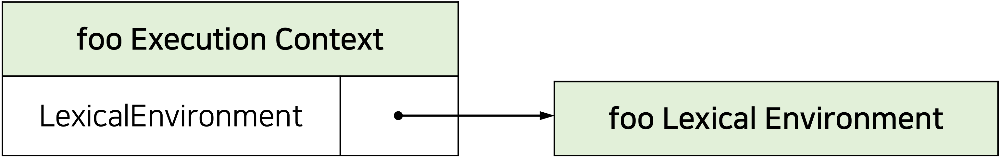
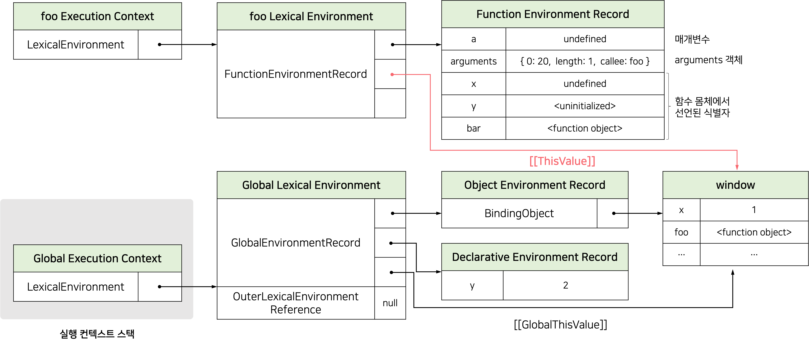

# Deep Dive Study - 5주차

<br/><br/><br/>

<h1 align="center">23.실행 컨텍스트</h1>

<br/>

**실행 컨텍스트(execution context)** 는 scope, hoisting, function, this, closure 등의 동작 원리를 담고 있는 자바스크립트의 핵심 원리이다.

<br/><br/>

# 소스코드의 타입

ECMAScript 사양은 소스코드를 4가지 타입으로 구분한다.

- 전역 코드(global code)
- 함수 코드(function code)
- eval 코드(eval code)
- 모듈 코드(module code)

소스코드를 4가지 타입으로 구분하는 이유는 소스코드 타입에 따라 실행 컨텍스트를 생성하는 과정과 관리 내용이 다르기 때문이다.

<br/><br/>

# 소스코드의 평가와 실행

자바스크립트 엔진은 소스코드를 **소스코드의 평가**와 **소스코드의 실행 과정**으로 나누어 처리한다.

소스코드 평가 과정에서는 실행 컨텍스트를 생성하고 변수, 함수 등의 <ins>선언문만 먼저 실행하여 생성된 변수나 함수 식별자를 키로 실행 컨텍스트가 관리하는 스코프(렉시컬 환경의 환경 레코드)에 등록</ins>한다.

소스코드 실행 과정(런타임)에서는 <ins>변수나 함수의 참조를 실행 컨텍스트가 관리하는 스코프에서 검색해서 취득</ins>한다. 그리고 변수 값의 변경 등 소스코드의 실행 결과는 다시 실행 컨텍스트가 관리하는 스코프에 등록된다.

<br/>

<div style="max-width: 350px; margin: 0 auto;" >


</div>

<br/>

### ☑️ 소스코드의 평가와 실행 예제

```js
var x;
x = 1;
```

소스코드 평가 과정에서 `var x;`를 실행한다. 이때 생성된 변수 식별자 x를 실행 컨텍스트가 관리하는 스코프에 등록되고 `undefined`로 초기화된다.

소스코드 실행 과정에서는 `x=1;`만 실행된다. 이때 `x` 변수에 값을 할당하려면 먼저 `x` 변수가 선언된 변수인지 확인해야한다(실행컨텍스트가 관리하는 스코프에 `x` 변수가 등록되어 있는지 확인한다). `x` 변수가 선언된 변수라면 값을 할당하고 할당 결과를 실행 컨텍스트에 등록하여 관리한다.

<br/><br/>

# 실행 컨텍스트의 역할

```js
// 전역 변수 선언
const x = 1;
const y = 2;

// 함수 정의
function foo(a) {
  const x = 10;
  const y = 20;

  console.log(a + x + y); // 130
}

// 함수 호출
foo(100);

// 메서드 호출
console.log(x + y); //3
```

<br/>

#### 1. 전역 코드 평가

전역 코드의 변수 선언문과 함수 선언문이 먼저 실행되고, 그결과 생성된 전역 변수와 전역 함수가 실행 컨텍스트가 관리하는 스코프에 등록된다.

이때 `var` 키워드로 선언된 전역 변수와 함수 선언문으로 정의된 전역 함수는 전역 객체의 프로퍼티와 메서드가 된다.

<br/>

#### 2. 전역 코드 실행

런타임이 시작되어 전역 코드가 순차적으로 실행된다. 이때 전역 변수에 값이 할당되고 함수가 호출된다.

함수가 호출되면 전역 코드의 실행을 일시 중단하고 함수 내부로 이동한다.

<br/>

#### 3. 함수 코드 평가

매개변수와 지역 변수 선언문이 먼저 실행되어 매개변수와 지역 변수가 실행 컨텍스트가 관리하는 지역 스코프에 등록된다.

`arguments` 객체가 생성되어 지역 스코프에 등록되고 `this` 바인딩도 결정된다.

<br/>

#### 4. 함수 코드 실행

런타임이 시작되어 함수 코드가 순차적으로 실행되기 시작한다. 이때 매개변수와 지역 변수에 값이 할당되고 `console.log` 메서드가 호출된다.

실행 컨텍스트는 소스코드를 실행하는 데 필요한 환경을 제공하고 코드의 실행 결과를 실제로 관리하는 영역이다.

**_실행 컨텍스트는 식별자(변수, 함수, 클래스 등의 이름)을 등록하고 관리하는 스코프와 코드 실행 순서 관리를 구현한 내부 메커니즘으로, 모든 코드는 실행 컨텍스트를 통해 실행되고 관리된다._**

**_식별자와 스코프는 실행 컨텍스트의 렉시컬 환경으로 관리하고 코드 실행 순서는 실행 컨텍스트 스택으로 관리한다._**

<br/><br/>

# 실행 컨텍스트 스택(Execution Context Stack)

자바스크립트 엔진은 코드를 평가하여 실행 컨텍스트를 생성한다. 그리고 함수가 호출되면 함수 코드를 평가하여 함수 실행 컨텍스트를 생성한다. 이때 생성된 실행 컨텍스트는 **스택(stack)** 자료구조로 관리된다. 이를 **실행 컨텍스트 스택(Execution Context Stack)**이라 한다.

실행 컨텍스트 스택은 코드의 실행 순서를 관리한다.

<ins>실행 컨텍스트 스택의 최상위에 존재하는 실행 컨텍스트는 언제나 현재 실행 중인 코드의 실행 컨텍스트</ins>이다.

따라서 실행 컨텍스트의 최상위에 존재하는 실행 컨텍스트를 **실행 중인 실행 컨텍스트(running execution context)** 라고 부른다.

<br/><br/>

# 렉시컬 환경(Lexical Environment)

**렉시컬 환경(Lexical Environment)** 은 식별자와 식별자에 바인딩된 값, 그리고 상위 스코프에 대한 참조를 기록하는 자료구조로 <ins>실행 컨텍스트를 구성하는 컴포넌트</ins>다.

**_렉시컬 환경은 스코프를 구분하여 식별자를 등록하고 관리하는 저장소 역할을 하는 렉시컬 스코프의 실체다._**

- 렉시컬 환경은 식별자를 키로 등록하고 식별자에 바인딩된 값을 관리한다.

<br/>

실행 컨텍스트는 Lexical Environment 컴포넌트와 Variable Environment 컴포넌트로 구성된다.

<div style="max-width: 400px; margin: 0 auto;" >


</div>

<br/>

Lexical Environment(렉시컬 환경)은 Environment Record와 Outer Lexical Environment Reference로 구성된다.

<div style="max-width: 350px; margin: 0 auto;" >


</div>

<br/>

#### ☑️ Environment Record(환경 레코드)

- 스코프에 포함된 **식별자**를 등록하고 식별자에 바인딩된 값을 관리하는 저장소다.
- 환경 레코드는 소스코드의 타입에 따라 관리하는 내용에 차이가 있다.

<br/>

#### ☑️ Outer Lexical Environment Reference(외부 렉시컬 환경에 대한 참조)

- **상위 스코프**를 가리킨다.
- 외부 렉시컬 환경에 대한 참조를 통해 **스코프 체인(scope chain)**을 구현한다.

<br/><br/>

# 실행 컨텍스트의 생성과 식별자 검색 과정

```js
var x = 1;
const y = 2;

function foo(a) {
  var x = 3;
  const y = 4;

  function bar(b) {
    const z = 5;
    console.log(a + b + x + y + z);
  }
  bar(10);
}

foo(20); // 42
```

<br/>

## 전역 객체 생성

<ins>전역 객체는 전역 코드가 평가되기 이전에 생성</ins>된다. 전역 객체도 Object.prototype을 상속받는다. 전역 객체도 프로토타입 체인의 일원이다.

<br/>

## 전역 코드 평가

### ☑️ 전역 코드 평가 순서

1. 전역 실행 컨텍스트 생성
2. 전역 렉시컬 환경 생성
   1. 전역 환경 레코드 생성
      1. 객체 환경 레코드 생성
      2. 선언적 환경 레코드 생성
   2. this 바인딩
   3. 외부 렉시컬 환경에 대한 참조 결정

<br/>

### 1. 전역 실행 컨텍스트 생성

비어 있는 전역 실행 컨텍스트를 실행 컨텍스트 스택에 푸시한다. 이때 전역 실행 컨텍스트는 **실행 중인 실행 컨텍스트(running execution context)** 가 된다.

<div style="max-width: 300px; margin: 0 auto;" >


</div>

<br/>

### 2. 전역 렉시컬 환경 생성

**전역 렉시컬 환경(Global Lexical Environment)** 을 생성하고 전역 실행 컨텍스트에 바인딩한다.

렉시컬 환경은 **Environment Record(환경 레코드)** 와 **Outer Lexical Environment Reference(외부 렉시컬 환경에 대한 참조)** 로 구성된다.

<div style="max-width: 400px; margin: 0 auto;" >


</div>

<br/>

### 2-1. 전역 환경 레코드 생성

**Global Environment Record(전역 환경 레코드)** 는 전역 변수를 관리하는 전역 스코프, 전역 객체의 빌트인 프로퍼티와 빌트인 전역함수, 표준 빌트인 객체를 제공한다.

전역 환경 레코드는 **Object Environment Record(객체 환경 레코드)** 와 **Declarative Environment Record(선언적 환경 레코드)** 로 구성되어 있다.

<br/>

### 2-1-1. 객체 환경 레코드 생성

객체 환경 레코드는 **BindingObject 객체**와 연결된다. <ins>BindingObject는 전역 객체 생성시 생성된 **전역 객체**다.</ins>

전역 코드 평가 과정에서 `var` 키워드로 선언한 **전역 변수**와 함수 선언문으로 정의된 **전역 함수**는 전역 환경 레코드의 객체 환경 레코드에 연결된 `BindingObject`를 통해 전역 객체의 프로퍼티와 메서드가 된다.

⭐⭐⭐ **_이것이 var 키워드로 선언한 전역 변수나 전역 함수가 전역 객체의 프로퍼티와 메서드가 되고, 식별자(window) 없이 전역 객체의 프로퍼티를 참조할 수 있는 메커니즘이다._**

<br/>

`var` 키워드로 선언한 변수 또는 함수 표현식은 전역 코드 평가 시점에 객체 환경 레코드에 바인딩된 `BindingObject`를 통해 전역 객체에 변수 식별자를 등록하고 암묵적으로 `undefined`를 바인딩한다.

⭐⭐⭐ **_이것이 변수 호이스팅이 발생하는 원인이다._**


<br/>

### 2-1-2. 선언적 환경 레코드 생성

`let`, `const` 키워드로 선언한 전역 변수는 선언적 환경 레코드에 등록되고 관리된다.

`let`, `const` 키워드로 선언한 전역 변수는 전역 객체의 프로퍼티가 되지 않고 전역 환경 레코드의 선언적 환경 레코드에 존재하게된다.

⭐⭐⭐ **_따라서 window.y와 같이 전역 객체의 프로퍼티로서 참조할 수 없다._**


<br/>

`let`, `const` 키워드로 선언한 변수는 선언 단계와 초기화단계가 분리되어 진행되는데, 런타임에 실행 흐름이 변수 선언문에 도달하기 전까지 **일시적 사각 지대(Temporal Dead Zone; TDZ)**에 빠지게 된다.

```js
let foo = 1;

{
  // let, const 키워드로 선언한 변수가 호이스팅이되지 않는다면 전역 변수를 참조해야 한다.
  // 하지만 let 키워드로 선언한 변수도 여전히 호이스팅이 발생하기 때문에
  // ReferenceError가 발생한다.
  console.log(foo);
  let foo = 2;
}
```

<br/>

### 2-2. this 바인딩

전역 환경 레코드의 `[[GlobalThisValue]]` 내부 슬롯에 `this`가 바인딩된다. 따라서 전연 코드에서 `this`를 참조하면 전역 환경 레코드의 `[[GlobalThisValue]]` 내부 슬롯에 바인딩되어 있는 객체가 반환된다.

일반적으로 전역 코드에서 this는 전역 객체를 가리키므로 전역 환경 레코드의 `[[GlobalThisValue]]` 내부 슬롯에는 전역 객체가 바인딩된다.


<br/>

### 2-3. 외부 렉시컬 환경에 대한 참조 결정

**Outer Lexical Environment Reference(외부 렉시컬 환경에 대한 참조)** 는 상위 스코프(현재 평가 중인 소스코드를 포함하는 외부 소스코드의 렉시컬 환경)를 가리킨다.

⭐⭐⭐ **_이를 통해 스코프 체인을 구현한다._**

<br/>

전역 코드를 포함하는 소스코드는 없으므로 전역 렉시컬 환경의 외부 렉시컬 환경에 대한 참조에 `null`이 할당된다. 이는 전역 렉시컬 환경이 스코프 체인의 종점에 존재함을 의미한다.


<br/>

## 전역 코드 실행

전역 코드가 순차적으로 실행되기 시작한다.

변수 할당문이 실행되어 전역 변수 x 에 값이 할당된다.

<br/>

> ✍🏻 **식별자 결정(identifier resolution)**
>
> 변수 또는 함수의 이름이 선언된 식별자인지 확인하고, 같은 이름의 식별자가 다른 스코프에 여러 개 존재할 수 있기 때문에 어느 스코프의 식별자를 참조해야 하는지 결정하는 것을 말한다.

<br/>

**식별자 결정**을 위해 식별자를 검색할 때는 실행 중인 실행 컨텍스트에서 식별자 검색을 시작한다. 만약 실행 중인 실행 컨텍스트의 렉시컬 환경에서 식별자를 검색할 수 없다면 외부 렉시컬 환경에 대한 참조가 가리키는 렉시컬 환경(**상위 스코프**)로 이동하여 식별자를 검색한다.

<br/>

## foo 함수 코드 평가

**foo 함수가 호출되면** 전역 코드의 실행을 일시 중단하고 foo 함수의 내부로 코드의 제어권이 이동한다.

<br/>

### ☑️ 함수 코드 평가 순서

1. 함수 실행 컨텍스트 생성
2. 함수 렉시컬 환경 생성
   1. 함수 환경 레코드 생성
   2. this 바인딩
   3. 외부 렉시컬 환경에 대한 참조 결정

<br/>

### 1. 함수 실행 컨텍스트 생성

`foo` 함수 실행 컨텍스트를 생성한다.

**_생성된 함수 실행 컨텍스트는 함수 렉시컬 환경이 완성된 다음(평가가 끝난 다음) 실행 컨텍스트 스택에 푸시된다._**

<br/>

### 2. 함수 렉시컬 환경 생성

`foo` 함수 렉시컬 환경을 생성하고 `foo` 함수 실행 컨텍스트에 바인딩한다.

<div style="max-width: 400px; margin: 0 auto;" >



</div>

<br/>

### 2-1. 함수 환경 레코드 생성

함수 렉시컬 환경을 구성하는 컴포넌트 중 하나인 **함수 환경 레코드(Function Environment Record)** 는 매개변수, `arguments` 객체, 함수 내부에서 선언한 **지역 변수**와 **중첩 함수**를 등록하고 관리한다.


<br/>

### 2-2. this 바인딩

함수 환경 레코드의 `[[ThisValue]]` 내부 슬롯에 `this`가 바인딩되는데, <ins>이는 함수 호출 방식에 따라 결정</ins>된다.

⭐⭐⭐ **_함수 내부에서 `this`를 호출하면 `[[ThisValue]]` 내부 슬롯에 바인딩되어 있는 객체가 반환된다._**

`foo` 함수는 일반 함수로 호출되었으므로 `this`는 전역 객체를 가리킨다.



<br/>

### 2-3. 외부 렉시컬 환경에 대한 참조 결정

<ins>함수의 외부 렉시컬 환경에 대한 참조에는 함수가 정의된 실행 컨텍스트의 렉시컬 환경의 참조가 할당</ins>된다.

`foo` 함수는 전역 스코프에 정의된 함수이다. 따라서 `foo` 함수의 외부 렉시컬 환경에 대한 참조에는 전역 렉시컬 환경의 참조가 할당된다.

자바스크립트 엔진은 함수 정의를 평가하여 함수 객체를 생성할 때 <ins>현재 실행 중인 실행 컨텍스트의 렉시컬 환경(함수의 상위 스코프)를 함수 객체의 내부 슬롯 `[[Environment]]`에 저장</ins>한다.

함수 렉시컬 환경의 외부 렉시컬 환경에 대한 참조에 할당되는 것은 함수의 상위 스코프를 가리키는 함수 객체의 내부 슬롯 `[[Environment]]`에 저장된 렉시컬 환경의 참조다.

⭐⭐⭐ **_함수 객체의 내부 슬롯 [[Environment]]가 렉시컬 스코프를 구현하는 메커니즘이다._**


<br/>

## foo 함수 코드 실행

매개변수에 인수가 할당되고, 변수 할당문이 실행되어 지역변수 `x`, `y`에 값이 할당된다. 그리고 함수 `bar`가 호출된다.

**_식별자 결정을 위해 실행 중인 실행 컨텍스트의 렉시컬 환경에서 식별자를 검색하기 시작한다._**


<br/>

## bar 함수 코드 평가

`bar` 함수의 실행 컨텍스트와 렉시컬 환경의 생성 과정은 `foo` 함수와 동일하다.


<br/>

## bar 함수 코드 실행

매개변수에 인수가 할당되고, 변수 할당문이 실행되어 지역 변수 `z`에 값이 할당된다.


<br/>

## bar 함수 코드 실행 종료

**`console.log`** 메서드가 호출되고 종료하면 더는 실행할 코드가 없으므로 bar 함수 코드의 실행이 종료된다.

실행 컨텍스트 스택에서 `bar` 함수 실행 컨텍스트가 팝되어 제거되고 `foo` 실행 컨텍스트가 실행 중인 실행 컨텍스트가 된다.

실행 컨텍스트 스택에서 `bar` 함수 실행 컨텍스트가 제거되었다고 해서 `bar` 함수 렉시컬 환경까지 즉시 소멸하는 것은 아니다. `bar` 함수 실행 컨텍스트가 소멸되었다 하더라도 `bar` 렉시컬 환경을 누군가 참조하고 있다면 `bar` 함수 렉시컬 환경은 소멸하지 않는다.

## foo 함수 코드 실행 종료

`bar` 함수가 종료하면 더 이상 실행할 코드가 없으므로 `foo` 함수 코드의 실행이 종료된다.

실행 컨텍스트 스택에서 `foo` 함수 실행 컨텍스트가 팝되어 제거되고 전역 실행 컨텍스트가 실행 중인 실행 컨텍스트가 된다.

## 전역 코드 실행 종료

`foo` 함수가 종료하면 더 이상 실행할 코드가 없으므로 전역 코드의 실행이 종료된다.

전역 실행 컨텍스트도 실행 컨텍스트 스택에서 팝되어 실행 컨텍스트 스택에는 아무것도 남아있지 않게 된다.

<br/><br/>

# 실행 컨텍스트와 블록 레벨 스코프

```js
let x = 1;

if (true) {
  let x = 10;
  console.log(x); // 10
}

console.log(x); // 1
```

<br/>

`if` 문의 코드 블록이 실행되면 `if` 문의 코드 블록을 위한 블록 레벨 스코프를 생성해야 한다. 이를 위해 **_선언적 환경 레코드를 갖는 렉시컬 환경을 새롭게 생성하여 전역 렉시컬 환경을 교체한다._**


<br/>

**_if 문 코드 블록의 실행이 종료되면 if 문의 코드 블록이 실행되기 이전의 렉시컬 환경으로 되돌린다._**


- 이는 if 문뿐 아니라 블록 레벨 스코프를 생성하는 모든 블록문에 적용된다.

<br/><br/><br/>

<h1 align="center">24.클로저</h1>

<br/>

# 렉시컬 스코프

```js
const x = 1;

function foo() {
  const x = 10;

  bar();
}

function bar() {
  console.log(x);
}

foo(); // 1
bar(); // 1
```

자바스크립트 엔진은 함수를 어디서 호출했는지가 아니라 함수를 어디에 정의했는지에 따라 상위 스코프를 결정한다. 이를 **렉시컬 스코프(정적 스코프)** 라고 한다.

함수를 어디서 호출하는지는 함수의 상위 스코프 결정에 아무런 영향도 주지 못한다. 함수의 상위 스코프는 함수를 정의한 위치에 의해 정적으로 결정되고 변하지 않는다.

렉시컬 환경의 **OuterLexicalEnvironmentReference**에 저장할 참조값(상위 스코프에 대한 참조)은 함수 정의가 평가되는 시점에 함수가 정의된 위치에 의해 결정된다. 이것이 바로 렉시컬 스코프다.

<br/><br/>

# 함수 객체의 내부 슬롯 \[\[Envieonment\]\]

함수는 자신의 내부 슬롯 `[[Envieonment]]`에 자신의 정의된 환경(상위 스코프의 참조)을 저장한다.

함수 객체의 내부 슬롯 `[[Envieonment]]`에 저장된 현재 실행 중인 실행 컨텍스트의 렉시컬 환경의 참조가 바로 상위 스코프다. 또한 자신이 호출되었을 때 새성될 함수 렉시컬 환경의 `OuterLexicalEnvironmentReference`에 저장할 참조값이다.

<br/>

함수 객체는 내부 슬롯`[[Envieonment]]` 에 저장한 렉시컬 환경의 참조(상위 스코프)를 자신이 존재하는 한 기억한다.

```js
const x = 1;

function foo() {
  const x = 10;
  // 상위 스코프는 함수 정의 위치에 따라 결정된다.
  // 함수 호출 위치와 상위 스코프는 아무런 관계가 없다.
  bar();
}

// 함수 bar 내부 슬롯 [[Environment]]에 전역 렉시컬 환경을 저장하여 기억한다.
function bar() {
  console.log(x);
}

foo(); // 1
bar(); // 1
```

<br/><br/>

# 클로저와 렉시컬 환경

```js
const x = 1;

// ⓵
function outer() {
  const x = 10;
  const inner = function () {
    console.log(x);
  }; // ⓶
  return inner;
}

// outer 함수를 호출하면 중첩 함수 inner를 반환한다.
// 그리고 outer 함수의 실행 컨텍스트는 실행 컨텍스트 스택에서 팝되어 제거된다.
const innerFunc = outer(); // ⓷
innerFunc(); // ⓸ 10
```

외부 함수보다 중첩 함수가 더 오래 유지되는 경우 중첩 함수는 이미 생명 주기가 종료한 외부 함수의 변수를 참조할 수 있다. 이러한 중첩 함수를 **클로저(closure)**라 한다.

<br/>

### 전역 함수 객체의 상위 스코프 결정

`outer` 함수가 평가되어 함수 객체를 생성할때(⓵) 형재 실행 중인 실행 컨텍스트의 렉시컬 환경, 즉 전역 렉시컬 환경을 `outer` 함수 객체의 `[[Environment]]` 내부 슬롯에 상위 스코프로 저장한다.


<br/>

### 중첩 함수의 상위 스코프 결정

`outer` 함수를 호출하면 `outer` 함수 렉시컬 환경이 생성되고, `OuterLexicalEnvironmentReference`에 outer 함수 객체의 `[[Environment]]` 내부 슬롯에 저장된 **전역 렉시컬 환경**을 할당한다.

그리고 중첩 함수 inner가 평가된다(⓶ inner 함수는 함수 표현식으로 정의했기 때문에 **런타임**에 평가된다).

중첩 함수 `inner`는 자신의 `[[Environment]]` 내부 슬롯에 현재 실행 중인 실행 컨텍스트의 렉시컬 환경, 즉 `outer` 함수의 렉시컬 환경을 상위 스코프로 저장한다.


<br/>

### 전역 함수 실행 종료

`outer` 함수의 실행이 종료되면 `inner` 함수를 반환하면서 `outer` 함수의 생명 주기가 종료된다(⓷).

이때 **_outer 함수의 실행 컨텍스트는 실행 컨텍스트 스택에서 제거되지만 , outer 함수의 렉시컬 환경까지 소멸하는 것은 아니다._**

- `outer` 함수의 렉시컬 환경은 `inner` 함수의 `[[Environment]]` 내부 슬롯에 의해 참조되고 있고 `inner` 함수는 전역 변수 `innerFunc`에 의해 참조되고 있으므로 가비지 컬렉션의 대상이 되지 않기 때문이다.
- **가비지 컬렉터(GC; Garbage Collector)** 는 누군가가 참조하고 있는 메모리 공간을 함부로 해제하지 않는다.


<br/>

### 중첩 함수 호출

`outer` 함수가 반환한 `inner` 함수를 호출(⓸)하면 `inner` 함수의 실행 컨텍스트가 생성되고 실행 컨텍스트 스택에 푸시된다.

그리고 `inner` 함수 렉시컬 환경의 `OuterLexicalEnvironmentReference`에 `inner` 함수 객체의 `[[Environment]]` 내부 슬롯에 저장되어 있는 참조값을 할당한다.


<br/>

중첩 함수 `inner`는 외부 함수 `outer`보다 더 오래 생존했다. <ins>외부 함수보다 더 오래 생존한 중첩 함수는 외부 함수의 생존 여부와 상관없이 자신의 상위 스코프를 기억</ins>한다. 이처럼 중첩 함수 `inner`의 내부에서는 상위 스코프를 참조할 수 있으므로 <ins>상위 스코프의 식별자를 참조할 수 있고 식별자의 값을 변경할 수도 있다.</ins>

<br/>

### 클로저가 발생하지 않는 경우

자바스크립트의 모든 함수는 상위 스코프를 기억하므로 이론적으로 모든 함수는 클로저다. 하지만 모든 함수를 클로저라고 하지는 않는다.

<br/>

#### ☑️ 상위 스코프의 식별자를 참조하지 않는 경우

```js
function foo() {
  const x = 1;
  const y = 2;

  // 일반적으로 클로저라고 하지 않는다.
  function bar() {
    const z = 3;

    // 상위 스코프의 식별자를 참조하지 않는다.
    console.log(z);
  }

  return bar;
}

const bar = foo();
bar();
```

중첩 함수 `bar`는 외부 함수 `foo`보다 더 오래 유지되지만 상위 스코프의 식별자를 참조하지 않는다. 이처럼 상위 스코프의 어떤 식별자도 참조하지 않는 경우 대부분의 모던 브라우저는 최적화를 통해 상위 스코프를 기억하지 않는다.

<br/>

#### ☑️ 외부 함수보다 중첩함수의 생명 주기가 짧은 경우

```js
function foo() {
  const x = 1;

  // bar 함수는 클로저였지만 곧바로 소멸한다.
  // 이러한 함수는 일반적으로 클로저라 하지 않는다.
  function bar() {
    const z = 3;

    // 상위 스코프의 식별자를 참조한다.
    console.log(x);
  }
  bar();
}

foo();
```

중첩 함수 `bar`는 클로저 이기는 하지만 외부 함수 `foo`의 외부로 중첩 함수 `bar`가 반환되지 않는다. 즉, 외부 함수 `foo`보다 중첩 함수 `bar`의 생명 주기가 짧다.

중첩 함수가 외부 함수보다 생명주기가 짧기 때문에 생명 주기가 종료된 외부 함수의 식별자를 참조할 수 있다는 클로저의 본질에 부합하지 않는다.

<br/>

> ✍🏻 **자유 변수(free variable)**
>
> 대부분의 모던 자바스크립트 엔진은 최적화를 통해 상위 스코프의 식별자 중에서 클로저가 참조하고 있는 식별자만을 기억하고 클로저가 참조하고 있지 않는 식별자는 기억하지 않는다. 이 중에서 클로저가 참조하고 있는 식별자를 **자유 변수**라고 한다.

<br/>

**클로저(closure)** 란, "함수가 자유 변수에 대해 닫혀있다(closed)" 라는 의미다. 즉, "자유 변수에 묶여있는 함수"라고 할 수 있다.

<br/><br/>

# 클로저의 활용

**_클로저는 상태(state)를 안전하게 변경하고 유지하기 위해 사용한다._** 즉, 상태가 의도치 않게 변경되지 않도록 상태를 안전하게 은닉하고 특정 함수에게만 상태 변경을 허용하기 위해 사용한다.

<br/>

### ☑️ 정보 은닉 예제

```js
// 카운트 상태 변수
let num = 0;

// 카운트 상태 변경 함수
const increase = function () {
  return ++num;
};

console.log(increase()); // 1
console.log(increase()); // 2
console.log(increase()); // 3
```

위 코드는 다음의 조건이 지켜지지 않기 때문에 좋지 않은 코드이다.

1. `num` 변수의 값이 `increase` 함수가 호출되기 전까지 변경되지 않고 유지되어야 한다.
2. 이를 위해 `num` 변수의 값을 `increase` 함수만이 변경할 수 있어야 한다.

<br/>

```js
// 카운트 상태 변경 함수
const increase = (function () {
  // 카운트 상태 변수
  let num = 0;

  // 클로저
  return function () {
    return ++num;
  };
})();

console.log(increase()); // 1
console.log(increase()); // 2
console.log(increase()); // 3
```

위 코드가 실행되면 즉시 실행 함수가 호출되고 즉시 실행 함수가 반환하는 함수가 `increase` 변수에 할당된다. `increase` 변수에 할당된 함수는 즉시 실행 함수의 렉시컬 환경을 기억하는 **클로저**다.

즉시 실행 함수는 호출된 이후 소멸하지만 즉시 실행 함수가 반환한 클로저는 카운트 상태를 유지하기 위한 자유 변수 `num`을 참조하고 변경할 수 있다.

즉시 실행 함수는 한 번만 실행되므로 `increase`가 호출될 때마다 `num` 변수가 초기화되지는 않는다. 또한 `num` 변수는 은닉된 변수이므로 의도하지 않게 변경될 걱정이 없기 때문에 안정적인 프로그래밍이 가능하다.

**_이처럼 클로저는 상태가 의도치 않게 변경되지 않도록 안전하게 은닉하고 특정 함수에게만 상태 변경을 허용하여 상태를 안전하게 변경하고 유지하기 위해 사용한다._**

<br/>

```js
const counter = (function () {
  // 카운터 상태 변수
  let num = 0;

  // 클로저인 메서드를 갖는 객체를 반환한다.
  // 객체 리터럴은 스코프를 만들지 않는다.
  // 따라서 아래 메서드들의 상위 스코프는 즉시 실행 함수의 렉시컬 환경이다.
  return {
    increase() {
      return ++num;
    },
    decrease() {
      return num > 0 ? --num : 0;
    },
  };
})();

console.log(counter.increase()); // 1
console.log(counter.increase()); // 2
console.log(counter.decrease()); // 1
console.log(counter.decrease()); // 0
```

위 예제의 `increase`, `decrease` 메서드의 상위 스코프는 `increase`, `decrease` 메서드가 평가되는 시점에 실행 중인 실행 컨텍스트인 **즉시 실행 함수의 렉시컬 환경**이다.

<br/>

다음 코드는 위 예제를 생성자 함수로 표현한 것이다.

```js
// 생성자 함수
const Counter = (function () {
  // 카운트 상태 변수
  let num = 0;

  function Counter() {
    // this.num = 0;
    // 프로퍼티는 public하므로 은닉되지 않는다.
  }

  Counter.prototype.increase = function () {
    return ++num;
  };
  Counter.prototype.decrease = function () {
    return num > 0 ? --num : 0;
  };

  return Counter;
})();

const counter = new Counter();

console.log(counter.increase()); // 1
console.log(counter.increase()); // 2
console.log(counter.decrease()); // 1
console.log(counter.decrease()); // 0
```

만약 `num`이 생성자 함수 `Counter`의 프로퍼티라면 인스턴스를 통해 외부에서 접근이 자유로운 public 프로퍼티가 된다. 하지만, 즉시 실행 함수 내에서 선언된 `num` 변수는 외부에서 접근할 수 없는 **은닉된 변수**다.

`increase`, `decrease` 메서드는 프로토타입을 통해 상속되는 <ins>프로토타입 메서드일지라도 즉시 실행 함수의 렉시컬 환경을 기억하는 클로저이므로</ins> 자유 변수 `num`을 참조할 수 있다.

<br/><br/>

# 캡슐화와 정보 은닉

**캡슐화(encapsulation)** 는 객체의 상태(state)를 나타내는 **프로퍼티**와 프로퍼티를 참조하고 조작할 수 있는 동작(behavior)인 **메서드를** 하나로 묶는 것을 말한다.

캡슐화는 객체의 특정 프로퍼티나 메서드를 감출 목적으로 사용하기도 하는데 이를 **정보 은닉(information hiding)** 이라 한다.

자바스크립트는 `public`, `protected`, `private` 같은 **접근 제한자**를 제공하지 않는다. 따라서 **_자바스크립트 객체의 모든 프로퍼티와 메서드는 기본적으로 외부에 공개되어 있다._**

```js
const Person = (function () {
  let _age = 0; // private

  // 생성자 함수
  function Person(name, age) {
    this.name = name; // public
    _age = age;
  }

  // 프로토타입 메서드
  Person.prototype.sayHi = function () {
    console.log(`Hi! My name is ${this.name}. I am ${_age}.`);
  };

  // 생성자 함수를 반환
  return Person;
})();

const me = new Person("Roh", 20);
me.sayHi(); // Hi! My name is Roh. I am 20.
console.log(me.name); // Roh
console.log(me._age); // undefined

const you = new Person("Kim", 30);
you.sayHi(); // Hi! My name is Kim. I am 30.
console.log(you.name); // Kim
console.log(you._age); // undefined
```

즉시 실행 함수가 반환하는 `Person` 생성자 함수와 `sayHi` 메서드는 즉시 실행 함수가 종료된 이후 호출된다. 하지만 `Person` 생성자 함수와 `sayHi` 메서드는 종료되어 소멸한 즉시 실행 함수의 지역 변수 `_age`를 참조할 수 있는 **클로저**다.

<br/>

하지만 위 코드도 문제가 있다. `Person` 생성자 함수가 여러 개의 인스턴스를 생성할 경우 다음과 같이 `_age` 변수의 상태가 유지되지 않는다.

```js
const me = new Person("Roh", 20);
me.sayHi(); // Hi! My name is Roh. I am 20.

const you = new Person("Kim", 30);
you.sayHi(); // Hi! My name is Kim. I am 30.

me.sayHi(); // Hi! My name is Roh. I am 30.
```

이처럼 자바스크립트는 정보 은닉을 완전하게 지원하지 않는다. 인스턴스 메서드를 사용한다면 자유 변수를 통해 `private`을 흉내 낼 수는 있지만 프로토타입 메서드를 사용하면 이마저도 불가능해진다.

<br/><br/><br/>

<h1 align="center">25.클래스</h1>

<br/>

# 클래스는 프로토타입의 문법적 설탕인가?

자바스크립트는 **프로토타입 기반 객체지향 언어**다. 프로토타입 기반 객체지향 언어는 클래스가 필요 없는 객체지향 프로그래밍 언어다.

ES5에서는 클래스 없이 생성자 함수와 프로토타입을 통해 상속을 구현할 수 있었다. 자바스크립트 클래스(Class)는 ES6에서 도입되었다. ES6의 클래스가 기존 프로토타입 기반 객체지향 모델을 폐지하고 새롭게 제공하는 것은 아니다.

클래스는 함수이며 기존 프로토타입 기반 패턴을 클래스기반 패턴처럼 사용할 수 있도록 하는 문법적 설탕(syntactic sugar)이라고 볼 수 있다. <ins>하지만 생성자 함수와 클래스는 정확히 동일하게 동작하지는 않는다.</ins> 클래스는 생성자 함수보다 엄격하며 생성자 함수에서는 제공하지 않는 기능도 제공한다.

<br/>

## 클래스와 생성자 함수의 차이

1. 클래스를 `new` 연산자 없이 호출하면 에러가 발생한다.
   생성자 함수는 `new` 연산자 없이 호출하면 일반 함수로서 호출된다.
2. 클래스는 상속을 지원하는 `extends`와 `super` 키워드를 제공한다.
   생성자 함수는 `extends`와 `super` 키워드를 제공하지 않는다.
3. 클래스는 `호이스팅`이 발생하지 않는 것처럼 동작한다.
   생성자 함수는 `함수 호이스팅`, `변수 호이스팅`이 발생한다.
4. 클래스 내의 모든 코드에는 암묵적으로 `strict mode`가 지정되어 실행되면 해제할 수 없다.
   생성자 함수는 암묵적으로 `strict mode`가 지정되지 않는다.
5. 클래스의 constructor, 프로토타입 메서드, 정적 메서드는 열거되지 않는다.

**클래스**를 프로토타입 기반 객세 생성 패턴의 단순한 문법적 설탕이라고 보기보다는 **새로운 객체 생성 메커니즘**으로 보는 것이 좀 더 합당하다.

<br/><br/>

# 클래스 정의

```js
class Person {}
```

클래스는 `class` 키워드를 사용하여 정의한다. 생성자 함수와 마찬가지로 **파스칼 케이스**를 사용하는 것이 일반적이다.

```js
// 익명 클래스 표현식
const Person = class {};

// 기명 클래스 표현식
const Person = class MyClass {};
```

**_클래스는 함수다._** 따라서 클래스는 값처럼 사용할 수 있는 **일급객체**다.

클래스를 표현식으로 정의할 수 있다는 것은 클래스가 값으로 사용할 수 있는 **일급 객체**라는 것을 의미한다.

```js
class Person {
  // 생성자
  constructor(name) {
    this.name = name; // name 프로퍼티는 Public하다.
  }

  // 프로토타입 메서드
  sayHi() {
    console.log(`Hi My name is ${this.name}`);
  }

  // 정적 메서드
  static sayHello() {
    console.log("Hello!");
  }
}

// 인스턴스 생성
const me = new Person("Roh");

console.log(me.name); // Roh

me.sayHi(); // Hi My name is Roh

Person.sayHello(); // Hello!
```

클래스 몸체에는 <ins>0개 이상의 메서드만 정의할 수 있다.</ins> 클래스 몸체에서 정의할 수 있는 메서드는 constructor(생성자), 프로토타입 메서드, 정적 메서드 세 가지가 있다.

<br/><br/>

# 클래스 호이스팅

```js
class Person {}
console.log(typeof Person); // function
```

**클래스는 함수로 평가된다.** 클래스 선언문으로 정의한 클래스는 함수 선언문과 같이 런타임 이전에 먼저 평가되어 함수객체를 생성한다. 이때 클래스가 평가되어 생성된 함수 객체는 `constructor`이다.

<br/>

> ✍🏻 **REMIND**
>
> 생성자 함수로서 호출할 수 있는 함수는 함수 정의가 평가되어 함수 객체를 생성하는 시점에 프로토타입도 같이 생성된다. 프로토타입과 생성자 함수는 언제나 쌍으로 존재하기 때문이다.

<br/>

**클래스는 `let`, `const` 키워드로 선언한 변수처럼 호이스팅된다.** 즉, 일시적 사각지대에 빠지기 때문에 호이스팅이 발생하지 않는 것처럼 동작한다.

```js
const Person = "";

{
  // 호이스팅이 발생하지 않는다면 ''이 출력되어야 한다.
  console.log(Person);
  // ReferenceError: Cannot access 'Person' before initialization

  class Person {}
}
```

<br/><br/>

# 인스턴스 생성

## new 연산자

**클래스는 인스턴스를 생성하는 것이 유일한 존재 이유이므로 반드시 `new` 연산자와 함께 호출해야한다.**

클래스는 함수 내부 프로퍼티 `[[IsClassConstructor]]`가 `true`이기 때문에 `new` 연산자 없이 호출하면 타입 에러가 발생한다.

```js
class Person {}

// 클래스를 new 연산자 없이 호출하면 타입 에러가 발생한다.
const me = Person();
// TypeError: Class constructor Person cannot be invoked without 'new'
```

<br/>

## 클래스 표현식

클래스 표현식으로 정의된 클래스는 클래스를 가리키는 식별자를 사용해 인스턴스를 생성하지 않고 클래스 이름을 사용해 인스턴스를 생성하면 에러가 발생한다.

기명 함수 표현식과 마찬가지로 클래스 표현식에서 사용한 클래스 이름은 외부 코드에서 접근 불가능하기 때문이다.

```js
const Person = class MyClass {};

const man = new Person(); // Ok

// 클래스 이름 MyClas는 함수와 동일하게 클래스 몸체 내부에서만 유효한 식별자다.
console.log(MyClass); // ReferenceError: MyClass is not defined

const woman = new MyClass(); // ReferenceError: MyClass is not defined
```

<br/><br/>

# 메서드

클래스 몸체에서 정의할 수 있는 메서드는 constructor, 프로토타입 메서드, 정적 메서드 세 가지가 있다.

<br/>

## constructor

`constructor`는 인스턴스를 생성하고 초기화하기 위한 **특수한 메서드**다.

```js
class Person {
  // 생성자
  constructor(name) {
    // 인스턴스 생성 및 초기화
    this.name = name;
  }
}
```

클래스는 함수 객체로 평가된다. 클래스도 함수 객체 고유의 프로퍼티를 모두 갖고있다. 함수와 같이 프로토타입과 연결되어 있으며 자신의 스코프 체인을 구성한다.

클래스는 생성자 함수와 마찬가지로 constructor 내부에서 `this`에 추가한 프로퍼티는 인스턴스 프로퍼티가 된다. 따라서 constructor 내부의 `this`는 클래스가 생성한 인스턴스를 가리킨다.

<br/>

> ✍🏻 **클래스의 constructor 메서드와 프로토타입의 constructor 프로퍼티**
>
> 클래스의 constructor 메서드와 프로토타입의 constructor 프로퍼티는 이름이 같아 혼동하기 쉽지만 직접적이 관련이 없다. 프로토타입의 constructor 프로퍼티는 모든 프로토타입이 가지고 있는 프로퍼티이며, 생성자 함수를 가리킨다.

<br/>

```js
class Person {
  constructor(name, age) {
    this.name = name;
    this.age = age;
  }
}

const me = new Person("Roh", 27);
console.log(me); // Person { name: 'Roh', age: 27 }
```

constructor 내에서는 인스턴스의 생성과 동시에 인스턴스의 초기화를 실행한다. 인스턴스를 초기화하려면 constructor를 생략하면 안된다.

<br/>

## 프로토타입 메서드

```js
// 생성자 함수
function Person(name) {
  this.name = name;
}

// 프로토타입 메서드
Person.prototype.sayHi = function () {
  console.log(`Hi! My name is ${this.name}`);
};

const me = new Person("Roh");
me.sayHi(); // Hi! My name is Roh
```

생성자 함수를 사용하여 인스턴스를 생성하는 경우 프로토타입 메서드를 생성하기 위해서는 위 코드와 같이 명시적으로 프로토타입에 메서드를 추가해야 한다.

<br/>

```js
// 클래스
class Person {
  // 생성자
  constructor(name) {
    this.name = name;
  }

  // 프로토타입 메서드
  sayHi() {
    console.log(`Hi! My name is ${this.name}`);
  }
}

const me = new Person("Roh");
me.sayHi(); // Hi! My name is Roh
```

_**클래스 몸체에서 정의한 메서드는 생성자 함수에 의한 객체 생성 방식과는 다르게 기본적으로 프로토타입 메서드가 된다.**_

클래스 몸체에서 정의한 메서드는 인스턴스의 프로토타입에 존재하는 프로토타입 메서드가 된다. 인스턴스는 프로토타입 메서드를 상속받아 사용할 수 있다. 결국 _**클래스는 생성자 함수와 같이 인스턴스를 생성하는 생성자 함수라고 볼 수 있다.**_

<br/>

## 정적 메서드

**정적 메서드**는 인스턴스를 생성하지 않아도 호출할 수 있는 메서드를 말한다. 클래스에서 정적 메서드를 생성하기 위해서는 메서드 앞에 `static` 키워드를 붙이면 된다.

```js
// 생성자 함수
function Person(name) {
  this.name = name;
}

// 정적 메서드
Person.sayHi = function () {
  console.log("Hi!");
};

Person.sayHi(); // Hi!
```

```js
// 클래스
class Person {
  constructor(name) {
    this.name = name;
  }

  // 정적 메서드
  static sayHi() {
    console.log("Hi!");
  }
}

Person.sayHi(); // Hi!
```

<br/>

> ✍🏻 **REMID**
>
> 정적 메서드는 인스턴스로 호출할 수 없다. 정적 메서드는 인스턴스의 프로토타입 체인 상에 존재하지 않기 때문이다.

<br/>

## 정적 메서드와 프로토타입 메서드의 차이

1. 정적 메서드와 프로토타입 메서드는 자신이 속해 있는 프로토타입 체인이 다르다.
2. 정적 메서드는 클래스로 호출하고 프로토타입 메서드는 인스턴스로 호출한다.
3. 정적 메서드는 인스턴스 프로퍼티를 참조할 수 없지만 프로토타입 메서드는 인스턴스 프로퍼티를 참조할 수 있다.

<br/>

```js
class Square {
  constructor(width, height) {
    this.width = width;
    this.height = height;
  }

  // 프로토타입 메서드
  area() {
    return this.width * this.height;
  }
}
const square = new Square(10, 10);
console.log(square.area()); // 100
```

정적 메서드는 클래스로 호출해야 하므로 정적 메서드 내부의 `this`는 인스턴스가 아닌 클래스를 가리킨다. 즉, <ins>프로토타입 메서드와 정적 메서드 내부의 **this 바인딩이 다르다.**</ins> 만약 메서드 내부에서 인스턴스 프로퍼티를 참조해야 한다면 프로토타입 메서드로 정의해야 한다.

<br/>

메서드가 `this`를 사용하지 않더라도 프로토타입 메서드로 정의할 수 있지만, 프로토타입 메서드는 인스턴스를 생성하고 인스턴스로 호출해야 하기 때문에 <ins>인스턴스 프로퍼티를 참조하지 않는 메서드는 정적 메서드로 정의하는 것이 좋다.</ins>

<br/>

## 클래스에서 정의한 메서드의 특징

1. `function` 키워드를 생략한 메서드 축약 표현을 사용한다.
2. 객체 리터럴과는 다르게 클래스에 메서드를 정의할 때는 콤마(`,`)가 필요 없다.
3. 암묵적으로 `strict mode`로 실행된다.
4. `for...in` 문이나 `Object.keys` 메서드 등으로 열거할 수 없다. 프로퍼티 어트리뷰트 `[Enumerable]]`의 값이 false 이다.
5. 내부 메서드 `[[Constructor]]`를 갖지 않는 **non-constructor**이다. 따라서 `new` 연산자와 함께 호출할 수 없다.

<br/><br/>

# 클래스의 인스턴스 생성 과정

`new` 연산자와 함께 클래스를 호출하면 생성자 함수와 마찬가지로 클래스의 내부 메서드 `[[Construct]]`가 호출된다. 다음 코드를 살표보자.

```js
class Person {
  constructor(name) {
    // 1. 암묵적으로 인스턴스가 생성되고 this가 바인딩된다.
    console.log(this); // Person {}
    console.log(Object.getPrototypeOf(this) === Person.prototype); // true

    // 2. this에 바인딩되어 있는 인스턴스를 초기화한다.
    this.name = name;

    // 3. 완성된 인스턴스가 바인딩됭 this가 암묵적으로 반환된다.
  }
}
```

<br/>

#### 1. 인스턴스 생성과 this 바인딩

`new` 연산자와 함께 클래스를 호출하면 constructor의 내부 코드가 실행되기에 앞서 암묵적으로 빈 객체가 생성된다. **이 빈 객체가 바로 클래스가 생성할 인스턴스다.** 이때 클래스가 생성한 인스턴스의 프로토타입으로 클래스의 prototype 프로퍼티가 가리키는 객체가 설정된다. 그리고 암묵적으로 생성된 빈 객체(인스턴스)는 this에 바인딩된다. 따라서 **constructor 내부의 this는 클래스가 생성한 인스턴스를 가리킨다.**

<br/>

#### 2. 인스턴스 초기화

constructor의 내부 코드가 실행되어 **this에 바인딩되어 있는 인스턴스를 초기화한다.** 즉, this에 바인딩되어 있는 인스턴스에 프로퍼티를 추가하고 constructor가 인수로 전달받은 초기값으로 인스턴스의 프로퍼티 값을 초기화한다.

<br/>

#### 3. 인스턴스 반환

클래스의 모든 처리가 끝나면 완성된 인스턴스가 바인딩된 `this`가 암묵적으로 반환된다.
