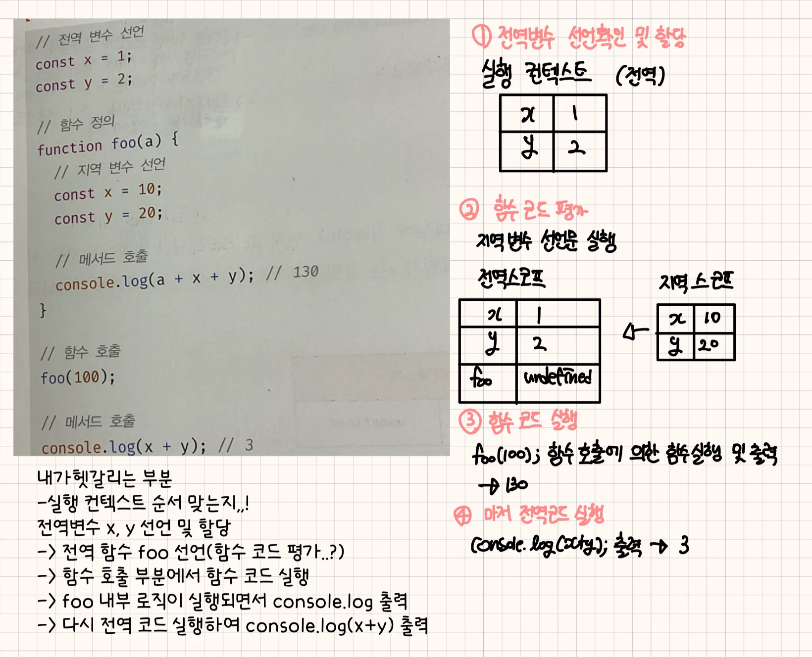
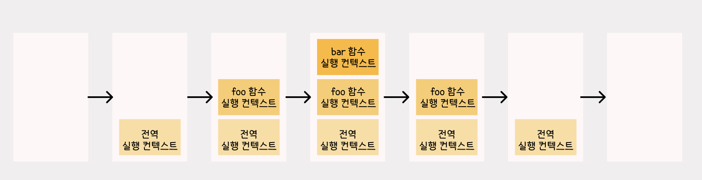

# 23ch 실행 컨텍스트

- 자바스크립트의 동작 원리를 담고 있는 핵심 개념
- 식별자, 식별자에 바인딩된 값, 호이스팅이 발생하는 이유, 클로저의 동작 방식, 이벤트 핸들러와 비동기 처리의 동작 방식을 이해할 수 있음

## 📚 소스코드의 타입

- 소스코드의 타입에 따라서 실행 컨텍스를 생성하는 과정과 관리 내용이 다름

| 소스코드의 타입 | 설명                                                                                                 |
| --------------- | ---------------------------------------------------------------------------------------------------- |
| 전역 코드       | 전역에 존재하는 소스코드를 의미. 전역에 정의된 함수, 클래스 등의 내부 코드는 포함되지 않음           |
| 함수 코드       | 함수 내부에 존재하는 소스코드를 의미. 함수 내부에 중첩된 함수, 클래스 등의 내부 코드는 포함되지 않음 |
| eval 코드       | 빌트인 전역 함수인 eval 함수에 인수로 전달되어 실행되는 소스코드                                     |
| 모듈 코드       | 모듈 내부에 존재하는 소스코드를 의미. 모듈 내부의 함수, 클래스 등의 내부 코드는 포함되지 않음        |

- 전역 코드
  - 전역 변수를 관리하기 위해 최상위 스코프인 전역 스코프를 생성해야함
  - var 키워드로 선언된 전역 변수와 함수 선언문으로 정의된 전역 함수를 전역 객체의 프로퍼티와 메서드로 바인딩하고 참조하기 위해 전역 객체와 연결되어야함
  - 전역 코드가 평가되면 전역 실행 컨텍스트가 생성됨
- 함수 코드
  - 지역 스코프를 생성하고 지역 변수, 매개변수, arguments 객체를 관리해야함
  - 지역 스코프를 전역 스코프에서 시작하는 스코프 체인의 일원으로 연결해야함
  - 함수 코드가 평가되면 함수 실행 컨텍스트가 새엇ㅇ됨
- 모듈 코드
  - 모ㅗ듈별로 독립적인 모듈 스코프를 생성함
  - 모듈 코드가 평가되면 모듈 실행 컨텍스트가 생성됨

## 📚 소스코드의 평가와 실행

- 자바스크립트 엔진은 소스코드를 `소스코드의 평가`와 `소스코드의 실행 과정`으로 나누어 처리
  - 소스코드 평가 과정: 실행 컨텍스트를 생성하고 변수, 함수 등의 선언문만 먼저 실행하여 생성된 변수나 함수 식별자를 키로 실행 컨텍스트가 관리하는 스코프(렉시컬 환경의 환경 레코드)에 등록
  - 소스코드 실행 과정: 런타임이 시작되며, 변수나 함수의 참조를 실행 컨텍스트가 관리하는 스코프에서 검색해서 취득함. 그리고 변수 값의 변경 등 소스코드의 실행 결과는 다시 실행 컨텍스트가 관리하는 스코프에 등록됨

## 📚 실행 컨텍스트의 역할

- 자바스크립트 엔진이 아래 예시를 어떻게 평가하고 실행하는지에 대해 살펴보자

```tsx
// 전역 변수 선언
const z = 1;
const y = 2;

// 함수 정의
function foo(a) {
  // 지역 변수 선언
  const x = 10;
  const y = 20;

  // 메서드 호출
  console.log(a + x + y); // 130
}

// 함수 호출
foo(100);

// 메서드 호출
console.log(x + y); // 3
```



- `1. 전역 코드 평가 → 2. 전역 코드 실행 → 3. 함수 코드 평가 → 4. 함수 코드 실행` 과 같은 순서로 진행됨
- 코드가 실행되려면 아래와 같이 스코프, 식별자, 코드 실행 순서 등의 관리가 필요함
  - 선언에 의해 생성된 모든 식별자(변수, 함수, 클래스 등)를 스코프를 구분하여 등록하고 상태 변화(식별자에 바인딩된 값의 변화)를 지속적으로 관리할 수 있어야함
  - 스코프는 중첩 관계에 의해 스코프 체인을 형성해야함. 즉, 스코프 체인을 통해 상위 스코프로 이동하며 식별자를 검색할 수 있어야함
  - 현재 실행 중인 코드의 실행 순서를 변경(예를 들어, 함수 호출에 의한 실행 순서 변경)할 수 있어야 하며 다시 되돌아갈 수도 있어야함
    이때, 이 모든 것을 관리하는 것이 바로 `실행 컨텍스트`

<aside>
💡

**실행 컨텍스트**

소스코드를 실행하는 데 필요한 환경을 제공하고 코드의 실행 결과를 실제로 관리하는 영역

즉, 실행 컨텍스트는 식별자(변수, 함수, 클래스 등의 이름)를 등록하고 관리하는 스코프와 코드 실행 순서 관리를 구현한 내부 메커니즘으로, 모든 코드는 실행 컨텍스트를 통해 실행되고 관리됨

</aside>

## 📚 실행 컨텍스트 스택

아래의 예시는 소스코드의 타입으로 분류시 전역 코드와 함수 코드로 이루어져 있음

```tsx
const x = 1;

function foo() {
  const y = 2;

  function bar() {
    const z = 3;
    console.log(x + y + z);
  }
  bar();
}

foo(); // 6
```

- 자바스크립트 엔진은 먼저 전역 코드를 평가하여 전역 실행 컨텍스트를 생성 → 함수가 호출되면 함수 코드를 평가하여 함수 실행 컨텍스트를 생성
- 이때, 생성된 실행 컴텍스트는 `스택` 자료구조로 관리되며, 이를 `실행 컨텍스트 스택`이라 함



1. 전역 코드의 평가와 실행
   - JS엔진은 먼저 전역 코드를 평가하여 전역 실행 컨텍스트를 생성하고 실행 컨텍스트 스택에 푸시함
   - 이때, 전역 변수 x와 전역 함수 foo는 전역 실행 컨텍스트에 등록됨
   - 이후 전역 코드가 실행되며 전역 변수 x에 값이 할당되고 전역 함수 foo가 호출됨
2. foo 함수 코드의 평가와 실행
   - 전역 함수 foo가 호출되면 전역 코드 실행은 일시 중단되고 코드의 제어권이 foo 함수 내부로 이동
   - foo 함수 내부의 함수 코드를 평가하여 foo 함수 실행 컨텍스트를 생성하고 실행 컨텍스트 스택에 푸시함
   - 지역 변수 y와 중첩 함수 bar가 foo 함수 실행 컨텍스트에 등록됨
   - 이후 foo 함수 코드가 실행되기 시작하여 지역 변수 y에 값이 할당되고 중첩 함수 bar가 호출됨
3. bar 함수 코드의 평가와 실행
   - 중첩 함수 bar가 호출되면 foo 함수 코드의 실행은 일시 중단되고 코드의 제어권이 bar 함수 내부로 이동함
   - bar 함수 내부의 코드를 평가하여 bar 함수 실행 컨텍스트를 생성하고 실행 컨텍스트 스택에 푸시함
   - 이때, bar 함숭츼 지역 변수 z가 bar 함수 실행 컨텍스트에 등록됨
   - 이후, bar 함수 코드가 실행되기 시작하여 지역 변수 z에 값이 할당되고 console.log 메서드 호출 이후bar 함수가 종료됨
4. foo 함수 코드로 복귀
   - bar 함수가 종료되면 코드의 제어권은 다시 foo 함수로 이동함
   - bar 함수 실행 컨텍스트를 실행 컨텍스트 스택에서 팝하여 제거
   - foo 함수는 더 이상 실행할 코드가 없으므로 종료됨
5. 전역 코드로 복귀
   - foo 함수가 종료되면 코드의 제어권은 다시 전역 코드로 이동함
   - foo 함수 실행 컨텍스트를 실행 컨텍스트 스택에서 팝하여 제거함
   - 더 이상 실행할 전역 코드가 남아 있지 않으므로 전역 실행 컨텍스트도 실행 컨텍스트 스택에서 팝되어 실행 컨텍스트 스택에는 아무것도 남지않음

- 이처럼 실행 컨텍스트 스택은 코드의 `실행 순서`를 관리함
- 소스코드가 평가되면 실행 컨텍스트가 생성되고 실행 컨텍스트 스택의 최상위에 쌓임
- 실행 컨텍스트 스택의 최상위에 존재하는 실행 컨텍스트는 언제나 현재 실행 중인 코드의 실행 컨텍스트이며, 이를 **실행 중인 실행 컨텍스트**라고 부름

## 📚 렉시컬 환경

식별자와 식별자에 바인딩된 값, 그리고 상위 스코프에 대한 참조를 기록하는 자료구조로 실행 컨텍스트를 구성하는 컴포넌트를 의미

- 실행 컨텍스트 스택이 코드의 실행 순서를 관리한다면 **렉시컬 환경**은 `스코프와 식별자를 관리`함
- 렉시컬 환경은 키와 값을 갖는 객체 형태의 스코프(전역, 함수, 블록 스코프)를 생성하여 식별자를 키로 등록하고 식별자에 바인딩된 값을 관리함
- 즉, 스코프를 구분하여 식별자를 등록하고 관리하는 저장소 역할을 하는 렉시컬 스코프의 실체임

## 📚 실행 컨텍스트의 생성과 식별자 검색 과정

아래 예시를 통해 실행 컨텍스트가 생성되고 코드 실행 결과가 관리되는지, 어떻게 실행 컨텍스트를 통해 식별자를 검색하는지 살펴보자

```tsx
var x = 1;
const y = 2;

function foo(a) {
  var x = 3;
  const y = 4;

  function bar(b) {
    const z = 5;
    console.log(a + b + x + y + z);
  }
  bar(10);
}

foo(20); // 42
```

### 1. 전역 객체 생성

- 전역 객체는 전역 코드가 평가되기 이전에 생성됨
- 전역 객체에는 동작 환경에 따라 클라이언트 사이드 Web API 또는 특정 환경을 위한 호스트 객체를 포함함
- 전역 객체도 프로토타입 체인의 일원임

### 2. 전역 코드 평가

소스코드가 로드되면 JS 엔진은 전역 코드를 평가함

1. 전역 실행 컨텍스트 생성
   - 실행 중인 컨텍스트에 해당함
2. 전역 렉시컬 환경 생성
   1. 전역 환경 레코드 생성
      - 전역 환경 레코드는 전역 변수를 관리하는 전역 스코프, 전역 객체의 빌트인 전역 프로퍼티와 빌트인 전역 함수, 표준 빌트인 객체를 제공
      1. 객체 환경 레코드 생성
         - 객체 환경 레코드는 기존의 전역 객체가 관리하던 var 키워드로 선언한 전역 변수와 함수 선언문으로 정의한 전역 함수, 빌트인 전역 프로퍼티와 빌트인 전역 함수, 표준 비릍인 객체를 관리
      2. 선언적 환경 레코드 생성
         - 선언적 환경 레코드는 let, const 키워드로 선언한 전역 변수를 관리함
   2. this 바인딩
      - [[GlobalThisValue]] 내부 슬롯에 this가 바인딩됨
      - 전역 코드에서 this는 전역 객체를 가리키므로 전역 환경 레코드의 [[GlobalThisValue]] 내부 슬롯에는 전역 객체가 바인딩됨
      - 참고로 전역 환경 레코드를 구성하는 객체 환경 레코드와 선언전 환경 레코드에는 this 바인딩이 없음
      - this 바인딩은 전역 환경 레코드와 함수 환경 레코드에만 존재함
   3. 외부 렉시컬 환경에 대한 참조 결정
      - 현재 평가 중인 소스코드를 포함하는 외부 소스코드의 렉시컬 환경, 즉 상위 스코프를 가리킴
      - 단방향 링크드 리스트인 스코프 체인을 구현함

### 3. 전역 코드 실행

- 변수 할당문 또는 함수 호출문을 실행하려면 먼저 변수 또는 함수 이름이 선언된 식별자인지 확인해야함
- 식별자는 스코프가 다르면 같은 이름을 가질 수 있는데, 어느 스코프의 식별자를 참조하면 되는지 결정해야하는 `식별자 결정`을 필요로 함
- **식별자 결정을 위해 식별자를 검색할 때는 실행 중인 실행 컨텍스트에서 식별자를 검색하기 시작함**
- 실행 중인 실행 컨텍스트의 렉시컬 환경에서 식별자를 검색할 수 없으면 외부 렉시컬 환경에 대한 참조가 가리키는 렉시컬 환경, 즉 상위 스코프로 이동하여 식별자를 검색함
- 실행 컨텍스트는 소스코드를 실행하기 위해 필요한 환경을 제공하고 코드의 실행 결과를 실제로 관리하는 여영역

### 4. foo 함수 코드 평가

- foo 함수가 호출되면 전역 코드의 실행을 일시 중단하고 foo 함수 내부로 코드의 제어권이 이동함
- 함수 코드 평가는 아래 순서로 진행됨
  1. 함수 실행 컨텍스트 생성
     - foo 함수 실행 컨텍스트를 생성
     - 렉시컬 환경이 완성된 다음 실행 컨텍스트 스택에 푸시됨
  2. 함수 렉시컬 환경 생성
     - foo 함수 렉시컬 환경을 생성하고 foo 함수 실행 컨텍스트에 바인딩함
     1. 함수 환경 레코드 생성
        - 매개변수, arguments 객체, 함수 내부에서 선언한 지역 변수와 중첩 함수를 등록하고 관리함
     2. this 바인딩
        - 함수 호출 방식에 따라 결정됨
        - foo 함수는 일반 함수로 호출되었으므로 this는 전역 객체를 가리킴
     3. 외부 렉시컬 환경에 대한 참조 결정
        - foo 함수 정의가 평가된 시점에 실행 중인 실행 컨텍스트의 렉시컬 환경의 참조가 할당됨

### 5. foo 함수 코드 실행

- 런타임이 시작되어 foo 함수의 소스코드가 순차적으로 실행되기 시작함
- 매개변수에 인수가 할당되고, 변수 할당문이 실행되어 지역 변수 x, y에 값이 할당되며, 함수 bar가 호출됨
- 이때, 식별자 결정을 위해 실행 중인 실행 컨텍스트의 렉시컬 환경에서 식별자를 검색하기 시작

### 6. bar 함수 코드 평가

- bar 함수가 호출되면 bar 함수 내부로 코드의 제어권이 이동함
- bar 함수 코드를 평가하기 시작

### 7. bar 함수 코드 실행

- 런타임이 시작되어 bar 함수의 소스코드가 순차적으로 실행되기 시작함
- 매개변수에 인수가 할당되고, 변수 할당문이 실행되어 지역 변수 z에 값이 할당됨

### 8. bar 함수 코드 실행 종료

- 더는 실행할 코드가 없으므로 실행 컨텍스트 스택에서 bar 함수 실행 컨텍스트가 팝되어 제거되고 foo 실행 컨텍스트가 실행 중인 실행 컨텍스트가 됨

### 9. foo 함수 코드 실행 종료

- 더 이상 실행할 코드가 없으므로 foo 함수 코드의 실행이 종료되며, 실행 컨텍스트 스택에서 foo 함수 실행 컨텍스트가 팝되어 제거되고 전역 실행 컨텍스트가 실행 중인 실행 컨텍스트가 됨

### 10. 전역 코드 실행 종료

- 더 이상 실행할 전역 코드가 없으므로 전역 코드의 실행이 종료되고 전역 실행 컨텍스트도 실행 컨텍스트 스택에서 팝되어 실행 컨텍스트 스택에는 아무것도 남아있지 않게 됨

# 24ch 클로저

- 함수를 일급 객체로 취급하는 함수형 프로그래밍 언어에서 사용되는 중요한 특성
- MDN에서는 `클로저는 함수와 그 함수가 선언된 렉시컬 환경과의 조합` 이라고 정의

```tsx
const x = 1;

function outerFunc() {
  const x = 10;

  function innerFunc() {
    console.log(x); // 10
  }
  innerFunc();
}

outerFunc();
```

- outerFunc 함수 내부에서 중첩 함수 innerFunc가 정의되고 호출됨 → innerFunc의 상위 스코프는 외부 함수 outerFunc의 스코프임
- 중첩 함수 innerFunc 내부에서 자신을 포함하고 있는 외부 함수 outerFunc의 x 변수에 접근할 수 있음

```tsx
const x = 1;

function outerFunc() {
  const x = 10;
  innerFunc();
}

function innerFunc() {
  console.log(x); // 1
}

outerFunc();
```

- 만약 innerFucn 함수가 outerFunc 함수의 내부에서 정의된 중첩 함수가 아니라면 innerFunc 함수를 outerFunc 함수의 내부에서 호출한다 하더라도 outerFunc 함수의 변수에 접근할 수 없음
- 이러한 이유는 JS가 렉시컬 스코프를 따르는 프로그래밍 언어이기 때문

## 📚 렉시컬 스코프

- `JS 엔진은 함수를 어디서 호출했는지가 아니라 함수르 ㄹ어디에 정의했는지에 따라 상위 스코프를 결정하는 것` 을 의미

```tsx
const z = 1;

function foo() {
  const x = 10;
  bar();
}

function bar() {
  console.log(x);
}

foo(); // ?
bar(); // ?
```

- foo, bar 함수 모두 전역에서 정의돈 전역 함수 → 상위 스코프는 전역
- 함수를 어디서 호출하는지가는 함수의 상위 스코프 결정에 어떠한 영향도 주지 않음 ⇒ 함수의 상위 스코프는 함수를 정의한 위치에 의해 정적으로 결정되고 변하지 않음
- 함수의 상위 스코프를 결정한다 = 렉시컬 환경의 외부 렉시컬 환경에 대한 참조에 저장할 참조값을 결정함
- 렉시컬 환경의 ‘외부 렉시컬 환경에 대한 참조’에 저장할 참조값, 즉 상위 스코프에 대한 참조는 함수 정의가 평가되는 시점에 함수가 정의된 환경(위치)에 의해 결정되며, 이것이 `렉시컬 스코프`이다

## 📚 함수 객체의 내부 슬롯 [[Environment]]

- 함수가 정의된 환경(위치)과 호출되는 환경(위치)은 다를 수 있음 → 자신이 호출되는 환경과는 상관없이 자신이 정의된 환경, 즉 상위 스코프를 기억해야함
- 이를 위해 함수는 자신의 내부 슬롯 [[Environment]]에 자신이 정의된 환경, 즉 상위 스코프의 참조를 저장함
- 함수 객체 생성시 자신이 정의된 환경(위치)에 의해 결정된 상위 스코프의 참조를 함수 객체 자신의 내부 슬롯 [[Envirnoment]]에 저장
  - 상위 스코프의 참조는 현재 실행 중인 컨텍스트의 렉시컬 환경을 가리킴
  - 함수 정의가 평가되어 함수 객체를 생성하는 시점은 함수가 정의된 환경, 즉 상위 함수가 평가 또는 실행되고 있는 시점이며, 이때 현재 실행 중인 실행 컨텍스트는 상위 함수의 실행 컨텍스트이기 때문
- 함수 객체의 내부 슬롯 [[Environment]]에 저장된 현재 실행 중인 실행 컨텍스트의 렉시컬 환경의 참조가 바로 상위 스코프이며, 자신이 호출되었을 때 생성될 함수 렉시컬 환경의 ‘외부 렉시컬 환경에 대한 참조’에 저장될 참조값임
- 함수 객체는 내부 슬롯 [[Environment]]에 저장한 렉시컬 환경의 참조, 즉 상위 스코프를 자신이 존재하는 한 기억함

## 📚 클로저와 렉시컬 환경

```tsx
const x = 1;

// 1️⃣
function outer() {
  const x = 10;
  const inner = function () {
    console.log(x);
  }; // 2️⃣
  return inner;
}

// outer 함수를 호출하면 중첩 함수 inner를 반환
// 그리고 outer 함수의 실행 컨텍스트는 실행 컨텍스트 스택에서 팝되어 제거됨
const innerFunc = outer(); // 3️⃣
innerFunc(); // 4️⃣ 10
```

1. outer 홈수를 호출(3️⃣)시 중첩 함수 inner를 반환하고 생명 주기를 마감 = outer 함수의 실행 컨텍스트는 실행 컨텍스트 스택에서 제거됨
   - 이때 outer 함수의 지역 변수 x와 변수 값 10을 저장하고 있던 outer 함수의 실행 컨텍스트가 제거됨 → outer 함수의 지역 변수 x 또한 생명 주기를 마감함
   - 따라서 outer 함수의 지역 변수 x는 더이상 유효하지 않게 되어 x 변수에 접근할 수 있는 방법은 달리 없어보임
2. 4️⃣를 보면 알 수 있듯 현재 지역 변수 x의 값은 10에 해당

⇒ 이처럼 외부 함수보다 중첩 함수가 더 오래 유지되는 경우 중첩 함수는 이미 생명 주기가 종료한 외부 함수의 변수를 참조할 수 있으며, 이러한 중첩 함수를 `클로저`라고 함

- 자바스크립트의 모든 함수는 자신의 상위 스코프를 기억함 = 모든 함수가 기억하는 상위 스코프는 함수를 어디서 호출하든 상관없이 유지됨
  ⇒ 함수를 어디서 호출하든 상관없이 함수는 언제나 자신이 기억하는 상위 스코프의 식별자를 참조할 수 있으며 식별자에 바인딩된 값을 변경할 수 있음

## 📚 클로저의 활용

- 클로저는 `상태`를 안전하게 `변경`하고 `유지`하기 위해 사용
- 즉, 상태를 안전하게 `은닉`하고 특정 함수에게만 상태 변경을 허용하기 위해 사용

- 예시 코드로 호출된 횟수를 누적하여 출력하는 카운터 코드가 있다

```tsx
// 카운트 상태 변수
let num = 0;

// 카운트 상태 변경 함수
const increase = function () {
  // 카운트 상태를 1만큼 증가시킴
  return ++num;
};

console.log(increase()); // 1
console.log(increase()); // 2
console.log(increase()); // 3
```

- 현재 문제점
  - 카운트 상태(num 변수 값)는 Increase함수가 호출되기 전까지 변경되지 않고 유지되어야함
  - 이를 위해 카운트 상태는 increase 함수만이 변경할 수 있어야함
  - 즉, 카운트 상태는 전역 변수를 통해 관리가 되고있기 때문에 언제든지 누구나 접근하여 변경(암묵적 결합)이 가능한 상태임
  - 때문에 Increase 함수만이 num 변수를 참조하고 변경할 수 있게 하는 것이 바람직
- 1차 개선 코드

```tsx
// 카운트 상태 변경 함수
const increase = function () {
  // 카운트 상태 변수
  let num = 0;

  // 카운트 상태를 1만큼 증가시킴
  return ++num;
};

console.log(increase()); // 1
console.log(increase()); // 1
console.log(increase()); // 1
```

- 문제점
  - 전역 변수 num을 increase 함수의 지역 변수로 변경하여 의도치 않은 상태 변경은 방지
  - 하지만 Increase 함수가 호출될 때마다 지역 변수 num은 재선언 되어 0으로 초기화 되는 문제점 발생
  - 즉, 상태가 변경되기 이전 상태를 유지하지 못하는 현상을 클로저를 통해 개선해야함
- 2차 개선 코드

```tsx
// 카운트 상태 변경 함수
const increase = function () {
  // 카운트 상태 변수
  let num = 0;

  // 클로저
  return function () {
    // 카운트 상태를 1만큼 증가시킴
    return ++num;
  };
};

console.log(increase()); // 1
console.log(increase()); // 2
console.log(increase()); // 3
```

- 해당 코드가 실행되면 즉시 실행 함수가 호출되고 즉시 실행 함수가 반환한 함수가 increase 변수에 할당됨
- increase 변수에 할당된 함수는 자신이 정의된 위치에 의해 결정된 상위 스코프인 즉시 실행 함수의 렉시컬 환경을 기억하는 클로저임
- 즉시 실행 함수는 호출된 이후 소멸되지만 즉시 실행 함수가 반환한 클로저는 Increase 변수에 할당되어 호출됨
  → 이때, 즉시 실행 함수가 반환한 클로저는 자신이 정의된 위치에 의해 결정된 상위 스코프인 즉시 실행 함수의 렉시컬 환경을 기억하고 있음
  → 즉시 실행 함수가 반환한 클로저는 카운트 상태를 유지하기 위한 자유 변수 num을 언제 어디서 호출하든지 참조하고 변경할 수 있음
- **이처럼 클로저는 상태가 의도치 않게 변경되지 않도록 안전하게 은닉하고 특정 함수에게만 상태 변경을 허용하여 상태를 안전하게 변경하고 유지하기 위해 사용함**

## 📚 캡슐화와 정보 은닉

- `캡슐화`는 객체의 상태를 나타내는 프로퍼티와 프로퍼티를 참조하고 조작할 수 있는 동작인 메서드를 하나로 묶는 것을 의미
- 캡슐화는 객체의 특정 프로퍼티나 메서드를 감출 목적으로 사용하기도 하며 이를 `정보 은닉`이라 함
  - 정보 은닉은 외부에 공개할 필요가 없는 구현의 일부를 외부에 공개되지 않도록 감추어 적절치 못한 접근으로부터 객체의 상태가 변경되는 것을 방지해 정보를 보호하고, 객체 간의 상호 의존성, 즉 `결합도`를 낮추는 효과가 있음
- JavaScript는 public, private, protected 같은 접근 제한자를 제공하지 않음. 따라서 자바스크립트 객체의 모든 프로퍼티와 메서드는 기본적으로 외부에 공개되어 있음
  = 객체의 모든 프로퍼티와 메서드는 기본적으로 public임

# 25ch 클래스

## 📚 클래스는 프로토타입의 문법적 설탕인가?

- 자바스크립트는 프로토타입 기반 객체지향 언어 = 클래스가 필요 없는 객체지향 프로그래밍 언어
  → 클래스 없이도 생성자 함수와 프로토타입을 통해 객체지향 언어의 상속을 구현할 수 있음
- 클래스와 생성자 함수의 몇 가지 차이점
  - 클래스를 new 연산자 없이 호출하면 에러가 발생. 하지만 생성자 함수를 new 연산자 없이 호출하면 일반 함수로서 호출됨
  - 클래스는 상속을 지원하는 extends와 super 키워드를 제공함. 하지만 생성자 함수는 extends와 super 키워드를 지원하지 않음
  - 클래스는 호이스팅이 발생하지 않는 것처럼 동작함. 하지만 함수 선언문으로 정의된 생성자 함수는 함수 호이스팅이, 함수 표현식으로 정의한 생성자 함수는 변수 호이스팅이 발생함
  - 클래스 내의 모든 코드에는 암묵적으로 strict mode가 지정되어 실행되며 strict mode를 해제할 수 없음. 하지만 생성자 함수는 암묵적으로 strict mode가 지정되지 않음
  - 클래스의 constructor, 프로토타입 메서드, 정적 메서드는 모두 프로퍼티 어트리뷰트 [[Emuerable]]의 값이 false임. 즉, 열거되지 않음

⇒ 따라서 클래스를 프로토타입 기반 객체 생성 패턴의 단순한 문법적 설탕이라고 보기보다는 새로운 객체 생성 메커니즘으로 보는 것이 좀 더 합당함

## 📚 클래스의 정의

- 클래스는 `class` 키워드를 사용하여 정의하며, 클래스 이름은 파스칼 케이스를 사용하는 것이 일반적임. 사용하지 않더라도 에러가 발생하진 않음
  ```tsx
  // 클래스 선언문
  class Person {}
  ```
- 일반적이지는 않지만 함수와 마찬가지로 표현식으로 클래스를 정의할 수 있으며, 함수와 마찬가지로 이름을 가질 수도 잇고, 갖지 않을 수도 있음

  ```tsx
  // 익명 클래스 표현식
  const Person = class {};

  // 기명 클래스 표현식
  const Person = class MyClass {};
  ```

- 클래스를 표현식으로 정의할 수 있따는 것 = 클래스 값으로 사용할 수 있는 일급 객체라는 것
  - 무명의 리터럴로 생성할 수 있으며, 즉 런타임에 생성이 가능함
  - 변수나 자료구조(객체, 배열 등)에 저장할 수 있음
  - 함수의 매개변수에게 전달할 수 있음
  - 함수의 반환값으로 사용할 수 있음
- 클래스는 함수다. 따라서 클래스는 값처럼 사용할 수 있는 일급 객체임
- 클래스 몸체에는 0개 이상의 메서드만 정의할 수 있으며, 몸체에서 정의할 수 있는 메서드는 constructor(생성자), 프로토타입 메서드, 정적 메서드의 세 가지가 있음

  ```tsx
  // 클래스 선언문
  class Person {
    // 생성자
    constructor(name) {
      // 인스턴스 생성 및 초기화
      this.name = name; // name 프로퍼티는 public함
    }

    // 프로토타입 메서드
    sayHi() {
      console.log(`hi! my name is ${this.name}`);
    }

    // 정적 메서드
    static sayHello() {
      console.log("hello");
    }
  }

  // 인스턴스 생성
  const me = new Person("Lee");

  // 인스턴스의 프로퍼티 참조
  console.log(me.nmae); // Lee
  // 프로토타입 메서드 호출
  me.sayHi(); // hi! my name is Lee
  // 정적 메서드 호출
  Person.sayHello(); // hello
  ```

## 📚 클래스 호이스팅

- 클래스는 함수로 평가됨

  ```tsx
  // 클래스 선언문
  class Person {}

  console.log(typeof Person); // function
  ```

  - 클래스 선언문으로 정의한 클래스는 함수 선언문과 같이 `소스코드 평가 과정`, 즉 런타임 이전에 먼저 평가되어 함수 객체를 생성함
  - 이때 클래스가 평가되어 생성된 함수 객체는 생성자 함수로서 호출할 수 있는 함수, 즉 `constructor`임
  - 프로토타입과 생성자 함수는 단독으로 존재할 수 없고 언제나 쌍으로 존재
    → 생성자 함수로서 호출할 수 있는 함수는 함수 정의가 평가되어 함수 객체를 생성하는 시점에 프로토타입도 더불어 생성됨

- 클래스는 클래스 정의 이전에 참조할 수 없음

## 📚 인스턴스 생성

- 클래스는 생성자 함수이며 new 연산자와 함께 호출되어 인스턴스를 생성함

  ```tsx
  class Person {}

  // 인스턴스 생성
  const me = new Person();
  console.log(me); // Person {}
  ```

- 함수는 new 연산자의 사용 여부에 따라 일반 함수로 호출되거나 인스턴스 생성을 위한 생성자 함수로 호출되지만 클래스는 인스턴스를 생성하는 것이 유일한 존재 이유이므로 반드시 new 연산자와 함께 호출되어야함

## 📚 메서드

- 클래스 몸체에는 0개 이상의 메서드만 선언할 수 있으며, 몸체에서 정의할 수 있는 메서드는 constructor(생성자), 프로토타입 메서드, 정적 메서드의 세 가지가 있음

### constructor

인스턴스를 생성하고 초기화하기 위한 특수한 메서드로, 이름 변경이 불가능함

```tsx
class Person {
  // 생성자
  constructor(name) {
    // 인스턴스 생성 및 초기화
    this.name = name;
  }
}
```

- 클래스는 인스턴스를 생성하기 위한 생성자 함수
- 클래스도 함수 객체 고유의 프로퍼티를 모두 갖고있음
- 함수와 동일하게 프로토타입과 연결되어 있으며 자신의 스코프 체인을 구성함

외부에서 인스턴스 프로퍼티의 초기값을 전달하려면 constructor에 매개변수를 선언하고 인스턴스를 생성할 때 초기값을 전달함. 이때 초기값은 constructor의 매개변수에게 전달됨

```tsx
class Person {
  constructor(name, address) {
    // 인수로 인스턴스 초기화
    this.name = name;
    this.address = address;
  }
}

// 인수로 초기값을 전달함. 초기값은 constructor에 전달됨
const me = new Person("Lee", "Seoul");
console.log(me); // Person {name: 'Lee', address: 'Seoul'}
```

- 이처럼 constructor 내에서는 인스턴스의 생성과 동시에 인스턴스 프로퍼티 추가를 통해 인스턴스의 초기화를 실행함
  → 인스턴스를 초기화하려면 constructor를 생략해서는 안됨
- constructor는 별도의 반환문을 갖지 않아야함

### 정적 메서드

정적메서드는 인스턴스를 생성하지 않아도 호출할 수 있는 메서드를 의미

- 생성자 함수의 경우 정적 메서드를 생성하기 위해서는 다음과 같이 명시적으로 생성자 함수에 메서드를 추가해야함

```tsx
// 생성자 함수
function Person(name) {
  this.name = name;
}

// 정적 메서드
Person.sayHi = function () {
  console.log("hi");
};

// 정적 메서드 호출
Person.sayHi(); // hi
```

클래스에서는 메서드에 static 키워드를 붙이면 정적 메서드(클래스 메서드)가 됨

```tsx
class Person {
  // 생성자
  constructor(name) {
    // 인스턴스 생성 및 초기화
    this.name = name;
  }

  // 정적 메서드
  static sayHi() {
    console.log("hi!");
  }
}
```

- 정적 메서드는 크래스에 바인딩된 메서드가 됨
- 클래스는 함수 객체로 평가되므로 자신의 프로퍼티/메서드를 소유할 수 있음
- 클래스는 클래스 정의(클래스 선언문이나 클래스 표현식)가 평가되는 시점에 함수 객체가 되므로 인스턴스와 달리 별다른 생성 과정이 필요 없음

### 정적 메서드와 프로토타입 메서드의 차이

1. 정적 메서드와 프로토타입 메서드는 자신이 속해 있는 프로토타입 체인이 다름
2. 정적 메서드는 클래스로 호출하고 프로토타입 메서드는 인스턴스로 호출함
3. 정적 메서드는 인스턴스 프로퍼티를 참조할 수 없지만 프로토타입 메서드는 인스턴스 프로퍼티를 참조할 수 있음

### 클래스에서 정의한 메서드의 특징

1. function 키워드를 생략한 메서드 축약 표현을 사용함
2. 객체 리터럴과는 다르게 클래스에 메서드를 정의할 때는 콤마가 필요 없음
3. 암묵적으로 strict mode로 실행됨
4. for…in 문이나 Object.keys 메서드 등으로 열거할 수 없음. 즉, 프로퍼티의 열거 가능 여부를 나타내며, 불리언 값을 갖는 프로퍼티 어트리뷰트 [[Enumeralbe]]의 값이 false임
5. 내부 메서드 [[Construct]]를 갖지 않는 non-constructor임. 따라서 new 연산자와 함께 호출할 수 없음

## 📚 클래스의 인스턴스 생성 과정

- new 연산자와 함께 클래스를 호출하면 생성자 함수와 마찬가지로 클래스의 내부 메서드 [[Construct]]가 호출됨
- 클래스는 new 연산자 없이 호출할 수 없음
- 다음과 같은 과정을 거쳐 인스턴스가 생성됨
  1. 인스턴스 생성과 this 바인딩
     - new 연산자와 함께 클래스를 호출하면 constructor의 내부 코드가 실행되기에 앞서 암묵적으로 빈 객체가 생성됨
     - 이 빈 객체가 바로 클래스가 생성한 인스턴스에 해당되며, 클래스가 생성한 인스턴스의 프로토타입으로 클래스의 prototype 프로퍼티가 가리키는 객체가 설정됨
     - 암묵적으로 생성된 빈 객체, 즉 인스턴스는 this에 바인딩됨
     - 따라서 constructor 내부의 this는 클래스가 생성한 인스턴스를 가리킴
  2. 인스턴스 초기화
     - constructor의 내부 코드가 실행되어 this에 바인딩되어 있는 인스턴스를 초기화함
     - this에 바인딩 되어있는 인스턴스에 프로퍼티를 추가하고 constructor가 인수로 전달받은 초기값으로 인스턴스의 프로퍼티 값을 초기화함
     - constructor가 생략되었다면 해당 과정도 생략됨
  3. 인스턴스 반환
     - 클래스의 모든 처리가 끝나면 완성된 인스턴스가 바인딩된 this가 암묵적으로 반환됨

## 📚 프로퍼티

### 인스턴스 프로퍼티

- constructor 내부에서 정의해야함
- 인스턴스에 프로퍼티가 추가되어 인스턴스가 초기화됨

### 접근자 프로퍼티

- 자체적으로 값을 갖지 않고 다른 데이터 프로퍼티의 값을 읽거나 저장할 때 사용하는 접근자 함수, 즉 getter 함수와 setter 함수로 구성되어 있음
- getter는 인스턴스 프로퍼티에 접근할 때마다 프로퍼티 값을 조작하거나 별도의 행위가 필요할 때 사용
- getter는 메서드 이름 앞에 get 키워드를 사용해 정의함
- setter는 인스턴스 프로퍼티에 값을 할당할 때마다 프로퍼티 값을 조작하거나 별도의 행위가 필요할 때 사용함
- setter는 메서드 이름 앞에 set 키워드를 사용해 정의함
- getter는 호출하는 것이 아니라 프로퍼티처럼 참조하는 형식으로 사용하며, 참조 시에 내부적으로 getter가 호출됨
- setter도 호출하는 것이 아니라 프로퍼티처럼 값을 할당하는 형식으로 사용하며, 할당 시에 내부적으로 setter가 호출됨

### private 필드 정의 제안

- 인스턴스 프로퍼티는 인스턴스를 통해 클래스 외부에서 언제나 참조할 수 있는, 즉 public임
- 클래스 필드 정의 제안을 사용하더라도 클래스 필드는 기본적으로 public하기 때문에 외부에 그대로 노출됨
- private 필두의 선두에는 #을 붙여줌 → private 필드를 참조할 때도 #을 붙여줘야함

| 접근 가능성                 | public | private |
| --------------------------- | ------ | ------- |
| 클래스 내부                 | O      | O       |
| 자식 클래스 내부            | O      | X       |
| 클래스 인스턴스를 통한 접근 | O      | X       |

- 클래스 외부에서 private 필드에 직접 접근할 수 있는 방법은 없으나, 접근자 프로퍼티를 통해 간접적으로 접근하는 방법은 유효함
- private 필드는 반드시 클래스 몸체에 정의해야함. private 필드를 직접 constructor에 정의하면 에러가 발생함

### static 필드 정의 제안

- 클래스에는 static 키워드를 사용하여 정적 메서드를 정의할 수 있음
- static 키워드를 사용해서 정적 필드를 정의할 수는 없음
