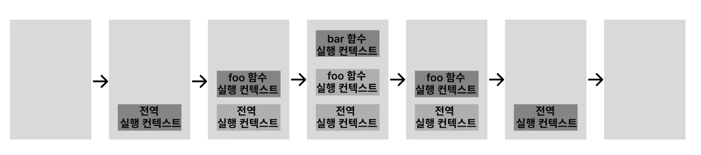

# 23. 실행 컨텍스트

**자바 스크립트의 동작 원리**

## 23.1 소스코드의 타입

- ECAMScript 사양의 소스코드는 4가지 타입으로 구분되고, 실행 컨텍스트를 생성한다.
- 소스 코드의 타입에 따라 실행 컨텍스트를 생성하는 과정과 관리 내용이 다르다.

| 소스코드의 타입 | 코드 평가                                                                                                                                               |
| --------------- | ------------------------------------------------------------------------------------------------------------------------------------------------------- |
| 전역 코드       | 전역 코드가 평가되면 전역 실행 컨택스트 생성.                                                                                                           |
| 함수 코드       | 지역 스코프를 가지는 함수 코드는 전역 스코프에서 시작하는 스코프 체인의 일원으로 연결해야 한다. 이를 위해 함수 코드가 평가되면 함수 실행 컨택스트 생성. |
| eval 코드       | eval 코드는 strict mode에서 자신만의 독자적인 스코프를 생성한다. 이를 위해 eval 코드가 평가되면 eval 실행 컨택스트 생성.                                |
| 모듈 코드       | 모듈 코드는 모듈별로 독립적인 모듈 스코프를 생성한다. 이를 위해 모듈 코드가 평가되면 모듈 실행 컨택스트 생성.                                           |

## 23.2 소스코드의 평가와 실행

- 자바스크립트 엔진은 소스코드를 `소스코드의 평가`와 `소스코드의 실행` 과정으로 나누어 처리한다.
  - `소스코드 평가` - 실행 컨텍스트를 생성. 선언문만 먼저 실행하여 생성된 변수, 함수, 식별자를 키로 실행 컨택스트가 관리하는 스코프에 등록한다.
  - `소스코드 실행` - 변수 선언문을 제외한 소스코드가 순차적으로 실행. 변수나 함수의 참조를 실행 컨텍스트가 관리하는 스코프에서 검색해서 취득. 값의 변경 등 소스코드의 실행 결과는 다시 실행 컨텍스트가 관리하는 스코프에 등록된다.

```jsx
var x;
x = 1;
```

- `소스코드 평가` 과정에서 변수 선언문 `var x;` 실행.
- 이때 생성된 변수 식별자 `x` 는 **실행 컨텍스트**가 관리하는 스코프에 등록되고 `undefined` 로 초기화한다.
- 소스코드 평가 과정이 끝나면 `소스코드 실행` 과정 시작
- 변수 선언문 `var x;` 는 소스코드 평가 과정에서 이미 실행 되었으므로 변수 할당문 `x = 1;` 만 실행된다.
- 이때 `x` 변수에 값을 할당하려면 선언된 변수인지 확인해야 한다.
- 이를 위해 **실행 컨텍스트**가 관리하는 스코프에 `x` 변수가 등록되어 있는지 확인한다.
- **실행 컨텍스트**가 관리하는 스코프에 등록되어 있다면 `소스코드 평가` 과정에서 선언문이 실행되어 등록된 변수다.
- 따라서 값을 할당하고 할당 결과를 **실행 컨텍스트**에 등록하여 관리한다.

## 23.3 실행 컨텍스트의 역할

**실행 컨텍스트는 소스코드를 실행하는 데 필요한 환경을 제공하고 코드의 실행 결과를 실제로 관리하는 영역**이다.

- 식별자(변수, 함수, 클래스 등의 이름)를 등록하고 관리하는 스코프와 코드 실행 순서 관리를 구현한 내부 매커니즘이다.
- 모든 코드는 실행 컨텍스트를 통해 실행되고 관리된다.
- 식별자와 스코프는 실행 컨텍스트의 `렉시컬 환경`으로 관리하고 코드 실행 순서는 `실행 컨텍스트 스택`으로 관리한다.

## 23.4 실행 컨텍스트 스택

- **실행 컨텍스트 스택은 코드의 실행 순서를 관리한다.**
- 실행 컨텍스트 스택의 최상위에 존재하는 실행 컨텍스트는 언제나 현재 실행 중인 코드의 실행 컨텍스트다.
- 실행 컨텍스트 스택의 최상위에 존재하는 실행 컨텍스트를 **실행 중인 실행 컨텍스트**라 부른다.

```jsx
const x = 1;

function foo() {
  const y = 2;

  function bar() {
    const z = 3;
    console.log(x + y + z);
  }
  bar();
}

foo(); // 6
```

- 자바스크립트 엔진은 전역 코드를 평가하여 `전역 실행 컨텍스트를 생성`한다.
- 그리고 함수가 호출되면 함수 코드를 평가하여 `함수 실행 컨텍스트를 생성`한다.
- 코드가 실행되는 흐름에 따라 실행 컨텍스트 스택에는 실행 컨텍스트 스택이 추가되고 제거된다.



1. **전역 코드의 평가와 실행**
   1. 전역 코드를 평가하여 전역 실행 컨텍스트를 생성하고 실행 컨텍스트 스택에 푸시한다.
   2. 전역 변수 `x` 와 전역 함수 `foo` 는 전역 실행 컨텍스트에 등록된다.
   3. 전역 코드가 실행되어 전역 변수에 `x` 값이 할당되고 전역 함수 `foo` 가 호출된다.
2. **foo 함수 코드의 평가와 실행**
   1. 전역 함수 `foo` 가 호출되면 전역 코드의 실행은 일시 중단되고 코드의 제어권이 `foo` 함수 내부로 이동한다.
   2. `foo` 함수 내부의 코드를 평가하여 함수 실행 컨텍스트를 생성하고 실행 컨텍스트 스택에 푸시한다.
   3. 이때 `foo` 함수의 지역 변수 `y` 와 중첩 함수 `bar` 가 `foo` 함수 실행 컨텍스트가 등록된다.
   4. 이후 `foo` 함수 코드가 실행되기 시작하여 지역 변수 `y` 에 값이 할당되고 중첩 함수 `bar` 가 호출된다.
3. **bar 함수 코드의 평가와 실행**
   1. 중첩 함수 `bar` 가 호출되면 `foo` 함수 코드의 실행은 일시 중단되고 코드의 제어권이 `bar` 함수 내부로 이동한다.
   2. 자바스크립트 엔진은 `bar` 함수 내부의 함수 코드를 평가하여 `bar` 함수 실행 컨텍스트를 생성하고 실행 컨텍스트에 푸시한다.
   3. `bar` 함수의 지역 변수 `z` 가 `bar` 함수 실행 컨텍스트에 등록된다.
   4. 이후 `bar` 함수 코드가 실행되기 시작하여 지역 변수 `z` 에 값이 할당되고 `console.log` 메서드를 호출한 이후 `bar` 함수는 종료된다.
4. **foo 함수 코드로 복귀**
   1. `bar` 함수가 종료되면 코드의 제어권은 다시 `foo` 함수로 이동한다.
   2. 이때 자바스크립트 엔진은 `bar` 함수 실행 컨텍스트를 실행 컨텍스트 스택에서 팝하여 제거한다.
   3. 그리고 `foo` 함수는 더 이상 실행할 코드가 없으므로 종료된다.
5. **전역 코드로 복귀**
   1. `foo` 함수가 종료되면 코드의 제어권은 다시 전역 코드로 이동한다.
   2. 이때 자바스크립트 엔진은 `foo` 함수의 실행 컨텍스트를 실행 컨텍스트 스택에서 팝하여 제거한다.

## 23.5 렉시컬 환경

- **렉시컬 환경**은 식별자와 식별자에 바인딩된 값
- 상위 스코프에 대한 참조를 기록하는 자료구조로 실행 컨텍스트를 구성하는 컴포넌트다.
- `실행 컨텍스트 스택`이 코드의 실행 순서를 관리한다면 `렉시컬 환경`은 스코프와 식별자를 관리한다.

렉시컬 환경은 두 개의 컴포넌트로 구성된다.

| 환경 레코드 (Environment Record)                                                | 외부 렉시컬 환경에 대한 참조 (Outer Lexical Environment Reference)                |
| ------------------------------------------------------------------------------- | --------------------------------------------------------------------------------- |
| 스코프에 포함된 식별자를 등록하고 등록된 식별자에 바인딩된 값을 관리하는 저장소 | 외부 렉시컬 환경에 대한 참조는 상위 스코프를 가리킨다.                            |
| 환경 레코드는 소스코드의 타입에 따라 관리하는 내용의 차이가 있다.               | 해당 실행 컨텍스트를 생성한 소스코드를 포함하는 상위 코드의 렉시컬 환경을 말한다. |

## 23.6 실행 컨텍스트의 생성과 식별자 검색 과정

```jsx
var x = 1;
const y = 2;

function (a) {
	var x = 3;
	const y = 4;

	function bar(b) {
		const z = 5;
		console.log(a + b + x + y + z);
	}
	bar(10);
}
foo(20); // 42
```

소스코드가 로드되면 자바스크립트 엔진은 전역 코드를 평가한다.

1. 전역 실행 컨텍스트 생성
2. 전역 렉시컬 환경 생성
   1. 전역 환경 레코드 생성
      1. 객체 환경 레코드 생성
      2. 선언전 환경 레코드 생성
   2. this 바인딩
   3. 외부 렉시컬 환경에 대한 참조 결정

### 1. 전역 실행 컨텍스트 생성

- 비어 있는 전역 실행 컨텍스트를 생성하여 실행 컨텍스트 스택에 푸시한다.
- 전역 실행 컨텍스트는 실행 컨텍스트 스택의 최상위, 실행 중인 실행 컨텍스트가 된다.

### 2. 전역 렉시컬 환경 생성

전역 렉시컬 환경을 생성하고 전역 실행 컨텍스트에 바인딩한다.

### **2.1. 전역 환경 레코드 생성**

`var` 키워드로 선언한 전역 변수와 ES6의 `let` , `const` 키워드로 선언한 전역 변술르 구분하여 관리하기 위해 전역 스코프 역할을 하는 전역 환경 레코드는 **객체 환경 레코드**와 **선언적 환경 레코드**로 구성되어 있다.

- **객체 환경 레코드** - 기존의 전역 객체가 관리하던 `var` 키워드로 선언한 전역 변수와 함수 선언문으로 정의한 전역 함수
- 선언적 환경 레코드 - `let` , `const` 키워드로 선언한 전역 변수를 관리한다.

### 2.1.1. 객체 환경 레코드 생성

전역 환경 레코드를 구성하는 컴포넌트인 **객체 환경 레코드**는 `BindingObject` 라고 부르는 객체와 연결된다.

- 전역 코드 평가 과정에서 **`var` 키워드로 선언한 전역 변수**와 **함수 선언문으로 정의된 전역 함수**는 전역 환경 레코드의 객체 환경 레코드에 연결된 `BingingObject` 를 통해 전역 객체의 프로퍼티와 메서드가 된다.

### 2.1.2 선언적 환경 레코드 생성

- `let` , `const` 키워드로 선언한 전역 변수는 **선언적 환경 레코드**에 등록되고 관리된다.

### 2.2 this 바인딩.

전역 코드에서 `this` 는 전역 객체를 가리키므로 전역 환경 레코드의 `[[GlobalThisValue]]` 내부 슬롯에는 전역 객체가 바인딩된다.

### 2.3. 외부 렉시컬 환경에 대한 참조 결정

현재 평가 중인 소스코드를 포함하는 외부 소스코드의 렉시컬 환경, 상위 스코프를 가리킨다.

- 전역 코드를 포함하는 소스코드는 없으므로 전역 렉시컬 환경의 외부 렉시컬 환경에 대한 참조에 `null` 이 반환된다.
- 이는 전역 렉시컬 환경이 스코프 체인의 종점에 존재함을 이미한다.

### 2.4 전역 코드 실행

코드가 순차적으로 실행되며, 변수 할당문이 실행되어 변수에 값이 할당된다.

- 식별자 결정을 위해 식별자를 검색할 때는 실행 중인 실행 컨텍스트에서 식별자를 검색한다.

### foo 함수 코드 실행

`foo` 함수가 호출되면 적역 코드의 실행을 일시 중단하고 `foo` 함수 내부로 코드의 제어권이 이동한다.

- 이후 과정은 다음과 같다.

1. `bar` 함수 코드 평가
2. `bar` 함수 코드 실행
3. `bar` 함수 코드 실행 종료
4. `foo` 함수 코드 실행 종료
5. 전역 코드 실행 종료

# 24. 클로저

## 24.1 렉시컬 스코프

자바스크립트 엔진은 함수를 어디서 호출했는지가 아니라 **함수를 어디에 정의했는지에 따라 상위 스코프를 결정**한다. 이를 **렉시컬 스코프(정적 스코프)** 라 한다.

## 24.2 함수 객체의 내부 슬롯 [[Environment]]

함수는 자신의 내부 슬롯 `[[Environment]]` 에 자신이 정의된 환경. 상위 스코프의 참조를 저장한다.

- 함수 객체의 내부 슬롯에 저장된 현재 실행 중인 실행 컨텍스트의 렉시컬 환경의 참조가 바로 상위 스코프다.
- 자신이 호출되었을 때 생성될 함수 렉시컬 환경의 `외부 렉시컬 환경에 대한 참조` 에 저장될 참조값이다.
- 함수 객체는 내부 슬롯에 저장한 렉시컬 환경의 참조, 상위 스코프를 자신이 존재하는 한 기억한다.

```jsx
const x = 1;

function foo() {
  const x = 10;

  // 상위 스코프는 함수 정의 환경(위치)에 따라 결정된다.
  // 함수 호출 위치와 상위 스코프는 아무런 관계가 없다,
  bar();
}

// 함수 bar는 자신의 상위 스코프, 전역 렉시컬 환경을 [[Environment]]에 저장하여 기억한다.
function bar() {
  console.logn(x);
}

foo(); // 1
bar(); // 1
```

- `foo` 와 `bar` 함수는 모두 전역에서 코드가 평가되는 시점에 평가되어 함수 객체를 생성한다.
- 전역 코드 평가 시점에 실행 중인 실행 컨텍스트의 렉시컬 환경인 전역 렉시컬 환경의 참조가 저장된다.

## 24.3 클로저와 렉시컬 환경

외부 함수보다 중첩 함수가 더 오래 유지되는 경우 중첩 함수는 이미 생명 주기가 종료한 외부 함수의 변수를 참조할 수 있다. 이러한 중첩 함수를 `클로저(Closure)`라고 부른다.

```jsx
const x = 1;

function outer() {
  const x = 10;
  const inner = function () {
    console.log(x);
  };
}

const innerFunc = outer();
innerFunc(); // 10
```

- `outer` 함수는 중첩 함수 `inner` 를 반환하고 생명 주기를 마감한다.
  - `outer` 함수는 실행 컨텍스트 스택에서 제거되고 지역 변수 `x` 또한 생명 주기를 마감한다.
- 하지만 결과는 10이다.
- 이미 생명 주기가 종료되어 실행 컨텍스트 스택에서 제거된 `outer` 함수의 지역 변수 `x` 가 다시 부활한 것처럼 동작하고 있다.
- `outer` 함수의 실행 컨텍스트는 실행 컨텍스트 스택에서 제거되지만, `outer` 함수의 렉시컬 환경까지 소멸하는 것은 아니다.

## 24.4 클로저의 활용

- `클로저` 는 **상태(State)를 안전하게 변경하고 유지하기 위해 사용**한다.
- 상태가 의도적으로 변경되지 않도록 상태를 안전하게 은닉하고 특정 함수에게만 상태 변경을 허용하기 위해 사용한다.

```jsx
// 카운트 상태 변수
let num = 0;

// 카운트 상태 변경 함수
const increase = function () {
  // 카운트 상태를 1만큼 증가 시킨다.
  return ++num;
};

console.log(increase()); // 1
console.log(increase()); // 2
console.log(increase()); // 3
```

- 오류를 발생시킬 가능성을 내포하고 있는 코드이다. 바르게 동작하기 위한 전제 조건

  - 카운트 상태는 `increase` 함수가 호출되기 전까지 변경되지 않고 유지되어야 한다.
  - 또한 카운트 상태는 `increase` 함수만이 변경할 수 있어야 한다.

- `increase` 함수만이 `num` 변수를 참조하고 변경할 수 있게 하는 것이 바람직하다.
  - 전역 변수 `num` 을 `increase` 함수의 지역 변수로 바꾸어 의도치않은 상태 변경 방지

```jsx
// 카운트 상태 변경 함수
const increase = (function () {
  // 카운트 상태 변수
  let num = 0;

  // 클로저
  return function () {
    // 카운트 상태를 1만큼 증가시킨다.
    return ++num;
  };
})();

console.log(increase()); // 1
console.log(increase()); // 2
console.log(increase()); // 3
```

- 즉시 실행 함수가 호출되고 즉시 실행 함수가 반환한 함수가 `increase` 변수에 할당된다.
- 즉시 실행 함수는 한 번만 실행되므로 `increase` 가 호출될 때마다 `num` 변수가 재차 초기화될 일은 없다.
- `num` 변수는 외부에서 직접 접근할 수 없는 은닉된 `private` 변수이므로 전역 변수를 사용했을 때와 같이 의도되지 않은 변경을 걱정할 필요도 없기 때문에 안정적인 프로그래밍이 가능하다.

**이와 같이 클로저는 상태가 의도치 않게 변경되지 않도록 안전하게 은닉하고 특정 함수에게만 상태 변경을 허용하여 상태를 안전하게 변경하고 유지하기 위해 사용한다.**

## 24.5 캡슐화와 정보 은닉

`캡슐화` 는 객체의 상태를 나타내는 프로퍼티와 프로퍼티를 참조하고 조작할 수 있는 동작인 메서드를 하나로 묶는 것을 말한다.

- 캡슐화는 객체의 특정 프로퍼티나 메서드를 감출 목적으로 사용하기도 하는데 이를 `정보 은닉`이라 한다.
- 자바스크립트는 정보 은닉을 완전하게 지원하지 않는다.
  - 이후 클래스에 `private` 필드를 정의할 수 있게 됐다.

# 25. 클래스

## 25.1 클래스는 프로토타입의 문법적 설탕인가?

자바스크립트는 프로토타입 기반 객체지향 언어다.

- 클래스와 생성자 함수의 차이점
  - 클래스를 `new` 연산자 없이 호출하면 에러가 발생한다. 하지만 생성자 함수를 `new` 연산자 없이 호출하면 일반 함수로서 호출된다.
  - 클래스는 상속일 지원하는 `extend` 와 `super` 키워드를 제공한다. 하지만 생성자 함수는 지원하지 않는다.
  - 클래스는 호이스팅이 발생하지 않는 것처럼 동작한다. 하지만 함수 선언문으로 정의된 생성자 함수는 함수 호이스팅이, 함수 표현식으로 정의한 생성자 함수는 변수 호이스팅이 발생한다.
  - 클래스 내의 모든 코드에는 암묵적으로 `strict mode` 가 지정되어 실행되며 `strict mode` 를 해제할 수 없다. 하지만 생성자 함수는 암묵적으로 지정되지 않는다.
  - 클래스의 `constructor.` 프로포타입 메서드, 정적 메서드는 무료 프로퍼티 어트리뷰트 `[[Enumerable]]` 의 값이 `false` 다. 따라서 열거되지 않는다.

클래스를 프로토타입 기반 객체 생성 패턴의 단순한 문법적 설탕이 아닌 새로운 객체 생성 매커니즘으로 보는 것이 좀 더 합당하다.

## 25.2 클래스 정의

클래스는 `class` 키워드를 사용하여 정의한다.

- 이름은 생성자 함수와 마찬가지로 파스칼 케이스를 사용하는 것이 일반적이다.
- 클래스는 일급 객체로 다음과 같은 특징을 갖는다.
  - 무명의 리터럴로 생성할 수 있다. 즉 런타임에 생성 가능
  - 변수나 자료구조(객체, 배열 등)에 저장할 수 있다.
  - 함수의 매개변수에 전달할 수 있다.
  - 함수의 반환값으로 사용할 수 있다.
- 클래스의 몸체에는 0개 이상의 메서드만 정의할 수 있다.
- 클래스 몸체에 정의할 수 있는 메서드는 `constructor(생성자)`, `프로토타입 메서드`, `정적 메서드`의 세 가지가 있다.

## 25.3 클래스 호이스팅

클래스는 함수로 평가된다.

- 클래스 선언문으로 정의한 클래스는 함수 선언문과 같이 소스코드 평가 과정, 런타임 이전에 먼저 평가되어 함수 객체를 생성한다.
- 클래스는 클래스 정의 이전에 참조할 수 없다.
- 클래스 선언문은 호이스팅이 발생하지 않는 것처럼 보이지만 그렇지 않다.

```jsx
console.log(Person); // ReferenceError

// 클래스 선언문
class Person {}
```

```jsx
const Person = "";

{
  // 호이스팅이 발생하지 않는다면 ''이 출력되어야 한다.
  console.log(Person); // ReferenceError

  // 클래스 선언문
  class Person {}
}
```

- 클래스 선언문도 호이스팅이 발생한다.
  - 클래스는 `let` , `const` 키워드로 선언한 변수처럼 호이스팅된다.
  - 따라서 클래스 선언문 이전에 일시적 사각지대에 빠지기 때문에 호이스팅이 발생하지 않는 것처럼 동작한다.

## 25.4 인스턴스 생성

클래스는 생성자 함수이며 `new` 연산자와 함께 호출되어 인스턴스를 생성한다.

- 클래스는 인스턴스를 생성하는 것이 유일한 존재 이유이므로 반드시 `new` 연산자와 함께 호출해야 한다.

```jsx
class Person {}

// 인스턴스 생성
const me = new Person();

const mee = Person(); // TypeError
```

## 25.5 메서드

클래스 몸체에는 0개 이상의 메서드만 선언할 수 있으며 `constructor(생성자)`, `프로토타입메서드`, `정적 메서드` 의 세 가지가 있다.

### constructor

`constructor` 는 인스턴스를 생성하고 초기화하기 위한 특수한 메서드다.

- `new` 연산자와 함께 클래스를 호출하면 클래스는 인스턴스를 생성한다.
- `constructor` 내부의 `this` 는 생성자 함수와 마찬가지로 클래스가 생성한 인스턴스를 가리킨다.
- `constructor` 는 클래스 내에 최대 한 개만 존재할 수 있다.
- `constructor` 는 생략할 수 있다.
- `constructor` 내부에서 `return` 문은 반드시 생략해야 한다.

```jsx
// 클래스
class Person {
  // 생성자
  constructor(name) {
    // 인스턴스 생성 및 초기화
    this.name = name;
  }
}
```

### 프로토타입 메서드

클래스 몸체에서 정의한 메서드는 `prototype` 프로퍼티에 메서드를 추가하지 않아도 기본적으로 프로토타입 메서드가 된다.

- 클래스는 생성자 함수와 같이 인스턴스를 생성하는 생성자 함수라고 볼 수 있다.

```jsx
class Person {
  // 생성자
  constructor(name) {
    // 인스턴스 생성 및 초기화
    this.name = name;
  }

  // 프로토타입 메서드
  sayHi() {
    console.log(`Hi! My name is ${this.name}`);
  }
}

const me = new Person("Lee");
me.sayHi(); // Hi! My name is Lee
```

### 정적 메서드

정적 메서드는 인스턴스를 생성하지 않아도 호출할 수 있는 메서드를 말한다.

- 클래스에서는 메서드에 `static` 키워드를 붙이면 정적 메서드(클래스 메서드)가 된다.

```jsx
class Person {
  // 생성자
  constructor(name) {
    // 인스턴스 생성 및 초기화
    this.name = name;
  }

  // 정적 메서드
  static sayHi() {
    console.log("Hi!");
  }
}

// 정적 메서드는 클래스로 호출한다.
// 정적 메서드는 인스턴스 없이도 호출할 수 있다.
Person.sayHi(); // Hi!

// 인스턴스 생성
const me = new Person("Lee");
me.sayHi(); // TypeError
```

- 정적 메서드는 프로토타입 메서드처럼 인스턴스로 호출하지 않고 클래스로 호출한다.
- 정적 메서드는 인스턴스로 호출할 수 없다.

### 정적 메서드와 프로토타입 메서드의 차이

- 정적 메서드와 프로토타입 메서드는 자신이 속해 있는 프로토타입 체인이 다르다.
- 정적 메서드는 클래스로 호출하고 프로토타입 메서드는 인스턴스로 호출한다.
- 정적 메서드는 인스턴스 프로퍼티를 참조할 수 없지만 프로토타입 메서드는 인스턴스 프로퍼티를 참조할 수 있다.

```jsx
class Square {
  // 정적 메서드
  static area(width, height) {
    return width * height;
  }
}

console.log(Square.area(10, 10)); // 100
```

```jsx
class Square {
  constructor(width, height) {
    this.width = width;
    this.height = height;
  }

  // 프로토타입 메서드
  area() {
    return this.width * this.height;
  }
}

const square = new Square(10, 10);
console.log(square.area()); // 100
```

- 메서드 내부에서 인스턴스 프로퍼티를 참조할 필요가 있다면 `this` 를 사용해야 하며, 프로토타입 메서드로 정의해야 한다.
  - 메서드 내부에서 인스턴스 프로퍼티를 참조해야 할 필요가 없다면 `this` 를 사용하지 않게 된다.
- 메서드 내부에서 `this` 를 사용하지 않더라도 프로토타입 메서드로 정의할 수 있다.
  - 하지만 반드시 인스턴스를 생성한 다음 인스턴스로 호출해야 하므로 `this` 를 사용하지 않는 메서드는 정적 메서드로 정의하는 것이 좋다.

### 클래스에서 정의한 메서드의 특징

- `function` 키워드를 생략한 메서드 축약 표현을 사용한다.
- 객체 리터럴과는 다르게 클래스에 메서드를 정의할 때는 콤마가 필요 없다.
- 암묵적으로 `strict mode` 로 실행된다.
- `for ... in` 문이나 `Object.keys` 메서드 등으로 열거할 수 없다.
- 내부 메서드 `[[Constructor]]` 를 갖지 않는 `non-constructor` 다.

## 25.6 클래스의 인스턴스 생성 과정

`new` 연산자와 함께 클래스를 호출하면 생성자 함수와 마찬가지로 클래스 내부 메서드 `[[Constructor]]` 가 호출되며, 클래스는 `new` 연산자 없이 호출할 수 없다.

### 1. 인스턴스 생성과 this 바인딩

- `new` 연산자와 함께 클래스를 호출하면 `constructor` 의 내부 코드가실행되기에 앞서 암묵적으로 빈 객체가 생성된다.
- 이 빈 객체가 클래스가 생성한 인스턴스다.
- 따라서 `constructor` 내부의 `this` 클래스가 생성한 인스턴스를 가리킨다.

### 2. 인스턴스 초기화

- `this` 에 바인딩외어 있는 인스턴스에 프로퍼티를 추가하고 `constructor` 가 인수로 전달받은 초기값으로 인스턴스의 프로퍼티 값을 초기화한다.
- 만약 `constructor` 가 생략되었다면 이 과정도 생략된다.

### 3. 인스턴스 반환

- 클래스의 모든 처리가 끝나면 완성된 인스턴스가 바인딩된 `this` 가 암묵적으로 바인딩된다.

## 25.7 프로퍼티

### 인스턴스 프로퍼티

- 인스턴스 프로퍼티는 `constructor` 내부에서 정의해야 한다.
- `constructor` 내부에서 `this` 에 인스턴스 프로퍼티를 추가한다.
  - 클래스가 암묵적으로 생성한 빈 객체, 즉 인스턴스에 프로퍼티가 추가되어 인스턴스가 초기화된다.

### 접근자 프로퍼티

- 접근자 프로퍼티는 자체적으로 값을 갖지 않고 다른 데이터 프로퍼티의 값을 읽거나 저장할 때 사용하는 접근자 함수, `getter` , `setter` 함수로 구성되어 있다.

```jsx
class Person {
  constructor(firstName, lastName) {
    this.firstName = firstName;
    this.lastName = lastName;
  }

  // fullName은 접근자 함수로 구성된 접근자 프로퍼티다.
  // getter 함수
  get fullName() {
    return `${this.firstName} ${this.lastName}`;
  }

  // setter 함수
  set fullName(name) {
    [this.firstName, this.lastName] = name.split(" ");
  }
}
```

- `getter` 는 인스턴스 프로퍼티에 접근할 때마다 프로퍼티 값을 조작하거나 별도의 행위가 필요할 때 사용한다.
  - 메서드 이름 앞에 `get` 키워드를 사용해 정의한다.
  - 무언가를 취득할 때 사용하므로 반드시 무언가를 반환해야 한다.
- `setter` 는 인스턴스 프로퍼티에 값을 할당할 때마다 프로퍼티 값을 조작하거나 별도의 행위가 필요할 때 사용한다.
  - 메서드 이름 앞에 `set` 키워드를 사용해 정의한다.
  - 단 하나의 값만 할당받기 때문에 단 하나의 매개변수만 선언할 수 있다.

### private 필드 정의 제안

인스턴스 프로퍼티는 인스턴스를 통해 클래스 외부에서 언제나 참조할 수 있다. 즉 언제나 `public` 이다.

`private` 의 필드의 선두에는 `#` 을 붙여준다. `private` 필드를 참조할 때도 `#` 을 붙여줘야 한다.

```jsx
class Person {
  // private 필드 정의
  #name = "";

  constructor(name) {
    // private 필드 참조
    this.#name = name;
  }
}

const me = new Person("Lee");

// private 필드 #name은 클래스 외부에서 참조할 수 없다.
console.log(me.#name); // SyntaxError
```

- `public` 필드는 어디서든 참조할 수 있지만 `private` 필드는 클래스 내부에서만 참조할 수 있다.

| 접근 가능성                 | public | private |
| --------------------------- | ------ | ------- |
| 클래스 내부                 | O      | X       |
| 자식 클래스 내부            | O      | X       |
| 클래스 인스턴스를 통한 접근 | O      | X       |

## 25.8 상속에 의한 클래스 확장

### 클래스 상속과 생성자 함수 상속

프로토타입 기반 상속은 프로토타입 체인을 통해 다른 객체의 자산을 상속받는 개념이지만, **상속에 의한 클래스 확장은 클래스를 상속받아 새로운 클래스를 확장하여 정의**하는 것이다.

- 상속에 의한 확장은 코드 재사용 관점에서 유용하다.

### extends 키워드

상속을 통해 클래스를 확장하려면 `extends` 키워드를 사용하여 상속받을 클래스를 정의한다.

```jsx
// 수퍼(베이스/부모) 클래스
class Base {}

// 서브(파생/자식) 클래스
class Derived extends Base {}
```

### super 키워드

`super` 키워드는 함수처럼 호출할 수도 있고 `this` 와 같이 식별자처럼 참조할 수 있는 특수한 키워드다.

- `super` 를 호출하면 수퍼클래스의 `constructor(super-constructor)`를 호출한다.
- `super` 를 참조하면 수퍼클래스의 메서드를 호출할 수 있다.

```jsx
class Animal {
  constructor(name) {
    this.name = name;
  }

  speak() {
    console.log(`${this.name} makes a noise.`);
  }
}

class Dog extends Animal {
  constructor(name, breed) {
    super(name); // 부모 클래스의 생성자 호출
    this.breed = breed;
  }

  speak() {
    super.speak(); // 부모 클래스의 메서드 호출
    console.log(`${this.name} barks.`);
  }
}

const dog = new Dog("Rex", "Labrador");
dog.speak();
// Rex makes a noise.
// Rex barks.
```

- `Dog` 클래스는 `Animal` 클래스를 `extends` 를 통해 상속받고 있다.
  - `Animal` 클래스에서 정의된 속성이나 메서드를 `Dog` 에서 직접 사용할 수 있다.
- `super()` 부모 생성자 호출
  - `Animal` 클래스의 생성자에서 `this.name = name` 을 설정하기 때문에 `Dog` 클래스에서도 `name` 속성이 자동으로 설정된다.
- 메서드 내에서 `super` 를 참조하면 수퍼클래스의 메서드를 호출할 수 있다.
  - `super.speak()` 는 부모 클래스의 `speak()` 메서드를 실행시킨다.

### 상속 클래스의 인스턴스 생성 과정

1. **서브클래스의 super 호출**
   1. 서브클래스는 자신이 직접 인스턴스를 생성하지 않고 수퍼클래스에게 인스턴스 생성을 위임한다. 서브클래스의 constructor에서 super를 호출해야하는 이유다.
   2. `super` 가 호출되면 수퍼클래스의 `constructor(super-constructor)` 가 호출된다. 수퍼클래스가 평가되어 생성된 함수 객체의 코드가 실행되기 시작한다.
2. **수퍼클래스의 인스턴스 생성과 this 바인딩**
   1. 암묵적으로 빈 객체를 생성한다. 즉 인스턴스가 생성되고 `this` 에 바인딩된다.
   2. 수퍼클래스의 `constructor` 내부의 `this` 는 생성된 인스턴스를 가리킨다.
3. **수퍼클래스의 인스턴스 초기화**
   1. `this` 에 바인딩되어 있는 인스턴스에 프로퍼티를 추가하고 `constructor` 가 인수로 전달받은 초기값으로 인스턴스의 프로퍼티를 초기화한다.
4. **서브클래스 construcotr로의 복귀한 this 바인딩**
   1. `super` 가 반환한 인스턴스가 `this` 에 바인딩된다.
   2. 서브클래스는 별도의 인스턴스를 생성하지 않고 `super` 가 반환한 인스턴스를 `this` 에 바인딩하여 그대로 사용할 수 있다.
   3. `super` 가 호출되지 않으면 인스턴스가 생성되지 않으며, `this` 도 바인딩할 할 수 없다
5. **서브클래스의 인스턴스 초기화**
   1. `super` 호출 이후, 서브클래스의 `constructor` 에 기술되어 있는 인스턴스 초기화가 실행된다.
6. **인스턴스 반환**
   1. 클래스의 모든 처리가 끝나면 완성된 인스턴스가 바인딩된 `this` 가 암묵적으로 반환된다.
