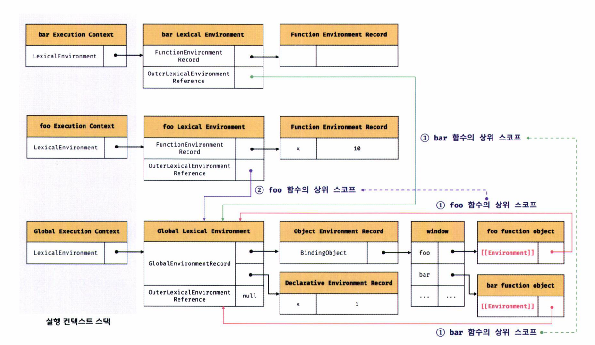
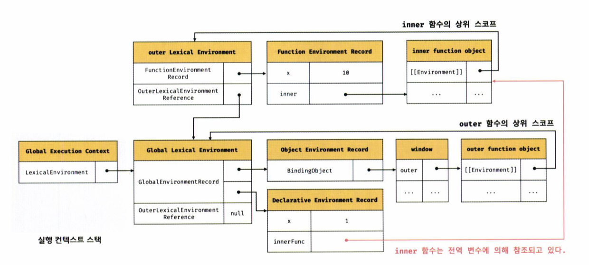
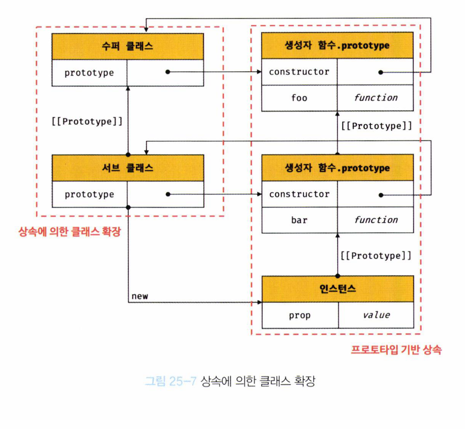

# 실행 컨텍스트

실행 컨텍스트는 자바스크립트의 동작 원리를 담고 있는 핵심 개념입니다. 이를 이해하면 다음과 같은 내용을 알 수 있습니다.

- 스코프와 식별자, 바인딩된 값 관리 방식
- 클로저의 동작 방식
- 태스크 큐와 이벤트 핸들러 및 비동기 처리 방식

## 소스코드의 타입

ECMAScript는 소스코드를 네 가지 타입으로 구분하며, 각 타입의 코드가 실행될 때 생성되는 실행 컨텍스트가 다릅니다.

- 전역 코드 (Global Code): 전역에 존재하는 스크립트를 말합니다. 전역 실행 컨텍스트를 생성하고, 전역 객체와 연결됩니다.
- 함수 코드 (Function Code): 함수 내부에 존재하는 코드입니다. 함수 실행 컨텍스트를 생성하며, 지역 스코프와 연결됩니다.
- eval 코드: eval 함수로 전달되어 실행되는 코드입니다. 독자적인 실행 컨텍스트를 생성합니다.
- 모듈 코드 (Module Code): 모듈별로 독립적인 모듈 스코프를 생성합니다. 모듈 실행 컨텍스트를 생성합니다.

## 실행 컨텍스트의 생성 과정

각 소스코드의 타입에 따라 다음과 같은 실행 컨텍스트가 생성됩니다

- 전역 코드 → 전역 실행 컨텍스트
- 함수 코드 → 함수 실행 컨텍스트
- eval 코드 → eval 실행 컨텍스트
- 모듈 코드 → 모듈 실행 컨텍스트

## 소스코드의 평가와 실행


모든 소스코드는 실행하기 전에 평가 과정을 거치며, 이 과정을 통해 코드를 실행할 준비를 합니다. 자바스크립트 엔진은 소스코드를 두 가지 과정으로 처리합니다.

### 소스코드의 평가

- 소스코드 평가 과정에서는 실행 컨텍스트를 생성하고, 변수와 함수 등의 선언만 먼저 실행하여 생성된 변수나 함수를 실행 컨텍스트에 등록합니다.
- 이 과정에서 스코프를 구성하고 렉시컬 환경(Lexical Environment)에 변수를 등록합니다.
- 비로소 선언문을 제외한 소스코드가 평가가 완료된 후 순차적으로 실행됩니다.

```
var x;
```

### 소스코드의 실행

- 평가가 완료된 후 소스코드가 순차적으로 실행되며, 이때 필요한 변수와 함수의 참조를 스코프 체인에서 검색하여 사용합니다.
- 실행 과정에서 변수와 함수의 값이 변경되면 실행 컨텍스트에 등록된 정보가 업데이트됩니다.

```
x = 1;
```

위 예제 코드에서 자바스크립트 엔진은 다음과 같은 순서로 처리

- 평가 과정

var x; 문을 먼저 실행하여 x 변수를 생성하고, 해당 변수를 실행 컨텍스트에 등록합니다.<br>

이때 x의 값은 undefined로 초기화됩니다.

- 평가 결과:

실행 컨텍스트<br>
x: undefined<br>
실행 과정<br>
x = 1; 문을 실행하여 x의 값을 1로 업데이트합니다.<br>

이때 x 변수가 이미 실행 컨텍스트에 등록되어 있으므로, x의 값을 1로 할당하고 그 결과를 다시 실행 컨텍스트에 저장합니다.<br>

- 실행 결과:

실행 컨텍스트<br>
x: 1

## 실행 컨텍스트의 역할

자바스크립트 엔진이 소스코드를 평가하고 실행하는 과정에서 실행 컨텍스트는 중요한 역할을 수행합니다. 다음 예제를 통해 실행 컨텍스트가 어떻게 동작하는지 살펴보겠습니다

```
// 전역 변수 선언
const x = 1;
const y = 2;

// 함수 정의
function foo(a) {
  // 지역 변수 선언
  const x = 10;
  const y = 20;

  // 메서드 호출
  console.log(a + x + y); // 130
}

// 함수 호출
foo(100);

// 메서드 호출
console.log(x + y); // 3
```

### 전역 코드 평가

전역 코드를 실행하기에 앞서 전역 코드 평가 과정을 거쳐 변수를 실행 컨텍스트에 등록하고 함수 선언문을 평가하여 전역 스코프에 함수 객체를 바인딩합니다. 이때 const 키워드를 사용한 변수 선언과 함수 선언문은 전역 객체의 프로퍼티가 되지 않습니다.

### 전역 코드 실행

전역 코드 평가가 끝나면, 전역 코드를 순차적으로 실행하기 시작합니다. 이때 전역 변수 x와 y에 각각 1과 2의 값이 할당됩니다. 이후 함수 foo가 호출되면서 전역 코드의 실행이 일시 중단되고 함수 코드로 제어가 넘어갑니다.

### 함수 코드 평가

함수 foo가 호출되면 함수 실행 컨텍스트가 생성되고, 함수 코드 평가 과정에서 지역 변수 x와 y가 각각 10과 20으로 초기화됩니다. 이때 함수 매개변수 a도 100으로 초기화됩니다.

### 실행 컨텍스트는 다음과 같은 역할을 합니다

- 선언에 의해 생성된 모든 식별자(변수, 함수, 클래스 등)를 스코프에 등록하고 상태 변화를 관리합니다.
- 스코프 체인을 구성하여 스코프 체인을 통해 상위 스코프로 이동하며 식별자를 검색할 수 있도록 합니다.
- 실행 중인 코드의 실행 순서를 관리하며, 함수 호출에 의한 실행 순서 변동을 처리하고 다시 이전 코드로 돌아갈 수 있도록 합니다.

## 실행 컨텍스트 스택

자바스크립트 엔진은 코드 실행 중에 **실행 컨텍스트 스택(Execution Context Stack)** 을 사용하여 실행 순서를 관리합니다. 각 실행 컨텍스트는 코드의 실행이 시작될 때 생성되며, 코드의 실행이 종료되면 스택에서 제거됩니다.

```
const x = 1;

function foo() {
  const y = 2;

  function bar() {
    const z = 3;
    console.log(x + y + z); // 6
  }

  bar();
}

foo();
```

위 예제에서는 전역 코드, 함수 foo의 코드, 그리고 foo 내부에 정의된 함수 bar의 코드가 포함되어 있습니다. 자바스크립트 엔진은 코드를 평가하고 실행하는 동안 다음과 같은 순서로 실행 컨텍스트를 스택에 푸시(push)하고 팝(pop)합니다.

### 실행 컨텍스트 스택의 동작 과정


전역 코드 평가와 실행

- 자바스크립트 엔진은 먼저 전역 코드를 평가하여 전역 실행 컨텍스트를 생성하고, 이를 실행 컨텍스트 스택에 푸시합니다.
- 전역 코드 평가가 완료되면, const x = 1; 선언문을 실행하고 전역 스코프에 x 값을 1로 할당합니다.
- 이후 foo 함수를 호출하면서 전역 코드의 실행이 일시 중단되고, foo 함수의 실행 컨텍스트가 생성되어 스택에 푸시됩니다.

foo 함수 코드의 평가와 실행

- foo 함수가 호출되면서 함수의 실행이 시작됩니다. foo 함수의 지역 변수 y에 2가 할당되고, foo 내부에서 bar 함수가 호출되면서 bar 함수의 실행 컨텍스트가 생성됩니다.
- 이 시점에 foo 함수는 실행을 일시 중단하고, bar 함수가 실행되기 시작합니다.

bar 함수 코드의 평가와 실행

- bar 함수의 코드가 평가되고 실행 컨텍스트가 스택에 푸시됩니다.
- bar 함수 내의 지역 변수 z에 3이 할당되며, console.log(x + y + z)가 호출됩니다. 이때 x는 전역 스코프의 1, y는 foo 함수 스코프의 2, z는 bar 함수 스코프의 3이므로, console.log는 6을 출력합니다.
- bar 함수의 실행이 종료되면, bar 함수의 실행 컨텍스트는 스택에서 팝됩니다.

foo 함수 코드로 복귀

- bar 함수가 종료된 후 다시 foo 함수의 코드로 복귀합니다.
- foo 함수 내에 더 이상 실행할 코드가 없으므로 foo 함수의 실행도 종료되고, foo 함수의 실행 컨텍스트가 스택에서 팝됩니다.

전역 코드로 복귀

- foo 함수가 종료되면 다시 전역 코드로 복귀합니다.
- 더 이상 실행할 전역 코드가 없으므로 전역 실행 컨텍스트도 스택에서 팝됩니다.

### 실행 컨텍스트 스택의 역할

- 실행 순서 관리

실행 컨텍스트 스택은 코드의 평가 및 실행 순서를 관리합니다. 코드를 평가하면 실행 컨텍스트가 생성되어 스택의 최상위에 쌓이며, 코드의 실행이 종료되면 해당 컨텍스트가 제거됩니다.

- 현재 실행 중인 컨텍스트 파악

실행 컨텍스트 스택의 최상위에 있는 실행 컨텍스트가 언제나 현재 실행 중인 코드의 컨텍스트를 나타냅니다. 이를 **런닝 실행 컨텍스트(Running Execution Context)** 라고 부릅니다.

## 렉시컬 환경 (Lexical Environment)


렉시컬 환경은 식별자(변수, 함수 이름 등)와 그 식별자에 바인딩된 값, 그리고 상위 스코프에 대한 참조를 기록하는 자로 구조로, 실행 컨텍스트를 구성하는 컴포넌트 중 하나입니다. 실행 컨텍스트 스택이 코드의 실행 순서를 관리한다면, 렉시컬 환경은 코드 내의 스코프와 식별자를 관리합니다.

### 렉시컬 환경의 구조

렉시컬 환경은 다음 두 가지로 구성됩니다

- 환경 레코드 (Environment Record):

  - 스코프에 포함된 식별자를 등록하고, 식별자에 바인딩된 값을 관리하는 저장소입니다.
  - 환경 레코드는 소스코드의 타입에 따라 다른 구조를 가질 수 있습니다. 예를 들어, 함수 환경 레코드는 arguments 객체를 포함할 수 있습니다.

- 외부 렉시컬 환경에 대한 참조 (Outer Lexical Environment Reference):

  - 외부 렉시컬 환경에 대한 참조는 상위 스코프와 연결됩니다. 이 참조를 통해 렉시컬 환경은 자신의 상위 스코프에 접근할 수 있으며, 이를 통해 스코프 체인을 형성합니다.
  - 외부 렉시컬 환경에 대한 참조는 상위 스코프의 렉시컬 환경을 가리킵니다. 예를 들어, 함수 내부의 렉시컬 환경은 함수가 정의된 위치의 렉시컬 환경을 참조합니다.

### 예제 코드

```
const x = 1;

function foo() {
  const y = 2;
  console.log(x + y);
}

foo();
```

전역 렉시컬 환경(Global Lexical Environment)

- x -> 1
- foo -> <function object>

foo 함수 렉시컬 환경(foo Lexical Environment)

- y -> 2
- 외부 렉시컬 환경 참조 -> 전역 렉시컬 환경

### 렉시컬 환경의 동작 방식

렉시컬 환경은 함수 호출, 블록 스코프, 전역 스코프 등 다양한 스코프를 관리하며, 실행 컨텍스트 스택의 최상위 실행 컨텍스트에 존재하는 렉시컬 환경이 현재 활성화된 스코프를 나타냅니다. 코드를 실행할 때, 자바스크립트 엔진은 현재 활성화된 렉시컬 환경을 기준으로 식별자를 검색하여 값을 조회하거나 변경합니다.

렉시컬 환경의 이러한 구조는 스코프 체인을 형성하여 상위 스코프로의 접근을 가능하게 하며, 클로저와 같은 고급 기능을 구현할 수 있도록 지원합니다.

## 실행 컨텍스트의 생성과 식별자 검색 과정

렉시컬 환경과 실행 컨텍스트는 자바스크립트 엔진이 코드의 실행 흐름과 변수를 관리하기 위해 사용하는 내부 메커니즘입니다. 렉시컬 환경은 스코프 체인을 통해 식별자를 검색하고, 실행 컨텍스트는 코드의 실행 순서와 상태를 관리합니다.

### 전역 객체 생성

- 전역 객체(Global Object): 전역 코드를 실행하기 전에 자바스크립트 엔진은 전역 객체를 먼저 생성합니다.
- 전역 객체에는 표준 빌트인 객체(예: Math, Date)와 전역 프로퍼티(예: window), 전역 함수 등이 포함됩니다.
- 클라이언트 환경에서는 DOM, BOM 등의 웹 API와 연관된 객체들이 전역 객체에 추가됩니다.

### 전역 코드 평가

전역 코드가 로드되면 자바스크립트 엔진은 전역 코드 평가를 수행합니다. <br>
이 평가는 다음의 순서로 진행됩니다:


- 전역 실행 컨텍스트 생성: 전역 실행 컨텍스트를 생성하고 실행 컨텍스트 스택의 최상위에 추가합니다.
- 전역 렉시컬 환경 생성: 전역 렉시컬 환경을 생성하고 전역 실행 컨텍스트에 바인딩합니다.
- 전역 환경 레코드 생성:
  - 객체 환경 레코드(Object Environment Record): var로 선언된 전역 변수와 함수 선언문을 전역 객체의 프로퍼티로 등록합니다.
  - 선언적 환경 레코드(Declarative Environment Record): let, const로 선언된 변수와 함수 선언문을 등록하고 관리합니다.
- 외부 렉시컬 환경 참조 설정: 전역 렉시컬 환경의 외부 참조는 null로 설정됩니다.

이러한 평가 과정을 통해 전역에 정의된 식별자들이 전역 객체와 렉시컬 환경에 등록됩니다.

### 전역 코드 실행


전역 코드가 평가된 후, 실제로 전역 코드가 실행됩니다. 이때 변수 할당문과 함수 호출이 실행되며, 전역 변수 x와 y에 각각 값이 할당되고, foo() 함수가 호출됩니다. <br>

식별자 검색 과정 <br>
렉시컬 환경에서 식별자를 검색할 때, 자바스크립트 엔진은 현재 실행 컨텍스트의 렉시컬 환경부터 시작하여 다음과 같은 순서로 식별자를 검색합니다

1. 현재 렉시컬 환경의 환경 레코드에서 검색합니다.
2. 현재 환경 레코드에 식별자가 없으면, 외부 렉시컬 환경 참조를 따라 상위 렉시컬 환경으로 이동하여 검색합니다.
3. 이 과정을 **스코프 체인(Scope Chain)** 이라 부르며, 가장 상위 렉시컬 환경(전역 렉시컬 환경)까지 식별자를 찾습니다.
4. 만약 최상위 렉시컬 환경에도 식별자가 존재하지 않으면 ReferenceError가 발생합니다.

```
var x = 1;
const y = 2;

function foo(a) {
  var x = 3;
  const y = 4;

  function bar(b) {
    const z = 5;
    console.log(a + b + x + y + z);
  }

  bar(10);
}

foo(20); // 출력: 42
```

### 실행 컨텍스트와 렉시컬 환경의 역할 정리


- 실행 컨텍스트: 코드의 실행 순서와 상태를 관리합니다. 각각의 함수 호출과 코드 블록 실행마다 새로운 실행 컨텍스트가 생성되고, 실행이 종료되면 스택에서 제거됩니다.
- 렉시컬 환경: 식별자의 선언과 바인딩을 관리합니다. 스코프 체인을 통해 상위 스코프와의 연결을 관리하며, 코드의 스코프 체계를 유지합니다.

## 실행 컨텍스트와 블록 레벨 스코프

### 블록 레벨 스코프란?

- 자바스크립트의 let과 const 키워드는 **블록 레벨 스코프(block-level scope)** 를 따릅니다.
- 블록 레벨 스코프는 함수 코드 블록뿐만 아니라 모든 코드 블록(예: if, for, while, try/catch 문 등)을 하나의 독립된 스코프로 간주하여 변수를 관리합니다.
- 반면, var 키워드는 오로지 함수의 코드 블록만을 지역 스코프로 인식하며, 함수 외의 코드 블록에서는 전역 또는 함수 스코프에 변수를 바인딩합니다.

```
let x = 1;

if (true) {
  let x = 10;
  console.log(x); // 10
}

console.log(x); // 1
```

- 위 예제에서 if 문 코드 블록 내부에 let x = 10;이라는 변수가 선언되어 있습니다.
- let 키워드로 선언된 변수 x는 if 문 블록의 블록 레벨 스코프를 따릅니다.
- 따라서, if 문이 실행될 때 새로운 렉시컬 환경이 생성되고, 이 새로운 환경에는 x가 10으로 초기화됩니다.
- console.log(x);가 if 블록 내부에서 호출될 때, 이 x는 if 블록의 렉시컬 환경에서 10을 참조합니다.
- if 문 블록이 종료되면, if 블록에서 생성된 렉시컬 환경은 제거되고 이전 전역 렉시컬 환경으로 돌아갑니다.
- 그 후, 전역 스코프에서 console.log(x);를 호출하면 전역 환경에 있는 x의 값인 1이 출력됩니다.

### 렉시컬 환경의 교체 및 복귀


if 문 블록이 실행될 때:

- 기존의 전역 렉시컬 환경은 유지됩니다.
- 새로운 렉시컬 환경(블록 렉시컬 환경)이 생성되고, 이 블록 렉시컬 환경의 외부 참조는 전역 렉시컬 환경을 가리킵니다.
- 새로운 환경 레코드가 생성되며, 이 레코드에는 x = 10이 저장됩니다.

if 문 블록이 종료될 때:

- if 문 블록에서 생성된 렉시컬 환경이 제거됩니다.
- 다시 이전의 전역 렉시컬 환경으로 돌아갑니다.
- 이로 인해 전역 렉시컬 환경에 있는 x의 값인 1이 유지됩니다.

### 블록 레벨 스코프의 렉시컬 환경 관리

- 블록 레벨 스코프는 반복문이나 조건문 내에서 반복적으로 실행될 때, 각 블록 실행마다 새로운 렉시컬 환경이 생성되어 블록 내의 변수들을 관리합니다.
- 예를 들어, for 문 내부에 let 키워드를 사용한 변수를 선언한 경우, 각 반복마다 새로운 렉시컬 환경이 생성됩니다.
- 이를 통해 for 문 블록 내의 변수가 반복문 내에서 각각의 값과 상태를 유지할 수 있습니다.

# 클로저

- 클로저는 자바스크립트의 중요한 개념으로, 함수와 그 함수가 선언된 렉시컬 환경의 조합을 의미합니다.
- 클로저를 사용하면 함수가 선언될 당시의 환경(변수와 함수들)에 대한 참조를 유지하면서 함수가 실행되는 시점에 접근할 수 있습니다.

## 클로저의 정의

문서에서는 클로저를 다음과 같이 정의합니다:
<br>
"클로저는 함수와 그 함수가 선언된 렉시컬 환경과의 조합이다."
<br><br>
이 말은 함수가 자신이 생성된 시점의 스코프(변수와 환경)을 기억하고, 외부 함수가 종료된 이후에도 그 환경에 접근할 수 있다는 뜻입니다.

### 클로저의 동작

```
const x = 1;

function outerFunc() {
  const x = 10;

  function innerFunc() {
    console.log(x); // 10
  }

  innerFunc();
}

outerFunc();
```

- outerFunc 함수 내부에 innerFunc 함수가 정의되어 있고, outerFunc에서 innerFunc를 호출합니다.
- innerFunc는 자신이 정의된 위치(렉시컬 환경)를 기억합니다.
- innerFunc가 outerFunc의 x 변수에 접근하여 10을 출력하게 됩니다.

### 렉시컬 스코프의 이해

렉시컬 스코프는 함수가 어디서 정의되었는지에 따라 결정되는 스코프를 의미합니다. 자바스크립트 엔진은 함수가 어디서 호출되었는지가 아니라, 함수가 정의된 위치를 기준으로 상위 스코프(외부 환경)를 결정합니다.

```
const x = 1;

function foo() {
  const x = 10;
  bar();
}

function bar() {
  console.log(x);
}

foo(); // 1
bar(); // 1

```

- foo 함수 내부에서 bar 함수를 호출했을 때 bar는 전역에 정의된 x(값: 1)에 접근합니다. 이는 bar 함수의 상위 스코프가 foo가 아니라 전역 스코프이기 때문입니다.
- bar 함수는 전역에서 정의되었으므로, bar 함수의 상위 스코프는 항상 전역 스코프입니다. 따라서 foo 함수 내에서 호출된다고 해도 foo 함수 내부의 x 값(10)에 접근하지 않고, 전역의 x(1)에 접근합니다.
- foo()와 bar()를 각각 호출했을 때 모두 1이 출력되는 이유는 bar 함수가 전역 스코프를 참조하기 때문입니다.

### 렉시컬 스코프의 특징

- 함수의 호출 위치가 아니라, 함수의 정의 위치에 따라 상위 스코프가 결정됩니다.
- 함수가 실행될 때마다 새로운 스코프가 생성되지 않으며, 정의된 위치의 상위 스코프를 기준으로 변수에 접근합니다.

### 실행 컨텍스트와 렉시컬 환경

- 자바스크립트에서 실행 컨텍스트는 실행 중인 코드의 환경을 정의합니다. 실행 컨텍스트는 **렉시컬 환경(Lexical Environment)** 을 통해 스코프를 관리합니다.
- 렉시컬 환경은 코드 실행 시 생성되며, 이 환경은 변수나 함수 선언을 포함하고, 상위 렉시컬 환경에 대한 참조를 갖고 있습니다.

## 함수 객체의 내부 슬롯 [[Environment]]

- 자바스크립트 함수가 정의될 때, 해당 함수는 자신이 정의된 렉시컬 환경(Lexical Environment)을 내부 슬롯 [[Environment]]에 저장합니다.
- [[Environment]]는 함수가 정의된 시점의 렉시컬 환경에 대한 참조를 저장하는 슬롯입니다.
- 이를 통해 함수는 자신이 정의된 위치에서 어떤 상위 스코프를 참조해야 하는지 기억합니다.

### 함수의 상위 스코프 결정 방식

- 함수의 상위 스코프는 함수가 정의된 위치에 따라 결정됩니다.
- 함수가 호출되는 위치와는 관계없이, 항상 함수가 정의된 위치를 기준으로 상위 스코프가 결정됩니다.
- 따라서 호출 위치와 관계없이 항상 동일한 상위 스코프를 참조하게 됩니다.

```
const x = 1;

function foo() {
  const x = 10;

  // 상위 스코프는 함수 정의 환경(위치)에 따라 결정된다.
  // 함수 호출 위치와 상위 스코프는 아무런 관계가 없다.
  bar();
}

function bar() {
  console.log(x); // 1
}

foo(); // 1
bar(); // 1
```

- bar() 함수가 foo() 함수 내부에서 호출되었음에도 불구하고 bar()는 전역에 있는 x = 1을 출력합니다.
- 이는 bar() 함수가 전역에서 정의되었기 때문에, bar 함수의 상위 스코프는 항상 전역 스코프입니다.
- foo() 내부에서 호출된다고 해도 bar의 상위 스코프가 바뀌지 않으며, 전역의 x 값(1)을 출력합니다.

### 함수 객체의 내부 슬롯 [[Environment]]의 역할

- 함수가 정의될 때 [[Environment]] 슬롯에 자신이 정의된 위치의 렉시컬 환경에 대한 참조가 저장됩니다.
- 이 참조를 통해 함수는 자신이 호출될 때도 [[Environment]]를 사용하여 상위 스코프를 찾아갑니다.
- 따라서, 함수가 정의될 때 결정된 상위 스코프는 호출 시점에도 그대로 유지됩니다.
  

- 함수는 자신이 정의된 시점의 렉시컬 환경을 [[Environment]] 슬롯에 저장하고, 이 환경을 기반으로 상위 스코프를 결정합니다.
- 호출 위치와 상관없이, 함수의 상위 스코프는 정의 위치에 따라 결정되며, 이는 [[Environment]] 슬롯을 통해 참조됩니다.
- 따라서 foo 내부에서 bar를 호출하더라도, bar는 항상 전역 스코프를 참조하게 되어 전역의 x(1)를 출력하게 됩니다.

## 클로저와 렉시컬 환경의 관계

클로저는 자바스크립트 함수가 정의된 시점의 렉시컬 환경을 기억하고, 해당 환경에 대한 참조를 유지하면서 실행되는 함수입니다. 즉, 클로저는 함수와 그 함수가 생성될 때의 환경을 묶어두는 개념입니다.

```
const x = 1;

function outer() {
  const x = 10;
  const inner = function () {
    console.log(x); // 10
  };
  return inner;
}

const innerFunc = outer();
innerFunc(); // 10
```

- outer 함수는 inner라는 함수를 정의하고, 이 inner 함수는 outer의 x 변수에 접근합니다.
- outer 함수는 inner 함수를 반환한 후 실행을 종료하고, outer의 실행 컨텍스트는 스택에서 제거됩니다.
- innerFunc()가 호출될 때, inner 함수는 outer가 종료된 이후에도 outer의 x 변수(10)에 접근할 수 있습니다. 이는 inner 함수가 outer 함수의 렉시컬 환경을 기억하고 있기 때문입니다.
- 이러한 함수가 바로 클로저입니다. 클로저는 외부 함수가 종료되었더라도 내부 함수가 외부 함수의 변수에 접근할 수 있게 해줍니다.

### 클로저의 특징

- 클로저는 외부 함수의 생명 주기가 종료된 후에도 외부 함수의 변수와 환경에 접근할 수 있습니다.
- 이를 통해 데이터 은닉과 캡슐화를 구현하거나, 특정 변수의 상태를 지속적으로 유지할 수 있습니다.



- outer 함수가 실행되면 outer의 렉시컬 환경이 생성됩니다.
- outer가 종료될 때 outer의 렉시컬 환경을 참조하는 inner 함수가 반환됩니다.
- innerFunc가 inner 함수를 호출하면, inner 함수는 outer의 렉시컬 환경에 접근하여 x 변수의 값 10을 출력합니다.

### 클로저의 메모리 관리

- 클로저는 필요하지 않은 상위 스코프의 식별자를 메모리에 유지하지 않습니다.
- 최적화된 자바스크립트 엔진은 클로저가 참조하고 있지 않은 식별자는 기억하지 않기 때문에 메모리 점유에 대한 걱정은 필요하지 않습니다.

## 클로저의 활용

클로저는 상태를 안전하게 변경하고 유지하기 위해 사용됩니다. 상태는 의도치 않게 외부에서 변경될 수 있기 때문에, 클로저를 이용하여 변수에 대한 접근을 제한하고 특정 함수에게만 상태 변경을 허용할 수 있도록 하는 것이 중요합니다.

### 단순 카운터 함수

```
let num = 0;

const increase = function () {
  return ++num;
};

console.log(increase()); // 1
console.log(increase()); // 2
console.log(increase()); // 3
```

- increase 함수는 num 변수를 1씩 증가시키는 단순한 함수입니다.
- 이 함수는 잘 동작하지만, num 변수는 전역 변수이므로 누구나 접근하고 수정할 수 있습니다.
- 따라서 num 변수를 increase 함수의 내부에서 관리하도록 변경해야 합니다.

전역 변수와 지역 변수의 차이

```
const increase = function () {
  let num = 0;
  return ++num;
};

console.log(increase()); // 1
console.log(increase()); // 1
console.log(increase()); // 1
```

- num 변수를 increase 함수 내부로 옮겼지만, 여전히 문제점이 있습니다.
- increase 함수가 호출될 때마다 num 변수가 0으로 초기화되기 때문에, 카운터 상태가 유지되지 않습니다.

클로저를 이용한 상태 유지

```
const increase = (function () {
  let num = 0;
  return function () {
    return ++num;
  };
})();

console.log(increase()); // 1
console.log(increase()); // 2
console.log(increase()); // 3
```

클로저와 객체를 결합한 카운터 함수

```
const counter = (function () {
  let num = 0;

  return {
    increase() {
      return ++num;
    },
    decrease() {
      return num > 0 ? --num : 0;
    }
  };
})();

console.log(counter.increase()); // 1
console.log(counter.increase()); // 2
console.log(counter.decrease()); // 1
console.log(counter.decrease()); // 0
```

- 객체를 반환하는 클로저를 사용하여 increase와 decrease 메서드를 각각 제공하는 카운터를 구현했습니다.
- num 변수는 여전히 클로저 내부에 캡슐화되어 있으며, 객체의 메서드를 통해서만 상태를 변경할 수 있습니다.

### 생성자 함수와 클로저

```
const Counter = (function () {
  let num = 0;

  function Counter() {}

  Counter.prototype.increase = function () {
    return ++num;
  };

  Counter.prototype.decrease = function () {
    return num > 0 ? --num : 0;
  };

  return Counter;
})();

const counter = new Counter();
console.log(counter.increase()); // 1
console.log(counter.increase()); // 2
console.log(counter.decrease()); // 1
console.log(counter.decrease()); // 0
```

- 클로저와 생성자 함수를 결합하여 객체지향적인 방식으로 상태를 관리했습니다.
- Counter 생성자는 클로저를 사용하여 num 변수를 보호하고, 프로토타입 메서드를 통해 상태를 조작할 수 있도록 했습니다.
- 이렇게 구현하면 여러 개의 Counter 인스턴스가 같은 num 변수를 공유하게 되므로, 인스턴스 간 상태 공유를 피하기 위해 설계를 조정해야 할 수도 있습니다.

### 클로저와 보조 함수

```
function makeCounter(predicate) {
  let counter = 0;

  return function () {
    counter = predicate(counter);
    return counter;
  };
}

function increase(n) {
  return ++n;
}

function decrease(n) {
  return --n;
}

const increaser = makeCounter(increase);
console.log(increaser()); // 1
console.log(increaser()); // 2

const decreaser = makeCounter(decrease);
console.log(decreaser()); // -1
console.log(decreaser()); // -2
```

- makeCounter 함수는 보조 함수 predicate를 인자로 받아, counter 값을 조작하는 클로저를 반환합니다.
- increase와 decrease 함수는 각각 counter 값을 증가시키거나 감소시키는 역할을 합니다.
- 이를 통해 makeCounter가 여러 개의 독립된 카운터를 생성할 수 있게 하였습니다.

### 캡슐화와 정보 은닉의 개념

- 캡슐화: 객체의 속성(프로퍼티)이나 동작(메서드)을 하나로 묶어 객체의 상태를 조작할 수 있게 하는 것.
- 정보 은닉: 객체의 속성을 외부에서 접근하지 못하도록 보호하고, 특정 메서드만 접근을 허용하여 객체의 상태가 의도치 않게 변경되지 않도록 하는 것.

이러한 캡슐화와 정보 은닉은 객체지향 프로그래밍에서 객체 간의 결합도를 낮추고, 유지보수성을 높이는 데 중요한 역할을 합니다. 자바스크립트는 public, private, protected 접근 제한자를 지원하지 않으므로, 주로 클로저를 사용하여 정보 은닉을 구현합니다.

### 객체 생성자와 정보 은닉

```
function Person(name, age) {
  this.name = name; // public
  let _age = age; // private

  // 인스턴스 메서드
  this.sayHi = function () {
    console.log(`Hi! My name is ${this.name}. I am ${_age}.`);
  };
}

const me = new Person('Lee', 20);
me.sayHi(); // Hi! My name is Lee. I am 20.
console.log(me.name); // Lee
console.log(me._age); // undefined
```

- name 프로퍼티는 this를 사용하여 생성되었기 때문에 public으로 외부에서 접근할 수 있습니다.
- 반면 let으로 선언한 \_age 변수는 Person 생성자 함수 내부에서만 접근할 수 있습니다. 외부에서는 \_age 변수에 접근할 수 없습니다(undefined 출력).

### 프로토타입 메서드와 정보 은닉

```
function Person(name, age) {
  this.name = name; // public
  let _age = age; // private
}

// 프로토타입 메서드
Person.prototype.sayHi = function () {
  console.log(`Hi! My name is ${this.name}. I am ${_age}.`);
};
```

sayHi 메서드가 Person.prototype에 정의되었지만, Person 생성자 함수의 지역 변수 \_age를 참조할 수 없습니다.
이 문제는 sayHi 메서드가 생성자 함수 외부에 정의되었기 때문에, 생성자 함수의 렉시컬 환경에 접근하지 못하기 때문입니다.

### 즉시 실행 함수(IIFE)와 클로저를 이용한 캡슐화

```
const Person = (function () {
  let _age = 0; // private

  // 생성자 함수
  function Person(name, age) {
    this.name = name; // public
    _age = age;
  }

  // 프로토타입 메서드
  Person.prototype.sayHi = function () {
    console.log(`Hi! My name is ${this.name}. I am ${_age}.`);
  };

  return Person;
})();

const me = new Person('Lee', 20);
me.sayHi(); // Hi! My name is Lee. I am 20.
```

- Person 생성자를 즉시 실행 함수(IIFE)로 감싸 \_age 변수를 캡슐화하고, 외부에서 접근할 수 없도록 보호했습니다.
- 이를 통해 Person 인스턴스를 생성해도 \_age 변수는 오직 Person 내부에서만 접근할 수 있습니다.

### 클로저로 인한 문제점

```
const me = new Person('Lee', 20);
const you = new Person('Kim', 30);
me.sayHi(); // Hi! My name is Lee. I am 20.
you.sayHi(); // Hi! My name is Kim. I am 30.
```

- 위 코드에서 sayHi 메서드는 단 한 번 생성된 클로저이므로, Person 생성자를 호출할 때마다 \_age 변수의 값이 덮어써지게 됩니다.
- 이는 sayHi 메서드가 하나의 \_age 변수를 공유하기 때문에 발생하는 문제입니다.
- 여러 인스턴스를 생성할 때 인스턴스별로 독립적인 상태를 유지하지 못하고, 마지막 인스턴스의 \_age 값만 유지됩니다.

정보 은닉의 한계와 개선 방법

- 자바스크립트는 클래스 내부에서 직접적으로 private 속성을 정의하는 것을 지원하지 않지만, 클로저와 WeakMap을 사용하여 일부 구현할 수 있습니다.
- ES6 이후부터 WeakMap을 이용하여 인스턴스별로 private 속성을 관리하거나, ES2021 이후 도입된 # 문법을 사용하여 private 필드를 선언할 수 있습니다.

# 클래스

## 프로토타입 기반 객체지향

- 자바스크립트는 원래 클래스가 필요 없는 언어입니다. 객체는 프로토타입을 기반으로 동작하며, 프로토타입을 통해 객체 간에 기능(메서드)을 상속할 수 있습니다.
- 예를 들어, Person이라는 생성자 함수가 있고, 그 함수의 프로토타입에 메서드를 추가하면, 그 생성자로 만든 모든 객체가 그 메서드를 사용할 수 있습니다. 이런 방식이 바로 자바스크립트의 프로토타입 기반 객체지향 방식입니다.

### 클래스 도입 (ES6)

- ES6에서 클래스를 도입하면서 기존 프로토타입 기반 객체지향 방식 위에 더 직관적이고 읽기 쉬운 문법을 제공하게 되었습니다.
- 사실 자바스크립트 클래스는 내부적으로 여전히 프로토타입을 사용합니다. 그래서 클래스는 문법적 설탕(syntactic sugar)으로 볼 수 있습니다. 즉, 기존 방식보다 더 편하게 프로토타입 기반 상속을 할 수 있게 만든 문법일 뿐입니다.

### 클래스와 생성자 함수의 차이점

- 클래스는 new 없이 호출하면 에러가 발생합니다. 반면, 생성자 함수는 그냥 호출하면 일반 함수처럼 동작합니다.
- 클래스는 상속을 쉽게 구현할 수 있는 extends와 super 키워드를 제공합니다. 기존 생성자 함수로도 상속은 가능하지만, 클래스는 이를 더 간편하게 만들어줍니다.

## 클래스 정의

### 클래스 정의 방식

- class 키워드를 사용하여 클래스를 정의합니다. 클래스 이름은 파스칼 표기법(첫 글자 대문자)을 사용하는 것이 일반적입니다.
- 클래스는 익명 클래스로 정의할 수도 있고, 기명 클래스로 정의할 수도 있습니다. (예: const Person = class {})

### 클래스의 특징

- 클래스는 값처럼 사용할 수 있습니다. 즉, 클래스 자체를 변수에 저장하거나 함수의 매개변수로 전달할 수 있습니다.
- 무명 클래스를 사용해 런타임에 생성할 수 있습니다.

### 클래스와 생성자 함수의 차이

- 생성자 함수는 함수 선언 방식으로 정의되며, 프로토타입을 사용해 메서드를 정의합니다.
- 반면, 클래스는 constructor(생성자)와 메서드를 한 번에 정의할 수 있고, 정적 메서드도 지원합니다.
- 클래스 내부에서 정의된 메서드는 프로토타입 메서드로 생성되고, static 키워드를 붙이면 정적 메서드로 정의됩니다.

### 클래스 메서드 종류

- constructor: 클래스의 인스턴스를 생성하고 초기화할 때 호출되는 메서드입니다.
- 프로토타입 메서드: 인스턴스에서 호출할 수 있는 메서드입니다. (예: sayHi())
- 정적 메서드: 클래스 자체에서 호출할 수 있는 메서드입니다. 인스턴스가 아닌 클래스 자체와 관련된 기능을 수행합니다. (예: Person.sayHello())

### 클래스와 생성자 함수 비교

- 이미지는 생성자 함수와 클래스 정의 방식을 나란히 비교하고 있습니다. 생성자 함수에서 prototype을 사용해 메서드를 추가하는 반면, 클래스는 메서드를 바로 클래스 본문에 정의할 수 있어 더 직관적입니다.

## 클래스 호이스팅

- 자바스크립트의 클래스 선언도 함수 선언문처럼 호이스팅됩니다. 즉, 런타임 이전에 자바스크립트 엔진이 클래스 선언을 평가하고 해당 클래스를 스코프에 등록합니다.

### 호이스팅 시 주의사항 (TDZ)

- 하지만 클래스는 let이나 const처럼 호이스팅되더라도, 선언 이전에 접근하면 **일시적 사각지대(TDZ)**에 빠집니다. 그래서 클래스 선언 전에 그 클래스를 사용하면 ReferenceError가 발생합니다.
- 이는 클래스가 변수 선언과 유사하게 동작한다는 점에서 중요합니다.

### 클래스 선언문 이전에 접근 불가

- 클래스 선언문 이전에 해당 클래스를 참조하려고 하면 ReferenceError가 발생합니다. 예시에서는 console.log(Person);을 클래스 선언 이전에 실행하면 에러가 발생하는 것을 보여줍니다.

### 변수 선언과 동일한 동작

- 클래스 선언도 var, let, const, function처럼 호이스팅되며, 이 모든 식별자는 런타임 이전에 먼저 실행됩니다.

## 인스턴스 생성

### 클래스는 new 연산자와 함께 사용된다

- 자바스크립트 클래스는 생성자 함수처럼 new 연산자를 사용하여 인스턴스를 생성합니다.
- new 연산자를 사용하지 않고 클래스를 호출하려고 하면 TypeError가 발생합니다. 클래스는 인스턴스를 생성하는 데 사용되기 때문에 반드시 new와 함께 호출해야 합니다.

### 표현식으로 정의된 클래스

- 클래스는 표현식으로도 정의될 수 있습니다. 익명 클래스 또는 기명 클래스 형태로 표현할 수 있는데, 기명 클래스는 클래스 내부에서만 유효한 식별자입니다.

### 예제에서 발생하는 에러

- const me = new Person();처럼 new와 함께 사용하면 정상적으로 인스턴스가 생성됩니다.
- 하지만 new 없이 Person()을 호출하면 TypeError가 발생하며, 클래스 표현식의 내부 이름을 사용해 인스턴스를 생성하려고 하면 ReferenceError가 발생합니다.

### 익명 클래스와 기명 클래스의 차이

- 익명 클래스는 이름 없이 정의되며, 외부에서 그 클래스 이름을 참조할 수 없습니다.
- 기명 클래스는 클래스 정의 내부에서만 유효한 이름을 가집니다. 외부 코드에서는 해당 이름을 사용할 수 없고, 정의된 변수명(예: Person)을 통해서만 접근할 수 있습니다.

## 클래스 매서드

- 클래스 몸체에는 0개 이상의 메서드를 정의할 수 있습니다. 정의할 수 있는 메서드는 크게 세 가지로 나뉩니다
- constructor(생성자): 인스턴스를 생성하고 초기화하는 특별한 메서드입니다.
- 프로토타입 메서드: 인스턴스가 사용할 수 있는 메서드입니다.
- 정적 메서드: 클래스 자체에서 호출할 수 있는 메서드입니다.

### constructor 메서드

- 클래스의 constructor는 인스턴스를 생성할 때 호출됩니다.
- this 키워드를 사용해 인스턴스에 프로퍼티를 추가할 수 있으며, 이 constructor 메서드는 클래스 내에 단 한 개만 정의할 수 있습니다.
- constructor가 명시적으로 정의되지 않으면 기본 constructor가 암묵적으로 생성됩니다.

```
class Person {
  constructor(name) {
    this.name = name;  // this는 새로 만들어진 인스턴스를 가리킴
  }
}

const me = new Person('Lee');
console.log(me.name);  // 'Lee'
```

- constructor 메서드는 인스턴스 생성 및 초기화 역할을 합니다. 즉, 클래스에서 new 연산자를 사용해 객체를 만들 때 호출되며, 이때 초기 값(예를 들어, name 같은 속성 값)을 설정합니다.
- 클래스는 constructor 메서드를 하나만 가질 수 있습니다. 만약 클래스 내에 두 개 이상의 constructor를 정의하면 에러가 발생합니다.

### 프로토타입 메서드

- 프로토타입 메서드는 클래스의 인스턴스가 사용할 수 있는 메서드입니다. 인스턴스(객체)를 생성한 후에 그 인스턴스가 이 메서드를 호출할 수 있습니다.

```
class Person {
  constructor(name) {
    this.name = name;
  }

  sayHi() {  // 프로토타입 메서드
    console.log(`Hi! My name is ${this.name}`);
  }
}

const me = new Person('Lee');
me.sayHi();  // 'Hi! My name is Lee'
```

### 정적 메서드 (Static Method)

- 정적 메서드는 클래스 자체에서 호출할 수 있는 메서드로, 인스턴스가 아닌 클래스와 관련된 동작을 구현할 때 사용됩니다.

```
class Person {
  constructor(name) {
    this.name = name;
  }

  static sayHello() {  // 정적 메서드
    console.log('Hello!');
  }
}

Person.sayHello();  // 'Hello!'
```

- static 키워드를 사용하여 정의합니다.
- 정적 메서드는 인스턴스가 아닌 클래스 자체에서 호출됩니다.
- 인스턴스에서는 정적 메서드에 접근할 수 없습니다. 예를 들어, me.sayHello()는 호출할 수 없습니다.

```
const me = new Person('Lee');
me.sayHello();  // TypeError: me.sayHello is not a function
```

### 정적 메서드와 프로토타입 메서드의 차이점 요약

프로토타입 메서드: 인스턴스에 연결되어, 인스턴스가 이 메서드를 사용할 수 있습니다.
정적 메서드: 클래스에 연결되어, 인스턴스 없이 클래스 자체에서 호출할 수 있습니다.

## 클래스 상속 (Inheritance)



- 클래스 상속은 한 클래스가 다른 클래스의 속성과 메서드를 물려받아 사용할 수 있게 하는 개념입니다. 이를 통해 코드의 재사용성과 확장성을 높일 수 있습니다.

```
// 기본 클래스 (부모 클래스)
class Animal {
  constructor(name) {
    this.name = name;
  }

  speak() {
    console.log(`${this.name} makes a noise.`);
  }
}

// 상속받는 클래스 (자식 클래스)
class Dog extends Animal {
  constructor(name, breed) {
    super(name);  // 부모 클래스의 constructor 호출
    this.breed = breed;
  }

  speak() {
    console.log(`${this.name} barks.`);
  }

  fetch() {
    console.log(`${this.name} is fetching.`);
  }
}

const myDog = new Dog('Buddy', 'Golden Retriever');
myDog.speak();  // 'Buddy barks.'
myDog.fetch();  // 'Buddy is fetching.'
```

- Dog 클래스는 Animal 클래스를 상속받아 extends 키워드를 사용합니다.
- super(name)을 호출하여 부모 클래스의 constructor를 실행하고 name 속성을 초기화합니다.
- speak 메서드를 오버라이드하여 Dog 클래스에 맞게 동작을 변경할 수 있습니다.
- Dog 클래스는 fetch와 같은 자체 메서드를 추가로 정의할 수 있습니다.

### 접근자 (Getter and Setter)

접근자는 객체의 속성에 접근하거나 속성을 설정할 때 특정 로직을 실행할 수 있게 해주는 메서드입니다. 이를 통해 데이터의 유효성을 검증하거나, 속성 접근 시 추가 작업을 수행할 수 있습니다.

```
class Rectangle {
  constructor(width, height) {
    this.width = width;
    this.height = height;
  }

  // Getter
  get area() {
    return this.width * this.height;
  }

  // Setter
  set area(value) {
    // 면적을 설정할 때 높이를 자동으로 조정
    this.height = value / this.width;
  }
}

const rect = new Rectangle(10, 5);
console.log(rect.area);  // 50

rect.area = 100;
console.log(rect.height);  // 10
```

### 정적 메서드와 정적 속성 (Static Methods and Properties)

정적 메서드와 속성은 클래스 자체에 속하며, 인스턴스가 아닌 클래스에서 직접 접근할 수 있습니다. 주로 유틸리티 함수나 상수 값을 정의할 때 사용됩니다.

```
class MathUtil {
  static add(a, b) {
    return a + b;
  }

  static multiply(a, b) {
    return a * b;
  }
}

console.log(MathUtil.add(5, 3));       // 8
console.log(MathUtil.multiply(5, 3));  // 15
```

```
class Config {
  static version = '1.0.0';
  static getVersion() {
    return Config.version;
  }
}

console.log(Config.version);        // '1.0.0'
console.log(Config.getVersion());   // '1.0.0'

const configInstance = new Config();
console.log(configInstance.version); // undefined
```

- static 키워드를 사용하여 메서드나 속성을 정의합니다.
- 정적 메서드와 속성은 클래스 이름을 통해 직접 접근하며, 인스턴스에서는 접근할 수 없습니다.
- 예를 들어, MathUtil.add(5, 3)은 정상적으로 동작하지만, configInstance.version은 undefined입니다.

### 프라이빗 필드와 메서드 (Private Fields and Methods)

- 프라이빗 필드와 메서드는 클래스 내부에서만 접근할 수 있으며, 외부에서는 접근할 수 없도록 보호됩니다. 이는 데이터 은닉과 캡슐화를 구현하는 데 유용합니다.
  프라이빗 필드

```
class BankAccount {
  #balance;  // 프라이빗 필드

  constructor(initialBalance) {
    this.#balance = initialBalance;
  }

  deposit(amount) {
    if (amount > 0) {
      this.#balance += amount;
    }
  }

  getBalance() {
    return this.#balance;
  }
}

const account = new BankAccount(100);
account.deposit(50);
console.log(account.getBalance()); // 150
console.log(account.#balance);     // SyntaxError: Private field '#balance' must be declared in an enclosing class
```

프라이빗 메서드

```
class Person {
  #name;  // 프라이빗 필드

  constructor(name) {
    this.#name = name;
  }

  #getName() {  // 프라이빗 메서드
    return this.#name;
  }

  introduce() {
    console.log(`Hi, I'm ${this.#getName()}.`);
  }
}

const person = new Person('Alice');
person.introduce();    // 'Hi, I'm Alice.'
console.log(person.#getName());  // SyntaxError: Private field '#getName' must be declared in an enclosing class
```

- 기호를 사용하여 프라이빗 필드나 메서드를 정의합니다.
- 프라이빗 필드와 메서드는 클래스 외부에서 접근할 수 없으며, 클래스 내부에서만 사용할 수 있습니다.
- 이를 통해 외부에서 내부 상태를 임의로 변경하거나 접근하지 못하도록 보호할 수 있습니다.

### 상속에서의 super 키워드

상속받은 클래스에서 부모 클래스의 메서드나 속성을 참조할 때 super 키워드를 사용합니다.

```
class Animal {
  constructor(name) {
    this.name = name;
  }

  speak() {
    console.log(`${this.name} makes a noise.`);
  }
}

class Dog extends Animal {
  constructor(name, breed) {
    super(name);  // 부모 클래스의 constructor 호출
    this.breed = breed;
  }

  speak() {
    super.speak();  // 부모 클래스의 speak 메서드 호출
    console.log(`${this.name} barks.`);
  }
}

const dog = new Dog('Buddy', 'Golden Retriever');
dog.speak();
// 출력:
// 'Buddy makes a noise.'
// 'Buddy barks.'
```

- super(name)을 사용하여 부모 클래스의 constructor를 호출하고, 부모 클래스의 초기화를 수행합니다.
- super.speak()를 사용하여 부모 클래스의 speak 메서드를 호출한 후, 자식 클래스의 추가 동작을 수행할 수 있습니다.

### 추상 클래스 (Abstract Classes)

자바스크립트는 공식적으로 추상 클래스를 지원하지 않지만, 추상 클래스의 개념을 흉내낼 수 있습니다. 추상 클래스는 인스턴스를 생성할 수 없고, 반드시 상속받아 사용해야 하는 클래스입니다.

```
class AbstractAnimal {
  constructor(name) {
    if (new.target === AbstractAnimal) {
      throw new TypeError('Cannot instantiate AbstractAnimal directly.');
    }
    this.name = name;
  }

  speak() {
    throw new Error('Method "speak()" must be implemented.');
  }
}

class Cat extends AbstractAnimal {
  speak() {
    console.log(`${this.name} meows.`);
  }
}

const cat = new Cat('Whiskers');
cat.speak();  // 'Whiskers meows.'

const animal = new AbstractAnimal('Generic');  // TypeError: Cannot instantiate AbstractAnimal directly.
```

- new.target을 사용하여 클래스가 직접 인스턴스화 되는 것을 방지합니다.
- 추상 클래스에서 구현되어야 하는 메서드(speak)를 정의하고, 자식 클래스에서 반드시 구현하도록 강제할 수 있습니다.
- 이를 통해 공통 인터페이스를 정의하고, 자식 클래스에서 구체적인 동작을 구현하도록 유도할 수 있습니다.

### 믹스인 (Mixins)

믹스인은 다중 상속을 흉내내기 위한 패턴으로, 여러 클래스의 기능을 하나의 클래스에 결합하는 방법입니다. 자바스크립트에서는 믹스인을 통해 여러 객체의 메서드를 합칠 수 있습니다.

```
const CanFly = (Base) => class extends Base {
  fly() {
    console.log(`${this.name} is flying.`);
  }
};

const CanSwim = (Base) => class extends Base {
  swim() {
    console.log(`${this.name} is swimming.`);
  }
};

class Animal {
  constructor(name) {
    this.name = name;
  }
}

class Duck extends CanFly(CanSwim(Animal)) {}

const duck = new Duck('Daffy');
duck.fly();   // 'Daffy is flying.'
duck.swim();  // 'Daffy is swimming.'
```

- 믹스인은 함수를 통해 클래스에 기능을 추가하는 패턴입니다.
- CanFly와 CanSwim 믹스인을 정의하여, Animal 클래스를 확장한 Duck 클래스에 비행과 수영 기능을 추가합니다.
- 이를 통해 다중 상속의 효과를 얻을 수 있으며, 코드의 재사용성을 높일 수 있습니다.

## 템플릿 리터럴을 활용한 메서드 오버로딩

자바스크립트는 전통적인 의미의 메서드 오버로딩을 지원하지 않지만, 템플릿 리터럴과 조건문을 사용하여 유사한 기능을 구현할 수 있습니다.

```
class Logger {
  log(message, type = 'info') {
    switch(type) {
      case 'info':
        console.log(`INFO: ${message}`);
        break;
      case 'warn':
        console.warn(`WARN: ${message}`);
        break;
      case 'error':
        console.error(`ERROR: ${message}`);
        break;
      default:
        console.log(message);
    }
  }
}

const logger = new Logger();
logger.log('This is an info message.');          // 'INFO: This is an info message.'
logger.log('This is a warning.', 'warn');        // 'WARN: This is a warning.'
logger.log('This is an error message.', 'error'); // 'ERROR: This is an error message.'
```

- log 메서드는 기본값 type = 'info'를 가지며, 전달된 type에 따라 다른 동작을 수행합니다.
- 이를 통해 하나의 메서드로 다양한 타입의 로그를 처리할 수 있습니다.
