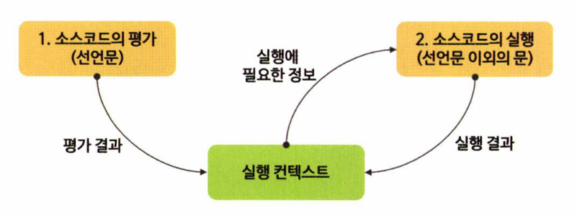
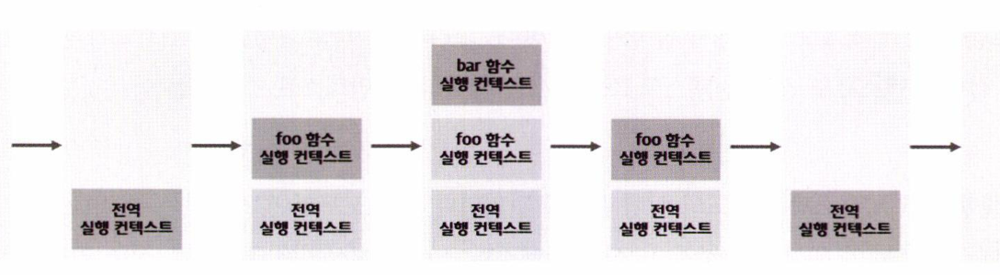
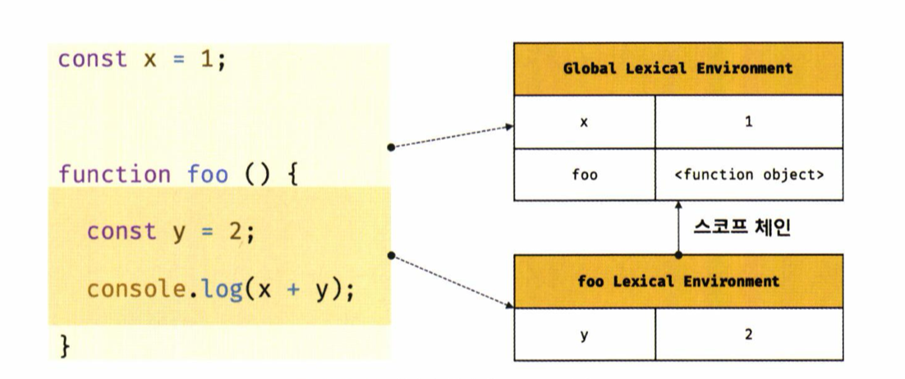
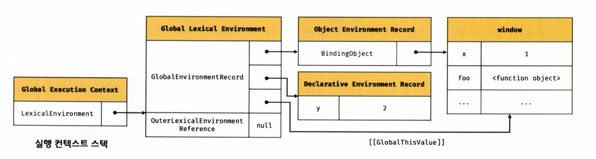
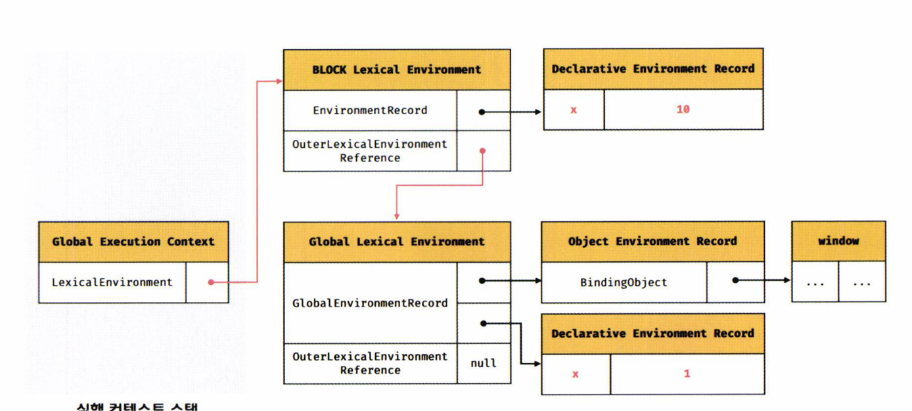

# 실행 컨텍스트

실행 컨텍스트는 자바스크립트의 동작 원리를 담고 있는 핵심 개념입니다. 이를 이해하면 다음과 같은 내용을 알 수 있습니다.

- 스코프와 식별자, 바인딩된 값 관리 방식
- 클로저의 동작 방식
- 태스크 큐와 이벤트 핸들러 및 비동기 처리 방식

## 소스코드의 타입

ECMAScript는 소스코드를 네 가지 타입으로 구분하며, 각 타입의 코드가 실행될 때 생성되는 실행 컨텍스트가 다릅니다.

- 전역 코드 (Global Code): 전역에 존재하는 스크립트를 말합니다. 전역 실행 컨텍스트를 생성하고, 전역 객체와 연결됩니다.
- 함수 코드 (Function Code): 함수 내부에 존재하는 코드입니다. 함수 실행 컨텍스트를 생성하며, 지역 스코프와 연결됩니다.
- eval 코드: eval 함수로 전달되어 실행되는 코드입니다. 독자적인 실행 컨텍스트를 생성합니다.
- 모듈 코드 (Module Code): 모듈별로 독립적인 모듈 스코프를 생성합니다. 모듈 실행 컨텍스트를 생성합니다.

## 실행 컨텍스트의 생성 과정

각 소스코드의 타입에 따라 다음과 같은 실행 컨텍스트가 생성됩니다

- 전역 코드 → 전역 실행 컨텍스트
- 함수 코드 → 함수 실행 컨텍스트
- eval 코드 → eval 실행 컨텍스트
- 모듈 코드 → 모듈 실행 컨텍스트

## 소스코드의 평가와 실행


모든 소스코드는 실행하기 전에 평가 과정을 거치며, 이 과정을 통해 코드를 실행할 준비를 합니다. 자바스크립트 엔진은 소스코드를 두 가지 과정으로 처리합니다.

### 소스코드의 평가

- 소스코드 평가 과정에서는 실행 컨텍스트를 생성하고, 변수와 함수 등의 선언만 먼저 실행하여 생성된 변수나 함수를 실행 컨텍스트에 등록합니다.
- 이 과정에서 스코프를 구성하고 렉시컬 환경(Lexical Environment)에 변수를 등록합니다.
- 비로소 선언문을 제외한 소스코드가 평가가 완료된 후 순차적으로 실행됩니다.

```
var x;
```

### 소스코드의 실행

- 평가가 완료된 후 소스코드가 순차적으로 실행되며, 이때 필요한 변수와 함수의 참조를 스코프 체인에서 검색하여 사용합니다.
- 실행 과정에서 변수와 함수의 값이 변경되면 실행 컨텍스트에 등록된 정보가 업데이트됩니다.

```
x = 1;
```

위 예제 코드에서 자바스크립트 엔진은 다음과 같은 순서로 처리

- 평가 과정

var x; 문을 먼저 실행하여 x 변수를 생성하고, 해당 변수를 실행 컨텍스트에 등록합니다.<br>

이때 x의 값은 undefined로 초기화됩니다.

- 평가 결과:

실행 컨텍스트<br>
x: undefined<br>
실행 과정<br>
x = 1; 문을 실행하여 x의 값을 1로 업데이트합니다.<br>

이때 x 변수가 이미 실행 컨텍스트에 등록되어 있으므로, x의 값을 1로 할당하고 그 결과를 다시 실행 컨텍스트에 저장합니다.<br>

- 실행 결과:

실행 컨텍스트<br>
x: 1

## 실행 컨텍스트의 역할

자바스크립트 엔진이 소스코드를 평가하고 실행하는 과정에서 실행 컨텍스트는 중요한 역할을 수행합니다. 다음 예제를 통해 실행 컨텍스트가 어떻게 동작하는지 살펴보겠습니다

```
// 전역 변수 선언
const x = 1;
const y = 2;

// 함수 정의
function foo(a) {
  // 지역 변수 선언
  const x = 10;
  const y = 20;

  // 메서드 호출
  console.log(a + x + y); // 130
}

// 함수 호출
foo(100);

// 메서드 호출
console.log(x + y); // 3
```

### 전역 코드 평가

전역 코드를 실행하기에 앞서 전역 코드 평가 과정을 거쳐 변수를 실행 컨텍스트에 등록하고 함수 선언문을 평가하여 전역 스코프에 함수 객체를 바인딩합니다. 이때 const 키워드를 사용한 변수 선언과 함수 선언문은 전역 객체의 프로퍼티가 되지 않습니다.

### 전역 코드 실행

전역 코드 평가가 끝나면, 전역 코드를 순차적으로 실행하기 시작합니다. 이때 전역 변수 x와 y에 각각 1과 2의 값이 할당됩니다. 이후 함수 foo가 호출되면서 전역 코드의 실행이 일시 중단되고 함수 코드로 제어가 넘어갑니다.

### 함수 코드 평가

함수 foo가 호출되면 함수 실행 컨텍스트가 생성되고, 함수 코드 평가 과정에서 지역 변수 x와 y가 각각 10과 20으로 초기화됩니다. 이때 함수 매개변수 a도 100으로 초기화됩니다.

### 실행 컨텍스트는 다음과 같은 역할을 합니다

- 선언에 의해 생성된 모든 식별자(변수, 함수, 클래스 등)를 스코프에 등록하고 상태 변화를 관리합니다.
- 스코프 체인을 구성하여 스코프 체인을 통해 상위 스코프로 이동하며 식별자를 검색할 수 있도록 합니다.
- 실행 중인 코드의 실행 순서를 관리하며, 함수 호출에 의한 실행 순서 변동을 처리하고 다시 이전 코드로 돌아갈 수 있도록 합니다.

## 실행 컨텍스트 스택

자바스크립트 엔진은 코드 실행 중에 **실행 컨텍스트 스택(Execution Context Stack)** 을 사용하여 실행 순서를 관리합니다. 각 실행 컨텍스트는 코드의 실행이 시작될 때 생성되며, 코드의 실행이 종료되면 스택에서 제거됩니다.

```
const x = 1;

function foo() {
  const y = 2;

  function bar() {
    const z = 3;
    console.log(x + y + z); // 6
  }

  bar();
}

foo();
```

위 예제에서는 전역 코드, 함수 foo의 코드, 그리고 foo 내부에 정의된 함수 bar의 코드가 포함되어 있습니다. 자바스크립트 엔진은 코드를 평가하고 실행하는 동안 다음과 같은 순서로 실행 컨텍스트를 스택에 푸시(push)하고 팝(pop)합니다.

### 실행 컨텍스트 스택의 동작 과정


전역 코드 평가와 실행

- 자바스크립트 엔진은 먼저 전역 코드를 평가하여 전역 실행 컨텍스트를 생성하고, 이를 실행 컨텍스트 스택에 푸시합니다.
- 전역 코드 평가가 완료되면, const x = 1; 선언문을 실행하고 전역 스코프에 x 값을 1로 할당합니다.
- 이후 foo 함수를 호출하면서 전역 코드의 실행이 일시 중단되고, foo 함수의 실행 컨텍스트가 생성되어 스택에 푸시됩니다.

foo 함수 코드의 평가와 실행

- foo 함수가 호출되면서 함수의 실행이 시작됩니다. foo 함수의 지역 변수 y에 2가 할당되고, foo 내부에서 bar 함수가 호출되면서 bar 함수의 실행 컨텍스트가 생성됩니다.
- 이 시점에 foo 함수는 실행을 일시 중단하고, bar 함수가 실행되기 시작합니다.

bar 함수 코드의 평가와 실행

- bar 함수의 코드가 평가되고 실행 컨텍스트가 스택에 푸시됩니다.
- bar 함수 내의 지역 변수 z에 3이 할당되며, console.log(x + y + z)가 호출됩니다. 이때 x는 전역 스코프의 1, y는 foo 함수 스코프의 2, z는 bar 함수 스코프의 3이므로, console.log는 6을 출력합니다.
- bar 함수의 실행이 종료되면, bar 함수의 실행 컨텍스트는 스택에서 팝됩니다.

foo 함수 코드로 복귀

- bar 함수가 종료된 후 다시 foo 함수의 코드로 복귀합니다.
- foo 함수 내에 더 이상 실행할 코드가 없으므로 foo 함수의 실행도 종료되고, foo 함수의 실행 컨텍스트가 스택에서 팝됩니다.

전역 코드로 복귀

- foo 함수가 종료되면 다시 전역 코드로 복귀합니다.
- 더 이상 실행할 전역 코드가 없으므로 전역 실행 컨텍스트도 스택에서 팝됩니다.

### 실행 컨텍스트 스택의 역할

- 실행 순서 관리

실행 컨텍스트 스택은 코드의 평가 및 실행 순서를 관리합니다. 코드를 평가하면 실행 컨텍스트가 생성되어 스택의 최상위에 쌓이며, 코드의 실행이 종료되면 해당 컨텍스트가 제거됩니다.

- 현재 실행 중인 컨텍스트 파악

실행 컨텍스트 스택의 최상위에 있는 실행 컨텍스트가 언제나 현재 실행 중인 코드의 컨텍스트를 나타냅니다. 이를 **런닝 실행 컨텍스트(Running Execution Context)** 라고 부릅니다.

## 렉시컬 환경 (Lexical Environment)


렉시컬 환경은 식별자(변수, 함수 이름 등)와 그 식별자에 바인딩된 값, 그리고 상위 스코프에 대한 참조를 기록하는 자로 구조로, 실행 컨텍스트를 구성하는 컴포넌트 중 하나입니다. 실행 컨텍스트 스택이 코드의 실행 순서를 관리한다면, 렉시컬 환경은 코드 내의 스코프와 식별자를 관리합니다.

### 렉시컬 환경의 구조

렉시컬 환경은 다음 두 가지로 구성됩니다

- 환경 레코드 (Environment Record):

  - 스코프에 포함된 식별자를 등록하고, 식별자에 바인딩된 값을 관리하는 저장소입니다.
  - 환경 레코드는 소스코드의 타입에 따라 다른 구조를 가질 수 있습니다. 예를 들어, 함수 환경 레코드는 arguments 객체를 포함할 수 있습니다.

- 외부 렉시컬 환경에 대한 참조 (Outer Lexical Environment Reference):

  - 외부 렉시컬 환경에 대한 참조는 상위 스코프와 연결됩니다. 이 참조를 통해 렉시컬 환경은 자신의 상위 스코프에 접근할 수 있으며, 이를 통해 스코프 체인을 형성합니다.
  - 외부 렉시컬 환경에 대한 참조는 상위 스코프의 렉시컬 환경을 가리킵니다. 예를 들어, 함수 내부의 렉시컬 환경은 함수가 정의된 위치의 렉시컬 환경을 참조합니다.

### 예제 코드

```
const x = 1;

function foo() {
  const y = 2;
  console.log(x + y);
}

foo();
```

전역 렉시컬 환경(Global Lexical Environment)

- x -> 1
- foo -> <function object>

foo 함수 렉시컬 환경(foo Lexical Environment)

- y -> 2
- 외부 렉시컬 환경 참조 -> 전역 렉시컬 환경

### 렉시컬 환경의 동작 방식

렉시컬 환경은 함수 호출, 블록 스코프, 전역 스코프 등 다양한 스코프를 관리하며, 실행 컨텍스트 스택의 최상위 실행 컨텍스트에 존재하는 렉시컬 환경이 현재 활성화된 스코프를 나타냅니다. 코드를 실행할 때, 자바스크립트 엔진은 현재 활성화된 렉시컬 환경을 기준으로 식별자를 검색하여 값을 조회하거나 변경합니다.

렉시컬 환경의 이러한 구조는 스코프 체인을 형성하여 상위 스코프로의 접근을 가능하게 하며, 클로저와 같은 고급 기능을 구현할 수 있도록 지원합니다.

## 실행 컨텍스트의 생성과 식별자 검색 과정

렉시컬 환경과 실행 컨텍스트는 자바스크립트 엔진이 코드의 실행 흐름과 변수를 관리하기 위해 사용하는 내부 메커니즘입니다. 렉시컬 환경은 스코프 체인을 통해 식별자를 검색하고, 실행 컨텍스트는 코드의 실행 순서와 상태를 관리합니다.

### 전역 객체 생성

- 전역 객체(Global Object): 전역 코드를 실행하기 전에 자바스크립트 엔진은 전역 객체를 먼저 생성합니다.
- 전역 객체에는 표준 빌트인 객체(예: Math, Date)와 전역 프로퍼티(예: window), 전역 함수 등이 포함됩니다.
- 클라이언트 환경에서는 DOM, BOM 등의 웹 API와 연관된 객체들이 전역 객체에 추가됩니다.

### 전역 코드 평가

전역 코드가 로드되면 자바스크립트 엔진은 전역 코드 평가를 수행합니다. <br>
이 평가는 다음의 순서로 진행됩니다:


- 전역 실행 컨텍스트 생성: 전역 실행 컨텍스트를 생성하고 실행 컨텍스트 스택의 최상위에 추가합니다.
- 전역 렉시컬 환경 생성: 전역 렉시컬 환경을 생성하고 전역 실행 컨텍스트에 바인딩합니다.
- 전역 환경 레코드 생성:
  - 객체 환경 레코드(Object Environment Record): var로 선언된 전역 변수와 함수 선언문을 전역 객체의 프로퍼티로 등록합니다.
  - 선언적 환경 레코드(Declarative Environment Record): let, const로 선언된 변수와 함수 선언문을 등록하고 관리합니다.
- 외부 렉시컬 환경 참조 설정: 전역 렉시컬 환경의 외부 참조는 null로 설정됩니다.

이러한 평가 과정을 통해 전역에 정의된 식별자들이 전역 객체와 렉시컬 환경에 등록됩니다.

### 전역 코드 실행


전역 코드가 평가된 후, 실제로 전역 코드가 실행됩니다. 이때 변수 할당문과 함수 호출이 실행되며, 전역 변수 x와 y에 각각 값이 할당되고, foo() 함수가 호출됩니다. <br>

식별자 검색 과정 <br>
렉시컬 환경에서 식별자를 검색할 때, 자바스크립트 엔진은 현재 실행 컨텍스트의 렉시컬 환경부터 시작하여 다음과 같은 순서로 식별자를 검색합니다

1. 현재 렉시컬 환경의 환경 레코드에서 검색합니다.
2. 현재 환경 레코드에 식별자가 없으면, 외부 렉시컬 환경 참조를 따라 상위 렉시컬 환경으로 이동하여 검색합니다.
3. 이 과정을 **스코프 체인(Scope Chain)** 이라 부르며, 가장 상위 렉시컬 환경(전역 렉시컬 환경)까지 식별자를 찾습니다.
4. 만약 최상위 렉시컬 환경에도 식별자가 존재하지 않으면 ReferenceError가 발생합니다.

```
var x = 1;
const y = 2;

function foo(a) {
  var x = 3;
  const y = 4;

  function bar(b) {
    const z = 5;
    console.log(a + b + x + y + z);
  }

  bar(10);
}

foo(20); // 출력: 42
```

### 실행 컨텍스트와 렉시컬 환경의 역할 정리


- 실행 컨텍스트: 코드의 실행 순서와 상태를 관리합니다. 각각의 함수 호출과 코드 블록 실행마다 새로운 실행 컨텍스트가 생성되고, 실행이 종료되면 스택에서 제거됩니다.
- 렉시컬 환경: 식별자의 선언과 바인딩을 관리합니다. 스코프 체인을 통해 상위 스코프와의 연결을 관리하며, 코드의 스코프 체계를 유지합니다.

## 실행 컨텍스트와 블록 레벨 스코프

### 블록 레벨 스코프란?

- 자바스크립트의 let과 const 키워드는 **블록 레벨 스코프(block-level scope)** 를 따릅니다.
- 블록 레벨 스코프는 함수 코드 블록뿐만 아니라 모든 코드 블록(예: if, for, while, try/catch 문 등)을 하나의 독립된 스코프로 간주하여 변수를 관리합니다.
- 반면, var 키워드는 오로지 함수의 코드 블록만을 지역 스코프로 인식하며, 함수 외의 코드 블록에서는 전역 또는 함수 스코프에 변수를 바인딩합니다.

```
let x = 1;

if (true) {
  let x = 10;
  console.log(x); // 10
}

console.log(x); // 1
```

- 위 예제에서 if 문 코드 블록 내부에 let x = 10;이라는 변수가 선언되어 있습니다.
- let 키워드로 선언된 변수 x는 if 문 블록의 블록 레벨 스코프를 따릅니다.
- 따라서, if 문이 실행될 때 새로운 렉시컬 환경이 생성되고, 이 새로운 환경에는 x가 10으로 초기화됩니다.
- console.log(x);가 if 블록 내부에서 호출될 때, 이 x는 if 블록의 렉시컬 환경에서 10을 참조합니다.
- if 문 블록이 종료되면, if 블록에서 생성된 렉시컬 환경은 제거되고 이전 전역 렉시컬 환경으로 돌아갑니다.
- 그 후, 전역 스코프에서 console.log(x);를 호출하면 전역 환경에 있는 x의 값인 1이 출력됩니다.

### 렉시컬 환경의 교체 및 복귀



if 문 블록이 실행될 때:

- 기존의 전역 렉시컬 환경은 유지됩니다.
- 새로운 렉시컬 환경(블록 렉시컬 환경)이 생성되고, 이 블록 렉시컬 환경의 외부 참조는 전역 렉시컬 환경을 가리킵니다.
- 새로운 환경 레코드가 생성되며, 이 레코드에는 x = 10이 저장됩니다.

if 문 블록이 종료될 때:

- if 문 블록에서 생성된 렉시컬 환경이 제거됩니다.
- 다시 이전의 전역 렉시컬 환경으로 돌아갑니다.
- 이로 인해 전역 렉시컬 환경에 있는 x의 값인 1이 유지됩니다.

### 블록 레벨 스코프의 렉시컬 환경 관리

- 블록 레벨 스코프는 반복문이나 조건문 내에서 반복적으로 실행될 때, 각 블록 실행마다 새로운 렉시컬 환경이 생성되어 블록 내의 변수들을 관리합니다.
- 예를 들어, for 문 내부에 let 키워드를 사용한 변수를 선언한 경우, 각 반복마다 새로운 렉시컬 환경이 생성됩니다.
- 이를 통해 for 문 블록 내의 변수가 반복문 내에서 각각의 값과 상태를 유지할 수 있습니다.

# 클로저

