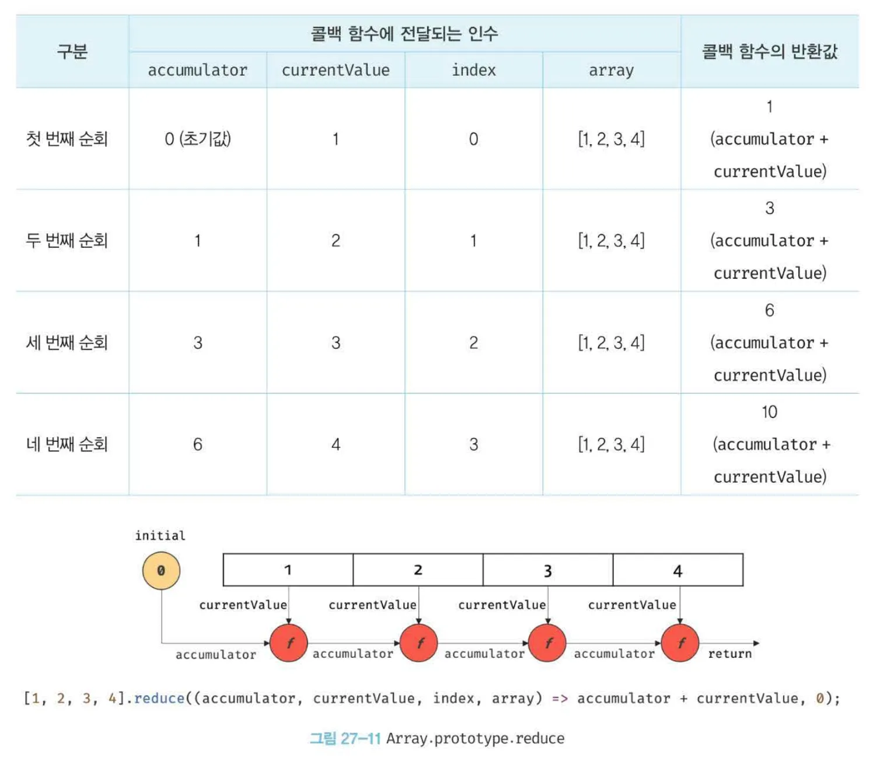

# ES6 함수의 추가 기능

## 26.1 함수의 구분

ES6 이전의 모든 함수는 일반 함수로서 호출할 수 있는 것은 물론 생성자 함수로서 호출할 수 있다.

ES6 이전의 모든 함수는 `callable` 이면서 `constructor` 다.

<details>

<summary>callable과 constructor/non-constructor</summary>

호출할 수 있는 함수 객체를 `callable` 라고 하며, 인스턴스를 생성할 수 있는 함수 객체를 `constructor` , 인스턴스를 생성할 수 없는 함수 객체를 `non-constructor` 라고 부른다.

</details>

- ES6 이전의 모든 함수는 사용 목적에 따라 명확한 구분이 없으므로 호출 방식에 특별한 제약이 없고 생성자 함수로 호출되지 않아도 프로토타입 객체를 생성한다.
- 이는 혼란스러우며 실수를 유발할 가능성이 있고 성능에도 좋지 않다.

ES6에서는 사용 목적에 따라 세 가지 종류로 명확히 구분했다.

| ES6 함수의 구분    | constructor | prototype | super | arguments |
| ------------------ | ----------- | --------- | ----- | --------- |
| 일반 함수(Normal)  | O           | O         | X     | O         |
| 메서드(Method)     | X           | X         | O     | O         |
| 화살표 함수(Arrow) | X           | X         | X     | X         |

## 26.2 메서드

- **메서드는 메서드 축약 표현으로 정의된 함수만을 의미한다.**
- 메서드는 인스턴스를 생성할 수 없는 `non-constructor` 이므로 생성자 함수로서 호출할 수 없다.

```jsx
const obj = {
	x: 1,
	// foo는 메서드다.
	foo() { return this.x; }.
	// bar에 바인딩된 함수는 메서드가 아닌 일반 함수다.
	bar: function() {return this.x; }
}

console.log(obj.foo()); // 1
console.log(obj.bar()); // 1

new obj.foo(); // TypeError
new obj.bar(); // bar {}
```

## 26.3 화살표 함수

- **화살표 함수는 `function` 키워드 대신 화살표 `=>` 를 사용하여 기존 함수 정의 방식보다 간략하게 함수를 정의할 수 있다.**
- 콜백 내부에서 `this` 가 전역 객체를 가리키는 문제를 해결하기 위한 대안으로 유용하다.

### 화살표 함수 정의

```jsx
const multiply = (x, y) => x * y;
multiply(2, 3); // -> 6
```

- **매개변수 선언**
  - 매개변수가 여러 개인 경우 소괄호 안에 매개변수를 선언한다.
  - 매개 변수가 한 개인 경우 소괄호를 생략할 수 있다.
  - 매개 변수가 없는 경우 소괄호를 생략할 수 없다.
- **함수 몸체 정의**
  - 몸체가 하나의 문으로 구성된다면 중괄호를 생략할 수 있다.
  - 함수 몸체가 여러 개의 문으로 구성되어 있다면 중괄호를 생략할 수 없다. 이때 반환값이 있다면 명시적으로 반환해야 한다.

### 화살표 함수와 일반 함수의 차이

- **화살표 함수는 인스턴스를 생성할 수 없는 `non-constructor` 다.**
- **중복된 매개변수 이름을 선언할 수 없다.**
  - 일반 함수는 중복된 매개변수 이름을 선언해도 에러가 발생하지 않는다.
    - 단, `strict monde` 에서 중복된 매개변수 이름을 선언하면 에러가 발생한다.
  - 화살표 함수에서도 중복된 매개변수 이름을 선언하면 에러가 발생한다.
- **화살표 함수는 함수 자체의 `this` , `arguments` , `super` , `new.target` 바인딩을 갖지 않는다.**
  - 화살표 함수 내부에서는 스코프 체인을 통해 상위 스코프의 `this` , `arguments` , `super` , `new.target` 을 참조한다.
  - 만약 화살표 함수가 중첩되어 있다면 상위 화살표 함수에도 바인딩이 없으므로 스코프 체인 상에서 가장 가까운 상위 함수 중에서 화살표 함수가 아닌 `this` , `arguments` , `super` , `new.target` 을 참조한다.

### this, super, argument

- 화살표 함수는 함수 자체의 `this` , `super` , `argument` 바인딩을 갖지 않는다.
- 따라서 화살표 함수 내부에서 참조하면 상위 스코프를 그대로 참조한다.

## 26.4 Rest 파라미터

### 기본 문법

- `Rest` 파라미터(나머지 매개변수)는 매개변수 이름 앞에 세개의 점 `…` 을 붙여서 정의한 매개변수를 의미한다.
- `Rest` 파라미터는 **함수에 전달된 인수들의 목록을 배열로 전달받는다.**
- 일반 매개변수와 `Rest` 파라미터는 함께 사용할 수 있으며, Rest 파라미터는 반드시 마지막 파라미터이어야 한다.
- `Rest` 파라미터는 단 하나만 선언할 수 있다.
- `Rest` 파라미터는 함수 정의 시 선언한 매개변수 개수를 나타내는 함수 객체의 `length` 프로퍼티에 영향을 주지 않는다.

```jsx
function foo(param1, param2, ...rest) {
  console.log(param1); // 1
  console.log(param2); // 2
  console.log(rest); // [3, 4, 5]
}

foo(1, 2, 3, 4, 5);
console.log(foo.length); // 2
```

### Rest 파라미터와 arguments 객체

- ES5에서는 함수를 정의할 때 매개변수의 개수를 확정할 수 없는 가변 인자 함수의 경우 매개변수를 통해 인수를 전달받는 것이 불가능하므로 `arguments` 객체를 활용하여 인수를 전달받았다.
- `arguments` 객체는 함수 호출 시 전달된 인수들의 정보를 담고 있는 순회 가능한 유사 배열 객체이며, 함수 내부에서 지역 변수처럼 사용할 수 있다.
- 하지만 `arguments` 객체는 배열이 아닌 유사 배열 객체이므로 배열 메서드를 사용하려면 `Function.prototype.call` 이나 `Function.prototype.apply` 메서드를 사용해 `arguments` 객체를 배열로 변환해야하는 번거로움이 있었다.
- **ES6에서는 `rest` 파라미터를 사용하여 가변 인자 함수의 인수 목록을 배열로 직접 전달 받을 수 있다.**
  - 이를 통해 유사 배열 객체인 `arguments` 객체를 배열로 변환하는 번거로움을 피할 수 있다.
- 함수와 ES6 메서드는 `Rest` 파라미터와 `arguments` 객체를 모두 사용할 수 있다.
  - 하지만 화살표 함수 자체의 `arguments` 객체를 갖지 않으며, 외부 스코프의 `arguments` 를 참조한다.
- 따라서 화살표 함수로 가변 인자 함수를 구현해야 할 때는 반드시 `Rest` 파라미터를 사용해야 한다.

## 26.5 매개변수 기본값

**자바스크립트 엔진이 매개변수의 개수와 인수의 개수를 체크하지 않기 때문에, 함수를 호출할 때 매개변수의 개수만큼 인수를 전달하지 않는 경우가 발생한다.**

- 매개변수에 인수가 전달되었는지 확인하여 인수가 전달되지 않은 경우 매개변수에 기본값을 할당할 필요가 있다.

```jsx
function sum(x, y) {
  // 인수가 전달되지 않아 매개변수의 값이 undefined인 경우 기본값을 할당한다.
  x = x || 0;
  y = y || 0;

  return x + y;
}
```

- Es6에서 도입된 **매개변수 기본값을 사용하면 함수 내에서 수행하던 인수 체크 및 초기화를 간소화 할 수 있다.**
  - 매개변수 기본값은 매개변수에 인수를 전달하지 않은 경우와 `undefined` 를 전달한 경우에만 유효하다.
  - `Rest` 파라미터에는 기본값을 저장할 수 없다.

```jsx
function logName(name = "Lee") {
  console.log(name);
}

logName(); // Lee
logName(undefined); // Lee
logName("Kim"); // Kim
logName(null); // null
```

# 27. 배열

## 27.1 배열이란?

**배열(array)은 여러 개의 값을 순차적으로 나열한 자료구조다.**

- 배열이 가지고 있는 값을 **요소(element)** 라고 부른다.
  - 자바스크립트의 모든 값은 배열의 요소가 될 수 있다.
- 배열의 요소는 자신의 위치를 나타내는 **인덱스(index)** 를 갖는다.
  - 인덱스는 0부터 시작한다.
- 요소에 접근할 때는 대괄호 표기법을 사용한다.
  - 대괄호 내에는 접근하고 싶은 요소의 인덱스를 지정한다.
- 배열은 요소의 개수, 즉 배열의 길이를 나타내는 **length 프로퍼티**를 갖는다.
- 배열은 객체 타입이다.

| 구분            | 객체                      | 배열          |
| --------------- | ------------------------- | ------------- |
| 구조            | 프로퍼티 키와 프로퍼티 값 | 인덱스와 요소 |
| 값의 참조       | 프로퍼티 키               | 인덱스        |
| 값의 순서       | X                         | O             |
| length 프로퍼티 | X                         | O             |

- 일반 객체와 배열을 구분하는 가장 명확한 차이는 `값의 순서` 와 `length 프로퍼티` 다.

```jsx
const arr = ["apple", "banana", "orange"];

arr[0]; // -> 'apple'
arr[1]; // -> 'banana'
arr[2]; // -> 'orange'

arr.length; // -> 3
typeof arr; // -> object
```

## 27.2 자바스크립트 배열은 배열이 아니다

자료구조에서 말하는 배열은 동일한 크기의 메모리 공간이 빈틈없이 연속적으로 나열된 자료구조를 말한다.

즉, 배열의 요소는 하나의 데이터 타입으로 통일되어 있으며 서로 연속적으로 인접해 있다. 이러한 배열을 **밀집 배열(dense array)** 이라 한다.

자바스크립트의 배열은 지금까지 살펴본 자료구조에서 말하는 일반적인 의미의 배열과 다르다.

- 배열의 요소를 위한 각각의 메모리 공간은 동일한 크기를 갖지 않아도 되며, 연속적으로 이어져 있지 않을 수도 있다.
- 배열의 요소가 연속적으로 이어져 있지 않는 배열을 **희소 배열(sparse array)** 이라 한다.
- 따라서 자바스크립트의 배열은 **일반적인 배열의 동작을 흉내 낸 특수한 객체**다.

- **일반적인 배열과 자바스크립트 배열의 장단점**
  - 일반적인 배열은 인덱스로 요소에 빠르게 접근할 수 있지만, 요소를 삽입 또는 삭제하는 경우에는 효율적이지 않다.
  - 자바스크립트 배열은 해시 테이블로 구현된 객체이므로 인덱스로 요소에 접근하는 경우 일반적인 배열보다 성능적인 면에서 느릴 수밖에 없는 구조적인 단점이 있다.
    - 하지만 **요소를 삽입 또는 삭제하는 경우에는 일반적인 배열보다 빠른 성능을 기대할 수 있다.**

## 27.3 length 프로퍼티와 희소 배열

`length` 프로퍼티는 요소의 개수, 즉 배열의 길이를 나타내는 0 이상의 정수를 값으로 갖는다.

- `length` 프로퍼티의 값은 배열에 요소를 추가하거나 삭제하면 자동 갱신된다.
- 배열의 길이를 바탕으로 결정되지만, 임의의 숫자 값을 명시적으로 할당할 수 있다.
  - 현재 값보다 작은 숫자 값을 할당하면 배열의 길이가 줄어든다.
  - 현재 `length` 프로퍼티 값보다 큰 숫자 값을 할당하면 `length` 프로퍼티 값은 변경되지만 실제로 배열의 길이가 늘어나지는 않는다.
- 배열의 요소가 연속적으로 위치하지 않고 일부가 비어 있는 배열을 희소 배열이라 한다.

  - 희소 배열의 `length` 프로퍼티 값은 요소의 개수와 일치하지 않는다.
  - 희소 배열의 길이는 희소 배열의 실제 요소 개수보다 언제나 크다.

- 배열을 생성할 경우에는 희소 배열을 생성하지 않도록 주의하고, 같은 타입의 요소를 연속적으로 위치시키는 것이 최선이다.

```jsx
// 희소 배열
const sparse = [, 2, , 4];

// 희소 배열의 length 프로퍼티 값은 요소의 개수와 일치하지 않는다.
console.log(sparse.length); // 4
console.log(sparse); // [empty, 2, empty, 4]
```

## 27.4 배열 생성

### 배열 리터럴

**배열 리터럴은 0개 이상의 요소를 쉼표로 구분하여 대괄호로 묶는다.**

- 배열 리터럴은 객체 리터럴과 달리 프로퍼티 키가 없고 값만 존재한다.
- 배열 리터럴에 요소를 하나도 추가하지 않으면 배열의 길이는 0인 배열이 된다.
- 배열 리터럴에 요소를 생성하면 희소 배열이 생성된다.
  - 희소 배열의 값에 인덱스로 접근하면 프로퍼티가 존재하지 않기 때문에 `undefined` 가 출력된다.

```jsx
const arr = [1, 2, 3];
console.log(arr.length); // 3

const arr1 = [];
console.log(arr1.length);
0;

const arr2 = [1, , 3]; // 희소 배열
// 희소 매열의 length는 배열의 실제 요소 개수보다 언제나 크다.
console.log(arr2.length); // 3
console.log(arr); // [1, empty, 3]
console.log(arr[1]); // undefined
```

### Array 생성자 함수

**`Object` 생성자 함수를 통해 객체를 생성할 수 있듯이 `Array` 생성자 함수를 통해 배열을 생성할 수 있다.**

- `Array` 생성자 함수는 전달된 인수의 개수에 따라 다르게 동작하므로 주의가 필요하다.
  - 전달된 인수가 1개고 숫자인 경우 `length` 프로퍼티 값이 인수인 배열을 생성한다.
    - 이때 생성된 배열은 희소 배열이다.
  - 전달된 인수가 없는 경우 빈 배열을 생성한다.
    - 배열 리터럴 [] 과 같다.
  - 전달된 인수가 2개 이상이거나 숫자가 아닌경우 인수를 요소로 갖는 배열을 생성한다.
- `Array` 생성자 함수는 `new` 연산자와 함께 호출하지 않더라도 배열을 생성하는 생성자 함수로 동작한다.

```jsx
const arr = new Array(10);

console.log(arr); // [empty * 10]
console.log(arr.length); // 10

new Array(); // -> []

// 전달된 인수가 2개 이상이면 인수를 요소로 갖는 배열을 생성한다.
new Array(1, 2, 3); // [1, 2, 3]

// 전달된 인수가 1개지만 숫자가 아니면 인수를 요소로 갖는 배열을 생성한다.
new Array({}); // -> [{}]
```

### Array.of

**ES6에서 도입된 `Array.of` 메서드는 전달된 인수를 요소로 갖는 배열을 생성한다.**

- `Array.of` 는 `Array` 생성자 함수와 다르게 전달된 인수가 1개이고 숫자이더라도 인수를 요소로 갖는 배열을 생성한다.

```jsx
// 전달된 인수가 1개이고 숫자이더라도 인수를 요소로 갖는 배열을 생성한다.
Array.of(1); // -> [1]
Array.of(1, 2, 3); // -> [1, 2, 3]
Array.of("string"); // -> ['string']
```

### Array.from

**ES6에서 도입된 `Array.from` 메서든느 유사 배열 객체 또는 이터러블 객체를 인수로 전달받아 배열로 변환하여 반환한다.**

- `Array.from` 을 사용하면 두 번째 인수로 전달한 콜백 함수를 통해 값을 만들면서 요소를 채울 수 있다.
- 두 번째 인수로 전달한 콜백 함수에 **첫 번째 인수에 의해 생성된 배열의 요소값과 인덱스를 순차적으로 전달하면서 호출**하고 **콜백 함수의 반환값으로 구성된 배열을 반환**한다.

```jsx
// 유사 배열 객체를 변환하여 배열을 생성한다.
Array.from({ length: 2, 0: 'a', 1: 'b' }); // -> ['a', 'b']

// 이터러블을 변환하여 배열을 생성한다. 문자열은 이터러블이다.
Array.from('Hello'); -> ['H', 'e', 'l', 'l', 'o']

// Array.from에 length만 존재하는 유사 배열 객체를 전달하면 undefined를 요소로 채운다.
Array.from({ length: 3 }); // -> [undefined, undefined, undefined]

// Array.from은 두 번째 인수로 전달한 콜백 함수의 반환값으로 구성된 배열을 반환한다.
Array.from({ length: 3 }, (_, i) => i); // -> [0, 1, 2]
```

## 27.5 배열 요소의 참조

**배열의 요소를 참조할 때는 대괄호 표기법을 사용한다.**

- 대괄호 안에는 인덱스가 와야한다.
- 인덱스는 값을 참조할 수 있다는 의미에서 객체의 프로퍼티 키와 같은 역할을 한다.
  - 존재하지 않는 요소에 접근하면 `undefined` 가 반환된다.
  - 같은 이유로 희소 배열의 존재하지 않는 요소를 참조해도 `undefined` 가 반환된다.

```jsx
const arr = [1, 2];

// 인덱스가 0인 요소를 참조
console.log(arr[0]); // 1
// 인덱스가 1인 요소를 참조
console.log(arr[1]); // 2
// 존재하지 않는 요소를 참조할 경우
console.log(arr[2]); // undefined
```

## 27.6 배열 요소의 추가와 갱신

**존재하지 않는 인덱스를 사용해 값을 할당하면 새로운 요소가 추가된다.** 이때 `length` 프로퍼티 값은 자동 갱신된다.

- 만약 현재 배열의 길이보다 큰 인덱스로 새로운 요소를 추가하면 희소 배열이 된다.
- 이미 요소가 존재하는 요소에 값을 재할당하면 요소의 값이 갱신된다.
- 인덱스는 요소의 위치를 나타내므로 반드시 0 이상의 정수를 사용해야 한다.
  - 정수 이외의 값을 인덱스처럼 사용하면 요소가 생성되는 것이 아니라 프로퍼티가 생성된다.
  - 이때 추가된 프로퍼티는 `length` 프로퍼티 값에 영향을 주지 않는다.

```jsx
const arr = [0];

// 배열 요소의 추가
arr[1] = 1;

console.log(arr); // [0, 1]
console.log(arr.length); // 2

arr[100] = 100;
console.log(arr); // [0, 1, empty * 98, 100]
console.log(arr.length); // 101

// 요소 값의 갱신
arr[1] = 10;

console.log(arr); // [0, 10, empty * 98, 100]
```

```jsx
const arr = [];

// 배열 요소의 추가
arr[0] = 1;
arr["1"] = 2;

// 프로퍼티 추가
arr["foo"] = 3;
arr.bar = 4;
arr[1.1] = 5;
arr[-1] = 6;

console.log(arr); // [1, 2, foo: 3, bar: 4, '1.1': 5, '-1': 6]

//프로퍼티는 length에 영향을 주지 않는다.
console.log(arr.length); // 2
```

## 27.7 배열 요소의 삭제

**배열은 사실 객체이기 때문에 배열의 특정 요소를 삭제하기 위해 `delete` 연산자를 사용할 수 있다.**

- `delete` 연산자는 객체의 프로퍼티를 삭제한다.
  - 이때 희소 배열이 되며 `length` 프로퍼티 값은 변하지 않는다.
  - 따라서 희소 배열을 만드는 `delete` 연산자는 사용하지 않는 것이 좋다.
- 희소 배열을 만들지 않으면서 배열의 특정 요소를 완전히 삭제하려면 `Array.prototype.splice` 메서드를 사용한다.

```jsx
const arr = [1, 2, 3];

// 배열 요소의 삭제
delete arr[1];
console.log(arr); // [1, empty, 3]

// length 프로퍼티에 영향을 주지 않는다. 즉, 희소 배열이 된다.
console.log(arr.length); // 3
```

```jsx
const arr = [1, 2, 3];

// Array.prototype.splice(삭제를 시작할 인스턴스, 삭제할 요소 수)
// arr[1]부터 1개의 요소를 제거
arr.splice(1, 1);
console.log(arr); // [1, 3]

// length 프로퍼티가 자동 갱신된다.
console.log(arr.lengt); // 2
```

## 27.8 배열 메서드

**자바스크립트는 배열을 다룰 때 유용한 다양한 빌트인 메서드를 제공한다.**

- 배열에는 원본 배열(배열 메서드를 호출한 배열, 즉 배열 메서드의 구현체 내부에서 `this` 가 가리키는 객체)을 직접 변경하는 메서드
- 원본 배열을 직접 변경하지 않고 새로운 배열은 생성하여 반환하는 메서드 두 종류가 있다.

### Array.isArray

**`Array.isArray` 메서드는 전달된 인수가 배열이면 `true` , 배열이 아니면 `false` 를 반환한다.**

### Array.prototype.indexOf

**`indexOf` 메서든느 원본 배열에서 인수로 전단된 요소를 검색하여 인덱스를 반환한다.**

- 원본 배열에 인수로 전달한 요소와 중복되는 요소가 여러 개 있다면 첫 번째로 검색된 요소의 인덱스를 반환한다.
- 원본 배열에 인수로 전달한 요소가 존재하지 않으면 -1을 반환한다.
- 배열의 특정 요소가 존재하는지 확인할 때 유용하다.
- `indexOf` 메서드 대신 ES7에서 도입된 `Array.prototype.includes` 메서드를 사용하면 가독성이 더 좋다.

### Array.prototype.push

**`push` 메서드는 인수로 전달받은 모든 값을 원본 배열의 마지막 요소로 추가하고 변경된 `length` 프로퍼티 값을 반환한다.**

- `push` 메서드는 원본 배열을 직접 변경한다.
- `push` 메서드는 성능 면에서 좋지 않다.
  - 마지막 요소로 추가할 요소가 하나뿐이라면 `length` 프로퍼티를 사용하여 배열의 마지막 요소에 직접 추가할 수도 있다.
  - 이 방법이 `push` 메서드보다 더 빠르다.
- `push` 메서드 보다스프레드 문법을 사용하는 편이 좋다.
  - 함수 호출 없이 표현식으로 마지막에 요소를 추가할 수 있으며 부수 효과도 없다.

### Array.prototype.pop

**`pop` 메서드는 원본 배열에서 마지막 요소를 제거하고 요소를 반환한다.**

- 원본 배열이 빈 배열이면 `undefined` 를 반환한다.
- 원본 배열을 직접 변경한다.
- `pop` 과 `push` 메서드를 사용하면 스택을 쉽게 구현할 수 있다.

### Array.prototype.unshift

**`unshift` 메서드는 인수로 전달받은 모든 값을 원본 배열의 선두에 요소로 추가하고 변경된 `length` 프로퍼티 값을 반환한다.**

- 원본 배열을 직접 변경한다.
- `unshift` 메서드보다 스프레드 문법을 사용하는 것이 좋다.
  - 함수 호출 없이 표현식으로 선두에 요소를 추가할 수 있으며 부수효과도 없다.

### Array.prototype.shift

**`shift` 메서드는 원본 배열에서 첫 번째 요소를 제거하고 생성자 요소를 반환한다.**

- `shieft` 메서드와 `push` 메서드를 사용하면 큐를 쉽게 구현할 수 있다.

### Array.prototype.concat

**`concat` 메서드는 인수로 전달된 값들(배열 또는 원시값)을 원본 배열의 마지막 요소로 추가한 새로운 배열을 반환한다.**

- 인수로 전달한 값이 배열인 경우 배열을 해체하여 새로운 배열의 요소로 추가한다.
- 원본 배열은 변경되지 않는다.
- `concat` 메서드는 ES6의 스프레드 문법으로 대처할 수 있다.
- `push/unshift` 메서드와 `concat` 메서드를 사용하는 대신에 스프레드 문법을 일관성있게 사용하는 것이 좋다.

### Array.prototype.splice

**원본 배열의 중간에 요소를 추가하거나 중간에 있는 요소를 제거하는 경우 `splice` 메서드를 사용한다.**

- 원본 배열을 직접 변경한다.
- `start` - 원본 배열의 요소를 제거하기 시작할 인덱스
  - `start` 만 지정하면 원본 배열의 `start` 부터 모든 요소를 제거한다.
  - 음수인 경우 배열의 끝에서의 인덱스를 나타낸다.
- `deleteCount` - 원본 배열의 요소를 제거하기 시작할 인덱스인 `start` 부터 제거할 요소의 개수다.
  - 0인 경우 아무런 요소도 제거되지 않는다.
- `items` - 제거한 위치에 삽입할 요소들의 목록이다.
  - 생략한 경우 원본 배열에서 요소들을 제거하기만 한다.

### Array.prototype.slice

**`slice` 메서드는 인수로 전달된 범위의 요소들을 복사하여 배열로 반환한다.**

- 원본 배열은 변경되지 않는다.
  - `splice` 메서드는 원본 배열을 변경한다.
- 두 개의 매개변수를 갖는다.
  - `start` - 복사를 시작할 인덱스다.
    - 음수인 경우 끝에서의 인덱스를 나타낸다.
  - `end` - 복사를 종료할 인덱스다.
    - 이 인덱스에 해당하는 요소는 복사되지 않는다.
- 인수를 모두 생략하면 원본 배열의 복사본을 생성한다.
- 이때 생성된 복사는 얕은 복사를 통해 생성된다.

### Array.prototype.join

**`join` 메서드는 원본 배열의 모든 요소를 문자열로 변환한 후, 인수로 전달받은 문자열, 즉 구분자로 연결한 문자열을 반환한다.**

- 구분자는 생략 가능하며 기본 구분차는 콤마(,)이다,

### Array.prototype.reverse

**`reverse` 메서드는 원본 배열의 순서를 반대로 뒤집는다.**

- 원본 배열이 변경된다.
- 반환값은 변경된 배열이다.

### Array.prototype.fill

ES6에서 도입된 `fill` 메서드는 인수로 전달받은 값을 배열의 처음부터 끝까지 요소로 채운다.

- 원본 배열이 변경된다.
- 두 번째 인수로 요소 채우기를 시작할 인덱스를 정할 수 있다.
- 세 번째 인수로 요소 채우기를 멈출 인덱스를 정할 수 있다.
- `fill` 메서드를 사용하면 배열을 생성하면서 특정 값으로 요소를 채울 수 있다.

### Array.prototype.includes

**ES7에서 도입된 `includes` 메서드는 배열 내에 특정 요소가 포함되어 있는지 확인하여 `true` 또는 `false` 를 반환한다.**

- 첫 번째 인수로 검색할 대상을 지정한다.
- 두 번째 인수로 검색을 시작할 인덱스를 전달할 수 있다.
  - 생략할 경우 기본값 0이 설정된다.
- 배열에서 인수로 전달된 요소를 검색하여 인덱스를 반환하는 `indexOf` 메서드를 사용하여도 배열 내에 특정 요소가 포함되어 있는지 확인할 수 있다.
  - 하지만 `indexOf` 를 사용하면 반환값이 `-1` 인지 확인해 보아야하고 배열에 `NaN` 이 포함되어 있는지 확인할 수 없다는 문제가 있다.

### Array.prototype.flat

**ES10에서 도입된 `flat` 메서드는 인수로 전달한 깊이만큼 재귀적으로 배열을 평탄화한다.**

- 중첩 배열을 평탄화할 깊이를 인수로 전달할 수 있다.
  - 인수를 생략할 경우 기본값은 1이다
  - 인수로 `Infinity` 를 전달하면 중첩 배열 모두를 평탄화한다.

<details>
<summary>예제</summary>

```jsx
[1, [2, [3, [4]]]]
  .flat() // -> [1, 2, [3, [4]]]
  [(1, [2, [3, [4]]])].flat(2); // -> [1, 2, 3, [4]]]
```

</details>

## 27.9 배열 고차 함수

**고차 함수(Higher-Order Function)는 함수를 인수로 전달받거나 함수를 반환하는 함수를 말한다.**

### Array.prototype.sort

**`sort` 메서드는 배열의 요소를 정렬한다.**

- 원본 배열을 직접 변경하며 정렬된 배열을 반환한다.
- `sort` 메서드는 기본적으로 오름차순으로 요소를 정리한다.
  - 내림차순으로 요소를 정렬하려면 `sort` 메서드를 사용하여 오름 차순으로 정렬한 후 `reverse` 메서드를 사용하여 요소의 순서를 뒤집는다.
- `sort` 메서드의 기본 정렬 순서는 유니코드 코드 포인트의 순서를 따른다.
  - 숫자로 이루어진 요소도 유니코드로 정렬하기 때문에 주의가 필요하다.
  - 따라서 숫자 요소를 정렬할 때는 `sort` 메서드에 **정렬 순서를 정의하는 비교 함수를 인수로 전달해야 한다.**
  - 비교 함수는 양수나 음수 또는 0을 반환해야 한다.
  - 비교 함수의 반환값이 0보다 작으면 비교 함수의 첫 번째 인수를 우선하여 정렬하고, 0이면 정렬하지 않으며, 0보다 크면 두 번째 인수를 우선하여 정렬한다.

### Array.prototype.forEach

**`forEach` 메서드는 `for` 문을 대체할 수 있는 고차 함수다.**

- `forEach` 메서드는 자신의 내부에서 반복문을 실행한다.
- `forEach` 메서드는 반복문을 추상화한 고차 함수로서 내부에서 반복문을 통해 자신을 호출한 배열을 순회하면서 수행해야 할 처리를 콜백 함수로 전달받아 반복 호출한다.
- `forEach` 메서드는 콜백 함수를 호출하면서 3개(요소값, 인덱스, this)의 인수를 전달한다.

### Array.prototype.map

**map 메서드는 자신을 호출한 배열의 모든 요소를 순회하면서 인수로 전달받은 콜백 함수를 반복 호출한다.**

- **콜백 함수의 반환값들로 구성된 새로운 배열을 반환한다.**
- `map` 메서드가 생성하여 반환하는 새로운 배열의 `length` 프로퍼티 값은 `map` 메서드를 호출한 배열의 `length` 프로퍼티 값과 반드시 일치한다.
  - 즉, `map` 메서드를 호출한 배열과 `map` 메서드가 생성하여 반환한 배열은 1:1 매핑한다.
- `forEach` 메서드와 마찬가지로 3개(요소값, 인덱스, this)의 인수를 전달한다.

### Array.prototype.filter

**`filter` 메서드는 자신을 호출한 배열의 모든 요소를 순회하면서 인수로 전달받은 콜백 함수를 반복 호출한다.**

- **콜백 함수의 반환값이 `true` 인 요소로만 구성된 새로운 배열을 반환한다.**
- 원본 배열은 변경되지 않는다.
- `filter` 메서드는 자신을 호출한 배열에서 필터링 조건을 만족하는 특정 요소만 추출하여 새로운 배열을 만들고 싶을 때 사용한다.
- `filter` 메서드가 생성하여 반환한 새로운 배열의 `length` 프로퍼티 값은 `filter` 메서드를 호출한 배열의 `length` 프로퍼티 값과 같거나 작다.
- 콜백함수를 호출하면서 3개(요소값, 인덱스, this)의 인수를 전달한다.
- `filter` 메서드는 자신을 호출한 배열에서 특정 요소를 제거하기 위해 사용할 수도 있다.
  - 특정 요소를 제거할 경우 특정 요소가 중복되어 있다면 중복된 요소가 모두 제거된다.
  - 특정 요소를 하나만 제거하려면 `indexOf` 메서드를 통해 특정 요소의 인덱스를 취득한 다음 `splice` 메서드를 사용한다.

### Array.prototype.reduce

**`reduce` 메서드는 자신을 호출한 배열을 모든 요소를 순회하며 인수로 전달받은 콜백 함수를 반복 호출한다.**

- 콜백 함수의 반환값을 다음 순회 시에 콜백 함수의 첫 번째 인수로 전달하면서 콜백 함수를 호출하여 **하나의 결과값을 만들어 반환한다.**
- 원본 배열은 변경되지 않는다.
- `reduce` 메서드는 첫 번째 인수로 콜백 함수, 두 번째 인수로 초기값을 전달받는다.
  - 콜백함수에는 4개의 인수로 `초기값 또는 콜백 함수의 이전 반환값`, `reduce 메서드를 호출한 배열의 요소값과 인덱스`, `reduce 메서드를 호출한 배열 자체. 즉 this` 가 전달된다.
- 평균 구하기, 최대값 구하기(Math.max가 더 직관적임), 요소의 중복 횟수 구하기, 중첩 배열 평탄화(flat 메서드가 더 직관적임), 중복 요소 제거(filter 메서드가 더 직관적임 또는 Set을 사용할 수도 있다.) 등에 사용된다.

```jsx
// 1부터 4까지 누적을 구한다.
const sum = [1, 2, 3, 4].reduce(
  (accumlator, currentValue, index, array) => accumulator + currentValue,
  0
);

console.log(sum); // 10
```



- `reduce` 메서든느 초기값과 배열의 첫 번째 요소값을 콜백 함수에게 인수로 전달하면서 호출하고 다음 순회에는 콜백 함수의 반환값과 두 번째 요소값을 콜백 함수의 인수로 전달하면서 호출한다.
  - 이러한 과정을 반복하여 `reduce` 메서드는 하나의 결과값을 반환한다.

### Array.prototype.some

**`some` 메서드는 자신을 호출한 배열의 요소를 순회하면서 인수로 전달된 콜백 함수를 호출한다.**

- `sume` 메서드는 콜백 함수의 반환값이 단 한 번이라도 참이면 `true` , 모두 거짓이라면 `false` 를 반환한다.
- 배열의 요소 중에 콜백 함수를 통해 정의한 조건을 만족하는 요소가 1개 이상 존재하는지 확인하여 그 결과를 불리언 타입으로 반환한다.
  - 빈 배열인 경우 언제나 `false` 를 반환한다.

```jsx
// 배열의 요소 중 10 보다 큰 요소가 1개 이상 존재하는지 확인
[5, 10, 15].some((item) => item > 10); // -> true

// 배열의 요소 중 0보다 작은 요소가 1개 이상 존재하는지 확인
[5, 10, 15].some((item) => item < 0); // -> false

// 배열의 요소 중 'banana'가 1개 이상 존재하는지 확인
["apple", "banana", "mango"].some((item) => item === "banana"); // -> true

// some 메서드를 호출한 배열이 빈 배열인 경우 언제나 false를 반환한다.
[].some((item) => item > 3); // -> false
```

## Array.prototype.every

**`every` 메서드는 자신을 호출한 배열의 요소를 순회하면서 인수로 전달된 콜백 함수를 호출한다.**

- 콜백 함수의 반환값이 모두 참이면 `true` , 단 한번이라도 거짓이면 `false` 를 반환한다
- 빈 배열인 경우 언제나 `true` 를 반환하므로 주의한다.

```jsx
// 배열의 모든 요소가 3보다 큰지 확인
[5, 10, 15].every((item) => item > 3); // -> true

// 배열의 모든 요소가 10보다 큰지 확인
[5, 10, 15].every((item) => item > 10); // -> false

// every 메서드를 호출한 배열이 빈 배열인 경우 언제나 true를 반환한다.
[].every((item) => item > 3);
```

### Array.prototype.find

**ES6에서 도입된 `find` 메서드는 자신을 호출한 배열의 요소를 순회하면서 인수로 전달된 콜백 함수를 호출하여 반환값이 `true` 인 첫 번째 요소를 반환한다.**

- 콜백 함수의 반환값이 `true` 인 요소가 존재하지 않는다면 `undefined` 를 반환한다.
- `filter` 메서드는 콜백 함수의 호출 결과가 `true` 인 요소만 추출한 새로운 배열을 반환한다.

```jsx
const users = [
  { id: 1, name: "Lee" },
  { id: 2, name: "Kim" },
  { id: 3, name: "Choi" },
  { id: 4, name: "Park" },
];

// id가 2인 첫 번째 요소를 반환한다. find 메서드는 배열이 아니라 요소를 반환한다.
users.find((user) => user.id === 2); // {id: 2, name: 'Kim'}
```

### Array.prototype.findIndex

**ES6에서 도입된 `findIndex` 메서드는 자신을 호출한 배열의 요소를 순회하면서 인수로 전달된 콜백 함수를 호출하여 반환값이 `true` 인 첫 번째 요소의 인덱스를 반환한다.**

- 콜백 함수의 반환값이 `true` 인 요소가 존재하지 않는다면 `-1` 을 반환한다.
- `forEach` , `map` , `filter` 메서드와 마찬가지로 `findIndex` 메서드의 콜백 함수는 메서드를 호출한 요소값과 인덱스, 호출한 배열 자체를 순차적으로 전달받을 수 있다.

```jsx
const users = [
  { id: 1, name: "Lee" },
  { id: 2, name: "Kim" },
  { id: 3, name: "Choi" },
  { id: 4, name: "Park" },
];

// id가 2인 요소의 인덱스를 구한다.
users.findIndex((user) => user.id === 2); // -> 1

// name이 'Park'인 요소의 인덱스를 구한다.
users.findIndex((user) => user.name === "Park"); // -> 3
```

### Array.prototype.flatMap

**ES10에서 도입된 `flatMap` 메서드는 `map` 메서드를 통해 생성된 새로운 배열을 평탄화한다.**

- `map` 메서드와 `flat` 메서드를 순차적으로 실행하는 효과가 있다.

```jsx
const arr = ["hello", "world"];

// map과 flat을 순차적으로 실행
arr.map((x) => x.split("")).flat();
// -> ['h', 'e', 'l', 'l', 'o', 'w', 'o', 'r', 'l', 'd']

// flatMap은 map을 통해 생성된 새로운 배열을 평탄화한다.
arr.flatMap((x) => x.split(""));
// -> ['h', 'e', 'l', 'l', 'o', 'w', 'o', 'r', 'l', 'd']
```

- `flatMap` 메서드는 1단계만 평탄화한다.
  - `map` 메서드를 통해 생성된 중첩 배열의 평탄화 깊이를 지정해야 하면 `flatMap` 메서드를 사용하지 말고 `map` 메서드와 `flat` 메서드를 각각 호출한다.

# 28. Number

표준 빌트인 객체인 Number는 원시 타입인 숫자를 다룰 때 유용한 프로퍼티와 메서드를 제공한다.

## 28.1 Number 생성자 함수

**표준 빌트인 객체는 생성자 함수 객체다.**

- `new` 연산자와 함께 호출하여 Number 인스턴스를 생성할 수 있다.
- 생성자 함수에 인수를 전달하지 않고 `new` 연산자와 함께 호출하면 `[[NumberData]]` 내부 슬롯에 0을 할당한 Number 래퍼 객체를 생성한다.
- 인수로 숫자가 아닌 값을 전달라면 인수를 숫자로 강제 변환한 후 할당한다.
  - 인수를 숫자로 변환할 수 없다면 `NaN` 을 할당한다.

## 28.2 Number 프로퍼티

### Number.EPSILON

**ES6에서 도입된 `Number.EPSILON` 은 1과 1보다 큰 숫자 중에서 가장 작은 숫자와의 차이와 같다.**

- 부동소수점 산술 연산은 정확한 결과를 기대하기 어렵다.
  - 부동소수점은 무한소수가 되어 미세한 오차가 발생할 수 밖에 없는 구조적 한계가 있다.
- `Number.EPSILON` 은 부동소수점으로 인해 발생하는 오차를 해결하기 위해 사용한다.

### Number.Max_VALUE

**`Number.Max_VALUE` 는 자바스크립트에서 표현할 수 있는 가장 큰 양수 값이다.**

- `Number.Max_VALUE` 보다 큰 숫자는 `Infinity` 다.

### Number.MIN_VALUE

**`Number.MIN_VALUE` 는 자바스크립트에서 표현할 수 있는 가장 작은 양수이다.**

- `Number.MIN_VALUE` 보다 작은 숫자는 0이다.

### Number.MAX_SAFE_INTEGER

**`Number.MAX_SAFE_INTEGER` 는 자바스크립트에서 안전하게 표현할 수 있는 가장 큰 정수값이다.**

### Number.POSITIVE_INFINITY

**`Number.POSITIVE_INFINITY` 양의 무한대를 나타내는 숫자값 `Infinity` 와 같다.**

### Number.NEGATIVE_INFINITY

**`Number.NEGATIVE_INFINITY` 는 음의 무한대를 나타내는 숫자값 `-Infinity` 와 같다.**

### Number.NaN

**`Number.NaN` 은 숫자가 아님(Not-a-Number)을 나타내는 숫자값이다.**
