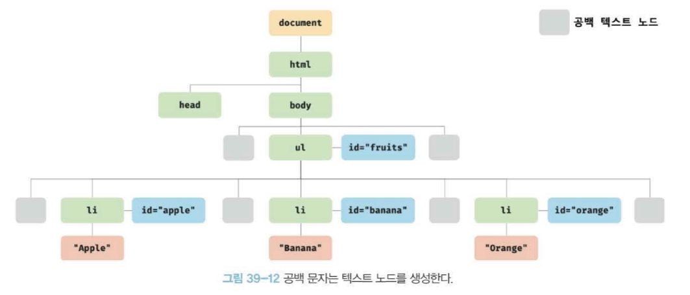
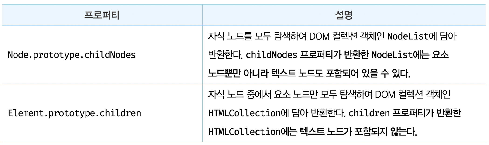
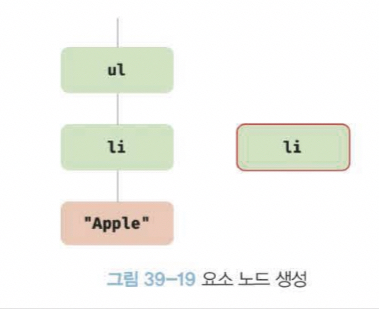
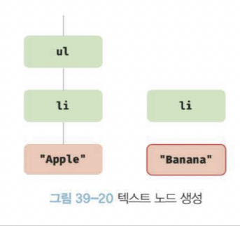
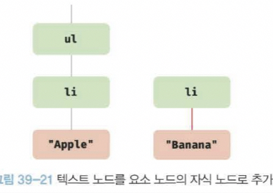
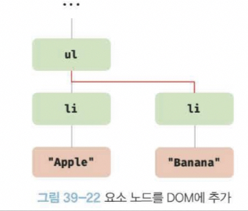
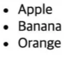
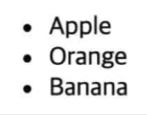
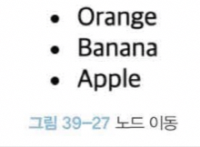
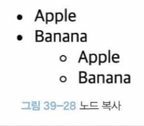

# 39장 DOM(1)

# 39장 DOM

**DOM(Document Object Model)은 HTML 문서의 계층적 구조와 정보를 표현하며 이를 제어할 수 있는 API, 즉 프로퍼티와 메서드를 제공하는 트리 자료구조다.**

---

## 노드


### HTML 요소란?

**“HTML 문서를 구성하는 개별적인 요소”**를 의미

- HTML 요소는 렌더링 엔진에 의해 파싱되어 DOM을 구성하는 요소 노드 객체로 변환
  → 이때 HTML 요소의 **어트리뷰트는 어트리뷰트 노드**로, **HTML 요소의 텍스트 콘텐츠는 텍스트 노드**로 변환
- HTML 요소 간의 부자 관계를 반영하여 HTML 문서의 구성 요소인 HTML 요소를 객체화한 모든 노드 객체들을 트리 자료구조로 구성된다.

### 트리 자료구조


**“부모노드와 자식노드로 구성되어 노드 간의 계층적 구조를 표현하는 자료구조”**

→ 노드 객체들로 구성된 트리 자료구조를 DOM이라고 하며, **노드 객체의 트리로 구조화되어있어 DOM을 DOM트리**라고 부른다.

---

### 노드 객체의 타입

```html
<!DOCTYPE html>
<html lang="kr">
  <head>
    <meta charset="UTF-8" />
    <link rel="stylesheet" href="style.css" />
    <title>Title</title>
  </head>
  <body>
    <ul>
      <li id="apple">Apple</li>
      <li id="banana">Banana</li>
      <li id="orange">Orange</li>
    </ul>
    <script src="app.js"></script>
  </body>
</html>
```


**→ DOM**은 노드 객체의 계층적인 구조로 구성된다.
(**노드 객체는 종류가 있고, 상속 구조를 갖음)**

### 1️⃣ **문서 노드**

문서 노드는 DOM 트리의 최상위에 존재하는 루트 노드로서 document 객체를 가리킨다.

문서 노드, 즉 document 객체는 DOM 트리의 루트 노드이므로 DOM 트리의 노드들에 접근하기 위해 진입점 역할을 담당한다.

→ **요소, 어트리뷰트, 텍스트 노드에 접근하려면 문서 노드를 통해야 한다.**

### 2️⃣ **요소 노드**

요소 노드는 HTML 요소를 가리키는 객체다. 요소 노드는 문서의 구조를 표현한다고 할 수 있다.

### 3️⃣ **어트리뷰트 노드**

어트리뷰트 노드는 HTML 요소의 어트리뷰트를 가리키는 객체다. 어트리뷰트 노드는 어트리뷰트가 지정된 HTML 요소의 요소 노드와 형제 관계를 갖는다.

단, 요소 노드는 부모 노드와 연결되어 있지만 어트리뷰트 노드는 부모 노드와 연결되어 있지 않고 형제 노드인 요소 노드에만 연결되어 있다.

→ 어트리뷰트 노드에 접근하여 어트리뷰트를 참조하거나 변경하려면 먼저 형제 노드인 요소 노드에 접근해야 한다.

### 4️⃣ **텍스트 노드**

텍스트 노드는 HTML 요소의 텍스트를 가리키는 객체다. 텍스트 노드는 요소 노드의 자식 노드이며, 자식 노드를 가질 수 없는 리프 노드다.

→ 텍스트 노드는 DOM 트리의 최종단이다.

---

### 노드 객체의 상속 구조


<aside>
💬

**DOM은 HTML 문서의 계층적 구조와 정보를 표현하는 것은 물론 노드 객체의 종류, 즉 노드 타입에 따라 필요한 기능을 프로퍼티와 메서드의 집합인 DOM API로 제공한다.
→ 이 DOM API를 통해 HTML의 구조나 내용 또는 스타일 등을 동적으로 조작할 수 있다.**

</aside>

- DOM을 구성하는 노드 객체는 자신의 구조와 정보를 제어할 수 있는 DOM API를 사용 가능
- 노드 객체는 자신의 부모, 형제, 자식을 탐색할 수 있으며, 자신의 어트리뷰트와 텍스트를 조작 가능

---

## 요소 노드 취득

“요소 노드의 취득은 HTML 요소를 조작하는 시작점”

### id를 이용한 요소 노드 취득

`Document.prototype.getElementById` 메서드는 인수로 전달한 id 어트리뷰트 값을 갖는 하나의 요소 노드를 탐색하여 반환한다.

→ 반드시 문서 노드인 document를 통해 호출해야 한다 !

```html
<!DOCTYPE html>
<html lang="kr">
  <head>
    <meta charset="UTF-8" />
    <link rel="stylesheet" href="style.css" />
    <title>Title</title>
  </head>
  <body>
    <ul>
      <li id="apple">Apple</li>
      <li id="banana">Banana</li>
      <li id="orange">Orange</li>
    </ul>
    <script>
      // id 값이 banana 인 요소 노드를 탐색하여 반환
      // 두 번째 li 요소가 파싱되어 생성된 요소 노드가 반환
      const $elem = document.getElementById("banana");

      // 취득한 요소 노드의 style.color 프로퍼티 값을 변경한다.
      $elem.style.color = "red";
    </script>
  </body>
</html>
```

- `id` 값은 HTML 문서 내에서 유일한 값
- `class` 어트리뷰트와는 달리 공백 문자로 구분하여 여러 개의 값을 가질 수 없다.

```html
<body>
  <ul>
    <li id="banana">Apple</li>
    <li id="banana">Banana</li>
    <li id="banana">Orange</li>
  </ul>
  <script>
    // getElementById 메서드는 언제나 단 하나의 요소 노드를 반환.
    // 첫 번째 li 요소가 파싱되어 생성된 요소 노드가 반환
    const $elem = document.getElementById("banana");

    // 취득한 요소 노드의 style.color 프로퍼티 값을 변경한다.
    $elem.style.color = "red";
  </script>
</body>
```

- 단, HTML 문서 내에 **중복된 id 값을 갖는 HTML 요소가 여러 개 존재하더라도 어떠한 에러도 발생하지 않는다.**
  **→ 언제나 단 하나의 요소 노드를 반환한다. (첫번째)**

```html
<body>
  <ul>
    <li id="apple">Apple</li>
    <li id="banana">Banana</li>
    <li id="orange">Orange</li>
  </ul>
  <script>
    // id가 grape 인 요소 노드를 탐색하여 반환. null이 반환된다.
    const $elem = document.getElementById("grape");

    // 취득한 요소 노드의 style.color 프로퍼티 값을 변경한다.
    $elem.style.color = "red"; // TypeError
  </script>
</body>
```

- 만약 인수로 전달된 id 값을 갖는 HTML 요소가 존재하지 않는 경우, 
  `getElementId` 메서드는 **null을 반환한다.**

```html
<body>
  <div id="foo"></div>
  <script>
    // id 값과 동일한 이름의 전역 변수가 암묵적으로 선언되고 해당 노드 객체가 할당.
    console.log(foo === document.getElementById("foo")); // true

    // 암묵적 전역으로 생성된 전역 프로퍼티는 삭제되지만 전역 변수는 삭제되지 않는다.
    delete foo;
    console.log(foo); // <div id="foo"></div>
  </script>
</body>
```

- HTML 요소에 `id` 어트리뷰트를 부여하면 **id 값과 동일한 이름의 전역 변수가 암묵적으로 선언되고,
  해당 노드 객체가 할당되는 부수 효과**가 있다.

```html
<body>
  <div id="foo"></div>
  <script>
    let foo = 1;

    // id 값과 동일한 이름의 전역 변수가 이미 선언되어 있으면 노드 객체가 재할당되지 않는다.
    console.log(foo);
  </script>
</body>
```

- 단, **`id` 값과 동일한 이름의 전역 변수가 이미 선언되어 있으면 이 전역 변수에 노드 객체가 재할당되지 않는다.**

---

### 태그 이름을 이용한 요소 노드 취득

1️⃣ `Document.prototype/Element.prototype.getElementsByTagName` 메서드
: 인수로 전달한 태그 이름을 갖는 모든 요소 노드들을 탐색하여 반환

2️⃣ `getElementsByTagName` 메서드
: 여러 개의 요소 노드 객체를 갖는 DOM 컬렉션 객체인 HTMLCollection 객체를 반환한다.

```html
<!DOCTYPE html>
<html lang="en">
  <head>
    <meta charset="UTF-8" />
    <title>Title</title>
  </head>
  <body>
    <ul>
      <li id="apple">Apple</li>
      <li id="banana">Banana</li>
      <li id="orange">Orange</li>
    </ul>
    <script>
      // HTMLCollection 객체는 유사 배열 객체이면서 이터러블이다.
      const $elem = document.getElementsByTagName("li");

      // HTMLCollection 객체를 배열로 변환하여 순회하면서 color 프로퍼티 값을 변경한다.
      [...$elem].forEach((elem) => {
        elem.style.color = "red";
      });
    </script>
  </body>
</html>
```

<aside>
💬

`getElementsByTagName` 메서드가 반환하는 DOM 컬렉션 객체인 HTMLCollection 객체는 **유사 배열 객체이면서 이터러블**이다.

</aside>

### HTML 문서의 모든 요소 노드를 취득하려면?

: `getElementsByTagName` 메서드의 인수로 `*` 를 전달

```jsx
const $all = document.getElementsByIdTagName("*");
```

- Document의 `getElementsByTagName` 메서드는 DOM의 루트 노드인 문서 노드,
  즉, document를 통해 호출하며 DOM 전체에서 요소 노드를 탐색하여 반환
- Element의 `getElementsByTagName` 메서드는 특정 요소 노드를 통해 호출하며,
  특정 요소 노드의 자손 노드 중에서 요소 노드를 탐색하여 반환한다.

```jsx
<!DOCTYPE html>
<html lang="kr">
  <head>
    <meta charset="UTF-8" />
    <title>Title</title>
  </head>
  <body>
    <ul id="fruits">
      <li>Apple</li>
      <li>Banana</li>
      <li>Orange</li>
    </ul>
    <ul>
      <li>HTML</li>
    </ul>
    <script>
      const $lisFromDocument = document.getElementsByTagName('li');
      console.log($lisFromDocument); // HTMLCollection(4) [li, li, li, li]

      // ul#fruits 요소의 자손 노드 중에서 태그 이름이 li인 요소 노드를 모두 탐색하여 반환
      const $fruits = document.getElementById('fruits');
      const $lisFromFruits = $fruits.getElementsByTagName('li');
      console.log($lisFromDocument); // HTMLCollection(3) [li, li, li]
    </script>
  </body>
</html>
```

- 만약 인수로 전달된 태그 이름을 갖는 요소가 존재하지 않는 경우,
   `getElementsByTagName` 메서드는 빈 HTMLCollection 객체를 반환

---

### class를 이용한 요소 노드 취득

`Doclument.prototype/Element.prototype.getElementsByClassName` 메서드

: 인수로 전달한 class 어트리뷰트 값을 갖는 모든 요소 노드들을 탐색하여 반환

```html
<!DOCTYPE html>
<html lang="en">
  <head>
    <meta charset="UTF-8" />
    <title>Title</title>
  </head>
  <body>
    <ul>
      <li class="fruit apple">Apple</li>
      <li class="fruit banana">Banana</li>
      <li class="fruit orange">Orange</li>
    </ul>
    <script>
      // class 값이 fruit 인 요소 노드를 모두 탐색하여 HTMLCollection 객체를 담아 반환
      const $elem = document.getElementsByClassName("fruit");

      // 취득한 모든 요소의 CSS color 프로퍼티 값을 변경.
      [...$elem].forEach((elem) => {
        elem.style.color = "red";
      });

      // class 값이 fruit apple 인 요소 노드를 모두 탐색하여 HTMLCollection 객체를 담아 반환
      const $apples = document.getElementsByClassName("fruit apple");

      [...$apples].forEach((elem) => {
        elem.style.color = "blue";
      });
    </script>
  </body>
</html>
```

1️⃣ Document의 `getElementsByClassName` 메서드는 DOM의 루트 노드인 문서 노드

즉, document를 통해 호출하며 DOM 전체에서 요소 노드를 탐색하여 반환

2️⃣ Element의 `getElementsByClassName` 메서드는 특정 요소 노드를 통해 호출하며,
특정 요소 노드의 자손 노드 중에서 요소 노드를 탐색하여 반환

```html
<!DOCTYPE html>
<html lang="en">
  <head>
    <meta charset="UTF-8" />
    <title>Title</title>
  </head>
  <body>
    <ul id="fruits">
      <li class="apple">Apple</li>
      <li class="banana">Banana</li>
      <li class="orange">Orange</li>
    </ul>
    <div class="banana">Banana</div>
    <script>
      // DOM 전체에서 class 값이 banana 인 요소 노드를 모두 탐색하여 반환
      const $bananasFromDocument = document.getElementsByClassName("banana");
      console.log($bananasFromDocument);
      // HTMLCollection(2) [li.banana, div.banana]

      // #fruits 요소의 자손 노드 중에서 class 값이 banana 인 요소 노드를 모두 탐색하여 반환
      const $fruits = document.getElementById("fruits");
      const $bananaFromFruits = $fruits.getElementsByClassName("banana");

      console.log($bananaFromFruits); // HTMLCollection [li.banana]
    </script>
  </body>
</html>
```

💭 **만약 인수로 전달된 태그 이름을 갖는 요소가 존재하지 않는 경우?**

: `getElementsByClassName` 메서드는 빈 HTMLCollection 객체를 반환 !

---

## css 선택자를 이용한 요소 노드 취득

**[CSS 선택자]**
**스타일을 적용하고자 하는 HTML 요소를 특정할 때 사용하는 문법**

```html
<!DOCTYPE html>
<html lang="kr">
  <head>
    <meta charset="UTF-8" />
    <title>Title</title>
  </head>
  <body>
    <ul>
      <li class="apple">Apple</li>
      <li class="banana">Banana</li>
      <li class="orange">Orange</li>
    </ul>
    <script>
      // class 어트리뷰트 값이 banana 인 첫 번째 요소 노드를 탐색하여 반환
      const $elem = document.querySelector(".banana");

      // 취득한 요소 노드의 style.color 프로퍼티 값을 변경
      $elem.style.color = "red";
    </script>
  </body>
</html>
```

`Document.prototype/Element.prototype.querySelector` 메서드
: 인수로 전달한 CSS 선택자를 만족시키는 **하나의 요소 노드를 탐색하여 반환**

- 인수로 전달한 CSS 선택자를 만족시키는 **요소 노드가 여러 개인 경우 첫번째 요소 노드만 반환**
- 인수로 전달한 CSS 선택자를 만족시키는 요소 노드가 **존재하지 않는 경우 null** 반환
- 인수로 전달한 CSS 선택자가 문법에 맞지 않는 경우 `DOMException` 에러가 발생

```html
<!DOCTYPE html>
<html lang="en">
  <head>
    <meta charset="UTF-8" />
    <title>Title</title>
  </head>
  <body>
    <ul>
      <li class="apple">Apple</li>
      <li class="banana">Banana</li>
      <li class="orange">Orange</li>
    </ul>
    <script>
      // ul 요소의 자식 요소인 li 요소를 모두 탐색하여 반환
      const $elem = document.querySelectorAll("ul > li");
      // 취득한 요소 노드들은 NodeList 객체에 담겨 반환
      console.log($elem); // NodeList(3) [li.apple, li.banana, li.orange]

      // 취득한 모든 요소 노드의 style.color 프로퍼티 값을 변경
      $elem.forEach((elem) => {
        elem.style.color = "red";
      });
    </script>
  </body>
</html>
```

`Document.prototype/Element.prototype.querySelectorAll` 메서드
: 인수로 전달한 CSS 선택자를 만족시키는 **모든 요소 노드를 탐색하여 반환**한다.

`querySelectorAll` 메서드는 여러 개의 요소 노드 객체를 갖는 DOM 컬렉션 객체인 NodeList 객체를 반환한다. → **NodeList 객체는 유사 배열 객체이면서 이터러블**이다.

- 인수로 전달한 CSS 선택자를 만족시키는 **요소 노드가 존재하지 않는 경우 null** 반환
- 인수로 전달한 CSS 선택자가 문법에 맞지 않는 경우 `DOMException` 에러가 발생

🤔 **HTML 문서의 모든 요소 노드를 취득하려면 ?**
`querySelectorAll` 메서드의 인수로 전체 선택자 `*` 을 전달

```jsx
const $all = document.querySelectorAll("*");
```

<aside>
💬

CSS 선택자 문법을 사용하는 querySelector, querySelectorAll 메서드는 `getElementById`, `getElementsBy***` 메서드보다 다소 느린것으로 알려져 있다.

</aside>

하지만 CSS 선택자 문법을 사용하여 좀 더 구체적인 조건으로 요소 노드를 취득할 수 있고 일관된 방식으로 요소 노드를 취득할 수 있다는 장점이 있다.

→ id 어트리뷰트가 있는 요소 노드를 취득하는 경우에는 `getElementById` 메서드를 사용하고 그 외의 경우에는 `querySelector`, `querySelectorAll` 메서드를 사용하는 것이 권장 !

---

## 특정 요소 노드를 취득할 수 있는 지 확인

`Element.prototype.matches` 메서드
: 인수로 전달한 CSS 선택자를 통해 특정 요소 노드를 취득할 수 있는지 확인

```html
<!DOCTYPE html>
<html lang="en">
  <head>
    <meta charset="UTF-8" />
    <title>Title</title>
  </head>
  <body>
    <ul id="fruits">
      <li class="apple">Apple</li>
      <li class="banana">Banana</li>
      <li class="orange">Orange</li>
    </ul>
    <script>
      const $apple = document.querySelector(".apple");

      // $apple 노드는 #fruits > li.apple 로 취득할 수 있다.
      console.log($apple.matches("#fruits > li.apple")); // true

      // $apple 노드는 #fruits > li.banana 로 취득할 수 없다.
      console.log($apple.matches("#fruits > li.banana")); // false
    </script>
  </body>
</html>
```

→ `Element.prototype.matches` 메서드는 이벤트 위임을 사용할 때 유용

---

## HTMLCollection과 NodeList

<aside>
💬

DOM 컬렉션 객체인 `HTMLCollection`과 `NodeList`는 DOM API가 여러 개의 결과값을 반환하기 위한 DOM 컬렉션 객체 !

</aside>

HTMLCollection과 NodeList는 모두 **유사 배열 객체**이며 **이터러블**이다.

→ `for...of` 문이나 스프레드 문법을 사용하여 간단히 배열로 변환할 수 있다.

**[HTMLCollection과 NodeList의 중요한 특성]**
노드 객체의 상태 변화를 “**실시간으로 반영하는 살아 있는 객체”**

- HTMLCollection: 언제나 live 객체로 동작
- NodeList: 대부분의 경우 노드 객체의 상태 변화를 실시간으로 반영하지 않고 과거의 정적 상태를 유지하는 **non-live 객체로 동작하지만 경우에 따라 live 객체로 동작할 때가 있다.**

### **HTMLCollection**

`getElementsByTagName`, `getElementsByClassName` 메서드가 반환하는 HTMLCollection 객체는 노드 객체의 상태 변화를 실시간으로 반영하는 살아 있는 DOM 컬렉션 객체

```html
<!DOCTYPE html>
<html lang="en">
  <head>
    <style>
      .red {
        color: red;
      }
      .blue {
        color: blue;
      }
    </style>
  </head>
  <body>
    <ul id="fruits">
      <li class="red">Apple</li>
      <li class="red">Banana</li>
      <li class="red">Orange</li>
    </ul>
    <script>
      // class 값이 red 인 요소 노드를 모두 탐색하여 HTMLCollection 객체에 담아 반환
      const $elems = document.getElementsByClassName("red");
      // 이 시점에 HTMLCollection 객체에는 3개의 요소 노드가 담겨 있다.
      console.log($elems); // HTMLCollection(3) [li.red, li.red, li.red]

      // HTMLCollection 객체의 모든 요소의 class 값을 blue 로 변경
      for (let i = 0; i < $elems.length; i++) {
        $elems[i].className = "blue";
      }

      // HTMLCollection 객체의 요소가 3개에서 1개로 변경
      console.log($elems); // HTMLCollection(1) [li.red]
    </script>
  </body>
</html>
```


상태 변화 실시간 반영 이슈

**🤔 왜 두번째 `li` 요소만 class 값이 변경되지 않았을까?**

이유는 **HTMLCollection** 객체는 **실시간으로 노드 객체의 상태 변경을 반영하여 요소를 제거**할 수 있기 때문에 HTMLCollection 객체를 for 문으로 순회하면서 노드 객체의 상태를 변경해야 할 때 주의해야 한다.

### 😮 \*\*해결책 Ver.1

부작용을 발생시키는 원인인 HTMLCollection 객체를 사용하지 않기\*\*

```jsx
// for 문을 역방향으로 순회
for (let i = $elems.length - 1; i >= 0; i--) {
  $elems[i].className = "blue";
}

// while문으로 HTMLCollection에 요소가 남아 있지 않을 때까지 무한 반복
let i = 0;
while ($elems.length > i) {
  $elems[i].className = "blue";
}
```

### 😮 \*\*해결책 Ver.2 (간단)

유사 배열 객체이면서 이터러블인 `HTMLCollection` 객체를 변환\*\*

**→ 부작용을 발생 X + 고차함수 사용 가능!**

```jsx
[...$elems].forEach((elem) => (elem.className = "blue"));
```

### NodeList

`querySelectorAll` 메서드
: DOM 컬렉션 객체인 NodeList 객체를 반환

→ 이때 NodeList 객체는 **실시간으로 노드 객체의 상태 변경을 반영하지 않는 객체**다.

```jsx
const $elems = document.querySelectorAll(".red");

$elems.forEach((elem) => (elem.className = "blue"));
```

2️⃣ **NodeList 객체**는 대부분 노드 객체의 상태 변경을 **실시간으로 반영하지 않고,
과거의 정적 상태를 유지하는 non-live 객체로 동작**한다.

하지만, **childNodes 프로퍼티가 반환하는 NodeList 객체**는 HTMLCollection 객체와 같이 실시간으로 노드 객체의 상태 변경을 반영하는 live 객체로 동작하므로 주의가 필요하다.

```html
<!DOCTYPE html>
<html lang="en">
  <head> </head>
  <body>
    <ul id="fruits">
      <li>Apple</li>
      <li>Banana</li>
      <li>Orange</li>
    </ul>
    <script>
      const $fruits = document.getElementById("fruits");

      // childNodes 프로퍼티는 NodeList 객체(live)를 반환한다.
      const { childNodes } = $fruits;
      console.log(childNodes instanceof NodeList); // true

      // $fruits 요소의 자식 노드는 공백 텍스트 노드를 포함해 모두 5개다.
      console.log(childNodes); // NodeList(5) [text, li, text, li, text]

      for (let i = 0; i < childNodes.length; i++) {
        // removeChild 메서드는 $fruits 요소의 자식 노드를 DOM 에서 삭제
        // removeChild 메서드는 호출할 때마다 NodeList 객체인 childNodes 실시간으로 변경
        // 첫 번째, 세 번째, 다섯 번째 요소만 삭제된다.
        $fruits.removeChild(childNodes[i]);
      }

      // $fruits 요소의 모든 자식 노드가 삭제되지 않는다.
      console.log(childNodes); // NodeList(2) [li, li]
    </script>
  </body>
</html>
```

3️⃣ **노드 객체의 상태 변경과 상관없이 안전하게 DOM 컬렉션을 사용하려면 `HTMLCollection`이나 `NodeList` 객체를 배열로 변환하여 사용하는 것을 권장!**

```html
<!DOCTYPE html>
<html lang="en">
  <head> </head>
  <body>
    <ul id="fruits">
      <li>Apple</li>
      <li>Banana</li>
      <li>Orange</li>
    </ul>
    <script>
      const $fruits = document.getElementById('fruits');

      // childNodes 프로퍼티는 NodeList 객체(live)를 반환한다.
      const { childNodes } = $fruits

      // 스프레드 문법을 ㅅ가용하여 NodeList 객체를 배열로 반환
      [...childNodes].forEach(node => {
        $fruits.removeChild(node);
      });

      // $fruits 요소의 모든 자식 노드가 삭제
      console.log(childNodes); // NodeList []
    </script>
  </body>
</html>
```

# 39장 DOM(2)

## 노드 탐색

DOM 트리의 노드를 옮겨 다니며 탐색해야 할 경우

```html
<ul id="fruits">
  <li class="apple">Apple</li>
  <li class="banana">Banana</li>
  <li class="orange">Orange</li>
</ul>
```

1️⃣ `ul#fruits` 요소는 3개의 자식 요소를 갖는다.

먼저 `ul#fruits` 요소 노드를 취득한 다음, 자식 노드를 모두 탐색 OR 자식 노드 중 하나만 탐색 가능

2️⃣ **노드 탐색 프로퍼티는 모두 접근자 프로퍼티다.**

단, 노드 탐색 프로퍼티는 setter없이 **getter만 존재하여 참조만 가능한 읽기 전용 접근자 프로퍼티다.
→ 읽기 전용 접근자 프로퍼티에 값 할당 시 에러 처리 없이 무시된다.**

---

### 공백 텍스트 노드

“**공백 문자**(스페이스 키, 엔터 키, 탭 키등)는 **텍스트 노드를 생성**” → 공백 텍스트 노드

```html
<!DOCTYPE html>
<html lang="en">
  <head> </head>
  <body>
    <ul id="fruits">
      <li class="apple">Apple</li>
      <li class="banana">Banana</li>
      <li class="orange">Orange</li>
    </ul>
  </body>
</html>
```



공백 문자가 포함된 HTML 문서 파싱 시 생성된 DOM

- HTML 문서의 공백 문자는 공백 텍스트 노드를 생성
  → 노드를 탐색할 때는 공백 문자가 생성한 공백 텍스트 노드에 주의
- 인위적으로 HTML 문서의 공백 문자를 제거하면 공백 텍스트 노드를 생성하지 않음
  하지만 가독성 나쁨, 권장하지 않음

```html
<ul id="fruits">
  <li class="apple">Apple</li>
  <li class="banana">Banana</li>
  <li class="orange">Orange</li>
</ul>
```

---

### 자식 노드 탐색

**[ 자식 노드를 탐색하기 위한 노드 탐색 프로퍼티 ]**




**[ 자식 노드를 탐색하기 위한 노드 탐색 프로퍼티 과정 ]**

```html
<!DOCTYPE html>
<html lang="en">
  <body>
    <ul id="fruits">
      <li class="apple">Apple</li>
      <li class="banana">Banana</li>
      <li class="orange">Orange</li>
    </ul>
    <script>
      // 노드 탐색의 기점이 되는 #fruits 요소 노드를 취득한다.
      const $fruits = document.getElementById("fruits");

      // #fruits 요소의 모든 자식 노드를 탐색한다.
      // childNodes 프로퍼티가 반환한 NodeList에는 요소 노드뿐만 아니라 텍스트 노드도 포함되어 있다.
      console.log($fruits.childNodes);
      // NodeList(7) [text, li.apple, text, li.banana, text, li.orange, text]

      // #fruits 요소의 모든 자식 노드를 탐색한다.
      // children 프로퍼티가 반환한 HTMLCollection에는 요소 노드만 포함되어 있다.
      console.log($fruits.children);
      // HTMLCollection(3) [li.apple, li.banana, li.orange]

      // #fruits 요소의 첫 번째 자식 노드를 탐색한다.
      // firstChild 프로퍼티는 텍스트 노드를 반환할 수도 있다.
      console.log($fruits.firstChild); // #test

      // #fruits 요소의 마지막 자식 노드를 탐색한다.
      // lastChild 프로퍼티는 텍스트 노드를 반환할 수도 있다.
      console.log($fruits.lastChild);

      // #fruits 요소의 첫 번째 자식 노드를 탐색한다.
      // firstElementChild 프로퍼티는 요소 노드만 반환한다.
      console.log($fruits.firstElementChild); // li.apple

      // #fruits 요소의 마지막 자식 노드를 탐색한다.
      // lastElementChild 프로퍼티는 요소 노드만 반환한다.
      console.log($fruits.lastElementChild); // li.orange
    </script>
  </body>
</html>
```

---

### **자식 노드 존재 확인**

1️⃣ **자식 노드가 존재하는지 확인? → `Node.prototype.hasChildNodes` 메서드**

- `hasChildNodes` 메서드는 **자식 노드O → true**, **자식 노드X → false**를 반환
  단, `hasChildNodes` 메서드는 childNodes 프로퍼티와 마찬가지로 텍스트 노드를 포함하여 자식 노드의 존재를 확인

2️⃣ **요소 노드를 확인? → `childElementCount` 프로퍼티 사용**

```html
<!DOCTYPE html>
<html lang="en">
  <body>
    <ul id="fruits"></ul>
    <script>
      // 노드 탐색의 기점이 되는 #fruits 요소 노드를 취득한다.
      const $fruits = document.getElementById("fruits");

      // #fruits 요소에 자식 노드가 존재하는지 확인
      // hasChildNodes 메서드는 텍스트 노드를 포함하여 자식 노드의 존재 확인
      console.log($fruits.hasChildNodes()); // true

      // 자식 노드 중에 텍스트 노드가 아닌 요소 노드가 존재하는지 확인
      console.log(!!$fruits.childElementCount); // 0 -> false
    </script>
  </body>
</html>
```

---

### **요소 노드의 텍스트 노드 탐색**

**요소 노드의 텍스트 노드 == 요소 노드의 자식 노드**
즉, 요소 노드의 텍스트 노드는 `firstChild` 프로퍼티로 접근할 수 있다.

→ `firstChild` 프로퍼티는 첫 번째 자식 노드를 반환하며, 텍스트 노드이거나 요소 노드

```html
<!DOCTYPE html>
<html lang="en">
  <body>
    <div id="foo">Hello</div>
    <script>
      // 요소 노드의 텍스트 노드는 firstChild 프로퍼티로 접근할 수 있다.
      console.log(document.getElementById("foo").firstChild); // #text
    </script>
  </body>
</html>
```

---

### 부모 노드 탐색

부모 노드를 탐색 시 `Node.prototype.parentNode` 프로퍼티를 사용

<aside>
💬

텍스트 노드는 DOM 트리의 최종단 노드인 리프 노드이므로 **부모 노드가 텍스트 노드인 경우는 없다 !**

</aside>

```html
<!DOCTYPE html>
<html lang="en">
  <body>
    <ul id="fruits">
      <li class="apple">Apple</li>
      <li class="banana">Banana</li>
      <li class="orange">Orange</li>
    </ul>
    <script>
      // 노드 탐색의 기점이 되는 .banana 요소 노드를 취득한다.
      const $banana = document.querySelector(".banana");

      // .banana 요소 노드의 부모 노드를 탐색한다.
      console.log($banana.parentNode); // ul#fruits
    </script>
  </body>
</html>
```

---

### 형제 노드 탐색

1️⃣ 부모 노드가 같은 형제 노드를 탐색하려면 다음과 같은 **노드 탐색 프로퍼티를 사용**한다.

2️⃣ 단, 어트리뷰트 노드는 요소 노드의 형제 노드이지만 부모 노드가 같은 형제 노드가 아니기 때문에 반환되지 않는다.

3️⃣  즉, 아래 프로퍼티는 텍스트 노드 또는 요소 노드만 반환


---

## 노드 정보 취득

**[ 노드 객체에 대한 정보를 취득하기 위한 노드 정보 프로퍼티 ]**


---

## 요소 노드의 텍스트 조작

### nodeValue

1️⃣ `Node.prototype.nodeValue` 프로퍼티는 `setter`와 `getter` 모두 존재하는 접근자 프로퍼티다. → 따라서 참조와 할당 모두 가능 !

2️⃣ 노드 객체의 nodeValue 프로퍼티를 참조하면 노드 객체의 값을 반환

3️⃣ **노드 객체의 값이란** 텍스트 노드의 텍스트

→ 따라서 텍스트 노드가 아닌 노드, 즉 문서 노드나 요소 노드의 nodeValue 프로퍼티를 참조하면 `null`을 반환한다 !

```html
<!DOCTYPE html>
<html>
  <body>
    <div id="foo">Hello</div>
  </body>
  <script>
    // 문서 노드의 nodeValue 프로퍼티를 참조한다.
    console.log(document.nodeValue); // null

    // 요소 노드의 nodeValue 프로퍼티를 참조한다.
    const $foo = document.getElementById("foo");
    console.log($foo.nodeValue); // null

    // 텍스트 노드의 nodeValue 프로퍼티를 참조한다.
    const $textNode = $foo.firstChild;
    console.log($textNode.nodeValue); // Hello
  </script>
</html>
```

- 텍스트 노드의 nodeValue 프로퍼티에 값을 할당 → 텍스트 노드의 값, 즉 텍스트를 변경 가능
  따라서 요소 노드의 텍스트를 변경하려면 다음과 같은 순서이 처리가 필요
  1️⃣ 텍스트를 변경할 요소 노드를 취득한 다음, 취득한 요소 노드의 텍스트 노드를 탐색한다.
  텍스트 노드는 요소 노드의 자식 노드이므로 `firstChild` 프로퍼티를 사용하여 탐색
  2️⃣ 탐색한 텍스트 노드의 `nodeValue` 프로퍼티를 사용하여 텍스트 노드의 값을 변경한다.

```html
<!DOCTYPE html>
<html>
  <body>
    <div id="foo">Hello</div>
  </body>
  <script>
    // 1. #foo 요소 노드의 자식 노드인 텍스트 노드를 취득한다.
    const $textNode = document.getElementById("foo").firstChild;

    // 2. nodeValue 프로퍼티를 사용하여 텍스트 노드의 값을 변경한다.
    $textNode.nodeValue = "World";

    console.log($textNode.nodeValue); // World
  </script>
</html>
```

---

### textContext

**`Node.prototype.textContent` 프로퍼티**
: setter와 getter 모두 존재하는 접근자 프로퍼티로서 요소 노드의 텍스트와 모든 자손 노드의 텍스트를 모두 취득하거나 변경한다.

- 요소 노드의 textContent 프로퍼티를 참조하면 요소 노드의 콘텐츠 영역 내의 텍스트를 모두 반환
  → 이때 HTML 마크업은 무시

```html
<!DOCTYPE html>
<html>
  <body>
    <div id="foo">Hello <span>world!</span></div>
  </body>
  <script>
    console.log(document.getElementById("foo").textContent); // Hello world!
  </script>
</html>
```

---

## DOM 조작

<aside>
💬

DOM 조작에 의해 DOM에 새로운 노드가 추가되거나 삭제되면 **리플로우와 리페인트가 발생**하는 원인이 되므로 **성능에 영향**을 준다.

→ 복잡한 콘텐츠를 다루는 DOM 조작은 성능 최적화를 위해 주의해서 다루어야 함!

</aside>

### innerHTML

**`Element.prototype.innerHTML` 프로퍼티**

: setter와 getter 모두 존재하는 접근자 프로퍼티로서 요소 노드의 HTML 마크업을 취득 OR 변경

- 요소 노드의 콘텐츠 영역 내에 포함된 **모든 HTML 마크업을 문자열로 반환**

```jsx
<!DOCTYPE html>
<html>
  <body>
    <div id="foo">Hello <span>world!</span></div>
    <script>
      // #foo 요소의 콘텐츠 영역 내의 HTML 마크업을 문자열로 취득한다.
      console.log(document.getElementById('foo').innerHTML);
      // "Hello <span>world!</span>"
    </script>
  </body>
</html>
```

- 요소 노드의 `innerHTML` 프로퍼티에 문자열을 할당 시, **요소 노드의 모든 자식 노드가 제거되고 할당한 문자열에 포함되어 있는 HTML 마크업이 파싱되어 요소 노드의 자식 노드로 DOM에 반영**

```html
<!DOCTYPE html>
<html>
  <body>
    <div id="foo">Hello <span>world!</span></div>
    <script>
      document.getElementById("foo").innerHTML = "Hi <span>there!</span>";
    </script>
  </body>
</html>
```


- innerHTML 프로퍼티를 사용하면 HTML 마크업 문자열로 간단히 DOM 조작이 가능

→ 이때 **사용자로부터 입력받은 데이터를 그대로 `innerHTML` 프로퍼티에 할당하는 것은 크로스 사이트 스크립팅 공격(XSS)에 취약하므로 위험**하다. HTML 마크업 내에 자바스크립트 악성 코드가 포함되어 있다면 파싱 과정에서 그대로 실행될 가능성이 있기 때문이다.

---

### insertAdjacentHTML

**`Element.prototype.insertAdjacentHTML(position, DOMString)` 메서드**
: 기존 요소를 제거하지 않으면서 위치를 지정해 새로운 요소를 삽입


1️⃣ **첫 번째 인수로 전달할 수 있는 문자열**
: `'beforebegin'`, `'afterbegin'`, `'beforeend'`, `'afterend'``의 4가지

2️⃣ 두 번째 인수로 전달한 HTML 마크업 문자열(DOMString)을 파싱하고 그 결과로 생성된 노드를 첫 번째 인수로 전달한 위치(position)에 삽입하여 DOM에 반영

```html
<!DOCTYPE html>
<html>
  <body>
    <!-- beforebegin -->
    <div id="foo">
      <!-- afterbegin -->
      text
      <!-- beforeend -->
    </div>
    <!-- afterend -->
  </body>
  <script>
    const $foo = document.getElementById("foo");

    $foo.insertAdjacentHTML("beforebegin", "<p>beforebigin</p>");
    $foo.insertAdjacentHTML("afterbegin", "<p>afterbigin</p>");
    $foo.insertAdjacentHTML("beforeend", "<p>beforeend</p>");
    $foo.insertAdjacentHTML("afterend", "<p>afterend</p>");
  </script>
</html>
```

- 기존 요소에는 영향을 주지 않고 새롭게 삽입될 요소만을 파싱하여 자식 요소로 추가하므로 **innerHTML 보다 효율적이고 빠르다**.
- 단, **HTML 마크업 문자열을 파싱하므로 크로스 사이트 스크립팅 공격에 취약하다는 점은 동일**하다.

---

### **노드 생성과 추가**

<aside>
💬

DOM은 노드를 직접 **생성/삽입/삭제/치환**하는 메서드도 제공한다 !

</aside>

```html
<!DOCTYPE html>
<html>
  <body>
    <ul id="fruits">
      <li>Apple</li>
    </ul>
  </body>
  <script>
    const $fruits = document.getElementById("fruits");

    // 1. 요소 노드 생성
    const $li = document.createElement("li");

    // 2. 텍스트 노드 생성
    const textNode = document.createTextNode("Banana");

    // 3. 텍스트 노드를 $li 요소 노드의 자식 노드로 추가
    $li.appendChild(textNode);

    // 4. $li 요소 노드를 #fruits 요소 노드의 마지막 자식 노드로 추가
    $fruits.appendChild($li);
  </script>
</html>
```

### 1️⃣ 요소 노드 생성

`Document.prototype.createElement(tagName)` 메서드
: 요소 노드를 생성하여 반환

- 매개변수에는 **태그 이름을 나타내는 문자열을 인수로 전달**

```jsx
// 1. 요소 노드 생성
const $li = document.createElement("li");
```



### 2️⃣ 텍스트 노드 생성

`Document.prototype.createTextNode(text)` 메서드
: 텍스트 노드를 생성하여 반환

- 매개변수에는 **텍스트 노드의 값으로 사용할 문자열을 인수로 전달**

```jsx
// 2. 텍스트 노드 생성
const textNode = document.createTextNode("banana");
```



### 3️⃣ **텍스트 노드를 요소 노드의 자식 노드로 추가**

`Node.prototype.appendChild(childNode)` 메서드
: 매개변수 `childNode`에게 인수로 전달한 노드를 `appendChild` 메서드를 호출한 노드의 마지막 자식 노드로 추가

```jsx
// 3. 텍스트 노드를 $li 요소 노드의 자식 노드로 추가
$li.appendChild(textNode);
```



### 4️⃣ **요소 노드를 DOM에 추가**

`Node.prototype.appendChild` 메서드를 사용하여 텍스트 노드와 부자 관계로 연결한 요소 노드를 #fruits 요소 노드의 마지막 자식 요소로 추가

→ 이 과정에서 비로소 새롭게 생성한 요소 노드가 DOM에 추가되는 것!

```jsx
// 4. $li 요소 노드를 #fruits 요소 노드의 마지막 자식 노드로 추가
$fruits.appendChild($li);
```



---

### 복수의 노드 생성과 추가

1️⃣ **`DocumentFragment` 노드 특징**
: 문서, 요소, 어트리뷰트, 텍스트 노드와 같은 노드 객체의 일종으로, **부모 노드가 없어서 기존 DOM과는 별도로 존재**

2️⃣ **용도**

: **자식 노드들의 부모 노드로서 별도의 서브 DOM을 구성하여 기존 DOM에 축가하기 위해 사용**


- 기존 DOM과는 별도로 존재하므로 `DocumentFragment` 노드에 자식 노드를 추가하여도 기존 DOM에는 어떠한 변경도 발생 X
- `DocumentFragment` 노드를 DOM에 추가하면 자신은 제거, 자신의 자식 노드만 DOM에 추가됨

**`Document.prototype.createDocumentFragment` 메서드**
: 비어 있는 DocumentFragment 노드를 생성하여 반환

```html
<!DOCTYPE html>
<html>
  <body>
    <ul id="fruits"></ul>
  </body>
  <script>
    const $fruits = document.getElementById("fruits");

    // DocumentFragment 노드 생성
    const $fragment = document.createDocumentFragment();

    ["Apple", "Banana", "Orange"].forEach((text) => {
      // 1. 요소 노드 생성
      const $li = document.createElement("li");

      // 2. 텍스트 노드 생성
      const textNode = document.createTextNode(text);

      // 3. 텍스트 노드를 $li 요소 노드의 자식 노드로 추가
      $li.appendChild(textNode);

      // 4. $li 요소 노드를 DocumentFragment 요소 노드의 마지막 자식 노드로 추가
      $fragment.appendChild($li);
    });

    // 5. DocumentFragment 노드를 #fruits 요소 노드의 마지막 자식 노드로 추가
    $fruits.appendChild($fragment);
  </script>
</html>
```

- 이때 실제로 **DOM 변경이 발생하는 것은 한 번뿐**이며 **리플로우와 리페인트도 한 번**만 실행된다.
  → **따라서 여러 개의 요소 노드를 DOM에 추가하는 경우 `DocumentFragment` 노드를 사용하는 것이 효율적 !**

---

### 노드 삽입

**1️⃣ 마지막 노드로 추가**

`Node.prototype.appendChild` 메서드
: 인수로 전달받은 노드를 자신을 호출한 노드의 마지막 자식 노드로 DOM에 추가

**2️⃣ 지정한 위치에 노드 삽입**

`Node.prototype.insertBefore(newNode, childNode)` 메서드

: 첫 번째 인수로 전달받은 노드를 두 번째 인수로 전달받은 노드 앞에 삽입

```html
<!DOCTYPE html>
<html>
  <body>
    <ul id="fruits">
      <li>Apple</li>
      <li>Banana</li>
    </ul>
  </body>
  <script>
    const $fruits = document.getElementById("fruits");

    // 요소 노드 생성
    const $li = document.createElement("li");

    // 텍스트 노드를 $li 요소 노드의 마지막 자식 노드로 추가
    $li.appendChild(document.createTextNode("Orange"));

    // $li 요소 노드를 #fruits 요소 노드의 마지막 자식 노드로 추가
    $fruits.insertBefore($li, $fruits.lastElementChild);
    // Apple - Orange - Banana
  </script>
</html>
```



appendChild 메서드



insertBefore 메서드

---

### 노드 이동

DOM에 이미 존재하는 노드를 `appendChild` 또는 `insertBefore` 메서드를 사용하여 DOM에 다시 추가하면 현재 위치에서 노드를 제거하고 새로운 위치에 노드를 추가한다 → 즉, 노드가 이동함 !

```html
<!DOCTYPE html>
<html>
  <body>
    <ul id="fruits">
      <li>Apple</li>
      <li>Banana</li>
      <li>Orange</li>
    </ul>
  </body>
  <script>
    const $fruits = document.getElementById("fruits");

    // 이미 존재하는 요소 노드를 취득
    const [$apple, $banana] = $fruits.children;

    // 이미 존재하는 $apple 요소 노드를 #fruits 요소 노드의 마지막 노드로 이동
    $fruits.appendChild($apple);

    $fruits.insertBefore($banana, $fruits.lastElementChild);
    // Orange - Banana - Apple
  </script>
</html>
```



---

### 노드 복사

`Node.prototype.cloneNode([deep: true | false])` 메서드
: 노드의 사본을 생성하여 반환

**1️⃣ 매개 변수 deep이 true일때**
깊은복사하여 모든 자손 노드가 포함된 사본을 생성

**2️⃣ 매개 변수가 false거나 생략 시**
얕은 복사를 하여 노드 자신만의 사본을 생성

→ 얕은 복사로 생성된 요소는 자손 노드를 복사하지 않으므로 텍스트 노드도 없다.

```html
<!DOCTYPE html>
<html>
  <body>
    <ul id="fruits">
      <li>Apple</li>
    </ul>
  </body>
  <script>
    const $fruits = document.getElementById("fruits");
    const $apple = $fruits.firstElementChild;

    // $apple 요소를 얕은 복사하여 사본을 생성. 텍스트 노드가 없는 사본이 생성
    const $shallowClone = $apple.cloneNode();
    // 사본 요소 노드에 텍스트 추가
    $shallowClone.textContent = "Banana";
    // 사본 요소 노드를 #fruits 요소 노드의 마지막 노드로 추가
    $fruits.appendChild($shallowClone);

    // #fruits 요소를 깊은 복사하여 모든 자손 노드가 포함된 사본을 생성
    const $deepClone = $fruits.cloneNode(true);
    // 사본 요소 노드를 #fruits 요소 노드의 마지막 노드로 추가
    $fruits.appendChild($deepClone);
  </script>
</html>
```



---

### **노드 교체**

`Node.prototype.replaceChild(newChild, oldChild)` 메서드
: 자신을 호출한 노드의 자식 노드를 다은 노드로 교체

1️⃣ 첫 번째 매개변수는 `newChild`에는 **교체할 새로운 노드**를 인수로 전달

2️⃣ 두 번째 매개변수 `oldChild`에는 **이미 존재하는 교체될 노드**를 인수로 전달

```html
<!DOCTYPE html>
<html>
  <body>
    <ul id="fruits">
      <li>Apple</li>
    </ul>
  </body>
  <script>
    const $fruits = document.getElementById("fruits");

    // 기존 노드와 교체할 요소 노드를 생성
    const $newChild = document.createElement("li");
    $newChild.textContent = "Banana";

    // #fruits 요소 노드의 첫 번째 요소 노드를 $newChild 요소 노드로 교체
    $fruits.replaceChild($newChild, $fruits.firstElementChild);
    //result :Banana
  </script>
</html>
```

---

### 노드 삭제

`Node.prototype.removeChild(child)` 메서드
: child 매개변수에 인수로 전달한 노드를 DOM에서 삭제한다.

<aside>
💬

인수로 전달한 노드는 `removeChild` 메서드를 **호출한 노드의 자식 노드**이어야한다.

</aside>

```html
<!DOCTYPE html>
<html>
  <body>
    <ul id="fruits">
      <li>Apple</li>
      <li>Banana</li>
    </ul>
  </body>
  <script>
    const $fruits = document.getElementById("fruits");

    // #fruits 요소 노드의 마지막 요소를 삭제
    $fruits.removeChild($fruits.lastElementChild);
    // result : Apple
  </script>
</html>
```

---

## 어트리뷰트

### 어트리뷰트 노드와 attributes 프로퍼티

**“HTML 요소는 여러 개의 어트리뷰트를 가질 수 있다.”**

```html
<input id="user" type="text" value="ungmo2" />
```

- HTML 문서가 파싱될 때 HTML 요소의 어트리뷰트(이하 HTML 어트리뷰트)는 어트리뷰트 노드로 변환되어 요소 노드와 연결된다.
  → 이때 HTML 어트리뷰트당 하나의 어트리뷰트 노드가 생성


- 모든 어트리뷰트 노드의 참조는 유사 배열 객체이자 이터러블인 `NameNodeMap` 객체에 담겨서 요소 노드의 attributes 프로퍼티에 저장된다.
  → 따라서 요소 노드의 모든 어트리뷰터 노드는 요소 노드의 `Element.prototype.attributes` 프로퍼티로 취득 가능!
- getter만 존재하는 **읽기 전용 접근자 프로퍼티**이며, 요소 노드의 모든 어트리뷰트 노드의 참조가 담긴 `NameNodeMap` 객체를 반환

```html
<!DOCTYPE html>
<html>
  <body>
    <input id="user" type="text" value="sunny" />
    <script>
      // 요소 노드의 attribute 프로퍼티는 요소 노드의 모든 어트리뷰트 노드의 참조가 담긴
      // NamedNodeMap 객체를 반환한다.
      const { attributes } = document.getElementById("user");
      console.log(attributes);
      //  NameNodeMap {0: id, 1: type, 2: value, id: id, type: type, value: value, length: 3}

      // 어트리뷰트 값 취득
      console.log(attributes.id.value); // user
      console.log(attributes.type.value); // text
      console.log(attributes.value.value); // sunny
    </script>
  </body>
</html>
```

---

### HTML 어트리뷰트 조작

`Element.prototype.getAttribute/setAttribute` 메서드 사용
: attributes 프로퍼티를 통하지 않고 요소 노드에서 메서드를 통해 직접 HTML 어트리뷰트 값을 취득하거나 변경이 가능함 → Easy -!

```html
<!DOCTYPE html>
<html>
  <body>
    <input id="user" type="text" value="sunny" />
    <script>
      const $input = document.getElementById("user");

      // value 어트리뷰트 값을 취득
      const inputValue = $input.getAttribute("value");
      console.log(inputValue); // sunny

      // value 어트리뷰트 값을 변경
      $input.setAttribute("value", "foo");
      console.log($input.getAttribute("value")); // foo
    </script>
  </body>
</html>
```

🤔 **특정 HTML 어트리뷰트가 존재하는지 확인 시**
`Element.prototype.hasAttribute(attributeName)` 메서드 사용

**🤔 특정 HTML 어트리뷰트를 삭제**
`Element.prototype.temoveAttribute(attributeName)` 메서드를 사용

```html
<!DOCTYPE html>
<html>
  <body>
    <input id="user" type="text" value="sunny" />
    <script>
      const $input = document.getElementById("user");

      // value 어트리뷰트의 존재 확인
      if ($input.hasAttribute("value")) {
        // value 어트리뷰트 삭제
        $input.removeAttribute("value");
      }

      // value 어트리뷰트가 삭제되었다.
      console.log($input.hasAttribute("value")); // false
    </script>
  </body>
</html>
```

---

### HTML 어트리뷰트 vs DOM 프로퍼티

<aside>
💬

**요소 노드 객체에는 HTML 어트리뷰트에 대응하는 DOM 프로퍼티가 존재**
→ 이 DOM 프로퍼티들은 HTML 어트리뷰트 값을 초기값으로 가지고 있음

</aside>


- DOM 프로퍼티는 `setter`와 `getter` 모두 존재하는 접근자 프로퍼티다.
  → 따라서 **DOM 프로퍼티는 참조와 변경이 가능**하다.

```html
<!DOCTYPE html>
<html>
  <body>
    <input id="user" type="text" value="sunny" />
    <script>
      const $input = document.getElementById("user");

      // 요소 노드의 value 프로퍼티 값을 변경
      $input.value = "foo";

      // 요소 노드의 프로퍼티값을 참조
      console.log($input.value); // foo
    </script>
  </body>
</html>
```

**🤔 HTML 어트리뷰트는 DOM에서 중복 관리되고 있는 것처럼 보인다 . . .**

**1️⃣ 요소 노드의 attributes 프로퍼티에서 관리하는 어트리뷰트 노드**

**2️⃣ HTML 어트리뷰트에 대응하는 요소 노드의 프로퍼티(DOM 프로퍼티)**

<aside>
💬

**하지만 HTML 어트리뷰트의 역할은 HTML 요소의 초기 상태를 지정하는 것이기에
HTML 어트리뷰트 값은 HTML 요소의 초기 상태를 의미하며 이는 변하지 않는다.**

</aside>

### 어트리뷰트 노드

**“HTML 어트리뷰트로 지정한 HTML 요소의 초기 상태는 어트리뷰트 노드에서 관리한다.”**

: 사용자의 입력에 의해 상태가 변경되어도 변하지 않고, HTML 어트리뷰트로 지정한 HTML 요소의 초기 상태를 그대로 유지한다.

### DOM 프로퍼티

**“사용자가 입력한 최신 상태는 HTML 어트리뷰트에 대응하는 요소 노드의 DOM 프로퍼티가 관리한다.”
: DOM 프로퍼티는 사용자의 입력에 의한 상태 변화에 반응하여 언제나 최신 상태를 유지한다.**

### HTML 어트리뷰트와 DOM 프로퍼티의 대응관계

- 대부분의 HTML 어트리뷰트는 HTML 어트리뷰트 이름과 동일한 DOM 프로퍼티와 1:1로 대응한다.
- 단, 다음과 같이 HTML 어트리뷰트와 DOM 프로퍼티가 언제나 1:1로 대응하는 것은 아니며, 키가 반드시 일치하는 것도 아니다.
  - i**d 어트리뷰트와 id프로퍼티는 1:1대응하며, 동일한 값으로 연동한다.**
  - **input 요소의 value 어트리뷰트는 value 프로퍼티와 1:1 대응한다.
    하지만 value 어트리뷰트는 초기상태를, value 프로퍼티는 최신상태를 갖는다.**
  - **class 어트리뷰트는 className, classList 프로퍼티와 대응한다.**
  - **for 어트리뷰트는 htmlFor 프로퍼티와 1:1 대응한다.**
  - **td 요소의 colspan 어트리뷰트는 대응하는 프로퍼티가 존재하지 않는다.**
  - **textContent 프로퍼티는 대응하는 어트리뷰트가 존재하지 않는다.**
  - **어트리뷰트 이름은 대소문자를 구별하지 않지만 대응하는 프로퍼티 키는 카멜 케이스를 따른다.**

### **DOM 프로퍼티 값의 타입**

“`getAttribute` 메서드로 취득한 어트리뷰트 값은 언제나 문자열이다.”

→ **하지만 DOM 프로퍼티로 취즉한 최신 상태 값은 문자열이 아닐 수 있다.**

```html
<!DOCTYPE html>
<html>
  <body>
    <input type="checkbox" checked />
    <script>
      const $checkbox = document.querySelector("input[type=checkbox]");

      // getAttribute 메서드로 취득한 어트리뷰트 값은 언제나 문자열이다.
      console.log($checkbox.getAttribute("checked")); // ''

      // DOM 프로퍼티로 취득한 최신 상태 값은 문자열이 아닐 수도 있다.
      console.log($checkbox.checked); // true
    </script>
  </body>
</html>
```

---

### **data 어트리뷰트와 dataset 프로퍼티**

**“data** 어트리뷰트와 **dataset** 프로퍼티를 사용하면 HTML 요소에 정의한 사용자 정의 어트리뷰트와 자바스크립트 간에 데이터를 교환할 수 있다.”

```jsx
<!DOCTYPE html>
<html>
  <body>
    <ul class="users">
      <li id="1" data-user-id="7621" data-role="admin">Lee</li>
      <li id="2" data-user-id="9524" data-role="subscriber">Kim</li>
    </ul>
  </body>
</html>
```

- data 어트리뷰트는 `data-user-id`, `data-role`과 같이 `data-` 접두사 다음에 임의의 이름을 붙여 사용한다.

```html
<!DOCTYPE html>
<html>
  <body>
    <ul class="users">
      <li id="1" data-user-id="7621" data-role="admin">Lee</li>
      <li id="2" data-user-id="9524" data-role="subscriber">Kim</li>
    </ul>
    <script>
      const users = [...document.querySelector(".users").children];

      // user-id 가 '7621'인 요소 노드를 취득한다.
      const user = users.find((user) => user.dataset.userId === "7621");
      // user-id가 '7621' 인 요소 노드에서 data-role의 값을 취득한다.
      console.log(user.dataset.role);

      // user-id가 '7621'인 요소 노드의 data-role 값을 변경한다.
      user.dataset.role = "subscriber";
      // dataset 프로퍼티는 DOMStringMap 객체를 반환한다.
      console.log(user.dataset);
      // DOMStringMap {userId: "7621", role: "subscriber"}
    </script>
  </body>
</html>
```

1️⃣ data 어트리뷰트의 값은 `HTMLElement.dataset` 프로퍼티로 취득할 수 있다.

2️⃣ dataset 프로퍼티는 HTML 요소의 모든 data 어트리뷰트의 정보를 제공하는 `DOMString` 객체를 반환한다.

3️⃣ `DOMString` 객체는 data 어트리뷰트의 `data-` 접두사 다음에 붙인 임의의 이름을 **카멜 케이스**로 변환한 프로퍼티를 가지고 있다.

4️⃣ 이 프로퍼티로 data 어트리뷰트의 값을 취득하거나 변경할 수 있다.

```html
<!DOCTYPE html>
<html>
  <body>
    <ul class="users">
      <li id="1" data-user-id="7621">Lee</li>
      <li id="2" data-user-id="9524">Kim</li>
    </ul>
    <script>
      const users = [...document.querySelector(".users").children];

      // user-id 가 '7621'인 요소 노드를 취득한다.
      const user = users.find((user) => user.dataset.userId === "7621");

      // user-id가 '7621'인 요소 노드에 새로운 data 어트리뷰트를 추가한다.
      user.dataset.role = "admin";
      console.log(user.dataset);
      // DOMStringMap {userId: "7621", role: "admin"}
    </script>
  </body>
</html>
```

- 존재하지 않는 이름을 키로 사용하면 **data 어트리뷰트가 추가**된다.

---

## 스타일

### 인라인 스타일 조작

`HTMLElement.prototype.style` 프로퍼티
: setter와 getter 모두 존재하는 접근자 프로퍼티로서 요소 노드의 인라인 스타일을 취득하거나 추가 또는 변경한다.

```html
<!DOCTYPE html>
<html>
  <body>
    <div style="color: red">Hello World</div>
    <script>
      const $div = document.querySelector("div");

      // 인라인 스타일 취득
      console.log($div.style);

      // 인라인 스타일 변경
      $div.style.color = "blue";

      // 인라인 스타일 추가
      $div.style.width = "100px";
      $div.style.height = "100px";
      $div.style.backgroundColor = "yellow";
    </script>
  </body>
</html>
```


---

### **클래스 조작**

<aside>
💬

`.`으로 시작하는 클래스 선택자를 사용하여 CSS class를 미리 정의한 다음,
HTML 요소의 class 어트리뷰트 값을 변경하여 HTML 요소의 스타일을 변경할 수도 있다.

</aside>

### className

`HTMLElement.prototype.className` 프로퍼티
: setter와 getter 모두 존재하는 접근자 프로퍼티로서 HTML 요소의 class 어트리뷰트 값을 취득하거나 변경한다.

- 문자열을 반환하므로 공백으로 구분된 여러 개의 클래스를 반환하는 경우 다루기가 불편하다.

```html
<!DOCTYPE html>
<html>
  <head>
    <style>
      .box {
        width: 100px;
        height: 100px;
        background-color: yellow;
      }
      .red {
        color: red;
      }
      .blue {
        color: blue;
      }
    </style>
  </head>
  <body>
    <div class="box red">Hello World</div>
    <script>
      const $box = document.querySelector(".box");

      // .box 요소의 class 어트리뷰트 값을 취득
      console.log($box.className); // "box red"

      // .box 요소의 class 어트리뷰트 값 중에서 "red"만 "blue" 로 변경
      // "red" 클래스를 "blue"로 변경하려면 문자열을 직접 조작해야 함
      $box.className = $box.className.replace("red", "blue");
    </script>
  </body>
</html>
```

**[ClassName의 단점]**

- 특정 클래스를 추가/제거하기 위해 문자열 검색, 치환 작업이 필요하여 코드가 복잡
- 클래스 이름이 많아지면 문자열 관리가 더 어려움

### classList

`HTMLElement.prototype.classList` 프로퍼티
: class 어트리뷰트의 정보를 담은 **DOMTokenList 객체를 반환**한다.

```html
<!DOCTYPE html>
<html>
  <head>
    <style>
      .box {
        width: 100px;
        height: 100px;
        background-color: yellow;
      }
      .red {
        color: red;
      }
      .blue {
        color: blue;
      }
    </style>
  </head>
  <body>
    <div class="box red">Hello World</div>
    <script>
      const $box = document.querySelector(".box");

      // .box 요소의 class 어트리뷰트 정보를 담은 DOMTokenList 객체를 취득
      console.log($box.classList);
      // DOMTokenList(2) [length: 2, value: "box blue", 0: "box", 1: "blue"]

      // .box 요소의 class 어트리뷰트 값 중에서 "red"만 "blue" 로 변경
      $box.classList.replace("red", "blue");
    </script>
  </body>
</html>
```

- `DOMTokenList` 객체는 class 어트리뷰트의 정보를 나타내는 컬렉션 객체로서 **유사 배열 객체**이면서 **이터러블**이다.
- `DOMTokenList` 객체는 forEach, entries, keys, value, supports 메서드를 제공
- `DOMTokenList` 객체는 다음과 같은 메서드을 제공한다.
  1️⃣ **add(...className)** : 인수로 전달한 1개 이상의 문자열을 class 어트리뷰트 값으로 추가한다.
  ```jsx
  $box.classList.add("foo"); // class="box red foo"
  ```
  2️⃣ **remove(...className)** : 인수로 전달한 1개 이상의 문자열과 일치하는 클래스를 class 어트리뷰트에서 삭제한다.
  ```jsx
  $box.classList.remove("foo"); // class="box red"
  ```
  3️⃣ **item(index)** : 인수로 전달한 index에 해당하는 클래스를 class 어트리뷰트에서 반환한다.
  ```jsx
  $box.classList.item(0); // "box"
  $box.classList.item(1); // "red"
  ```
  4️⃣ **contains(className)** : 인수로 전달한 문자열과 일치하는 클래스가 class 어트리뷰트에 포함되어 있는지 확인한다.
  ```jsx
  $box.classList.contains("box"); // true
  $box.classList.contains("blue"); // false
  ```
  5️⃣ **replace(oldClassName, newClassName)** : 첫 번째 인수로 전달한 문자열을 두 번째 인수로 전달한 문자열로 변경한다.
  ```jsx
  $box.classList.replace("red", "blue"); // class="box blue"
  ```
  6️⃣ **toggle(className[force])** : 인수로 전달한 문자열과 일치하는 클래스가 존재하면 제거하고, 존재하지 않으면 추가한다.
  ```jsx
  $box.classList.toggle("foo"); // class="box blue foo"
  $box.classList.toggle("foo"); // class="box blue"
  ```
  두 번째 인수로 불리언 값으로 평가되는 조건식을 전달할 수 있다.
  true 면 class 어트리뷰트에 강제로 첫 번째 인수로 전달받은 문자열을 추가하고,
  false 면 class 어트리뷰트에 강제로 첫 번째 인수로 전달받은 문자열을 제거한다.
  ```jsx
  $box.classList.toggle("foo", true); // class="box blue foo"
  $box.classList.toggle("foo", false); // class="box blue"
  ```

### **🤔 왜 className 대신 classList를 쓰는가**

| **특징**                  | **`className`**                                              | **`classList`**                                                 |
| ------------------------- | ------------------------------------------------------------ | --------------------------------------------------------------- |
| **데이터 타입**           | 문자열 (`String`)                                            | `DOMTokenList` 객체 (유사 배열 객체이자 이터러블)               |
| **클래스 추가/제거**      | 문자열 수정 필요 (`className += " new-class"`)               | `add()`와 `remove()` 메서드 사용 (`classList.add("new-class")`) |
| **클래스 교체**           | 문자열 조작 필요 (`replace()` 같은 문자열 메서드 사용)       | `replace()` 메서드 사용 (`classList.replace("old", "new")`)     |
| **클래스 존재 여부 확인** | 문자열 검색 필요 (`className.includes("class")`)             | `contains()` 메서드 사용 (`classList.contains("class")`)        |
| **가독성 및 코드 간결성** | 문자열 조작이 필요해 복잡하고 오류 발생 가능                 | 메서드를 통해 클래스 조작이 간단하고 안전함                     |
| **직관성**                | 전체 클래스 이름을 다뤄야 하므로 특정 클래스 조작이 비직관적 | 각 클래스에 개별 접근 가능해 직관적                             |
| **이터러블**              | 불가능 (문자열로 취급됨)                                     | 가능 (`for...of` 문으로 각 클래스 순회 가능)                    |
| **예제**                  | `javascript<br>el.className += " new-class";`                | `javascript<br>el.classList.add("new-class");`                  |

---

### **요소에 적용되어 있는 CSS 스타일 참조**

1️⃣ HTML 요소에 적용되어 있는 모든 CSS 스타일을 참조해야 할 경우

→ `getComputedStyle` 메서드를 사용한다.

2️⃣ `window.getComputedStyle(element[, pseudo])` 메서드
: 첫 번째 인수(element)로 전달한 요소 노드의 적용되어 있는 평가된 스타일을 CSSStyleDeclaration 객체에 담아 반환

```html
<!DOCTYPE html>
<html>
  <head>
    <style>
      .box {
        width: 100px;
        height: 100px;
        background-color: cornsilk;
        border: 1px solid black;
      }
      .red {
        color: red;
      }
    </style>
  </head>
  <body>
    <div class="box red">Hello World</div>
    <script>
      const $box = document.querySelector(".box");

      // .box 요소에 적용된 모든 CSS 스타일을 담고 있는 CSSStyleDeclaration 객체를 취득
      const computedStyle = window.getComputedStyle($box);
      console.log(computedStyle); // CSSStyleDeclaration

      // 임베딩 스타일
      console.log(computedStyle.width); // 100px
      console.log(computedStyle.height); // 100px
      console.log(computedStyle.backgroundColor); // rgb(255, 248, 220)
      console.log(computedStyle.border); // 1px solid rgb(0, 0, 0)

      // 상속 스타일(body -> .box)
      console.log(computedStyle.color); // rgb(255, 0, 0)

      // 기본 스타일
      console.log(computedStyle.display); // block
    </script>
  </body>
</html>
```

3️⃣ getComputedStyle 메서드의 두 번째 인수(pseudo) `:after`, `:before` 와 같은 의사 요소를 지정하는 문자열을 전달 할 수 있다. (의사 요소가 아닌 일반 요소의 경우 두 번째 인수는 생략)

```html
<!DOCTYPE html>
<html>
  <head>
    <style>
      .box:before {
        content: "Hello";
      }
    </style>
  </head>
  <body>
    <div class="box">Box</div>
    <script>
      const $box = document.querySelector(".box");

      // 의사 요소 :before의 스타일을 취득한다.
      const computedStyle = window.getComputedStyle($box, ":before");
      console.log(computedStyle.content); // "Hello"
    </script>
  </body>
</html>
```
