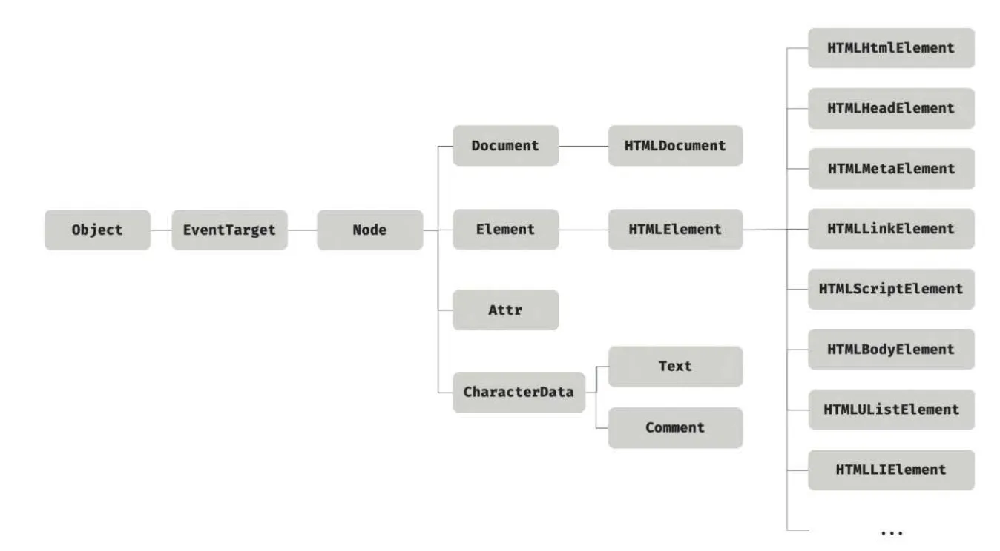

[38. 브라우저의 렌더링 과정](#38-브라우저의-렌더링-과정)

[39. DOM](#39-dom)

# 38. 브라우저의 렌더링 과정

**브라우저의 렌더링 과정**

1. HTML, CSS, JS, 이미지, 폰트 파일 등 렌더링에 필요한 리소스를 요청하고 서버로부터 응답을 받는다.
2. 브라우저의 렌더링 엔진은 서버로부터 응답된 HTML과 CSS를 파싱하여 DOM과 CSSOM을 생성하고 이들을 결합하여 렌더 트리를 생성한다.
3. 브라우저의 자바스크립트 엔진은 서버로부터 응답된 자바스크립트를 파싱히여 AST를 생성하고 바이트코드로 변환하여 실행한다.
   1. 이때 자바스크립트 DOM API를 통해 DOM이나 CSSOM을 변경할 수 있다.
   2. 변경되면 다시 렌더 트리로 결합된다.
4. 렌더 트리를 기반으로 HTML 요소의 레이아웃을 계산하고 브라우저 화면에 HTML 요소를 페인팅한다.

## 38.1 요청과 응답

**렌더링에 필요한 리소스는 모두 서버에 존재하므로 필요한 리소스를 서버에 요청하고 서버가 응답한 리소스를 파싱하여 렌더링한다.**

- 서버에 요청을 전송하기 위해 브라우저는 주소창을 제공한다.
- 브라우저의 주소창에 URL을 입력하고 엔터 키를 누르면 URI의 호스트 이름이 DNS를 통해 IP 주소로 변환되고 이 IP 주소를 갖는 서버에게 요청을 전송한다.
- 서버는 루트 요청에 대해 서버의 루트 폴더에 존재하는 정적 파일 `index.html` 을 클라이언트로 응답한다.
  - 다른 정적 파일을 서버에 요청하려면 브라우저의 주소창에 요청할 정적 파일의 경로와 파일의 이름을 URI의 호스트 뒤의 패스(path)에 기술하여 서버에 요청한다.

## 38.2 HTTP 1.1과 HTTP 2.0

**HTTP(HyperText Transfer Protocol)는 웹에서 브라우저와 서버가 통신하기 위한 프로토콜(규약)이다.**

- `HTTP/1.1`
  - 커넥션당 하나의 요청과 응답만 처리한다.
  - 즉 여러개의 요청을 한 번에 전송할 수 없고 응답 또한 마찬가지다.
  - 따라서 HTML 문서 내에 포함된 여러 개의 리소스 요청이 개별적으로 전송되고 으답 또한 개별적으로 전송된다.
  - **리소스의 동시전송이 불가능한 구조이므로 요청할 리소스의 개수에 비례하여 응답 시간도 증가하는 단점이 있다.**
- `HTTP/2.0`
  - **커넥션당 여러 개의 요청과 응답, 즉 다중 요청/응답이 가능하다.**
  - 여러 리소스의 동시 전송이 가능하므로 HTTP/1.1에 비해 페이지 로드 속도가 약 50% 정도 빠르다고 알려져있다.

## 38.3 HTML 파싱과 DOM 생성

**브라우저의 요청에 의해 서버가 응답한 HTML 문서는 문자열로 이루어진 순수한 텍스트다.**

**순수한 텍스트를 브라우저에 시각적인 픽셀로 렌더링하려면 HTML 문서를 브라우저가 읽을 수 있는 자료구조(객체)로 변환하여 메모리에 저장해야한다.**

- 브라우저의 렌더링 엔진은 응답은 HTML 문서를 파싱하여 브라우저가 이해할 수 있는 자료구조인 DOM을 생성한다.
  1. 서버에 존재하던 HTML 파일이 브라우저의 요청에 의해 응답된다. 서버는 브라우저가 요청한 HTML 파일일 읽어 들여 메모리에 저장한 다음 메모리에 저장된 바이트를 인터넷을 경유하여 응답한다.
  2. 브라우저는 서버가 응답한 HTML 문서를 바이트 형태로 응답받는다. 응답된 바이트 형태의 HTML 문서는 `meta` 태그의 `charset` 어트리뷰트에 의해 지정된 인코딩 방식을 기준으로 문자열로 변환된다. 브라우저는 이를 확인하고 문자열로 변환한다.
  3. 문자열로 변환된 HTML 문서를 읽어 들여 문법적 의미를 갖는 코드의 최소 단위인 토큰들로 분해한다.
  4. 각 토큰들을 객체로 변환하여 **노드(node)**들 을 생성한다. 토큰의 내용에 따라 문서 노드, 요소 노드, 어트리뷰트 노드, 텍스트 노드가 생성되며 이후 DOM을 구성하는 기본 요소가 된다.
  5. HTML 문서는 HTML 요소들의 집합으로 이루어지며 **HTML 요소는 중첩 관계를 갖는다.** HTML 요소의 콘텐츠 영역에는 텍스트뿐만 아니라 다른 HTML 요소도 포함될 수 있다.
     1. 이때 중첩 관계에 의해 부자 관계가 형성된다. 이러한 HTML 요소 간의 부자 관계를 반영하여 모든 노드들을 **트리 자료구조**로 구성한다. 이 노드들로 구성된 트리 자료구조를 **DOM(Document Object Model)** 이라 부른다.
- **DOM(Document Object Model)은 HTML 문서를 파싱한 결과물이다.**

## 38.4 CSS 파싱과 CSSOM 생성

**렌더링 엔진은 HTML을 처음부터 순차적으로 파싱하여 DOM을 생성해 나간다. 이처럼 렌더링 엔진은 DOM을 생성해 나가다가 CSS를 로드하는 `link` 태그나 `style` 태그를 만나면 `DOM` 생성을 일시 중단한다.**

- `link` 태그의 `href` 어트리뷰트에 지정된 CSS 파일을 서버에 요청하여 로드한 CSS 파일이나 style 태그 내의 CSS를 HTML과 동일한 파싱 과정을 거치며 해석하여 `CSSOM(CSS Object Model)` 을 생성한다.
- 이후 CSS 파싱을 완료하면 HTML 파싱이 중단된 지점부터 다시 HTML을 파싱하기 시작하여 DOM 생성을 재개한다.
- CSSOM은 CSS 상속을 반영하여 생성된다.

## 38.5 렌더 트리 생성

렌더링 엔진은 서버로부터 응답된 HTML과 CSS를 파싱하여 각각 DOM과 CSSOM을 생성한다. 그리고 DOM과 CSSOM은 렌더링을 위해 `렌더 트리(render tree)` 로 결합된다.

- 렌더 트리는 렌더링을 위한 트리 구조의 자료구조다.
  - 브라우저 화면에 렌더링 되지 않는 노드(ex. meta태그, script 태그 등)와 CSS에 의해 비표시 되는 노드들은 포함하지 않는다.
  - 다시 말해, 렌더 트리는 브라우저 화면에 렌더링되는 노드만으로 구성된다.
- 완성된 렌더 트리는 각 HTML 요소의 레이아웃(위치와 크기)을 계산하는 데 사용되며 브라우저 화면에 픽셀을 렌더링하는 페인팅 처리에 입력된다.
- 브라우저의 렌더링 과정이 반복돼서 실행되는 경우 레이아웃 계산과 페인팅이 재차 실행된다.
  - 자바스크립트에 의한 노드 추가 또는 삭제
  - 브라우저 창의 리사이징에 의한 뷰포트(viewport) 크기 변경
  - HTML 요소의 레이아웃에 변경을 발생시키는 스타일의 변경
- 리렌더링은 성능에 악영향을 주는 작업이다. 따라서 가급적 리렌더링이 빈번하게 발생하지 않도록 주의할 필요가 있다.

## 38.6 자바스크립트 파싱과 실행

**자바스크립트 코드에서 `DOM API` 를 사용하면 이미 생성된 DOM을 동적으로 조작할 수 있다.**

- css 파싱 과정과 마찬가지로 렌더링 엔진은 HTML을 한 줄씩 순차적으로 파싱하며 DOM을 생성해 나가다가 자바스크립트 파일을 로드하는 script 태그나 자바스크립트 코드를 콘텐츠로 담은 script 태그를 만나면 DOM 생성을 일시 중지한다.
- 자바스크립트 엔진은 자바스크립트를 해석하여 `AST(Abstract Syntax Tree, 추상적 구문 트리)` 를 생성한다.
  - AST를 기반으로 인터프리터가 실행할 수 있는 중간 코드인 바이트 코드를 생성하여 실행한다.

### 토크 나이징(tokenizing)

**단순한 문자열인 자바스크립트 소스코드를 어휘 분석하여 문법적 의미를 갖는 코드의 최소 단위인 토큰들로 분해한다.**

- 이 과정을 렉싱이라고 부르기도 하지만 토크나이징과 미묘한 차이가 있다.

### 파싱(parsing)

**토큰들의 집합을 구문 분석하여 AST를 생성한다.**

- AST는 토큰에 문법적 의미와 구조를 반영한 트리 구조의 자료구조다.
- AST는 인터프리터, 컴파일러에 사용하고 또한 트랜스파일러를 구현할 수도 있다.

### 바이트코드 생성과 실행

**파싱의 결과물로서 생성된 AST는 인터프리터가 실행할 수 있는 중간 코드인 바이트코드로 변환되고 인터프리터에 의해 실행된다.**

- V8 엔진의 경우 터보팬(TuboFan)이라 불리는 컴파일러에 의해 최적화된 머신 코드로 컴파일되어 성능을 최적화한다.

## 38.7 리플로우와 리페인트

자바스크립트 코드에 DOM이나 CSSOM을 변경하는 DOM API가 사용된 경우 DOM이나 CSSOM이 변경된다.

- 이때 변경된 DOM과 CSSOM은 다시 렌더 트리로 결합되고 변경된 렌더 트리를 기반으로 라이아웃과 페인트 과정을 거쳐 브라우저의 화면에 다시 렌더링한다.
- **리플로우(reflow)**
  - 레이아웃 계산을 다시 하는 것을 말하며, 노드 추가/삭제, 요소의 크기/위치 변경, 윈도우 리사이징 등 레이아웃에 영향을 주는 변경이 발생한 경우에 한해 실행된다.
- **리페인트(repaint)**
  - 리페인트는 재결합된 렌더 트리를 기반으로 다시 페인트 하는 것을 말한다.
- 리플로우와 리페인트가 순차적으로 동시에 실행되는 것은 아니다.
- 레이아웃에 영향이 없는 변경은 리플로우 없이 리페인트만 실행된다.

## 38.8 자바스크립트 파싱에 의한 HTML 파싱 중단

**렌더링 엔진과 자바스크립트 엔진은 병렬적으로 파싱을 실행하지 않고 직렬적으로 파싱을 수행한다.**

- 브라우저는 동기적으로, 위에서 아래 방향으로 순차적으로 HTML, CSS, JS를 파싱하고 실행한다.
- 이는 script 태그의 위치에 따라 HTML 파싱이 블로킹되어 DOM 생성이 지연될 수 있다는 것을 의미한다.
  - 따라서 script 태그의 위치는 중요한 의미를 갖는다.
- 자바스크립트를 body 요소의 가장 아래에 위치하는 이유
  - DOM이 완성되지 않은 상태에서 자바스크립트가 DOM을 조작하면 에러가 발생할 수 있다.
  - 자바스크립트 로딩/파싱/실행으로 인해 HTML 요소들의 렌더링에 지장받는 일이 발생하지 않아 페이지 로딩 시간이 단축된다.

## 38.9 script 태그의 async/defer 어트리뷰트

**자바스크립트 파싱에 의한 DOM 생성이 중단 되는 문제를 근본적으로 해결하기 위해 HTML5부터 script 태그에 `async` 와 `defer` 어트리뷰트가 추가되었다.**

- `async` 와 `defer` 어트리뷰트는 외부 자바스크립트 파일을 로드하는 경우에만 사용할 수 있다.
  - src 어트리뷰트가 없는 인라인 자바스크립트에는 사용할 수없다.
- HTML 파싱과 외부 자바스크립트 파일의 로드가 비동기적으로 동시에 진행된다.

```html
<script async src="extern.js"></script>
<script defer src="extern.js"></script>
```

### async 어트리뷰트

**HTML 파싱과 외부 자바스크립트 파일의 로드가 비동기적으로 동시에 진행된다.**

- 자바스크립트의 파싱과 실행은 자바스크립트 파일의 로드가 완료된 직후 진행되며, 이때 HTML 파싱이 중지된다.
- 여러 개의 script 태그에 async 어트리뷰트를 지정하면 script 태그의 순서와는 상관없이 로드가 완료된 자바스크립트부터 먼저 실행되므로 순서가 보장되지 않는다.
- 순서가 보장된 script 태그에는 `async` 어트리뷰트를 지정하지 않아야 한다.
- `async` 어트리뷰트는 IE10 이상에서 지원된다.

### defer 어트리뷰트

**`async` 어트리뷰트와 마찬가지로 HTML 파싱과 외부 자바스크립트 파일의 로드가 비동기적으로 동시에 진행된다.**

- 자바스크립트의 파싱과 실행은 HTML 파싱이 완료된 직후(이때 DOMContentLoaded 이벤트가 발생한다) DOM 생성이 완료된 직후 진행된다.
- 따라서 DOM 생성이 완료된 이후 실행되어야 할 자바스크립트에 유용하다.
- `defer` 어트리뷰트는 IE10 이상에서 지원된다.

# 39. DOM

브라우저의 렌더링 엔진은 HTML 문서를 파싱하여 브라우저가 이해할 수 있는 자료구조인 DOM을 생성한다.

**DOM(Document Object Model)은 HTML 문서의 계층적 구조와 정보를 표현하며 이를 제어할 수 있는 API, 즉 프로퍼티와 메서드를 제공하는 트리 자료구조다.**

## 39.1 노드

### HTML 요소와 노드 객체

HTML 요소는 HTML 문서를 구성하는 개별적인 요소를 의미한다.


- HTML 요소는 렌더링 엔진에 의해 파싱되어 DOM을 구성하는 요소 노드 객체로 변환된다.
  - HTML 요소의 어트리뷰트는 어트리뷰트로 변환
  - HTML 요소의 텍스트 콘텐츠는 텍스트 노드로 변환
- 콘텐츠 영약에는 텍스트뿐만 아니라 다른 HTML 요소도 포함될 수 있다.

  - HTML 요소 간에는 중첩 관계에 의해 계층적인 부자 관계가 형성된다.
  - HTML 요소를 객체화한 모든 노드 객체들을 트리 자료 구조로 구성한다.

- **트리 자료구조**

**트리 자료구조는 노드들의 계층 구조로 이뤄진다.**

- 트리 자료구조는 부모 노드와 자식 노드로 구성되어 노드 간의 계층적 구조를 표현하는 비선형 자료구조를 말한다.
- 최상위 노드는 부모 노드가 없으며, 루트 노드라 한다.
  - 루트 노드는 0개 이상의 자식 노드를 갖는다.
  - 자식 노드가 없는 노드를 리프 노드(leaf node)라 한다.
- 노드 객체들로 구성된 트리 자료구조를 DOM이라 한다.
  - 노드 객체의 트리로 구조화 되어있기 때문에 DOM을 DOM 트리라고 부르기도 한다.

### 노드 객체의 타입

**노드 객체는 총 12개의 종류(노드 타입)가 있다. 중요한 노드 타입은 4가지다.**

- **문서 노드(document node)**
  - 문서 노드는 DOM 트리의 최상위에 존재하는 루트 노드로서 `document` 객체를 가리킨다.
  - `document` 객체는 브라우저가 렌더링한 HTML 문서 전체를 가리키는 객체로서 전역 객체 window의 document 프로퍼티에 바인딩되어 있다.
    - 따라서 문서 노드는 `window.document` 또는 `document` 로 참조할 수 있다.
  - `document` 객체는 DOM 트리의 루트 노드이므로 DOM 트리의 노드들에 접근하기 위한 진입점 역할을 담당한다.
- **요소 노드(element node)**
  - 요소 노드는 HTML 요소를 가리키는 객체다.
  - 요소 노드는 HTML 요소 간의 중첩에 의해 부자 관계를 가지며, 이 부자 관계를 통해 정보를 구조화한다.
  - 따라서 요소 노드는 문서의 구조를 표현한다고 할 수 있다.
- **어트리뷰트 노드(attribute node)**
  - 어트리뷰트 노드는 HTML 요소의 어트리뷰트를 가리키는 객체다.
  - 어트리뷰트 노드는 어트리뷰트가 지정된 HTML 요소의 요소 노드와 연결되어 있다.
    - 단, 요소 노드는 부모 노드와 연결되어 있지만 어트리뷰트 노드는 부모 노드와 연결되어 있지 않고 요소 노드에만 연결되어 있다.
    - 즉, 어트리뷰트 노드는 부모 노드가 없으므로 요소 노드의 형제 노드는 아니다.
  - 따라서 어트리뷰트 노드에 접근하여 어트리뷰트를 참조하거나 변경하려면 먼저 요소 노드에 접근해야 한다.
- **텍스트 노드(text node)**
  - 텍스트 노드는 HTML 요소의 텍스트를 가리키는 객체다.
  - 요소 노드가 문서의 구조를 표현한다면 텍스트 노드는 문서의 정보를 표현한다고 할 수 있다.
  - 텍스트 노드는 요소 노드의 자식 노드이며, 자식 노드를 가질 수 없는 리프 노드다.
    - 즉, 텍스트 노드는 DOM 트리의 최종단이다.
  - 따라서 텍스트 노드에 접근하려면 먼저 부모 노드인 요소 노드에 먼저 접근해야 한다.

### 노드 객체의 상속 구조

**DOM을 구성하는 노드 객체는 ECMAScript 사양에 정의된 표준 빌트인 객체가 아니라 브라우저 환경에서 추가적으로 제공하는 호스트 객체다.**

- 노드 객체도 자바스크립트 객체이므로 프로토타입에 의한 상속 구조를 갖는다.



- 모든 노드 객체는 `Object` , `EventTarget` , `Node` 인터페이스를 상속받는다.
- `input` 요소 노드 객체도 다음과 같이 다양한 특성을 갖는 객체이며, 이러한 특성을 나타내는 기능들을 상속을 통해 제공받는다.

| input 요소 노드 객체의 특성                                                | 프로토타입을 제공하는 객체 |
| -------------------------------------------------------------------------- | -------------------------- |
| 객체                                                                       | Object                     |
| 이벤트를 발생시키는 객체                                                   | EventTarget                |
| 트리 자료구조의 노드 객체                                                  | Node                       |
| 브라우저가 렌더링할 수 있는 웹 문서의 요소(HTML, XML, SVG)를 표현하는 객체 | Element                    |
| 웹 문서의 요소 중에서 HTML 요소를 표현하는 객체                            | HTMLElement                |
| HTML 요소 중에서 input 요소를 표현하는 객체                                | HTMLInputElement           |

- 노드 타입에 상관없이 노드 객체가 공통으로 갖는 기능도 있고, 노드 타입에 따라 고유한 기능도 있다.
- **DOM은 HTML 문서의 계층적 구조와 정보를 표현하는 것은 물론 노드 객체의 종류, 즉 노드 타입에 따라 필요한 기능을 프로퍼티와 메서드의 집합인 DOM API로 제공한다.**
  - 이 DOM API를 통해 HTML의 구조나 내용 또는 스타일 등을 동적으로 조절할 수 있다.

## 39.2 요소 노드 취득

**요소 노드의 취득은 HTML 요소를 조작하는 시작점이다. 이를 위해 DOM은 요소 노드를 취득할 수 있는 다양한 메서드를 제공한다.**

### id를 이용한 요소 노드 취득

**`Document.prototype.getElementById` 메서드는 인수로 전달한 id 어트리뷰트 값을 갖는 하나의 요소 노드를 탐색하여 반환한다.**

- `getElementById` 메서드는 `Document.prototype` 의 프로퍼티다.
  - 따라서 반드시 문서 노드인 `document` 를 통해 호출해야 한다.
- `id` 값은 HTML 문서 내에서 유일한 값이어야 하며, class 어트리뷰트와는 달리 공백 문자로 구분하여 여러 개의 값을 가질 수 없다.
  - HTML 문서 내에 중복된 id 값을 갖는 요소가 여러 개 존재하더라도 어떠한 에러도 발생하지 않는다.
  - 이러한 경우 첫 번째 요소 노드만 반환한다.
- 인수로 전달된 id 값을 갖는 HTML 요소가 존재하지 않는 경우 `getElementById` 메서드는 null을 반환한다.

```jsx
// getElemectById 메서드는 언제나 단 하나의 요소 노드를 반환한다.
// 첫 번째 li 요소가 파싱되어 생성된 요소 노드가 반환된다.
const $elem = document.getElementById("banana");
```

### 태그 이름을 이용한 요소 노드 취득

**`Document.prototype/Element.prototype.getElementsByTagName` 메서드는 인수로 전달한 태그 이름을 갖는 모든 요소들을 탐색하여 반환한다.**

- `getElementByTagName` 메서드는 여러 개의 요소 노드 객체를 갖는 DOM 컬렉션 객체인 HTMLCollection 객체를 반환한다.
- 함수는 하나의 값만 반환할 수 있으므로 여러 개의 값을 반환하려면 배열이나 객체와 같은 자료구조에 담에 반환해야 한다.
  - `getElementsByTagName` 메서드가 반환하는 DOM 컬렉션 객체인 HTMLCollection 객체는 유사 배열 객체이면서 이터러블이다.

```jsx
// 태그 이름이 li인 요소 노드를 모두 탐색하여 반환한다.
// 탐색된 요소 노드들은 HTMLCollection 객체에 담겨 반환된다.
const $elems = document.getElementsByTagName("li");
```

### class를 이용한 요소 노드 취득

**`Document.prototype/Element.prototype.getElementsByClassName` 메서드는 인수로 전달한 class 어트리뷰트 값을 갖는 모든 요소 노드들을 탐색하여 반환한다.**

- 인수로 전달한 class 값은 공백으로 구분하여 여러 개의 class를 지정할 수 있다.
- `getElementsByClassName` 메서드는 여러 개의 요소 노드 객체를 갖는 DOM 컬렉션 객체인 HTMLCollection 객체를 반환한다.

```jsx
// class 값이 'fruit'인 요소 노드를 모두 탐색하여 HTMLCollection 객체에 담아 반환한다.
const $elems = document.getElementsByClassName("fruit");

// #fruits 요소의 자손 노드 중에서 class 값이 'banana'인 요소 노드를 모두 탐색하여 반환한다.
const $fruits = document.getElementById("fruits");
const $bananaFromFruits = $fruits.getElementsByClassName("banana");
```

### CSS 선택자를 이용한 요소 노드 취득

**CSS 선택자는 스타일을 적용하고자 하는 HTML 요소를 특정할 때 사용하는 문법이다.**

```scss
// 전체 선택자: 모든 요소를 선택
* { ... }
// 태그 선택자: 모든 p 태그 요소를 모두 선택
p { ... }
// id 선택자: id 값이 'foo'인 요소를 모두 선택
#foo { ... }
// class 선택자: class 값이 'foo'인 요소를 모두 선택
.foo { ... }
// 어트리뷰터 선택자: input 요소 중에 type 어트리뷰트 값이 'text'인 요소를 모두 선택
input[type=text] { ... }
// 후손 선택자: div 요소의 후손 요소 중 p 요소를 모두 선택
div p { ... }
// 자식 선택자: div 요소의 자식 요소 중 p 요소를 모두 선택
div > p { ... }
// 인접 형제 선택자: p 요소의 형제 요소 중에 p 요소 바로 뒤에 위치하는 ul 요소를 선택
p + ul { ... }
// 일반 형제 선택자: p 요소의 형제 요소 중에 p 요소 뒤에 위치하는 ul 요소를 모두 선택
p ~ ul { ... }
// 가상 클래스 선택자: hover 상태인 a 요소를 모두 선택
a:hover { ... }
// 가상 요소 선택자: p 요소 콘텐츠의 앞에 위치하는 공간을 선택, 일반적으로 content 프로퍼티와 함께 사용된다.
p::before P { ... }
```

- **`Document.prototype/Element.prototype.querySelector` 메서드는 인수로 전달한 CSS 선택자를 만족시키는 하나의 요소를 탐색하여 반환한다.**
  - 인수로 전달한 CSS 선택자를 만족시키는 요소 노드가 여러 개인 경우 첫 번째 요소 노드만 반환한다.
  - 인수로 전달한 CSS 선택자를 만족시키는 요소 노드가 존재하지 않는 경우 null을 반환한다.
  - 인수로 전달한 CSS 선택자가 문법에 맞지 않는 경우 DOMException 에러가 발생한다.
- **`Document.prototype/Element.prototype.querySelectorAll` 메서드는 인수로 전달한 CSS 선택자를 만족시키는 모든 요소 노드를 탐색하여 반환한다.**
  - 여러 개의 요소 노드 객체를 갖는 DOM 컬렉션 객체인 NodeList 객체를 반환한다.
    - NodeList 객체는 유사 배열이면서 이터러블이다.
  - 인수로 전달된 CSS 선택자를 만족시키는 요소가 존재하지 않을 경우 빈 NodeList 객체를 반환한다.
  - 인수로 전달한 CSS 선택자가 문법에 맞지 않는 경우 DOMException 에러가 발생한다.

```jsx
// class 어트리뷰트 값이 'banana'인 첫 번째 요소 노드를 탐색하여 반환한다.
const $elem = document.querySelector(".banana");
// 취득한 요소 노드의 style.color 프로퍼티 값을 변경한다.
$elem.style.color = "red";

// ul 요소의 자식 요소인 li 요소를 모두 탐색하여 반환한다.
const $elems = document.querySelectorAll("ul > li");
```

- CSS 선택자 문법을 사용하는 `querySelector` , `querySelectorAll` 메서드는 `getElementById` , `getElementsBy***` 메서드보다 다소 느린 것으로 아렬져 있다.
- 하지만 CSS 선택자 문법을 사용하여 좀 더 구체적인 조건으로 요소 노드를 취득할 수 있고 일관된 방식으로 요소 노드를 취득할 수 있다는 장점이 있다.
- 따라서 id 어트리뷰트가 있는 요소 노드를 취득하는 경우에는 `getElementById` 메서드를 사용한다
  - 그 외의 경우에는 `querySelector` , `querySelectorAll` 메서드를 사용하는 것을 권장한다.

### 특정 요소 노드를 취득할 수 있는지 확인

**`Element.prototype.matches` 메서드는 인수로 전달한 CSS 선택자를 통해 특정 요소 노드를 취득할 수 있는지 확인한다.**

- `Element.prototype.matches` 메서드는 이벤트 위임을 사용할 때 유용하다.

```jsx
const $apple = document.querySelector(".apple");

// $apple 노드는 #fruits > li.apple로 취득할 수 있다.
console.log($apple.matches("#fruits > li.apple")); // true

// $apple 노드는 #fruits > li.banana로 취득할 수 없다.
console.log($apple.matches("#fruits > li.banana")); // false
```

### HTMLCollection 과 NodeList

- DOM API가 여러 개의 결과값을 반환하기 위한 DOM 컬렉션 객체다.
  - 유사 배열 객체이면서 이터러블이다.
- `HTMLCollection` 과 `NodeList` 의 중요한 특징은 노드 객체의 상태 변화를 실시간으로 반영하는 살아 있는 개체이다.
  - `HTMLCollection` 은 언제나 live 객체로 동작한다.
  - `NodeList` 는 대부분의 경우 노드 객체의 상태 변화를 실시간으로 반영하지 않고 과거의 정적 상태를 유지하는 non-live 객체로 동작하지만 경우에따라 live 객체로 동작할 때가 있다.

### HTMLCollection

**`getElementsByTagName` , `getElementsByClassName` 메서드가 반환하는 `HTMLCollection` 객체는 노드 객체의 상태 변화를 실시간으로 반영하는 살아 있는 DOM 컬렉션 객체다.**

- `HTMLCollection` 객체는 실시간으로 노드 객체의 상태 변경을 반영하여 요소를 제거할 수 있기 때문에 `HTMLCollection` 객체를 for 문으로 순회하면서 노드 객체의 상태를 변경해야 할 때 주의해야 한다.
  - 이 문제는 for 문을 역방향으로 순회하는 방법으로 회피할 수 있다.
  - 또는 while 문을 사용하여 노드 객체가 남아 있지 않을 때까지 무한 반복하는 방법으로 회피할 수도 있다.
- 간단한 해결 방법은 부작용을 발생시키는 `HTMLCollection` 객체를 사용하지 않는 것이다.
  - `HTMLCollection` 객체를 배열로 변환하면 부작용을 발생시키는 `HTMLCollection` 객체를 사용할 필요가 없고 유용한 배열의 고차 함수를 사용할 수 있다.

### NodeList

**`querySelectorall` 메서드는 DOM 컬렉션 객체인 `NodeList` 객체를 반환한다. `NodeList` 객체는 실시간으로 노드 객체의 상태 변경을 반영하지 않는 객체다.**

- `NodeList` 객체는 `NodeList.prototype.forEach` 메서드를 상속받아 사용할 수 있다.
- `NodeList` 객체는 노드 객체의 상태 변경을 실시간으로 반영하지 않고 과거의 정적 상태를 유지하는 `non-live` 객체로 동작한다.
  - 하지만 `childNodes` 프로퍼티가 반환하는 `NodeList` 객체는 `HTMLCollection` 객체와 같이 실시간으로 노드 객체의 상태 변경을 반영하려는 `live` 객체로 동작하므로 주의가 필요하다.

**노드 객체의 상태 변경과 상관없이 안전하게 DOM 컬렉션을 사용하려면 `HTMLCollection` 이나 `NodeList` 객체를 배열로 변환하여 사용하는 것을 권장한다.**

- 스프레드 문법이나 `Array.from` 메서드를 사용하여 간단히 배열로 변환할 수 있다.

## 39.3 노드 탐색

**요소 노드를 취득한 다음, 취득한 요소 노드를 기점으로 DOM 트리의 노드를 옮겨 다니며 부모, 형제, 자식 노드 등을 탐색해야 할 때가 있다.**

### 공백 텍스트 노드

**HTML 요소 사이의 스페이스, 탭, 줄바꿈(개행) 등의 공백 문자는 텍스트 노드를 생성한다. 이를 `공백 텍스트 노드` 라 한다.**

- HTML 문서의 공백 문자는 공백 텍스트 노드를 생성한다.
  - 노드를 탐색할 때는 공백 문자가 생성한 공백 텍스트 노드에 주의해야 한다.

### 자식 노드 탐색

**자식 노드를 탐색하기 위해서는 노트 탐색 프로퍼티를 사용한다.**

| 프로퍼티                            | 설명                                                                                                |
| ----------------------------------- | --------------------------------------------------------------------------------------------------- |
| Node.prototype.childNodes           | childNodes 프로퍼티가 반환한 NodeList에는 요소 노드뿐만 아니라 텍스트 노드도 포함되어 있을 수 있다. |
| Element.prototype.children          | children 프로퍼티가 반환한 HTMLCollection에는 텍스트 노드가 포함되지 않는다.                        |
| Node.prototype.firstChild           | 첫 번째 자식 노드를 반환한다. 이는 텍스트 노드이거나 요소 노드이다.                                 |
| Node.portotype.lastChild            | 마지막 자식 노드를 반환한다.                                                                        |
| Element.prototype.firstElementChild | 첫 번째 자식 요소 노드를 반환한다. 요소 노드만 반환한다.                                            |
| Element.prototype.lastElementChild  | 마지막 자식 요소 노드를 반환한다.                                                                   |

### 자식 노드 존재 확인

**자식 노드가 존재하는지 확인하려면 `Node.prototype.hasChildNodes` 메서드를 사용한다.**

- 자식 노드가 존재하면 `true` , 존재하지 않으면 `false` 를 반환한다.
- `childNodes` 프로퍼티와 마찬가지로 텍스트 노드를 포함하여 자식 노드의 존재를 확인한다.
- 자식 노드 중에 텍스트 노드가 아닌 요소 노드가 존재하는지 확인하려면 `hasChildNodes` 메서드 대신 `children.length` 또는 `Element` 인터페이스의 `childElementCount` 프로퍼티를 사용한다.

### 요소 노드의 텍스트 노드 탐색

**요소 노드의 텍스트 노드는 요소 노드의 자식 노드다.**

- 요소 노드의 텍스트 노드는 `firstChild` 프로퍼티로 접근할 수 있다.
  - 첫 번째 자식 노드를 반환한다.
- `firstChild` 프로퍼티가 반환한 노드는 텍스트 노드이거나 요소 노드다.

### 부모 노드 탐색

**부모 노드를 탐색하려면 `Node.prototype.parentNode` 프로퍼티를 사용한다.**

- 텍스트 노드는 DOM 트리의 최종단 노드인 리프 노드이므로 부모 노드가 텍스트 노드인 경우는 거의 없다.

### 형제 노드 탐색

**부모 노드가 같은 형제 노드를 탐색하려면 노드 탐색 프로퍼티를 사용한다.**

- 단, 어트리뷰트 노드는 요소 노드와 연결되어 있지만 부모 노드가 같은 형제 노드가 아니기 때문에 반환되지 않는다.
  - 텍스트 노드 또는 요소 노드만 반환한다.

| 프로퍼티                                 | 설명                                                                                                                     |
| ---------------------------------------- | ------------------------------------------------------------------------------------------------------------------------ |
| Node.prototype.previousSibling           | 부모 노드가 같은 형제 노드 중에서 자신의 이전 형제 노드를 탐색하여 반환한다. 요소 노드뿐 아니라 텍스트 노드일 수도 있다. |
| Node.prototype.nextSibling               | 부모 노드가 같은 형제 노드 중에서 자신의 다음 형제 노드를 탐색하여 반환한다.                                             |
| Element.prototype.previousElementSibling | 부모 노드가 같은 형제 노드 중에서 자신의 이전 형제 노드를 탐색하여 반환한다. 요소 노드만 반환한다                        |
| Element.prototype.nextElementSibling     | 부모 노드가 같은 형제 노드 중에서 자신의 다음 형제 요소 노드를 탐색하여 반환한다.                                        |

## 39.4 노드 정보 획득

**노드 객체에 대한 정보를 취득하려면 다음과 같은 노드 정보 프로퍼티를 사용한다.**

| 프로퍼티                | 설명                                                                        |
| ----------------------- | --------------------------------------------------------------------------- |
| Node.prototype.nodeType | 노드 타입을 나타내는 상수를 반환하며, 노드 타입 상수는 Node에 정의되어 있다 |
| Node.prototype.nodeName | 노드의 이름을 문자열로 반환한다.                                            |

## 39.5 요소 노드의 텍스트 조작

### nodeValue

**`Node.prototype.nodeValue` 프로퍼티는 setter와 getter 모두 존재하는 접근자 프로퍼티다.**

- `nodeValue` 프로퍼티는 참조와 할당 모두 가능하다.
- 노드 객체의 `nodeValue` 프로퍼티를 참조하면 노드 객체의 값을 반환한다.
  - 노드 객체의 값은 텍스트 노드의 텍스트다.
  - 텍스트 노드가 아닌 노드를 참조하면 null을 반환한다.
- 텍스트 노드의 `nodeValue` 프로퍼티에 값을 할당하면 텍스트를 변경할 수 있다.

```jsx
// 1. #foo 요소 노드의 자식 노드인 텍스트 노드를 취득한다.
const $textNode = document.getElementById("foo").firstChild;

// 2. nodeValue 프로퍼티를 사용하여 텍스트 노드의 값을 변경한다.
$textNode.nodeValue = "world";

console.log($textNode.nodeValue); // world
```

### textContent

**`Node.prototype.textContent` 프로퍼티는 setter와 getter 모두 존재하는 접근자 프로퍼티로서 요소 노드의 텍스트와 모든 자손 노드의 텍스트를 모두 취득하거나 변경한다.**

- 요소 노드의 `textContent` 프로퍼티를 참조하면 요소 노드의 콘텐츠 영약 내의 텍스트를 모두 반환한다.
  - 이때 HTML 마크업은 무시된다.

```html
...
<div id="foo">Hello <span>world! </span></div>
...

<script>
  // #foo 요소 노드의 텍스트를 모두 취득하며 HTML 마크업은 무시된다.
  console.log(document.getElementById("foo").textContent); // Hello world!
</script>
```

## 39.6 DOM 조작

**DOM 조작은 새로운 노드를 생성하여 DOM에 추가하거나 기존 노드를 삭제 또는 교체하는 것을 말한다.**

- DOM 조작에 의해 새로운 노드가 추가되거나 삭제되면 리플로우와 리페인트가 발생하는 원인이 되므로 성능에 영향을 준다.

### innerHTML

**`Element.prototype.innerHTML` 프로퍼티는 setter와 getter 모두 존재하는 접근자 프로퍼티로서 요소 노드의 HTML 마크업 취득을 변경한다.**

- 요소 노드의 `innerHTML` 프로퍼티를 참조하면 요소 노드의 콘텐츠 영역 내에 포함된 모든 HTML 마크업을 문자열로 반환한다.
  - `textContent` 프로퍼티를 참조하면 HTML 마크업을 무시하고 텍스트만 반환하지만 `innerHTML` 프로퍼티는 HTML 마크업이 포함된 문자열을 그대로 반환한다.
- 요소 노드의 `innerHTML` 프로퍼티에 문자열을 할당하면 요소 노드의 모든 자식 노드가 제거되고 할당한 문자열에 포함되어 있는 HTML 마크업이 파싱되어 요소 노드의 자식 노드로 DOM에 반영된다.
  - 사용자로부터 입력받은 데이터를 그대로 `innerHTML` 프로퍼티에 할당하는 것은 **크로스 사이트 스크럽팅 공격**에 취약하므로 위험하다.
- `innerHTML` 프로퍼티를 사용한 DOM 조작은 구현이 간단하고 직관적이라는 장점이 있지만 크로스 사이트 스크럽팅 공격에 취약한 단점도 있다.
- 복잡하지 않은 요소를 추가할 때 유용하지만 기존 요소를 제거하지 않으면서 위치를 지정해 새로운 요소를 삽입해야 할 때는 사용하지 않는 것이 좋다.

### insertAdJacentHTML 메서드

**`Element.prototype.insertAdjacentHTML(position, DOMString)` 메서드는 기존 요소를 제거하지 않으면서 위치를 지정해 새로운 요소를 삽입한다.**

- 두 번째 인수로 전달한 HTML 마크업 문자열을 파싱하고 생성된 노드를 첫 번째 인수로 전달한 위치(position)에 삽입하여 DOM에 반영한다.
- 첫 번째 인수로 전달할 수 있는 문자열은 `beforebegin` , `afterbegin` , `beforeend` , `afterend` 의 4가지다.


- `insertAdjacentHTML` 메서드는 기존 요소에는 영향을 주지 않고 새롭게 삽입될 요소만을 파싱하여 자식 요소로 추가한다.
  - 기존의 자식 노드를 모두 제거하고 다시 처음부터 새롭게 자식 노드를 생성하여 자식 요소로 추가하는 `innerHTML` 프로퍼티보다 효율적이고 빠르다.
- HTML 마크업 문자열을 파싱하므로 크로스 사이트 스크립팅 공격에 취약하다는 점은 동일하다.

### 노드 생성과 추가

- **요소 노드 생성**
  - **`Document.prototype.createElement(tagName)` 메서드는 요소 노드를 생성하여 반환한다.**
    - `createElement` 메서드의 매개변수 `tagName` 에는 태그 이름을 나타내는 문자열을 인수로 전달한다.
    - DOM에 추가되지 않고 홀로 존재하는 상태이다. 따라서 이후에 생성된 노드를 DOM에 추가하는 처리가 별도로 필요하다.
    - 아무런 자식 노드를 가지고 있지 않다. 따라서 요소 노드의 자식 노드인 텍스트 노드도 없는 상태이다.
- **텍스트 노드 생성**
  - **`Document.prototype.createTextNode(text)` 메서드는 텍스트 노드를 생성하여 반환한다.**
    - 매개변수 `text` 에는 텍스트 노드의 값으로 사용할 문자열을 인수로 전달한다.
    - 텍스트 노드를 생성할 뿐 요소 노드에 추가하지 않는다. 이후에 생성된 텍스트 노드를 요소 노드에 추가하는 처리가 별도로 필요하다.
- **텍스트 노드를 요소 노드의 자식 노드로 추가**
  - `Node.prototype.appendChild(childNode)` 메서드는 매개변수 `childNode` 에게 인수로 전달한 노드를 `appendChild` 메서드를 호출한 노드의 마지막 자식 노드로 추가한다.
  - `appendChild` 메서드의 인수로 `createTextNode` 메서드로 생성한 텍스트 노드를 전달하면 `appendChild` 메서드를 호출한 노드의 마지막 자식 노드로 텍스트가 추가된다.
  - 요소 노드에 자식 노드가 하나도 없는 경우에는 텍스트 노드를 생성하여 요소 노드의 자식 노드로 텍스트 노드를 추가하는 것보다 `textContent` 프로퍼티를 사용하는 편이 더욱 간편하다.
  ```javascript
  // 텍스트 노드를 $li 요소 노드의 자식 노드로 추가
  $li.appendChild(textNode);
  ```
- **요소를 노드 DOM에 추가**
  - `Node.prototype.appendChild` 메서드를 사용하여 텍스트의 노드와 부자 관계로 연결한 노드를 요소 노드의 마지막 자식 요소로 추가한다.
  ```javascript
  // $li 요소 노드를 #fruits 요소 노드의 마지막 자식 노드로 추가
  $fruits.appendChild($li);
  ```

### 복수의 노드 생성과 추가

여러 개의 요소 노드를 생성하여 DOM에 추가하는 방법

- 컨테이너 요소 미리 생성
- DOM에 추가해야할 여러 개의 요소 노드를 컨테이너 요소에 자식 노드로 추가하고, 컨테이너 요소를 자식으로 추가하면 DOM은 한 번만 변경된다.

### 노드 삽입

- **마지막 노드로 추가**
  - `Node.prototype.appendChild` 메서드는 인수로 전달받은 노드를 자신을 호출한 노드의 마지막 자식 노드로 DOM에 추가한다.
    - 노드를 추가할 위치는 지정할 수 없고 언제나 마지막 자식 노드로 추가한다.
- **지정한 위치에 노드 삽입**
  - `Node.prototype.insertBefore(newNode, childNode)` 메서드는 첫 번째 인수로 전달받은 노드를 두 번째 인수로 전달받은 노드 앞에 삽입한다.
    - 두 번째 인수로 전달받은 노드는 반드시 `insertBefore` 메서드를 호출한 노드의 자식 노드이어야 한다.

### 노드 이동

**DOM에 이미 존재하는 노드를 `appendChild` 또는 `insertBefore` 메서드를 사용하여 DOM에 다시 추가하면 현재 위치에서 노드를 제거하고 새로운 위치에 노드를 추가한다.**

### 노드 복사

**`Node.prototype.cloneNode([deep: true] | false])` 메서드는 노드의 사본을 생성하여 반환한다.**

- 매개변수 `deep` 에 `true` 를 인수로 전달하면 노드의 깊은 복사를 하여 모든 자손 노드가 포함된 사본을 생성한다.
- `false` 를 인수로 전달하거나 생략하면 노드를 얕은 복사하여 노드 자신만의 사본을 생성한다.
  - 얕은 복사로 생성된 요소 노드는 자손 노드를 복사하지 않으므로 텍스트 노드도 없다.

### 노드 교체

**`Node.prototype.replaceChild(newChild, oldChild)` 메서드는 자신을 호출한 노드의 자식 노드를 다른 노드로 교체한다.**

- 첫 번째 매개변수 `newChild` 에는 교체할 새로운 노드를 인수로 전달한다.
- 두 번째 매개변수 `oldChild` 에는 이미 존재하는 교체될 노드를 인수로 전달한다.
- 즉, `replaceChild` 메서드는 자신을 호출한 노드의 자식 노드인 `oldChild` 노드를 `newChild` 노드로 교체한다.
  - 이때, `oldChild` 노드는 DOM에서 제거된다.

### 노드 삭제

**`Node.prototype.removeChild(child)` 메서드는 `child` 매개변수에 인수로 전달한 노드를 DOM에서 삭제한다.**

- 인수로 전달한 노드는 `removeChild` 메서드를 호출한 노드의 자식 노드이어야 한다.

## 39.7 어트리뷰트

### 어트리뷰트 노드와 attributes 프로퍼티

HTML 요소는 여러 개의 어트리뷰트(속성)을 가질 수 있다.

- HTML 요소의 동작을 제어하기 위한 추가적인 정보를 제공하는 HTML 어트리뷰트는 HTML 요소의 시작 태그에 `어트리뷰트 이름=”어트리뷰트 값”` 형식으로 정의한다.
- 글로벌 어트리뷰트와 이벤트 핸들러 어트리뷰트는 모든 HTML 요소에서 공통적으로 사용할 수 있지만 특정 HTML 요소에만 한정적으로 사용 가능한 어트리뷰트도 있다.
- 모든 어트리뷰트 노드의 참조는 유사 배열 객체이자 이터러블인 `NameNodeMap` 객체에 담겨서 요소 노드의 `attributes` 프로퍼티에 저장된다.
  - getter만 존재하는 읽기 전용 접근자 프로퍼티이며, 요소 노드의 모든 어트리뷰트 노드의 참조가 담긴 `NameNodeMap` 객체를 반환한다.

### HTML 어트리뷰트 조작

**`Element.prototype.getAttribute/setAttribute` 메서드를 사용하면 `attributes` 프로퍼티를 통하지 않고 요소 노드에서 메서드를 통해 직접 HTML 어트리뷰트 값을 취득하거나 변경할 수 있다.**

- HTML 어트리뷰트 값을 참조하려면 `Element.prototype.getAttribute(attributeName)` 메서드를 사용한다.
- HTML 어트리뷰트 값을 변경하려면 `Element.prototype.setAttribute(attributeName, attributeValue)` 메서드를 사용한다.
- 특정 HTML 어트리뷰트가 존재하는지 확인하려면 `Element.prototype.hasAttribute(attributeName)` 메서드를 사용한다.
- 특정 HTML 어트리뷰트를 삭제하려면 `Element.prototype.removeAttribute(attributeName)` 메서드를 사용한다.

### HTML 어트리뷰트 vs Dom 프로퍼티

**요소 노드 객체에는 HTML 어트리뷰트에 대응하는 프로퍼티가(DOM) 존재한다.**

- 이 DOM 프로퍼티들은 HTML 어트리뷰트 값을 초기값으로 가지고 있다.
  - setter와 getter 모두 존재하는 접근자 프로퍼티다.
  - 따라서 DOM 프로퍼티는 참조와 변경이 가능하다.
- **HTML 어트리뷰트의 역할은 HTML 요소의 초기 상태를 지정하는 것이다.**
  - 즉, HTML 어트리뷰트 값은 HTML 요소의 초기 상태를 의미하여 이는 변하지 않는다.
- **요소 노드는 2개의 상태를 가지고있다.**

  - 초기 상태와 최신 상태를 관리해야 한다.
  - 요소 노드의 초기 상태는 어트리뷰트 노드가 관리하며, 요소 노드의 최신 상태는 DOM 프로퍼티가 관리한다.

- **어트리뷰트 노드**
  - HTML 어트리뷰트로 지정한 HTML 요소의 초기 상태는 어트리뷰트 노드에서 관리한다.
  - 어트리뷰트 노드에서 관리하는 어트리뷰트 값은 사용자의 입력에 의해 상태가 변경되어도 변하지 않고 HTML 어트리뷰트로 지정한 HTML 요소의 초기 상태를 그대로 유지한다.
  - 초기 상태 값을 취득하거나 변경하려면 `getAttribute/setAttribute` 메서드를 사용한다.
  - `getAttribute` 메서드로 취득한 값은 어트리뷰트 노드에서 관리하는 HTML 요소에 지정한 어트리뷰트 값, 즉 초기 상태 값이다.
    - 사용자의 입력에 의해 변하지 않으므로 결과는 언제나 동일하다.
  - `setAttribute` 메서드는 어트리뷰트 노드에서 관리하는 HTML 요소에 지정한 어트리뷰트 값, 즉 초기 상태 값을 변경한다.
- **DOM 프로퍼티**
  - 사용자가 입력한 최신 상태는 HTML 어트리뷰트에 대응하는 요소 노드의 DOM 프로퍼티가 관리한다.
  - DOM 프로퍼티는 사용자의 입력에 의한 상태 변화에 반응하여 언제나 최신 상태를 유지한다.
- **HTML 어트리뷰트와 DOM 프로퍼티의 대응 관계**
  - 대부분 HTML 어트리뷰트는 HTML 어트리뷰트의 이름과 동일한 DOM 프로퍼티와 1:1로 대응한다.
    - id 어트리뷰트와 id 프로퍼티는 1:1 대응하며, 동일한 값으로 연동한다.
    - input 요소의 value 어트리뷰트는 value 프로퍼티와 1:1 대응한다.
      - 하지만 value 어트리뷰트는 초기 상태를, value 프로퍼티는 최신 상태를 갖는다.
    - class 어트리뷰트는 className. classList 프로퍼티와 대응한다.
    - for 어트리뷰트는 htmlFor 프로퍼티와 1:1 대응한다.
    - td 요소의 colspan 어트리뷰트는 대응하는 프로피티가 존재하지 않는다.
    - textContent 프로퍼티는 대응하는 어트리뷰트가 존재하지 않는다.
    - 어트리뷰트 이름은 대소문자를 구별하지 않지만 프로퍼티 키는 카멜 케이스를 따른다.
  - **DOM 프로퍼티 값의 타입**
    - `getAttribue` 메서드로 취득한 어트리뷰트 값은 언제나 문자열이다.
    - 하지만 DOM 프로퍼티로 취득한 최신 상태 값은 문자열이 아닐 수도 있다.

### data 어트리뷰트와 dataset 프로퍼티

**`data` 어트리뷰트와 `dataset` 프로퍼티를 사용하면 HTMl 요소에 정의한 사용자 정의 어트리뷰트와 자바스크립트 간에 데이터를 교환할 수 있다.**

- `data` 어트리뷰트는 `data-` 접두사 다음에 임의의 이름을 붙여 사용한다.
- `data` 어트리뷰트는 `HTMLElement.dataset` 프로퍼티로 취득할 수 있다.
- `dataset` 프로퍼티는 HTML 요소의 모든 data 어트리뷰트의 정보를 제공하는 DOMStringMap 객체를 말한다.
- `DomString` 객체는 `data` 어트리뷰트의 `data` 어트리뷰트의 `data-` 접두사 다음에 붙인 임의의 이름을 카멜 케이스로 변환한 프로퍼티를 가지고 있다.
- 이 프로퍼티로 `data` 어트리뷰트의 값을 취득하거나 변경할 수 있다.

## 39.8 스타일

### 인라인 스타일 조작

**`HTMLElement.prototype.style` 프로퍼티는 setter와 getter 모두 존재하는 접근자 프로퍼티로서 요소 노드의 인라인 스타일을 취득하거나 추가, 변경한다.**

- `style` 프로퍼티를 참조하면 `CSSStyleDeclaration` 타입의 객체를 반환한다.
- CSS 프로퍼티는 케밥 케이스(kebab-case)를 따른다.
  - `CSSStyleDeclaration` 객체의 프로퍼티는 카멜케이스를 따른다.
  - 케밥 케이스의 CSS 프로퍼티를 그대로 사용하려면 대괄호 표기법을 사용한다.
- 단위 지정이 필요한 CSS 프로퍼티의 값은 반드시 단위를 지정해야 한다.

```jsx
$div.style.backgroundColor = "yellow";

$div.style["background-color"] = "yellow";

$div.syle.width = "100px";
```

### 클래스 조작

**`.` 으로 시작하는 클래스 선택자를 사용하여 CSS class를 미리 정의한 다음, HTML 요소의 class 어트리뷰트 값을 변경하여 HTML 요소의 스타일을 변경할 수도 있다.**

- `class` 어트리뷰트에 대응하는 DOM 프로퍼티는 class가 아니라 `className` 과 `classList` 다.

- **className**
  - `Element.prototype.className` 프로퍼티는 setter와 getter 모두 존재하는 접근자 프로퍼티로서 HTML 요소의 class 어트리뷰트 값을 취득하거나 변경한다.
  - 요소 노드의 `className` 프로퍼티를 참조하면 class 어트리뷰트 값을 문자열로 반환하고, 요소 노드의 `className` 프로퍼티에 문자열을 할당하면 class 어트리뷰트 값을 할당한 문자열로 변경한다.
  - `className` 프로퍼티는 문자열을 반환하므로 공백으로 구분된 여러 개의 클래스를 반환하는 경우 다루기가 불편하다.
- **classList**
  - `Element.prototype.classList` 프로퍼티는 class 어트리뷰트의 정보를 담은 `DOMTokenList` 객체를 반환한다.
  - `DOMTokenList` 객체는 class 어트리뷰트의 정보를 나타내는 컬렉션 객체로서 유사 배열 객체이면서 이터러블이다.
    - **add(… className)**
      - add 메서드는 인수로 전달한 1개 이상의 문자열을 class 어트리뷰트 값으로 추가한다.
    - **remove(… className)**
      - remove 메서드는 인수로 전달한 1개 이상의 문자열과 일치하는 클래스를 class 어트리뷰트에서 삭제한다.
      - 인수로 전달한 문자열과 일치하는 클래스가 없으면 에러 없이 무시된다.
    - **item(index)**
      - item 메서드는 인수로 전달한 index에 해당하는 클래스를 class 어트리뷰트에서 반환한다.
      - 예를들어 index가 0이면 첫 번째 클래스를 반환하고 1이면 두 번째 클래스를 반환한다.
    - **contains(className)**
      - contains 메서드는 인수로 전달한 문자열과 일치하는 클래스가 class 어트리뷰트에 포함되어 있는지 확인한다.
    - **replace(oldClassName, newClassName)**
      - replace 메서드는 class 어트리뷰트에서 첫 번째 인수로 전달한 문자열을 두 번째 인수로 전달한 문자열로 변경한다.
    - **toggle(className[, force])**
      - toggle 메서드는 class 어트리뷰트에 인수로 전달한 문자열과 일치하는 클래스가 존재하면 제거하고, 존재하지 않으면 추가한다.
      - 두 번째 인수로 불리언 값으로 평가되는 조건식을 추가할 수 있다. 이때 조건식의 평가 결과가 참이면 class 어트리뷰트에 강제로 첫 번째 인수로 전달한 문자열을 추가한다. 거짓이면 강제로 첫 번째 인수로 전달한 문자열을 제거한다.

## 39.9 DOM 표준

HTML과 DOM 표준은 `W3C(World Wide Web Consortium)` 과 `WHATWG(Web Application Technology Working Group)` 이라는 두 단체가 나름대로 협력하면서 공통된 표준을 만들어왔다.

- 그러던 중 서로 다른 결과물을 내놓기 시작했다.
- 별개의 HTML과 DOM 표준을 만드는 것은 이롭지 않으므로 2018년 4월부터 구글, 애플, 마이크로소프트, 모질라로 구성된 4개의 주류 브라우저 벤더사가 주도하는 `WHATWG` 이 단일 표준을 내놓기로 두 단체가 합의했다.
- DOM은 현재 4개의 레벨(버전)이 있다.
