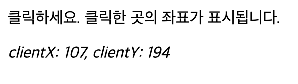
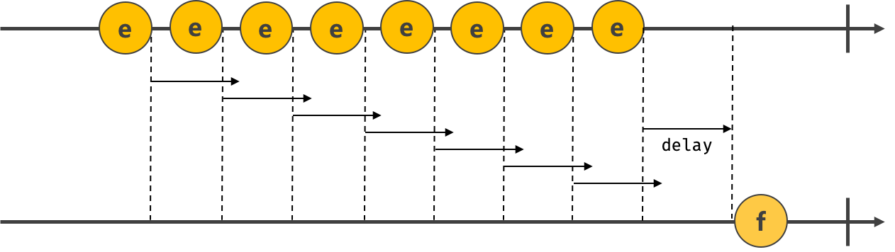

# 40장 이벤트

## 이벤트 드리븐 프로그래밍

<aside>
💬

브라우저는 처리해야 할 특정 사건이 발생하면 이를 감지하여 이벤트를 발생

</aside>

**이벤트 핸들러:** 이벤트가 발생했을 때 호출될 함수
**이벤트 핸들러 등록:** 이벤트가 발생했을 때 브라우저에게 이벤트 핸들러의 호출을 위임하는 것

함수를 언제 호출할지 알 수 없으므로 개발자가 명시적으로 함수를 호출하는 것이 아니라 브라우저에게 함수 호출을 위임하는 것이다.

```html
<!DOCTYPE html>
<html lang="en">
  <body>
    <button>Click me!</button>
    <script>
      const $button = document.querySelector("button");

      // 사용자가 버튼을 클릭하면 함수를 호출하도록 요청
      $button.onclick = () => {
        alert("button click");
      };
    </script>
  </body>
</html>
```

- 이벤트와 그에 대응하는 함수(이벤트 핸들러)를 통해 사용자와 애플리케이션은 상호작용을 할 수 있다.

프로그램의 흐름을 이벤트 중심으로 제어하는 프로그래밍 방식을 **이벤트 드리븐 프로그래밍**이라 한다.

## 이벤트 타입

이벤트 타입은 이벤트의 종류를 나타내는 문자열

### 1. 마우스 이벤트

| **이벤트 타입** | **이벤트 발생 시점**                                           |
| --------------- | -------------------------------------------------------------- |
| click           | 마우스 버튼을 클릭했을 때                                      |
| dbclick         | 마우스 버튼을 더블 클릭했을 때                                 |
| mousedown       | 마우스 버튼을 눌렀을 때                                        |
| mouseup         | 누르고 있던 마우스 버튼을 놓았을 때                            |
| mousemove       | 마우스 커서를 움직였을 때                                      |
| mouseenter      | 마우스 커서를 HTML 요소 안으로 이동했을 때(버블링 되지 않는다) |
| mouseover       | 마우스 커서를 HTML 요소 안으로 이동했을 때(버블링 된다)        |
| mouseleave      | 마우스 커서를 HTML 요소 밖으로 이동했을 때(버블링 되지 않는다) |
| mouseout        | 마우스 커서를 HTML 요소 밖으로 이동했을 때(버블링 된다)        |

### 2. 키보드 이벤트

| **이벤트 타입** | **이벤트 발생 시점**     |
| --------------- | ------------------------ |
| keydown         | 모든 키를 눌렀을 때 발생 |

- control, option, shift, tab, delete, 방향 키와 문자, 숫자, 특수 문자 키
- 단, 문자, 숫자, 특수 문자 키를 눌렀을 때 연속적으로 발생하나 그 외엔 한 번만 발생 |
  | keypress | 문자 키를 눌렀을 때 연속적으로 발생(문자, 숫자, 특수 문자 키만 동작) |
  | keyup | 누르고 있던 키를 놓았을 때 한 번만 발생
- keydown 이벤트와 마찬가지로 모든 키로 동작 |

### 3. 포커스 이벤트

| **이벤트 타입** | **이벤트 발생 시점**                              |
| --------------- | ------------------------------------------------- |
| focus           | HTML 요소가 포커스를 받았을 때(버블링되지 않는다) |
| blur            | HTML 요소가 포커스를 잃었을 때(버블링되지 않는다) |
| focusin         | HTML 요소가 포커스를 받았을 때(버블링된다)        |
| focusout        | HTML 요소가 포커스를 잃었을 때(버블링된다)        |

### **4. 폼 이벤트**

| **이벤트 타입** | **이벤트 발생 시점**                                            |
| --------------- | --------------------------------------------------------------- |
| submit          | form 요소 내의 submit 버튼을 클릭했을 때                        |
| reset           | form 요소 내의 reset 버튼을 클릭했을 때(최근에는 사용하지 않음) |

### **5. 값 변경 이벤트**

| **이벤트 타입**                                                                                        | **이벤트 발생 시점**                                                                                             |
| ------------------------------------------------------------------------------------------------------ | ---------------------------------------------------------------------------------------------------------------- |
| input                                                                                                  | input(text, checkbox, ratio), select, textarea 요소의 값이 입력되었을 때                                         |
| change                                                                                                 | input(text, checkbox, ratio), select, textarea 요소의 값이 변경되었을 때                                         |
| - change 이벤트는 input 이벤트와는 달리 HTML 요소가 포커스를 잃었을 때 사용자 입력이 종료되었다고 인식 |
| readystatechange                                                                                       | HTML 문서의 로드와 파싱 상태를 나타내는 readyState 프로퍼티 값(’loading’, ‘interactive’, ‘complete’)이 변경될 때 |

### 6. DOM 뮤테이션 이벤트

| **이벤트 타입**  | **이벤트 발생 시점**                                        |
| ---------------- | ----------------------------------------------------------- |
| DOMContentLoaded | HTML 문서의 로드와 파싱이 완료되어 DOM 생성이 완료되었을 때 |

### **7. 뷰 이벤트**

| **이벤트 타입**                    | **이벤트 발생 시점**                                                 |
| ---------------------------------- | -------------------------------------------------------------------- |
| resize                             | 브라우저 윈도우(window)의 크기를 리사이즈할 때 연속적으로 발생한다.  |
| - 오직 window 객체에서만 발생한다. |
| scroll                             | 웹페이지(document) 또는 HTML 요소를 스크롤할 때 연속적으로 발생한다. |

### **8. 리소스 이벤트**

| **이벤트 타입** | **이벤트 발생 시점**                                                                                                  |
| --------------- | --------------------------------------------------------------------------------------------------------------------- |
| load            | DOMContentLoaded 이벤트가 발생한 이후, 모든 리소스(이미지, 폰드 등)의 로딩이 완료되었을 때(주로 window 객체에서 발생) |
| unload          | 리서스가 언로드될 때(주로 새로운 웹페이지를 요청한 경우)                                                              |
| abort           | 리소스 로딩이 중단되었을 때                                                                                           |
| error           | 리소스 로딩이 실패했을 때                                                                                             |

## 이벤트 핸들러 등록

<aside>
💬

이벤트 핸들러는 **이벤트가 발생했을 때 브라우저에 호출을 위임한 함수**

</aside>

→ 이벤트가 발생하면 브라우저에 의해 호출될 함수가 이벤트 핸들러다.

이벤트가 발생했을 때 브라우저에게 이벤트 핸들러의 호출을 위임하는 것을 이벤트 핸들러 등록이라 한다.

### 1. 이벤트 핸들러 어트리뷰트 방식

HTML 요소의 어트리뷰트 중에는 이벤트에 대응하는 이벤트 핸들러 어트리뷰트가 있다.

이벤트 핸들러 어트리뷰트 값으로 함수 호출문 등의 문(statement)을 할당하면 이벤트 핸들러가 등록된다.

```html
<!DOCTYPE html>
<html lang="en">
  <body>
    <button onclick="sayHi('Son')">Click me!</button>
    <script>
      function sayHi(name) {
        console.log(`Hi! ${name}`);
      }
    </script>
  </body>
</html>
```

<aside>
💬

**주의할 점!**
”이벤트 핸들러 어트리뷰트 값으로 함수 참조가 아닌 함수 호출문 등의 문을 할당한다.”

</aside>

**이벤트 핸들러 어트리뷰트 값은 사실 암묵적으로 생성될 이벤트 핸들러의 함수 몸체를 의미한다.**

→ 이벤트 핸들러 어트리뷰트 값으로 여러 개의 문을 할당할 수 있다.

```jsx
<button onclick="console.log('Hi! '); console.log('Son');">Click me!</button>
```

- 가능하면 HTML과 자바스크립트는 관심사가 다르므로 혼재하는 것보다 분리하는 것이 Good!
  → 하지만 모던 자바스크립트에서는 **이벤트 핸들러 어트리뷰트 방식**을 사용하는 경우가 있다.
- `CBD(Component Based Development)` 방식의 `Anguler/React/Svelte/Vue.js` 같은 프레임워크/라이브러리는 이벤트 핸들러 어트리뷰트 방식으로 이벤트를 처리한다.
  - CBD는 HTML, CSS, 자바스크립트를 관심사가 다른 개별적인 요소가 아닌 뷰를 구성하기 위한 구성 요소로 보기 때문에 관심사가 다르다고 생각X

```jsx
// React
<button onClick="{handleClick}">Save</button>
```

### **2. 이벤트 핸들러 프로퍼티 방식**

window 객체와 `Document`, `HTMLElement` 방식의 DOM 노드 객체는 이벤트에 대응하는 이벤트 핸들러 프로퍼티를 가지고 있다.

이벤트 핸들러 프로퍼티에 함수를 바인딩하면 이벤트 핸들러가 등록된다.

```html
<!DOCTYPE html>
<html lang="en">
  <body>
    <button>Click me!</button>
    <script>
      const $button = document.querySelector("button");

      // 이벤트 핸들러 프로퍼티에 이벤트 핸들러를 바인딩
      $button.onclick = function () {
        console.log("button click");
      };
    </script>
  </body>
</html>
```

### 🤔 이벤트 핸들러를 등록하기 위해서는?

<aside>
💬

이벤트를 발생시킬 객체를 **이벤트 타깃**과 이벤트의 종류를 나타내는 문자열인 **이벤트 타입** 그리고 **이벤트 핸들러**를 지정

</aside>

- 이벤트 핸들러는 대부분 이벤트를 발생시킬 이벤트 타깃에 바인딩한다. 하지만 반드시 이벤트 타깃에 이벤트 핸들러를 바인딩하지 않아도 된다. 이벤트 타깃 또는 전파된 이벤트를 캐치할 DOM 노드 객체에 바인딩한다.
- 이벤트 핸들러 프로퍼티 방식은 이벤트 핸들러 어트리뷰트 방식의 HTML과 자바스크립트가 뒤섞이는 문제를 해결할 수 있으나 하나의 이벤트 핸들러만 바인딩할 수 있다는 단점이 있다.

```html
<!DOCTYPE html>
<html lang="en">
  <body>
    <button>Click me!</button>
    <script>
      const $button = document.querySelector("button");

      // 이벤트 핸들러 프로퍼티에 이벤트 핸들러를 바인딩은 하나만 바인딩된다.
      // 두 번째 바인딩된 이벤트 핸들러에 의해 재할당되어 실행되지 않는다.
      $button.onclick = function () {
        console.log("button clicked 1");
      };

      // 두 번째 바인딩된 이벤트 핸들러
      $button.onclick = function () {
        console.log("button clicked 2");
      };
    </script>
  </body>
</html>
```

## **3. addEventListener 메서드 방식**

> `EventTarget.prototype.addEventListener` 메서드를 사용하여 이벤트 핸들러를 등록할 수 있다.

1. `addEventListener` 메서드의 첫 번째 매개변수: 이벤트의 종류를 나타내는 문자열인 이벤트 타입을 전달
2. `addEventListener` 메서드의 두 번째 매개변수: 이벤트 핸드럴를 전달한다.
3. `addEventListener` 메서드의 마지막 매개변수: 이벤트 전파 단계(캡처링, 버블링)를 지정할 수 있다.

```html
<!DOCTYPE html>
<html lang="en">
  <body>
    <button>Click me!</button>
    <script>
      const $button = document.querySelector("button");

      // addEventListener 메서드 방식
      $button.addEventListener("click", function () {
        console.log("button click");
      });
    </script>
  </body>
</html>
```

<aside>
💬

`addEventListener` 메서드에는 이벤트 핸들러를 바인딩하지 않고 인수로 전달!

</aside>

```html
<!DOCTYPE html>
<html lang="en">
  <body>
    <button>Click me!</button>
    <script>
      const $button = document.querySelector("button");

      // 이벤트 핸들러 프로퍼티 방식
      $button.onclick = function () {
        console.log("[이벤트 핸들러 프로퍼티 방식]button click");
      };

      // addEventListener 메서드 방식
      $button.addEventListener("click", function () {
        console.log("[addEventListener 방식]button click");
      });
    </script>
  </body>
</html>
```

- `addEventListener` 메서드 방식은 이벤트 핸들러 프로퍼티에 바인딩된 이벤트 핸들러에 아무런 영향을 주지 X
  → 버튼 요소에서 클릭 이벤트가 발생하면 2개의 이벤트 핸들러가 모두 호출
- `addEventListener` 메서드는 하나 이상의 이벤트 핸들러를 등록 할 수 있으며, 등록된 순서대로 호출된다.

```html
<!DOCTYPE html>
<html lang="en">
  <body>
    <button>Click me!</button>
    <script>
      const $button = document.querySelector("button");

      // 이벤트 둘 모두 동작한다.
      $button.addEventListener("click", function () {
        console.log("[1]button click");
      });

      $button.addEventListener("click", function () {
        console.log("[2]button click");
      });
    </script>
  </body>
</html>
```

<aside>
💬

단, `addEventListener` 메서드를 통해 참조가 동일한 이벤트 핸들러를 중복 등록하면 하나의 이벤트 핸들러만 등록된다.

</aside>

```html
<!DOCTYPE html>
<html lang="en">
  <body>
    <button>Click me!</button>
    <script>
      const $button = document.querySelector("button");

      const handleClick = () => console.log("button click");

      // 참조가 동일한 이벤트 핸들러를 중복 등록하면 하나의 핸들러만 등록된다.
      $button.addEventListener("click", handleClick);
      $button.addEventListener("click", handleClick);
    </script>
  </body>
</html>
```

## 이벤트 핸들러 제거

<aside>
💬

`addEventListener` 메서드로 등록한 이벤트 핸들러를 제거하려면 `EventTarget.prototype.removeEventListener` 메서드를 사용한다.

</aside>

`removeEventListener` 메서드에 전달할 인수는 addEventListener 메서드와 동일하나 addEventListener 인수와 일치하지 않으면 이벤트 핸들러가 제거되지 않는다.

```html
<!DOCTYPE html>
<html lang="en">
  <body>
    <button>Click me!</button>
    <script>
      const $button = document.querySelector("button");

      const handleClick = () => console.log("button click");

      // 이벤트 핸들러 등록
      $button.addEventListener("click", handleClick);

      // 이벤트 핸들러 제거
      $button.removeEventListener("click", handleClick, true); // 실패
      $button.removeEventListener("click", handleClick); // 성공
    </script>
  </body>
</html>
```

- **“무명 함수를 이벤트 핸들러로 등록한 경우 제거할 수 없다.”**

이벤트 핸들러를 제거하려면 이벤트 핸들러의 참조를 변수나 자료구조에 저장하고 있어야 한다.

```jsx
$button.addEventListener("click", () => cnosole.log("button click"));
// 삭제 불가
```

- **“단, 기명 이벤트 핸들러 내부에서 `removeEventListener` 메서드를 호출하여 이벤트 핸들러를 제거하는 것은 가능하며 이때 이벤트 핸들러는 단 한 번만 호출된다.”**

```jsx
$button.addEventListner("click", function foo() {
  console.log("button click");
  // 이벤트 핸들러를 제거하며 단 한 번만 호출
  $button.removeEventListener("click", foo);
});
```

- **“기명 함수를 이밴트 핸들러로 등록할 수 없다면 호출된 함수, 함수 자신을 가리키는 `arguments.callee` 를 사용할 수도 있다.”**

```jsx
$button.addEventListner("click", function () {
  console.log("button click");
  // 이벤트 핸들러를 제거하며 단 한 번만 호출
  // arguments.callee는 호출된 함수, 즉 함수 자신을 가리킨다.
  $button.removeEventListener("click", arguments.callee);
});
```

그러나 `arguments.callee` 는 코드 최적화를 방해하므로 strict mode에서 사용이 금지된다.

→ 가급적 이벤트 핸들러의 참조를 변수나 자료구조에 저장하여 제거하는 편이 좋다.

- 이벤트 핸들러 프로퍼티 방식으로 등록한 이벤트 핸들러는 `removeEventListener` 메서드로 제거할 수 없다.
- 이벤트 핸들러 프로퍼티에 `null`을 할당하여 제거해야 한다.

```html
<!DOCTYPE html>
<html lang="en">
  <body>
    <button>Click me!</button>
    <script>
      const $button = document.querySelector("button");

      const handleClick = () => console.log("button click");

      // 이벤트 핸들러 프로퍼티 방식으로 등록
      $button.onclick = handleClick;

      // 이벤트 핸들러 제거 불가
      $button.removeEventListener("click", handleClick);

      // null을 할당하여 핸들러 제거
      $button.onclick = null;
    </script>
  </body>
</html>
```

## **이벤트 객체**

<aside>
💬

이벤트가 발생하면 이벤트에 관련한 다양한 정보를 담고 있는 이벤트 객체가 동적으로 생성된다.

</aside>

**“생성된 이벤트 객체는 이벤트 핸들러의 첫 번째 인수로 전달된다.”**

```html
<!DOCTYPE html>
<html lang="kr">
  <head>
    <meta charset="UTF-8" />
    <title>Practice</title>
  </head>
  <body>
    <p>클릭하세요. 클릭한 곳의 좌표가 표시됩니다.</p>
    <em class="message"></em>
    <script>
      const $msg = document.querySelector(".message");

      // 클릭 이벤트에 의해 생성된 이벤트 핸들러의 첫 번째 인수로 전달된다.
      function showCoords(e) {
        $msg.textContent = `clientX: ${e.clientX}, clientY: ${e.clientY}`;
      }

      document.onclick = showCoords;
    </script>
  </body>
</html>
```



- **“클릭 이벤트에 의해 생성된 이벤트 객체는 이벤트 핸들러의 첫 번쨰 인수로 전달되어 매개변수 e에 암묵적으로 할당된다.“**
  → 브라우저가 이벤트 핸들러를 호출할 떄 이벤트 객체를 인수로 전달하기 때문
- **이벤트 객체를 전달받으려면 이벤트 핸들러를 정의할 때 이벤트 객체를 전달받을 매개변수를 명시적으로 선언해야 한다.**

```html
<!DOCTYPE html>
<html lang="kr">
  <head>
    <meta charset="UTF-8" />
    <title>Practice</title>
    <style>
      html,
      body {
        height: 100%;
      }
    </style>
  </head>
  <!--이벤트 핸들러 어트리뷰트 방식의 경우 event가 아닌 다른 이름으로는 이벤트 객체를 전달받지 못한다.-->
  <body onclick="showCoords(event)">
    <p>클릭하세요. 클릭한 곳의 좌표가 표시됩니다.</p>
    <em class="message"></em>
    <script>
      const $msg = document.querySelector(".message");

      // 클릭 이벤트에 의해 생성된 이벤트 핸들러의 첫 번째 인수로 전달된다.
      function showCoords(e) {
        $msg.textContent = `clientX: ${e.clientX}, clientY: ${e.clientY}`;
      }
    </script>
  </body>
</html>
```

- 이벤트 핸들러 어트리뷰트 방식의 경우 이벤트 객체를 전달받으려면 이벤트 핸들러의 첫 번째 매개변수 이름이 반드시 `event` 이어야 한다.
  → **만약 다른 이름일 경우 이벤트를 전달 받지 못한다.**

## 이벤트 객체의 상속 구조

“생성자 함수를 호출하여 이벤트 객체를 생성할 수 있다.”

```html
<!DOCTYPE html>
<html lang="kr">
  <head>
    <meta charset="UTF-8" />
    <title>Practice</title>
  </head>
  <body>
    <script>
      // Event 생성자 함수를 호출하여 foo 이벤트 타입의 Event 객체를 생성한다.
      let e = new Event("foo");
      console.log(e);
      // Event {...}
      console.log(e.type); // "foo"
      console.log(e instanceof Event); // true
      console.log(e instanceof Object); // true

      // FocusEvent 생성자 함수를 호출하여 focus 이벤트 타입의 FocusEvent 객체를 생성한다.
      e = new FocusEvent("focus");
      console.log(e);
      // FocusEvent {...}

      // MouseEvent 생성자 함수를 호출하여 click 이벤트 타입의 MouseEvent 객체를 생성한다.
      e = new MouseEvent("click");
      console.log(e);
      // MouseEvent {...}

      // KeyboardEvent 생성자 함수를 호출하여 keyup 이벤트 타입의 KeyboardEvent 객체를 생성
      e = new KeyboardEvent("keyup");
      console.log(e);
      // KeyBoardEvent {...}

      // InputEvent 생성자 함수를 호출하여 change 이벤트 타입의 InputEvent 객체를 생성
      e = new InputEvent("change");
      console.log(e);
      // InputEvent {...}
    </script>
  </body>
</html>
```

<aside>
💬

“이벤트 객체 중 일부는 **사용자의 행위에 의해 생성된 것**이고 일부는 **자바스크립트 코드에 의해 인위적으로 생성된 것**”

</aside>

- Event 인터페이스는 DOM 내에서 발생한 이벤트에 의해 생성되는 객체를 나타낸다.
- Event 인터페이스에는 모든 이벤트 객체의 공통 프로퍼티가 정의되어 있고 `FocusEvent`, `MouseEvent`, `KeyboardEvent`, `WheelEvent` 같은 하위 인터페이스에는 이벤트 타입에 따라 고유한 프로퍼티가 정의되어 있다.

### **2. 이벤트 객체의 공통 프로퍼티**

Event 인터페이스, 즉 `Event.prototype`에 정의되어 있는 이벤트 관련 프로퍼티는 `UIEvent`, `CustomEvent`, `MouseEvent` 등 모든 파생 이벤트 객체에 상속된다.

| **공통 프로퍼티** | **설명**                                                                                                                       | **타입**      |
| ----------------- | ------------------------------------------------------------------------------------------------------------------------------ | ------------- |
| type              | 이벤트 타입                                                                                                                    | string        |
| target            | 이벤트를 발생시킨 DOM 요소                                                                                                     | DOM 요소 노드 |
| currentTarget     | 이벤트 핸들러가 바인딩된 DOM 요소                                                                                              | DOM 요소 노드 |
| eventPhase        | 이벤트 전파 단계                                                                                                               |               |
|                   | - 0: 이벤트 없음, 1: 캡처링 단계, 2: 타깃 단계, 3: 버블링 단계                                                                 | number        |
| bubble            | 이벤트를 버블링으로 전파하는지 여부. 다음 이벤트는 bubbles: false로 버블링하지 않는다.                                         | boolean       |
|                   | - 포커스 이벤트 focus/blur                                                                                                     |               |
|                   | - 리소스 이벤트 load/unload/abort/error                                                                                        |               |
|                   | - 마우스 이벤트 mouseenter/mouseleave                                                                                          |               |
| cancelable        | preventDefault 메서드를 호출하여 이벤트의 기본 동작을 취소할 수 있는지 여부. 다음 이벤트는 cancelable: false로 취소할 수 없다. | boolean       |
|                   | - 포커스 이벤트 focus/blur                                                                                                     |               |
|                   | - 리소스 이벤트 load/unload/abort/error                                                                                        |               |
|                   | - 마우스 이벤트 mouseenter/mouseleave                                                                                          |               |
| defaultPrevented  | preventDefault 메서드를 호출하여 이벤트를 취소했는지 여부                                                                      | boolean       |
| isTrusted         | 사용자의 행위에 의해 발생한 이벤트인지 여부. click 메서드를 통해 인위적으로 발생시킨 이벤트인 경우 isTrusted는 false다.        | boolean       |
| timeStamp         | 이벤트가 발생한 시각(1970/01/01/00:00:0부터 경과한 밀리초)                                                                     | number        |

### **3. 마우스 정보 취득**

`click`, `dbclick`, `mousedown`, `mouseup`, `mousemove`, `mouseenter`, `mouseleave` 이벤트가 발생하면 생성되는 MouseEvent 타입의 이벤트 객체는 다음과 같은 고유의 프로퍼티를 갖는다.

- **마우스 포인터의 좌표 정보를 나타내는 프로퍼티**
  - screenX/screenY
  - clientX/clientY
  - pageX/pageY
  - offsetX/offsetY
- **버튼 정보를 나타내는 프로퍼티**
  - altKey, ctrlKey, shiftKey, button

### 4. 키보드 정보 취득

`keydown`, `keyup`, `keypress` 이벤트가 발생하면 생성되는 KeyboardEvent 타입의 이벤트 객체는

`altKey`, `ctrlKey`, `metaKey`, `key`, `keyCode`(폐지되어 key를 사용할 것) 같은 고유의 프로퍼티를 갖는다.

---

## **이벤트 전파**

<aside>
💬

DOM 트리 상에 존재하는 DOM 요소 노드에서 발생한 이벤트는 **DOM 트리를 통해 전파**된다.

→ 이벤트 전파(event propagation)

</aside>

```jsx
<!DOCTYPE html>
<html lang="kr">
  <body>
    <ul id="fruits">
      <li id="apple">Apple</li>
      <li id="banana">Banana</li>
      <li id="orange">Orange</li>
    </ul>
  </body>
</html>
```

`ul` 요소의 두 번째 자식 요소인 `li` 요소를 클릭하면 클릭 이벤트가 발생한다.

**→ 생성된 이벤트 객체는 이벤트를 발생시킨 DOM 요소인 이벤트 타깃을 중심으로 DOM 트리를 통해 전파된다.**

- 캡처링 단계: 이벤트가 상위 요소에서 하위 요소 방향으로 전파
- 타깃 단계: 이벤트가 이벤트 타깃을 도달
- 버블링 단계: 이벤트가 하위 요소에서 상위 요소 방향으로 전파

```html
<!DOCTYPE html>
<html lang="kr">
  <head>
    <meta charset="UTF-8" />
    <title>Practice</title>
  </head>
  <body>
    <ul id="fruits">
      <li id="apple">Apple</li>
      <li id="banana">Banana</li>
      <li id="orange">Orange</li>
    </ul>
    <script>
      const $fruits = document.getElementById("fruits");

      // #fruits 요소의 하위 요소인 li 요소를 클릭한 경우
      $fruits.addEventListener("click", (e) => {
        console.log(`이벤트 단계: ${e.eventPhase}`); // 3: 버블링 단계
        console.log(`이벤트 타깃: ${e.target}`); // [object HTMLElement]
        console.log(`커런트 타깃: ${e.currentTarget}`); // [object HTMLUListElement]
      });
    </script>
  </body>
</html>
```

`li` 요소를 클릭하면 클릭 이벤트가 발생하여 클릭 이벤트 객체가 생성되고 클릭된 `li` 요소가 이벤트 타깃이 된다.

- 클릭 이벤트 객체는 `window`에서 시작해서 이벤트 타깃 방향으로 전파된다. → **캡처링 단계**
- 이벤트 객체는 이벤트를 발생시킨 이벤트 타깃에 도달한다. → **타깃 단계**
- 이벤트 객체는 이벤트 타깃에서 시작해서 window 방향으로 전파된다. → **버블링 단계**
- 이벤트 핸들러 어트리뷰트/프로퍼티 방식으로 등록한 이벤트 핸들러는 타깃 단계와 버블링 단계의 이벤트만 캐치할 수 있다.
- `addEventListener` 메서드 방식으로 등록한 이벤트 핸들러는 타깃 단계, 버블링 단계, 캡처링 단계의 이벤트도 선별적으로 캐치할 수 있다.
  → **3번째 인수로 true로 지정하면 캡처링 단계를 캐치**할 수 잇다.

```html
<!DOCTYPE html>
<html lang="kr">
  <head>
    <meta charset="UTF-8" />
    <title>Practice</title>
  </head>
  <body>
    <ul id="fruits">
      <li id="apple">Apple</li>
      <li id="banana">Banana</li>
      <li id="orange">Orange</li>
    </ul>
    <script>
      const $fruits = document.getElementById("fruits");
      const $banana = document.getElementById("banana");

      // #fruits 요소의 하위 요소인 li 요소를 클릭한 경우 캡처링 단계의 이벤트를 캐치
      $fruits.addEventListener(
        "click",
        (e) => {
          console.log(`이벤트 단계: ${e.eventPhase}`); // 1: 캡처링 단계
          console.log(`이벤트 타깃: ${e.target}`); // [object HTMLElement]
          console.log(`커런트 타깃: ${e.currentTarget}`); // [object HTMLUListElement]
        },
        true
      );

      // 타깃 단계의 이벤트를 캐치
      $banana.addEventListener("click", (e) => {
        console.log(`이벤트 단계: ${e.eventPhase}`); // 2: 타깃 단계
        console.log(`이벤트 타깃: ${e.target}`); // [object HTMLElement]
        console.log(`커런트 타깃: ${e.currentTarget}`); // [object HTMLULIElement]
      });

      // 버블링 단계의 이벤트를 캐치
      $fruits.addEventListener("click", (e) => {
        console.log(`이벤트 단계: ${e.eventPhase}`); // 3: 버블링 단계
        console.log(`이벤트 타깃: ${e.target}`); // [object HTMLElement]
        console.log(`커런트 타깃: ${e.currentTarget}`); // [object HTMLUListElement]
      });
    </script>
  </body>
</html>
```

**이처럼 이벤트는 이벤트를 발생시킨 이벤트 타깃은 물론 상위 DOM 요소에서도 캐치할 수 있다.**

- 대부분의 이벤트는 캡처링과 버블링을 통해 전파한다.
  → 하지만 다음 이벤트는 버블링을 통해 전파되지 X
- 포커스 이벤트 `focus`/ `blur`
- 리소스 이벤트 `load`/ `unload`/ `abort`/ `error`
- 마우스 이벤트 `mouseenter`/ `mouseleave`

### 🤔 위 이벤트를 캐치하려면 ?

“캡처링 단계의 이벤트를 캐치해야 한다.”
하지만 대체할 수 있는 이벤트가 존재하기 때문에 캡처링 단계에서 이벤트를 캐치해야 할 경우는 거의 없다.

**[캡처링 단계의 이벤트와 버블링 단계의 이벤트를 캐치하는 이벤트 핸들러가 혼용되는 경우]**

```html
<!DOCTYPE html>
<html lang="kr">
  <head>
    <meta charset="UTF-8" />
    <title>Practice</title>
    <style>
      html,
      body {
        height: 100%;
      }
    </style>
  </head>
  <body>
    <p>버블링과 캡처링 이벤트 <button>버튼</button></p>
    <script>
      // 버블링 단계의 이벤트를 캐치
      document.body.addEventListener("click", () => {
        console.log("Handler for body.");
      });

      // 캡처링 단계의 이밴트를 캐치
      document.querySelector("p").addEventListener(
        "click",
        () => {
          console.log("Handler for paragraph.");
        },
        true
      );

      // 버블링 단계의 이벤트를 캐치
      document.querySelector("button").addEventListener("click", () => {
        console.log("Handler for button.");
      });
    </script>
  </body>
</html>
```

- `body`, `button` 요소는 버블링 단계의 이벤트를 캐치하고, p 요소는 캡처링 단계의 이벤트만 캐치한다.
- `button` 요소에서 클릭 이벤트가 발생하면 먼저 캡처링 단계를 캐치하는 `p` 요소의 이벤트 핸들러가 호출되고, 그 후 버블링 단계의 이벤트를 캐치하는 `button`, `body` 요소의 이벤트 핸들러가 순차적으로 호출된다.

## **이벤트 위임**

사용자가 내비게이션 아이템(`li` 요소)을 클릭하여 선택하면 현재 선택된 내비게이션 아이템에 active 클래스를 추가하고 그 외의 모든 내비게이션 아이템의 active 클래스는 제거

```html
<!DOCTYPE html>
<html lang="kr">
  <head>
    <meta charset="UTF-8" />
    <title>Practice</title>
    <style>
      #fruits {
        display: flex;
        list-style-type: none;
        padding: 0;
      }

      #fruits li {
        width: 100px;
        cursor: pointer;
      }

      #fruits .active {
        color: red;
        text-decoration: underline;
      }
    </style>
  </head>
  <body>
    <nav>
      <ul id="fruits">
        <li id="apple" class="active">Apple</li>
        <li id="banana">Banana</li>
        <li id="orange">Orange</li>
      </ul>
    </nav>
    <div>선택된 내비게이션 아이탬: <em class="msg">apple</em></div>
    <script>
      const $fruits = document.getElementById("fruits");
      const $msg = document.querySelector(".msg");

      // 사용자 클릭에 의해 선택된 내비게이션 아이탬에 active 클래스를 추가
      // 그 외에 모든 내비게이션 아이템의 active 클래스를 제거
      function activate({ target }) {
        [...$fruits.children].forEach(($fruit) => {
          $fruit.classList.toggle("active", $fruit === target);
          $msg.textContent = target.id;
        });
      }

      // 모든 내비게이션 아이템에 이벤트 핸들러를 등록
      document.getElementById("apple").onclick = activate;
      document.getElementById("banana").onclick = activate;
      document.getElementById("orange").onclick = activate;
    </script>
  </body>
</html>
```

---

## **DOM 요소의 기본 동작의 조작**

## **1. DOM 요소의 기본 동작 중단**

이벤트 객체의 `preventDefault` 메서드는 DOM 요소의 기본 동작을 중단시킨다.

```html
<!DOCTYPE html>
<html lang="kr">
  <head>
    <meta charset="UTF-8" />
    <title>Practice</title>
  </head>
  <body>
    <a href="https://www.google.com">go</a>
    <input type="checkbox" />
    <script>
      document.querySelector("a").onclick = (e) => {
        // a 요소의 기본 동작을 중단한다.
        e.preventDefault();
      };

      document.querySelector("input[type=checkbox]").onclick = (e) => {
        // checkbox 기본 동작을 중단한다.
        e.preventDefault();
      };
    </script>
  </body>
</html>
```

### **2. 이벤트 전파 방지**

이벤트 객체의 `stopPropagation` 메서드는 이벤트 전파를 중지시킨다.

```html
<!DOCTYPE html>
<html lang="kr">
  <head>
    <meta charset="UTF-8" />
    <title>Practice</title>
  </head>
  <body>
    <div class="container">
      <button class="btn1">Button 1</button>
      <button class="btn2">Button 2</button>
      <button class="btn3">Button 3</button>
    </div>
    <script>
      // 이벤트 위임. 클릭된 하위 버튼 요소의 color를 변경한다.
      document.querySelector(".container").onclick = ({ target }) => {
        if (!target.matches(".container > button")) return;

        target.style.color = "red";
      };

      // .btn2 요소는 이벤트를 전파하지 않으므로 상위 요소에서 이벤트를 캐치할 수 없다.
      document.querySelector(".btn2").onclick = (e) => {
        e.stopPropagation(); // 이벤트 전파 중단
        e.target.style.color = "blue";
      };
    </script>
  </body>
</html>
```

---

## **이벤트 핸들러 내부의 this**

### **1. 이벤트 핸들러 어트리뷰트 방식**

```html
<!DOCTYPE html>
<html lang="kr">
  <head>
    <meta charset="UTF-8" />
    <title>Practice</title>
  </head>
  <body>
    <button onclick="handleClick()">Click me</button>
    <script>
      function handleClick() {
        console.log(this); // window
      }
    </script>
  </body>
</html>
```

“ `this`는 전역 객체를 가리킨다.”

→ 단, 이벤트 핸들러를 호출할 때 인수로 전달한 `this`는 이벤트를 바인딩한 DOM 요소를 가리킨다.

```html
<!DOCTYPE html>
<html lang="kr">
  <head>
    <meta charset="UTF-8" />
    <title>Practice</title>
  </head>
  <body>
    <button onclick="handleClick(this)">Click me</button>
    <script>
      function handleClick(button) {
        console.log(button); // 이벤트를 바인딩한 button 요소
        console.log(this);
      }
    </script>
  </body>
</html>
```

“ 이벤트 핸들러 어트리뷰트 방식에 의해 암묵적으로 생성된 이벤트 핸들러 내부의 `this`는 **이벤트를 바인딩한 DOM 요소를 가리킨다**.”
→ **이벤트 핸들러 프로퍼티 방식과 동일**

### **2. 이벤트 핸들러 프로퍼티 방식과 addEventListener 메서드 방식**

이벤트 핸들러 프로퍼티 방식과 `addEventListener` 메서드 방식 모두 이벤트 핸들러 내부의 `this`는 이벤트를 바인딩한 DOM 요소를 가리킨다.

→ 이벤트 핸들러 내부의 `this`는 이벤트 객체의 `currentTarget` 프로퍼티와 같다.

```html
<!DOCTYPE html>
<html lang="kr">
  <head>
    <meta charset="UTF-8" />
    <title>Practice</title>
  </head>
  <body>
    <button class="btn1">0</button>
    <button class="btn2">0</button>
    <script>
      const $button1 = document.querySelector(".btn1");
      const $button2 = document.querySelector(".btn2");

      // 이벤트 핸들러 프로퍼티 방식
      $button1.onclick = function (e) {
        // this는 이벤트를 바인딩한 DOM 요소를 가리킨다.
        console.log(this); // $button1
        console.log(e.currentTarget); // $button1
        console.log(this === e.currentTarget); // true

        // $button1의 textContent를 1 증가.
        ++this.textContent;
      };

      // addEventListener 메서드 방식
      $button2.addEventListener("click", function (e) {
        // this는 이벤트를 바인딩한 DOM 요소를 가리킨다.
        console.log(this); // $button2
        console.log(e.currentTarget); // $button2
        console.log(this === e.currentTarget); // true

        // $button2의 textContent를 1 증가.
        ++this.textContent;
      });
    </script>
  </body>
</html>
```

“화살표 함수는 함수 자체 `this` 바인딩을 갖지 않아 상위 스코프의 `this`를 가리킨다.”

```html
<!DOCTYPE html>
<html lang="kr">
  <head>
    <meta charset="UTF-8" />
    <title>Practice</title>
  </head>
  <body>
    <button class="btn1">0</button>
    <button class="btn2">0</button>
    <script>
      const $button1 = document.querySelector(".btn1");
      const $button2 = document.querySelector(".btn2");

      // 이벤트 핸들러 프로퍼티 방식
      $button1.onclick = (e) => {
        // this는 이벤트를 바인딩한 DOM 요소를 가리킨다.
        console.log(this); // window
        console.log(e.currentTarget); // $button1
        console.log(this === e.currentTarget); // false

        // this는 window를 가리키므로 window.textContent에 NaN을 할당한다.
        ++this.textContent;
      };

      // addEventListener 메서드 방식
      $button2.addEventListener("click", (e) => {
        // this는 이벤트를 바인딩한 DOM 요소를 가리킨다.
        console.log(this); // window
        console.log(e.currentTarget); // $button2
        console.log(this === e.currentTarget); // false

        // this는 window를 가리키므로 window.textContent에 NaN을 할당한다.
        ++this.textContent;
      });
    </script>
  </body>
</html>
```

- 클래스에서 이벤트 핸드러를 바인딩하는 경우 `this`에 주의해야 한다.

```html
<!DOCTYPE html>
<html lang="kr">
  <head>
    <meta charset="UTF-8" />
    <title>Practice</title>
  </head>
  <body>
    <button class="btn">0</button>
    <script>
      class App {
        constructor() {
          this.$button = document.querySelector(".btn");
          this.count = 0;

          // increase 메서드를 이벤트 핸들러로 등록
          this.$button.onclick = this.increase;
        }

        increase() {
          // 이벤트 핸들러 increase 내부의 this는 DOM 요소(this.$button)를 가리킨다.
          // this.$button은 this.$button.$button과 같다.
          this.$button.textContent = ++this.count; // TypeError
        }
      }
      new App();
    </script>
  </body>
</html>
```

- `increase` 메서드를 이벤트 핸들러로 바인딩할 때 `bind` 메서드를 사용해 `this`를 전달하여 `increase` 메서드 내부의 `this`가 클래스가 생성할 인스턴스를 가리키도록 해야 한다.

```html
<!DOCTYPE html>
<html lang="kr">
  <head>
    <meta charset="UTF-8" />
    <title>Practice</title>
  </head>
  <body>
    <button class="btn">0</button>
    <script>
      class App {
        constructor() {
          this.$button = document.querySelector(".btn");
          this.count = 0;

          // increase 메서드 내부의 this가 인스턴스를 가리키도록 한다.
          this.$button.onclick = this.increase.bind(this);
        }

        increase() {
          // 이벤트 핸들러 increase 내부의 this는 DOM 요소(this.$button)를 가리킨다.
          // this.$button은 this.$button.$button과 같다.
          this.$button.textContent = ++this.count; // typeError
        }
      }

      new App();
    </script>
  </body>
</html>
```

- 클래스 필드에 할당한 화살표 함수를 이벤트 핸들러로 등록하여 이벤트 핸들러 내부의 `this`가 인스턴스를 가리키도록 할 수 있다.
  → 이때 이벤트 핸들러 `increase`는 프로토타입 메서드가 아닌 인스턴스 메서드가 된다.

```html
<!DOCTYPE html>
<html lang="kr">
  <head>
    <meta charset="UTF-8" />
    <title>Practice</title>
  </head>
  <body>
    <button class="btn">0</button>
    <script>
      class App {
        constructor() {
          this.$button = document.querySelector(".btn");
          this.count = 0;

          // 화살표 함수인 increase를 이벤트 핸들러로 등록
          this.$button.onclick = this.increase;
        }

        // 클래스 필드 정의
        // increase는 인스턴스 메서드이며 내부의 this는 인스턴스를 가리킨다.
        increase = () => (this.$button.textContent = ++this.count);
      }

      new App();
    </script>
  </body>
</html>
```

## **이벤트 핸들러에 인수 전달**

1. **이벤트 핸들러 내부에서 함수를 호출하면서 전달하는 방법**

```html
<!DOCTYPE html>
<html lang="kr">
  <head>
    <meta charset="UTF-8" />
    <title>Practice</title>
  </head>
  <body>
    <label>User name <input type="text" /></label>
    <em class="message"></em>
    <script>
      const MIN_USER_NAME_LENGTH = 5; // 이름 최소 길이
      const $input = document.querySelector("input[type=text]");
      const $msg = document.querySelector(".message");

      const checkUserNameLength = (min) => {
        $msg.textContent =
          $input.value.length < min ? `이름은 ${min}자 이상 입력해 주세요` : "";
      };

      // 이벤트 핸들러 내부에서 함수를 호출하면서 인수를 전달한다.
      $input.onblur = () => {
        checkUserNameLength(MIN_USER_NAME_LENGTH);
      };
    </script>
  </body>
</html>
```

1. **이벤트 핸들러를 반환하는 함수를 호출하면서 인수를 전달**

```html
<!DOCTYPE html>
<html lang="kr">
  <head>
    <meta charset="UTF-8" />
    <title>Practice</title>
  </head>
  <body>
    <label>User name <input type="text" /></label>
    <em class="message"></em>
    <script>
      const MIN_USER_NAME_LENGTH = 5; // 이름 최소 길이
      const $input = document.querySelector("input[type=text]");
      const $msg = document.querySelector(".message");

      const checkUserNameLength = (min) => (e) => {
        $msg.textContent =
          $input.value.length < min ? `이름은 ${min}자 이상 입력해 주세요` : "";
      };

      // 이벤트 핸들러를 반환하는 함수를 호출하면서 인수를 전달한다.
      $input.onblur = checkUserNameLength(MIN_USER_NAME_LENGTH);
    </script>
  </body>
</html>
```

# 41장 타이머

## **호출 스케줄링**

**“함수를 명시적으로 호출하면 함수가 즉시 실행된다.”**

함수를 명시적으로 호출하지 않고 일정 시간이 경과된 이후에 호출되도록 함수 호출을 예약하려면 타이머 함수를 사용한다.
→ **호출 스케줄링(scheduling a call)**이라 한다.

- 자바스크립트 엔진은 단 하나의 실행 컨텍스트 스택을 갖기 때문에 두 가지 이상의 테스크를 동시에 실행할 수 없다.
  → 자바스크립트 엔진은 **싱글 스레드(single thread)**로 동작
- 타이머 함수 `setTimeout`, `setInterval`은 **비동기처리 방식**으로 동작한다.

## **타이머 함수**

### 1. setTimeout / clearTimeout

<aside>
💬

**`setTimeout` 함수 : 두 번째 인수로 전달받은 시간(ms, 1/1000초)으로 단 한 번 동작하는 타이머를 생성**

</aside>

```jsx
const timeoutId = setTimeout(func | code[, delay, param1, param2,...]);
```

| **매개변수**      | **설명**                                                                                                                             |
| ----------------- | ------------------------------------------------------------------------------------------------------------------------------------ |
| func              | 타이머가 만료된 뒤 호출될 콜백 함수                                                                                                  |
|                   | 콜백 함수 대신 코드를 문자열로 전달할 수 있다.                                                                                       |
|                   | 이때 코드 문자열은 타이머가 만료된 뒤 해석되고 실행된다.                                                                             |
|                   | eval 함수와 유사하나 권장하지 않는다.                                                                                                |
| delay             | 타이머 만료 시간. setTimeout 함수는 delay 시간으로 단 한 번 동작하는 타이머를 생성한다. 인수 전달을 생략한 경우 기본값 0이 지정된다. |
| param1, param2,…. | 호출 스케줄링된 콜백 함수에 전달해야 할 인수가 존재하는 경우 세 번째 이후의 인수로 전달할수 있다.                                    |

### 2. setInterval / clearInterval

<aside>
💬

**`setInterval` 함수 : 두 번째 인수로 전달받은 시간(ms, 1/1000초)으로 반복 동작하는 타이머를 생성**

</aside>

- 타이머가 만료될 때마다 첫 번째 인수로 전달받은 콜백 함수가 반복 호출된다.

```jsx
const timeoutId = setInterval(func | code[, delay, param1, param2,...]);
```

- `setInterval` 함수가 반환한 타이머 `id`를 `clearInterval` 함수의 인수로 전달하여 타이머를 취소할 수 있다.
- `clearInterval` 함수는 호출 스케줄링을 취소한다.

```jsx
let count = 1;

// 1초(1000ms) 후 타이머가 만료될 때마다 콜백 함수가 호출된다.
// setInterval 함수는 생성된 타이머를 식별할 수 있는 고유한 타이머 id를 반환한다.
const timeoutId = setInterval(() => {
  console.log(count); // 1 2 3 4 5

  if (count++ === 5) clearInterval(timeoutId);
}, 1000);
```

## 디바운스와 스로틀

<aside>
💬

`scroll`, `resize`, `input`, `mousemove`, `mouseover` 같은 이벤트는 짧은 시간 간격으로 연속으로 발생한다.

</aside>

이러한 이벤트에 바인딩한 **이벤트 핸들러는 과도하게 호출되어 성능에 문제를 일으킬 수 있다.**

- 디바운스와 스로틀은 짧은 시간 간격으로 연속으로 발생하는 이벤트를 그룹화하여 과도한 이벤트 핸들러의 호출을 방지하는 프로그래밍 기법이다.

### **1. 디바운스**

**디바운스(debounce)**는 짧은 시간 간격으로 이벤트가 연속으로 발생하면 이벤트 핸들러를 호출하지 않다가 일정 시간이 경과한 이후에 이벤트 핸들러가 한 번만 호출되도록 한다.

→ 디바운스는 짧은 시간 간격으로 발생하는 이벤트를 그룹화해서 마지막에 한 번만 이벤트 핸들러가 호출되도록 한다.



### **2. 스로틀**

**스로틀(throttle)**은 짧은 시간 간격으로 이벤트가 연속해서 발생하더라도 일정 시간 간격으로 이벤트 핸들러가 최대 한 번만 이벤트 핸들러가 최대 한 번만 호출되도록 한다.

→ 스로틀은 짧은 시간 간격으로 연속해서 발생하는 이벤트를 그룹화해서 일정 시간 단위로 이벤트 핸들러가 호출되도록 호출 주기를 만든다.

# 42장 비동기 프로그래밍

## **동기 처리와 비동기 처리**

호출된 순서대로 스택 자료구조인 실행 컨텍스트 스택에 푸시되어 실행되는 함수

```jsx
const foo = () => {};
const bar = () => {};

foo();
bar();
```

- 자바스크립트 엔진은 **단 하나의 실행 컨텍스트 스택**을 갖는다.
- 자바스크립트 엔진은 한 번에 하나의 테스크만 실행할 수 있는 **싱글 스레드(single thread)방식으로 동작**한다.

싱글 스레드 방식은 한 번에 하나의 태스크만 실행할 수 있기 때문에 처리에 시간이 걸리는 테스크를 실행하는 경우 **블로킹(blocking, 작업 중단)이 발생**한다.

```jsx
// sleep 함수는 일정 시간(delay)이 경과한 이후에 콜백 함수(func)를 호출한다.
function sleep(func, delay) {
  // Date.now()는 현재 시간을 숫자(ms)로 반환한다.
  const delayUntil = Date.now() + delay;

  // 현재 시간에 delay를 더한 delayUntil이 현재 시간보다 작으면 계속 반복한다.
  while (Date.now() < delayUntil);

  // 일정 시간이 경과한 이후에 콜백 함수(func)를 호출한다.
  func();
}

function foo() {
  console.log("foo");
}

function bar() {
  console.log("bar");
}

// sleep 함수는 3초 이상 실행된다.
sleep(foo, 3 * 1000);
// bar 함수는 sleep 함수의 실행이 종료된 이후에 호출되므로 3초 이상 블로킹된다.
bar();
// 3초 경과 후 foo 호출 -> bar 호출
```

<aside>
💬

**동기 처리(synchronous):** 현재 실행 중인 태스크가 종료할 때까지 다음에 실행될 태스크가 대기하는 방식

</aside>

### 🤔 동기 처리 방식 장/단점

**장점** : 태스크를 순서대로 하나씩 처리하므로 실행 순서가 보장된다. **단점** : 앞선 태스크가 종료할 때까지 이후 태스크들이 블로킹된다.

```jsx
// sleep 함수는 일정 시간(delay)이 경과한 이후에 콜백 함수(func)를 호출한다.
function sleep(func, delay) {
  // Date.now()는 현재 시간을 숫자(ms)로 반환한다.
  const delayUntil = Date.now() + delay;

  // 현재 시간에 delay를 더한 delayUntil이 현재 시간보다 작으면 계속 반복한다.
  while (Date.now() < delayUntil);

  // 일정 시간이 경과한 이후에 콜백 함수(func)를 호출한다.
  func();
}

function foo() {
  console.log("foo");
}

function bar() {
  console.log("bar");
}

// 타이머 함수 setTimeout은 일정 시간이 경과한 이후에 콜백 함수 foo를 호출한다.
// 타이머 함수 setTimeout은 bar 함수를 블로킹 하지 않는다.
setTimeout(foo, 3 * 1000);
bar();
// bar 호출 -> (3초 대기) foo 호출
```

<aside>
💬

현재 실행 중인 태스크가 종료되지 않은 상태라 해도 다음 태스크를 곧바로 실행하는 방식을 **비동기 처리(asynchronous)**라고 한다.

</aside>

비동기 처리 방식은 현재 실행 중인 태스크가 종료되지 않은 상태라 해도 다음 태스크를 곧바로 실행하므로 블로킹이 발생하지 않는다는 장점이 있지만, 태스크의 실행 순서가 보장되지 않는 단점이 있다.

**타이머 함수인 setTimeout과 setInterval, HTTP 요청, 이벤트 핸들러는 비동기 처리 방식으로 동작한다.**

## **이벤트 루프와 태스크 큐**

<aside>
💬

브라우저가 동작하는 것을 살펴보면 많은 태스크가 동시에 처리되는 것처럼 느껴지는데, 자바스크립트의 동시성을 지원하는 것이 “**이벤트 루프”**

</aside>

### **콜 스택(call stack)**

: 실행 컨텍스트가 추가되고 제거되는 스택 자료구조인 실행 컨텍스트 스택

### **힙(heap)**

: 객체가 저장되는 메모리 공간이다.
(콜 스택의 요소인 실행 컨텍스트는 힙에 저장된 객체를 참조한다.)

- **비동기 처리에서 소스코드의 평가와 실행을 제외한 모든 처리는 자바스크립트 엔진을 구동하는 환경인 브라우저 또는 Node.js가 담당한다.**

### **태스크 큐**

- `setTimeout`이나 `setInterval`과 같은 비동기 함수의 콜백 함수 또는 이벤트 핸들러가 일시적으로 보관되는 영역이다.

### **이벤트 루프**

: 콜 스택에 현재 실행 중인 실행 컨텍스트가 있는지, 그리고 태스크 큐에 대기 중인 함수(콜백 함수, 이벤트 핸들러 등)가 있는지 반복해서 확인

- **콜 스택이 비어 있고 태스크 큐에 대기 중인 함수가 있다면 이벤트 루프는 순차적(`FIFO`)으로 태스크 큐에 대기 중인 함수를 콜 스택으로 이동시킨다.**
- **비동기 함수인 `setTimeout`의 콜백 함수는 태스크 큐에 푸시되어 대기하다가 콜 스택이 비게 되면, 다시 말해 전역 코드 및 명시적으로 호출된 함수가 모두 종료하면 비로소 콜 스택에 푸시되어 실행된다.**
- 자바스크립트는 **싱글 스레드 방식으로 동작**한다.

이때 싱글 스레드 방식으로 동작하는 것은 브라우저가 아니라 브라우저에 내장된 자바스크립트 엔진이다.

**→ 즉, 자바스크립트 엔진은 싱글 스레드로 동작하지만 브라우저는 멀티 스레드로 동작한다.**
