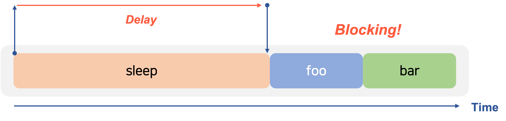
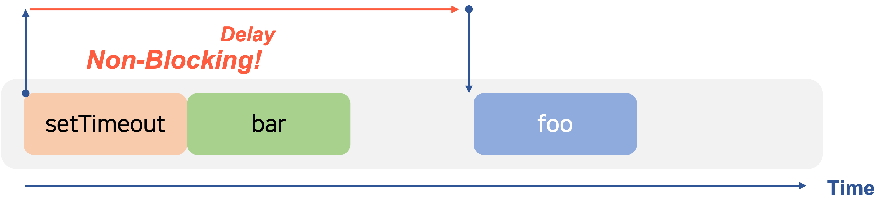
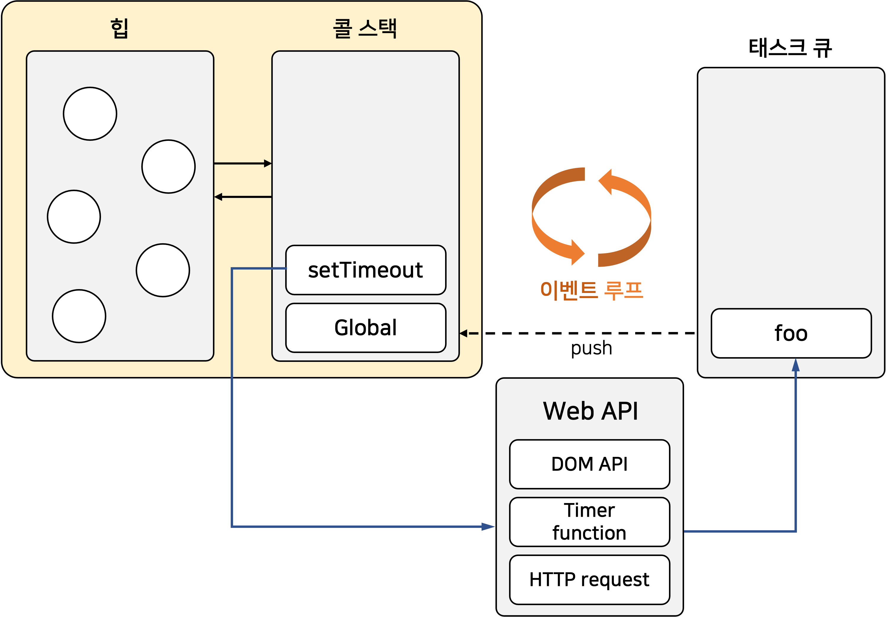
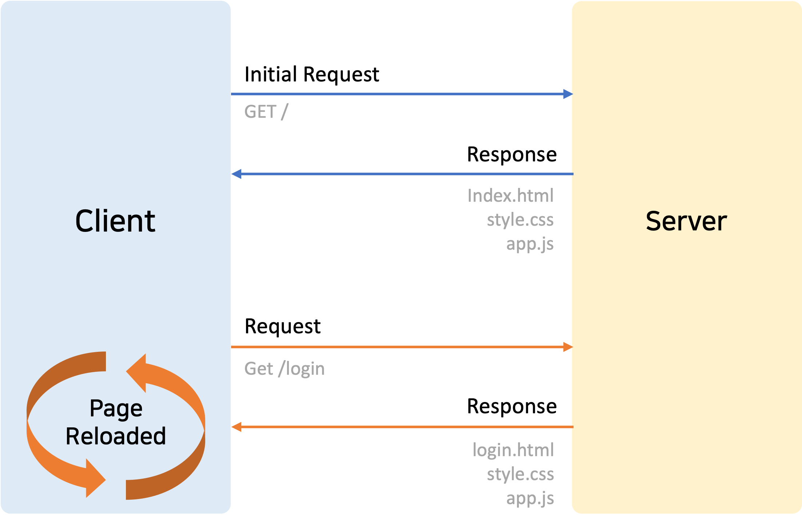
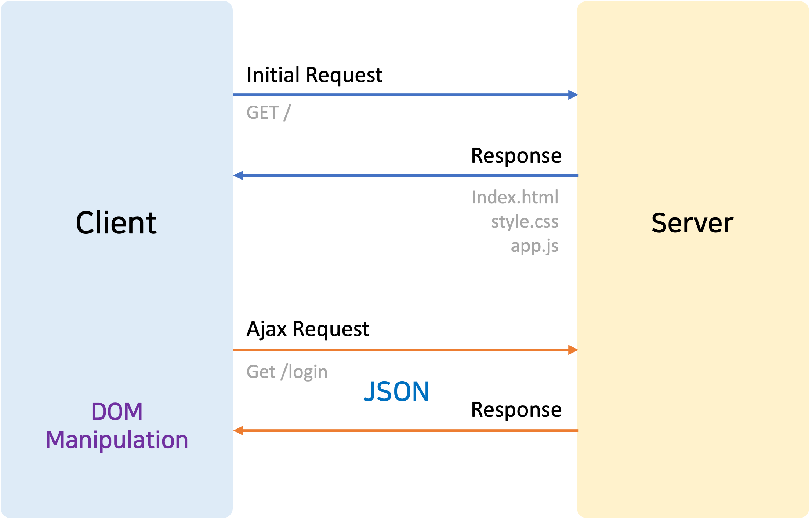

# Deep Dive Study - 9주차

<br/><br/><br/>

<h1 align="center">40.이벤트</h1>

<br/>

<br/><br/><br/>

<h1 align="center">41.타이머</h1>

<br/>

# 호출 스케줄링

함수를 명시적으로 호출하지 않고 일정 시간이 경과된 이후 호출되도록 하려면 타이머 함수를 사용해야 한다. 이를 **호출 스케줄링(scheduling a call)** 이라 한다.

자바스크립트는 타이머를 생성할 수 있는 타이머 함수 `setTimeout`과 `setInterval`, 타이머를 제거하는 타이머 함수 `clearTimeout`과 `clearInterval`이 있다.

타이머 함수 `setTimeout`과 `setInterval` 이 생성한 타이임머가 만료되면 콜백 함수가 호출된다.

- `setTimeout` 함수의 콜백 함수는 타이머가 만료되면 단 한 번 호출되고,
- `setInterval` 함수의 콜백 함수는 타이머가 만료될 때마다 반복 호출된다.

자바스크립트 엔진은 **싱글 스레드(single thread)** 로 동작한다. 이런 이유로 타이머 함수 `setTimeout`과 `setInterval`은 **비동기(asynchronous)** 처리 방식으로 동작한다.

<br/><br/>

# 타이머 함수

### setTimeout / clearTimeout

`setTimeout` 함수의 콜백 함수는 두 번째 인수로 전달받은 시간 이후 단 한 번 실행되도록 호출 스케줄링된다.

```js
const timeoutId = setTimeout(func|code[, delay, param1, param2, ...]);
```

| **매개변수**                                                                                            | **설명**                                                           |
| ------------------------------------------------------------------------------------------------------- | ------------------------------------------------------------------ |
| func                                                                                                    | 타이머가 만료된 뒤 호출될 콜백 함수.                               |
| 콜백 함수 대신 코드를 문자열로 전달할 수 있다. 이때 코드 문자열은 타이머가 만료된 뒤 해석되고 실행된다. |
| deay                                                                                                    | 타이머 만료 시간(ms 단위). 인수를 생략할 경우 기본값 0이 지정된다. |

| param1,
param2, … | 호출 스케줄링된 콜백 함수에 전달해야 할 인수가 존재하는 경우 세 번째 이후의 인수로 전달할 수 있다. |

```js
// 1초(1000ms) 후 타이머가 만료되면 콜백 함수가 호출된다.
setTimeout(() => console.log("Hi!"), 1000);

// 1초(1000ms) 후 타이머가 만료되면 콜백 함수가 호출된다.
// 이때 콜백 함수에 'Roh'가 인수로 전달된다.
setTimeout((name) => console.log(`Hi! ${name}.`), 1000, "Roh");

// 두 번째 인수(delay)를 생략하면 기본값 0이 지정된다.
setTimeout(() => console.log("Hello!"));
```

`setTimeout` 함수는 생성된 타이머를 식별할 수 있는 고유한 타이머 `id` 를 반환한다. `setTimeout` 함수가 반환한 타이머 `id` 는 **브라우저 환경인 경우 숫자**이며 **Node.js 환경인 경우 객체**다.

`setTimeout` 함수가 반환한 타이머 `id` 를 `clearTimeout` 함수의 인수로 전달하여 타이머를 취소할 수 있다. 즉, `clearTimeout` 함수는 호출 스케줄링을 취소한다.

```js
const timerId = setTimeout(() => console.log("Hi!"), 1000);

// 타이머가 취소되면 setTimeout 함수의 콜백 함수가 실행되지 않는다.
clearTimeout(timerId);
```

<br/>

### setInterval / clearInterval

`setInterval` 함수의 콜백 함수는 두 번째 인수로 전달받은 시간이 경과할 때마다 반복 실행되도록 호출 스케줄링된다. `setInterval` 함수에 전달할 인수는 `setTimeout` 함수와 동일하다.

```js
const timerId = setInterval(func|code[, delay, param1, param2, ...]);
```

`setInterval` 함수가 반환한 타이머 `id` 를 `clearInterval` 함수의 인수로 전달하여 타이머를 취소할 수 있다. 즉, `clearInterval` 함수는 호출 스케줄링을 취소한다.

```js
let count = 1;

const timeoutId = setInterval(() => {
  console.log(count); // 1 2 3 4 5

  // 타이머가 취소되면 setInterval 함수의 콜백 함수가 실행되지 않는다.
  if (count++ === 5) clearInterval(timeoutId);
}, 1000);
```

<br/><br/>

# 디바운스와 스로틀

**디바운스**와 **스로틀**은 짧은 시간 간격으로 연속해서 발생하는 이벤트를 그룹화해서 과도한 이벤트 핸들러의 호출을 방지하는 프로그래밍 기법이다.

<br/>

### 디바운스

**디바운스(debounce)** 는 짧은 시간 간격으로 발생하는 이벤트를 그룹화해서 마지막에 한 번만 이벤틀 핸들러가 호출되도록 한다.

즉, **_이벤트를 그룹화하여 특정시간이 지난후 하나의 이벤트만 발생하도록 한다._**

```js
<!DOCTYPE html>
<html>
    <body>
        <input type="text" />
        <div class="msg"></div>
        <script>
            const $input = document.querySelector("input");
            const $msg = document.querySelector(".msg");

            const debounce = (callback, delay) => {
                let timerId;
                // debounce 함수는 timerId를 기억하는 클로저를 반환한다.
                return (event) => {
                    // delay가 경과하기 이전에 이벤트가 발생하면 이전 타이머를 취소하고
                    // 새로운 타이머를 재설정한다.
                    // 따라서 delay보다 짧은 간격으로 이벤트가 발생하면 callback은 호출되지 않는다.
                    if (timerId) clearTimeout(timerId);
                    timerId = setTimeout(callback, delay, event);
                };
            };

            // debounce 함수가 반환하는 클로저가 이벤트 핸들러로 등록된다.
            // 300ms보다 짧은 간격으로 input 이벤트가 발생하면 debounce 함수의 콜백 함수는
            // 호출되지 않다가 300ms 동안 input 이벤트가 더 이상 발생하면 한 번만 호출된다.
            $input.oninput = debounce((e) => {
                $msg.textContent = e.target.value;
            }, 300);
        </script>
    </body>
</html>
```

`debounce` 함수가 반환한 함수는 `debounce` 함수에 두 번째 인수로 전달한 시간(delay)보다 짧은 간격으로 이벤트가 발생하면 이전 타이머를 취소화고 새로운 타이머를 재설정한다.

따라서 delay 보다 짧은 간격으로 이벤트가 연속해서 발생하면 debounce 함수의 첫 번째 인수로 전달된 콜백 함수는 호출되지 않다가 delay 동안 input 이벤트가 더 이상 발생하지 않으면 한 번만 호출된다.

디바운스는 resize 이벤트 처리나 input 요소에 입력된 값으로 ajax 요청하는 입력 필드 자동완성 UI 구현, 버트 중복 클릭 방지 처리 등에 유용하게 쓰인다.

<br/>

### 스로틀

**스로틀(throttle)** 은 짧은 시간 간격으로 연속해서 발생하는 이벤트를 그룹화해서 일정 시간 단위로 이벤트 핸들러가 호출되록 호출 주기를 만든다. 즉, **_이벤트를 일정한 주기마다 발생하도록 한다._**

예를 들어, 설정 시간을 1ms로 하게되면 해당 이벤트는 1ms 동안 최대 한 번만 발생하게 된다.

```js
<!DOCTYPE html>
<html>
    <head>
        <style>
            .container {
                width: 300px;
                height: 300px;
                background-color: rebeccapurple;
                overflow: scroll;
            }

            .content {
                width: 300px;
                height: 1000vh;
            }
        </style>
    </head>
    <body>
        <div class="container">
            <div class="content"></div>
        </div>
        <div>
            일반 이벤트 핸들러가 scroll 이벤트를 처리한 횟수:
            <span class="normal-count">0</span>
        </div>
        <div>
            스로틀 이벤트 핸들러가 scroll 이벤트를 처리한 횟수:
            <span class="throttle-count">0</span>
        </div>

        <script>
            const $container = document.querySelector(".container");
            const $normalCount = document.querySelector(".normal-count");
            const $throttleCount = document.querySelector(".throttle-count");

            const throttle = (callback, delay) => {
                let timerId;
                // throttle 함수는 timerId를 기억하는 클로저를 반환한다.
                return (event) => {
                    // delay가 경과하기 이전에 이벤트가 발생하면 아무것도 하지 않다가
                    // delay가 경과했을 때 이벤트가 발생하면 새로운 타이머를 재설정한다.
                    // 따라서 delay 간격으로 callback이 호출된다.
                    if (timerId) return;
                    timerId = setTimeout(
                        () => {
                            callback(event);
                            timerId = null;
                        },
                        delay,
                        event
                    );
                };
            };

            let normalCount = 0;
            $container.addEventListener("scroll", () => {
                $normalCount.textContent = ++normalCount;
            });

            let throttleCount = 0;
            // throttle 함수가 반환하는 클로저가 이벤트 핸들러로 등록된다.
            $container.addEventListener(
                "scroll",
                throttle(() => {
                    $throttleCount.textContent = ++throttleCount;
                }, 100)
            );
        </script>
    </body>
</html>
```

`throttle` 함수가 반환한 함수는 `throttle` 함수에 두 번째 인수로 전달한 시간이 경과하기 이전에 이벤트가 발생하면 아무것도 하지 않다가 `delay` 시간이 경과했을 때 이벤트가 발생하면 콜백 함수를 호출하고 새로운 타이머를 재설정한다. 따라서 `delay` 시간 간격으로 콜백 함수가 호출된다.

스로틀은 scroll 이벤트 처리나 무한 스크롤 UI 구현 등에 유용하게 사용된다.

<br/><br/><br/>

<h1 align="center">42.비동기 프로그래밍</h1>

<br/>

# 동기 처리와 비동기 처리

### 동기 처리

함수를 실행하면 함수 코드가 평가되어 함수 실행 컨텍스트가 생성된다. 이때 생성된 함수 실행 컨텍스트는 실행 컨텍스트 스택(콜스택; Call stack)에 푸시되고 함수 코드가 실행된다.

다시 말해, 콜 스택에 함수 실행 컨텍스트가 푸시되는 것은 함수 실행의 시작을 의미한다. 함수가 호출된 순서대로 순차적으로 실행되는 이유는 함수가 호출된 순서대로 함수 실행 컨텍스트가 콜스택에 푸시되기 때문이다.

**_자바스크립트 엔진은 단 하나의 콜 스택(실행컨텍스트 스택)을 갖는다._**
이는 함수를 실행할 수 있는 창구가 단 하나이며, 동시에 2개 이상의 함수를 실행할 수 없다는 것을 의미한다.

**_자바스크립트 엔진은 한 번에 하나의 테스크만 실행할 수 있는 싱글 스레드(single thread)방식으로 동작한다._** 싱글 스레드 방식은 한 번에 하나의 테스크만 실행할 수 있기 때문에 처리에 시간이 걸리는 테스크를 실행하는 경우 **블로킹(작업 중단; blocking)** 이 발생한다.

```js
function sleep(func, delay) {
  const delayUntil = Date.now() + delay;

  // 현재 시간(Date.now())에 delay를 더한 delayUntil이 현재 시간보다 작으면 계속 반복한다.
  while (Date.now() < delayUntil);
  // 일정 시간(delay)이 경과한 이후에 콜백 함수(func)를 호출한다.
  func();
}

function foo() {
  console.log("foo");
}

function bar() {
  console.log("bar");
}

sleep(foo, 3 * 1000);
// bar 함수는 sleep 함수의 실행이 종료된 이후에 호출되므로 3초 이상 블로킹된다.
bar();
```

위 예제의 `sleep` 함수는 3초 후에 `foo` 함수를 호출한다. 이때 `bar` 함수는 `sleep` 함수의 실행이 종료된 이후에 호출되므로 3초 이상 호출되지 못하고 블로킹된다.

<div style="max-width: 500px; margin: 0 auto;" >



</div>

현재 실행 중인 태스크가 종료할 때까지 다음에 실행될 태스크가 대기하는 방식을 **동기(synchronous) 처리**라고 한다. 동기 처리 방식은 태스크를 순서대로 하나씩 처리하므로 실행 순서가 보장된다는 장점이 있지만, 앞선 태스크가 종료할 때까지 이후 태스크들이 블로킹되는 단점이 있다.

<br/>

### 비동기 처리

```js
function foo() {
  console.log("foo");
}

function bar() {
  console.log("bar");
}

// 타이머 함수 setTimeout은 bar 함수를 블로킹하지 않는다.
setTimeout(foo, 3 * 1000);
bar();
```

`setTimeout` 함수는 앞서 살펴본 sleep 함수와 유사하게 일정 시간이 경과한 이후에 콜백함수를 실행하지만, 블로킹을 발생시키지 않는다. 이처럼 현재 실행 중인 태스크가 종료되지 않은 상태라 해도 다음 태스크를 곧바로 실행하는 방식을 **비동기(asynchronous) 처리**라고 한다.

<div style="max-width: 500px; margin: 0 auto;" >



</div>

<br/>

비동기 처리 방식은 현재 실행 중인 태스크가 종료되지 않더라도 다음 태스크를 실행하므로 블로킹이 발생하지 않는 다는 장점이 있지만, 태스크의 실행 순서가 보장되지 않는 다는 단점이 있다.

비동기 처리를 수행하는 비동기 함수는 콜백 패턴을 사용한다.

`setTimeout`과 `setInterval`, HTTP 요청, 이벤트 핸들러는 비동기 처리 방식으로 동작한다.

<br/><br/>

# 이벤트 루프와 태스크 큐

**자바스크립트는 싱글 스레드로 동작한다.** 하지만 브라우저가 동작하는 것을 보면 태스크가 동시에 처리되는 것처럼 보인다. 이를 가능하게 하는(자바스크립트의 동시성을 지원하는) 것이 바로 **이벤트 루프(event loop)** 다.

<div style="max-width: 500px; margin: 0 auto;" >



</div>

<br/>

대부분의 자바스크립트 엔진은 크게 2개의 영역으로 구분할 수 있다.

<br/>

### 콜 스택(call stack)

소스코드(전역 코드나 함수 코드 등)평가 과정에서 생성된 실행 컨텍스트가 추가되고 제거되는 스택 자료구조인 실행 컨텍스트 스택이다.

함수를 호출하면 함수 실행 컨텍스트가 순차적으로 콜 스택에 푸시되어 실행된다. 자바스크립트 엔진은 단 하나의 콜 스택을 사용하기 때문에 최상위 실행 컨텍스트가 종료되어 콜 스택에서 제거되기 전까지는 다른 어떤 태스크도 실행되지 않는다.

<br/>

### 힙(heap)

힙은 객체가 저장되는 메모리 공간이다. 콜 스택의 실행 컨텍스트는 힙에 저장된 객체를 참조한다.

메모리에 값을 저장하려면 먼저 값을 저장할 메모리 공간의 크기를 결정해야 한다. 하지만 객체는 원시 값과 다르게 크기가 정해져 있지 않으므로 할당해여 할 메모리 공간의 크기를 **런타임에 결정(동적 할당)** 해야 한다. 따라서 **_객체가 저장되는 메모리 공간인 힙은 구조화되어 있지 않다는 특징이 있다._**

비동기 처리에서 소스코드의 평가와 실행을 제외한 모든 처리는 자바스크립트 엔진을 구동하는 환경인 브라우저 또는 Node.js가 담당한다. 이를 위해 브라우저 환경은 태스크 큐와 이벤트 루프를 제공한다.

<br/>

### 태스크 큐(task queue/event queue/callback queue)

비동기 함수의 콜백 함수 또는 이벤트 핸들러가 일시적으로 보관되는 영역이다.

태스크 큐와는 별도로 프로미스의 후속 처리 메서드의 콜백 함수가 일시적으로 보관되는 **`마이크로태스크 큐`** 도 존재한다.

<br/>

### 이벤트 루프(event loop)

이벤트 루프는 콜 스택에 현재 실행 중인 실행 컨텍스트가 있는지, 태스크 큐에 대기 중인 함수가 있는 지 반복해서 확인한다. 만약 콜 스택이 비어 있고 태스크 큐에 대기 중인 함수가 있다면 이벤트 루프는 **순차적(FIFO, First In First Out)** 으로 태스크 큐에 대기 중인 함수를 콜 스택으로 이동시킨다.

<br/>

### 비동기 함수의 처리 방식

```js
function foo() {
  console.log("foo");
}

function bar() {
  console.log("bar");
}

setTimeout(foo, 0); // 0초(실제는 4ms) 후에 foo 함수가 호출된다.
bar();
```

**_비동기 함수인 setTimeout의 콜백 함수는 태스크 큐에 푸시되어 대기하다가 콜 스택이 비게 되면(전역 코드 및 명시적으로 호출된 함수가 모두 종료하면) 비로소 콜 스택에 푸시되어 실행된다._**

자바스크립트는 싱글 스레드 방식으로 동작한다. 이때 싱글 스레드 방식으로 동작하는 것은 브라우저가 아니라 브라우저에 내장된 자바스크립트 엔진이다.
즉, **_자바스크립트 엔진은 싱글 스레드로 동작하지만 브라우저는 멀티 스레드로 동작한다._**

<br/><br/><br/>

<h1 align="center">43.Ajax</h1>

<br/>

# Ajax란?

**Ajax(Asynchronous JavaScript and XML)** 란, 자바스크립트를 사용하여 브라우저가 서버에게 비동기 방식으로 데이터를 요청하고, 서버가 응답한 데이터를 수신하여 웹페이지를 동적으로 갱신하는 **프로그래밍 방식**을 말한다.

**Ajax**는 브라우저에서 제공하는 Web API인 **XMLHttpRequest 객체**를 기반으로 동작한다. **XMLHttpRequest**는 HTTP 비동기 통신을 위한 메서드와 프로퍼티를 제공한다.

<br/>

### 전통적인 웹페이지의 생명주기

이전의 웹페이지는 html 태그로 시작해서 html 태그로 끝나는 완전한 HTML을 서버로부터 전송받아 웹페이지 전체를 처음부터 다시 렌더링하는 방식으로 동작했다.

<br/>

<div style="max-width: 400px; margin: 0 auto;" >



</div>

- 변경할 필요가 없는 부분까지 포함된 완전한 HTML을 서버로부터 매번 다시 전송받기 때문에 불필요한 데이터 통신이 발생한다.
- 변경할 필요가 없는 부분까지 다시 렌더링하게 된다. 이때 화면이 순간적으로 깜박이는 현상이 발생한다.
- 클라이언트와 서버와의 통신이 **동기 방식**으로 동작하기 때문에 서버로부터 응답이 있을때까지 다음 처리는 블로킹된다.

<br/>

### Ajax

Ajax의 등장으로 서버로부터 웹페이지의 변경에 필요한 데이터만 비동기 방식으로 전송받아 웹페이지를 변경할 필요가 없는 부분은 다시 렌더링하지 않고, 변경이 필요한 부분만 렌더링할 수 있게 되었다. 이를 통해 브라우저에서도 데스크톱 애플리케이션과 유사한 빠른 퍼포먼스와 부드러운 화면 전환이 가능해졌다.

<br/>

<div style="max-width: 400px; margin: 0 auto;" >



</div>

- 변경할 부분을 갱신하는 데 필요한 데이터만 서버로부터 전송받기 때문에 불필요한 데이터 통신이 발생하지 않는다.
- 변경할 필요가 없는 부분은 다시 렌더링 하지 않는다. 따라서 화면이 순간적으로 깜박이는 현상이 발생하지 않는다.
- 클라이언트와 서버와의 통신이 **비동기 방식**으로 동작하기 때문에 서버에게 요청을 보낸 이후 블로킹이 발생하지 않는다.

<br/><br/>

# JSON

**JSON(JavaScript Object Nation)** 은 클라이언트와 서버 간의 HTTP 통신을 위한 **텍스트 데이터 포맷**이다. 자바스크립트에 종속되지 않는 **언어 독립형 데이터 포맷**으로, 대부분의 프로그래밍 언어에서 사용할 수 있다.

<br/>

### JSON 표기 방식

JSON은 자바스크립트의 객체 리터럴과 유사하게 키와 값으로 구성된 순수한 텍스트다.

```js
{
    name: "Lee",
    age: 20,
    alive: true,
    hobby: ["traveling", "tennis"],
};
```

JSON의 키는 반드시 `큰따옴표`로 묶어야 한다. 값은 객체 리터럴과 같은 표기법을 사용할 수 있지만, 문자열은 반드시 `큰따옴표`로 묶어야 한다.

<br/>

### JSON.stringify

`JSON.stringify` 메서드는 객체를 JSON 포맷의 문자열로 변환한다.

클라이언트가 서버로 객체를 전송하려면 객체를 문자열화해야 하는데 이를 **직렬화(serializing)** 라 한다.

```js
JSON.stringify(value[, replacer[, space]])
```

| 매개변수                                                                     | 설명                                                                 |
| ---------------------------------------------------------------------------- | -------------------------------------------------------------------- |
| `value`                                                                      | JSON 문자열로 변환할 값.                                             |
| `replacer`(optional)                                                         | JSON 문자열에 포함시킬 객체의 속성들을 선택하기 위한 함수 또는 배열. |
| 파라미터 값이 비어있거나 null로 지정되면 모든 속성이 JSON 문자열에 포함되다. |
| `space`(optional)                                                            | JSON 문자열 형식의 가독성을 높이기 위해 공백을 조정하는 값.          |

<br/>

### ☑️ stringify 사용 예제

```js
const obj = {
  name: "Roh",
  age: 20,
  alive: true,
  hobby: ["traveling", "tennis"],
};

const json = JSON.stringify(obj);

console.log(typeof json); // string
console.log(json);
// {"name":"Roh","age":20,"alive":true,"hobby":["traveling","tennis"]}
```

<br/>

### ☑️ replacer 사용 예제

```js
const obj = {
  name: "Roh",
  age: 20,
  alive: true,
  hobby: ["traveling", "tennis"],
};

function filter(key, value) {
  return typeof value === "number" ? undefined : value;
}

// JSON.stringify 메서드에 두 번째 인수로 replacer 함수를 전달한다.
const strFilteredObject = JSON.stringify(obj, filter, 2);
console.log(strFilteredObject);
/*
{
    "name": "Roh",
    "alive": true,
    "hobby": [
      "traveling",
      "tennis"
    ]
}
*/
```

`JSON.stringfy` 메서드는 배열도 JSON 포맷의 문자열로 변환할 수 있다.

```js
const todos = [
  { id: 1, content: "HTML", completed: true },
  { id: 2, content: "CSS", completed: true },
  { id: 3, content: "Javascript", completed: false },
];

// 배열을 JSON 포맷의 문자열로 변환한다.
const json = JSON.stringify(todos, null, 2);
console.log(json);
/*
[
  {
    "id": 1,
    "content": "HTML",
    "completed": true
  },
  {
    "id": 2,
    "content": "CSS",
    "completed": true
  },
  {
    "id": 3,
    "content": "Javascript",
    "completed": false
  }
]
*/
```

<br/>

### JSON.parse

`JSON.parse` 메서드는 JSON 포맷의 문자열을 객체로 변환한다.

서버로부터 클라이언트에게 전송된 JSON 데이터는 문자열을 객체로서 사용하려면 이 문자열을 객체화해야 하는데 이를 **역직렬화(deserializing)** 라고 한다.

```js
const obj = {
  name: "Roh",
  age: 20,
  alive: true,
  hobby: ["traveling", "tennis"],
};

// 객체를 JSON 포맷의 문자열로 변환한다.
const json = JSON.stringify(obj);
// JSON 포맷의 문자열을 객체로 변환한다.
const parsed = JSON.parse(json);

console.log(typeof parsed);
// object
console.log(parsed);
// {name: "Roh", age: 20, alive: true, hobby: ["traveling", "tennis"]}
```

<br/><br/><br/>

<h1 align="center">44.REST API</h1>

<br/>

**REST(REpresentational State Transfer)**는 로이 필딩의 2000년 논문에서 처음 소개되었다.

웹이 HTTP를 제대로 사용하지 못하고 있는 상황을 보고 HTTP의 장점을 최대한 활용할 수 있는 아키텍처로서 REST를 소개했고 이는 HTTP 프로토콜을 의도에 맞게 디자인하도록 유도하고 있다.

REST의 기본 원칙을 성실히 지킨 서비스 디자인을 RESTful 이라고 표현한다.

<br/><br/>

# REST API의 구성

REST API는 **자원(resource)**, **행위(verb)**, **표현(representations)** 의 3가지 요소로 구성된다.

REST는 **자체 표현 구조(self descriptivness)** 로 구성되어 REST API만으로 HTTP 요청의 내용을 이해할 수 있다.

| 구성 요소 | 내용                           | 표현 방법        |
| --------- | ------------------------------ | ---------------- |
| 자원      | 자원                           | URI(엔드포인트)  |
| 행위      | 자원에 대한 행위               | HTTP 요청 메서드 |
| 표현      | 자원에 대한 행위의 구체적 내용 | 페이로드         |

<br/><br/>

# REST API 설계 원칙

_**URI는 리소스를 표현하는 데 집중하고 행위에 대한 정의는 HTTP 요청 메서드를 통해 하는 것이 RESTful API를 설계하는 중심 규칙이다.**_

<br/>

### 1. URI는 리소스를 표현해야 한다.

URI는 리소스를 표현하는 데 중점을 둬야 한다. 리소스를 식별할 수 있는 이름은 **동사보다는 명사를 사용**한다.

```bash
# bad
GET /getTodos/1
GET /todos/show/1

# good
GET /todos/1
```

<br/>

### 2. 리소스에 대한 행위는 HTTP 요청 메서드로 표현한다.

**HTTP 요청 메소드**는 클라이언트가 서버에게 요청의 종류와 목적(리소스에 대한 행위)을 알리는 방법이다.

주로 5가지 요청 메서드를 사용하여 CRUD를 구현한다.

| HTTP 요청 메서드 | 종류            | 목적                  | 페이로드 |
| ---------------- | --------------- | --------------------- | -------- |
| GET              | index/retirieve | 모든/특정 리소스 취득 | X        |
| POST             | create          | 리소스 생성           | O        |
| PUT              | replace         | 리소스의 전체 교체    | O        |
| PATCH            | modify          | 리소스의 일부 수정    | O        |
| DELETE           | delete          | 모든/특정 리소스 삭제 | X        |
