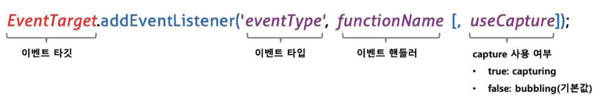

# 40Ch 이벤트

## 📚 이벤트 드리븐 프로그래밍

- 브라우저는 처리해야 할 특정 사건이 발생하면 이를 감지하여 `이벤트`를 발생시킴
- 만약 애플리케이션이 특정 타입의 이벤트에 대해 반응하여 어떤 일을 하고 싶다면 해당하는 타입의 이베트가 발생했을 때 호출될 함수를 브라우저에게 알려 **호출을 위임**
- 이때, 이벤트가 발생했을 때 호출될 함수를 `이벤트 핸들러`, 이벤트가 발생했을 때 브라우저에게 이벤트 핸들러의 호출을 위임하는 것을 `이벤트 핸들러 등록`이라 함
- 브라우저는 사용자의 버튼 클릭을 감지하여 클릭 이벤트를 발생시킴 → 특정 버튼 요소에서 클릭 이벤트가 발생하면 특정 함수(이벤트 핸들러)를 호출하도록 브라우저에게 위임 가능
- 즉, **함수를 언제 호출할지 알 수 없으므로 개발자가 명시적으로 함수를 호출하는 것이 아니라 브라우저에게 함수 호출을 위임하는 것**
- `Window`, `Document`, `HTMLElement` 타입의 객체는 `onclick`과 같이 특정 이벤트에 대응하는 다양한 이벤트 핸들러 프로퍼티를 갖고 있음
- 이 이벤트 핸들러 프로퍼티에 함수를 할당하면 해당 이벤트가 발생했을 때 할당한 함수가 브라우저에 의해 호출됨
- 프로그램의 흐름을 이벤트 중심으로 제어하는 프로그래밍 방식을 `이벤트 드리븐 프로그래밍`이라 함

## 📚 이벤트 타입

- `이벤트 타입`은 이벤트의 종류를 나타내는 문자열로, 약 200여가지가 있음
- 마우스 이벤트
  | 이벤트 타입 | 이벤트 발생 시점 |
  | ----------- | ------------------------------------------------------------ |
  | click | 마우스 버튼을 클릭했을 때 |
  | dbclick | 마우스 버튼을 더블 클릭했을 때 |
  | mousedown | 마우스 버튼을 눌렀을 때 |
  | mouseup | 누르고 있던 마우스 버튼을 놓았을 때 |
  | mousemove | 마우스 커서를 움직였을 때 |
  | mouseenter | 마우스 커서를 HTML 요소 안으로 이동했을 때(버블링 되지 않음) |
  | mouseover | 마우스 커서를 HTML 요소 안으로 이동했을 때(버블링 됨) |
  | mouseleave | 마우스 커서를 HTML 요소 밖으로 이동했을 떄(버블링되지 않음) |
  | mouseout | 마우스 커서를 HTML 요소 밖으로 이동했을 때(버블링 됨) |
- 키보드 이벤트
  | 이벤트 타입 | 이벤트 발생 시점 |
  | ----------- | ----------------------------------------------------------------------------------------------------------------------------------------- |
  | keydown | 모든 키를 눌렀을 때 발생(단, 문자, 숫자, 특수 문자, enter 키를 눌렀을 때는 연속적으로 발생하지만 그 외의 키를 눌렀을 때는 한 번만 발생함) |
  | keypress | 문자 키를 눌렀을 때 연속적으로 발생함(폐지되었으므로 사용 비추) |
  | keyup | 누르고 있던 키를 놓았을 때 한 번만 발생함 |
- 포커스 이벤트
  | 이벤트 타입 | 이벤트 발생 시점 |
  | ----------- | ----------------------------------------------- |
  | focus | HTML 요소가 포커스를 받았을 때(버블링되지 않음) |
  | blur | HTML 요소가 포커스를 잃었을 때(버블링되지 않음) |
  | focusin | HTML 요소가 포커스를 받았을 때(버블링 됨) |
  | focusout | HTML 요소가 포커스를 잃었을 때(버블링 됨) |
- 폼 이벤트
  | 이벤트 타입 | 이벤트 발생 시점 |
  | ----------- | ---------------------------------------------------------------- |
  | submit | 1. form 요소 내의 input, select 입력 필드에서 엔터키를 눌렀을 때 | 2. form 요소 내의 submit 버튼(<button>, <input type=’submit’>)을 클릭했을 때
  - submit 이벤트는 form 요소에서 발생함 |
    | reset | form 요소 내의 reset 버튼을 클릭했을 때(최근에는 사용 안 함) |
- 값 변경 이벤트
  | 이벤트 타입 | 이벤트 발생 시점 |
  | ---------------- | ------------------------------------------------------------------------------------------------------------------------- |
  | input | input, select, textarea 요소의 값이 입력되었을 때 |
  | change | input, select, textarea 요소의 값이 변경되었을 때 |
  | readystatechange | HTML 문서의 로드와 파싱 상태를 나타내는 document.readyState 프로퍼티 값(’loading’, ‘interactive’, ‘complete’)이 변경될 때 |
- 뷰 이벤트
  | 이벤트 타입 | 이벤트 발생 시점 |
  | ------------------------------ | ----------------------------------------------------------------- |
  | resize | 브라우저 윈도우(window)의 크기를 리사이즈할 때 연속적으로 발생함 |
  | \* 오직 window 객체에서만 발생 |
  | scroll | 웹페이지(document) 또는 HTML 요소를 스크롤할 때 연속적으로 발생함 |
- 리소스 이벤트
  | 이벤트 타입 | 이벤트 발생 시점 |
  | ----------- | --------------------------------------------------------------------------------------------------------------------- |
  | load | DOMContentLoaded 이벤트가 발생한 이후, 모든 리소스(이미지, 폰트 등)의 로딩이 완료되었을 때(주로 window 객체에서 발생) |
  | unload | 리소스가 언로드될 때(주로 새로운 웹페이지를 요청한 경우) |
  | abort | 리소스 로딩이 중단되었을 때 |
  | error | 리소스 로딩이 실패했을 때 |

## 📚 이벤트 핸들러 등록

- `이벤트 핸들러`: 이벤트가 발생했을 때 브라우저에 호출을 위임한 함수
- `이벤트 핸들러 등록`: 이벤트가 발생했을 때 브라우저에게 이벤트 핸들러의 호출을 위임하는 것

### 이벤트 핸들러 어트리뷰트 방식

- 이벤트 핸들러 어트리뷰트의 이름은 onclick과 같이 on 접두사와 이벤트의 종류를 나타내는 이벤트 타입으로 이루어져있음
- 이벤트 핸들러 어트리뷰트 값으로 함수 호출문 등의 문을 할당하면 이벤트 핸들러가 등록됨
  ```html
  <!DOCTYPE html>
  <html>
  <body>
  	<button onclick='sayHi('Lee')'>Click me!</button>
  	<script>
  		function sayHi(name) {
  			console.log(`hi! ${name}. `);
  		}
  	</script>
  </body>
  </html>
  ```
- 이벤트 핸들러 어트리뷰트 값으로 함수 참조가 아닌 함수 호출문 등의 문을 할당한다는 주의점이 있음
- 콜백 함수와 마찬가지로 함수 참조를 등록해야 브라우저가 이벤트 핸들러 호출이 가능함
- 함수 호출문을 등록하면 함수 호출문의 평가 결과가 이벤트 핸들러로 등록됨
  ```jsx
  function onclick(event) {
    sayHi("Lee");
  }
  ```
- 이벤트 핸들러 어트리뷰트 값은 사실 암묵적으로 생성될 이벤트 핸들러의 함수 몸체를 의미함
- 이처럼 동작하는 이유는 이벤트 핸들러에 인수를 전달하기 위해서임
- 이벤트 핸들러 어트리뷰트 값으로 할당한 문자열은 암묵적으로 생성되는 이벤트 핸들러의 함수 몸체임. 즉, 이벤트 핸들러 어트리뷰트 값으로 다음과 같이 여러 개의 문을 할당할 수 있음
  ```html
  <button onclick='console.log('hi! '); console.log('Lee');'>Click me!</button>
  ```
- CBD(Component Based Development) 방식의 Angular/React/Svelte/Vue.js 같은 프레임워크/라이브러리에서는 이벤트 핸들러 어트리뷰트 방식으로 이벤트를 처리함
  - HTML, CSS, JavaScript를 관심사가 다른 개별적인 요소가 아닌, 뷰를 구성하기 위한 구성 요소로 보기 때문에 관심사가 다르다고 생가하지 않음

### 이벤트 핸들러 프로퍼티 방식

- 이벤트 핸들러를 등록하기 위해서는 이벤트를 발생시킬 객체인 `이벤트 타겟`과 이벤트의 종류를 나타내는 문자열인 `이벤트 타입` 그리고 `이벤트 핸들러`를 지정할 필요가 있음
  
  - 이벤트 핸들러는 대부분 이벤트를 발생시킬 이벤트 타깃에 바인딩함
  - 이벤트 핸들러는 이벤트 타깃 또는 전파된 이벤트를 캐치할 DOM 노드 객체에 바인딩함

### addEventListener 메서드 방식

- addEventListener 메서드의 첫 번째 매개변수에는 이벤트의 종류를 나타내는 문자열인 이벤트 타입을 전달
- 이벤트 핸들러 프로퍼티 방식과는 달리 on 접두사를 붙이지 않음
- 두 번째 매개변수에는 이벤트 핸들러를 전달함
- 마지막 매개변수에는 이벤트를 캐치할 이벤트 전파 단계(캡처링 또는 버블링)를 지정
  
- addEventListener 메서드는 하나 이상의 이벤트 핸들러를 등록할 수 있음 → 이벤트 핸들러는 등록된 순서대로 호출됨

## 📚 이벤트 핸들러 제거

- addEventListener 메서드로 등록한 이벤트 핸들러를 제거하려면 `EvenetTarget.prototype.removeEventListener` 메서드를 사용
- addEventListener 메서드에 전달한 인수와 removeEventListener 메서드에 전달한 인수가 일치하지 않으면 이벤트 핸들러가 제거되지 않음
- 무명 함수를 이벤트 핸들러로 등록한 경우 제거할 수 없음. 이벤트 핸들러를 제거하려면 이벤트 핸들러의 참조를 변수나 자료구조에 저장하고 있어야함
- 이벤트 핸들러 프로퍼티 방식으로 등록한 이벤트 핸들러는 `removeEventListener` 메서드로 제거할 수 없음

## 📚 이벤트 객체

- 이벤트가 발생하면 이벤트에 관련한 다양한 정보를 담고 있는 이벤트 객체가 동적으로 생성됨 → **생성된 이벤트 객체는 이벤트 핸들러의 첫 번째 인수로 전달됨**
- 브라우저가 이벤트 핸들러를 호출할 때 이벤트 객체를 인수로 전달함
- 이벤트 객체를 전달받으려면 이벤트 핸들러를 정의할 때 이벤트 객체를 전달받을 매개변수를 명시적으로 선언해야함
- 이벤트 핸들러 어트리뷰트 방식의 경우 이벤트 객체를 전달받으려면 이벤트 핸들러의 첫 번째 매개변수 이름이 반드시 event여야 함
- 이벤트 핸들러 어트리뷰트 값은 사실 암묵적으로 생성되는 이벤트 핸들러의 함수 몸체를 의미하기 때문

### 이벤트 객체의 상속 구조

- 이벤트가 발생하면 이벤트 타입에 따라 다양한 타입의 이벤트 객체가 생성됨
- `CustomEvent` 타입의 이벤트 객체는 자바스크립트 코드에 의해 인위적으로 생성한 이벤트 객체

### 이벤트 객체의 공통 프로퍼티

- `Event` 인터페이스의 이벤트 관련 프로퍼티는 모든 이벤트 객체가 상속받는 공통 프로퍼티
- 이벤트 객체의 `currentTarget` 프로퍼티는 이벤트 핸들러가 바인딩된 DOM 요소를 가리킴

### 마우스 정보 취득

- 마우스 포인터 좌표는 `MouseEvent` 타입의 이벤트 객체에서 제공함
- keyup 이벤트가 발생하면 생성되는 `KeyboardEvent` 타입의 이벤트 객체는 입력한 키 값을 문자열로 반환하는 key 프로퍼티를 제공함

## 📚 이벤트 전파

- `이벤트 전파`: DOM 트리 상에 존재하는 DOM 요소 노드에서 발생한 이벤트는 DOM 트리를 통해 전파되는 것
- 생성된 이벤트 객체는 이벤트를 발생시킨 DOM 요소인 이벤트 타깃을 중심으로 DOM 트리를 통해 전파됨

  ```html
  <!DOCTYPE html>
  <html>
    <body>
      <ul id="fruits">
        <li id="apple">Apple</li>
        <li id="banana">Banana</li>
        <li id="orange">Orange</li>
      </ul>
    </body>
  </html>
  ```

  - 생성된 이벤트 객체는 이벤트를 발생시킨 DOM 요소인 `이벤트 타겟`을 중심으로 DOM 트리를 통해 전파됨
    
  - `캡처링 단계`: 이벤트가 상위 요소에서 하위 요소 방향으로 전파
  - `타깃 단계`: 이벤트가 이벤트 타겟에 도달
  - `버블링 단계`: 이벤트가 하위 요소에서 상위 요소 방향으로 전파

  ```html
  <! DOCTYPE html >
  <html >
  <body>
  	<ul id= " fruits '1 >
  		<li id="apple" >Apple</li>
  		<li id="banana" >Banana</li>
  		<li id="orange" >Orange</li>
  	</u1>
  	<script>
  		const $fruits = document.getElementByid('fruits');

  		// #fruits 요소의 하위 요소인 li 요소를 클릭한 경우
  		$fruits.addEventlistener('click', e => {
  		console.log(`이벤트 단계: ${ e.eventPhase}`); // 3: 버블링 단계
  		console.log(`이벤트 타깃: ${ e.target}`) ; // [object HTMLLIElement]
  		console.log(`커런트 타깃: ${ e.currentTarget}`); // [object HTMLUListElement]
  		} ) ;
  	</script>
  </body>
  </html >
  ```

  - 클릭 이벤트 객체는 window에서 시작해서 이벤트 타깃 방향으로 전파됨(`캡처링 단계`)
  - 이벤트 객체는 이벤트를 발생시킨 이벤트 타겟에 도달(`타깃 단계`)
  - 이벤트 객체는 이벤트 타겟에서 시작해서 window 방향으로 전파됨(`버블링 단계`)
  - 이벤트 핸들러 어트리뷰트/프로퍼티 방식으로 등록한 이벤트 핸들러는 타깃 단계와 버블링 단계의 이벤트만 캐치할 수 있음
    → `addEventListener` 메서드 방식으로 등록한 이벤트 핸들러는 타깃 단계와 버블링 단계뿐만 아니라 캡쳐링 단계의 이벤트도 선별적으로 캐치 가능

- 이벤트는 이벤트를 발생시킨 이벤트 타깃은 물론 상위 DOM 요소에서도 캐치할 수 있음
- 대부분의 이벤트는 캡처링과 버블링을 통패 전파됨
- 아래와 같은 이벤트는 버블링을 통해 전파되지 않음
  - `포커스` 이벤트: focus/blur
  - `리소스` 이벤트: load/unload/abort/error
  - `마우스` 이벤트: mouseenter/mouseleave
- 위와같은 이벤트는 버블링되지 않으므로 이벤트 타깃의 상위 요소에서 위 이벤트를 캐치하려면 캡처링 단계의 이벤트를 캐치해야함
- focus/blur → focuseint/focustout 으로 대체시 버블링을 통해 전파됨
- mouseenter/mouseleave → mouseover/mouseout 으로 대체 버블링을 통해 전파됨

## 📚 이벤트 위임

- `이벤트 위임`: 여러 개의 하위 DOM 요소에 각각 이벤트 핸들러를 등록하는 대신 하나의 상위 DOM 요소에 이벤트 핸들러를 등록하는 방법
  - 이벤트 위임을 통해 상위 DOM 요소에 이벤트 핸들러를 등록하면 여러 개의 하위 DOM 요소에 이벤트 핸들러를 등록할 필요가 없음
  - 동적으로 하위 DOM 요소를 추가하더라도 일일이 추가된 DOM 요소에 이벤트 핸들러를 등록할 필요가 없음
- 이벤트 위임을 통해 하위 DOM 요소에서 발생한 이벤트를 처리할 때 주의할 점 = 이벤트를 실제로 발생시킨 DOM 요소가 개발자가 기대한 DOM 요소가 아닐 수 있다는 것
- 이벤트에 반응이 필요한 DOM 요소에 한정하여 이벤트 핸들러가 실행되도록 이벤트 타겟을 검사할 필요가 있음

## 📚 DOM 요소의 기본 동작 조작

### DOM 요소의 기본 동작 중독

- 이벤트 객체의 `preventDefault` 메서드는 이러한 DOM 요소의 **기본 동작을 중단**시킴

### 이벤트 전파 방지

- 이벤트 객체의 `stopPropagation` 메서드는 **이벤트 전파를 중지**시킴
- `stopPropagation` 메서드는 하위 DOM 요소의 이벤트를 개별적으로 처리하기 위해 이벤트의 전파를 중단시킴

## 📚이벤트 핸들러 내부의 this

### 이벤트 핸들러 어트리뷰트 방식

```html
<! DOCTYPE html >
<html>
  <body>
    <button onClick="handleClick()">Click me</button>
    <script>
      function handleClick() {
        console.log(this); // window
      }
    </script>
  </body>
</html>
```

- handleClick 함수 내부의 this는 전역 개체 window를 가리킴
- 이벤트 핸들러를 호출할 때 인수로 전달한 this는 이벤트를 바인딩한 DOM 요소를 가리킴
- 이벤트 핸들러 어트리뷰트 방식에 의해 암묵적으로 생성된 이벤트 핸들러 내부의 this는 이벤트를 바인딩한 DOM 요소를 가리킴 → 이벤트 핸들러 프로퍼티 방식과 동일

### 이벤트 핸들러 프로퍼티 방식과 addEventListener 메서드 방식

- 이벤트 핸들러 프로퍼티 방식과 addEventListener 메서드 방식 모두 이벤트 핸들러 내부의 this는 이벤트를 바인딩한 DOM 요소를 가리킴
- 화살표 함수로 정의한 이벤트 핸들러 내부의 this는 상위 스코프의 this를 가리킴

## 📚 커스텀 이벤트

### 커스텀 이벤트 생성

- 이벤트가 발생하면 암묵적으로 생성되는 이벤트 객체는 발생한 이벤트의 종류에 따라 이벤트 타입이 결정됨
- Event, UIEvent, MouseEvent 같은 이벤트 생성자 함수를 호출하여 명시적으로 생성한 이벤트 객체는 임의의 이벤트 타입을 지정할 수 있음. 이처럼 개발자의 의도로 생성된 이벤트를 `커스텀 이벤트`라 함
- 첫 번째 인수로 이벤트 타입을 나타내는 문자열을 전달받음
- 생성된 커스텀 이벤트 객체는 버블링되지 않으며 preventDefault 메서드로 취소할 수도 없음
- 커스텀 이벤트 객체는 bubbles와 cancelable 프로퍼티의 값이 false로 기본 설정이 됨
  → true로 설정하려면 두 번째 인수로 bubbles 또는 cancelable 프로퍼티를 갖는 객체를 전달함

  ````jsx
  // MouseEvent 생성자 함수로 click 이벤트 타입의 커스텀 이벤트 객체를 생성
  const customEvent = new MouseEvent('click', {
  bubbles: true,
  cancelable: true
  });

      console.log(cusotmEvent.bubbles); // true
      console.log(cusotmEvent.cancelable); // true
      ```
  ````

### 커스텀 이벤트 디스패치

- `dispatchEvent` 이벤트 객체를 인수로 전달하면서 호출하면 인수로 전달한 이벤트 타입의 이벤트가 발생함
- 일반적으로 이벤트 핸들러는 `비동기 처리 방식`으로 동작
- **dispatchEvent** 메서드는 이벤트 핸들러를 `동기 처리 방식`으로 호출 → 해당 메서드를 호출하면 커스텀 이벤트에 바인딩된 이벤트 핸들러를 직접 호출하는 것과 같음

# 41Ch 타이머

## 📚호출 스케줄링

- `호출 스케줄링`: 함수를 명시적으로 호출하지 않고 일정 시간이 경과된 이후에 호출되도록 함수 호출을 예약하려면 타이머 함수를 사용
- JS는 타이머를 생성할 수 있는 타이머 함수 `setTimeout`, `setInterval` 과 타이머를 제거할 수 있는 타이머 함수 `clearTimeout`, `clearInterval`을 제공함
- 타이머 함수는 호스트 객체임
- setTimeout과 setInterval은 모두 일정 시간이 경과된 이후 콜백 함수가 호출되도록 타이머를 생성
- `setTimeout` 함수가 생성한 타이머는 단 한 번 동작
- `setInterval` 함수가 생성한 타이머는 반복 동작
- 즉, setTimeout 함수의 콜백 함수는 타이머가 만료되면 단 한 번 호출되고, setInterval 함수의 콜백 함수는 타이머가 만료될 때마다 반복 호출됨
- JS 엔진은 `하나의 실행 컨텍스트 스택`을 갖고있음 = `싱글 스레드`로 동작함 → setTimeout과 setInterval은 비동기 처리 방식으로 동작함

## 📚 타이머 함수

### setTimeout / clearTimeout

- setTimeout 함수의 콜백 함수는 두 번째 인수로 전달받은 시간 이후 단 한 번 실행되도록 호출 스케줄링됨
  ```jsx
  const timeoutId = setTimeout(func|code[, delay, param1, param2, ...]);
  ```
  | 매개변수                                                                                                                                                  | 설명                                                                                                                                               |
  | --------------------------------------------------------------------------------------------------------------------------------------------------------- | -------------------------------------------------------------------------------------------------------------------------------------------------- |
  | func                                                                                                                                                      | 타이머가 만료된 뒤 호출될 콜백 함수                                                                                                                |
  | \* 콜백 함수 대신 코드를 문자열로 전달할 수 있음                                                                                                          |
  | delay                                                                                                                                                     | 타이머 만료 시간(밀리초(ms) 단위). setTimeout 함수는 delay 시간으로 단 한 번 동작하는 타이머를 생성함. 인수 전달을 생략한 경우 기본값이 0이 지정됨 |
  | \* delay 시간이 설정된 타이머가 만료되면 콜백 함수가 즉시 호출되는 것이 보장되지는 않음. delay 시간은 태스크 큐에 콜백 함수를 등록하는 시간을 지연할 뿐임 |
  | param1,                                                                                                                                                   |
  | param2, …                                                                                                                                                 | 호출 스케줄링된 콜백 함수에 전달해야 할 인수가 존재하는 경우 세 번째 이후의 인수로 전달할 수 있음                                                  |
- `setTimeout` 함수는 생성된 타이머를 식별할 수 있는 고유한 타이머 id를 반환함 → id는 브라우저 환경인 경우 **숫자**이며 Node.js 환경인 경우 **객체**
- 반환한 타이머 id를 clearTimeout 함수의 인수로 전달하여 타이머를 취소할 수 있음

### setInterval / clearInterval

- `setInterval` 함수는 두 번째 인수로 전달받은 시간으로 반복 동작하는 타이머를 생성함
- 첫 번째 인수로 전달받은 콜백 함수가 반복 호출됨
- 즉, setInterval 함수의 콜백 함수는 두 번째인수로 전달받은 시간이 경과할 때마다 반복 실행되도록 호출 스케줄링됨
  ```jsx
  const timerId = setInterval(func|code[, delay, param1, param2, ...]);
  ```
- 고유한 타이머 id를 반환 → id는 브라우저 환경인 경우 **숫자**이며 Node.js 환경인 경우 **객체**
- 반환한 타이머 id를 clearInterval 함수의 인수로 전달하여 타이머를 취소할 수 있음

## 📚 디바운스와 스로틀

- scroll, resize, input, mousemove 같은 이벤트는 짧은 시간 간격으로 연속해서 발생함 → 이벤트에 바인딩한 이벤트 핸들러는 **과도하게 호출**되어 **성능에 문제**를 일으킴
- **`디바운스와 스로틀`**은 짧은 시간 간격으로 연속해서 발생하는 이벤트를 그룹화해서 과도한 이벤트 핸들러의 호출을 방지하는 프로그래밍 기법

### 디바운스

- 짧은 시간 간격으로 이벤트가 연속해서 발생하면 이벤트 핸들러를 호출하지 않다가 일정 시간이 경과한 이후에 이벤트 핸들러가 한 번만 호출되도록 함
- 즉, **짧은 시간 간격으로 발생하는 이벤트를 그룹화해서 마지막에 한 번만 이벤트 핸들러가 호출되도록 함**

  ```jsx
  <!DOCTYPE html>
  <html>
  <body>
    <input type="text">
    <div class="msg"></div>
    <script>
      const $input = document.querySelector('input');
      const $msg = document.querySelector('.msg');

      const debounce = (callback, delay) => {
        let timerId;
        // debounce 함수는 timerId를 기억하는 클로저를 반환한다.
        return (...args) => {
          // delay가 경과하기 이전에 이벤트가 발생하면 이전 타이머를 취소하고
          // 새로운 타이머를 재설정한다.
          // 따라서 delay보다 짧은 간격으로 이벤트가 발생하면 callback은 호출되지 않는다.
          if (timerId) clearTimeout(timerId);
          timerId = setTimeout(callback, delay, ...args);
        };
      };

      // debounce 함수가 반환하는 클로저가 이벤트 핸들러로 등록된다.
      // 300ms보다 짧은 간격으로 input 이벤트가 발생하면 debounce 함수의 콜백 함수는
      // 호출되지 않다가 300ms 동안 input 이벤트가 더 이상 발생하면 한 번만 호출된다.
      $input.oninput = debounce(e => {
        $msg.textContent = e.target.value;
      }, 300);
    </script>
  </body>
  </html>
  ```

  - debounce 함수가 반환한 함수는 debounce 함수에 두번째 인수로 전달한 시간(delay)보다 짧은 간격으로 이벤트가 발생하면 이전 타이머를 취소하고 새로운 타이머를 재설정
  - delay보다 짧은 간격으로 이벤트가 연속해서 발생하면 debounce 함수의 첫 번째 인수로 전달한 콜백 함수는 호출되지 않다가 delay 동안 input 이벤트가 더 이상 발생하지 않으면 한 번만 호출됨

- **짧은 시간 간격으로 이벤트가 연속해서 발생하면 이벤트 핸들러를 호출하지 않다가 일정 시간 동안 이벤트가 더이상 발생하지 않으면 이벤트 핸들러가 한 번만 호출되도록 함**
- resize 이벤트 처리, input 요소에 입력된 값으로 ajax 요청하는 입력 필드 자동 완성 UI 구현, 버튼 중복 클릭 방지

### 스로틀

- 짧은 시간 간격으로 이벤트가 연속해서 발생하더라도 일정 시간 간격으로 이벤트 핸들러가 최대 한 번만 호출되도록 함
- 짧은 시간 간격으로 연속해서 발생하는 이벤트를 그룹화해서 일정 시간 단위로 이벤트 핸들러가 호출되도록 호출 주기를 만듦

  ```jsx
  <!DOCTYPE html>
  <html>
  <head>
    <style>
      .container {
        width: 300px;
        height: 300px;
        background-color: rebeccapurple;
        overflow: scroll;
      }

      .content {
        width: 300px;
        height: 1000vh;
      }
    </style>
  </head>
  <body>
    <div class="container">
      <div class="content"></div>
    </div>
    <div>
      일반 이벤트 핸들러가 scroll 이벤트를 처리한 횟수:
      <span class="normal-count">0</span>
    </div>
    <div>
      스로틀 이벤트 핸들러가 scroll 이벤트를 처리한 횟수:
      <span class="throttle-count">0</span>
    </div>

    <script>
      const $container = document.querySelector('.container');
      const $normalCount = document.querySelector('.normal-count');
      const $throttleCount = document.querySelector('.throttle-count');

      const throttle = (callback, delay) => {
        let timerId;
        // throttle 함수는 timerId를 기억하는 클로저를 반환한다.
        return (...args) => {
          // delay가 경과하기 이전에 이벤트가 발생하면 아무것도 하지 않다가
          // delay가 경과했을 때 이벤트가 발생하면 새로운 타이머를 재설정한다.
          // 따라서 delay 간격으로 callback이 호출된다.
          if (timerId) return;
          timerId = setTimeout(() => {
            callback(...args);
            timerId = null;
          }, delay);
        };
      };

      let normalCount = 0;
      $container.addEventListener('scroll', () => {
        $normalCount.textContent = ++normalCount;
      });

      let throttleCount = 0;
      // throttle 함수가 반환하는 클로저가 이벤트 핸들러로 등록된다.
      $container.addEventListener('scroll', throttle(() => {
        $throttleCount.textContent = ++throttleCount;
      }, 100));
    </script>
  </body>
  </html>
  ```

  - **짧은 시간 간격으로 연속해서 발생하는 이벤트의 과도한 이벤트 핸들러의 호출을 방지하기 위함**
  - 일정 시간 단위로 이벤트 핸들러가 호출되도록 호출 주기를 만듦

- `throttle` 함수에 두 번째 인수로 전달한 시간(delay)이 경과하기 이전에 이벤트가 발생하면 아무것도 하지 않다가 delay 시간이 경과했을 때 이벤트가 발생하면 콜백 함수를 호출하고 새로운 타이머를 재설정. 따라서 delay 시간 간격으로 콜백 함수가 호출됨
- scroll 이벤트 처리, 무한 스크롤 UI 구현

# 42Ch 비동기 프로그래밍

- 함수가 실행되려면 ‘함수 코드 평가 과정’에서 생성된 함수 실행 컨텍스트가 실행 컨텍스트 스택에 푸시되어야함
- 즉, 실행 컨텍스트 스택에 함수 실행 컨텍스트가 푸시되는 것은 바로 함수 실행의 시작을 의미
- 자바스크립트 엔진은 단 하나의 실행 컨텍스트 스택을 가짐
- ‘실행 중인 실행 컨텍스트’를 제외한 모든 실행 컨텍스트는 모두 실행 대기 중인 태스크들임
- 한 번에 하나의 태스크만 실행할 수 있기 때문에 처리에 시간이 걸리는 태스크를 실행하는 경우 `블로킹(작업 중단)`이 발생함
- `동기 처리`: 현재 실행 중인 태스크가 종료할 때까지 다음에 실행될 태스크가 대기하는 방식
  - 태스크를 순서대로 하나씩 처리하므로 실행 순서가 보장된다는 장점이 있지만, 앞선 태스크가 종료할 때까지 이후 태스크들이 블로킹되는 단점 존재
- `비동기 처리`: 현재 실행 중인 태스크가 종료되지 않은 상태라 해도 다음 태스크를 곧바로 실행하는 방식
  - 현재 실행 중인 태스크가 종료되지 않은 상태라 해도 다음 태스크를 곧바로 실행하므로 블로킹이 발생하지 않는다는 장점이 존재
  - 태스크의 실행 순서가 보장되지 않는다는 단점
  - 비동기 처리를 수행하는 비동기 함수는 전통적으로 콜백 패턴을 사용
- 타이머 함수인 setTimeout, setInterval, HTTP 요청, 이벤트 핸들러는 비동기 처리 방식으로 동작하며, **이벤트 루프**와 **태스크 큐**와 깊은 관계가 있음

## 📚 이벤트 루프와 태스크 큐

- 이벤트 루프: 자바스크립트의 동시성을 지원
  - 브라우저에 내장되어 있는 기능 중 하나
  - 콜스택: 소스코드 평가 과정에서 생성된 시행 컨텍스트가 추가되고 제거되는 스택 자료구조인 실행 컨텍스트 스택으로, 최상위 실행 컨텍스트가 종료되어 콜 스택에서 제거되기 전까지는 다른 어떤 태스크도 실행되지 않음
  - 힙: 객체가 저장되는 메모리 공간으로, 메모리에 값을 저장하려면 먼저 값을 저장할 메모리 공간의 크기를 결정해야 함
- 콜 스택과 힙으로 구성되어 있는 자바스크립트 엔진은 태스크가 요청되면 콜 스택을 통해 요청된 작업을 순차적으로 실행할 뿐
- 비동기 처리에서 소스코드의 평가와 실행을 제외한 모든 처리는 자바스크립트 엔진을 구동하는 환경인 **브라우저** 또는 **Node.js**가 담당
  - 태스크 큐: 콜백 함수 또는 이벤트 핸들러가 일시적으로 보관되는 영역
  - 이벤트 루프: 현재 실행 중인 실행 컨텍스트가 있는지
- 자바스크립트 엔진은 싱글 스레드로 동작하지만 `브라우저는 멀티 스레드로 동작`
  - 비동기 함수인 setTimeout의 콜백 함수는 태스크 큐에 푸시되어 대기하다가 콜 스택이 비게 되면, 다시 말해 전역 코드 및 명시적으로 호출된 함수가 모두 종료하면 비로소 콜 스택에 푸시되어 실행됨
  - 자바스크립트는 싱글 스레드 방식으로 동작하는데, 이때 싱글 스레드 방식으로 동작하는 것은 브라우저가 아니라 브라우저에 내장된 자바스크립트 엔진이라는 것에 주의해야함
  - 만약 모든 자바스크립트 코드가 자바스크립트 엔진에서 싱글 스레드 방식으로 동작한다면 자바스크립트는 비동기로 동작할 수 없음

# 43Ch Ajx

- `Ajax`(Asynchronous JavaScript and XML): 자바스크립트를 사용하여 브라우저가 서버에게 비동기 방식으로 데이터를 요청하고, 서버가 응답한 데이터를 수신하여 웹페이지를 동적으로 갱신하는 프로그래밍 방식
  - 브라우저에서 제공하는 Web API인 XMLHTttpRequest 객체를 기반으로 동작
- 이전의 웹페이지들의 단점
  1. 이전 웹페이지와 차이가 없어서 변경할 필요가 없는 부분까지 포함된 완전한 HTML을 서버로부터 매번 다시 전송받기 때문에 불필요한 데이터 통신이 발생
  2. 변경할 필요 없는 부분까지 처음부터 다시 렌더링함. 이로 인해 화면 전환이 일어나면 화면이 순간적으로 깜박이는 현상이 발생
  3. 클라이언트와 서버와의 통신이 동기 방식으로 동작하기 때문에 서버로부터 응답이 있을 때까지 다음 처리는 블로킹됨
  - 즉, 서버로부터 웹페이지의 변경에 필요한 데이터만 비동기 방식으로 전송받아 웹페이지를 변경할 필요가 없는 부분은 다시 렌더링하지 않고, 변경할 필요가 있는 부분만 한정적으로 렌더링하는 방식이 가능해짐 = 빠른 퍼포먼스와 부드러운 화면 전환이 가능함
- Ajax의 장점
  1. 변경할 부분을 갱신하는데 필요한 데이터만 서버로부터 전송받기 때문에 불필요한 데이터 통신이 발생하지 않음
  2. 변경할 필요가 없는 부분은 다시 렌더링하지 않음. 따라서 화면이 순간적으로 깜박이는 현상이 발생하지 않음
  3. 클라이언트와 서버와의 통신이 비동기 방식으로 동작하기 때문에 서버에게 요청을 보낸 이후 블로킹이 발생하지 않음

## 📚 JSON

- 클라이언트와 서버 간의 HTTP 통신을 위한 텍스트 데이터 포맷
- 자바스크립트에 종속되지 않는 언어 독립형 데이터 포맷으로, 대부분의 프로그래밍 언어에서 사용 가능

### JSON.stringify

- `JSON.stringify` 메서드는 객체를 JSON 포맷의 문자열로 변환. 클라이언트가 서버로 객체를 전송하려면 객체를 문자열화해야 하는데 이를 `직렬화`라 함

### JSON.parse

- `JSON.parse` 메서드는 JSON 포맷의 문자열을 객체로 변환함. `역직렬화`라함

# 44Ch REST API

## 📚 REST API의 구성

- `자원`, `행위`, `표현` 3가지 요소로 구성됨
- 자체 표현 구조로 구성되어 REST API만으로 HTTP 요청의 내용 이해가능
  | 구성 요소 | 내용 | 표현 방법 |
  | --------------------- | ------------------------------ | ---------------- |
  | 자원(resource) | 자원 | URI(엔드포인트) |
  | 행위(verb) | 자원에 대한 행위 | HTTP 요청 메서드 |
  | 표현(representations) | 자원에 대항 행위의 구체적 내용 | 페이로드 |

## 📚REST API 설계 원칙

- URI는 리소스를 표현하는 데 집중하고 **행위에 대한 정의는 HTTP 요청 메서드**를 통해 하는 것이 RESTful API 설계의 중심
- 리소스를 표현하기
  - 리소스를 식별할 수 있는 이름은 동사보다는 명사를 사용
- 리소스에 대한 행위는 HTTP 요청 메서드로 표현
  - 5가지 요청 메서드(GET, POST, PUT, PATCH, DELETE 등)를 사용하여 CRUD를 구현
