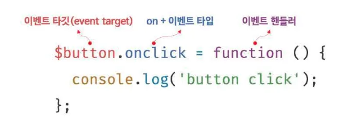
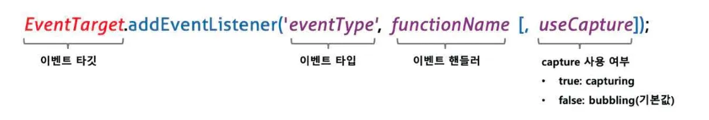
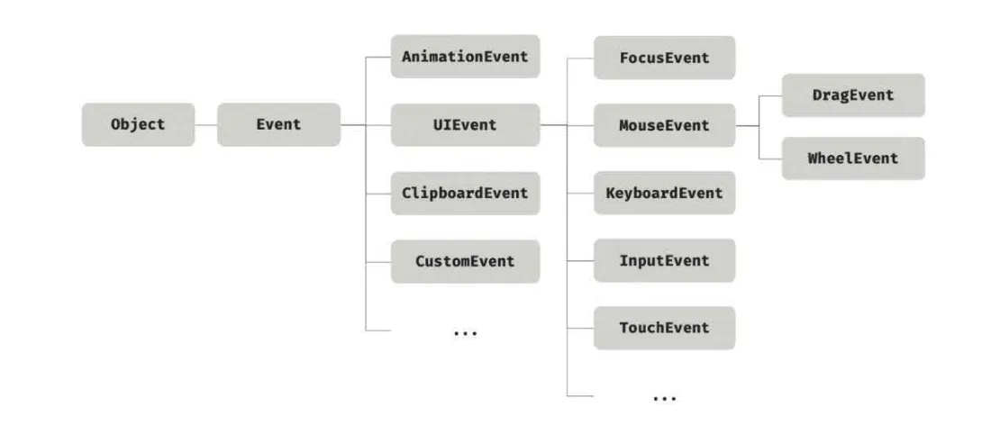
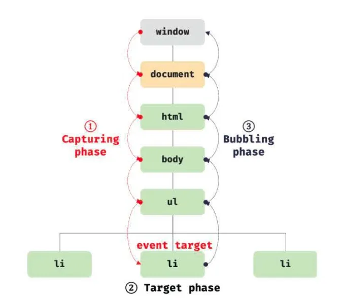
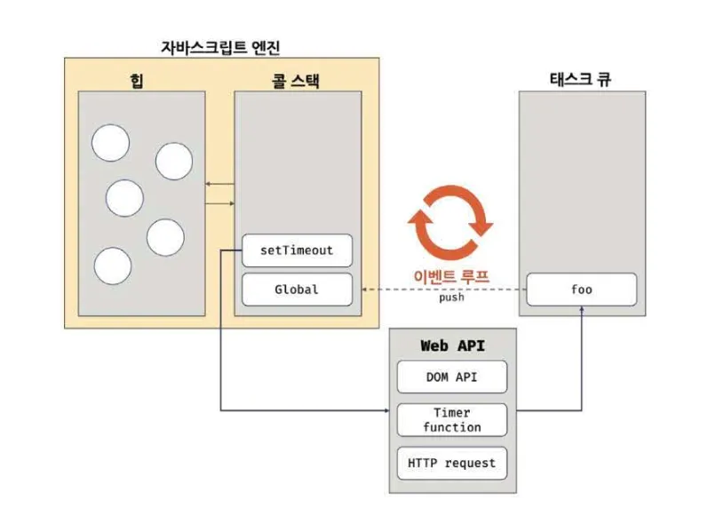

# 40. 이벤트

## 40.1 이벤트 드리븐 프로그래밍

브라우저는 처리해야 할 특정 사건(ex. 클릭, 키보드 입력, 마우스 이동 등)이 이 일어나면 이를 감지하여 이벤트를 발생 시킨다.

- 이벤트가 발생했을 때 호출될 함수를 **이벤트 핸들러(event handler)** 라 한다.
- 이벤트가 발생했을 때 브라우저에게 이벤트 핸들러의 호출을 위힘하는 것을 **이벤트 핸들러 등록**이라 한다.
- 프로그램의 흐름을 이벤트 중심으로 제어하는 프로그래밍 방식을 **이벤트 드리븐 프로그래밍(event-driven programming)** 이라 한다.

## 40.2 이벤트 타입

이벤트 타입은 이벤트의 종류를 나타내는 문자열이다.

- 이벤트 타입은 약 200여 가지가 있다.

### 마우스 이벤트

| 이벤트 타입 | 이벤트 발생 시점                                                |
| ----------- | --------------------------------------------------------------- |
| click       | 마우스 버튼을 클릭했을 때                                       |
| dblclick    | 마우스 버튼을 더블 클릭했을 때                                  |
| mousedown   | 마우스 버튼을 눌렀을 때                                         |
| mouseup     | 누르고 있던 마우스 버튼을 놓았을 때                             |
| mousemove   | 마우스 커서를 움직였을 때                                       |
| mouseenter  | 마우스 커서를 HTML 요소 안으로 이동했을 때 (버블링 되지 않는다) |
| mouseover   | 마우스 커서를 HTML 요소 안으로 이동했을 때 (버블링된다)         |
| mouseleave  | 마우스 커서를 HTML 요소 밖으로 이동했을 때 (버블링되지 않는다)  |
| mouseout    | 마우스 커서를 HTML 요소 밖으로 이동했을 때 (버블링된다)         |

### 키보드 이벤트

| 이벤트 타입 | 이벤트 발생 시점                             |
| ----------- | -------------------------------------------- |
| keydown     | 모든 키를 눌렀을 때 발생한다.                |
| keypress    | 문자 키를 눌렀을 때 연속적으로 발생한다.     |
| keyup       | 누르고 있던 키를 놓았을 때 한 번만 발생한다. |

### 포커스 이벤트

| 이벤트 타입 | 이벤트 발생 시점                                   |
| ----------- | -------------------------------------------------- |
| focus       | HTML 요소가 포커스를 받았을 때 (버블링되지 않는다) |
| blur        | HTML 요소가 포커스를 잃었을 때 (버블링되지 않는다) |
| focusin     | HTML 요소가 포커스를 받았을 때 (버블링 된다)       |
| focusout    | HTML 요소가 포커스를 잃었을 때 (버블링 된다)       |

- `focusin` , `focusout` 이벤트 핸들러를 이벤트 핸들러 프로퍼티 방식으로 등록하면 크롬, 사파리에서 정상 동작하지 않는다.
  - `addEventListener` 메서드 방식을 사용해 등록해야 한다.

### 폼 이벤트

| 이벤트 타입 | 이벤트 발생 시점                                                                                                   |
| ----------- | ------------------------------------------------------------------------------------------------------------------ |
| submit      | form 요소 내의 input, select 입력 필드에서 엔터 키를 눌렀을 때 </br></br> form 요소 내의 submit 버튼을 클릭했을 때 |
| reset       | form 요소 내의 reset 버튼을 클릭했을 때 (최근에는 사용 안 함)                                                      |

### 값 변경 이벤트

| 이벤트 타입      | 이벤트 발생 시점                                                                    |
| ---------------- | ----------------------------------------------------------------------------------- |
| input            | input, select, textarea 요소의 값이 입력되었을 때                                   |
| change           | input, select, textarea 요소의 값이 변경되었을 때                                   |
| readystatechange | HTML 문서의 로드와 파싱 상태를 나타내는 document.readyState 프로퍼티 값이 변경될 때 |

### DOM 뮤테이션 이벤트

| 이벤트 타입      | 이벤트 발생 시점                                            |
| ---------------- | ----------------------------------------------------------- |
| DOMContentLoaded | HTML 문서의 로드와 파싱이 완료되어 DOM 생성이 완료되었을 때 |

### 뷰 이벤트

| 이벤트 타입 | 이벤트 발생 시점                                            |
| ----------- | ----------------------------------------------------------- |
| resize      | 브라우저 윈도우의 크기를 리사이즈할 때 연속적으로 발생한다. |
| scroll      | 웹페이지 또는 HTML 요소를 스크롤할 때 연속적으로 발생한다.  |

### 리소스 이벤트

| 이벤트 타입 | 이벤트 발생 시점                                                                                                      |
| ----------- | --------------------------------------------------------------------------------------------------------------------- |
| load        | DOMContentLoaded 이벤트가 발생한 이후, 모든 리소스(이미지, 폰트 등)의 로딩이 완료되었을 때(주로 window 객체에서 발생) |
| unload      | 리소스가 언로드될 때(주로 새로운 웹페이지를 요청한 경우)                                                              |
| abort       | 리소스 로딩이 중단되었을 때                                                                                           |
| error       | 리소스 로딩이 실패했을 때                                                                                             |

## 40.3 이벤트 핸들러 등록

**이벤트가 발생하면 브라우저에 의해 호출되는 함수가 이벤트 핸들러다.**

- 이벤트가 발생했을 때 브라우저에게 이벤트 핸들러의 호출을 위임하는 것을 이벤트 핸들로 등록이라 한다.
- 이벤트 핸들러를 등록하는 방법은 3가지다.

### 이벤트 핸들러 어트리뷰트 방식

**HTML 요소의 어트리뷰트 중에는 이벤트에 대응하는 이벤트 핸들러 어트리뷰트가 있다.**

- 이벤트 핸들러 어트리뷰트의 이름은 `onclick` 과 같이 `on` 접두사와 이벤트의 종류를 나타내는 이벤트 타입으로 이루어져 있다.
- 이벤트 핸들러 어트리뷰트 값으로 함수 호출문 등의 문을 할당하면 이벤트 핸들러가 등록된다.
- 이벤트를 등록할 때 콜백 함수와 마찬가지로 함수 참조를 등록해야 브라우저가 이벤트 핸들러를 호출할 수 있다.

### 이벤트 핸들러 프로퍼티 방식

**`window` 객체와 `Document` , `HTMLElement` 타입의 DOM 노드 객체는 이벤트에 대응하는 이벤트 핸들러 프로퍼티를 가지고 있다.**

- 이벤트 핸들러 프로퍼티의 키는 이벤트 핸들러 어트리뷰트와 마찬가지로 `onclick` 과 같이 `on` 접두사와 이벤트의 종류를 나타내는 이벤트 타입으로 이루어져있다.
- 이벤트 핸들러 프로퍼티에 함수를 바인딩하면 이벤트 핸들러가 등록된다.
- 이벤트 핸들러를 등록하기 위해서는 이벤트를 발생시킬 객체인 **이벤트 타깃(event target)** 과 이벤트의 종류를 나타내는 문자열인 **이벤트 타입(event type)** 그리고 이벤트 핸들러를 지정할 필요가 있다.



- `이벤트 핸들러 프로퍼티 방식` 은 `이벤트 핸들러 어트리뷰트 방식` 의 HTML과 자바스크립트가 뒤섞이는 문제를 해결할 수 있다.
  - 하지만 이벤트 핸들러 프로퍼티에 하나의 이벤트 핸들러만 바인딩할 수 있다는 단점이 있다.

### addEventListener 메서드 방식

DOM Level 2에서 도입된 `EventTarget.prototype.addEventListener` 메서드를 사용하여 이벤트 핸들러를 등록할 수 있다.

- `이벤트 핸들러 어트리뷰트 방식` 과 `이벤트 핸들러 프로퍼티 방식` 은 DOM Level 0 부터 제공되던 방식이다.



- `addEventListener` 메서드의 첫 번째 매개변수에는 이벤트의 종류를 나타내는 문자열인 이벤트 타입을 전달한다.
  - 두 번째 매개변수에는 이벤트 핸들러를 전달한다.
  - 마지막 매개변수에는 이벤트를 캐치할 이벤트 전파 단계를 지정한다.
    - 생략하거나 `false` 를 지정하면 버블링 단계에서 이벤트를 캐치하고, `true` 를 지정하면 캡처링 단계에서 이벤트를 캐치한다.
- `이벤트 핸들러 프로퍼티 방식` 은 이벤트 핸들러 프로퍼티에 이벤트 핸들러를 바인딩하지만 `addEventListener` 메서드에는 이벤트 핸들러를 인수로 전달한다.
- 만약 동일한 HTML 요소에서 발생한 동일한 이벤트에 대해 이벤트 핸들러 프로퍼티 방식과 `addEventListener` 메서드 방식을 모두 사용하여 이벤트 핸들러를 등록하면 어떻게 될까
  - `addEventListener` 메서드 방식은 이벤트 핸들러 프로퍼티에 바인딩된 이벤트 핸들러에 아무런 영향을 주지 않는다.
  - 따라서 버튼 요소에서 클릭 이벤트가 발생하면 2개의 이벤트 핸들러가 모두 호출된다.
- 동일한 HTML 요소에서 발생한 동일한 이벤트에 대해 이벤트 핸들러 프로퍼티 방식은 하나 이상의 이벤트 핸들러를 등록할 수 없지만 `addEventListener` 메서드는 하나 이상의 이벤트 핸들러를 등록할 수 있다.
- `addEventListener` 메서드를 통해 참조가 동일한 이벤트 핸들러를 중복 등록하면 하나의 이벤트 핸들러만 등록된다.

## 40.4 이벤트 핸들러 제거

**`addEventListener` 메서드로 등록한 이벤트 핸들러를 제거하려면 `EventTarget.prototype.removeEventListener` 메서드를 사용한다.**

- `removeEventListener` 메서드에 전달할 인수는 `addEventListener` 메서드와 동일하다.
  - `addEventListener` 메서드에 전달한 인수와 `removeEventListener` 메서드에 전달한 인수가 일치하지 않으면 이벤트 핸들러가 제거되지 않는다.
- 이벤트를 제거하려면 이벤트 핸들러의 참조를 변수나 자료구조에 저장하고 있어야 한다.
  - 무명 함수를 이벤트 핸들러로 등록한 경우 제거할 수 없다.
- 이벤트 핸들러 프로퍼티 방식으로 등록한 이벤트 핸들러를 제거하려면 이벤트 핸들러 프로퍼티에 `null` 을 할당해야 한다.

## 40.5 이벤트 객체

이벤트가 발생하면 이벤트에 관련한 다양한 정보를 담고 있는 이벤트 객체가 동적으로 생성된다. **생성된 이벤트 객체는 이벤트 핸들러의 첫 번째 인수로 전달된다.**

- 이벤트 객체를 전달받으려면 이벤트 핸들러를 정의할 때 이벤트 객체를 전달받을 매개변수를 명시적으로 선언해야 한다.
- 이벤트 핸들러 어트리뷰트 방식의 경우 이벤트 객체를 전달받으려면 이벤트 핸들러의 첫 번째 매개변수 이름이 반드시 `event` 이어야 한다.

### 이벤트 객체의 상속 구조

**이벤트가 발생하면 이벤트 타입에 따라 다양한 타입의 이벤트 객체가 생성된다. 이벤트 객체는 다음과 같은 상속 구조를 가진다.**



- `Event` , `UIEvent` , `MouseEvent` 등 모두 생성자 함수다. 따라서 생성자 함수를 호출하여 이벤트 객체를 생성할 수 있다.

### 이벤트 객체의 공통 프로퍼티

**`Event` 인터페이스, 즉 `Event.prototype` 에 정의되어 있는 이벤트 관련 프로퍼티는 `UIEvent` , `CoustomEvent` , `MouseEvent` 등 모든 파생 이벤트 객체에 상속된다.**

- 즉 `Event` 인터페이스의 이벤트 관련 프로퍼티는 모든 이벤트 객체가 상속받는 공통 프로퍼티다.

| 공통 프로퍼티  | 설명                                                                                                                          | 타입          |
| -------------- | ----------------------------------------------------------------------------------------------------------------------------- | ------------- |
| type           | 이벤트 타입                                                                                                                   | string        |
| target         | 이벤트를 발생시킨 DOM 요소                                                                                                    | DOM 요소 노드 |
| currentTarget  | 이벤트 핸들러가 바인딩된 DOM 요소                                                                                             | DOM 요소 노드 |
| eventPhase     | 이벤트 전파 단계 <br/> 0: 이벤트 없음, 1: 캡처링 단계, 2: 버블링 단계                                                         | number        |
| bubbles        | 이벤트를 버블링으로 전파하는지 여부, 다음 이벤트는 blubbles: false로 버블링 하지 않는다.                                      | boolean       |
| cancelable     | preventDefault 메서드를 호출하여 이벤트의 기본 동작을 취소할 수 있는지 여부. 다음 이벤트는 cancelable: false로 취소할 수 없다 | boolean       |
| defaultPrevent | preventDefault 메서드를 호출하여 이벤트를 취소했는지 여부                                                                     | boolean       |
| isTrusted      | 사용자의 행위에 의해 발생한 이벤트인지 여부                                                                                   | boolean       |
| timeStamp      | 이벤트가 발생한 시각                                                                                                          | number        |

## 40.6 이벤트 전파

**DOM 트리 상에 존재하는 DOM 요소 노드에서 발생한 이벤트는 DOM 트리를 통해 전파된다. 이를 이벤트 전파라고 한다.**



1. 캡처링 단계(capturing phase): 이벤트가 상위 요소에서 하위 요소 방향으로 전파
2. 타깃 단계(target phase): 이벤트가 이벤트 타깃에 도달
3. 버블링 단계(bubbling phase): 이벤트가 하위 요소에서 상위 요소 방향으로 전파

- 이벤트는 이벤트를 발생시킨 이벤트 타깃은 물론 상위 DOM 요소에서도 캐치할 수 있다.

## 40.7 이벤트 위임

**이벤트 위임은 여러 개의 하위 DOM 요소에 각각 이벤트 핸들러를 등록하는 대신 하나의 상위 DOM 요소에 이벤트 핸들러를 등록하는 방법을 말한다.**

- 이벤트 위임을 통해 상위 DOM 요소에 이벤트 핸들러를 등록하면 여러 개의 하위 DOM 요소에 이벤트 핸들러를 등록할 필요가 없다.
- 동적으로 하위 DOM 요소를 추가하더라도 일일이 추가된 DOM 요소에 이벤트 핸들러를 등록할 필요가 없다.

## 40.8 DOM 요소의 기본 동작 조작

### DOM 요소의 기본 동작 중단

**DOM 요소는 저마다 기본 동작이 있다.**

- 예를 들어, `a` 링크를 클릭하면 href 어트리뷰트에 지정된 링크로 이동한다.
- 이벤트 객체의 `preventDefault` 메서드는 이러한 DOM 요소의 기본 동작을 중단시킨다.

### 이벤트 전파 방지

**이벤트 객체의 `stopPropagation` 메서드는 이벤트 전파를 중지시킨다.**

- 하위 DOM 요소의 이벤트를 개별적으로 처리하기 위해 이벤트의 전파를 중단시킨다.

## 40.9 이벤트 핸들러 내부의 this

### 이벤트 핸들러 어트리뷰트 방식

- 이벤트 핸들러의 어트리뷰트 값으로 지정한 문자열은 암묵적으로 생성되는 이벤트 핸들러의 문이라고 한다.
- 이벤트 핸들러 어트리뷰트 방식에 의해 암묵적으로 생성된 이벤트 핸들러 내부의 `this` 는 이벤트를 바인딩한 DOM 요소를 가리킨다.

### 이벤트 핸들러 프로퍼티 방식과 addEventListener 메서드 방식

**이벤트 핸들러 프로퍼티 방식과 `addEventListener` 메서드 방식 모두 이벤트 핸들러 내부의 `this` 는 이벤트를 바인딩한 DOM 요소를 가리킨다.**

- 이벤트 핸들러 내부의 `this` 는 이벤트 객체의 `currentTarget` 프로퍼티와 같다.
- 화살표 함수로 정의한 이벤트 핸들러 내부의 `this` 는 상위 스코프의 `this` 를 가리킨다.
  - 화살표 함수는 함수 자체의 `this` 바인딩을 갖지 않는다.
- 클래스에서 이벤트 핸들러를 바인딩하는 경우 `this` 에 주의해야 한다.
  - 메서드 내부의 `this` 는 클래스가 생성할 인스턴스를 가리키지 않는다.
  - 이벤트 핸들러 내부의 `this` 는 이벤트를 바인딩한 DOM 요소를 가리킨다.
  - `bind` 메서드를 사용해 `this` 를 전달하여 메서드 내부의 `this` 클래스가 생성할 인스턴스를 가리키도록 해야한다.
  - 클래스 필드에 할당한 화살표 함수를 이벤트 핸들러 내부의 `this` 가 인스턴스를 가리키도록 할 수도 있다.

## 40.10 이벤트 핸들러에 인수 전달

**함수에 인수를 전달하려면 함수를 호출할 때 전달해야 한다.**

- 이벤트 핸들러 어트리뷰트 방식은 함수 호출문을 사용할 수 있기 때문에 인수를 전달할 수 있다.
- 이벤트 핸들러 프로퍼티 방식과 `addEventListener` 메서드 방식의 경우 이벤트 핸들러를 브라우저가 호출하기 때문에 함수 호출문이 아닌 함수 자체를 등록해야 한다.
  - 따라서 인수를 전달할 수 없다.

## 40.11 커스텀 이벤트

### 커스텀 이벤트 생성

**이벤트 객체는 `Event` , `UIEvent` , `MouseEvent` 같은 이벤트 생성자 함수로 생성할 수 있다.**

- 이벤트 생성자 함수를 호출하여 명시적으로 생성한 이벤트 객체는 임의의 이벤트 타입을 지정할 수 있다.
- 이벤트 생성자 함수는 첫 번째 인수로 이벤트 타입을 나타내는 문자열을 전달받는다.
  - 이벤트 타입을 나타내는 문자열은 기존 이벤트 타입을 사용할 수도 있고, 기존 이벤트 타입이 아닌 임의의 문자열을 사용하여 새로운 이벤트 타입을 지정할 수도 있다.
  - 일반적으로 `CustomEvent` 이벤트 생성자 함수를 사용한다.
- 생성된 커스텀 이벤트 객체는 버블링되지 않으며 `preventDefault` 메서드로 취소할 수도 없다.
  - 즉, 커스텀 이벤트 객체는 `bubbles` 와 `cancelable` 프로퍼티 값이 `false` 로 기본 설정된다.
  - `true` 로 설정하려면 이벤트 생성자 함수의 두 번째 인수로 `bubbles` 또는 `cancelable` 프로퍼티를 갖는 객체를 전달한다.
- 이벤트 타입에 따라 가지는 이벤트 고유의 프로퍼티 값을 지정할 수 있다.

### 커스텀 이벤트 디스패치

**생성된 커그텀 이벤트는 `dispatchEvent` 메서드로 디스패치(이벤트를 발생시키는 행위)할 수 있다.**

- `dispatchEvent` 메서드에 이벤트 객체를 인수로 전달하면서 호출하면 인수로 전달한 이벤트 타입의 이벤트가 발생한다.
- 이벤트 핸들러는 비동기 처리 방식으로 동작하지만, `dispatchEvent` 메서드는 이벤트 핸들러를 동기 처리 방식으로 호출한다.
  - 커스텀 이벤트에 바인딩된 이벤트 핸들러를 직접 호출하는 것과 같다.
- `dispatchEvent` 메서드로 이벤트 디스패치를 하기 이전에 커스텀 이벤트를 처리할 이벤트 핸들러를 등록해야 한다.

# 41. 타이머

## 41.1 호출 스케줄링

**함수를 명시적으로 호출하면 함수가 즉시 실행된다. 만약 함수를 명시적으로 호출하지 않고 일정 시간이 경과된 이후에 호출되도록 함수 호출을 예약하려면 타이머 함수를 사용한다. 이를 호출 `스케줄링(scheduling a call)` 이라 한다.**

- 타이머 함수는 ECMAScript 사양에 정의된 빌트인 함수가 아니고 호스트 객체다.
- 타이머를 생성할 수 있는 타이머 함수 `setTimeout` 과 `setInterval` 이 있다.
- 타이머를 제거할 수 있는 타이머 함수 `clearTimeout` 과 `clearInterval` 이 있다.
- 타이머 함수 `setTimeout` 과 `setInterval` 은 모두 일정한 시간이 경과된 이후 콜백 함수가 호출되도록 타이머를 생성한다.
  - 타이머 함수가 생성한 타이머가 만료되면 콜백 함수가 호출된다.
  - `setTimeout` 함수가 생성한 타이머는 단 한 번 동작하고, `setInterval` 함수가 생성한 타이머는 반복 동작한다.
  - `setTimeout` 함수의 콜백 함수는 타이머가 만료되면 단 한 번 호출되고, `setInterval` 함수의 콜백 함수는 타이머가 만료될 때마다 반복 호출된다.
- 자바스크립트 엔진은 단 하나의 실행 컨텍스트 스택을 갖기 때문에 두 가지 이상의 태스크를 동시에 실행할 수수 없다.
  - 자바스크립트 엔진은 **싱글 스레드**로 동작한다.
  - 이러한 이유로 타이머 함수 `setTimeout` 과 `setInterval` 은 **비동기 처리 방식**으로 동작한다.

## 41.2 타이머 함수

### setTimeout / clearTimeout

**`setTimeout` 함수는 두 번째 인수로 전달받은 시간(ms, 1/1000초)으로 단 한 번 동작하는 타이머를 생성한다.**

- 이후 타이머가 완료되면 첫 번째 인수로 전달받은 콜백 함수가 호출된다.

```jsx
const timeoutId = setTimeout(func | code[, delay, param1, param2, ...]);
```

| 매개변수          | 설명                                                                                                                                 |
| ----------------- | ------------------------------------------------------------------------------------------------------------------------------------ |
| func              | 타이머가 완료된 뒤 호출될 콜백 함수                                                                                                  |
| delay             | 타이머 완료 시간, setTimeout 함수는 delay 시간으로 단 한 번 동작하는 타이머를 생성한다. 인수 전달을 생략한 경우 기본값 0이 지정된다. |
| param1, param2, … | 호출 스케줄링된 콜백 함수에 전달해야 할 인수가 존재하는 경우 세 번째 이후의 호출 인수로 전달할 수 있다.                              |

- `setTimeout` 함수가 반환한 타이머 id를 `clearTimeout` 함수의 인수로 전달하여 타이머를 취소할 수 있다. `clearTimeout` 함수는 호출 스케줄링을 취소한다.

### setInterval / clearInterval

**`setInterval` 함수는 두 번째 인수로 전달받은 시간(ms, 1/1000초)으로 반복 동작하는 타이머를 생성한다.**

- 이후 타이머가 완료될 때마다 첫 번째 인수로 전달받은 콜백 함수가 반복 호출된다.
  - 타이머가 취소될 때까지 계속된다.
- `setInterval` 함수의 콜백 함수는 두 번째 인수로 전달받은 시간이 경과될 때마다 반복 실행되도록 호출 스케줄링된다.

```jsx
const timerId = setTimeout(func | code[, delay, param1, param2, ...]);
```

- `setInterval` 함수는 생성된 타이머를 식별할 수 있는 고유한 타이머 id를 반환한다.
- `setInterval` 함수가 반환한 타이머 id를 `clearInterval` 함수의 인수로 전달하여 타이머를 취소할 수 있다.

## 41.3 디바운스와 스로틀

**디바운스와 스로틀은 짧은 시간 간격으로 연속해서 발생하는 이벤트를 그룹화해서 과도한 이벤트 핸들러의 호출을 방지하는 프로그래밍 기법이다.**

### 디바운스

**디바운스(debounce)는 짧은 시간 간격으로 이벤트가 연속해서 발생하면 이벤트 핸들러를 호출하지 않다가 일정 시간이 경과한 이후에 이벤트 핸들러가 한 번만 호출하도록 한다.**

- 즉, 디바운스는 짧은 시간 간격으로 발생하는 이벤트를 그룹화해서 마지막에 한 번만 이벤트 핸들러가 호출되도록 한다.
- `resize` 이벤트 처리나 `input` 요소에 입력된 값으로 버튼 중복 클릭 방지 처리 등에 유용하게 사용된다.

### 스로틀

**스로틀(throttle)은 짧은 시간 간격으로 이벤트가 연속해서 발생하더라도 일정 시간 간격으로 이벤트 헨들러가 최대 한 번만 호출되도록 한다.**

- 즉, 스로틀은 짧은 시간 간격으로 연속해서 발생하는 이벤트를 그룹화해서 일정 시간 단위로 이벤트 핸들러가 호출되도록 이벤트 핸들러가 호출되도록 호출 주기를 만든다.

- 이처럼 짧은 시간 간격으로 연속해서 발생하는 이벤트를 그룹화해서 일정 시간 간격으로 이벤트 핸들러를 호출하는 스로틀은 scroll 이벤트 처리나 무한 스크롤 UI구현 등에 유용하게 사용된다.

# 42. 비동기 프로그래밍

## 42.1 동기 처리와 비동기 처리

**자바스크립트 엔진은 단 하나의 실행 컨텍스트 스택을 갖는다.**

- 함수를 실행할 수 있는 창구가 단 하나이며, 동시에 2개 이상의 함수를 동시에 실행할 수 없다.
- 실행 컨텍스트 스택의 최상위 요소인 `실행 중인 컨텍스트` 를 제외한 모든 실행 컨텍스트는 모두 실행 대기중인 태스크(task) 들이다.
- 대기 중인 테스크들은 현재 실행 중인 실행 컨텍스트가 팝되어 실행 컨텍스트 스택에서 제거된다.

  - 현재 실행 중인 함수가 종료하면 실행된다.

- 자바스크르립트 엔진은 한 번에 하나의 태스크만 실행할 수 있는 **`싱글 스레드(single thread)`** 방식으로 동작한다.
  - 싱글 스레드 방식은 한 번에 하나의 태스크만 실행할 수 있기 때문에 처리에 시간이 걸리는 태스크를 실행하는 경우 **`블로킹(작업 중단)`** 이 발생한다.
  - 현재 실행 중인 태스크가 종료할 때까지 다음 실행될 태스크가 대기하는 방식을 **`동기(synchronous) 처리`** 라고 한다.
    - 동기 처리 방식은 태스크를 순서대로 하나씩 처리하므로 실행 순서가 보장된다는 장점이 있다.
    - 하지만 앞선 태스크가 종료할 때까지 이후 태스크들이 블로킹되는 단점이 있다.
- 현재 실행 중인 태스크가 종료되지 않은 상태라 해도 곧바로 실행하는 방식을 **`비동기(asynchronous) 처리` 라고 한다.**
  - 현재 실행 중인 태스크가 종료되지 않은 상태라 해도 다음 태스크들이 곧바로 실행하므로 블로킹이 발생하지 않는다는 장점이 있다.
  - 하지만 태스크의 실행 순서가 보장되지 않는 단점이 있다.
- 타이머 함수인 `setTimeout` 과 `setInterval` , `HTTP 요청` , `이벤트 핸들러` 는 비동기 처리 방식으로 동작한다.
  - 비동기 처리는 이벤트 루프와 태스크 큐와 깊은 관계가 있다.

## 42.2 이벤트 루프와 태스크 큐

**자바스크립트의 특징 중 하나는 싱글 스레드로 동작하는 것이다. 하지만 브라우저가 동작하는 것을 보면 많은 태스크가 동시에 처리되는 것처럼 느껴진다.**

- 자바스크립트의 동시성을 지원하는 것이 **`이벤트 루프(event loop)` 다.**
  - 이벤트 루프는 브라우저에 내장되어 있는 기능 중 하나다.
- 브라우저 환경은 다음과 같다.



- 자바스크립트 엔진은 크게 2개의 영역으로 구분할 수 있다.
- **`콜 스택(call stack)`**
  - 소스코드 평가 과정에서 생성된 실행 컨텍스트가 추가되고 제거되는 스택 자료구조인 실행 컨텍스트 스택이 콜스택이다.
  - 함수를 호출하면 함수 실행 컨텍스트가 순차적으로 실행된다.
  - 단 하나의 콜 스택을 사용하기 때문에 최상위 실행 컨텍스트가 종료되어 콜 스택에서 제거되기 전까지는 다른 태스크도 실행되지 않는다.
- **`힙(heap)`**

  - 힙은 객체가 저장되는 공간이다. 콜 스택의 요소인 실행 컨텍스트는 힙에 저장된 객체를 참조한다.
  - 객체는 원시 값과는 달리 크기가 정해져 있지 않으므로 할당해야 할 메모리 공간의 크기를 런타임에 결정(동적 할당)해야 한다.
  - 따라서 객체가 저장되는 메모리 공간인 힙은 구조화 되어 있지 않다는 특징이 있다.

- 콜 스택과 힙으로 구성되어 있는 자바스크립트 엔진은 단순히 태스크가 요청되면 콜 스택을 통해 요청된 작업을 순차적으로 실행할 뿐이다.
- 비동기 처리에서 소스코드의 평가와 실행을 제외한 모든 처리는 자바스크립트 엔진을 구동하는 환경인 브라우저 또는 Node.js가 담당한다.
  - 이를 위해 브라우저 환경은 테스크 큐와 이벤트 루프를 제공한다.
- **`테스크 큐(task queue/event queue/callback queue)`**
  - 비동기 콜백 함수 또는 이벤트 핸들러가 일시적으로 보관되는 영역이다.
  - 테스크 큐와는 벌도로 프로미스의 후속 처리 메서드의 콜백 함수가 일시적으로 보관되는 마이크로 소프트 큐도 존재한다.
- **`이벤트 루프(evelt loop)`**
  - 이벤트 루프는 콜 스택이 현재 실행 중인 실행 컨텍스트가 있는지, 그리고 태스크 큐에 대기중인 함수(콜백 함수, 이벤트 핸들러 등)가 있는 반복해서 확인한다.
  - 만약 콜 스택이 비어있고 테스크 큐에 대기 중인 함수가 있다면 루프는 순차적(FIFO)으로 태스크 큐에 대기 중인 함수를 콜 스택으로 이동시킨다.
  - 콜 스택으로 이동한 함수는 실행된다. 또한 태크스 큐에 일시 보관된 함수들은 비동기 처리 방식으로 동작한다.
- **비동기 함수인 콜백 함수는 태스크 큐에 푸시되어 대기하다가 콜 스택이 비게 되면, 콜 스택에 푸시되어 실행된다.**
- **자바스크립트는 싱글 스레드 방식으로 동작한다.**
  - 이때 싱글 스레드 방식으로 동작하는 것은 브라우저가 아니라 브라우저에 내장된 자바스크립트 엔진이다.
- **자바스크립트 엔진은 싱글 스레드로 동작하지만 브라우저가 브라우저는 멀티 스레드로 동작한다.**

# 43. Ajax

## 43.1 Ajax란?

**`Ajax(Asynchronous JavaScript and XML)` 란 자바스크립트를 사용하여 브라우저가 서버에게 비동기 방식으로 데이터를 요청하고, 서버가 응답한 데이터를 수신하여 웹페이지를 동적으로 갱신하는 프로그래밍 방식을 말한다.**

- Ajax는 브라우저에서 제공하는 Web API인 XMLHttpRequest 객체를 기반으로 동작하며 HTTP 비동기 통신을 위한 메서드와 프로퍼티를 제공한다.
- Ajax 등장 이전의 문제점
  - 이전 웹페이지와 차이가 없어서 변경할 필요가 없는 부분까지 포함된 완전한 HTML을 서버로부터 매번 다시 전송받기 때문에 불필요한 데이터 통신이 발생한다.
  - 변경할 필요가 없는 부분까지 처음부터 다시 렌더링한다. 이로인해 화면 전환이 일어나면 화면이 순간적으로 깜빡이는 현상이 발생한다.
  - 클라이언트와 서버와의 통신이 동기 방식으로 동작하기 때문에 서버로부터 응답이 있을 때까지 다음 처리는 블로킹된다.
- Ajax의 등장 이후 장점
  - 변경할 부분을 갱신하는 데 필요한 데이터만 서버로부터 전송받기 때문에 불필요한 데이터 통신이 발생하지 않는다.
  - 변경할 필요가 없는 부분은 다시 렌더링하지 않는다. 따라서 화면이 순간적으로 깜빡이는 현상이 발생하지 않는다.
  - 클라이언트와 서버와의 통신이 비동기 방식으로 동작하기 때문에 서버에게 요청을 보낸 이후 블로킹이 발생하지 않는다.

## 43.2 JSON

**JSON(JavaScript Object Notation)은 클라이언트와 서버 간의 HTTP 통신을 위한 텍스트 데이터 포맷이다.**

- 자바스크립트에 종속되지 않는 언어 독립형 포맷으로, 대부분의 프로그래밍 언어에서 사용할 수 있다.

### JSON 표기 방식

**JSON은 자바스크립트의 객체 리터럴과 유사하게 키와 값으로 구성된 순수한 텍스트다.**

- JSON의 키는 반드시 큰따옴표로 묶어야 한다.
- 값은 객체 리터럴과 같은 표기법을 그대로 사용할 수 있다.
  - 문자열은 반드시 큰 따옴표로 묶어야 한다.

### JSON.stringify

**`JSON.stringify` 메서드는 객체를 JSON 포맷 문자열로 변환한다.**

- 클라이언트가 서버로 객체를 전송하려면 객체를 문자열화해야 하는데 이를 직렬화라 한다.
- `JSON.stringify` 메서드는 객체뿐만 아니라 배열로 JSON 포맷의 문자열로 변환한다,

### JSON.parse

**`JSON,parse` 메서드는 JSON 문자열을 객체로 변환한다.**

- 서버로부터 클라이언트에게 전송된 JSON 데이터는 문자열이다.
- 이 문자열을 객체로서 사용하려면 JSON 포맷의 문자열을 객체화 해야 하는데 이를 역직렬화라 한다.
- 배열이 JSON 포맷의 문자열로 변환되어 있는 경우 `JSON.parse` 는 문자열 배열 객체로 변환한다.
  - 베열의 요소가 객체인 경우 배열의 요소까지 객체로 변환한다.

## 43.3 XMLHttpquest

**브라우저는 주소창이나 HTML의 form 태그 또는 a 태그를 통해 HTTP 요청 전송 기능을 기본 제공한다.**

**자바스크립트를 사용하여 HTTP 요청을 전송하려면 `XMLHttpRequest` 객체를 사용한다.**

- Web API인 XMLHttpRequest 객체는 HTTP 요청 전송과 응답 수신을 위한 다양한 메서드와 프로퍼티를 지원한다.

### XMLHttpRequest 객체 생성

**`XMLHttpRequest` 객체는 `XMLHttpRequest` 생성자 함수를 호출하여 생성한다.**

- `XMLHttpRequest` 객체는 브라우저에서 제공하는 Web API 이므로 브라우저 환경에서만 정상적으로 실행된다.

```jsx
// XMLHttpRequest 객체의 생성
const xhr = new XMLHttpRequest();
```

### XMLHttpRequest 객체의 프로퍼티와 메서드

- **XMLHttpRequest 객체의 프로토타입 프로퍼티**

| 프러토타입 프로퍼티 | 설명                                           |
| ------------------- | ---------------------------------------------- |
| **readyState**      | HTTP 요청의 현재 상태를 나타내는 정수.         |
| **status**          | HTTP 요청에 대한 응답 상태를 나타내는 정수     |
| **statusText**      | HTTP 요청에 대한 응답 메시지를 나타내는 문자열 |
| **responseType**    | HTTP 응답 타입                                 |
| **response**        | HTTP 요청에 대한 응답 몸체                     |
| responseText        | 서버가 전송한 HTTP 요청에 대한 응답문자열      |

- **XMLHttpRequest 객체의 이벤트 핸들러 프로퍼티**

| 이벤트 핸들러 프로퍼티 | 설명                                                         |
| ---------------------- | ------------------------------------------------------------ |
| **onreadystatechange** | readyState 프로퍼티 값이 변경된 경우                         |
| onloadstart            | HTTP 요청에 대한 응답을 받기 시작한 경우                     |
| onprogress             | HTTP 요청에 대한 응답을 받는 도중 주기적으로 발생            |
| onabort                | abort 메서드에 대해 HTTP 요청이 중단된 경우                  |
| **onerror**            | HTTP 요청에 에러가 발생한 경우                               |
| **onload**             | HTTP 요청이 성공적으로 완료한 경우                           |
| ontimeout              | HTTP 요청 시간이 초과된 경우                                 |
| onloadend              | HTTP 요청이 완료한 경우, HTTP 요청이 성공 또는 실패하면 발생 |

- **XMLHttpRequest 객체의 메서드**

| 메서드                | 설명                                     |
| --------------------- | ---------------------------------------- |
| **open**              | HTTP 요청 초기화                         |
| **send**              | HTTP 요청 전송                           |
| **abort**             | 이미 전송된 HTTP 요청 중단               |
| **setRequestsHeader** | 특정 HTTP 요청 헤더의 값을 설정          |
| getResponseHeader     | 특정 HTTP 요청 헤더의 값을 문자열로 변환 |

- **XMLHttpRequest 객체의 정적 프로퍼티**

| 정적 프로퍼티    | 값  | 설명                                  |
| ---------------- | --- | ------------------------------------- |
| UNSENT           | 0   | open 메서드 호출 이전                 |
| OPENED           | 1   | open 메서드 호출 이후                 |
| HEADERS_RECEIVED | 2   | send 메서드 호출 이후                 |
| LOADING          | 3   | 서버 응답중 (응답 데이터 미완성 상태) |
| DONE             | 4   | 서버 응답 완료                        |

### HTTP 요청 전송

1. `XMLHttpRequest.prototype.open` 메서드로 HTTP 요청을 초기화 한다.
2. 필요에 따라 `XMLHttpRequest.prototype.setRequestHeader` 메서드로 특정 HTTP 요청의 헤더 값을 설정한다.
3. `XMLHttpRequest.prototype.send` 메서드로 HTTP 요청을 전송한다.

```jsx
// XMLHttpRequest 객체 생성
const xhr = new XMLHttpRequest();

// HTTP 요청 초기화
xhr.open("GET", "/users");

// HTTP 요청 헤더 설정
// 클라이언트가 서버로 전송할 데이터의 MINE 타입 지정: json
xhr.setRequestHeader("content-type", "application/json");

// HTTP 요청 전송
xhr.send();
```

- **XMLHttpRequest.prototype.open**

`open` 메서드는 서버에 전송할 HTTP 요청을 초기화 한다.

```jsx
xhr.open(method, rul[, async])
```

| 매개변수 | 설명                                                                    |
| -------- | ----------------------------------------------------------------------- |
| method   | HTTP 요청 메서드                                                        |
| url      | HTTP 요청을 전송할 URL                                                  |
| async    | 비동기 요청 여부. 옵션으로 기본값은 true이며, 비동기 방식으로 동작한다. |

- **XMLHttpRequest.prototype.send**

`send` 메서드는 open 메서드로 초기화된 HTTP 요청을 서버에 전송한다.

- GET 요청 메서드의 경우 데이터를 URL의 일부분인 쿼리 문자열로 서버에 전송한다.
- POST 요청 메서드의 경우 데이터(페이로드)를 요청 몸체에 담아 전송한다.
- 페이로드가 객체인 경우 반드시 `JSON.stringify` 메서드를 사용해서 직렬화한 다음 전달해야 한다.
- **HTTP 요청 메서드가 GET인 경우 `send` 메서드에 페이로드로 전달한 인수는 무시되고 요청 몸체는 null로 설정된다.**
- **XMLHttpRequest.prototype.setRequestHeader**

`setRequestHeader` 메서드는 특정 HTTP 요청의 헤더 값을 설정한다.

- `setRequestHeader` 메서드는 반드시 `open` 메서드를 호출한 이후에 호출해야 한다.
- `Content-type` 은 요청 몸체에 담아 전송할 데이터의 `MINE 타입` 의 정보를 표현한다.

| MINE 타입   | 서브타입                                           |
| ----------- | -------------------------------------------------- |
| text        | text/plain, text/html, text/css, text/javascript   |
| application | application/json, application-x-www-from-urlencode |
| multipart   | multipart/formed-data                              |

### HTTP 응답 처리

**HTTP 요청의 현재 상태를 나타내는 `readState` 프로퍼티 값이 변경된 경우 발생하는 `readystatechange` 이벤트를 캐치하여 HTTP 응답을 처리할 수 있다.**

- 서버의 응답이 완료되면 HTTP 요청에 대한 응답 상태를 나타내는 `status` 가 200인지 확인하여 정상 처리와 에러 처리를 구분한다.

# 44. REST API

REST는 HTTP를 기반으로 클라이언트가 서버의 리소스에 접근하는 방식을 규정한 아키텍처고, REST API는 REST를 기반으로 서비스 API를 구현한 것을 의미한다.

## 44.1 REST API의 구성

**REST API는 자원(resource), 행위(verb), 표현의(reoressbtatuibs)의 3가지 요소로 구성된다.**

| 구성 요소 | 내용                           | 표현 방법        |
| --------- | ------------------------------ | ---------------- |
| 자원      | 자원                           | URL(엔드포인트)  |
| 행위      | 자원에 대한 행위               | HTTP 요청 메서드 |
| 표현      | 자원에 대한 행위의 구체적 내용 | 페이로드         |

## 44.2 REST API 설계 원칙

**`URI는 리소스를 표현하는데 집중` 하고 `행위에 대한 정의는 HTTP 요청 메서드` 를 통해 하는 것이 RESTful API를 설계하는 중심 규칙이다.**

- **URI는 리소스를 통해 표현해야 한다.**
  - URI는 리소스를 표현하는 데 중점을 두어야 한다.
  - 리소스를 식별할 수 있는 이름은 동사보다는 명사를 사용용한다.
    - 따라서 이름에 get 같은 행위에 대한 표현이 들어가서는 안된다.
- **리소스에 대한 행위는 HTTP 요청 메서드로 표현한다.**
  - HTTP 요청 메서드는 클라이언트가 서버에게 요청의 종류와 목적을 알리는 방법이다.
  - 주로 5가지 요청 메서드를 사용하여 CRUD를 구현한다.

| HTTP 요청 메서드 | 종류           | 목적                  | 페이로드 |
| ---------------- | -------------- | --------------------- | -------- |
| GET              | index/retrieve | 모든/특정 리소스 취득 | X        |
| POST             | create         | 리소스 생성           | O        |
| PUT              | replace        | 리소스의 전체 교체    | O        |
| PATCH            | modify         | 리소스의 일부 수정    | O        |
| DELETE           | delete         | 모든/특정 리소슥      | X        |
