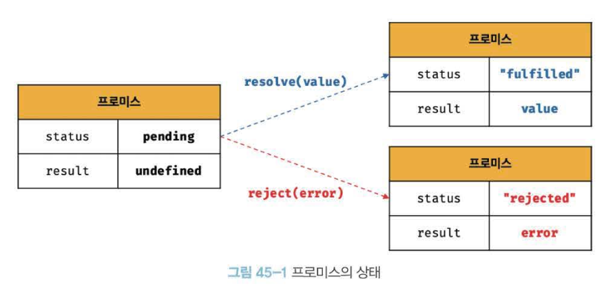

# 45Ch Promise

- 자바스크립트는 비동기 처리를 위한 하나의 패턴으로 **콜백 함수**를 사용
- 전통적인 콜백 패턴은 `콜백 헬`로 **가독성 저하**, **비동기 처리 중 발생한 에러 처리의 어려움**, **여러 개의 비동기 처리를 한 번에 처리하는 데에 한계**가 있음
- 때문에 ES6에선 비동기 처리를 위한 또 다른 패턴으로 **`프로미스`**를 도입하여 이전의 콜백패턴의 단점을 보완하며 **비동기 처리 시점을 명확**하게 표현함

## 📚 비동기 처리를 위한 콜백 패턴의 단점

### 콜백 헬

```jsx
// GET 요청을 위한 비동기 함수로, 서버의 응답 결과를 콘솔에 출력함
const get = (url) => {
  const xhr = new XHMLhttpRequest();
  xhr.open("GET", url);
  xhr.send();

  xhr.onload = () => {
    if (xhr.status === 200) {
      // 서버의 응답을 콘솔에 출력한다.
      console.log(JSON.parse(xhr.response));
    } else {
      console.error(`${xhr.status} ${xhr.statusText}`);
    }
  };
};

// id가 1인 post를 취득
get("https://jsonplaceholder.typicode.com/posts/1");
/*
{
	"userId": 1,
	"id": 1,
	"title": "sunt aut facer ...",
	"body": "quia et suscipit ..."
}
*/
```

- 비동기 get 함수가 서버의 응답 결과를 반환하게 하려면?

  - **비동기 함수**란 함수 내부에 비동기로 동작하는 코드를 포함한 함수를 의미하며, 비동기 함수를 호출하면 함수 내부의 비동기로 동작하는 코드가 완료되지 않았다 해도 기다리지 않고 즉시 종료됨. <br/>즉, **비동기 함수 내부의 비동기로 동작하는 코드는 비동기 함수가 종료된 이후에 완료됨. 따라서 비동기 함수 내부의 비동기로 동작하는 코드에서 처리 결과를 외부로 반환하거나 상위 스코프의 변수에 할당하면 기대한 대로 동작하지 않음**
  - "비동기로 처리된다"는 것은 해당 작업이 **메인 스레드**를 막지 않고 나중에 결과를 처리하도록 한다는 뜻과 같음(예를 들어, 서버에 데이터를 요청하거나 파일을 읽는 작업은 시간이 오래 걸릴 수 있음 <br/>→ 이런 작업들을 비동기로 처리시 요청이 완료될 때까지 기다리지 않고 다른 작업을 계속 진행 가능)
  - ✋🏻 비동기 작업 3가지 예시 코드

    - 콜백 함수 사용

      ```jsx
      const get = (url, callback) => {
        const xhr = new XMLHttpRequest();
        xhr.open("GET", url);
        xhr.send();

        xhr.onload = () => {
          if (xhr.status === 200) {
            callback(null, JSON.parse(xhr.response)); // 성공 시 콜백 호출
          } else {
            callback(`${xhr.status} ${xhr.statusText}`); // 실패 시 에러 전달
          }
        };
      };

      // 호출
      get("https://jsonplaceholder.typicode.com/posts/1", (error, result) => {
        if (error) {
          console.error(error);
        } else {
          console.log(result);
        }
      });
      ```

    - 프로미스(Promise) 사용

      ```jsx
      const get = (url) => {
        return new Promise((resolve, reject) => {
          const xhr = new XMLHttpRequest();
          xhr.open("GET", url);
          xhr.send();

          xhr.onload = () => {
            if (xhr.status === 200) {
              resolve(JSON.parse(xhr.response)); // 성공
            } else {
              reject(`${xhr.status} ${xhr.statusText}`); // 실패
            }
          };
        });
      };

      // 호출
      get("https://jsonplaceholder.typicode.com/posts/1")
        .then((result) => console.log(result))
        .catch((error) => console.error(error));
      ```

    - async/await 사용

      - `async` 키워드를 붙이면 해당 함수는 항상 **Promise**를 반환함
      - `return` 값은 자동으로 `Promise.resolve()`로 감싸짐

      ```jsx
      const get = async (url) => {
        const xhr = new XMLHttpRequest();
        xhr.open("GET", url);
        xhr.send();

        return new Promise((resolve, reject) => {
          xhr.onload = () => {
            if (xhr.status === 200) {
              resolve(JSON.parse(xhr.response));
            } else {
              reject(`${xhr.status} ${xhr.statusText}`);
            }
          };
        });
      };

      // 호출
      (async () => {
        try {
          const result = await get(
            "https://jsonplaceholder.typicode.com/posts/1"
          );
          console.log(result);
        } catch (error) {
          console.error(error);
        }
      })();
      ```

  - get 함수 내부의 onload 이벤트 핸들러가 비동기로 동작하므로, get 함수는 비동기 함수임 <br/>→ GET 요청을 전송하고 onload 이벤트 핸들러를 등록한 다음 undefined를 반환하고 즉시 종료됨
  - 즉, 비동기 함수인 get 함수 내부의 onload 이벤트 핸들러는 get 함수가 종료된 이후에 실행됨 <br/>→ get 함수의 onload 이벤트 핸들러에서 서버의 응답 결과를 반환하거나 상위 스코프의 변수에 할당하면 기대한 대로 동작하지 않음

- **비동기 함수는 비동기 처리 결과를 외부에 반환할 수 없고, 상위 스코프의 변수에 할당할 수도 없음**
- 비동기 함수의 처리 결과(서버의 응답 등)에 대한 후속 처리는 비동기 함수 내부에서 수행해야 함 <br/>→ 비동기 함수를 범용적으로 사용하기 위해 비동기 함수에 비동기 처리 결과에 대한 후속 처리를 수행하는 콜백 함수를 전달하는 것이 일반적임. 필요에 따라 비동기 처리가 성공하면 호출될 콜백 함수와 비동기 처리가 실패하면 호출될 콜백 함수를 전달할 수 있음
- `콜백 헬(callback hell)`: 콜백 함수를 통해 비동기 처리 결과에 대한 후속 처리를 수행하는 비동기 함수가 비동기 처리 결과를 가지고 또다시 비동기 함수를 호출하게 되어 호출 함수 호출이 중첩되어 복잡도가 높아지는 현상
  ```jsx
  get('/step1', a => {
  	get(`/step2/${a}`, b => {
  		get(`/step3/${b}`, c => {
  			get(`/step4/${c}`, d => {
  				console.log(d);
  	});
  });
  ```

### 에러 처리의 한계

```jsx
try {
  setTimeout(() => {
    throw new Error("Error!");
  }, 1000);
} catch (e) {
  // 에러를 캐치하지 못한다
  console.error("캐치한 에러", e);
}
```

- `try…catch…finally`: 에러 처리를 구현하는 방법으로, 해당 문 실행시 먼저 try 코드 블록이 실행됨. 이때 try 코드 블록에 포함된 문 중에서 에러가 발생하면 해당 에러는 `catch` 문의 **err** 변수에 전달되고 catch 블록이 실행됨. `finally` 코드 블록은 에러 발생과 상관없이 반드시 한 번 실행됨. 해당 문으로 에러를 처리하면 프로그램이 강제 종료되지 않음
- 위 예시의 try 코드 블록 내에서 호출한 setTimeout 함수는 1초 후에 콜백 함수가 실행되도록 타이머를 설정하고, 이후 콜백 함수는 에러를 발생시킴 → 하지만 해당 에러는 catch 블록에서 캐치되지않음
- 에러가 캐치되지 않는 이유는? 🧐
  - 비동기 함수인 setTimeout이 호출됨 <br/>→ setTimeout 함수의 실행 컨텍스트가 생성되어 콜 스택에 푸시되어 실행됨 <br/>
    → setTimeout은 비동기 함수이므로 콜백 함수가 호출되는 것을 기다리지 않고 즉시 종료되어 콜 스택에서 제거됨 <br/>
    → 이후 타이머 만료시 setTimeout 함수의 콜백 함수는 테스크 큐로 푸시되고 콜 스택이 비어졌을 때 이벤트 루프에 의해 콜 스택으로 푸시되어 실행됨
  - setTimeout 함수의 콜백 함수가 실행될 때 setTimeout 함수는 이미 콜 스택에서 제거된 상태임 = setTimeout 함수의 콜백 함수를 호출한 것이 setTimeout 함수가 아님
  - setTimeout 함수의 콜백 함수의 호출자가 setTimeout 함수라면 콜 스택의 현재 실행 중인 실행 컨텍스트가 콜백 함수의 실행 컨텍스트일 때 현재 실행 중인 실행 컨텍스트의 하위 실행 컨텍스트가 setTimeout 함수여야함
  - **에러는 호출자 방향으로 전파됨**. 즉, 콜 스택의 아래 방향(실행 중인 실행 컨텍스트가 푸시되기 직전에 푸시된 실행 컨텍스트 방향)으로 전파됨
  - setTimeout 함수의 콜백 함수를 호출한 것은 setTimeout 함수가 아니므로 setTimeout 함수의 콜백 함수가 발생시킨 에러는 catch 블록에서 캐치되지 않음
  - 이러한 문제 해결을 위해 ES6에서 프로미스가 도입됨

## 📚 프로미스의 생성

- Promise 생성자 함수를 new 연산자와 함께 호출하면 프로미스를 생성. ES6에서 도입된 Promise는 호스트 객체가 아닌 ECMAScript 사양에 정의된 표준 빌트인 객체
- Promise 생성자 함수는 비동기 처리를 수행할 콜백 함수를 인수로 전달받는데, 이 콜백 함수는 resolve와 reject 함수를 인수로 전달받음
  ```jsx
  const promise = new Promise((resolve, reject) => {
  	// Promise 함수의 콜백 함수 내부에서 비동기를 처리를 수행
  	if (/* 비동기 처리 성공*/) {
  		resolve('result');
  	} else { /* 비동기 처리 실패 */
  		reject('failure reason');
  	}
  });
  ```
  - Promise 생성자 함수가 인수로 전달받은 콜백 함수 내부에서 비동기 처리를 수행해야함
  - 이때, 비동기 처리가 성공하면 콜백 함수의 인수로 전달받은 resolve 함수를 호출하고, 비동기 처리가 실패하면 reject 함수를 호출함
- Promise는 비동기 처리가 어떻게 진행되고 있는지를 나타내느 상태(state) 정보를 지니며, 생성된 직후의 프로미스는 기본적으로 pending 상태에 해당함.
  | 프로미스의 상태 정보 | 의미 | 상태 변경 조건 |
  | -------------------- | ------------------------------------- | -------------------------------- |
  | pending | 비동기 처리가 아직 수행되지 않은 상태 | 프로미스가 생성된 직후 기본 상태 |
  | fulfilled | 비동기 처리가 수행된 상태(성공) | resolve 함수 호출 |
  | rejected | 비동기 처리가 수행된 상태(실패) | reject 함수 호출 |
- 이후 비동기 처리가 수행되면 비동기 처리 결과에 따라 다음과 같이 프로미스의 상태가 변경됨
  - **비동기 처리 성공**: resolve 함수를 호출해 프로미스를 fulfilled 상태로 변경
  - **비동기 처리 실패**: reject 함수를 호출해 프로미스를 rejected 상태로 변경
  - 이처럼 프로미스의 상태는 resolve 또는 reject 함수를 호출하는 것으로 결정됨
    
  - fulfilled 또는 rejected 상태를 **settled 상태**라고 하며, **`settled 상태`**는 fulfilled 또는 rejected 상태와 상관없이 pending이 아닌 상태로 비동기 처리가 수행된 상태를 의미
  - 프로미스는 pending 상태에서 fulfilled 또는 rejected 상태, 즉 settled 상태로 변화할 수 있으나, settled 상태가 되면 더는 다른 상태로 변화할 수 없음
  - 프로미스는 비동기 처리 상태와 더불어 비동기 처리 결과도 상태로 가짐
  - 비동기 처리가 실패하면 프로미스는 pending 상태에서 rejected 상태로 변화함. 그리고 비동기 처리 결과인 Error 객체를 값으로 갖는다. 즉, **_프로미스는 비동기 처리 상태와 처리 결과를 관리하는 객체임_**

## 📚 프로미스의 후속 처리 메서드

- 프로미스의 비동기 처리 상태가 변화하면 이에 따른 후속 처리가 필요함. 예를 들어, 프로미스가 fulfilled 상태 → 프로미스의 처리 결과를 가지고 무언가를 진행, 프로미스가 rejected 상태 → 프로미스의 처리 결과(에러)를 가지고 에러 처리 필요
  ⇒ 이를 위해 프로미스는 **후속 메서드 `then`, `catch`, `finally`를 제공**
- 프로미스의 비동기 처리 상태가 변화하면 후속 처리 메서드에 인수로 전달한 콜백 함수가 선택적으로 호출됨 → 이때 후속 처리 메서드의 콜백 함수에 프로미스의 처리 결과가 인수로 전달됨
- 모든 후속 처리 메서드는 프로미스를 반환하며, 비동기로 동작함

### Promise. prototype.then

- `then` 메서드는 두 개의 콜백 함수를 인수로 전달받음
  - 첫 번째 콜백 함수는 프로미스가 fulfilled 상태(resolve 함수가 호출된 상태)가 되면 호출됨. 이때 콜백 함수는 프로미스의 비동기 처리 결과를 인수로 전달받음
  - 두 번째 콜백 함수는 프로미스가 rejected 상태(rejected 함수가 호출된 상태)가 되면 호출됨. 이때 콜백 함수는 프로미스의 에러를 인수로 전달받음
- 즉, 첫 번째 콜백 함수는 비동기 처리가 성공했을 때 호출되는 성공 처리 콜백 함수이며, 두 번째 콜백 함수는 비동기 처리가 실패했을 때 호출되는 실패 처리 콜백 함수

  ```jsx
  // fulfilled
  new Promise((resolve) => resolve("fulfilled")).then(
    (v) => console.log(v),
    (e) => console.error(e)
  ); // fulfilled

  //rejected
  new Promise((_, reject) => reject(new Error("rejected"))).then(
    (v) => console.log(v),
    (e) => console.error(e)
  ); // Error: rejected
  ```

  - then 메서드는 언제나 프로미스를 반환함. 만약 then 메서드의 콜백 함수가 프로미스를 반환하면 그 프로미스를 그대로 반환하고, 콜백 함수가 프로미스가 아닌 값을 반환하면 그 값을 암묵적으로 resolve 또는 reject하여 **프로미스를 생성해 반환함**

### Promise .prototype.catch

- `catch` 메서드는 한 개의 콜백 함수를 인수로 잔달받으며, catch 메서드의 콜백 함수는 프로미스가 rejected 상태인 경우만 호출됨
  ```jsx
  // rejected
  new Promise((_, reject) => reject(new Error("rejected"))).catch((e) =>
    console.log(e)
  ); // Error: rejected
  ```
  - catch 메서드는 then(undefined, onRejected)과 동일하게 동작함. 따라서 then 메서드와 마찬가지로 언제나 프로미스를 반환함

### Promise.prototype.finally

- `finally` 메서드는 한 개의 콜백 함수를 인수로 전달받음. finally 메서드의 콜백 함수는 프로미스의 성공(fulfilled) 또는 실패(rejected)와 상관없이 무조건 한 번 호출됨
- finally 메서드는 프로미스의 상태와 상관없이 공통적으로 수행해야 할 처리 내용이 있을 때 유용함
- finally 메서드 또한 then/catch 메서드와 마찬가지로 언제나 프로미스를 반환함
  ```jsx
  // rejected
  new Promise(() => {}).finally(() => console.log("finally")); // finally
  ```

## 📚 프로미스의 에러 처리

- 비동기 처리 결과에 대한 후속 처리는 프로미스가 제공하는 후속 처리 메서드 then, catch, finally를 사용해 수행함
- 비동기 처리에서 발생한 에러는
  - then 메서드의 두 번째 콜백 함수로 처리 가능
  - catch를 사용해서도 처리 가능

## 📚 프로미스 체이닝

```jsx
const url = 'https://jsonplaceholder.typicode.com';

// id가 1인 post의 userId를 취득
promiseGet(`${url}/posts/1`)
	// 취득한 post의 userId로 user 정보를 취득
	.then({ userId }) => promiseGet(`${url}/users/${userId}`))
	.then(userInfo => console.log(userInfo))
	.catch(err => console.error(err));
```

- then, catch, finally 후속 처리 메서드는 언제나 프로미스를 반환하므로 연속적으로 호출할 수 있고, 이를 **`프로미스 체이닝`**(promise chaining)이라 함
- 후속 처리 메서드의 콜백 함수는 프로미스의 비동기 처리 상태가 변경되면 선택적으로 호출되며, 예시 코드의 경우 아래와 같이 인수를 전달받으면서 호출됨
  | 후속 처리 메서드 | 콜백 함수의 인수 | 후속 처리 메서드의 반환값 |
  | --------------------------------------- | -------------------------------------------------------------------------------------- | ----------------------------------------------------- |
  | then | promiseGet 함수가 반환한 프로미스가 resolve한 값(id가 1인 post) | 콜백 함수가 반환한 프로미스 |
  | then | 첫 번째 then 메서드가 반환한 프로미스가 resolve한 값(post의 userId로 취득한 user 정보) | 콜백 함수가 반환한 값(Undefined)을 resolve한 프로미스 |
  | catch |
  | \* 에러가 발생하지 않으면 호출되지 않음 | promiseGet 함수 또는 후속 처리 메서드가 반환한 프로미스가 reject한 값 | 콜백 함수가 반환한 값(undefined)을 resolve한 프로미스 |
- 이처럼 then, catch, finllay 후속 처리 메서드는 콜백 함수가 반환한 프로미스를 반환함. 만약 후속 처리 메서드의 콜백 함수가 프로미스가 아닌 값을 반환하더라도 그 값을 암묵적으로 resolve 또는 reject하여 프로미스를 생성해 반환함
- 프로미스는 프로미스 체이닝을 통해 비동기 처리 결과를 전달받아 후속 처리를 하므로 비동기 처리를 위한 콜백 패턴에서 발생하던 콜백 헬이 발생하지 않음. 다만 프로미스도 콜백 패턴을 사용하므로 콜백 함수를 사용하지 않는 것은 아님
- 콜백 패턴은 가독성이 나쁨 → async/await을 사용하여 프로미스의 후속 처리 메서드 없이 마치 동기 처리처럼 프로미스가 처리 결과를 반환하도록 구현 가능

  - async/await 또한 프로미스를 기반으로 동작

  ```jsx
  const url = "https://jsonplaceholder.typicode.com";

  (async () => {
    // id가 1인 post의 userId를 취든
    const { userId } = await promiseGet(`${url}/posts/1`);

    // 취득한 post의 userId로 user 정보를 취득
    const userInfo = await promiseGet(`${url}/users/${userId}`);

    console.log(userInfo);
  })();
  ```

## 📚 프로미스의 정적 메서드

- Promise는 주로 생성자 함수로 사용되지만 함수도 객체이므로 메서드를 가질 수 있으며, Promise는 5가지 정적 메서드를 제공

### Promise.resolve / Promise.reject

- 이미 존재하는 값을 래핑하여 프로미스를 생성하기 위해 사용
- Pormise.resolve 메서드는 인수로 전달받은 값을 resolve하는 프로미스를 생성
  ```jsx
  // 배열을 resolve하는 프로미스를 생성
  const resolvedPromise = Promise.resolve([1, 2, 3]);
  resolvePromise.then(console.log); // [1, 2, 3]
  ```
  위 예제는 아래 예제와 동일하게 동작
  ```jsx
  const resolvePromise = new Promise((resolve) => resolve([1, 2, 3]));
  resolvePromise.then(console.log); // [1, 2, 3]
  ```
- Promise.reject 메서드는 인수로 전달받은 값을 reject하는 프로미스를 생성함
  ```jsx
  // 에러 객체를 reject하는 프로미스를 생성
  const rejectedPromise = Promise.rejecet(new Error("Error!"));
  rejectedPromise.catch(console.log); // Error: Error!
  ```
  위 예제는 아래 예제와 동일하게 동작
  ```jsx
  const rejectedPromise = new Promise((_, reject) =>
    reject(new Error("Error!"))
  );
  rejectedPromise.catch(console.log); // Error: Error!
  ```

### Promise.all

- 여러 개의 비동기 처리를 모두 병렬 처리할 때 사용

```jsx
const requestData1 = () =>
  new Promise((resolve) => setTimeout(() => resolve(1), 3000));
const requestData2 = () =>
  new Promise((resolve) => setTimeout(() => resolve(2), 2000));
const requestData3 = () =>
  new Promise((resolve) => setTimeout(() => resolve(3), 1000));

// 세 개의 비동기 처리를 병렬로 처리
Promise.all([requestData1(), requestData2(), requestData3()])
  .then(console.log) // [1, 2, 3] => 약 3초 소요
  .catch(console.error);
```

- Promise.all 메서드는 프로미스를 요소로 갖는 배열 등의 이터러블을 인수로 전달받음
- 전달받은 모든 프로미스가 모두 fulfilled 상태가 되면 모든 처리 결과를 배열에 저장해 새로운 프로미스를 반환함
- 위 예시의 경우 Promise.all 메서드는 3개의 프로미스를 요소로 갖는 배열을 전달받았으며, 각 프로미스는 다음과 같이 동작함
  - 첫 번째 프로미스는 3초 후에 1을 resolve함
  - 두 번째 프로미스는 2초 후에 2을 resolve함
  - 세 번째 프로미스는 1초 후에 3을 resolve함
- Promise.all 메서드는 인수로 전달받은 배열의 모든 프로미스가 모두 fulfilled 상태가 되면 종료하므로, Promise.all 메서드가 종료하는 데 걸리는 시간은 가장 늦게 fulfilled 상태가 되는 프로미스의 처리 시간보다 조금 더 긺
- 위의 예시의 경우 모든 처리에 걸리는 시간은 가장 늦게 fulfilled 상태가 되는 첫 번째 프로미스의 처리 시간인 3초보다 조금 더 소요됨
- 모든 프로미스가 fulfilled 상태가 되면 resolve 된 처리 결과(위 예시의 경우 1, 2, 3)를 모두 배열에 저장해 새로운 프로미스를 반환함. <br/>
  이때 첫 번째 프로미스가 가장 나중에 fulfileed 상태가 되어도 Promise.all 메서드는 첫 번째 프로미스가 resolve한 처리 결과부터 차례대로 배열에 저장해 그 배열을 resolve하는 새로운 프로미스를 반환함. 즉, 처리 순서가 보장됨
- Promise.all 메서드는 인수로 전달받은 배열의 프로미스가 하나라도 rejected 상태가 되면 나머지 프로미스가 fulfilled 상태가 되는 것을 기다리지 않고 즉시 종료함

### Promise.race

- Promise.all 메서드와 동일하게 프로미스를 요소로 갖는 배열 등의 이터러블을 인수로 전달 받음
- Promise.race 메서드는 Promise.all 메서드처럼 모든 프로미스가 fulfilled 상태가 되는 것을 기다리는 것이 아니라 가장 먼저 fulfilled 상태가 된 프로미스의 처리 결과를 resolve하는 새로운 프로미스를 반환함
  ```jsx
  Promise.race([
    new Promise((resolve) => setTimeout(() => resolve(1), 3000)), // 1
    new Promise((resolve) => setTimeout(() => resolve(2), 2000)), // 2
    new Promise((resolve) => setTimeout(() => resolve(3), 1000)), // 3
  ])
    .then(console.log) // 3
    .catch(console.log);
  ```
- 프로미스가 rejected 상태가 되면 Promise.all 메서드와 동일하게 처리됨. 즉, Promise.race 메서드에 전달된 프로미스가 하나라도 rejected 상태가 되면 에러를 reject하는 새로운 프로미스를 즉시 반환함

### Promise.allSettled

- 프로미스를 요소로 갖는 배열 등의 이터러블을 인수로 전달받으며, 전달받은 프로미스가 모두 settled 상태(비동기 처리가 수행된 상태, 즉 fulfilled 또는 rejected 상태)가 되면 처리 결과를 배열로 반환함
- Promise.allsettled 메서드가 반환한 배열에는 fulfilled 또는 rejected 상태와는 상관없이 Promise.allSettled 메서드가 인수로 전달받은 모든 프로미스들의 처리 결과가 모두 담겨 있으며, 프로미스의 처리 결과를 나타내는 객체는 아래와 같음
  - 프로미스가 fulfilled 상태인 경우 비동기 처리 상태를 나타내는 status 프로퍼티와 처리 결과를 나타내는 value 프로퍼티를 가짐
  - 프로미스가 rejected 상태인 경우 비동기 처리를 나타내는 status 프로퍼티와 에러를 나타내는 reason 프로퍼티를 가짐

## 📚 마이크로태스크 큐

```jsx
setTimeout(() => console.log(1), 0);

Promise.resolve()
  .then(() => console.log(2))
  .then(() => console.log(3));
```

- 위 코드의 결과는 1 → 2 → 3이 아닌 2 → 3 → 1 순으로 출력되며, 이유는 프로미스의 후속 처리 메서드의 콜백 함스는 태스크 큐가 아니라 `마이크로태스크 큐`에 저장되기 때문
- `마이크로태스크 큐`
  - 태스크 큐와 별도의 큐로, 프로미스의 후속 처리 메서드의 콜백 함수가 일시 저장되며 그 외의 비동기 함수의 콜백 함수나 이벤트 핸들러는 태스크 큐에 일시 저장됨
  - 콜백 함수나 이벤트 핸들러를 일시 저장한다는 점에서 태스크 큐와 동일하지만 **마이크로태스크 큐는 태스크 큐보다 우선 순위가 높음**. <br/>
    즉, 이벤트 루프는 콜 스택이 비면 먼저 마이크로태스크 큐에서 대기하고 있는 함수를 가져와 실행하고, 이후 마이크로태스크 큐가 비면 태스크 큐에서 대기하고 있는 함수를 가져와 실행함

## 📚 fetch

- HTTP 요청 전송 기능을 제공하는 클라이언트 사이드 Web API로, XMLHttpRequest 객체보다 사용법이 간단하고 프로미스를 지원하기 때문에 비동기 처리를 위한 콜백 패턴의 단점에서 자유로움
- 인터넷 익스폴러를 제외한 대부분의 모던 브라우저에서 제공함
- HTTP 요청을 전송할 URL과 HTTP 요청 메서드, HTTP 요청 헤더, 페이로드 등을 설정한 객체를 전달함
  ```jsx
  const promise = fetch(url [, options])
  ```
- fetch 함수는 HTTP 응답을 나타내는 Response 객체를 래핑한 Pormise 객체를 반환
  ```jsx
  fetch("https://jsonplaceholder.typicode.com/todos/1").then((response) =>
    console.log(response)
  );
  ```
  - fetch 함수는 HTTP 응답을 나타내는 Response 객체를 래핑한 프로미스를 반환하므로 후속 처리 메서드 then을 통해 프로미스가 resolve한 Reponse 객체를 전달받을 수 있음
  - Response 객체는 HTTP 응답을 나타내는 다양한 프로퍼티를 제공함
- fetch 함수에 첫 번째 인수로 HTTP 요청을 전송할 URL과 두 번째 인수로 HTTP 요청 메서드, HTTP 요청 헤더, 페이로드 등을 설정한 객체를 전달함
  1. **GET** 요청
  ```jsx
  request
    .get("https://jsonplaceholder.typicode.com/todos/1")
    .then((response) => response.json())
    .then((todos) => console.log(todos))
    .catch((err) => console.error(err));
  // {userId: 1, id:1, title: 'delectus aut autem", completed: false}
  ```
  2. **POST** 요청
  ```jsx
  request
    .post("https://jsonplaceholder.typicode.com/tods", {
      userId: 1,
      title: "JavaScript",
      completed: false,
    })
    .then((response) => response.json())
    .then((todos) => console.log(todos))
    .catch((err) => console.error(err));
  // {userId: 1, title: "JavaScript", completed: false, id: 201}
  ```
  3. **PATCH**
  ```jsx
  request
    .patch("https://jsonplaceholder.typicode.com/todos/1", {
      completed: true,
    })
    .then((response) => response.json())
    .then((todos) => console.log(todos))
    .catch((err) => console.error(err));
  // {userId: 1, id: 1, title: "delectus aut autem", completed: true}
  ```
  4. **DELETE**
  ```jsx
  request
    .delete("https://jsonplaceholder.typicode.com/todos/1")
    .then((response) => response.json())
    .then((todos) => console.log(todos))
    .catch((err) => console.error(err));
  // {}
  ```

# 46Ch 제너레이터와 async/await

## 📚 제너레이터란?

- 코드 블록의 실행을 일시 중지했다가 필요한 시점에서 재개할 수 있는 특수한 함수로 아래와 같은 특성이 있음
  1. **제너레이터 함수는 함수 호출자에게 함수 실행의 제어권을 양도할 수 있음**
     - 일반 함수 호출시 제어권이 함수에게 넘어가고 함수 코드를 일괄 실행함. 즉, 함수 호출자는 함수를 호출한 이후 함수 실행을 제어할 수 없음. 제너레이터 함수는 함수 실행을 함수 호출자가 제어할 수 있음
  2. **제너레이터 함수는 함수 호출자와 함수의 상태를 주고받을 수 있음**
     - 일반 함수를 호출하면 매개변수를 통해 함수 외부에서 값을 주입받고 함수 코드를 일괄 실행하여 결과값을 함수 외부로 반환함. <br/>
       즉, 함수가 실행되고 있는 동안에는 함수 외부에서 함수 내부로 값을 전달하여 함수의 상태를 변경할 수 없음
  3. **제너레이터 함수를 호출하면 제너레이터 객체를 반환**
     - 일반 함수를 호출하면 함수 코드를 일괄 실행하고 값을 반환함. 제너레이터 함수를 호출하면 함수 코드를 실행하는 것이 아니라 이터러블이면서 동시에 이터레이터인 제너레이터 객체를 반환함

## 📚 제너레이터 함수의 정의

- `function\* `키워드로 선언하며 하나 이상의 yield 표현식을 포함함
- 화살표 함수로 저으이 불가
- new 연산자와 함께 생성자 함수로 호출할 수 없음

## 📚 제너레이터 객체

- 제너레이터 함수 호출시 일반 함수처럼 함수 코드 블록을 실행하는 것이 아니라 제너레이터 객체를 실행해 반환
- 제너레이터 함수가 반환한 제너레이터 객체는 이터러블이면서 동시에 이터레이터임
- 이터레이터에는 없는 return, throw 메서드를 가짐

## 📚 async/await

- 제너레이터를 사용해 비동기 처리를 동기 처리처럼 간단하게 동작하도록 구현할 수 있는 async/await이 ES8부터 도입됨
- async/await은 프로미스를 기반으로 동작하며, 사용시 프로미스의 then/catch/finally 후속 처리 메서드에 콜백 함수를 전달해서 비동기 처리 결과를 후속 처리할 필요 없이 마치 동기 처리처럼 프로미스 사용이 가능함
- 즉, 프로미스의 후속 처리 메서드 없이 마치 동기 처리처럼 프로미스가 처리 결과를 반환하도록 구현할 수 있음

  ```jsx
  const fetch = require("node-fetch");

  async function fetchTodo() {
    const url = "https://jsonplaceholder.typicode.com/todos/1";

    const response = await fetch(url);
    const todo = await response.json();
    console.log(todo);
  }

  fetchTodo();
  ```

### async 함수

- await 키워드는 반드시 async 함수 내부에서 사용해야하며, async 함수는 async 키워드를 사용해 정의하고 언제나 **프로미스를 반환**함
- async 함수가 명시적으로 프로미스를 반환하지 않더라도 암묵적으로 반환값을 resolve하는 프로미스를 반환함
- 클래스의 constructor 메서드는 async 메서드가 될 수 없음 → **constructor** 메서드는 **인스턴스를 반환**해야 하지만 **async**는 언제나 **프로미스를 반환**하기 때문

  ```jsx
  class MyClass {
  	async constructor() { }
  	// SyntaxError: Class constructor may not be an async method
  }

  const myClass = new MyClass();
  ```

### await 키워드

- 프로미스가 settled 상태(비동기 처리가 수행된 상태)가 될 때까지 대기하다가 settled 상태가 되면 프로미스가 **resolve**한 처리 결과를 반환함

  ```jsx
  const fetch = require("node-fetch");

  const getGithubUserName = async (id) => {
    const res = await fetch(`https://api.github.com/users/${id}`); // 1
    const { name } = await res.json(); // 2
    console.log(name); // Ugmo Lee
  };

  getGithubUserName("ungmo2");
  ```

  - 1의 fetch 함수가 수행한 HTTP 요청에 대한 서버의 응답이 도착해서 fetch 함수가 반환한 프로미스가 settled 상태가 될 때까지 1은 대기함
  - 이후 **프로미스가 settled 상태가 되면 프로미스가 resolve한 처리 결과가 res 변수에 할당**

- await 키워드는 반드시 프로미스 앞에서 사용해야함
- 모든 프로미스에 await 키워드 사용은 주의해야함(비동기 처리의 처리 순서 보장이 필요한 경우 키워드를 사용하여 순차적으로 처리)

### 에러 처리

- async/await에서 어리 처리는 try…catch 사용이 가능 → 콜백 함수를 인수로 전달받는 비동기 함수와는 달리 프로미스를 반환하는 비동기 함수는 명시적으로 호출할 수 있기 때문에 호출자가 명확함
- async 함수 내에서 catch 문을 사용해서 에러 처리를 하지 않으면 async 함수는 발생한 에러를 reject하는 프로미스를 반환 → async 함수를 호출하고 Promise.prototype.catch 후속 처리 메서드를 사용해 에러 캐치 가능

# 47Ch 에러 처리

## 📚 에러 처리의 필요성

- try…catch 문을 사용해 발생한 에러에 적절하게 대응하면 프로그램이 강제 종료되지 않고 계속해서 코드를 실행시킬 수 있음
- 직접적으로 에러를 발생하지는 않는 예외적인 상황이 발생할 수도 있으며, 예외적인 상황에 적절하게 대응하지 않으면 에러로 이어질 가능성이 큼

## 📚 try…catch… finally 문

- if 문이나 옵셔널 체이닝 연산자를 통해 예외를 확인하는 방법과 해당 방법이 존재
- 일반적으로 이 방법을 에러 처리(error handling)라고 칭함
- 다음과 같이 3개의 코드 블록으로 구성되며, finally 문은 불필요하면 생략이 가능
  ```jsx
  try {
    // 실행할 코드(에러가 발생할 가능성이 있는 코드)
  } catch (err) {
    // try 코드 블록에서 에러가 발생하면 이 코드 블록의 코드가 실행됨
    // err에는 try 코드 블록에서 발생한 Error 객체가 전달됨
  } finally {
    // 에러 발생과 상관없이 반드시 한 번 실행됨
  }
  ```
  - **`try`** 코드 블록에 포함된 문 중에서 에러가 발생하면 발생한 에러는 catch ``문의 **err** 변수에 전달되고 catch 코드 블록이 실행됨
  - **`catch`** 문의 err 변수(변수명 상관 x)는 try 코드 블록에 포함된 문 중에서 에러가 발생하면 생성되고 catch 코드 블록에서만 유효함
  - **`finally`** 코드 블록은 에러 발생과 상관없이 반드시 한 번 실행됨
  - try…catch…finally 문으로 에러를 처리하면 프로그램이 강제 종료되지 않음

## 📚 Error 객체

- Error 생성자 함수는 에러 객체를 생성하며, 에러를 상세히 설명하는 에러 메시지를 인수로 전달할 수 있음
  ```jsx
  const error = new Error("invalid");
  ```
- **`Error 생성자 함수`**가 생성한 에러 객체는 **message** 프로퍼티와 **stack** 프로퍼티를 가짐
  - `message` 프로퍼티의 값은 Error 생성자 함수에 인수로 전달한 에러 메시지
  - `stack` 프로퍼티의 값은 에러를 발생시킨 콜스택의 호출 정보를 나타내는 문자열이며 디버깅 목적으로 사용
- 자바스크립트는 Error 생성자 함수를 포함해 7가지의 에러 객체를 생성할 수 있는 Error 생성자 함수를 제공하며, SyntaxError, ReferenceError, TypeError, RangeError, URIError, EvalError 생성자 함수가 생성한 에러 객체의 프로토타입은 모두 Error.prototype을 상속받음
  | 생성자 함수 | 인스턴스 |
  | -------------- | ------------------------------------------------------------------------------ |
  | Error | 일반적 에러 객체 |
  | SyntaxError | 자바스크립트 문법에 맞지 않는 문을 해석할 때 발생하는 에러 객체 |
  | ReferenceError | 참조할 수 없는 식별자를 참조했을 때 발생하는 에러 객체 |
  | TypeError | 피연산자 또는 인수의 데이터 타입이 유효하지 않을 때 발생하는 에러 객체 |
  | RangeError | 숫자값의 허용 범위를 벗어났을 때 발생하는 에러 객체 |
  | URIError | encodeURI 또는 decodeURI 함수에 부적절한 인수를 전달했을 떄 발생하는 에러 객체 |
  | EvalError | eval 함수에서 발생하는 에러 객체 |

## 📚 throw 문

- 에러 객체 생성 ≠ 에러 발생
  ```jsx
  try {
    // 에러 객체를 생성한다고 에러가 발생하는 것은 아님
    new Error("something wrong");
  } catch (error) {
    console.log(error);
  }
  ```
- 에러를 발생시키려면 try 코드 블록에서 throw 문으로 에러 객체를 던져야함 `throw 표현식;`
- throw 문의 **표현식**은 어떤 값이라도 상관이 없으나 일반적으로 **에러 객체**를 지정 <br/>
  → 에러를 던지면 catch 문의 에러 변수가 생성되고 던져진 에러 객체가 할당되어 catch 코드 블록이 실행되기 시작
  ```jsx
  try {
    // 에러 객체를 던지면 catch 코드 블록이 실행되기 사작
    throw new Error("something wrong");
  } catch (error) {
    console.log(error);
  }
  ```
- throw된 에러를 캐치하지 않으면 호출자 방향으로 전파됨
- setTimeout과 같은 비동기 함수나 프로미스 후속 처리 메서드의 콜백 함수는 호출자가 없음 <br/>
  → 에러를 전파할 호출자가 존재하지 않음

# 48Ch 모듈

## 📚 모듈의 일반적인 의미

- **`모듈`**: 애플리케이션을 구성하는 개별적 요소로서 재사용 가능한 코드 조각을 의미
  - 일반적으로 기능을 기준으로 파일 단위로 분리함. 이때 모듈이 성립하려면 모듈은 자신만의 **파일 스코프**(모듈 스코프)를 가질 수 있어야함
  - 자신만의 파일 스코프를 갖는 모듈의 모든 자산은 캡슐화되어 다른 모듈에서 접근할 수 없음. 즉, **모듈은 개별적 존재로서 애플리케이션과 분리되어 존재**
- 모듈은 애플리케이션이나 다른 모듈에 의해 **재사용**되어야 의미가 있음 <br/>
  → 공개가 필요한 자산에 한정하여 명시적으로 **선택적 공개**가 가능하며, 이를 **`export`**라 함
- 공개된 모듈의 자산은 다른 모듈에서 재사용이 가능하며, 모듈 사용자는 모듈이 공개한 자산 중 일부 또는 전체를 선택해 **자신의 스코프 내로 불러들여 재사용이 가능**하고 이를 **`import`**라 함
- 코드의 단위를 명확히 분리하여 애플리케이션을 구성할 수 있고, 재사용성이 좋아 개발 효율성과 유지보수성을 높일 수 있음

## 📚 자바스크립트와 모듈

- JS는 모듈 시스템을 지원하지 않았음 = import, export를 지원하지 않았었음
- 브라우저 환경에 국한하지 않고 범용적으로 사용하기 위한 움직임이 생기면서 모듈 시스템이 반드시 해결해야 하는 핵심 과제가 되었고, CommonJS와 AMD가 제안됨

## 📚 ES6 모듈(ESM)

- script 태그에 `type=’module’` 어트리뷰트를 추가하면 로드된 자바스크립트 파일은 모듈로서 동작함
