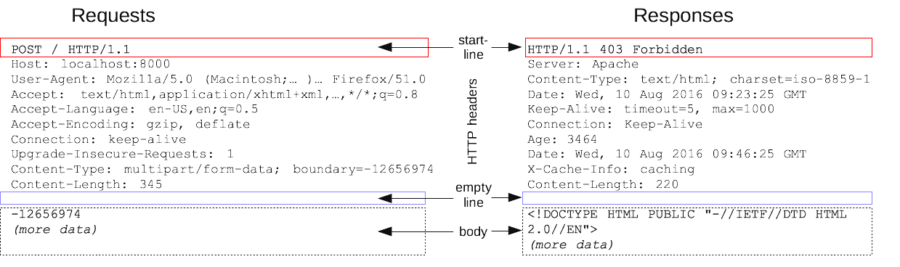
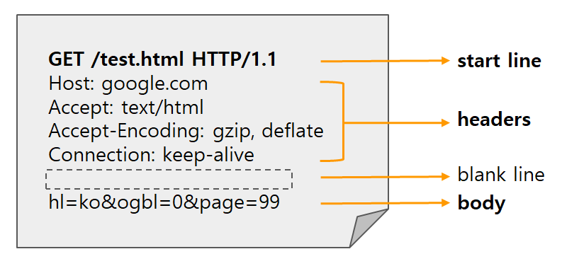

## http 통신, request와 response의 개념

### HTTP(HyperText Transfer Protocol)

- HTTP는 하이퍼텍스트(HTML) 문서와 같은 리소스들을 가져와 데이터들을 교환하기 위한 주된 프로토콜을 의미해요
- HTTP는 웹에서 이루어지는 모든 데이터 교환의 기초이며, **클라이언트-서버 프로토콜**이기도 하며, 요청이 초기화되는 프로토콜을 의미해요
- 기본적인 작동방식은 클라이언트(보통 웹 브라우저)가 서버에 요청(request)을 보내고, 서버가 이 요청에 대한 응답(response)을 반환하는 방식이에요
- TCP/IP 기반

> **프로토콜**<br/>
> 컴퓨터 내부에서, 또는 컴퓨터 사이에서 데이터의 교환 방식을 정의하는 규칙 체계

> **TCP/IP**<br/>
> 다양한 하위 프로토콜로 구성되어 있으며, 이는 인터넷의 기능을 다양화하고 확장하는 데 기여해요.
> 예를 들어, HTTP와 같은 프로토콜들은 모두 TCP/IP 위에서 동작하며, 각각 웹 페이지 전송, 파일 전송, 등의 기능을 담당합니다.<br/><br/>
> 이메일 전송은 이를 기반으로한 프로토콜 SMTP이고 연결지향적이에요!

### 무상태(Stateless)

HTTP는 상태를 저장하지 않는데 이는 곧 서버가 클라이언트의 이전 상태를 보존하지 않는다는 것을 의미해요.마치 쿠키나 토큰 등을 통해 내가 누구인지 인증을 하기 위해 요청을 하는 것처럼요!

→ 각 HTTP 요청이 필요한 모든 정보를 포함해야 하며, 각 요청을 별개로 처리해야 해요

- 장점
  - 단순성 및 확장성: 서버가 클라이언트 상태를 유지할 필요가 없으므로, 구현이 단순하고 서버 자원을 효율적으로 관리할 수 있음
  - 서버 부하 감소: 클라이언트의 상태 정보를 저장하고 관리할 필요가 없으므로, 서버의 부하가 감소함
- 단점
  - 기능 제한: 클라이언트와 서버 간의 지속적인 상태를 유지하기 위해서는 각 요청에 상태 정보를 포함해야 하며, 이는 추가적인 데이터 전송량을 필요로 함

### 비연결성(Connectionless)

클라이언트가 서버에 요청을 하고 응답을 받으면 바로 그 요청에 대해 응답을 한 후 연결을 끊어 유지 하지 않는 것을 의미해요. 즉, 서버는 응답을 완료한 후 즉시 연결을 종료하며, 각 요청/응답 사이클이 끝날 때마다 연결이 해제돼요

한 번 한 번 요청을 보낼 때 요청에 연관관계가 없다는 것은 마치 이와 같아요. 서버 입장에서는 a가 요청하고 b가 요청한 다음 다시 a가 들어와도 누가 누군지 모르는 것과 같이요!

- 장점
  - 서버 자원 절약: 동시에 많은 클라이언트를 처리할 수 있으며, 각 클라이언트와의 연결을 지속적으로 유지할 필요가 없음
- 단점
  - 성능: 각 요청마다 새로운 연결이 필요하므로 연결 설정에 추가적인 시간이 소요될 수 있음

⇒ 따라서 무상태와 비연결성은 서**버의 간단한 구현**, **자원 사용의 효율성**과 **높은 확장성**을 가능하게 한다고 볼 수 있어요

### request, response

- 클라이언트와 서버들은 개별적인 메시지 교환에 의해 통신
- request: 브라우저인 클라이언트에 의해 전송되는 메시지를 요청
  (브라우저는 항상 요청을 보내는 개체이기도 해요!)
- response: request에 대해 서버에서 응답으로 전송되는 메시지 응답




ex) HTTP Request Message

**start line**

```
GET /test.html HTTP/1.1
[HTTP Method] [Request target] [HTTP version]
```

- HTTP method: 메서드별로 서버에 대한 특정한 종류의 작업을 의미

  - `GET`: **_존재하는 자원에 대한 요청_**으로 데이터를 검색하는 데 사용되며, 데이터를 변경하지 않음
  - `POST`: **_새로운 자원을 전송할 때 사용_**되며, 주로 폼 데이터를 서버에 제출시 및 새로운 데이터를 생성시 사용
  - `PUT`: **_존재하는 자원에 대한 변경_**으로 서버에 파일을 업로드하거나 자원을 업데이트할 때 사용
    - PUT 요청은 대상 자원이 이미 존재한다면 업데이트하고, 존재하지 않는다면 새로 생성
  - `DELETE`: **_존재하는 자원에 대한 삭제_**
  - `PATCH`: 자원의 전체가 아닌 **_일부분만 수정_**할 때 사용
  - `+@`
  - 그치만 ,,기술적으로 그러도록 제한이 되어있는건 아니라는 거! 예시로 POST 요청인데 데이터를 지우게 만드는것도 기술적으로 불가능하지 않듯 말이에요

  ```json
  // user가 123인 사용자의 '이메일 주소만' 새로 변경하기 위해 보내는 요청과 같아요
  // 아래에 있는 요청 본문에는 변경하고자 하는 데이터의 일부만 포함되어 있어요

  PATCH /user/123 HTTP/1.1
  Host: hyein.com
  Content-Type: application/json

  {
    "email": "hyeinee@hyein.com"
  }
  ```

- Request target: HTTP Request가 전송되는 목표 주소
- version: version에 따라 Request 메시지 구조나 데이터가 다를 수 있어서 version을 명시

**headers**

- 클라이언트와 서버가 요청 또는 응답으로 부가적인 정보를 전송할 수 있도록 해주는 역할
- 해당 request에 대한 추가 정보를 담고있는 부분을 의미
  - Host: 요청하려는 서버 호스트 이름과 포트 번호
  - Accept: 클라이언트가 처리 가능한 미디어 타입 종류 나열
  - Authorization: 인증 토큰을 서버로 보낼 때 쓰이는 Header
    (tmi. 인증과 관련된 건 이를 통해 보내자 한 것일뿐 기술적으로는 사실 보내지 않아도 됩니당)
  - Cookie: 클라이언트와 서버 간의 상태 정보를 저장하고 전송하는 데 사용되며, 쿠키 값은 key-value로 표현. _서버 컨트롤이 가능한 유일한 헤더예요_

**body**

- HTTP request가 전송하는 데이터를 담고있는 부분
- body에 담긴 데이터는 HTTP 요청 또는 응답과 관련된 내용을 담고있음
- GET요청은 body가 필요 없음(GET요청시 리소스는 절대 변하면 안돼요!)
- 사용 목적에 따라 다르게 불림

  - `메시지 바디(message body)`
    - 일반적으로 HTTP 요청이나 응답의 본문을 가리키는 데 사용됨. 데이터의 실제 내용을 담고 있으며, 이 내용은 HTTP 헤더에 지정된 '**Content-Type**'에 따라 형식이 결정
  - `요청 바디(request body)`

    - 클라이언트가 서버로 보내는 데이터(예: POST 메소드를 사용하여 제출된 폼 데이터, PUT 요청으로 전송된 파일 등)를 포함

    ```json
    //사용자가 JSON 형식으로 사용자 정보를 등록하는 API에 POST 요청을 보내는 상황

    POST /api/users HTTP/1.1
    Host: [example.com](http://example.com/)
    **Content-Type**: application/json
    Content-Length: 53

    { //요청 바디
    "username": "hyein",
    "email": "hyein@example.com",
    "age": 26
    }
    ```

  - `응답 바디(response body)`

    - HTTP 응답에서 메시지 바디의 내용을 가리키며, 서버가 클라이언트에게 보내는 데이터(예: 웹 페이//지, 이미지, API 호출 결과 등)를 포함

    ```json
    //서버가 JSON 형식으로 사용자 정보를 응답하는 상황

    HTTP/1.1 200 OK
    **Content-Type**: application/json
    Content-Length: 68

    { //응답 바디
      "username": "hyein",
      "email": "hyein@example.com",
      "age": 26,
      "status": "active"
    }
    ```

> 🔥 여기서 잠깐!<br> **`Content-Type`** 이란?
> 클라이언트에게 반환된 컨텐츠의 유형이 실제로 무엇인지를 알려줘요. 즉, 자원의 형식을 명시하기 위해 헤더에 실리는 정보라고 할 수 있어요

```json
//Request
POST /api/data HTTP/1.1 //요청 라인
Host: example.com
**Content-Type**: application/json
//현재 예시에서는 클라이언트가 서버로 JSON형식의 데이터를 전송하고 있음을 알 수 있어요

{
  "name": "John Doe",
  "age": 30
}

//Response
HTTP/1.1 200 OK
**Content-Type**: application/json
//서버가 클라이언트로 JSON 형식의 응답 데이터를 보내고 있음을 알 수 있어요

{
  "status": "success",
  "message": "Data received successfully"
}

```

### HTTP 상태 코드

HTTP 응답 상태 코드는 특정 HTTP 요청이 성공적으로 완료되었는지 알려줘요. 응답은 5개의 그룹으로 나뉘며 `정보를 제공하는 응답`, `성공적인 응답`, `리다이렉트`, `클라이언트 에러`, `서버 에러`로 구분이 돼요.

- 1xx : 정보 응답
  - 100(Continue): 지금까지의 상태가 괜찮으며 클라이언트가 계속해서 요청을 하거나 이미 요청을 완료한 경우에는 무시해도 되는 것을 알려줘요
  - 101(Switching Protocol): 서버가 클라이언트가 요청한 프로토콜 변경을 승인했음을 나타내요
  - 102(Processing): 서버가 요청을 수신하였으며 이를 처리하고 있지만, 아직 제대로 된 응답을 알려줄 수 없음을 의미해요
- 2xx: 성공 응답
  - 200(OK): 요청이 성공적으로 수행되었음을 의미해요
  - 201(Created): 요청이 성공적이었으며 그 결과로 새로운 리소스가 생성되었음을 알려줘요. 이 응답은 일반적으로 POST 요청 또는 일부 PUT 요청 이후에 따라와요
  - 204(No Content): 요청에 대해서 보내줄 수 있는 콘텐츠가 없지만, 헤더는 의미있을 수 있음을 알려줘요. 사용자-에이전트는 리소스가 캐시된 헤더를 새로운 것으로 업데이트 할 수 있어요
- 3xx: 리다이렉션 메시지
  - 301(Moved Permanently): 요청한 리소스가 영구적으로 새 위치로 이동했음을 나타내요
  - 302(Found): 요청한 리소스가 일시적으로 다른 URI로 변경되었음을 나타내요
  - 304(Not Modified): 이전에 방문했던 리소스가 변경되지 않았으므로, 캐시된 데이터를 사용할 수 있음을 나타내요
- 4xx: 클라이언트 오류
  - 400(Bad Request): 서버가 요청을 이해하지 못했음을 나타내요
  - 401(Unauthorized): 요청이 인증을 필요로 함을 나타내요
  - 403(Forbidden): 서버가 요청을 이해했으나, 승인을 거부함을 나타내요
  - 404(Not Found): 서버가 요청한 리소스를 찾을 수 없음을 나타내요
- 5xx: 서버 오류
  - 500(Internal Server Error): 서버가 요청을 처리할 수 없음을 나타내요
  - 503(Service Unavailable): 서버가 일시적으로 요청을 처리할 준비가 되어 있지 않음을 나타내요. 일반적으로 임시저인 과부하나 유지보수 때문에 발생하기도 해요

⇒ [추가적인 상태를 더 확인을 하고싶다면?!(click)](https://developer.mozilla.org/ko/docs/Web/HTTP/Status)

### API(Application Programming Interface)

소프트웨어간의 상호작용을 가능하게 하는 규칙, 프로토콜과 같아요

- API에서 Application은 고유한 기능을 가진 모든 소프트웨어, Interface는 두 애플리케이션 간의 서비스 계약과 비슷하다고 볼 수 있어요

> 💡 **REST & REST API**
> `REST`는 Representational State Transfer의 줄임말로 네트워크 자원을 정의하고 처리하는 방법 전반을 의미해요

- 웹의 기존 기술과 HTTP 프로토콜을 그대로 활용을 할 수 있기 때문에 웹의 장점을 최대한 사용할 수 있는 **아키텍처 스타일 -** 네트워크상에서 클라이언트와 서버 사이의 통신 방식 중 하나
- 자원(URI), 행위(HTTP Method), 표현으로 구성이 되어있음
  → `자원:` 클라이언트는 URI를 이용해서 자원을 지정하고 해당 자원에 대한 조작을 서버에 요청
  → `행위:` HTTP 프로토콜의 Method를 사용하며 GET, POST, PUT, DELETE와 같은 메서드를 제공
  → `표현:` 클라이언트가 자원의 상태 혹은 정보에 대한 조작을 요청하면 서버는 이에 적절한 응답을 보내며, JSON 혹은 XML를 통해 데이터를 주고 받는 것이 흔함

✋🏻 JSON은 JavaScript Object Notation라는 의미로 데이터를 저장하거나 전송할 때 많이 사용되는 경량의 Data 교환 형식이에요! key와 value가 존재할 수 있으며 key값이나 문자열은 항상 “”를 이용해서 표시해요

`REST API`는 REST 기반으로 서비스 API를 구현해둔 것을 의미해요. 즉, REST API는 **HTTP를 잘 활용하기 위한 원칙**이라고 할 수 있어요
